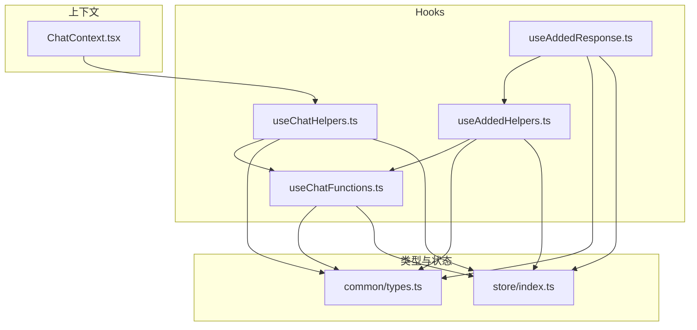
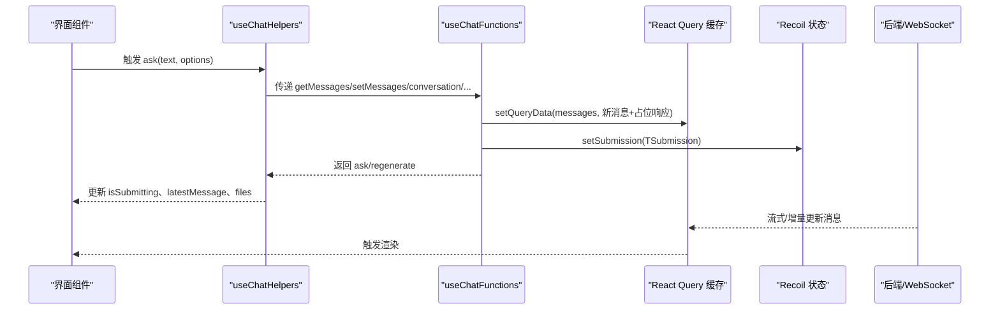
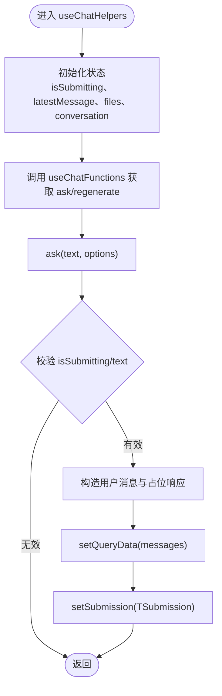
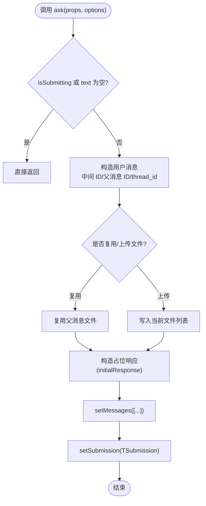
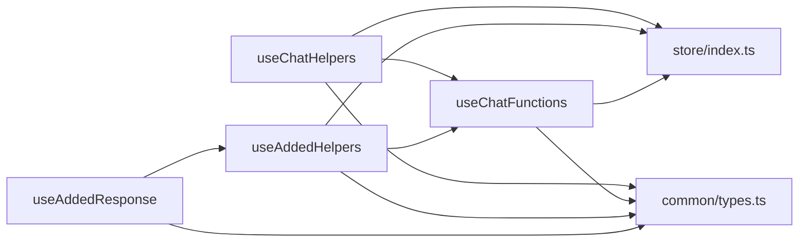

# 聊天相关 Hook

<cite>
**本文引用的文件**
- [src/frontend/client/src/hooks/Chat/useChatHelpers.ts](file://src/frontend/client/src/hooks/Chat/useChatHelpers.ts)
- [src/frontend/client/src/hooks/Chat/useChatFunctions.ts](file://src/frontend/client/src/hooks/Chat/useChatFunctions.ts)
- [src/frontend/client/src/hooks/Chat/useAddedHelpers.ts](file://src/frontend/client/src/hooks/Chat/useAddedHelpers.ts)
- [src/frontend/client/src/hooks/Chat/useAddedResponse.ts](file://src/frontend/client/src/hooks/Chat/useAddedResponse.ts)
- [src/frontend/client/src/Providers/ChatContext.tsx](file://src/frontend/client/src/Providers/ChatContext.tsx)
- [src/frontend/client/src/common/types.ts](file://src/frontend/client/src/common/types.ts)
- [src/frontend/client/src/store/index.ts](file://src/frontend/client/src/store/index.ts)
</cite>

## 目录
1. [引言](#引言)
2. [项目结构](#项目结构)
3. [核心组件](#核心组件)
4. [架构总览](#架构总览)
5. [详细组件分析](#详细组件分析)
6. [依赖关系分析](#依赖关系分析)
7. [性能考量](#性能考量)
8. [故障排查指南](#故障排查指南)
9. [结论](#结论)
10. [附录](#附录)

## 引言
本技术文档聚焦于 Bisheng 前端聊天相关的自定义 Hook，系统性阐述 useChatHelpers、useChatFunctions、useAddedHelpers、useAddedResponse 的设计模式与实现原理，覆盖聊天状态管理、消息发送与编辑、继续生成、重试再生、停止生成等实时交互流程；并给出参数接口、返回值结构、使用约束、组合使用模式、性能优化策略与调试技巧，以及与后端提交流（含 WebSocket）的协作关系与最佳实践。

## 项目结构
聊天 Hook 所在位置与周边模块关系如下：
- Hooks 层：位于前端客户端 hooks/Chat 下，提供 useChatHelpers、useChatFunctions、useAddedHelpers、useAddedResponse 四个核心 Hook
- 上下文层：ChatContext 将 useChatHelpers 的返回值注入上下文，便于子树共享
- 类型与状态：common/types.ts 定义消息、会话、请求参数等类型；store 提供基于 Recoil 的状态家族（如 filesByIndex、messages、submission 等）

图表来源
- [src/frontend/client/src/hooks/Chat/useChatHelpers.ts](file://src/frontend/client/src/hooks/Chat/useChatHelpers.ts#L1-L253)
- [src/frontend/client/src/hooks/Chat/useChatFunctions.ts](file://src/frontend/client/src/hooks/Chat/useChatFunctions.ts#L1-L366)
- [src/frontend/client/src/hooks/Chat/useAddedHelpers.ts](file://src/frontend/client/src/hooks/Chat/useAddedHelpers.ts#L1-L129)
- [src/frontend/client/src/hooks/Chat/useAddedResponse.ts](file://src/frontend/client/src/hooks/Chat/useAddedResponse.ts#L1-L40)
- [src/frontend/client/src/Providers/ChatContext.tsx](file://src/frontend/client/src/Providers/ChatContext.tsx#L1-L6)
- [src/frontend/client/src/common/types.ts](file://src/frontend/client/src/common/types.ts#L287-L307)
- [src/frontend/client/src/store/index.ts](file://src/frontend/client/src/store/index.ts#L1-L33)

章节来源
- [src/frontend/client/src/hooks/Chat/useChatHelpers.ts](file://src/frontend/client/src/hooks/Chat/useChatHelpers.ts#L1-L253)
- [src/frontend/client/src/hooks/Chat/useChatFunctions.ts](file://src/frontend/client/src/hooks/Chat/useChatFunctions.ts#L1-L366)
- [src/frontend/client/src/hooks/Chat/useAddedHelpers.ts](file://src/frontend/client/src/hooks/Chat/useAddedHelpers.ts#L1-L129)
- [src/frontend/client/src/hooks/Chat/useAddedResponse.ts](file://src/frontend/client/src/hooks/Chat/useAddedResponse.ts#L1-L40)
- [src/frontend/client/src/Providers/ChatContext.tsx](file://src/frontend/client/src/Providers/ChatContext.tsx#L1-L6)
- [src/frontend/client/src/common/types.ts](file://src/frontend/client/src/common/types.ts#L287-L307)
- [src/frontend/client/src/store/index.ts](file://src/frontend/client/src/store/index.ts#L1-L33)

## 核心组件
本节对四个聊天 Hook 的职责、输入输出、内部关键逻辑进行分层讲解。

- useChatHelpers
  - 职责：封装顶层聊天能力，负责会话、消息列表、最新消息、提交状态、文件附件、停止/重试/继续等操作入口
  - 关键点：通过 useChatFunctions 暴露 ask/regenerate；维护 isSubmitting、latestMessage、files 等状态；支持 Lingsight 文件解析状态轮询
  - 返回值：包含 newConversation、conversation、setConversation、ask、regenerate、stopGenerating、handleStopGenerating、handleRegenerate、handleContinue、显示控制、选项设置、文件管理等
  - 使用约束：index 作为状态家族索引；paramId 决定查询参数；isLingsight 控制文件来源与解析流程

- useChatFunctions
  - 职责：构建消息、占位响应、提交对象（TSubmission），并写入消息缓存与提交队列
  - 关键点：ask 接受 TAskProps 与 TOptions；根据 isRegenerate/isContinued/isEdited 构造不同消息序列；设置占位响应并开启停止按钮；处理文件复用/上传
  - 返回值：ask、regenerate
  - 使用约束：需传入 getMessages/setMessages、conversation、latestMessage、setSubmission 等依赖

- useAddedHelpers
  - 职责：为多分支/附加对话场景提供独立索引的消息管理与提交能力，复用根索引的文件与最新消息
  - 关键点：以 rootIndex 与 currentIndex 组合管理各自消息与最新消息；复用根索引的文件集合；与 useChatFunctions 协作
  - 返回值：ask、regenerate、getMessages、setMessages、conversation、isSubmitting、setSiblingIdx、latestMessage、stopGenerating、handleContinue、handleRegenerate、handleStopGenerating

- useAddedResponse
  - 职责：在根索引基础上派生一个“附加响应”索引，结合 useGenerateConvo 生成新会话并绑定到该索引
  - 关键点：计算 currentIndex = rootIndex + 1；透出 ask/regenerate/generateConversation 等能力
  - 返回值：ask、regenerate、getMessages、setMessages、conversation、isSubmitting、setConversation、setIsSubmitting、generateConversation、addedIndex

章节来源
- [src/frontend/client/src/hooks/Chat/useChatHelpers.ts](file://src/frontend/client/src/hooks/Chat/useChatHelpers.ts#L14-L176)
- [src/frontend/client/src/hooks/Chat/useChatFunctions.ts](file://src/frontend/client/src/hooks/Chat/useChatFunctions.ts#L45-L366)
- [src/frontend/client/src/hooks/Chat/useAddedHelpers.ts](file://src/frontend/client/src/hooks/Chat/useAddedHelpers.ts#L9-L129)
- [src/frontend/client/src/hooks/Chat/useAddedResponse.ts](file://src/frontend/client/src/hooks/Chat/useAddedResponse.ts#L5-L40)

## 架构总览
聊天 Hook 的调用链路与数据流如下：

图表来源
- [src/frontend/client/src/hooks/Chat/useChatHelpers.ts](file://src/frontend/client/src/hooks/Chat/useChatHelpers.ts#L73-L84)
- [src/frontend/client/src/hooks/Chat/useChatFunctions.ts](file://src/frontend/client/src/hooks/Chat/useChatFunctions.ts#L87-L346)
- [src/frontend/client/src/common/types.ts](file://src/frontend/client/src/common/types.ts#L287-L307)

## 详细组件分析

### useChatHelpers 分析
- 设计要点
  - 以 index 为状态家族索引，隔离多实例聊天状态
  - 通过 useChatFunctions 注入 ask/regenerate，统一消息构造与提交
  - 维护 isSubmitting、latestMessage、files、preset、optionSettings、showAgentSettings 等 UI 状态
  - Lingsight 模式下使用 useLinsighFiles 进行文件解析状态轮询与自动移除
- 关键流程
  - ask：校验提交状态与文本；构造用户消息与占位响应；写入缓存；设置提交；日志记录
  - regenerate：基于父消息重新发起 ask（isRegenerate）
  - continueGeneration：基于 latestMessage 的父消息继续生成（isContinued/isEdited）
  - stopGenerating：清空提交队列，中断生成
- 参数与返回
  - 入参：index（可选）、paramId（可选）、isLingsight（可选）
  - 返回：newConversation、conversation、setConversation、ask、regenerate、stopGenerating、handleStopGenerating、handleRegenerate、handleContinue、文件与显示控制、选项设置等

图表来源
- [src/frontend/client/src/hooks/Chat/useChatHelpers.ts](file://src/frontend/client/src/hooks/Chat/useChatHelpers.ts#L14-L176)
- [src/frontend/client/src/hooks/Chat/useChatFunctions.ts](file://src/frontend/client/src/hooks/Chat/useChatFunctions.ts#L87-L346)

章节来源
- [src/frontend/client/src/hooks/Chat/useChatHelpers.ts](file://src/frontend/client/src/hooks/Chat/useChatHelpers.ts#L14-L176)

### useChatFunctions 分析
- 设计要点
  - 统一消息构造：根据 isRegenerate/isContinued/isEdited 决定占位响应内容与消息 ID
  - 文件处理：复用父消息文件或上传新文件，清理 setFilesToDelete
  - 提交对象：TSubmission 包含 conversation、endpointOption、userMessage、messages、initialResponse、isEdited/isContinued/isRegenerate/isTemporary
  - 停止按钮：根据 endpoint 类型设置是否显示停止按钮
- 关键流程
  - ask：校验 endpoint、会话状态；构造用户消息与占位响应；写入缓存；设置提交
  - regenerate：定位父消息并重新 ask
- 参数与返回
  - 入参：index、files、setFiles、getMessages、setMessages、isSubmitting、conversation、latestMessage、setSubmission、setLatestMessage
  - 返回：ask、regenerate

图表来源
- [src/frontend/client/src/hooks/Chat/useChatFunctions.ts](file://src/frontend/client/src/hooks/Chat/useChatFunctions.ts#L87-L346)

章节来源
- [src/frontend/client/src/hooks/Chat/useChatFunctions.ts](file://src/frontend/client/src/hooks/Chat/useChatFunctions.ts#L45-L366)

### useAddedHelpers 分析
- 设计要点
  - 多实例场景：以 rootIndex 与 currentIndex 组合管理各自消息与最新消息
  - 复用根索引文件与最新消息，避免重复上传
  - 与 useChatFunctions 协作，提供 ask/regenerate 与消息读写
- 关键流程
  - setMessages：写入 QueryKeys.messages 且同步最新消息深度
  - continueGeneration：基于 latestMessage 的父消息继续生成
  - stopGenerating：清空提交队列
- 参数与返回
  - 入参：rootIndex、currentIndex、paramId
  - 返回：ask、regenerate、getMessages、setMessages、conversation、isSubmitting、setSiblingIdx、latestMessage、stopGenerating、handleContinue、handleRegenerate、handleStopGenerating

章节来源
- [src/frontend/client/src/hooks/Chat/useAddedHelpers.ts](file://src/frontend/client/src/hooks/Chat/useAddedHelpers.ts#L9-L129)

### useAddedResponse 分析
- 设计要点
  - 在根索引基础上派生附加索引（currentIndex = rootIndex + 1）
  - 结合 useGenerateConvo 生成新会话并绑定到附加索引
- 参数与返回
  - 入参：rootIndex
  - 返回：ask、regenerate、getMessages、setMessages、conversation、isSubmitting、setConversation、setIsSubmitting、generateConversation、addedIndex

章节来源
- [src/frontend/client/src/hooks/Chat/useAddedResponse.ts](file://src/frontend/client/src/hooks/Chat/useAddedResponse.ts#L5-L40)

### ChatContext 与上下文注入
- ChatContext 将 useChatHelpers 的返回值注入上下文，便于子树组件直接消费
- 适用场景：多组件共享同一聊天实例的状态与方法

章节来源
- [src/frontend/client/src/Providers/ChatContext.tsx](file://src/frontend/client/src/Providers/ChatContext.tsx#L1-L6)

## 依赖关系分析
- 组件耦合
  - useChatHelpers 依赖 useChatFunctions；useAddedHelpers 依赖 useChatFunctions；useAddedResponse 依赖 useAddedHelpers
  - 三者均依赖 Recoil 状态家族（filesByIndex、messages、submission、latestMessageFamily 等）与 React Query 缓存（QueryKeys.messages）
- 外部依赖
  - 类型定义来自 common/types.ts（TMessage、TAskFunction、TSubmission 等）
  - 状态导出来自 store/index.ts（状态家族与原子）

图表来源
- [src/frontend/client/src/hooks/Chat/useChatHelpers.ts](file://src/frontend/client/src/hooks/Chat/useChatHelpers.ts#L1-L253)
- [src/frontend/client/src/hooks/Chat/useChatFunctions.ts](file://src/frontend/client/src/hooks/Chat/useChatFunctions.ts#L1-L366)
- [src/frontend/client/src/hooks/Chat/useAddedHelpers.ts](file://src/frontend/client/src/hooks/Chat/useAddedHelpers.ts#L1-L129)
- [src/frontend/client/src/hooks/Chat/useAddedResponse.ts](file://src/frontend/client/src/hooks/Chat/useAddedResponse.ts#L1-L40)
- [src/frontend/client/src/store/index.ts](file://src/frontend/client/src/store/index.ts#L1-L33)
- [src/frontend/client/src/common/types.ts](file://src/frontend/client/src/common/types.ts#L287-L307)

章节来源
- [src/frontend/client/src/store/index.ts](file://src/frontend/client/src/store/index.ts#L1-L33)
- [src/frontend/client/src/common/types.ts](file://src/frontend/client/src/common/types.ts#L287-L307)

## 性能考量
- 状态隔离与局部更新
  - 通过 index/currentIndex 将消息与提交状态隔离，避免全局重渲染
- 查询缓存与批量写入
  - 使用 React Query setQueryData 批量更新消息列表，减少多次渲染
- 文件处理优化
  - 复用父消息文件，避免重复上传；Lingsight 模式下定时轮询解析状态，及时清理失败文件
- 渲染与滚动控制
  - 通过 abortScroll/showPopover 等状态控制渲染与滚动行为，提升交互流畅度
- 并发与取消
  - stopGenerating 清空提交状态，避免并发提交导致的竞态

## 故障排查指南
- 常见问题与定位
  - “无法继续/重试生成”：检查 latestMessage 与父消息是否存在、是否由用户创建
  - “提交无效”：确认 isSubmitting 为 false 且 text 非空；检查 conversationId 与 endpoint
  - “文件未生效”：确认 files 是否正确写入；Lingsight 模式下检查解析状态轮询与失败自动移除逻辑
  - “消息未更新”：确认 QueryKeys.messages 的查询参数与 setQueryData 调用路径一致
- 日志与调试
  - ask 调用前的日志记录可用于快速定位参数异常
  - 使用 React DevTools 检查 Recoil 状态家族与 QueryKey 数据变化

章节来源
- [src/frontend/client/src/hooks/Chat/useChatHelpers.ts](file://src/frontend/client/src/hooks/Chat/useChatHelpers.ts#L86-L128)
- [src/frontend/client/src/hooks/Chat/useChatFunctions.ts](file://src/frontend/client/src/hooks/Chat/useChatFunctions.ts#L108-L143)

## 结论
useChatHelpers、useChatFunctions、useAddedHelpers、useAddedResponse 形成了一套可扩展、可隔离的聊天 Hook 体系：前者负责顶层状态与交互入口，后者负责消息构造与提交，附加系列用于多分支场景。配合 Recoil 与 React Query，实现了高效、可控的聊天状态管理与实时交互体验。建议在复杂场景中优先采用 useAddedResponse 派生附加索引，保持主索引稳定，同时利用文件复用与解析轮询优化用户体验。

## 附录

### 参数与返回值速查
- useChatHelpers
  - 入参：index（number，默认 0）、paramId（string|undefined）、isLingsight（boolean，默认 false）
  - 返回：会话、消息、文件、提交状态、交互控制、操作方法等完整集合
- useChatFunctions
  - 入参：index、files、setFiles、getMessages、setMessages、isSubmitting、conversation、latestMessage、setSubmission、setLatestMessage
  - 返回：ask、regenerate
- useAddedHelpers
  - 入参：rootIndex（number，默认 0）、currentIndex（number）、paramId（string|undefined）
  - 返回：ask、regenerate、getMessages、setMessages、conversation、isSubmitting、setSiblingIdx、latestMessage、stopGenerating、handleContinue、handleRegenerate、handleStopGenerating
- useAddedResponse
  - 入参：rootIndex（number）
  - 返回：ask、regenerate、getMessages、setMessages、conversation、isSubmitting、setConversation、setIsSubmitting、generateConversation、addedIndex

章节来源
- [src/frontend/client/src/hooks/Chat/useChatHelpers.ts](file://src/frontend/client/src/hooks/Chat/useChatHelpers.ts#L14-L176)
- [src/frontend/client/src/hooks/Chat/useChatFunctions.ts](file://src/frontend/client/src/hooks/Chat/useChatFunctions.ts#L45-L68)
- [src/frontend/client/src/hooks/Chat/useAddedHelpers.ts](file://src/frontend/client/src/hooks/Chat/useAddedHelpers.ts#L9-L18)
- [src/frontend/client/src/hooks/Chat/useAddedResponse.ts](file://src/frontend/client/src/hooks/Chat/useAddedResponse.ts#L5-L19)
- [src/frontend/client/src/common/types.ts](file://src/frontend/client/src/common/types.ts#L287-L307)