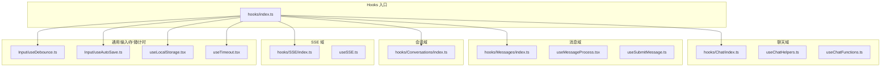
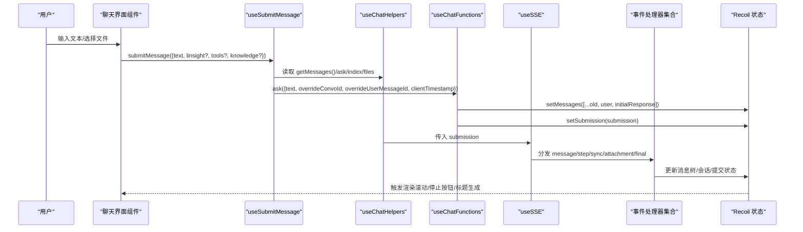
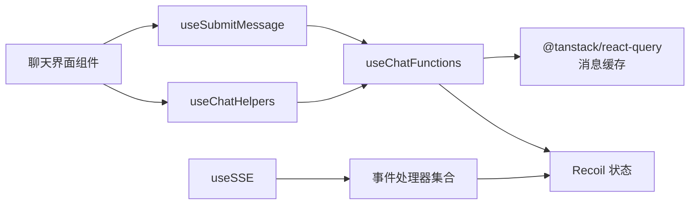

# 自定义 Hook 系统

<cite>
**本文引用的文件**
- [src/frontend/client/src/hooks/index.ts](file://src/frontend/client/src/hooks/index.ts)
- [src/frontend/client/src/hooks/Chat/index.ts](file://src/frontend/client/src/hooks/Chat/index.ts)
- [src/frontend/client/src/hooks/Chat/useChatHelpers.ts](file://src/frontend/client/src/hooks/Chat/useChatHelpers.ts)
- [src/frontend/client/src/hooks/Chat/useChatFunctions.ts](file://src/frontend/client/src/hooks/Chat/useChatFunctions.ts)
- [src/frontend/client/src/hooks/Messages/index.ts](file://src/frontend/client/src/hooks/Messages/index.ts)
- [src/frontend/client/src/hooks/Messages/useMessageProcess.tsx](file://src/frontend/client/src/hooks/Messages/useMessageProcess.tsx)
- [src/frontend/client/src/hooks/Messages/useSubmitMessage.ts](file://src/frontend/client/src/hooks/Messages/useSubmitMessage.ts)
- [src/frontend/client/src/hooks/Conversations/index.ts](file://src/frontend/client/src/hooks/Conversations/index.ts)
- [src/frontend/client/src/hooks/SSE/index.ts](file://src/frontend/client/src/hooks/SSE/index.ts)
- [src/frontend/client/src/hooks/SSE/useSSE.ts](file://src/frontend/client/src/hooks/SSE/useSSE.ts)
- [src/frontend/client/src/hooks/Input/useDebounce.ts](file://src/frontend/client/src/hooks/Input/useDebounce.ts)
- [src/frontend/client/src/hooks/Input/useAutoSave.ts](file://src/frontend/client/src/hooks/Input/useAutoSave.ts)
- [src/frontend/client/src/hooks/useLocalStorage.tsx](file://src/frontend/client/src/hooks/useLocalStorage.tsx)
- [src/frontend/client/src/hooks/useTimeout.tsx](file://src/frontend/client/src/hooks/useTimeout.tsx)
</cite>

## 目录
1. [引言](#引言)
2. [项目结构](#项目结构)
3. [核心组件](#核心组件)
4. [架构总览](#架构总览)
5. [详细组件分析](#详细组件分析)
6. [依赖关系分析](#依赖关系分析)
7. [性能考量](#性能考量)
8. [故障排查指南](#故障排查指南)
9. [结论](#结论)
10. [附录](#附录)

## 引言
本文件系统性梳理 Bisheng 客户端前端的自定义 Hook 系统，聚焦于状态管理、数据获取与副作用处理三类 Hook 的设计与实现；重点覆盖聊天相关 Hook、会话管理 Hook、消息处理 Hook 等核心业务逻辑。文档同时给出 Hook 的参数接口、返回值结构、使用约束、组合模式、性能优化策略与调试技巧，并解释 Hook 与组件生命周期的关系及最佳实践。

## 项目结构
前端 Hook 主要位于 src/frontend/client/src/hooks 下，按功能域划分目录，入口统一导出在 hooks/index.ts 中，便于上层组件按需引入。

图表来源
- [src/frontend/client/src/hooks/index.ts](file://src/frontend/client/src/hooks/index.ts#L1-L35)
- [src/frontend/client/src/hooks/Chat/index.ts](file://src/frontend/client/src/hooks/Chat/index.ts#L1-L5)
- [src/frontend/client/src/hooks/Messages/index.ts](file://src/frontend/client/src/hooks/Messages/index.ts#L1-L9)
- [src/frontend/client/src/hooks/Conversations/index.ts](file://src/frontend/client/src/hooks/Conversations/index.ts#L1-L14)
- [src/frontend/client/src/hooks/SSE/index.ts](file://src/frontend/client/src/hooks/SSE/index.ts#L1-L5)

章节来源
- [src/frontend/client/src/hooks/index.ts](file://src/frontend/client/src/hooks/index.ts#L1-L35)

## 核心组件
- 聊天状态与交互控制：useChatHelpers 提供会话、提交状态、文件附件、最新消息等状态读写与操作入口，并委派 ask/regenerate/stop 等动作给 useChatFunctions。
- 消息提交与多会话协同：useSubmitMessage 负责构造消息、处理会话 ID/消息 ID 的覆盖规则、触发主会话与附加会话的 ask。
- 消息流处理与滚动控制：useMessageProcess 负责根据消息树与提交状态决定最新消息、兄弟消息展示与滚动抑制。
- 实时事件流：useSSE 将 TSubmission 转换为 SSE 请求，分发 attachment/message/step/sync/final 等事件到事件处理器。
- 输入与持久化：useDebounce 提供输入去抖；useAutoSave 管理草稿文本与文件；useLocalStorage 提供跨标签页同步的本地存储；useTimeout 提供可取消的延时回调。

章节来源
- [src/frontend/client/src/hooks/Chat/useChatHelpers.ts](file://src/frontend/client/src/hooks/Chat/useChatHelpers.ts#L1-L253)
- [src/frontend/client/src/hooks/Chat/useChatFunctions.ts](file://src/frontend/client/src/hooks/Chat/useChatFunctions.ts#L1-L366)
- [src/frontend/client/src/hooks/Messages/useSubmitMessage.ts](file://src/frontend/client/src/hooks/Messages/useSubmitMessage.ts#L1-L139)
- [src/frontend/client/src/hooks/Messages/useMessageProcess.tsx](file://src/frontend/client/src/hooks/Messages/useMessageProcess.tsx#L1-L114)
- [src/frontend/client/src/hooks/SSE/useSSE.ts](file://src/frontend/client/src/hooks/SSE/useSSE.ts#L1-L249)
- [src/frontend/client/src/hooks/Input/useDebounce.ts](file://src/frontend/client/src/hooks/Input/useDebounce.ts#L1-L20)
- [src/frontend/client/src/hooks/Input/useAutoSave.ts](file://src/frontend/client/src/hooks/Input/useAutoSave.ts#L1-L223)
- [src/frontend/client/src/hooks/useLocalStorage.tsx](file://src/frontend/client/src/hooks/useLocalStorage.tsx#L1-L54)
- [src/frontend/client/src/hooks/useTimeout.tsx](file://src/frontend/client/src/hooks/useTimeout.tsx#L1-L40)

## 架构总览
下图展示了从用户输入到消息提交、SSE 流式响应、消息树更新与滚动控制的整体流程。

图表来源
- [src/frontend/client/src/hooks/Messages/useSubmitMessage.ts](file://src/frontend/client/src/hooks/Messages/useSubmitMessage.ts#L20-L139)
- [src/frontend/client/src/hooks/Chat/useChatHelpers.ts](file://src/frontend/client/src/hooks/Chat/useChatHelpers.ts#L15-L176)
- [src/frontend/client/src/hooks/Chat/useChatFunctions.ts](file://src/frontend/client/src/hooks/Chat/useChatFunctions.ts#L45-L366)
- [src/frontend/client/src/hooks/SSE/useSSE.ts](file://src/frontend/client/src/hooks/SSE/useSSE.ts#L31-L249)

## 详细组件分析

### 聊天状态与交互控制：useChatHelpers
- 设计要点
  - 统一索引 index 与会话参数 paramId，支持“新建”与“打开会话”的查询键切换。
  - 使用 React Query 缓存消息列表，提供 get/set 方法以保证缓存一致性。
  - 通过 Recoil 管理 isSubmitting、latestMessage、files、preset、optionSettings 等状态。
  - 将 ask/regenerate/stop 等动作委托给 useChatFunctions，并暴露给上层组件。
- 参数与返回
  - 参数：index（number，默认 0）、paramId（string，可选）、isLingsight（boolean，可选）。
  - 返回：包含 newConversation、conversation、setConversation、getMessages、setMessages、ask、regenerate、stopGenerating、handleStopGenerating、handleRegenerate、handleContinue、显示/滚动/预设/选项设置等状态与方法的对象。
- 关键行为
  - 继续生成：基于 latestMessage 的父消息进行继续。
  - 重新生成：基于父消息的用户消息进行重新生成。
  - 停止生成：清空当前提交状态。
  - 文件管理：支持普通文件与 Linsight 文件（带解析状态轮询）。
- 生命周期与副作用
  - 在组件挂载后初始化状态；在会话切换或参数变化时更新查询键；在提交前清理旧状态。

章节来源
- [src/frontend/client/src/hooks/Chat/useChatHelpers.ts](file://src/frontend/client/src/hooks/Chat/useChatHelpers.ts#L15-L176)
- [src/frontend/client/src/hooks/Chat/useChatHelpers.ts](file://src/frontend/client/src/hooks/Chat/useChatHelpers.ts#L180-L253)

### 聊天函数：useChatFunctions
- 设计要点
  - 统一构造用户消息与占位响应消息，支持编辑/继续/重新生成场景。
  - 根据会话状态与消息树决定 parentMessageId/thread_id 等上下文。
  - 支持文件复用与上传文件注入，清空临时文件映射。
  - 将最终 submission 写入 Recoil，驱动 SSE 流程。
- 参数与返回
  - 参数：index、files、setFiles、getMessages、setMessages、isSubmitting、conversation、latestMessage、setSubmission、setLatestMessage。
  - 返回：ask、regenerate 两个方法。
- 关键行为
  - ask：校验状态、构造消息与初始响应、合并消息、写入 submission。
  - regenerate：基于父消息的用户消息进行重新生成。
- 性能与约束
  - 避免重复提交（isSubmitting 为真时直接返回）。
  - 对 NEW_CONVO 场景重置父节点与消息列表。
  - 对编辑/继续场景复用生成文本，避免重复计算。

章节来源
- [src/frontend/client/src/hooks/Chat/useChatFunctions.ts](file://src/frontend/client/src/hooks/Chat/useChatFunctions.ts#L45-L366)

### 消息提交：useSubmitMessage
- 设计要点
  - 将“最新消息”补回根消息列表，确保父子关系正确。
  - 多会话场景：当存在附加会话时，同时向主会话与附加会话发起 ask。
  - 会话/消息 ID 覆盖：通过索引追加分隔符，避免冲突。
  - Linsight 模式：构建特定提交体并清理表单与文件。
- 参数与返回
  - 参数：helpers（可选，包含 clearDraft 回调）。
  - 返回：submitMessage、submitPrompt 两个方法。
- 关键行为
  - submitMessage：构造覆盖后的会话/消息 ID，调用 ask 与 askAdditional。
  - submitPrompt：替换特殊变量后按自动发送策略处理。
- 使用约束
  - 必须在 useChatContext/useAddedChatContext 环境下调用。
  - 需要配合 useChatHelpers 的 getMessages/setMessages 使用。

章节来源
- [src/frontend/client/src/hooks/Messages/useSubmitMessage.ts](file://src/frontend/client/src/hooks/Messages/useSubmitMessage.ts#L20-L139)

### 消息处理与滚动控制：useMessageProcess
- 设计要点
  - 基于消息树判断是否为叶子节点，决定是否更新“最新消息”。
  - 结合 isSubmittingRoot/isSubmittingAdditional 控制滚动抑制。
  - 与多会话上下文协作，生成兄弟消息以保持 UI 一致性。
- 参数与返回
  - 参数：message（TMessage|null）。
  - 返回：showSibling、handleScroll、conversation、siblingMessage、setSiblingMessage、isSubmittingFamily、latestMultiMessage。
- 关键行为
  - 通过 getTextKey 判断文本/会话变更，更新 latestMessage。
  - 滚动节流：在提交期间抑制滚动，避免闪烁与跳动。

章节来源
- [src/frontend/client/src/hooks/Messages/useMessageProcess.tsx](file://src/frontend/client/src/hooks/Messages/useMessageProcess.tsx#L10-L114)

### SSE 实时事件流：useSSE
- 设计要点
  - 将 submission 转换为 payload 并建立 SSE 连接。
  - 分发多种事件类型：created、event(step)、sync、message、attachment、final、error、cancel。
  - 维护 activeRunId、abortScroll、showStopButton 等运行期状态。
- 参数与返回
  - 参数：submission（TSubmission|null）、chatHelpers（ChatHelpers）、isAddedRequest（boolean）、runIndex（number）。
  - 返回：无（副作用：订阅事件、更新状态、关闭连接）。
- 关键行为
  - cancel 事件：主动中断时清理提交状态并尝试中止对话。
  - error 事件：本地化错误信息并回退到错误处理。
  - final 事件：完成收尾并刷新余额等外部状态。

章节来源
- [src/frontend/client/src/hooks/SSE/useSSE.ts](file://src/frontend/client/src/hooks/SSE/useSSE.ts#L31-L249)

### 输入与持久化：useDebounce、useAutoSave、useLocalStorage、useTimeout
- useDebounce：对输入值进行去抖，降低频繁更新成本。
- useAutoSave：在切换会话时保存/恢复文本与文件草稿，支持 Base64 编解码与本地存储键空间隔离。
- useLocalStorage：提供 JSON 序列化与跨标签页同步的本地存储 Hook。
- useTimeout：封装可取消的延时回调，避免内存泄漏。

章节来源
- [src/frontend/client/src/hooks/Input/useDebounce.ts](file://src/frontend/client/src/hooks/Input/useDebounce.ts#L1-L20)
- [src/frontend/client/src/hooks/Input/useAutoSave.ts](file://src/frontend/client/src/hooks/Input/useAutoSave.ts#L1-L223)
- [src/frontend/client/src/hooks/useLocalStorage.tsx](file://src/frontend/client/src/hooks/useLocalStorage.tsx#L1-L54)
- [src/frontend/client/src/hooks/useTimeout.tsx](file://src/frontend/client/src/hooks/useTimeout.tsx#L1-L40)

## 依赖关系分析
- 组件耦合
  - useSubmitMessage 依赖 useChatContext/useAddedChatContext 与 useChatHelpers 的 getMessages/setMessages/ask/askAdditional。
  - useChatHelpers 依赖 useChatFunctions 与 Recoil 状态；同时管理文件与 Linsight 解析状态。
  - useSSE 依赖 useEventHandlers（未在本文件中展开），接收 chatHelpers 并更新消息树与提交状态。
- 数据流
  - 输入 → useSubmitMessage → useChatFunctions（构造消息/占位响应）→ Recoil（setMessages/setSubmission）→ useSSE（SSE 事件）→ 事件处理器 → 更新 UI。
- 外部依赖
  - React Query（消息缓存）、Recoil（全局状态）、SSE.js（SSE 客户端）、uuid（ID 生成）。

图表来源
- [src/frontend/client/src/hooks/Messages/useSubmitMessage.ts](file://src/frontend/client/src/hooks/Messages/useSubmitMessage.ts#L20-L139)
- [src/frontend/client/src/hooks/Chat/useChatHelpers.ts](file://src/frontend/client/src/hooks/Chat/useChatHelpers.ts#L15-L176)
- [src/frontend/client/src/hooks/Chat/useChatFunctions.ts](file://src/frontend/client/src/hooks/Chat/useChatFunctions.ts#L45-L366)
- [src/frontend/client/src/hooks/SSE/useSSE.ts](file://src/frontend/client/src/hooks/SSE/useSSE.ts#L31-L249)

## 性能考量
- 去抖与节流
  - useDebounce 降低输入事件频率；useMessageProcess 的滚动节流减少滚动处理开销。
- 状态最小化与选择器
  - 使用 Recoil 的 family selector 与原子粒度控制，避免不必要的重渲染。
- 缓存与幂等
  - React Query 缓存消息列表，setMessages/getMessages 保证缓存一致性，减少重复请求。
- 清理与释放
  - useTimeout 在卸载时清理定时器；useSSE 在卸载时关闭 SSE 连接并触发 cancel 事件。
- 文件与草稿
  - useAutoSave 仅在必要时写入本地存储，且对文件 ID 数组进行序列化，避免大对象频繁写入。

## 故障排查指南
- 提交无效
  - 检查 isSubmitting 状态是否为真；确认 conversationId 不为 'search'；确认 text 非空。
- 最新消息未更新
  - 确认消息为叶子节点；检查 getTextKey 与 latestText.current 的比较逻辑。
- 滚动异常
  - 在提交期间 setAbortScroll(true) 会抑制滚动；确认提交完成后状态被重置。
- SSE 错误
  - 观察 error 事件中的状态码并使用本地化键映射；检查 token 是否过期。
- 草稿丢失
  - 确认 saveDrafts 开关；检查 LocalStorageKeys 前缀与会话 ID 是否一致。

章节来源
- [src/frontend/client/src/hooks/Chat/useChatFunctions.ts](file://src/frontend/client/src/hooks/Chat/useChatFunctions.ts#L108-L143)
- [src/frontend/client/src/hooks/Messages/useMessageProcess.tsx](file://src/frontend/client/src/hooks/Messages/useMessageProcess.tsx#L65-L81)
- [src/frontend/client/src/hooks/SSE/useSSE.ts](file://src/frontend/client/src/hooks/SSE/useSSE.ts#L191-L232)
- [src/frontend/client/src/hooks/Input/useAutoSave.ts](file://src/frontend/client/src/hooks/Input/useAutoSave.ts#L119-L187)

## 结论
Bisheng 前端 Hook 系统围绕“消息提交—SSE 流式处理—消息树更新—滚动控制”形成闭环，通过 useChatHelpers/useChatFunctions 统一管理会话与消息状态，通过 useSubmitMessage 协同多会话场景，通过 useSSE 与事件处理器实现稳定可靠的实时交互体验。结合去抖、节流、缓存与清理策略，整体具备良好的性能与可维护性。

## 附录
- Hook 组合使用模式
  - 表单提交：useSubmitMessage → useChatHelpers → useChatFunctions → useSSE。
  - 消息渲染：useMessageProcess（滚动/最新消息）+ useChatHelpers（状态）。
  - 输入优化：useDebounce + useAutoSave。
- 调试技巧
  - 打印日志：useChatFunctions 的日志开关；useSSE 的事件日志。
  - 状态快照：Recoil DevTools；React DevTools。
  - 网络诊断：SSE 连接状态、事件分发顺序、错误事件数据。