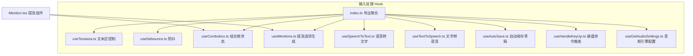
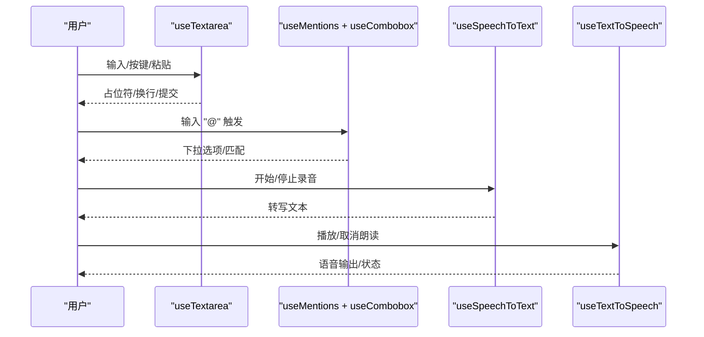
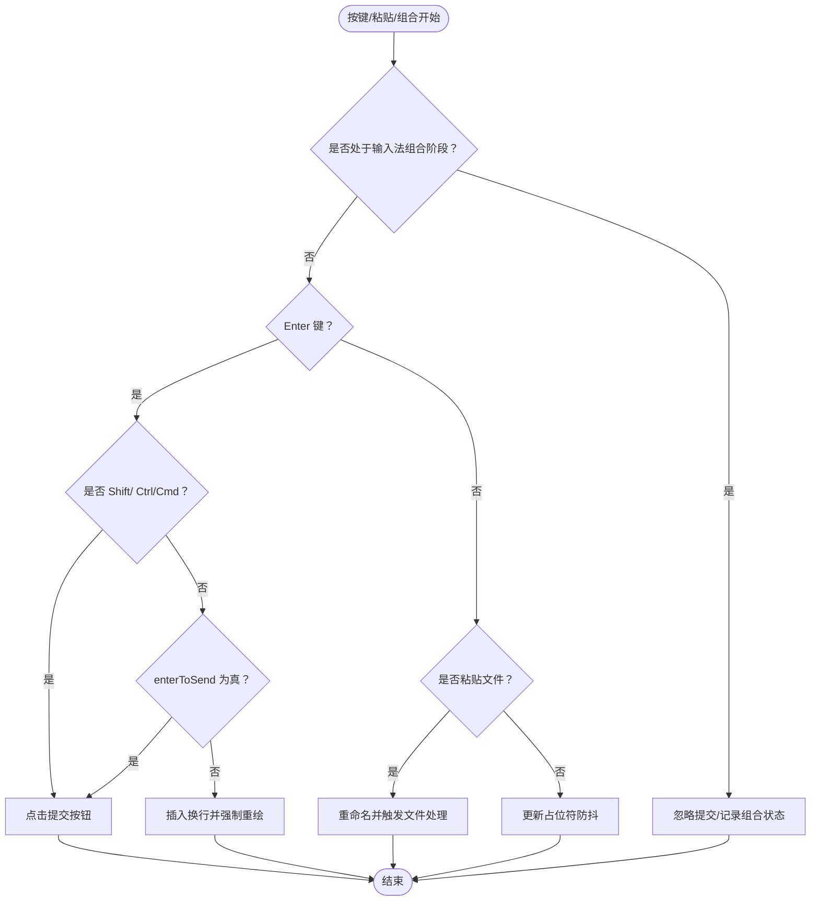
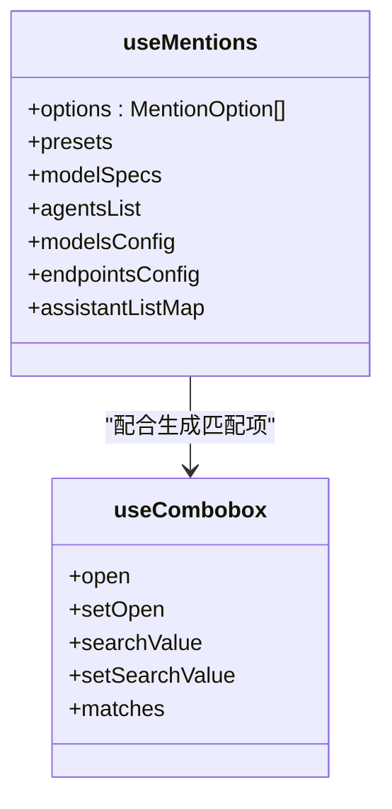
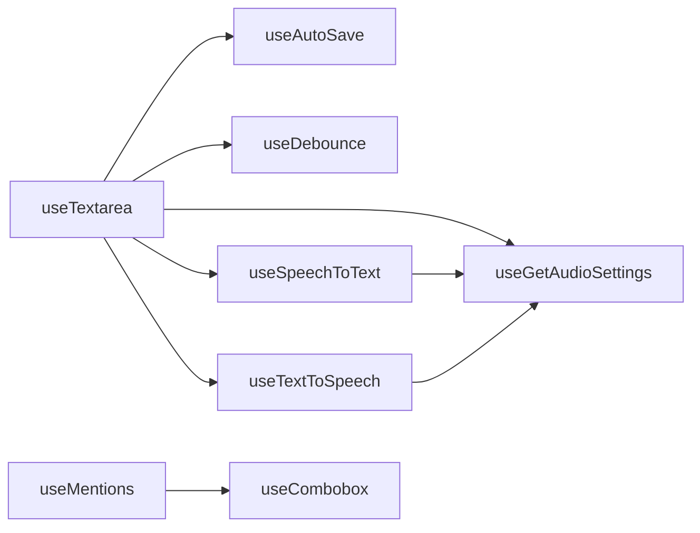

# 输入处理 Hook

<cite>
**本文引用的文件**
- [src/frontend/client/src/hooks/Input/index.ts](file://src/frontend/client/src/hooks/Input/index.ts)
- [src/frontend/client/src/hooks/Input/useTextarea.ts](file://src/frontend/client/src/hooks/Input/useTextarea.ts)
- [src/frontend/client/src/hooks/Input/useDebounce.ts](file://src/frontend/client/src/hooks/Input/useDebounce.ts)
- [src/frontend/client/src/hooks/Input/useCombobox.ts](file://src/frontend/client/src/hooks/Input/useCombobox.ts)
- [src/frontend/client/src/hooks/Input/useMentions.ts](file://src/frontend/client/src/hooks/Input/useMentions.ts)
- [src/frontend/client/src/hooks/Input/useSpeechToText.ts](file://src/frontend/client/src/hooks/Input/useSpeechToText.ts)
- [src/frontend/client/src/hooks/Input/useTextToSpeech.ts](file://src/frontend/client/src/hooks/Input/useTextToSpeech.ts)
- [src/frontend/client/src/hooks/Input/useGetAudioSettings.ts](file://src/frontend/client/src/hooks/Input/useGetAudioSettings.ts)
- [src/frontend/client/src/hooks/Input/useHandleKeyUp.ts](file://src/frontend/client/src/hooks/Input/useHandleKeyUp.ts)
- [src/frontend/client/src/hooks/Input/useAutoSave.ts](file://src/frontend/client/src/hooks/Input/useAutoSave.ts)
- [src/frontend/client/src/components/Chat/Input/Mention.tsx](file://src/frontend/client/src/components/Chat/Input/Mention.tsx)
- [src/frontend/client/src/common/index.ts](file://src/frontend/client/src/common/index.ts)
</cite>

## 目录
1. [简介](#简介)
2. [项目结构](#项目结构)
3. [核心组件](#核心组件)
4. [架构总览](#架构总览)
5. [详细组件分析](#详细组件分析)
6. [依赖关系分析](#依赖关系分析)
7. [性能考量](#性能考量)
8. [故障排查指南](#故障排查指南)
9. [结论](#结论)
10. [附录](#附录)

## 简介
本技术文档聚焦于 Bisheng 前端输入处理自定义 Hook 的设计与实现，覆盖文本输入、自动完成、提及（@）补全、语音输入/输出等能力。文档系统性阐述 useTextarea、useDebounce、useCombobox、useMentions 等核心 Hook 的职责、参数接口、返回值结构、使用约束以及与表单组件、用户体验的关系，并给出最佳实践与排障建议。

## 项目结构
输入处理相关 Hook 集中位于前端客户端的 hooks/Input 目录，统一通过入口导出，便于上层组件按需引入。同时，提及弹窗组件与这些 Hook 存在直接协作关系。

**图表来源**
- [src/frontend/client/src/hooks/Input/index.ts](file://src/frontend/client/src/hooks/Input/index.ts#L1-L13)
- [src/frontend/client/src/hooks/Input/useTextarea.ts](file://src/frontend/client/src/hooks/Input/useTextarea.ts#L1-L247)
- [src/frontend/client/src/hooks/Input/useDebounce.ts](file://src/frontend/client/src/hooks/Input/useDebounce.ts#L1-L20)
- [src/frontend/client/src/hooks/Input/useCombobox.ts](file://src/frontend/client/src/hooks/Input/useCombobox.ts#L1-L38)
- [src/frontend/client/src/hooks/Input/useMentions.ts](file://src/frontend/client/src/hooks/Input/useMentions.ts#L1-L222)
- [src/frontend/client/src/hooks/Input/useSpeechToText.ts](file://src/frontend/client/src/hooks/Input/useSpeechToText.ts#L1-L50)
- [src/frontend/client/src/hooks/Input/useTextToSpeech.ts](file://src/frontend/client/src/hooks/Input/useTextToSpeech.ts#L1-L171)
- [src/frontend/client/src/hooks/Input/useHandleKeyUp.ts](file://src/frontend/client/src/hooks/Input/useHandleKeyUp.ts#L1-L146)
- [src/frontend/client/src/hooks/Input/useAutoSave.ts](file://src/frontend/client/src/hooks/Input/useAutoSave.ts#L1-L223)
- [src/frontend/client/src/hooks/Input/useGetAudioSettings.ts](file://src/frontend/client/src/hooks/Input/useGetAudioSettings.ts#L1-L19)
- [src/frontend/client/src/components/Chat/Input/Mention.tsx](file://src/frontend/client/src/components/Chat/Input/Mention.tsx#L49-L73)

**章节来源**
- [src/frontend/client/src/hooks/Input/index.ts](file://src/frontend/client/src/hooks/Input/index.ts#L1-L13)

## 核心组件
- useTextarea：负责文本区键盘事件、粘贴文件、占位符动态生成、回车行为控制、输入法组合阶段处理等。
- useDebounce：对字符串输入进行延迟更新，降低渲染与存储压力。
- useCombobox：维护下拉选择的打开/关闭、搜索词与匹配项，支持排序与选中项保底渲染。
- useMentions：基于后端配置与数据源生成提及选项（模型、端点、代理、助手、预设等），供 @ 触发。
- useSpeechToText：统一封装浏览器/外部语音转文字能力，暴露监听状态与启停控制。
- useTextToSpeech：统一封装浏览器/边缘/外部文字转语音能力，暴露播放/取消、音色列表、加载状态。
- useHandleKeyUp：处理快捷命令（@、+、/）触发与上箭头编辑快捷键。
- useAutoSave：对当前会话文本与附件草稿进行本地持久化与切换恢复。
- useGetAudioSettings：从全局状态读取 STT/TTS 引擎配置，作为上述语音 Hook 的决策依据。

**章节来源**
- [src/frontend/client/src/hooks/Input/useTextarea.ts](file://src/frontend/client/src/hooks/Input/useTextarea.ts#L25-L247)
- [src/frontend/client/src/hooks/Input/useDebounce.ts](file://src/frontend/client/src/hooks/Input/useDebounce.ts#L1-L20)
- [src/frontend/client/src/hooks/Input/useCombobox.ts](file://src/frontend/client/src/hooks/Input/useCombobox.ts#L1-L38)
- [src/frontend/client/src/hooks/Input/useMentions.ts](file://src/frontend/client/src/hooks/Input/useMentions.ts#L49-L222)
- [src/frontend/client/src/hooks/Input/useSpeechToText.ts](file://src/frontend/client/src/hooks/Input/useSpeechToText.ts#L1-L50)
- [src/frontend/client/src/hooks/Input/useTextToSpeech.ts](file://src/frontend/client/src/hooks/Input/useTextToSpeech.ts#L1-L171)
- [src/frontend/client/src/hooks/Input/useHandleKeyUp.ts](file://src/frontend/client/src/hooks/Input/useHandleKeyUp.ts#L38-L146)
- [src/frontend/client/src/hooks/Input/useAutoSave.ts](file://src/frontend/client/src/hooks/Input/useAutoSave.ts#L10-L223)
- [src/frontend/client/src/hooks/Input/useGetAudioSettings.ts](file://src/frontend/client/src/hooks/Input/useGetAudioSettings.ts#L1-L19)

## 架构总览
输入处理 Hook 以“状态管理 + 事件处理 + 外部能力封装”的方式组织，围绕文本区与提及弹窗形成闭环；语音能力通过统一适配器在浏览器与外部服务间切换；自动保存与占位符逻辑贯穿交互体验。

**图表来源**
- [src/frontend/client/src/hooks/Input/useTextarea.ts](file://src/frontend/client/src/hooks/Input/useTextarea.ts#L145-L202)
- [src/frontend/client/src/hooks/Input/useMentions.ts](file://src/frontend/client/src/hooks/Input/useMentions.ts#L121-L210)
- [src/frontend/client/src/hooks/Input/useCombobox.ts](file://src/frontend/client/src/hooks/Input/useCombobox.ts#L15-L28)
- [src/frontend/client/src/hooks/Input/useSpeechToText.ts](file://src/frontend/client/src/hooks/Input/useSpeechToText.ts#L5-L47)
- [src/frontend/client/src/hooks/Input/useTextToSpeech.ts](file://src/frontend/client/src/hooks/Input/useTextToSpeech.ts#L22-L98)

## 详细组件分析

### useTextarea：文本区输入与交互控制
- 职责
  - 动态占位符生成与防抖更新
  - 回车行为控制（换行或提交）
  - 输入法组合阶段处理（避免误提交）
  - 粘贴文件上传（带时间戳重命名）
  - 健康检查与滚动状态反馈
- 关键参数
  - textAreaRef: HTMLTextAreaElement 引用
  - submitButtonRef: 提交按钮引用
  - setIsScrollable: 设置可滚动状态
  - disabled: 是否禁用
  - placeholder: 自定义占位符
- 返回值
  - textAreaRef、handlePaste、handleKeyDown、handleCompositionStart、handleCompositionEnd
- 使用约束
  - 必须传入有效的 DOM 引用
  - 在多实体场景下需结合上下文判断是否可追加
- 与表单/用户体验
  - 通过 enterToSend 控制回车策略，提升可用性
  - 输入法组合阶段保护，避免 Safari 等平台差异导致的误触

**图表来源**
- [src/frontend/client/src/hooks/Input/useTextarea.ts](file://src/frontend/client/src/hooks/Input/useTextarea.ts#L145-L202)
- [src/frontend/client/src/hooks/Input/useTextarea.ts](file://src/frontend/client/src/hooks/Input/useTextarea.ts#L204-L210)
- [src/frontend/client/src/hooks/Input/useTextarea.ts](file://src/frontend/client/src/hooks/Input/useTextarea.ts#L212-L237)
- [src/frontend/client/src/hooks/Input/useTextarea.ts](file://src/frontend/client/src/hooks/Input/useTextarea.ts#L66-L129)

**章节来源**
- [src/frontend/client/src/hooks/Input/useTextarea.ts](file://src/frontend/client/src/hooks/Input/useTextarea.ts#L25-L247)

### useDebounce：输入防抖
- 职责：对字符串值进行延迟更新，减少频繁渲染与存储开销
- 参数：value（待防抖字符串）、delay（延迟毫秒）
- 返回：debouncedValue（延迟后的值）
- 使用建议：适用于草稿保存、搜索关键词等高频变更场景

**章节来源**
- [src/frontend/client/src/hooks/Input/useDebounce.ts](file://src/frontend/client/src/hooks/Input/useDebounce.ts#L1-L20)

### useCombobox：组合框状态与匹配
- 职责：维护下拉打开状态、搜索词与匹配结果，确保选中项始终可见
- 参数：value（当前选中值）、options（候选项数组）
- 返回：open、setOpen、searchValue、setSearchValue、matches
- 匹配策略：基于 match-sorter 的 label/value 键匹配

**章节来源**
- [src/frontend/client/src/hooks/Input/useCombobox.ts](file://src/frontend/client/src/hooks/Input/useCombobox.ts#L1-L38)

### useMentions：提及选项生成
- 职责：聚合模型、端点、代理、助手、预设等选项，生成带图标与描述的 MentionOption 列表
- 参数：assistantMap（助手映射）、includeAssistants（是否包含助手）
- 返回：options 及其来源数据（presets、modelSpecs、agentsList、modelsConfig、endpointsConfig、assistantListMap）
- 与 useCombobox 协作：在 @ 触发时提供 matches 并保持选中项可见

**图表来源**
- [src/frontend/client/src/hooks/Input/useMentions.ts](file://src/frontend/client/src/hooks/Input/useMentions.ts#L49-L222)
- [src/frontend/client/src/hooks/Input/useCombobox.ts](file://src/frontend/client/src/hooks/Input/useCombobox.ts#L5-L36)

**章节来源**
- [src/frontend/client/src/hooks/Input/useMentions.ts](file://src/frontend/client/src/hooks/Input/useMentions.ts#L49-L222)

### useHandleKeyUp：快捷命令与上箭头编辑
- 职责：处理 @、+、/ 命令触发与上箭头编辑快捷键
- 权限控制：根据权限开关决定是否允许触发
- 返回：handleKeyUp（键盘抬起事件处理器）

**章节来源**
- [src/frontend/client/src/hooks/Input/useHandleKeyUp.ts](file://src/frontend/client/src/hooks/Input/useHandleKeyUp.ts#L38-L146)

### useSpeechToText：语音转文字
- 职责：统一封装浏览器/外部语音转文字能力
- 决策：依据 useGetAudioSettings 返回的 speechToTextEndpoint 选择实现
- 返回：isLoading、isListening、startRecording、stopRecording

**章节来源**
- [src/frontend/client/src/hooks/Input/useSpeechToText.ts](file://src/frontend/client/src/hooks/Input/useSpeechToText.ts#L1-L50)
- [src/frontend/client/src/hooks/Input/useGetAudioSettings.ts](file://src/frontend/client/src/hooks/Input/useGetAudioSettings.ts#L1-L19)

### useTextToSpeech：文字转语音
- 职责：统一封装浏览器/边缘/外部文字转语音能力
- 决策：依据 useGetAudioSettings 返回的 textToSpeechEndpoint 选择实现
- 返回：handleMouseDown、handleMouseUp、toggleSpeech、isSpeaking、isLoading、audioRef、voices
- 与全局音频协作：暂停全局音频、播放状态同步

**章节来源**
- [src/frontend/client/src/hooks/Input/useTextToSpeech.ts](file://src/frontend/client/src/hooks/Input/useTextToSpeech.ts#L1-L171)
- [src/frontend/client/src/hooks/Input/useGetAudioSettings.ts](file://src/frontend/client/src/hooks/Input/useGetAudioSettings.ts#L1-L19)

### useAutoSave：自动保存草稿
- 职责：对当前会话文本与附件进行本地持久化与切换恢复
- 行为：输入防抖保存、会话切换恢复、文件 ID 同步
- 返回：clearDraft（清理草稿）

**章节来源**
- [src/frontend/client/src/hooks/Input/useAutoSave.ts](file://src/frontend/client/src/hooks/Input/useAutoSave.ts#L10-L223)

## 依赖关系分析
- 组件耦合
  - useTextarea 依赖占位符工具、文件处理、实体信息、全局状态等
  - useMentions 依赖数据提供方查询、端点配置、图标组件
  - useSpeechToText/useTextToSpeech 依赖 useGetAudioSettings 进行引擎选择
- 外部依赖
  - lodash/debounce：防抖
  - match-sorter：组合框匹配
- 潜在循环依赖
  - 当前各 Hook 为纯函数式组合，未见直接循环导入

**图表来源**
- [src/frontend/client/src/hooks/Input/useTextarea.ts](file://src/frontend/client/src/hooks/Input/useTextarea.ts#L1-L247)
- [src/frontend/client/src/hooks/Input/useMentions.ts](file://src/frontend/client/src/hooks/Input/useMentions.ts#L1-L222)
- [src/frontend/client/src/hooks/Input/useCombobox.ts](file://src/frontend/client/src/hooks/Input/useCombobox.ts#L1-L38)
- [src/frontend/client/src/hooks/Input/useSpeechToText.ts](file://src/frontend/client/src/hooks/Input/useSpeechToText.ts#L1-L50)
- [src/frontend/client/src/hooks/Input/useTextToSpeech.ts](file://src/frontend/client/src/hooks/Input/useTextToSpeech.ts#L1-L171)
- [src/frontend/client/src/hooks/Input/useGetAudioSettings.ts](file://src/frontend/client/src/hooks/Input/useGetAudioSettings.ts#L1-L19)

**章节来源**
- [src/frontend/client/src/hooks/Input/index.ts](file://src/frontend/client/src/hooks/Input/index.ts#L1-L13)

## 性能考量
- 防抖与节流
  - useDebounce 对高频输入进行延迟更新，降低渲染与存储压力
  - useTextarea 中占位符更新采用防抖，避免频繁 DOM 属性修改
- 匹配算法
  - useCombobox 使用 match-sorter，建议限制选项数量或增加分页/虚拟化
- 语音能力
  - 浏览器端语音合成无需网络，但设备兼容性与音色加载需注意
  - 外部引擎可能带来网络延迟，isLoading 用于提示
- 渲染优化
  - 将大列表（如提及选项）与弹窗分离渲染，减少主视图重排

## 故障排查指南
- 输入法组合阶段误触发
  - 现象：在输入法候选词阶段按 Enter 导致提交
  - 处理：确认 isComposing 状态与 keyCode 判断逻辑
  - 参考路径：[src/frontend/client/src/hooks/Input/useTextarea.ts](file://src/frontend/client/src/hooks/Input/useTextarea.ts#L160-L161)
- 占位符不更新或闪烁
  - 现象：切换会话或实体后占位符未及时变化
  - 处理：检查防抖回调是否被取消，确认依赖项是否正确
  - 参考路径：[src/frontend/client/src/hooks/Input/useTextarea.ts](file://src/frontend/client/src/hooks/Input/useTextarea.ts#L126-L129)
- 提及弹窗不显示或匹配异常
  - 现象：@ 触发无响应或匹配项缺失
  - 处理：确认 useCombobox 的 value 与 options 更新，Radix Select 需包含选中项
  - 参考路径：[src/frontend/client/src/hooks/Input/useCombobox.ts](file://src/frontend/client/src/hooks/Input/useCombobox.ts#L23-L26)
- 语音转文字不可用
  - 现象：浏览器不支持或外部引擎配置错误
  - 处理：检查 useGetAudioSettings 返回的引擎类型，确认浏览器 API 支持
  - 参考路径：[src/frontend/client/src/hooks/Input/useGetAudioSettings.ts](file://src/frontend/client/src/hooks/Input/useGetAudioSettings.ts#L1-L19)
- 文字转语音无法播放
  - 现象：浏览器静音策略或音色未就绪
  - 处理：监听 onend/onerror，确保取消旧播放并释放资源
  - 参考路径：[src/frontend/client/src/hooks/Input/useTextToSpeech.ts](file://src/frontend/client/src/hooks/Input/useTextToSpeech.ts#L100-L126)

**章节来源**
- [src/frontend/client/src/hooks/Input/useTextarea.ts](file://src/frontend/client/src/hooks/Input/useTextarea.ts#L145-L202)
- [src/frontend/client/src/hooks/Input/useCombobox.ts](file://src/frontend/client/src/hooks/Input/useCombobox.ts#L15-L28)
- [src/frontend/client/src/hooks/Input/useGetAudioSettings.ts](file://src/frontend/client/src/hooks/Input/useGetAudioSettings.ts#L1-L19)
- [src/frontend/client/src/hooks/Input/useTextToSpeech.ts](file://src/frontend/client/src/hooks/Input/useTextToSpeech.ts#L100-L126)

## 结论
输入处理 Hook 通过模块化设计实现了文本输入、自动完成、提及补全、语音输入输出等关键能力。它们以轻量、可组合的方式与表单组件协同，显著提升了用户体验与开发效率。建议在实际使用中关注输入法兼容、选项匹配性能与语音引擎选择策略，并结合自动保存与权限控制完善整体交互闭环。

## 附录

### 参数与返回值速查
- useTextarea
  - 参数：textAreaRef、submitButtonRef、setIsScrollable、disabled、placeholder
  - 返回：textAreaRef、handlePaste、handleKeyDown、handleCompositionStart、handleCompositionEnd
- useDebounce
  - 参数：value、delay
  - 返回：debouncedValue
- useCombobox
  - 参数：value、options
  - 返回：open、setOpen、searchValue、setSearchValue、matches
- useMentions
  - 参数：assistantMap、includeAssistants
  - 返回：options 及其来源数据
- useHandleKeyUp
  - 参数：index、textAreaRef、setShowPlusPopover、setShowMentionPopover
  - 返回：handleKeyUp
- useSpeechToText
  - 参数：setText、onTranscriptionComplete
  - 返回：isLoading、isListening、startRecording、stopRecording
- useTextToSpeech
  - 参数：messageId、content、isLast、index
  - 返回：handleMouseDown、handleMouseUp、toggleSpeech、isSpeaking、isLoading、audioRef、voices
- useAutoSave
  - 参数：conversationId、textAreaRef、files、dailyFiles、setDailyFiles
  - 返回：clearDraft
- useGetAudioSettings
  - 返回：speechToTextEndpoint、textToSpeechEndpoint

**章节来源**
- [src/frontend/client/src/hooks/Input/useTextarea.ts](file://src/frontend/client/src/hooks/Input/useTextarea.ts#L25-L37)
- [src/frontend/client/src/hooks/Input/useDebounce.ts](file://src/frontend/client/src/hooks/Input/useDebounce.ts#L3-L17)
- [src/frontend/client/src/hooks/Input/useCombobox.ts](file://src/frontend/client/src/hooks/Input/useCombobox.ts#L5-L36)
- [src/frontend/client/src/hooks/Input/useMentions.ts](file://src/frontend/client/src/hooks/Input/useMentions.ts#L49-L55)
- [src/frontend/client/src/hooks/Input/useHandleKeyUp.ts](file://src/frontend/client/src/hooks/Input/useHandleKeyUp.ts#L38-L48)
- [src/frontend/client/src/hooks/Input/useSpeechToText.ts](file://src/frontend/client/src/hooks/Input/useSpeechToText.ts#L5-L47)
- [src/frontend/client/src/hooks/Input/useTextToSpeech.ts](file://src/frontend/client/src/hooks/Input/useTextToSpeech.ts#L22-L60)
- [src/frontend/client/src/hooks/Input/useAutoSave.ts](file://src/frontend/client/src/hooks/Input/useAutoSave.ts#L10-L22)
- [src/frontend/client/src/hooks/Input/useGetAudioSettings.ts](file://src/frontend/client/src/hooks/Input/useGetAudioSettings.ts#L5-L16)