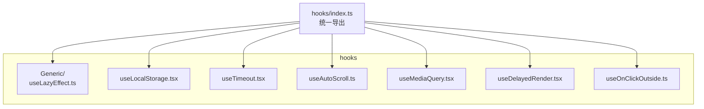
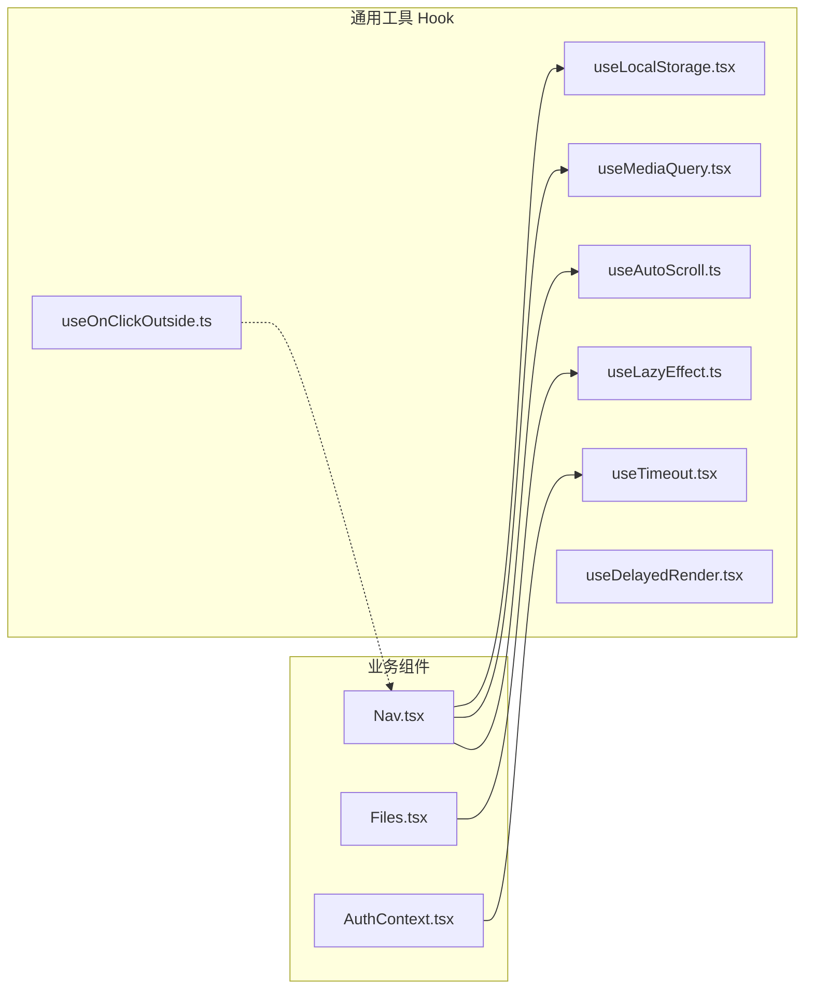
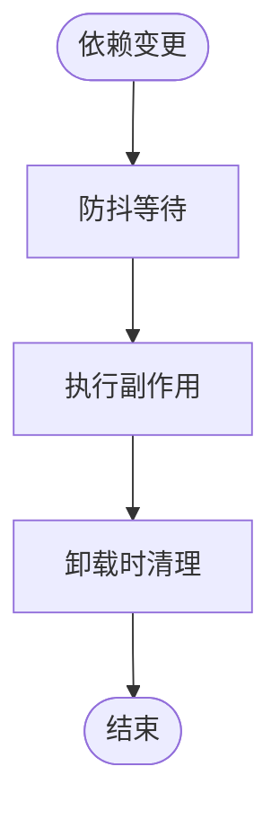
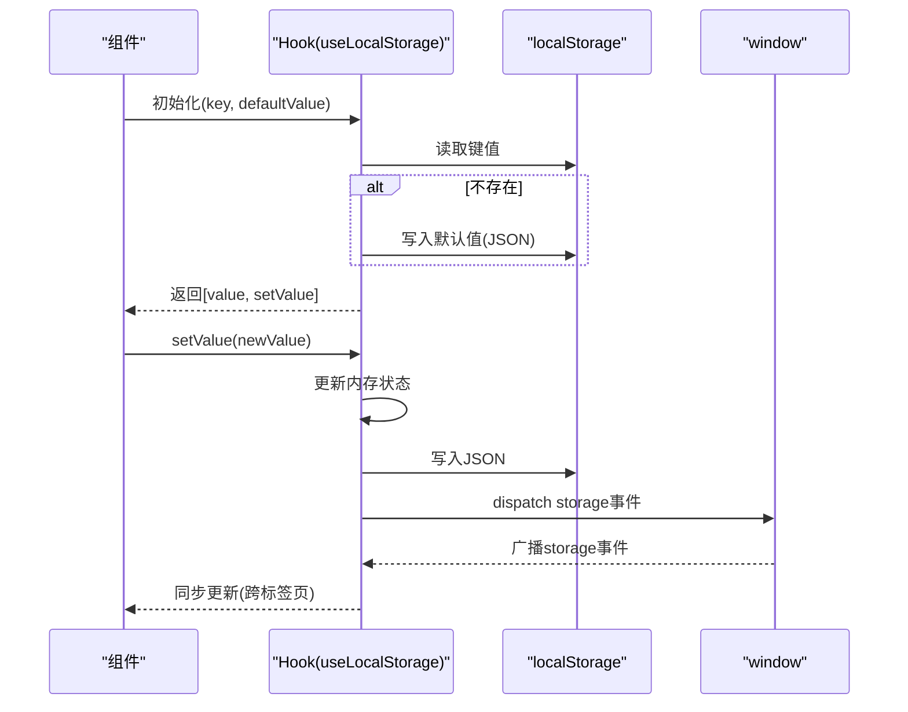
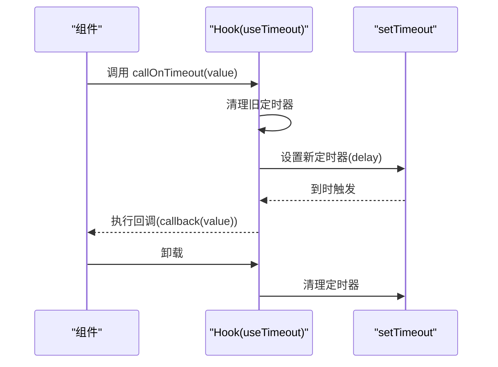
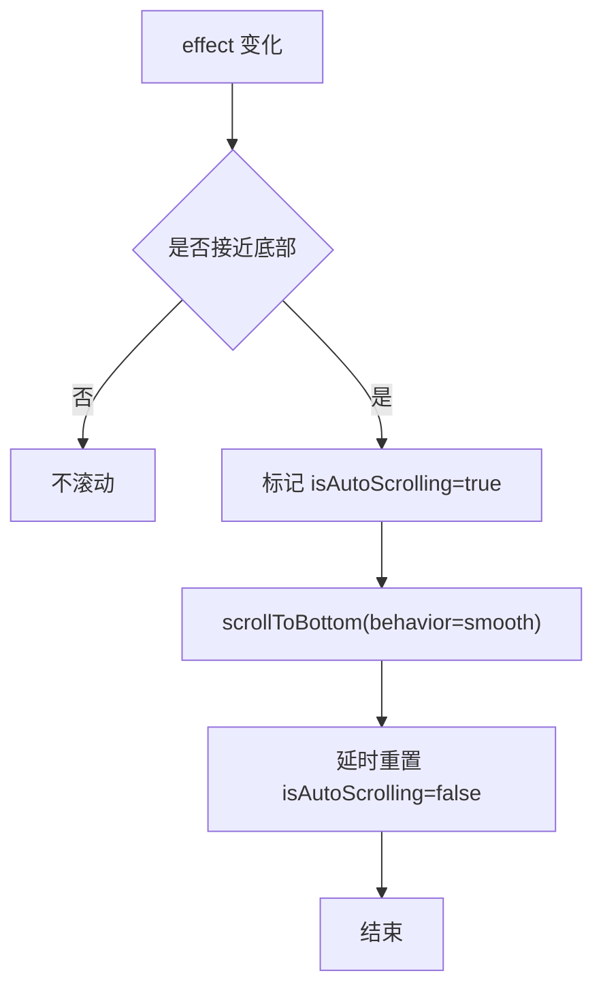
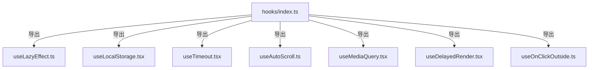

# 通用工具 Hook

<cite>
**本文引用的文件**
- [useLazyEffect.ts](file://src/frontend/client/src/hooks/Generic/useLazyEffect.ts)
- [useLocalStorage.tsx](file://src/frontend/client/src/hooks/useLocalStorage.tsx)
- [useTimeout.tsx](file://src/frontend/client/src/hooks/useTimeout.tsx)
- [useAutoScroll.ts](file://src/frontend/client/src/hooks/useAutoScroll.ts)
- [useMediaQuery.tsx](file://src/frontend/client/src/hooks/useMediaQuery.tsx)
- [useDelayedRender.tsx](file://src/frontend/client/src/hooks/useDelayedRender.tsx)
- [useOnClickOutside.ts](file://src/frontend/client/src/hooks/useOnClickOutside.ts)
- [hooks/index.ts](file://src/frontend/client/src/hooks/index.ts)
- [Nav.tsx](file://src/frontend/client/src/components/Nav/Nav.tsx)
- [Files.tsx](file://src/frontend/client/src/components/SidePanel/Agents/Code/Files.tsx)
- [AuthContext.tsx](file://src/frontend/client/src/hooks/AuthContext.tsx)
- [localStorage.mock](file://src/frontend/client/test/localStorage.mock)
</cite>

## 目录
1. [简介](#简介)
2. [项目结构](#项目结构)
3. [核心组件](#核心组件)
4. [架构总览](#架构总览)
5. [详细组件分析](#详细组件分析)
6. [依赖分析](#依赖分析)
7. [性能考量](#性能考量)
8. [故障排查指南](#故障排查指南)
9. [结论](#结论)
10. [附录](#附录)

## 简介
本文件系统性梳理 Bisheng 前端通用工具 Hook 的设计与实现，覆盖状态管理、副作用处理、DOM 操作、媒体查询、本地存储、自动滚动与延迟渲染等能力。重点文档化以下 Hook 的参数、返回值、使用约束与最佳实践：
- useLazyEffect：防抖式副作用执行
- useLocalStorage：跨组件同步的本地持久化状态
- useTimeout：可复用的延时回调调度器
- useAutoScroll：基于阈值的智能滚动控制
- useMediaQuery：响应式断点检测
- useDelayedRender：条件延迟渲染
- useOnClickOutside：点击外部区域的交互守卫

## 项目结构
通用工具 Hook 集中位于前端客户端 hooks 目录，按功能域分层组织，并通过统一入口导出，便于业务组件按需引入。

图表来源
- [hooks/index.ts](file://src/frontend/client/src/hooks/index.ts#L1-L35)
- [useLazyEffect.ts](file://src/frontend/client/src/hooks/Generic/useLazyEffect.ts#L1-L19)
- [useLocalStorage.tsx](file://src/frontend/client/src/hooks/useLocalStorage.tsx#L1-L54)
- [useTimeout.tsx](file://src/frontend/client/src/hooks/useTimeout.tsx#L1-L40)
- [useAutoScroll.ts](file://src/frontend/client/src/hooks/useAutoScroll.ts#L1-L72)
- [useMediaQuery.tsx](file://src/frontend/client/src/hooks/useMediaQuery.tsx#L1-L18)
- [useDelayedRender.tsx](file://src/frontend/client/src/hooks/useDelayedRender.tsx#L1-L38)
- [useOnClickOutside.ts](file://src/frontend/client/src/hooks/useOnClickOutside.ts#L1-L42)

章节来源
- [hooks/index.ts](file://src/frontend/client/src/hooks/index.ts#L1-L35)

## 核心组件
- useLazyEffect：在依赖稳定一段时间后，以防抖方式执行副作用，避免频繁触发
- useLocalStorage：提供键值对的本地持久化，支持 JSON 序列化与跨标签页同步
- useTimeout：封装 setTimeout 调度，提供统一清理与可复用的回调触发器
- useAutoScroll：根据滚动容器底部距离阈值自动滚动到底部，避免滚动事件干扰
- useMediaQuery：监听媒体查询匹配结果，适配移动端与桌面端差异
- useDelayedRender：在指定延迟内抛出占位 Promise，实现“未准备完成则不渲染”
- useOnClickOutside：监听全局鼠标事件，当点击目标不在指定容器内时触发回调

章节来源
- [useLazyEffect.ts](file://src/frontend/client/src/hooks/Generic/useLazyEffect.ts#L6-L18)
- [useLocalStorage.tsx](file://src/frontend/client/src/hooks/useLocalStorage.tsx#L10-L53)
- [useTimeout.tsx](file://src/frontend/client/src/hooks/useTimeout.tsx#L9-L37)
- [useAutoScroll.ts](file://src/frontend/client/src/hooks/useAutoScroll.ts#L15-L71)
- [useMediaQuery.tsx](file://src/frontend/client/src/hooks/useMediaQuery.tsx#L3-L17)
- [useDelayedRender.tsx](file://src/frontend/client/src/hooks/useDelayedRender.tsx#L4-L35)
- [useOnClickOutside.ts](file://src/frontend/client/src/hooks/useOnClickOutside.ts#L4-L41)

## 架构总览
通用工具 Hook 作为横切关注点，服务于各业务模块（导航、侧边栏、消息、输入等）。它们通过 React Hooks 生命周期与浏览器 API 协作，形成稳定的副作用与状态管理抽象。

图表来源
- [Nav.tsx](file://src/frontend/client/src/components/Nav/Nav.tsx#L30-L40)
- [Files.tsx](file://src/frontend/client/src/components/SidePanel/Agents/Code/Files.tsx#L40-L49)
- [AuthContext.tsx](file://src/frontend/client/src/hooks/AuthContext.tsx#L70-L80)
- [useLazyEffect.ts](file://src/frontend/client/src/hooks/Generic/useLazyEffect.ts#L6-L18)
- [useLocalStorage.tsx](file://src/frontend/client/src/hooks/useLocalStorage.tsx#L10-L53)
- [useTimeout.tsx](file://src/frontend/client/src/hooks/useTimeout.tsx#L9-L37)
- [useAutoScroll.ts](file://src/frontend/client/src/hooks/useAutoScroll.ts#L15-L71)
- [useMediaQuery.tsx](file://src/frontend/client/src/hooks/useMediaQuery.tsx#L3-L17)
- [useDelayedRender.tsx](file://src/frontend/client/src/hooks/useDelayedRender.tsx#L4-L35)
- [useOnClickOutside.ts](file://src/frontend/client/src/hooks/useOnClickOutside.ts#L4-L41)

## 详细组件分析

### useLazyEffect：防抖式副作用
- 设计要点
  - 使用防抖函数包装副作用，仅在依赖稳定后执行
  - 维护清理函数引用，确保卸载时正确释放资源
  - 通过依赖列表控制执行时机
- 参数与返回
  - 参数：effect 回调、依赖数组、等待时间（毫秒）
  - 返回：无（内部完成副作用注册与清理）
- 使用约束
  - 依赖列表应包含 effect 内部使用到的所有变量
  - 避免在 effect 中直接修改依赖，导致无限循环
- 典型场景
  - 大量输入变更后的批量处理（如文件列表初始化）
- 复杂度
  - 时间复杂度：O(1) 触发一次防抖；空间复杂度：O(1)
- 适用性
  - 适合“最终态”稳定后再执行的副作用，降低频繁重渲染

图表来源
- [useLazyEffect.ts](file://src/frontend/client/src/hooks/Generic/useLazyEffect.ts#L6-L18)

章节来源
- [useLazyEffect.ts](file://src/frontend/client/src/hooks/Generic/useLazyEffect.ts#L6-L18)
- [Files.tsx](file://src/frontend/client/src/components/SidePanel/Agents/Code/Files.tsx#L40-L49)

### useLocalStorage：跨组件本地持久化
- 设计要点
  - 初始读取与默认值写入
  - 监听 storage 事件实现跨标签页同步
  - 包装 setter，统一 JSON 序列化与错误捕获
- 参数与返回
  - 参数：键名、默认值（泛型）
  - 返回：[当前值, 更新函数]
- 使用约束
  - 默认值必须可被 JSON 序列化
  - 不要在 setter 中传入不可序列化对象
- 典型场景
  - 用户偏好、导航可见性、新手引导标记
- 复杂度
  - 读取/写入：O(1)；事件监听：O(1)

图表来源
- [useLocalStorage.tsx](file://src/frontend/client/src/hooks/useLocalStorage.tsx#L10-L53)

章节来源
- [useLocalStorage.tsx](file://src/frontend/client/src/hooks/useLocalStorage.tsx#L10-L53)
- [Nav.tsx](file://src/frontend/client/src/components/Nav/Nav.tsx#L34-L106)
- [localStorage.mock](file://src/frontend/client/test/localStorage.mock#L1-L21)

### useTimeout：统一延时回调调度
- 设计要点
  - 在每次调用时清理旧定时器，避免竞态
  - 提供清理钩子，组件卸载时自动清除
  - 支持延迟参数定制
- 参数与返回
  - 参数：{ callback, delay? }
  - 返回：callOnTimeout(value?) -> 触发回调
- 使用约束
  - 回调参数类型为字符串/数字/布尔/null
  - 注意在组件卸载前确保不再触发
- 典型场景
  - 错误提示延时展示、输入防抖后的统一处理
- 复杂度
  - 调用：O(1)；清理：O(1)

图表来源
- [useTimeout.tsx](file://src/frontend/client/src/hooks/useTimeout.tsx#L9-L37)
- [AuthContext.tsx](file://src/frontend/client/src/hooks/AuthContext.tsx#L70-L80)

章节来源
- [useTimeout.tsx](file://src/frontend/client/src/hooks/useTimeout.tsx#L9-L37)
- [AuthContext.tsx](file://src/frontend/client/src/hooks/AuthContext.tsx#L70-L80)

### useAutoScroll：智能底部滚动
- 设计要点
  - 通过阈值判断是否接近底部，决定是否滚动
  - 使用标志位避免滚动事件与自动滚动互相干扰
  - 支持平滑滚动行为与自定义阈值
- 参数与返回
  - 参数：scrollRef(容器), effect(依赖), options{ threshold?, scrollBehavior? }
  - 返回：{ isNearBottom, scrollToBottom }
- 使用约束
  - 容器需具备滚动属性（scrollTop/scrollHeight/clientHeight）
  - effect 变化时才触发滚动判断
- 典型场景
  - 消息列表自动滚动到底部
- 复杂度
  - 每次 effect 变化时 O(1) 计算与可能的滚动

图表来源
- [useAutoScroll.ts](file://src/frontend/client/src/hooks/useAutoScroll.ts#L15-L71)

章节来源
- [useAutoScroll.ts](file://src/frontend/client/src/hooks/useAutoScroll.ts#L15-L71)

### useMediaQuery：响应式断点检测
- 设计要点
  - 使用 window.matchMedia 监听媒体查询变化
  - 组件卸载时移除监听器
- 参数与返回
  - 参数：媒体查询字符串
  - 返回：boolean（是否匹配）
- 使用约束
  - 查询字符串需符合标准媒体查询语法
- 典型场景
  - 移动端/桌面端 UI 差异化
- 复杂度
  - 初始化 O(1)，变更监听 O(1)

章节来源
- [useMediaQuery.tsx](file://src/frontend/client/src/hooks/useMediaQuery.tsx#L3-L17)
- [Nav.tsx](file://src/frontend/client/src/components/Nav/Nav.tsx#L33-L60)

### useDelayedRender：条件延迟渲染
- 设计要点
  - 在延迟期间抛出 Promise，阻止渲染
  - 延迟结束后正常渲染
- 参数与返回
  - 参数：延迟时间（毫秒）
  - 返回：渲染函数包装器
- 使用约束
  - 仅在 Suspense 场景下使用
- 典型场景
  - 需要短暂占位的加载态
- 复杂度
  - 控制流 O(1)，渲染 O(1)

章节来源
- [useDelayedRender.tsx](file://src/frontend/client/src/hooks/useDelayedRender.tsx#L4-L35)

### useOnClickOutside：点击外部区域守卫
- 设计要点
  - 监听全局 mousedown，判断点击目标是否在容器外
  - 支持排除特定元素 ID 与自定义条件
- 参数与返回
  - 参数：ref(容器), handler(), excludeIds[], customCondition?
- 使用约束
  - 排除 ID 必须存在于 DOM 或其父节点上
- 典型场景
  - 下拉菜单、模态框关闭
- 复杂度
  - 事件监听 O(1)，每次点击 O(1)

章节来源
- [useOnClickOutside.ts](file://src/frontend/client/src/hooks/useOnClickOutside.ts#L4-L41)

## 依赖分析
- 导出聚合
  - hooks/index.ts 统一导出所有工具 Hook，便于业务按需引入
- 组件间耦合
  - Nav.tsx 同时依赖 useLocalStorage 与 useMediaQuery，体现跨能力协作
  - Files.tsx 依赖 useLazyEffect，用于稳定输入后的批量处理
  - AuthContext.tsx 依赖 useTimeout，统一错误提示时机
- 外部依赖
  - useLazyEffect 依赖 lodash/debounce
  - 浏览器 API：localStorage、matchMedia、setTimeout、addEventListener/removeEventListener

图表来源
- [hooks/index.ts](file://src/frontend/client/src/hooks/index.ts#L1-L35)

章节来源
- [hooks/index.ts](file://src/frontend/client/src/hooks/index.ts#L1-L35)

## 性能考量
- 防抖与节流
  - useLazyEffect 通过防抖减少高频变更带来的副作用开销
- 存储与事件
  - useLocalStorage 使用 JSON 序列化与 storage 事件广播，注意默认值与异常处理
- 定时器管理
  - useTimeout 在每次调用前清理旧定时器，避免泄漏；组件卸载时统一清理
- 滚动优化
  - useAutoScroll 使用阈值与标志位避免滚动事件与自动滚动相互干扰
- 响应式监听
  - useMediaQuery 仅在查询或匹配状态变化时更新，避免不必要的重渲染

## 故障排查指南
- useLocalStorage
  - 症状：跨标签页不同步
  - 排查：确认是否触发了 storage 事件派发；检查键名一致
  - 症状：序列化失败
  - 排查：确认默认值与写入值均可 JSON 序列化
- useTimeout
  - 症状：卸载后仍触发回调
  - 排查：确认组件卸载时是否清理定时器；避免在回调中访问已卸载状态
- useAutoScroll
  - 症状：滚动冲突或抖动
  - 排查：检查阈值设置；确认 isAutoScrolling 标志位是否正确重置
- useMediaQuery
  - 症状：匹配状态不更新
  - 排查：确认媒体查询字符串正确；检查监听器是否被移除
- useOnClickOutside
  - 症状：误触或漏触
  - 排查：核对 excludeIds 与 customCondition；确认容器 ref 正确

章节来源
- [useLocalStorage.tsx](file://src/frontend/client/src/hooks/useLocalStorage.tsx#L39-L50)
- [useTimeout.tsx](file://src/frontend/client/src/hooks/useTimeout.tsx#L28-L34)
- [useAutoScroll.ts](file://src/frontend/client/src/hooks/useAutoScroll.ts#L25-L55)
- [useMediaQuery.tsx](file://src/frontend/client/src/hooks/useMediaQuery.tsx#L6-L14)
- [useOnClickOutside.ts](file://src/frontend/client/src/hooks/useOnClickOutside.ts#L10-L40)

## 结论
Bisheng 的通用工具 Hook 将常见副作用与状态管理抽象为可复用、可测试的模块，通过合理的生命周期管理与浏览器 API 协作，显著降低了业务组件的样板代码与副作用风险。建议在团队内推广统一的 Hook 使用规范与测试策略，持续提升开发效率与稳定性。

## 附录
- 最佳实践
  - 将副作用集中在工具 Hook 中，业务组件保持纯净
  - 对外部依赖进行显式清理，避免内存泄漏
  - 对可变状态进行类型约束，减少运行时错误
  - 在测试中模拟浏览器 API（如 localStorage、matchMedia），确保 Hook 行为可验证