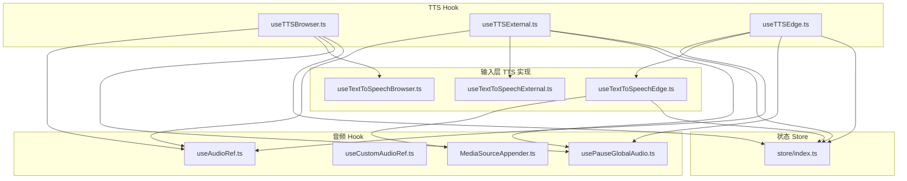
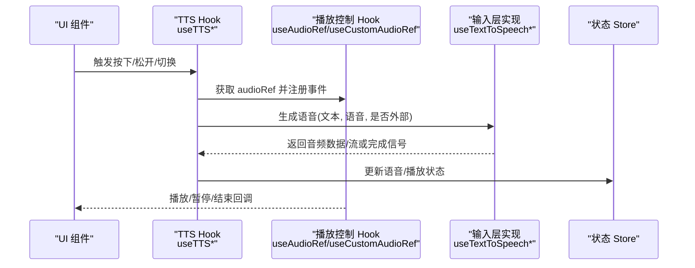
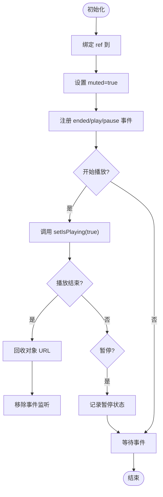
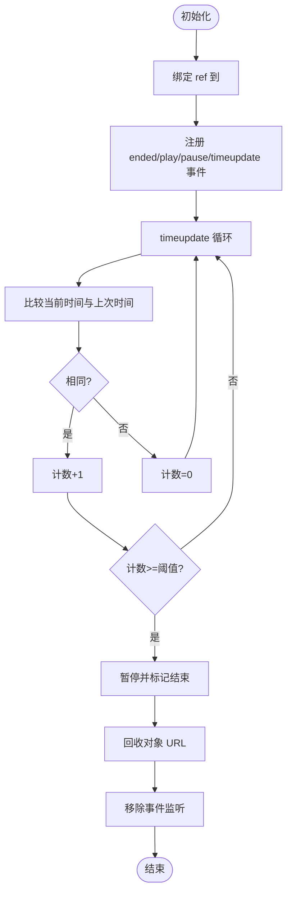
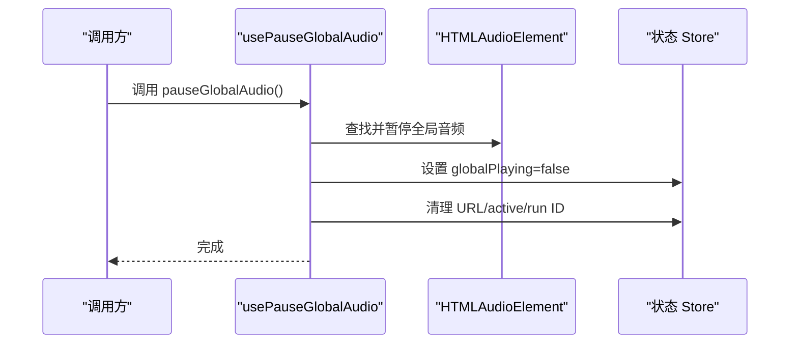
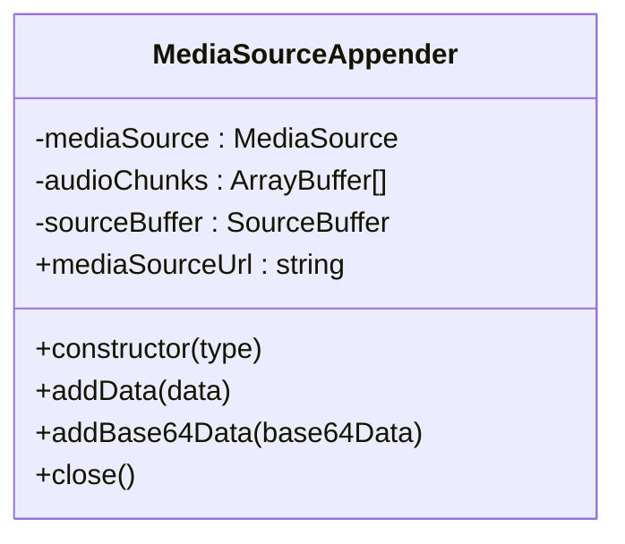
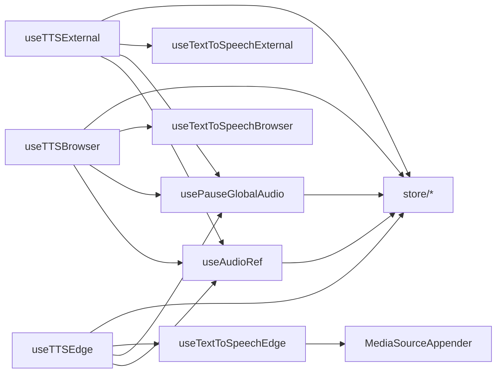

# 音频处理 Hook

<cite>
**本文引用的文件**
- [src/frontend/client/src/hooks/Audio/index.ts](file://src/frontend/client/src/hooks/Audio/index.ts)
- [src/frontend/client/src/hooks/Audio/useAudioRef.ts](file://src/frontend/client/src/hooks/Audio/useAudioRef.ts)
- [src/frontend/client/src/hooks/Audio/useCustomAudioRef.ts](file://src/frontend/client/src/hooks/Audio/useCustomAudioRef.ts)
- [src/frontend/client/src/hooks/Audio/useTTSBrowser.ts](file://src/frontend/client/src/hooks/Audio/useTTSBrowser.ts)
- [src/frontend/client/src/hooks/Audio/useTTSExternal.ts](file://src/frontend/client/src/hooks/Audio/useTTSExternal.ts)
- [src/frontend/client/src/hooks/Audio/useTTSEdge.ts](file://src/frontend/client/src/hooks/Audio/useTTSEdge.ts)
- [src/frontend/client/src/hooks/Audio/usePauseGlobalAudio.ts](file://src/frontend/client/src/hooks/Audio/usePauseGlobalAudio.ts)
- [src/frontend/client/src/hooks/Audio/MediaSourceAppender.ts](file://src/frontend/client/src/hooks/Audio/MediaSourceAppender.ts)
- [src/frontend/client/src/hooks/Input/useTextToSpeechBrowser.ts](file://src/frontend/client/src/hooks/Input/useTextToSpeechBrowser.ts)
- [src/frontend/client/src/hooks/Input/useTextToSpeechExternal.ts](file://src/frontend/client/src/hooks/Input/useTextToSpeechExternal.ts)
- [src/frontend/client/src/hooks/Input/useTextToSpeechEdge.ts](file://src/frontend/client/src/hooks/Input/useTextToSpeechEdge.ts)
- [src/frontend/client/src/store/index.ts](file://src/frontend/client/src/store/index.ts)
</cite>

## 目录
1. [简介](#简介)
2. [项目结构](#项目结构)
3. [核心组件](#核心组件)
4. [架构总览](#架构总览)
5. [详细组件分析](#详细组件分析)
6. [依赖分析](#依赖分析)
7. [性能考虑](#性能考虑)
8. [故障排查指南](#故障排查指南)
9. [结论](#结论)
10. [附录](#附录)

## 简介
本技术文档聚焦于 Bisheng 前端音频处理自定义 Hook 的设计与实现，覆盖以下能力：
- 音频播放控制：useAudioRef、useCustomAudioRef
- 语音合成（TTS）：useTTSBrowser、useTTSExternal、useTTSEdge
- 全局音频暂停与资源回收：usePauseGlobalAudio
- 媒体流与分片拼接：MediaSourceAppender
- 设备与浏览器 API 集成、跨浏览器兼容策略、状态与资源管理

文档将从系统架构、数据流、处理逻辑、错误处理与性能优化等维度进行深入解析，并提供参数接口、返回值结构与使用约束说明。

## 项目结构
音频相关 Hook 位于前端客户端 hooks/Audio 与 hooks/Input 下，分别负责播放控制、TTS 能力与全局音频状态管理；Store 提供全局状态（如语音、播放状态、缓存开关等）。

图表来源
- [src/frontend/client/src/hooks/Audio/useAudioRef.ts](file://src/frontend/client/src/hooks/Audio/useAudioRef.ts#L1-L49)
- [src/frontend/client/src/hooks/Audio/useCustomAudioRef.ts](file://src/frontend/client/src/hooks/Audio/useCustomAudioRef.ts#L1-L99)
- [src/frontend/client/src/hooks/Audio/usePauseGlobalAudio.ts](file://src/frontend/client/src/hooks/Audio/usePauseGlobalAudio.ts#L1-L41)
- [src/frontend/client/src/hooks/Audio/MediaSourceAppender.ts](file://src/frontend/client/src/hooks/Audio/MediaSourceAppender.ts#L1-L42)
- [src/frontend/client/src/hooks/Audio/useTTSBrowser.ts](file://src/frontend/client/src/hooks/Audio/useTTSBrowser.ts#L1-L101)
- [src/frontend/client/src/hooks/Audio/useTTSExternal.ts](file://src/frontend/client/src/hooks/Audio/useTTSExternal.ts#L1-L102)
- [src/frontend/client/src/hooks/Audio/useTTSEdge.ts](file://src/frontend/client/src/hooks/Audio/useTTSEdge.ts#L1-L101)
- [src/frontend/client/src/hooks/Input/useTextToSpeechBrowser.ts](file://src/frontend/client/src/hooks/Input/useTextToSpeechBrowser.ts#L1-L120)
- [src/frontend/client/src/hooks/Input/useTextToSpeechExternal.ts](file://src/frontend/client/src/hooks/Input/useTextToSpeechExternal.ts#L1-L201)
- [src/frontend/client/src/hooks/Input/useTextToSpeechEdge.ts](file://src/frontend/client/src/hooks/Input/useTextToSpeechEdge.ts#L1-L240)
- [src/frontend/client/src/store/index.ts](file://src/frontend/client/src/store/index.ts#L1-L33)

章节来源
- [src/frontend/client/src/hooks/Audio/index.ts](file://src/frontend/client/src/hooks/Audio/index.ts#L1-L7)

## 核心组件
- useAudioRef：为消息级音频元素绑定事件监听，统一处理播放/暂停/结束回调与对象 URL 回收，返回 ref 以承载音频元素。
- useCustomAudioRef：增强版音频 ref，支持基于 timeupdate 的“静默检测”以判定音频结束，便于全局播放场景。
- usePauseGlobalAudio：根据索引族状态，定位并暂停全局音频，回收对象 URL，清理 fetching/global playing 状态。
- MediaSourceAppender：封装 MediaSource/SourceBuffer，按块追加音频二进制数据，支持 endOfStream 关闭。
- useTTSBrowser/useTTSExternal/useTTSEdge：三类 TTS 能力的高层 Hook，统一处理按下触发、定时器、取消、切换语音、合并全局播放状态等。
- 输入层实现：useTextToSpeechBrowser/External/Edge 分别对接浏览器 Web Speech、外部服务与 Edge TTS SDK，提供生成与取消能力。

章节来源
- [src/frontend/client/src/hooks/Audio/useAudioRef.ts](file://src/frontend/client/src/hooks/Audio/useAudioRef.ts#L1-L49)
- [src/frontend/client/src/hooks/Audio/useCustomAudioRef.ts](file://src/frontend/client/src/hooks/Audio/useCustomAudioRef.ts#L1-L99)
- [src/frontend/client/src/hooks/Audio/usePauseGlobalAudio.ts](file://src/frontend/client/src/hooks/Audio/usePauseGlobalAudio.ts#L1-L41)
- [src/frontend/client/src/hooks/Audio/MediaSourceAppender.ts](file://src/frontend/client/src/hooks/Audio/MediaSourceAppender.ts#L1-L42)
- [src/frontend/client/src/hooks/Audio/useTTSBrowser.ts](file://src/frontend/client/src/hooks/Audio/useTTSBrowser.ts#L1-L101)
- [src/frontend/client/src/hooks/Audio/useTTSExternal.ts](file://src/frontend/client/src/hooks/Audio/useTTSExternal.ts#L1-L102)
- [src/frontend/client/src/hooks/Audio/useTTSEdge.ts](file://src/frontend/client/src/hooks/Audio/useTTSEdge.ts#L1-L101)
- [src/frontend/client/src/hooks/Input/useTextToSpeechBrowser.ts](file://src/frontend/client/src/hooks/Input/useTextToSpeechBrowser.ts#L1-L120)
- [src/frontend/client/src/hooks/Input/useTextToSpeechExternal.ts](file://src/frontend/client/src/hooks/Input/useTextToSpeechExternal.ts#L1-L201)
- [src/frontend/client/src/hooks/Input/useTextToSpeechEdge.ts](file://src/frontend/client/src/hooks/Input/useTextToSpeechEdge.ts#L1-L240)

## 架构总览
音频处理采用“Hook 层 + 输入层 + Store 状态”的分层设计：
- Hook 层：封装播放控制、TTS 触发与全局状态协调。
- 输入层：对接浏览器 API 或第三方服务，负责实际的语音合成与流式输出。
- Store：集中管理语音、播放状态、缓存开关、全局音频 URL 等。

图表来源
- [src/frontend/client/src/hooks/Audio/useTTSBrowser.ts](file://src/frontend/client/src/hooks/Audio/useTTSBrowser.ts#L1-L101)
- [src/frontend/client/src/hooks/Audio/useTTSExternal.ts](file://src/frontend/client/src/hooks/Audio/useTTSExternal.ts#L1-L102)
- [src/frontend/client/src/hooks/Audio/useTTSEdge.ts](file://src/frontend/client/src/hooks/Audio/useTTSEdge.ts#L1-L101)
- [src/frontend/client/src/hooks/Audio/useAudioRef.ts](file://src/frontend/client/src/hooks/Audio/useAudioRef.ts#L1-L49)
- [src/frontend/client/src/hooks/Input/useTextToSpeechBrowser.ts](file://src/frontend/client/src/hooks/Input/useTextToSpeechBrowser.ts#L1-L120)
- [src/frontend/client/src/hooks/Input/useTextToSpeechExternal.ts](file://src/frontend/client/src/hooks/Input/useTextToSpeechExternal.ts#L1-L201)
- [src/frontend/client/src/hooks/Input/useTextToSpeechEdge.ts](file://src/frontend/client/src/hooks/Input/useTextToSpeechEdge.ts#L1-L240)
- [src/frontend/client/src/store/index.ts](file://src/frontend/client/src/store/index.ts#L1-L33)

## 详细组件分析

### useAudioRef：消息级音频播放控制
- 功能要点
  - 将 ref 绑定到 HTMLAudioElement，设置静音以避免用户交互前的自动播放。
  - 注册 ended/play/pause 事件，回调中更新播放状态并记录日志。
  - 清理阶段移除事件监听并回收对象 URL。
- 参数与返回
  - 参数：setIsPlaying 回调，用于同步播放状态。
  - 返回：{ audioRef }，ref 指向 HTMLAudioElement。
- 使用约束
  - 必须在组件挂载后设置音频源（例如通过对象 URL）。
  - 若音频源为对象 URL，需确保在结束或暂停时回收。
- 错误处理
  - 事件解绑与 URL 回收在副作用清理中执行，避免内存泄漏。

图表来源
- [src/frontend/client/src/hooks/Audio/useAudioRef.ts](file://src/frontend/client/src/hooks/Audio/useAudioRef.ts#L1-L49)

章节来源
- [src/frontend/client/src/hooks/Audio/useAudioRef.ts](file://src/frontend/client/src/hooks/Audio/useAudioRef.ts#L1-L49)

### useCustomAudioRef：全局音频播放控制与静默检测
- 功能要点
  - 在 useAudioRef 基础上增加 timeupdate 监听，统计连续时间戳不变次数，达到阈值则视为结束并主动暂停。
  - 维护 customStarted/customEnded/customPaused 等自定义标记，便于上层判断。
  - 清理阶段移除 timeupdate 事件并回收对象 URL。
- 参数与返回
  - 参数：setIsPlaying 回调。
  - 返回：{ audioRef }，ref 指向扩展的 HTMLAudioElement。
- 使用约束
  - 适用于全局播放场景，需配合全局状态与暂停 Hook 使用。
- 性能与可靠性
  - timeupdate 计数阈值可作为稳定性与延迟的折中点，需结合实际音频长度与帧率调整。

图表来源
- [src/frontend/client/src/hooks/Audio/useCustomAudioRef.ts](file://src/frontend/client/src/hooks/Audio/useCustomAudioRef.ts#L1-L99)

章节来源
- [src/frontend/client/src/hooks/Audio/useCustomAudioRef.ts](file://src/frontend/client/src/hooks/Audio/useCustomAudioRef.ts#L1-L99)

### usePauseGlobalAudio：全局音频暂停与资源回收
- 功能要点
  - 通过索引族状态定位全局音频元素与 URL，若存在则暂停并回收对象 URL。
  - 清理 fetching、playing、active/run ID 等状态，防止残留状态影响后续播放。
- 参数与返回
  - 参数：index（默认 0），用于选择状态族。
  - 返回：{ pauseGlobalAudio }，函数用于触发暂停与清理。
- 使用约束
  - 仅在全局音频已创建且 URL 存在时生效。
  - 与 useTTS* Hook 的取消流程配合使用。

图表来源
- [src/frontend/client/src/hooks/Audio/usePauseGlobalAudio.ts](file://src/frontend/client/src/hooks/Audio/usePauseGlobalAudio.ts#L1-L41)

章节来源
- [src/frontend/client/src/hooks/Audio/usePauseGlobalAudio.ts](file://src/frontend/client/src/hooks/Audio/usePauseGlobalAudio.ts#L1-L41)

### MediaSourceAppender：媒体流分片拼接
- 功能要点
  - 在 sourceopen 事件中创建 SourceBuffer，监听 updateend 自动追加队列中的音频块。
  - 支持 Base64 与 ArrayBuffer 两种输入方式，最终通过对象 URL 暴露给 <audio>。
  - close() 调用 endOfStream 结束流。
- 参数与返回
  - 构造参数：媒体类型字符串（如 audio/mpeg）。
  - 方法：addData/addBase64Data、close、属性 mediaSourceUrl。
- 使用约束
  - 浏览器需支持 MediaSource 且类型可用（isTypeSupported）。
  - 追加完成后必须调用 close() 以结束流。

图表来源
- [src/frontend/client/src/hooks/Audio/MediaSourceAppender.ts](file://src/frontend/client/src/hooks/Audio/MediaSourceAppender.ts#L1-L42)

章节来源
- [src/frontend/client/src/hooks/Audio/MediaSourceAppender.ts](file://src/frontend/client/src/hooks/Audio/MediaSourceAppender.ts#L1-L42)

### useTTSBrowser：浏览器本地 TTS
- 功能要点
  - 通过 useTextToSpeechBrowser 获取可用语音列表与生成/取消能力。
  - 支持按下延时触发（1 秒），松开取消；切换语音时写入 Recoil 状态。
  - 合并 isLast 与全局播放状态，决定是否处于“正在朗读”。
- 参数与返回
  - 参数：content、isLast、index 等。
  - 返回：{ handleMouseDown, handleMouseUp, toggleSpeech, isSpeaking, audioRef, voices }。
- 依赖
  - 依赖 useAudioRef、usePauseGlobalAudio、useTextToSpeechBrowser、Recoil 状态。

章节来源
- [src/frontend/client/src/hooks/Audio/useTTSBrowser.ts](file://src/frontend/client/src/hooks/Audio/useTTSBrowser.ts#L1-L101)
- [src/frontend/client/src/hooks/Input/useTextToSpeechBrowser.ts](file://src/frontend/client/src/hooks/Input/useTextToSpeechBrowser.ts#L1-L120)

### useTTSExternal：外部服务 TTS
- 功能要点
  - 通过 useTextToSpeechExternal 与后端服务交互，支持缓存、速率、语音等配置。
  - 与全局音频状态联动，加载中状态由 isLast 与 global fetching/playing 组合判断。
- 参数与返回
  - 参数：messageId、content、isLast、index。
  - 返回：{ handleMouseDown, handleMouseUp, toggleSpeech, isSpeaking, isLoading, audioRef, voices }。
- 依赖
  - 依赖 useAudioRef、usePauseGlobalAudio、useTextToSpeechExternal、Recoil 状态。

章节来源
- [src/frontend/client/src/hooks/Audio/useTTSExternal.ts](file://src/frontend/client/src/hooks/Audio/useTTSExternal.ts#L1-L102)
- [src/frontend/client/src/hooks/Input/useTextToSpeechExternal.ts](file://src/frontend/client/src/hooks/Input/useTextToSpeechExternal.ts#L1-L201)

### useTTSEdge：Edge TTS（浏览器侧）
- 功能要点
  - 通过 useTextToSpeechEdge 对接 msedge-tts SDK，使用 MediaSource/SourceBuffer 实现边播边播。
  - 自动获取语音列表、初始化 MediaSource，支持取消与错误提示。
- 参数与返回
  - 参数：content、isLast、index。
  - 返回：{ handleMouseDown, handleMouseUp, toggleSpeech, isSpeaking, audioRef, voices }。
- 依赖
  - 依赖 useAudioRef、usePauseGlobalAudio、useTextToSpeechEdge、MediaSourceAppender、Recoil 状态。

章节来源
- [src/frontend/client/src/hooks/Audio/useTTSEdge.ts](file://src/frontend/client/src/hooks/Audio/useTTSEdge.ts#L1-L101)
- [src/frontend/client/src/hooks/Input/useTextToSpeechEdge.ts](file://src/frontend/client/src/hooks/Input/useTextToSpeechEdge.ts#L1-L240)
- [src/frontend/client/src/hooks/Audio/MediaSourceAppender.ts](file://src/frontend/client/src/hooks/Audio/MediaSourceAppender.ts#L1-L42)

## 依赖分析
- 组件耦合
  - useTTS* 依赖 useAudioRef/useCustomAudioRef 提供统一的音频 ref 与事件处理。
  - useTTS* 依赖 usePauseGlobalAudio 协调全局播放状态与资源回收。
  - 输入层 Hook（useTextToSpeech*）依赖 Recoil 状态与外部数据源（浏览器 API/SDK/后端服务）。
- 状态依赖
  - Store 提供 voice、globalAudioPlayingFamily、globalAudioURLFamily、globalAudioFetchingFamily、audioRunFamily、activeRunFamily 等族状态，用于跨组件共享与持久化。
- 外部依赖
  - 浏览器 Web Speech API、MediaSource/SourceBuffer、msedge-tts SDK、Recoil 状态库。

图表来源
- [src/frontend/client/src/hooks/Audio/useTTSBrowser.ts](file://src/frontend/client/src/hooks/Audio/useTTSBrowser.ts#L1-L101)
- [src/frontend/client/src/hooks/Audio/useTTSExternal.ts](file://src/frontend/client/src/hooks/Audio/useTTSExternal.ts#L1-L102)
- [src/frontend/client/src/hooks/Audio/useTTSEdge.ts](file://src/frontend/client/src/hooks/Audio/useTTSEdge.ts#L1-L101)
- [src/frontend/client/src/hooks/Audio/useAudioRef.ts](file://src/frontend/client/src/hooks/Audio/useAudioRef.ts#L1-L49)
- [src/frontend/client/src/hooks/Audio/usePauseGlobalAudio.ts](file://src/frontend/client/src/hooks/Audio/usePauseGlobalAudio.ts#L1-L41)
- [src/frontend/client/src/hooks/Input/useTextToSpeechBrowser.ts](file://src/frontend/client/src/hooks/Input/useTextToSpeechBrowser.ts#L1-L120)
- [src/frontend/client/src/hooks/Input/useTextToSpeechExternal.ts](file://src/frontend/client/src/hooks/Input/useTextToSpeechExternal.ts#L1-L201)
- [src/frontend/client/src/hooks/Input/useTextToSpeechEdge.ts](file://src/frontend/client/src/hooks/Input/useTextToSpeechEdge.ts#L1-L240)
- [src/frontend/client/src/hooks/Audio/MediaSourceAppender.ts](file://src/frontend/client/src/hooks/Audio/MediaSourceAppender.ts#L1-L42)
- [src/frontend/client/src/store/index.ts](file://src/frontend/client/src/store/index.ts#L1-L33)

章节来源
- [src/frontend/client/src/store/index.ts](file://src/frontend/client/src/store/index.ts#L1-L33)

## 性能考虑
- 对象 URL 管理
  - 所有通过对象 URL 播放的音频，在 ended/pause/cancel 时务必回收，避免内存泄漏。
- 事件监听与清理
  - 在副作用清理阶段移除所有事件监听，防止重复绑定导致的性能与行为异常。
- timeupdate 静默检测
  - 阈值设置需平衡响应速度与 CPU 开销；对长音频建议增大阈值或降低采样频率。
- MediaSource 流式播放
  - 确保 updateend 事件驱动的追加顺序正确，避免阻塞主线程；必要时分批追加。
- Recoil 状态粒度
  - 使用族状态（family）按索引隔离多实例状态，减少不必要的重渲染。

## 故障排查指南
- 无法播放或无声
  - 检查是否设置了 muted=true 导致静音；确认音频源已设置为对象 URL 并有效。
  - 确认 ended/pause 事件是否触发，以及 URL 是否被回收。
- 播放结束后未停止
  - 对于 useCustomAudioRef，检查 timeupdate 静默检测阈值是否合理；确认事件监听是否移除。
- 全局音频无法暂停
  - 检查全局音频 URL 是否存在；确认 pauseGlobalAudio 是否被调用且对应索引族状态一致。
- Edge TTS 无声音或报错
  - 确认浏览器支持 MediaSource 且类型可用；检查 initializeMediaSource 初始化是否成功。
  - 取消时需重置 MediaSource 状态并清空缓冲区。
- 外部 TTS 加载卡住
  - 检查 isLast 与 global fetching/playing 的组合条件；确认缓存与速率设置是否合理。

章节来源
- [src/frontend/client/src/hooks/Audio/useAudioRef.ts](file://src/frontend/client/src/hooks/Audio/useAudioRef.ts#L1-L49)
- [src/frontend/client/src/hooks/Audio/useCustomAudioRef.ts](file://src/frontend/client/src/hooks/Audio/useCustomAudioRef.ts#L1-L99)
- [src/frontend/client/src/hooks/Audio/usePauseGlobalAudio.ts](file://src/frontend/client/src/hooks/Audio/usePauseGlobalAudio.ts#L1-L41)
- [src/frontend/client/src/hooks/Input/useTextToSpeechEdge.ts](file://src/frontend/client/src/hooks/Input/useTextToSpeechEdge.ts#L1-L240)

## 结论
本套音频处理 Hook 通过清晰的分层设计与统一的状态管理，实现了从播放控制到多源 TTS 的完整链路。其关键优势在于：
- 统一的音频 ref 与事件处理抽象，简化了播放生命周期管理；
- 多种 TTS 能力并行支持，满足不同部署与体验需求；
- 全局状态与资源回收机制，保障复杂场景下的稳定性与性能。

建议在实际使用中：
- 明确各 Hook 的职责边界，避免重复绑定与状态冲突；
- 合理设置 timeupdate 阈值与 MediaSource 追加节奏；
- 始终在清理阶段回收对象 URL 与移除事件监听。

## 附录

### 参数与返回值速查
- useAudioRef
  - 参数：setIsPlaying
  - 返回：{ audioRef }
- useCustomAudioRef
  - 参数：setIsPlaying
  - 返回：{ audioRef }
- usePauseGlobalAudio
  - 参数：index（可选）
  - 返回：{ pauseGlobalAudio }
- useTTSBrowser/useTTSExternal/useTTSEdge
  - 参数：content、isLast、index、messageId（可选）
  - 返回：{ handleMouseDown, handleMouseUp, toggleSpeech, isSpeaking, isLoading?, audioRef, voices }

### 最佳实践
- 在组件卸载或切换内容时，优先调用 pauseGlobalAudio 与取消 TTS，确保资源回收。
- 对于长音频或大量音频，建议使用 useCustomAudioRef 的静默检测，提升结束判定的鲁棒性。
- Edge TTS 场景下，确保 MediaSource 类型可用与初始化成功后再开始播放。
- 使用 Recoil 族状态按索引隔离实例，避免跨会话状态污染。