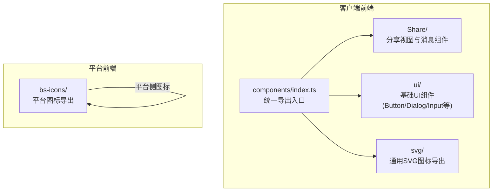
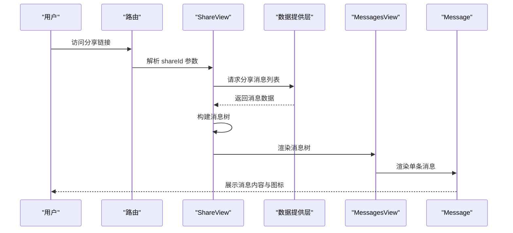
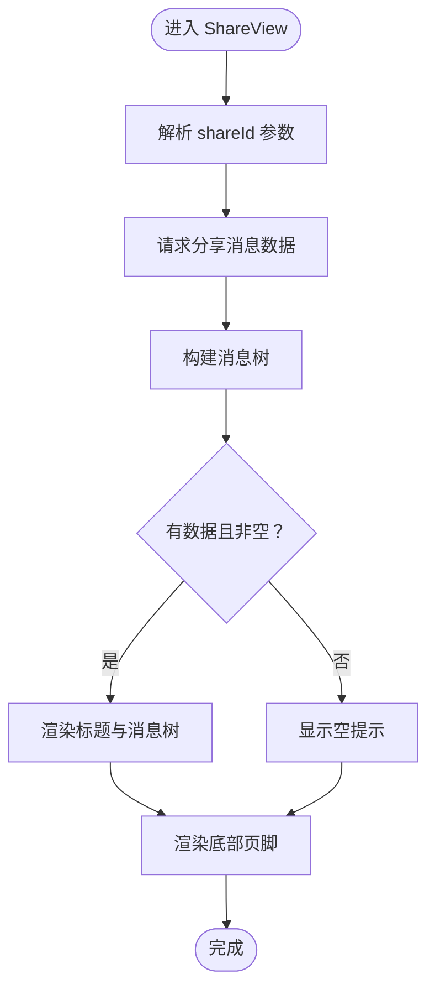
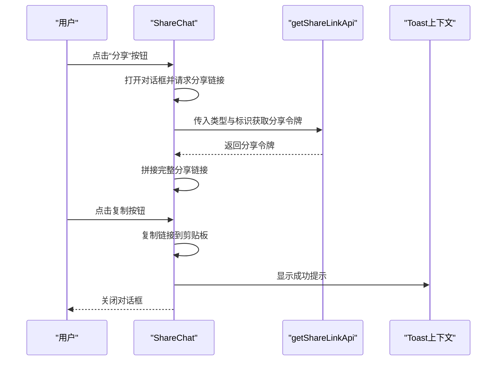
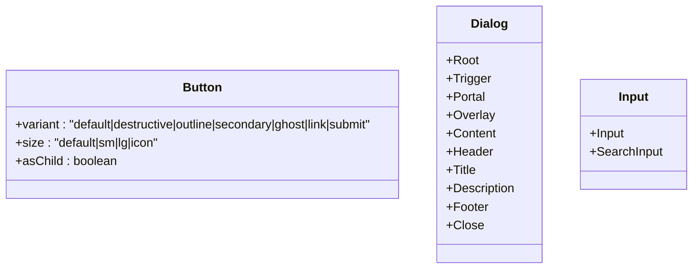
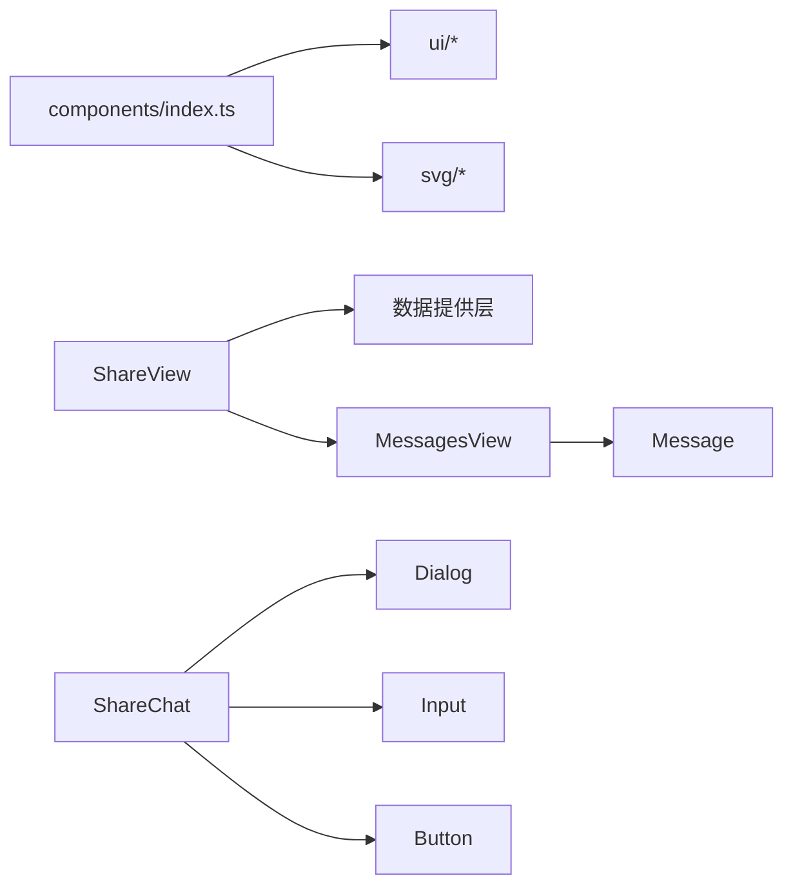

# 共享组件

<cite>
**本文引用的文件**
- [src/frontend/client/src/components/Share/ShareView.tsx](file://src/frontend/client/src/components/Share/ShareView.tsx)
- [src/frontend/client/src/components/Share/ShareChat.tsx](file://src/frontend/client/src/components/Share/ShareChat.tsx)
- [src/frontend/client/src/components/Share/MessagesView.tsx](file://src/frontend/client/src/components/Share/MessagesView.tsx)
- [src/frontend/client/src/components/Share/Message.tsx](file://src/frontend/client/src/components/Share/Message.tsx)
- [src/frontend/client/src/components/ui/Button.tsx](file://src/frontend/client/src/components/ui/Button.tsx)
- [src/frontend/client/src/components/ui/Dialog.tsx](file://src/frontend/client/src/components/ui/Dialog.tsx)
- [src/frontend/client/src/components/ui/Input.tsx](file://src/frontend/client/src/components/ui/Input.tsx)
- [src/frontend/client/src/components/svg/index.ts](file://src/frontend/client/src/components/svg/index.ts)
- [src/frontend/platform/src/components/bs-icons/index.ts](file://src/frontend/platform/src/components/bs-icons/index.ts)
- [src/frontend/client/src/components/index.ts](file://src/frontend/client/src/components/index.ts)
</cite>

## 目录
1. [引言](#引言)
2. [项目结构](#项目结构)
3. [核心组件](#核心组件)
4. [架构总览](#架构总览)
5. [详细组件分析](#详细组件分析)
6. [依赖分析](#依赖分析)
7. [性能考虑](#性能考虑)
8. [故障排查指南](#故障排查指南)
9. [结论](#结论)
10. [附录](#附录)

## 引言
本文件面向 Bisheng 客户端前端“共享组件”体系，系统化梳理并文档化以下内容：
- Page404 页面组件与分享页面组件的功能特性与使用方式
- UI 组件库（按钮、输入框、对话框等）的组织结构、属性接口与样式系统集成
- SVG 图标系统的管理：图标组件的导入、使用与主题适配
- 组件的可复用性设计、属性接口定义与样式系统集成
- 共享组件的开发规范与最佳实践

目标是帮助开发者快速理解与正确使用共享组件，并在新功能中保持一致的交互与视觉体验。

## 项目结构
共享组件主要分布在客户端前端的 components 目录下，按功能域划分：
- Share：分享相关页面与消息渲染组件
- ui：基于 Radix UI 的可组合基础 UI 组件库
- svg：通用 SVG 图标集合导出入口
- 平台侧 bs-icons：平台专用图标集合导出入口

图表来源
- [src/frontend/client/src/components/index.ts](file://src/frontend/client/src/components/index.ts#L1-L4)
- [src/frontend/client/src/components/Share/ShareView.tsx](file://src/frontend/client/src/components/Share/ShareView.tsx#L1-L82)
- [src/frontend/client/src/components/ui/Button.tsx](file://src/frontend/client/src/components/ui/Button.tsx#L1-L53)
- [src/frontend/client/src/components/svg/index.ts](file://src/frontend/client/src/components/svg/index.ts#L1-L59)
- [src/frontend/platform/src/components/bs-icons/index.ts](file://src/frontend/platform/src/components/bs-icons/index.ts#L1-L43)

章节来源
- [src/frontend/client/src/components/index.ts](file://src/frontend/client/src/components/index.ts#L1-L4)

## 核心组件
本节聚焦两类关键共享组件：Page404 页面组件与分享页面组件。

- Page404 页面组件
  - 设计原则：简洁明确地提示用户访问的资源不存在；提供返回首页或重试的引导
  - 实现要点：通过路由参数判断是否为有效路径；结合国际化文案与主题样式进行展示
  - 使用建议：在路由兜底处统一引入，避免重复逻辑；确保与站点整体风格一致

- 分享页面组件
  - 功能特性：
    - 基于分享令牌加载对话历史树形结构
    - 支持动态设置文档标题，提升 SEO 与用户体验
    - 加载中显示旋转指示器；空数据时友好提示
    - 底部固定页脚，适配移动端与桌面端
  - 关键流程：参数解析 → 数据获取 → 树形构建 → 渲染标题与消息树 → 提供页脚

章节来源
- [src/frontend/client/src/components/Share/ShareView.tsx](file://src/frontend/client/src/components/Share/ShareView.tsx#L1-L82)

## 架构总览
共享组件的调用关系与数据流如下：

图表来源
- [src/frontend/client/src/components/Share/ShareView.tsx](file://src/frontend/client/src/components/Share/ShareView.tsx#L1-L82)
- [src/frontend/client/src/components/Share/MessagesView.tsx](file://src/frontend/client/src/components/Share/MessagesView.tsx#L1-L48)
- [src/frontend/client/src/components/Share/Message.tsx](file://src/frontend/client/src/components/Share/Message.tsx#L1-L119)

## 详细组件分析

### 分享视图组件（ShareView）
- 职责：作为分享页面的根容器，负责加载数据、构建标题、渲染消息树与页脚
- 关键点：
  - 参数解析与文档标题设置
  - 加载状态与空数据处理
  - 消息树构建与传递
  - 上下文提供者注入，标记当前为分享会话

图表来源
- [src/frontend/client/src/components/Share/ShareView.tsx](file://src/frontend/client/src/components/Share/ShareView.tsx#L1-L82)

章节来源
- [src/frontend/client/src/components/Share/ShareView.tsx](file://src/frontend/client/src/components/Share/ShareView.tsx#L1-L82)

### 分享对话框组件（ShareChat）
- 职责：弹窗式生成分享链接，支持一键复制与 Toast 提示
- 关键点：
  - 对话框状态控制与生命周期联动
  - 通过 API 获取分享令牌并拼接分享链接
  - 复制到剪贴板后反馈用户操作结果

图表来源
- [src/frontend/client/src/components/Share/ShareChat.tsx](file://src/frontend/client/src/components/Share/ShareChat.tsx#L1-L87)

章节来源
- [src/frontend/client/src/components/Share/ShareChat.tsx](file://src/frontend/client/src/components/Share/ShareChat.tsx#L1-L87)

### 消息视图组件（MessagesView）
- 职责：承载消息树的滚动容器，处理空数据与渲染入口
- 关键点：
  - 通过内部状态管理当前编辑项
  - 将 conversationId 作为 key 避免状态混合
  - 透传消息树给子组件渲染

章节来源
- [src/frontend/client/src/components/Share/MessagesView.tsx](file://src/frontend/client/src/components/Share/MessagesView.tsx#L1-L48)

### 单条消息组件（Message）
- 职责：渲染单条消息及其子消息树，包含头像图标、内容区、悬浮按钮与兄弟切换
- 关键点：
  - 基于消息来源决定显示标签
  - 条件渲染插件与内容组件
  - 通过上下文提供消息 ID 与会话 ID

章节来源
- [src/frontend/client/src/components/Share/Message.tsx](file://src/frontend/client/src/components/Share/Message.tsx#L1-L119)

### UI 组件库（Button/Dialog/Input）
- Button
  - 设计原则：通过变体与尺寸类目统一风格；支持 asChild 以复用语义标签
  - 接口要点：继承原生按钮属性，扩展 variant/size/asChild
  - 样式系统：基于 class-variance-authority 与工具函数组合类名
- Dialog
  - 设计原则：基于 Radix UI 的无障碍与动画能力；支持可选关闭按钮
  - 接口要点：Root/Trigger/Portal/Overlay/Content/Header/Title/Description/Footer/Close
  - 样式系统：居中布局与淡入淡出动画
- Input
  - 设计原则：统一输入框外观与焦点状态；提供带搜索图标的变体
  - 接口要点：继承原生输入属性，扩展搜索输入的类名参数

图表来源
- [src/frontend/client/src/components/ui/Button.tsx](file://src/frontend/client/src/components/ui/Button.tsx#L1-L53)
- [src/frontend/client/src/components/ui/Dialog.tsx](file://src/frontend/client/src/components/ui/Dialog.tsx#L1-L114)
- [src/frontend/client/src/components/ui/Input.tsx](file://src/frontend/client/src/components/ui/Input.tsx#L1-L50)

章节来源
- [src/frontend/client/src/components/ui/Button.tsx](file://src/frontend/client/src/components/ui/Button.tsx#L1-L53)
- [src/frontend/client/src/components/ui/Dialog.tsx](file://src/frontend/client/src/components/ui/Dialog.tsx#L1-L114)
- [src/frontend/client/src/components/ui/Input.tsx](file://src/frontend/client/src/components/ui/Input.tsx#L1-L50)

### SVG 图标系统
- 通用图标（client/svg）
  - 管理方式：集中导出，便于按需引入与 Tree-shaking
  - 适用场景：通用界面元素、状态指示、社交登录等
- 平台图标（platform/bs-icons）
  - 管理方式：按功能模块分组导出，统一命名规范
  - 适用场景：平台内工作流、知识库、菜单等专用图标
- 主题适配
  - 建议通过 CSS 变量或暗色模式类名切换实现颜色适配
  - 在组件中使用 className 或内联样式时，确保与主题一致

章节来源
- [src/frontend/client/src/components/svg/index.ts](file://src/frontend/client/src/components/svg/index.ts#L1-L59)
- [src/frontend/platform/src/components/bs-icons/index.ts](file://src/frontend/platform/src/components/bs-icons/index.ts#L1-L43)

## 依赖分析
- 组件导出入口
  - 统一从 components/index.ts 导出 ui、Plugins、svg，便于上层按需引入
- 分享组件依赖
  - ShareView 依赖数据提供层与消息树构建工具
  - ShareChat 依赖对话框与输入组件、Toast 上下文、复制工具
  - MessagesView/Message 依赖消息内容渲染与图标组件
- UI 组件依赖
  - Button/Dialog/Input 基于 Radix UI 与 class-variance-authority
  - Input 的 SearchInput 依赖 lucide-react 的 SearchIcon

图表来源
- [src/frontend/client/src/components/index.ts](file://src/frontend/client/src/components/index.ts#L1-L4)
- [src/frontend/client/src/components/Share/ShareView.tsx](file://src/frontend/client/src/components/Share/ShareView.tsx#L1-L82)
- [src/frontend/client/src/components/Share/ShareChat.tsx](file://src/frontend/client/src/components/Share/ShareChat.tsx#L1-L87)
- [src/frontend/client/src/components/Share/MessagesView.tsx](file://src/frontend/client/src/components/Share/MessagesView.tsx#L1-L48)
- [src/frontend/client/src/components/Share/Message.tsx](file://src/frontend/client/src/components/Share/Message.tsx#L1-L119)
- [src/frontend/client/src/components/ui/Dialog.tsx](file://src/frontend/client/src/components/ui/Dialog.tsx#L1-L114)
- [src/frontend/client/src/components/ui/Input.tsx](file://src/frontend/client/src/components/ui/Input.tsx#L1-L50)
- [src/frontend/client/src/components/ui/Button.tsx](file://src/frontend/client/src/components/ui/Button.tsx#L1-L53)

章节来源
- [src/frontend/client/src/components/index.ts](file://src/frontend/client/src/components/index.ts#L1-L4)

## 性能考虑
- 懒加载与按需引入
  - 通过统一导出入口与模块化拆分，减少初始包体积
- 列表渲染优化
  - 使用稳定 key（如 conversationId/messageId）避免状态错乱与重渲染
- 动画与过渡
  - 对话框与加载指示器采用轻量动画，避免阻塞主线程
- 图标与资源
  - SVG 图标集中导出，配合 CSS 主题减少运行时计算

## 故障排查指南
- 分享链接无法打开或显示空数据
  - 检查分享令牌是否有效、网络请求是否成功
  - 确认消息树构建逻辑与空数据分支处理
- 对话框无法显示或复制失败
  - 检查对话框状态与生命周期钩子
  - 确认复制权限与浏览器兼容性
- 样式异常或主题不生效
  - 检查 CSS 变量与暗色模式类名
  - 确认组件类名组合顺序与覆盖规则

章节来源
- [src/frontend/client/src/components/Share/ShareView.tsx](file://src/frontend/client/src/components/Share/ShareView.tsx#L1-L82)
- [src/frontend/client/src/components/Share/ShareChat.tsx](file://src/frontend/client/src/components/Share/ShareChat.tsx#L1-L87)

## 结论
Bisheng 客户端前端共享组件以“可复用、可组合、可扩展”为核心设计原则，通过统一导出入口、清晰的职责划分与一致的样式系统，实现了分享页面与基础 UI 组件的高内聚低耦合。遵循本文档的接口约定与最佳实践，可在保证一致性的同时提升开发效率与维护性。

## 附录
- 开发规范与最佳实践
  - 组件命名：采用帕斯卡命名，语义明确
  - 属性接口：尽量使用 TypeScript 接口约束，提供默认值
  - 样式系统：优先使用 className 组合与 CSS 变量，避免内联样式
  - 主题适配：统一通过主题上下文或 CSS 类名切换
  - 可访问性：为交互元素提供键盘可达与屏幕阅读器友好的标签
  - 文案国际化：统一通过本地化钩子或上下文管理文案
  - 错误处理：对异步请求与用户操作提供明确反馈与回退策略