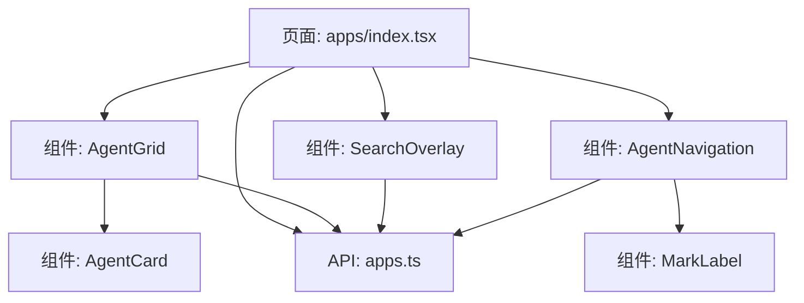
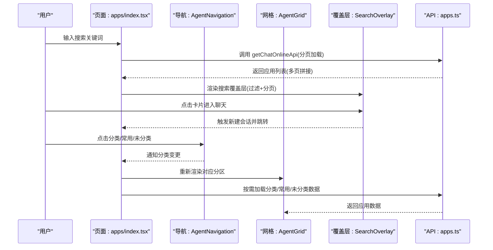
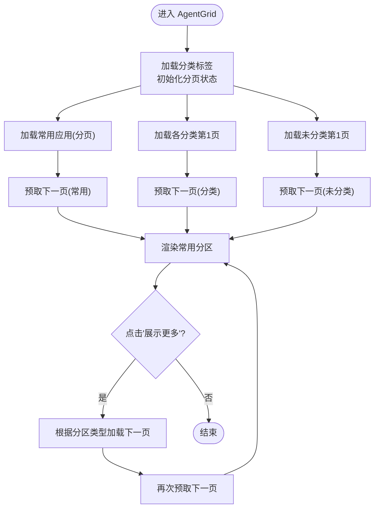
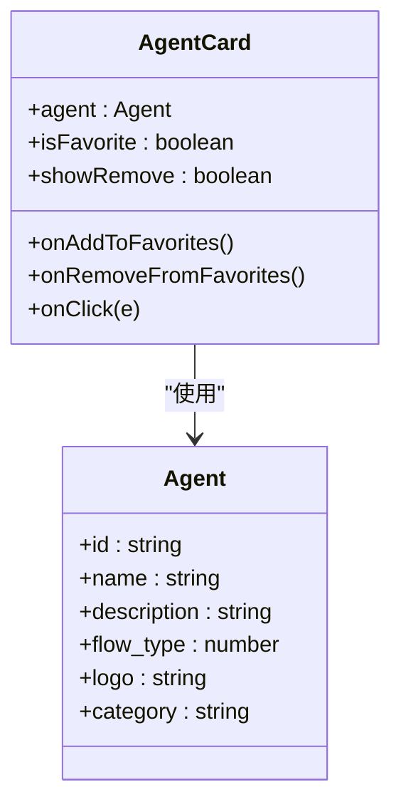
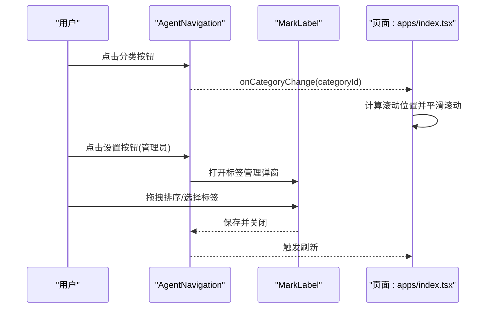
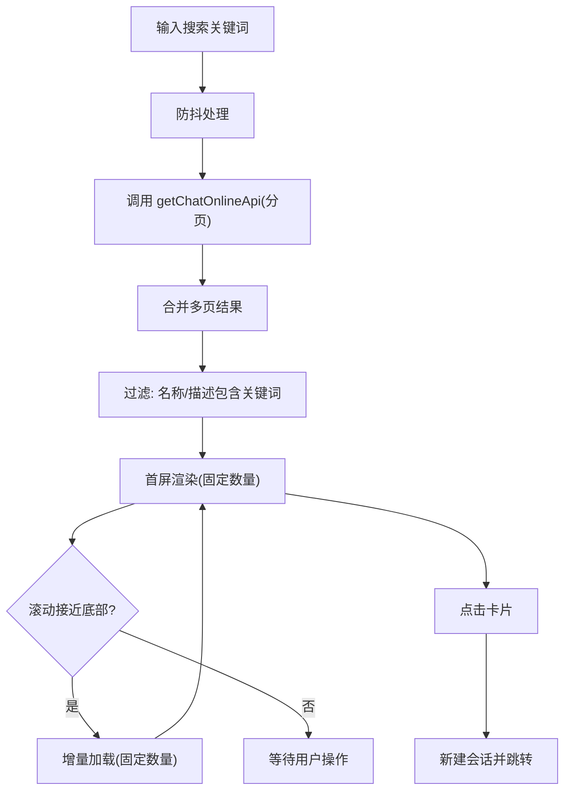
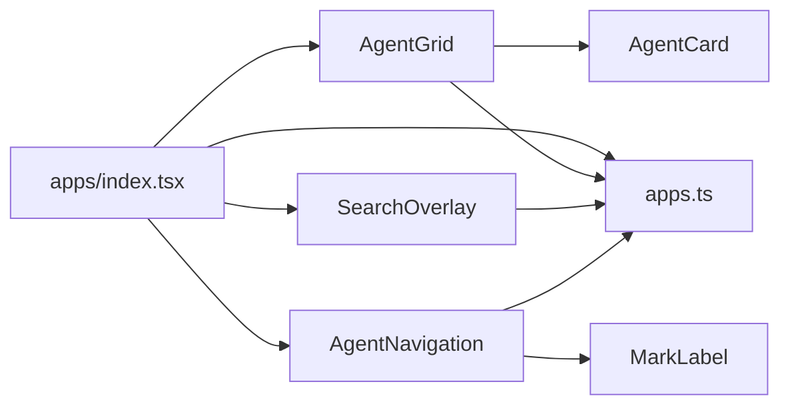

# 应用管理页面

<cite>
**本文档引用的文件**
- [src/frontend/client/src/pages/apps/index.tsx](file://src/frontend/client/src/pages/apps/index.tsx)
- [src/frontend/client/src/pages/apps/components/AgentGrid.tsx](file://src/frontend/client/src/pages/apps/components/AgentGrid.tsx)
- [src/frontend/client/src/pages/apps/components/AgentCard.tsx](file://src/frontend/client/src/pages/apps/components/AgentCard.tsx)
- [src/frontend/client/src/pages/apps/components/AgentNavigation.tsx](file://src/frontend/client/src/pages/apps/components/AgentNavigation.tsx)
- [src/frontend/client/src/pages/apps/components/SearchOverlay.tsx](file://src/frontend/client/src/pages/apps/components/SearchOverlay.tsx)
- [src/frontend/client/src/pages/apps/components/MarkLabel.tsx](file://src/frontend/client/src/pages/apps/components/MarkLabel.tsx)
- [src/frontend/client/src/api/apps.ts](file://src/frontend/client/src/api/apps.ts)
</cite>

## 目录
1. [简介](#简介)
2. [项目结构](#项目结构)
3. [核心组件](#核心组件)
4. [架构总览](#架构总览)
5. [详细组件分析](#详细组件分析)
6. [依赖关系分析](#依赖关系分析)
7. [性能考量](#性能考量)
8. [故障排查指南](#故障排查指南)
9. [结论](#结论)
10. [附录](#附录)

## 简介
本文件面向 Bisheng 应用管理页面，系统性梳理 AgentGrid 应用网格布局、AgentCard 应用卡片组件、AgentNavigation 导航系统以及 SearchOverlay 搜索覆盖层的实现与交互流程。文档重点阐述应用的展示、搜索与筛选机制，应用状态管理与用户交互处理，响应式设计实现，以及与后端 API 的数据交互模式（应用列表获取、状态更新与操作反馈）。最后提供可扩展的定制化开发指南与用户体验优化建议。

## 项目结构
应用管理页面位于客户端前端工程中，采用“页面 + 组件 + API”三层组织方式：
- 页面层：负责状态管理、路由交互与顶层布局
- 组件层：包含网格、卡片、导航、搜索覆盖层与标签管理等可复用 UI 组件
- API 层：封装与后端交互的请求方法，统一错误处理与拦截

图表来源
- [src/frontend/client/src/pages/apps/index.tsx](file://src/frontend/client/src/pages/apps/index.tsx#L21-L311)
- [src/frontend/client/src/pages/apps/components/AgentGrid.tsx](file://src/frontend/client/src/pages/apps/components/AgentGrid.tsx#L52-L505)
- [src/frontend/client/src/pages/apps/components/AgentCard.tsx](file://src/frontend/client/src/pages/apps/components/AgentCard.tsx#L30-L100)
- [src/frontend/client/src/pages/apps/components/AgentNavigation.tsx](file://src/frontend/client/src/pages/apps/components/AgentNavigation.tsx#L21-L103)
- [src/frontend/client/src/pages/apps/components/SearchOverlay.tsx](file://src/frontend/client/src/pages/apps/components/SearchOverlay.tsx#L20-L160)
- [src/frontend/client/src/pages/apps/components/MarkLabel.tsx](file://src/frontend/client/src/pages/apps/components/MarkLabel.tsx#L28-L141)
- [src/frontend/client/src/api/apps.ts](file://src/frontend/client/src/api/apps.ts#L14-L388)

章节来源
- [src/frontend/client/src/pages/apps/index.tsx](file://src/frontend/client/src/pages/apps/index.tsx#L1-L317)
- [src/frontend/client/src/pages/apps/components/AgentGrid.tsx](file://src/frontend/client/src/pages/apps/components/AgentGrid.tsx#L1-L505)
- [src/frontend/client/src/pages/apps/components/AgentCard.tsx](file://src/frontend/client/src/pages/apps/components/AgentCard.tsx#L1-L100)
- [src/frontend/client/src/pages/apps/components/AgentNavigation.tsx](file://src/frontend/client/src/pages/apps/components/AgentNavigation.tsx#L1-L103)
- [src/frontend/client/src/pages/apps/components/SearchOverlay.tsx](file://src/frontend/client/src/pages/apps/components/SearchOverlay.tsx#L1-L160)
- [src/frontend/client/src/pages/apps/components/MarkLabel.tsx](file://src/frontend/client/src/pages/apps/components/MarkLabel.tsx#L1-L141)
- [src/frontend/client/src/api/apps.ts](file://src/frontend/client/src/api/apps.ts#L1-L389)

## 核心组件
- AgentGrid：负责应用网格的分区展示、分页加载、常用应用与未分类应用的聚合，支持预加载策略以提升滚动体验。
- AgentCard：单个应用卡片，包含头像、名称、描述与收藏按钮，悬停态显示操作按钮，支持收藏/取消收藏。
- AgentNavigation：应用分类导航，包含“常用”“未分类”与动态标签，支持管理员编辑标签顺序与可见性。
- SearchOverlay：搜索覆盖层，提供搜索结果的分页加载与无限滚动体验，支持过滤与收藏操作。
- MarkLabel：标签管理弹窗，支持拖拽排序、选择与保存首页展示标签。

章节来源
- [src/frontend/client/src/pages/apps/components/AgentGrid.tsx](file://src/frontend/client/src/pages/apps/components/AgentGrid.tsx#L52-L505)
- [src/frontend/client/src/pages/apps/components/AgentCard.tsx](file://src/frontend/client/src/pages/apps/components/AgentCard.tsx#L30-L100)
- [src/frontend/client/src/pages/apps/components/AgentNavigation.tsx](file://src/frontend/client/src/pages/apps/components/AgentNavigation.tsx#L21-L103)
- [src/frontend/client/src/pages/apps/components/SearchOverlay.tsx](file://src/frontend/client/src/pages/apps/components/SearchOverlay.tsx#L20-L160)
- [src/frontend/client/src/pages/apps/components/MarkLabel.tsx](file://src/frontend/client/src/pages/apps/components/MarkLabel.tsx#L28-L141)

## 架构总览
应用管理页面采用“页面驱动 + 组件协作 + API 服务”的架构：
- 页面层负责顶层状态（搜索、收藏、滚动定位、刷新触发）
- 组件层负责局部状态与交互（卡片收藏、导航切换、覆盖层滚动）
- API 层负责与后端通信（标签、常用应用、在线应用、未分类应用）

图表来源
- [src/frontend/client/src/pages/apps/index.tsx](file://src/frontend/client/src/pages/apps/index.tsx#L38-L168)
- [src/frontend/client/src/pages/apps/components/AgentNavigation.tsx](file://src/frontend/client/src/pages/apps/components/AgentNavigation.tsx#L30-L54)
- [src/frontend/client/src/pages/apps/components/AgentGrid.tsx](file://src/frontend/client/src/pages/apps/components/AgentGrid.tsx#L216-L316)
- [src/frontend/client/src/pages/apps/components/SearchOverlay.tsx](file://src/frontend/client/src/pages/apps/components/SearchOverlay.tsx#L38-L112)
- [src/frontend/client/src/api/apps.ts](file://src/frontend/client/src/api/apps.ts#L377-L388)

## 详细组件分析

### AgentGrid 组件分析
AgentGrid 是应用网格的核心，承担以下职责：
- 分类标签加载与初始化分页状态
- 分类应用、常用应用与未分类应用的分页加载与预加载
- 收藏/取消收藏后的数据同步与刷新
- 区分“常用”“分类”“未分类”三类分区的渲染与“展示更多”按钮

关键实现要点
- 预加载策略：在加载第 n 页时，异步预取第 n+1 页，减少滚动等待时间
- 分页状态：记录当前页码、是否还有更多、预取数据与预取锁，避免重复请求
- 数据合并：首次加载与后续加载分别处理，保证数据连续性
- 刷新机制：通过外部触发器刷新网格，确保标签变更或收藏变更后数据一致性

图表来源
- [src/frontend/client/src/pages/apps/components/AgentGrid.tsx](file://src/frontend/client/src/pages/apps/components/AgentGrid.tsx#L92-L372)

章节来源
- [src/frontend/client/src/pages/apps/components/AgentGrid.tsx](file://src/frontend/client/src/pages/apps/components/AgentGrid.tsx#L52-L505)

### AgentCard 组件分析
AgentCard 提供统一的应用卡片展示与交互：
- 卡片固定高度与弹性布局，确保网格对齐与视觉稳定
- 悬停态显示收藏/取消收藏按钮，支持收藏状态提示
- 点击卡片触发上层回调，进入聊天会话

图表来源
- [src/frontend/client/src/pages/apps/components/AgentCard.tsx](file://src/frontend/client/src/pages/apps/components/AgentCard.tsx#L12-L36)

章节来源
- [src/frontend/client/src/pages/apps/components/AgentCard.tsx](file://src/frontend/client/src/pages/apps/components/AgentCard.tsx#L30-L100)

### AgentNavigation 组件分析
AgentNavigation 提供应用分类导航与标签管理入口：
- “常用”“未分类”与动态标签按钮，支持高亮当前选中项
- 管理员入口：打开标签管理弹窗，支持拖拽排序与保存
- 切换分类时，页面层负责滚动定位与重新渲染

图表来源
- [src/frontend/client/src/pages/apps/components/AgentNavigation.tsx](file://src/frontend/client/src/pages/apps/components/AgentNavigation.tsx#L56-L100)
- [src/frontend/client/src/pages/apps/components/MarkLabel.tsx](file://src/frontend/client/src/pages/apps/components/MarkLabel.tsx#L87-L141)
- [src/frontend/client/src/pages/apps/index.tsx](file://src/frontend/client/src/pages/apps/index.tsx#L38-L116)

章节来源
- [src/frontend/client/src/pages/apps/components/AgentNavigation.tsx](file://src/frontend/client/src/pages/apps/components/AgentNavigation.tsx#L21-L103)
- [src/frontend/client/src/pages/apps/components/MarkLabel.tsx](file://src/frontend/client/src/pages/apps/components/MarkLabel.tsx#L28-L141)

### SearchOverlay 组件分析
SearchOverlay 实现搜索覆盖层：
- 过滤逻辑：基于名称与描述进行大小写无关匹配
- 分页加载：按固定步长增量渲染，支持滚动触底加载
- 性能优化：使用 requestAnimationFrame 与被动滚动监听，短内容自动加载更多
- 交互：支持收藏/取消收藏、点击卡片进入聊天、关闭覆盖层

图表来源
- [src/frontend/client/src/pages/apps/index.tsx](file://src/frontend/client/src/pages/apps/index.tsx#L118-L168)
- [src/frontend/client/src/pages/apps/components/SearchOverlay.tsx](file://src/frontend/client/src/pages/apps/components/SearchOverlay.tsx#L38-L112)

章节来源
- [src/frontend/client/src/pages/apps/components/SearchOverlay.tsx](file://src/frontend/client/src/pages/apps/components/SearchOverlay.tsx#L20-L160)
- [src/frontend/client/src/pages/apps/index.tsx](file://src/frontend/client/src/pages/apps/index.tsx#L118-L174)

### 数据流与状态管理
- 页面状态：搜索查询、搜索结果、收藏列表、滚动容器引用、刷新触发器
- 组件状态：网格分区、分页状态、加载状态、覆盖层显示与滚动位置
- 全局状态：通过 Recoil 原子与 React Query 状态管理，确保跨组件共享与缓存一致性

章节来源
- [src/frontend/client/src/pages/apps/index.tsx](file://src/frontend/client/src/pages/apps/index.tsx#L21-L31)
- [src/frontend/client/src/pages/apps/components/AgentGrid.tsx](file://src/frontend/client/src/pages/apps/components/AgentGrid.tsx#L60-L85)

## 依赖关系分析
- 页面依赖组件：AgentGrid、AgentNavigation、SearchOverlay
- 组件依赖 API：getChatOnlineApi、getFrequently、getUncategorized、addToFrequentlyUsed、removeFromFrequentlyUsed、getHomeLabelApi、updateHomeLabelApi
- 组件间耦合：AgentGrid 与 AgentCard 为父子关系；AgentNavigation 与 MarkLabel 为控制与被控制关系；SearchOverlay 与 AgentCard 复用卡片组件

图表来源
- [src/frontend/client/src/pages/apps/index.tsx](file://src/frontend/client/src/pages/apps/index.tsx#L16-L18)
- [src/frontend/client/src/pages/apps/components/AgentGrid.tsx](file://src/frontend/client/src/pages/apps/components/AgentGrid.tsx#L7-L11)
- [src/frontend/client/src/pages/apps/components/AgentNavigation.tsx](file://src/frontend/client/src/pages/apps/components/AgentNavigation.tsx#L8)
- [src/frontend/client/src/pages/apps/components/SearchOverlay.tsx](file://src/frontend/client/src/pages/apps/components/SearchOverlay.tsx#L5)
- [src/frontend/client/src/pages/apps/components/MarkLabel.tsx](file://src/frontend/client/src/pages/apps/components/MarkLabel.tsx#L9)
- [src/frontend/client/src/api/apps.ts](file://src/frontend/client/src/api/apps.ts#L14-L388)

章节来源
- [src/frontend/client/src/pages/apps/index.tsx](file://src/frontend/client/src/pages/apps/index.tsx#L1-L317)
- [src/frontend/client/src/api/apps.ts](file://src/frontend/client/src/api/apps.ts#L1-L389)

## 性能考量
- 预加载策略：在加载第 n 页时预取第 n+1 页，降低滚动等待时间
- 分页与缓存：组件内维护分页状态与预取数据，避免重复请求
- 搜索防抖：输入防抖降低频繁请求
- 覆盖层滚动优化：被动事件监听与 requestAnimationFrame 提升滚动流畅度
- 短内容自动加载：当内容不足一屏时自动加载更多，改善体验

章节来源
- [src/frontend/client/src/pages/apps/components/AgentGrid.tsx](file://src/frontend/client/src/pages/apps/components/AgentGrid.tsx#L92-L173)
- [src/frontend/client/src/pages/apps/index.tsx](file://src/frontend/client/src/pages/apps/index.tsx#L168-L168)
- [src/frontend/client/src/pages/apps/components/SearchOverlay.tsx](file://src/frontend/client/src/pages/apps/components/SearchOverlay.tsx#L93-L112)

## 故障排查指南
- 搜索无结果：确认关键词是否为空、接口返回是否异常、分页加载是否完整
- 收藏失败：检查 addToFrequentlyUsed/removeFromFrequentlyUsed 的返回状态与错误提示
- 分类切换滚动异常：检查 sectionRefs 是否正确挂载、MutationObserver 是否及时断开
- 标签管理保存无效：确认 updateHomeLabelApi 是否成功、是否触发刷新

章节来源
- [src/frontend/client/src/pages/apps/index.tsx](file://src/frontend/client/src/pages/apps/index.tsx#L118-L174)
- [src/frontend/client/src/api/apps.ts](file://src/frontend/client/src/api/apps.ts#L340-L351)
- [src/frontend/client/src/pages/apps/components/AgentNavigation.tsx](file://src/frontend/client/src/pages/apps/components/AgentNavigation.tsx#L46-L54)

## 结论
应用管理页面通过清晰的组件划分与完善的预加载、分页与搜索机制，提供了良好的应用浏览与交互体验。页面层的状态管理与组件层的职责分离，使得功能扩展与维护更加便捷。结合后端 API 的稳定交互，整体实现了高效、可扩展的应用中心管理能力。

## 附录
- 定制化开发建议
  - 新增应用类型：在 API 层扩展类型映射与接口参数，页面层补充类型判断与路由跳转
  - 自定义网格列数：调整 AgentGrid 的网格列数与卡片尺寸，适配不同屏幕尺寸
  - 搜索增强：支持正则匹配、高亮关键词、历史搜索记录
  - 标签扩展：支持标签分组、颜色标识、权限控制
- 用户体验优化
  - 首屏加载：增加骨架屏与占位图，缩短感知等待时间
  - 错误反馈：统一错误提示与重试机制，提升可用性
  - 无障碍：为按钮与覆盖层提供键盘导航与屏幕阅读器支持