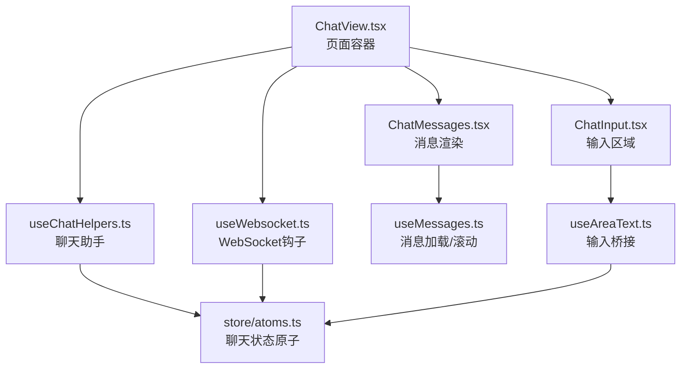
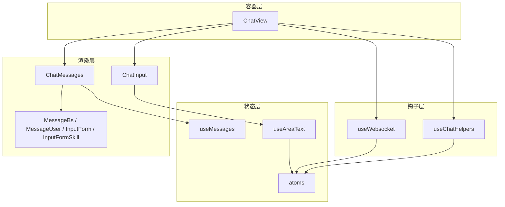
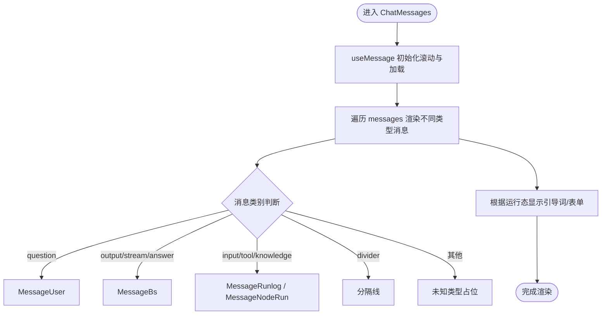
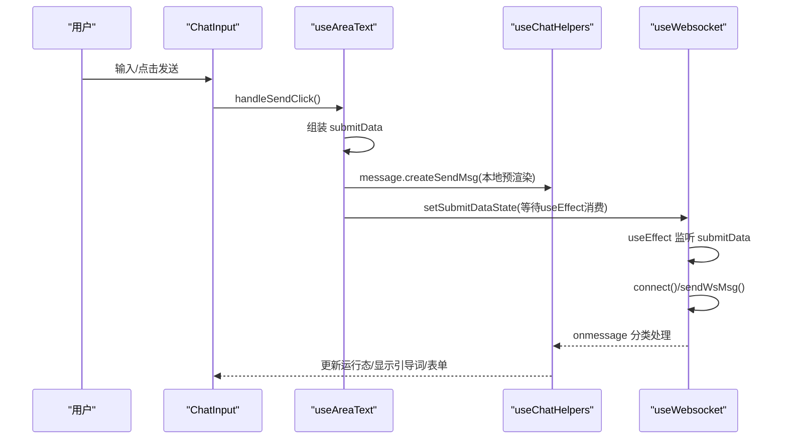
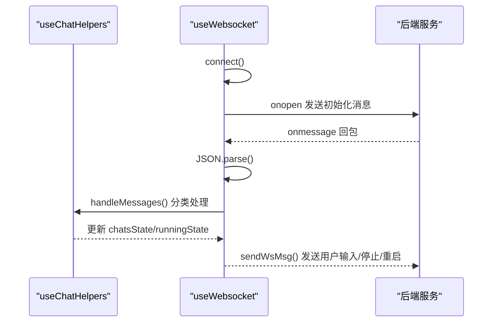
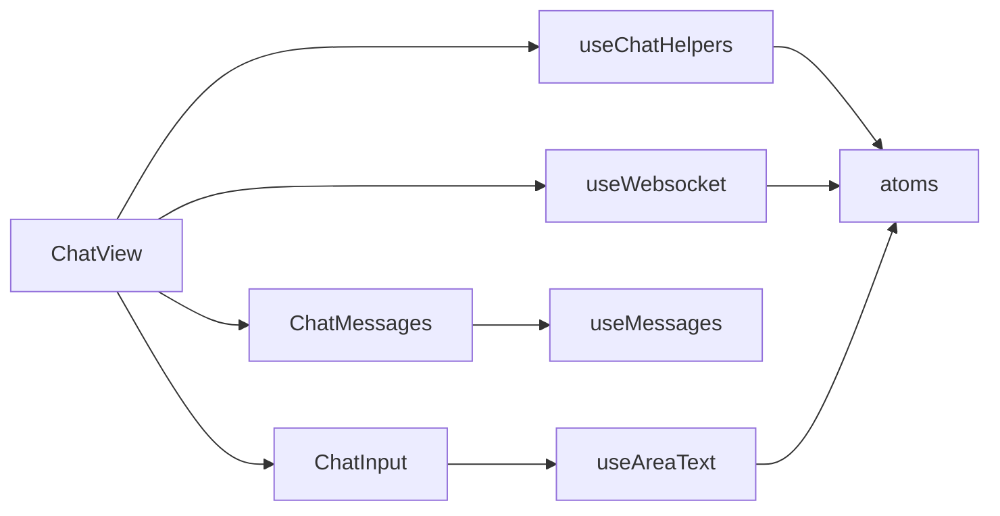

# 应用聊天页面

<cite>
**本文引用的文件**
- [ChatView.tsx](file://src/frontend/client/src/pages/appChat/ChatView.tsx)
- [useChatHelpers.ts](file://src/frontend/client/src/pages/appChat/useChatHelpers.ts)
- [useWebsocket.ts](file://src/frontend/client/src/pages/appChat/useWebsocket.ts)
- [ChatMessages.tsx](file://src/frontend/client/src/pages/appChat/ChatMessages.tsx)
- [ChatInput.tsx](file://src/frontend/client/src/pages/appChat/ChatInput.tsx)
- [atoms.ts](file://src/frontend/client/src/pages/appChat/store/atoms.ts)
- [useMessages.ts](file://src/frontend/client/src/pages/appChat/useMessages.ts)
- [useAreaText.ts](file://src/frontend/client/src/pages/appChat/useAreaText.ts)
- [MessageBs.tsx](file://src/frontend/client/src/pages/appChat/components/MessageBs.tsx)
- [MessageUser.tsx](file://src/frontend/client/src/pages/appChat/components/MessageUser.tsx)
- [InputForm.tsx](file://src/frontend/client/src/pages/appChat/components/InputForm.tsx)
- [InputFormSkill.tsx](file://src/frontend/client/src/pages/appChat/components/InputFormSkill.tsx)
</cite>

## 目录
1. [引言](#引言)
2. [项目结构](#项目结构)
3. [核心组件](#核心组件)
4. [架构总览](#架构总览)
5. [详细组件分析](#详细组件分析)
6. [依赖分析](#依赖分析)
7. [性能考虑](#性能考虑)
8. [故障排查指南](#故障排查指南)
9. [结论](#结论)
10. [附录](#附录)

## 引言
本文件面向 Bisheng 应用的聊天页面，系统性梳理 ChatView 主组件、消息渲染与输入处理、WebSocket 实时通信、消息状态管理与持久化策略、聊天助手工具函数的使用流程，以及聊天状态原子（atoms）与全局状态系统的集成方式。同时提供扩展开发指南与性能优化建议，帮助开发者快速理解并高效迭代聊天功能。

## 项目结构
聊天页面位于前端客户端侧，采用按页面组织的结构，核心文件如下：
- ChatView.tsx：页面容器，负责装配头部标题、消息面板、输入框等子组件，并注入聊天助手与 WebSocket 钩子。
- useChatHelpers.ts：聊天助手工具函数，封装消息创建、更新、流式处理、错误与运行态控制等。
- useWebsocket.ts：WebSocket 连接与消息分发，负责初始化、消息分类处理、重连与发送消息。
- ChatMessages.tsx：消息列表渲染，根据消息类型选择不同消息组件，支持引导词、表单输入、反馈与溯源等。
- ChatInput.tsx：输入区域，包含文本输入、语音转写、文件拖拽/粘贴、发送/停止/重启等交互。
- store/atoms.ts：聊天状态原子，统一管理会话数据、运行态、提交数据、WebSocket 状态等。
- useMessages.ts：消息加载与滚动控制，支持历史消息拉取与自动滚动。
- useAreaText.ts：输入区文本与表单事件桥接，将用户输入转化为 submitData 并驱动 WebSocket。
- components/*：消息与输入组件，如 MessageBs、MessageUser、InputForm、InputFormSkill 等。

**图表来源**
- [ChatView.tsx](file://src/frontend/client/src/pages/appChat/ChatView.tsx#L10-L44)
- [useChatHelpers.ts](file://src/frontend/client/src/pages/appChat/useChatHelpers.ts#L15-L414)
- [useWebsocket.ts](file://src/frontend/client/src/pages/appChat/useWebsocket.ts#L28-L362)
- [ChatMessages.tsx](file://src/frontend/client/src/pages/appChat/ChatMessages.tsx#L20-L146)
- [ChatInput.tsx](file://src/frontend/client/src/pages/appChat/ChatInput.tsx#L14-L125)
- [atoms.ts](file://src/frontend/client/src/pages/appChat/store/atoms.ts#L1-L107)
- [useMessages.ts](file://src/frontend/client/src/pages/appChat/useMessages.ts#L11-L91)
- [useAreaText.ts](file://src/frontend/client/src/pages/appChat/useAreaText.ts#L27-L242)

**章节来源**
- [ChatView.tsx](file://src/frontend/client/src/pages/appChat/ChatView.tsx#L10-L44)
- [useChatHelpers.ts](file://src/frontend/client/src/pages/appChat/useChatHelpers.ts#L15-L414)
- [useWebsocket.ts](file://src/frontend/client/src/pages/appChat/useWebsocket.ts#L28-L362)
- [ChatMessages.tsx](file://src/frontend/client/src/pages/appChat/ChatMessages.tsx#L20-L146)
- [ChatInput.tsx](file://src/frontend/client/src/pages/appChat/ChatInput.tsx#L14-L125)
- [atoms.ts](file://src/frontend/client/src/pages/appChat/store/atoms.ts#L1-L107)
- [useMessages.ts](file://src/frontend/client/src/pages/appChat/useMessages.ts#L11-L91)
- [useAreaText.ts](file://src/frontend/client/src/pages/appChat/useAreaText.ts#L27-L242)

## 核心组件
- ChatView：页面主容器，注入 useChatHelpers 与 useWebSocket，组合 HeaderTitle、ChatMessages、ChatInput。
- useChatHelpers：负责消息增删改、流式更新、运行态控制、错误处理、引导词与表单输入提示等。
- useWebsocket：负责 WebSocket 连接、初始化消息、消息分类处理、重连与发送消息。
- ChatMessages：根据消息类别渲染不同组件，支持滚动、加载历史、引导词、表单输入等。
- ChatInput：输入区，支持文本、语音、文件、快捷键、发送/停止/重启等。
- atoms：聊天状态原子，统一管理会话数据、运行态、提交数据、WebSocket 状态等。
- useMessages：消息加载与滚动控制，支持上滑加载历史。
- useAreaText：输入区桥接，将用户输入转化为 submitData 并驱动 WebSocket。

**章节来源**
- [ChatView.tsx](file://src/frontend/client/src/pages/appChat/ChatView.tsx#L10-L44)
- [useChatHelpers.ts](file://src/frontend/client/src/pages/appChat/useChatHelpers.ts#L15-L414)
- [useWebsocket.ts](file://src/frontend/client/src/pages/appChat/useWebsocket.ts#L28-L362)
- [ChatMessages.tsx](file://src/frontend/client/src/pages/appChat/ChatMessages.tsx#L20-L146)
- [ChatInput.tsx](file://src/frontend/client/src/pages/appChat/ChatInput.tsx#L14-L125)
- [atoms.ts](file://src/frontend/client/src/pages/appChat/store/atoms.ts#L1-L107)
- [useMessages.ts](file://src/frontend/client/src/pages/appChat/useMessages.ts#L11-L91)
- [useAreaText.ts](file://src/frontend/client/src/pages/appChat/useAreaText.ts#L27-L242)

## 架构总览
聊天页面采用“容器组件 + 钩子 + 原子状态”的分层架构：
- 容器层：ChatView 负责装配与编排。
- 钩子层：useChatHelpers 与 useWebsocket 将业务逻辑与网络通信解耦。
- 状态层：atoms 提供集中式状态管理，useMessages/useAreaText 作为副作用协调器。
- 渲染层：ChatMessages 与各消息组件负责 UI 展示。

**图表来源**
- [ChatView.tsx](file://src/frontend/client/src/pages/appChat/ChatView.tsx#L10-L44)
- [useChatHelpers.ts](file://src/frontend/client/src/pages/appChat/useChatHelpers.ts#L15-L414)
- [useWebsocket.ts](file://src/frontend/client/src/pages/appChat/useWebsocket.ts#L28-L362)
- [ChatMessages.tsx](file://src/frontend/client/src/pages/appChat/ChatMessages.tsx#L20-L146)
- [ChatInput.tsx](file://src/frontend/client/src/pages/appChat/ChatInput.tsx#L14-L125)
- [atoms.ts](file://src/frontend/client/src/pages/appChat/store/atoms.ts#L1-L107)
- [useMessages.ts](file://src/frontend/client/src/pages/appChat/useMessages.ts#L11-L91)
- [useAreaText.ts](file://src/frontend/client/src/pages/appChat/useAreaText.ts#L27-L242)

## 详细组件分析

### ChatView 主组件
- 职责：注入 useChatHelpers 与 useWebSocket，渲染 HeaderTitle、ChatMessages、ChatInput。
- 关键点：通过 useMemo 生成头像组件；将用户信息、应用信息、会话标识传递给子组件。

**章节来源**
- [ChatView.tsx](file://src/frontend/client/src/pages/appChat/ChatView.tsx#L10-L44)

### 消息渲染机制（ChatMessages）
- 职责：根据消息类别选择对应组件渲染，支持引导词、系统消息、用户消息、助手消息、文件消息、运行日志、选择型输出等。
- 关键点：使用 useMessage 控制滚动与历史加载；根据运行态显示引导词与表单输入。

**图表来源**
- [ChatMessages.tsx](file://src/frontend/client/src/pages/appChat/ChatMessages.tsx#L20-L146)
- [MessageBs.tsx](file://src/frontend/client/src/pages/appChat/components/MessageBs.tsx#L45-L125)
- [MessageUser.tsx](file://src/frontend/client/src/pages/appChat/components/MessageUser.tsx#L9-L63)

**章节来源**
- [ChatMessages.tsx](file://src/frontend/client/src/pages/appChat/ChatMessages.tsx#L20-L146)
- [MessageBs.tsx](file://src/frontend/client/src/pages/appChat/components/MessageBs.tsx#L45-L125)
- [MessageUser.tsx](file://src/frontend/client/src/pages/appChat/components/MessageUser.tsx#L9-L63)

### 输入处理系统（ChatInput + useAreaText）
- 职责：文本输入、语音转写、文件拖拽/粘贴、发送/停止/重启、占位符与禁用态控制。
- 关键点：useAreaText 将输入转化为 submitData，驱动 useWebsocket 发送消息；根据运行态切换按钮状态。

**图表来源**
- [ChatInput.tsx](file://src/frontend/client/src/pages/appChat/ChatInput.tsx#L14-L125)
- [useAreaText.ts](file://src/frontend/client/src/pages/appChat/useAreaText.ts#L27-L242)
- [useChatHelpers.ts](file://src/frontend/client/src/pages/appChat/useChatHelpers.ts#L135-L399)
- [useWebsocket.ts](file://src/frontend/client/src/pages/appChat/useWebsocket.ts#L224-L362)

**章节来源**
- [ChatInput.tsx](file://src/frontend/client/src/pages/appChat/ChatInput.tsx#L14-L125)
- [useAreaText.ts](file://src/frontend/client/src/pages/appChat/useAreaText.ts#L27-L242)

### WebSocket 实时通信（useWebsocket）
- 职责：建立/维护 WebSocket 连接，发送初始化消息，解析后分发到 useChatHelpers 进行状态更新。
- 关键点：根据 flow_type 选择不同的初始化消息；对错误、节点运行、引导词、流式消息、结束消息进行分类处理；支持重连与重启回调。

**图表来源**
- [useWebsocket.ts](file://src/frontend/client/src/pages/appChat/useWebsocket.ts#L28-L222)
- [useChatHelpers.ts](file://src/frontend/client/src/pages/appChat/useChatHelpers.ts#L135-L399)

**章节来源**
- [useWebsocket.ts](file://src/frontend/client/src/pages/appChat/useWebsocket.ts#L28-L222)
- [useChatHelpers.ts](file://src/frontend/client/src/pages/appChat/useChatHelpers.ts#L135-L399)

### 聊天助手工具函数（useChatHelpers）
- 职责：封装消息创建/更新/流式更新、运行态控制、错误处理、引导词与表单输入提示、消息去重与分隔插入等。
- 关键点：基于 Immer 的不可变更新；根据 flow_type 与消息类别选择不同处理分支；提供 createSendMsg 用于本地预渲染。

**章节来源**
- [useChatHelpers.ts](file://src/frontend/client/src/pages/appChat/useChatHelpers.ts#L15-L414)

### 聊天状态原子（atoms）
- 职责：集中管理聊天数据、当前会话、运行态、提交数据、WebSocket 状态、错误信息等。
- 关键点：chatsState 以 chatId 为键的映射；runningState 记录每个会话的运行态；submitDataState 作为输入桥接的中间态。

**章节来源**
- [atoms.ts](file://src/frontend/client/src/pages/appChat/store/atoms.ts#L1-L107)

### 消息加载与滚动（useMessages）
- 职责：自动滚动到底部；监听滚动事件，触顶时加载历史消息；避免运行中或无更多时加载。
- 关键点：使用 requestAnimationFrame 保证滚动稳定；对新建会话（u- 开头）不加载历史。

**章节来源**
- [useMessages.ts](file://src/frontend/client/src/pages/appChat/useMessages.ts#L11-L91)

### 表单输入组件
- InputForm：工作流节点表单，支持多选、下拉、文件等控件，组装为 submitData。
- InputFormSkill：技能类表单，从接口获取变量项，校验后组装为 submitData。

**章节来源**
- [InputForm.tsx](file://src/frontend/client/src/pages/appChat/components/InputForm.tsx#L44-L177)
- [InputFormSkill.tsx](file://src/frontend/client/src/pages/appChat/components/InputFormSkill.tsx#L18-L138)

## 依赖分析
- ChatView 依赖 useChatHelpers 与 useWebsocket，组合 ChatMessages 与 ChatInput。
- useChatHelpers 依赖 atoms（chatsState、runningState、chatIdState）与后端 WebSocket。
- useWebsocket 依赖 atoms（submitDataState、runningState）与 useChatHelpers。
- ChatMessages 依赖 useMessages 与 atoms（currentChatState、currentRunningState）。
- ChatInput 依赖 useAreaText 与 atoms（currentRunningState、bishengConfState）。
- useAreaText 依赖 atoms（submitDataState、runningState、chatFileState、chatIdState、tabsState），并通过事件桥接与 useWebsocket 交互。

**图表来源**
- [ChatView.tsx](file://src/frontend/client/src/pages/appChat/ChatView.tsx#L10-L44)
- [useChatHelpers.ts](file://src/frontend/client/src/pages/appChat/useChatHelpers.ts#L15-L414)
- [useWebsocket.ts](file://src/frontend/client/src/pages/appChat/useWebsocket.ts#L28-L362)
- [ChatMessages.tsx](file://src/frontend/client/src/pages/appChat/ChatMessages.tsx#L20-L146)
- [ChatInput.tsx](file://src/frontend/client/src/pages/appChat/ChatInput.tsx#L14-L125)
- [useMessages.ts](file://src/frontend/client/src/pages/appChat/useMessages.ts#L11-L91)
- [useAreaText.ts](file://src/frontend/client/src/pages/appChat/useAreaText.ts#L27-L242)
- [atoms.ts](file://src/frontend/client/src/pages/appChat/store/atoms.ts#L1-L107)

**章节来源**
- [ChatView.tsx](file://src/frontend/client/src/pages/appChat/ChatView.tsx#L10-L44)
- [useChatHelpers.ts](file://src/frontend/client/src/pages/appChat/useChatHelpers.ts#L15-L414)
- [useWebsocket.ts](file://src/frontend/client/src/pages/appChat/useWebsocket.ts#L28-L362)
- [ChatMessages.tsx](file://src/frontend/client/src/pages/appChat/ChatMessages.tsx#L20-L146)
- [ChatInput.tsx](file://src/frontend/client/src/pages/appChat/ChatInput.tsx#L14-L125)
- [useMessages.ts](file://src/frontend/client/src/pages/appChat/useMessages.ts#L11-L91)
- [useAreaText.ts](file://src/frontend/client/src/pages/appChat/useAreaText.ts#L27-L242)
- [atoms.ts](file://src/frontend/client/src/pages/appChat/store/atoms.ts#L1-L107)

## 性能考虑
- 消息渲染
  - 使用 useMemo 生成头像组件，减少不必要的重渲染。
  - 消息列表使用 requestAnimationFrame 控制滚动，避免阻塞主线程。
- 状态更新
  - 使用 Immer 在原子层进行不可变更新，降低深层拷贝成本。
  - 仅在消息实际变化时更新，避免重复渲染。
- WebSocket
  - 连接复用与断线重连，避免频繁重建连接。
  - 流式消息按唯一 id 合并与增量更新，减少 DOM 操作。
- 输入处理
  - 文本域高度自适应，避免强制布局回流。
  - 文件上传与语音识别状态控制输入按钮可用性，减少无效操作。

[本节为通用性能建议，不直接分析具体文件]

## 故障排查指南
- WebSocket 连接失败
  - 检查 wsUrl 是否正确生成（根据 flow_type 与 bishengConfig）。
  - 查看 onerror/onclose 回调是否触发错误提示。
- 消息不显示或卡住
  - 确认 submitData 是否被 useWebsocket 消费（submitDataState 清空）。
  - 检查 handleMessages 中的消息过滤条件与类别分支。
- 运行态异常
  - 核对 runningState 的 showStop/showReRun/inputDisabled 状态切换逻辑。
  - 确保 end/end_cover/close 等关键消息触发正确的状态更新。
- 历史消息加载
  - 检查滚动阈值与 queryLock 防抖逻辑，确保不会重复请求。
  - 新建会话（u- 开头）不应触发历史加载。

**章节来源**
- [useWebsocket.ts](file://src/frontend/client/src/pages/appChat/useWebsocket.ts#L118-L222)
- [useChatHelpers.ts](file://src/frontend/client/src/pages/appChat/useChatHelpers.ts#L45-L91)
- [useMessages.ts](file://src/frontend/client/src/pages/appChat/useMessages.ts#L70-L91)

## 结论
该聊天页面通过清晰的分层设计与状态原子化管理，实现了消息渲染、输入处理与 WebSocket 实时通信的高效协同。借助 useChatHelpers 与 useWebsocket 的职责分离，系统具备良好的可扩展性与可维护性。建议在后续开发中继续强化错误边界与性能监控，以进一步提升用户体验。

## 附录
- 扩展开发指南
  - 新增消息类型：在 ChatMessages 中添加对应组件并在类型分支中渲染；在 useChatHelpers 中补充相应处理逻辑。
  - 新增输入类型：在 useAreaText 中扩展事件类型与参数；在 useWebsocket 中补充消息发送分支。
  - 新增运行态：在 atoms 中新增字段，在 useChatHelpers 与 useWebsocket 中同步更新。
- 性能优化建议
  - 对长消息进行虚拟滚动或分页加载。
  - 对流式消息进行节流合并，减少频繁渲染。
  - 对图片/文件等资源进行懒加载与缓存策略。

[本节为通用指导，不直接分析具体文件]