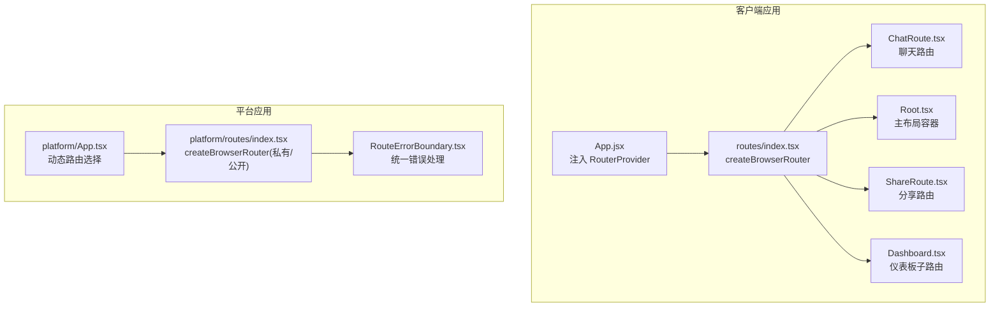
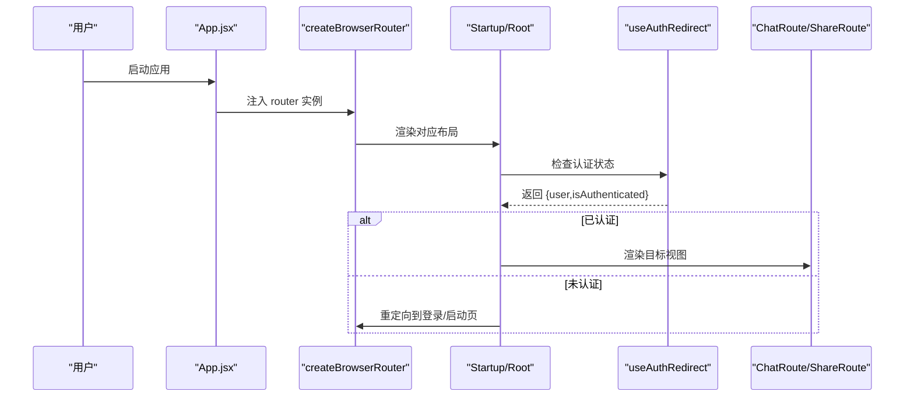
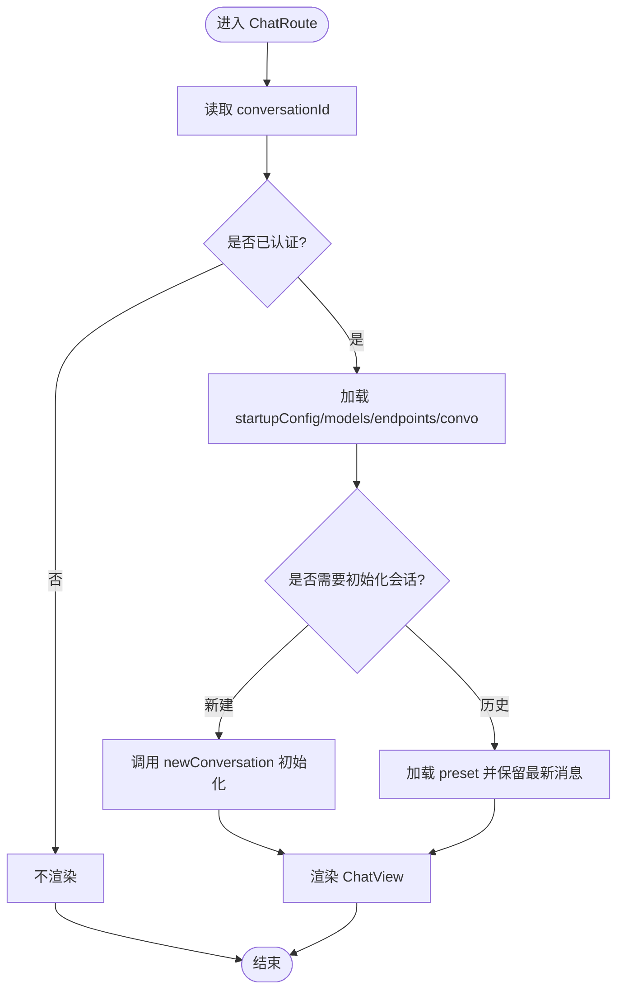
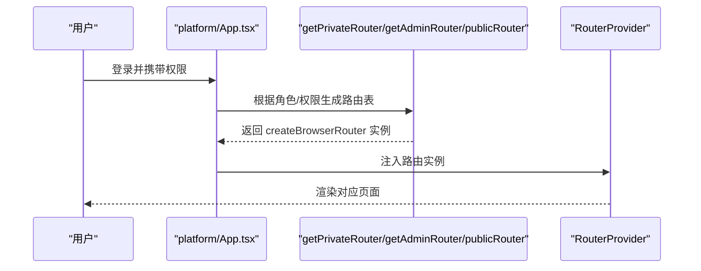
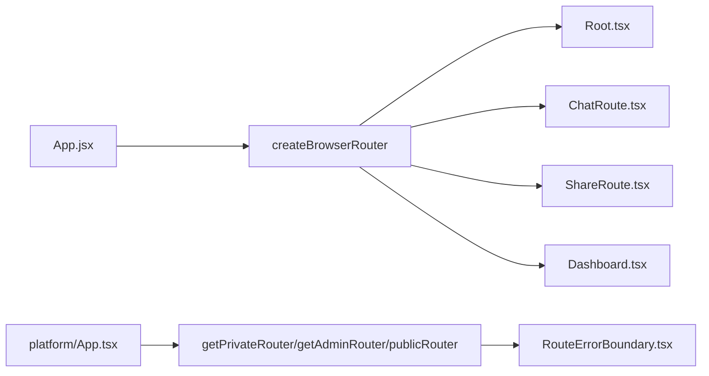

# 路由系统

<cite>
**本文引用的文件**
- [src/frontend/client/src/App.jsx](file://src/frontend/client/src/App.jsx)
- [src/frontend/client/src/main.jsx](file://src/frontend/client/src/main.jsx)
- [src/frontend/client/src/routes/index.tsx](file://src/frontend/client/src/routes/index.tsx)
- [src/frontend/client/src/routes/ChatRoute.tsx](file://src/frontend/client/src/routes/ChatRoute.tsx)
- [src/frontend/client/src/routes/Dashboard.tsx](file://src/frontend/client/src/routes/Dashboard.tsx)
- [src/frontend/client/src/routes/ShareRoute.tsx](file://src/frontend/client/src/routes/ShareRoute.tsx)
- [src/frontend/client/src/routes/Root.tsx](file://src/frontend/client/src/routes/Root.tsx)
- [src/frontend/client/src/routes/useAuthRedirect.ts](file://src/frontend/client/src/routes/useAuthRedirect.ts)
- [src/frontend/client/src/routes/Layouts/Login.tsx](file://src/frontend/client/src/routes/Layouts/Login.tsx)
- [src/frontend/client/src/routes/Layouts/Startup.tsx](file://src/frontend/client/src/routes/Layouts/Startup.tsx)
- [src/frontend/platform/src/App.tsx](file://src/frontend/platform/src/App.tsx)
- [src/frontend/platform/src/routes/index.tsx](file://src/frontend/platform/src/routes/index.tsx)
- [src/frontend/platform/src/routes/RouteErrorBoundary.tsx](file://src/frontend/platform/src/routes/RouteErrorBoundary.tsx)
</cite>

## 目录
1. [简介](#简介)
2. [项目结构](#项目结构)
3. [核心组件](#核心组件)
4. [架构总览](#架构总览)
5. [组件详解](#组件详解)
6. [依赖关系分析](#依赖关系分析)
7. [性能与懒加载](#性能与懒加载)
8. [故障排查指南](#故障排查指南)
9. [结论](#结论)
10. [附录：扩展开发指南](#附录扩展开发指南)

## 简介
本文件系统性梳理 Bisheng 客户端前端路由体系，覆盖 React Router 集成方式、路由守卫与权限控制、路由参数与状态管理、懒加载与性能优化，并提供扩展开发指南。文档同时对比客户端与平台端两套路由方案，帮助读者在不同场景下正确选择与扩展。

## 项目结构
- 客户端路由位于 client 前端工程，通过 createBrowserRouter 统一构建，包含聊天、仪表板、分享等路由。
- 平台端路由位于 platform 前端工程，支持按权限动态过滤菜单项，提供更丰富的后台管理路由集合。
- 应用根组件负责注入 RouterProvider，承载全局状态与主题、拖拽、错误边界等能力。

图表来源
- [src/frontend/client/src/App.jsx](file://src/frontend/client/src/App.jsx#L13-L46)
- [src/frontend/client/src/routes/index.tsx](file://src/frontend/client/src/routes/index.tsx#L37-L138)
- [src/frontend/platform/src/App.tsx](file://src/frontend/platform/src/App.tsx#L174-L178)
- [src/frontend/platform/src/routes/index.tsx](file://src/frontend/platform/src/routes/index.tsx#L63-L145)

章节来源
- [src/frontend/client/src/App.jsx](file://src/frontend/client/src/App.jsx#L1-L53)
- [src/frontend/client/src/routes/index.tsx](file://src/frontend/client/src/routes/index.tsx#L1-L138)
- [src/frontend/platform/src/App.tsx](file://src/frontend/platform/src/App.tsx#L1-L246)
- [src/frontend/platform/src/routes/index.tsx](file://src/frontend/platform/src/routes/index.tsx#L1-L187)

## 核心组件
- 客户端路由核心
  - 路由表构建：通过 createBrowserRouter 统一声明路径、嵌套路由、错误边界与 basename。
  - 路由守卫：useAuthRedirect 提供认证状态检查；StartupLayout 在已登录时重定向至聊天页。
  - 主布局 Root：提供导航、横幅、搜索上下文与会话设置提供者。
  - 聊天路由 ChatRoute：根据 URL 参数决定新建或加载历史会话，结合数据查询初始化模型与端点。
  - 分享路由 ShareRoute：渲染分享视图。
  - 仪表板路由 Dashboard：以 d/* 开头的子路由集合，当前启用提示词管理相关子路由。
- 平台端路由核心
  - 动态路由：依据用户权限过滤私有路由，生成 getPrivateRouter/getAdminRouter/publicRouter。
  - 懒加载：大量页面组件通过 lazy 异步加载，减少首屏体积。
  - 错误边界：RouteErrorBoundary 展示错误信息、状态码、堆栈与下载日志能力。

章节来源
- [src/frontend/client/src/routes/index.tsx](file://src/frontend/client/src/routes/index.tsx#L37-L138)
- [src/frontend/client/src/routes/ChatRoute.tsx](file://src/frontend/client/src/routes/ChatRoute.tsx#L24-L178)
- [src/frontend/client/src/routes/Root.tsx](file://src/frontend/client/src/routes/Root.tsx#L18-L62)
- [src/frontend/client/src/routes/useAuthRedirect.ts](file://src/frontend/client/src/routes/useAuthRedirect.ts#L5-L26)
- [src/frontend/client/src/routes/Layouts/Startup.tsx](file://src/frontend/client/src/routes/Layouts/Startup.tsx#L16-L71)
- [src/frontend/platform/src/routes/index.tsx](file://src/frontend/platform/src/routes/index.tsx#L63-L187)
- [src/frontend/platform/src/routes/RouteErrorBoundary.tsx](file://src/frontend/platform/src/routes/RouteErrorBoundary.tsx#L72-L224)

## 架构总览
React Router 在客户端通过 RouterProvider 注入，在平台端通过 useMemo 动态选择路由实例（私有/公开/管理员）。两者均提供 errorElement 以统一捕获异常并展示友好界面。

图表来源
- [src/frontend/client/src/App.jsx](file://src/frontend/client/src/App.jsx#L13-L46)
- [src/frontend/client/src/routes/index.tsx](file://src/frontend/client/src/routes/index.tsx#L37-L138)
- [src/frontend/client/src/routes/Layouts/Startup.tsx](file://src/frontend/client/src/routes/Layouts/Startup.tsx#L16-L71)
- [src/frontend/client/src/routes/useAuthRedirect.ts](file://src/frontend/client/src/routes/useAuthRedirect.ts#L5-L26)
- [src/frontend/client/src/routes/ChatRoute.tsx](file://src/frontend/client/src/routes/ChatRoute.tsx#L24-L178)

## 组件详解

### 客户端路由表与守卫
- 路由表设计
  - 登录/注册/忘记密码等启动页路由置于顶层，配合 StartupLayout。
  - 认证后路由置于 AuthLayout 下，Root 作为主容器，包含导航、横幅与 Outlet。
  - 聊天路由支持 /c/:conversationId?，其中空 ID 将被重定向到新建会话。
  - 分享路由支持 /share/:token 与带版本号的 /share/:token/:vid。
  - 仪表板路由以 d/* 开头，当前启用提示词管理子路由。
- 路由守卫
  - useAuthRedirect 返回认证状态，未认证时可触发跳转逻辑（当前注释掉）。
  - StartupLayout 在已登录时直接重定向到 /c/new，避免重复渲染。

章节来源
- [src/frontend/client/src/routes/index.tsx](file://src/frontend/client/src/routes/index.tsx#L37-L138)
- [src/frontend/client/src/routes/Layouts/Startup.tsx](file://src/frontend/client/src/routes/Layouts/Startup.tsx#L16-L71)
- [src/frontend/client/src/routes/useAuthRedirect.ts](file://src/frontend/client/src/routes/useAuthRedirect.ts#L5-L26)

### ChatRoute 聊天路由
- 功能要点
  - 通过 useParams 获取 conversationId，区分新建与历史会话。
  - 结合 useGetStartupConfig、useGetModelsQuery、useGetEndpointsQuery、useGetConvoIdQuery 等数据钩子，按条件初始化会话。
  - 当 conversationId 为新建标识且模型/端点可用时，调用 newConversation 创建默认会话。
  - 加载历史会话时，合并 preset 与模型数据，保留最新消息。
  - 使用临时会话标记控制 UI 行为。
- 参数与状态
  - 路由参数：conversationId（可选），用于判断新建或加载。
  - 状态：Recoil temporaryStore.isTemporary 控制临时会话 UI。
  - 数据：startupConfig、models、endpoints、assistantListMap。
- 权限控制
  - 通过 useAuthRedirect 保证仅在已认证状态下渲染聊天视图。

图表来源
- [src/frontend/client/src/routes/ChatRoute.tsx](file://src/frontend/client/src/routes/ChatRoute.tsx#L24-L178)

章节来源
- [src/frontend/client/src/routes/ChatRoute.tsx](file://src/frontend/client/src/routes/ChatRoute.tsx#L24-L178)

### Root 主布局容器
- 功能要点
  - 提供横幅 Banner、导航 Nav、移动端导航 MobileNav。
  - 通过多个 Context Provider 注入助手映射、文件映射、搜索上下文与会话设置。
  - 从本地存储恢复导航可见性状态。
- 权限控制
  - 未认证时直接返回空，确保非登录态不渲染主布局。

章节来源
- [src/frontend/client/src/routes/Root.tsx](file://src/frontend/client/src/routes/Root.tsx#L18-L62)

### ShareRoute 分享路由
- 功能要点
  - 专门用于渲染分享视图，路径支持 token 与可选版本号。
- 扩展建议
  - 可增加鉴权与权限校验逻辑，结合后端令牌验证。

章节来源
- [src/frontend/client/src/routes/ShareRoute.tsx](file://src/frontend/client/src/routes/ShareRoute.tsx#L1-L6)

### Dashboard 仪表板路由
- 功能要点
  - 以 d/* 开头的子路由集合，当前启用提示词管理相关子路由。
  - 未匹配时重定向到默认路径。
- 扩展建议
  - 可按模块拆分子路由，复用 Layouts/Dashboard 布局。

章节来源
- [src/frontend/client/src/routes/Dashboard.tsx](file://src/frontend/client/src/routes/Dashboard.tsx#L10-L82)

### 平台端路由与权限控制
- 动态路由
  - getPrivateRouter 接收用户权限数组，递归过滤无权限的路由项。
  - getAdminRouter 返回完整私有路由集合（管理员）。
  - publicRouter 仅开放登录与分享类路由。
- 懒加载
  - 大量页面组件通过 lazy 异步加载，降低首屏资源压力。
- 错误边界
  - RouteErrorBoundary 支持复制/下载错误日志，便于定位问题。

图表来源
- [src/frontend/platform/src/App.tsx](file://src/frontend/platform/src/App.tsx#L174-L178)
- [src/frontend/platform/src/routes/index.tsx](file://src/frontend/platform/src/routes/index.tsx#L147-L187)

章节来源
- [src/frontend/platform/src/App.tsx](file://src/frontend/platform/src/App.tsx#L174-L178)
- [src/frontend/platform/src/routes/index.tsx](file://src/frontend/platform/src/routes/index.tsx#L63-L187)
- [src/frontend/platform/src/routes/RouteErrorBoundary.tsx](file://src/frontend/platform/src/routes/RouteErrorBoundary.tsx#L72-L224)

## 依赖关系分析
- 客户端
  - App.jsx 依赖 RouterProvider 与路由表，Root 依赖多个上下文提供者。
  - ChatRoute 依赖数据查询钩子与会话创建逻辑。
  - StartupLayout 依赖 useGetStartupConfig 与重定向逻辑。
- 平台端
  - App.tsx 依赖用户上下文与权限，动态选择路由实例。
  - RouteErrorBoundary 作为全局错误兜底组件。

图表来源
- [src/frontend/client/src/App.jsx](file://src/frontend/client/src/App.jsx#L13-L46)
- [src/frontend/client/src/routes/index.tsx](file://src/frontend/client/src/routes/index.tsx#L37-L138)
- [src/frontend/platform/src/App.tsx](file://src/frontend/platform/src/App.tsx#L174-L178)
- [src/frontend/platform/src/routes/index.tsx](file://src/frontend/platform/src/routes/index.tsx#L147-L187)

章节来源
- [src/frontend/client/src/App.jsx](file://src/frontend/client/src/App.jsx#L1-L53)
- [src/frontend/client/src/routes/index.tsx](file://src/frontend/client/src/routes/index.tsx#L1-L138)
- [src/frontend/platform/src/App.tsx](file://src/frontend/platform/src/App.tsx#L1-L246)
- [src/frontend/platform/src/routes/index.tsx](file://src/frontend/platform/src/routes/index.tsx#L1-L187)

## 性能与懒加载
- 客户端
  - 路由层未见显式懒加载实现，建议对重型页面组件引入 React.lazy 与 Suspense。
  - 可结合 React Router 的懒加载语法（在路由定义中使用 lazy）进一步优化首屏。
- 平台端
  - 大量页面组件通过 lazy 异步加载，显著降低首屏体积。
  - RouteErrorBoundary 作为独立组件，避免阻塞主渲染。
- 通用优化建议
  - 对长列表、富文本编辑器等组件进行懒加载。
  - 利用 React.memo 与 useMemo 缓存计算结果。
  - 合理拆分路由模块，按需加载。

章节来源
- [src/frontend/platform/src/routes/index.tsx](file://src/frontend/platform/src/routes/index.tsx#L14-L47)
- [src/frontend/platform/src/routes/RouteErrorBoundary.tsx](file://src/frontend/platform/src/routes/RouteErrorBoundary.tsx#L72-L224)

## 故障排查指南
- 常见问题
  - 未登录访问受保护路由：客户端通过 StartupLayout 与 useAuthRedirect 控制；平台端通过 publicRouter 限制。
  - 路由 404：客户端与平台端均提供 404 页面与兜底导航。
  - 错误日志收集：平台端 RouteErrorBoundary 支持复制/下载错误日志，便于定位。
- 排查步骤
  - 确认认证状态与权限是否满足路由要求。
  - 检查路由表中是否存在对应路径与子路由。
  - 查看错误边界输出的错误信息与堆栈。
  - 若涉及懒加载，确认异步模块是否正确导出默认组件。

章节来源
- [src/frontend/client/src/routes/index.tsx](file://src/frontend/client/src/routes/index.tsx#L127-L138)
- [src/frontend/platform/src/routes/RouteErrorBoundary.tsx](file://src/frontend/platform/src/routes/RouteErrorBoundary.tsx#L72-L224)

## 结论
Bisheng 客户端与平台端分别采用集中式路由表与动态路由策略，前者强调简洁与可维护，后者强调权限与性能。两者均通过错误边界提升用户体验，并在平台端实现了完善的懒加载与权限过滤。建议在客户端引入懒加载与路由级缓存策略，以进一步优化性能与体验。

## 附录：扩展开发指南
- 新增页面路由（客户端）
  - 在路由表中添加新路径与组件映射，必要时嵌套子路由。
  - 如需权限控制，参考平台端的权限过滤模式。
  - 对重型页面组件使用懒加载与 Suspense 包裹。
- 新增页面路由（平台端）
  - 在私有路由数组中添加新路由项，必要时设置 permission 字段。
  - 使用 lazy 异步加载组件，减少首屏体积。
  - 为新路由提供错误边界与合适的 404 处理。
- 路由拦截器与守卫
  - 客户端：可在路由组件内使用自定义 Hook（如 useAuthRedirect）实现前置校验。
  - 平台端：通过 getPrivateRouter 动态过滤路由，实现细粒度权限控制。
- 参数与状态管理
  - 使用 useParams 获取路由参数，结合 React Query 与 Recoil 管理状态。
  - 对复杂状态使用 Context Provider 进行跨层级共享。

章节来源
- [src/frontend/client/src/routes/index.tsx](file://src/frontend/client/src/routes/index.tsx#L37-L138)
- [src/frontend/platform/src/routes/index.tsx](file://src/frontend/platform/src/routes/index.tsx#L147-L187)