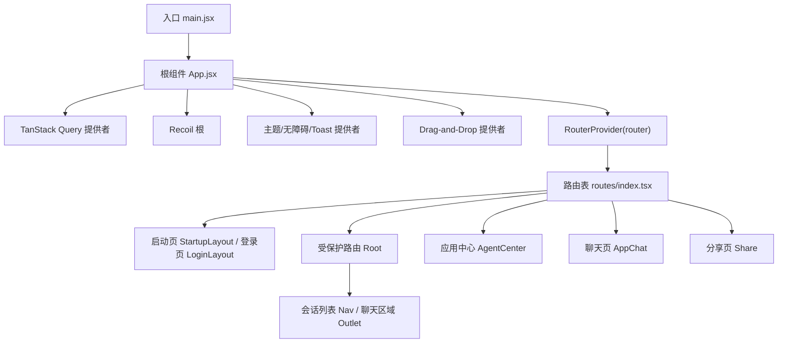
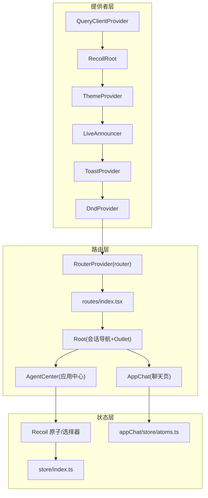
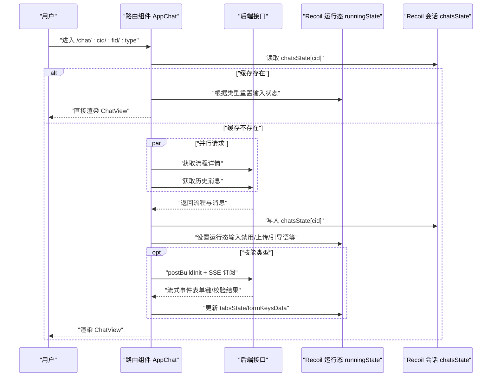
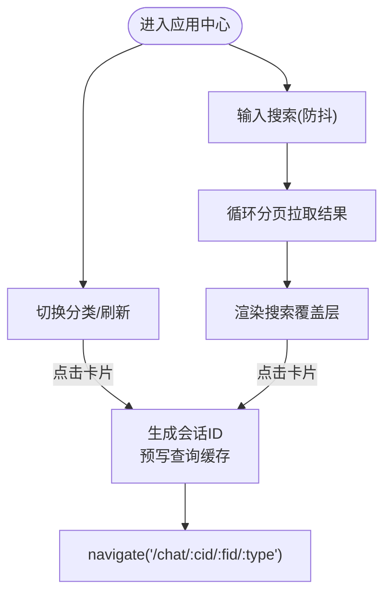
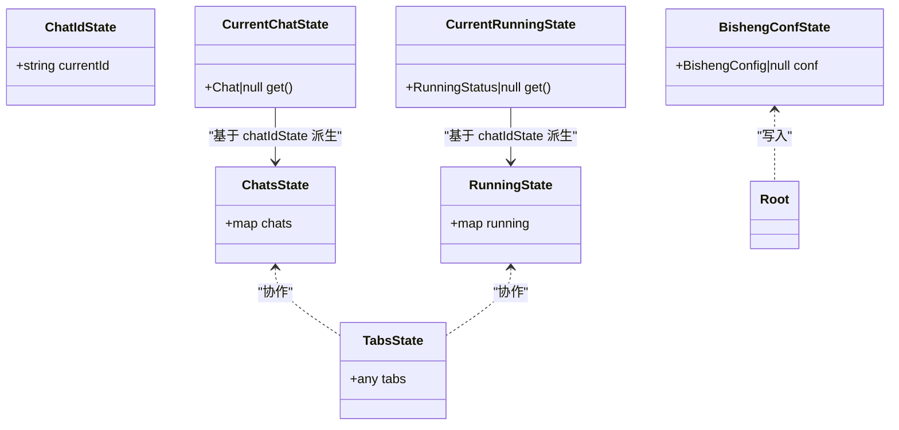
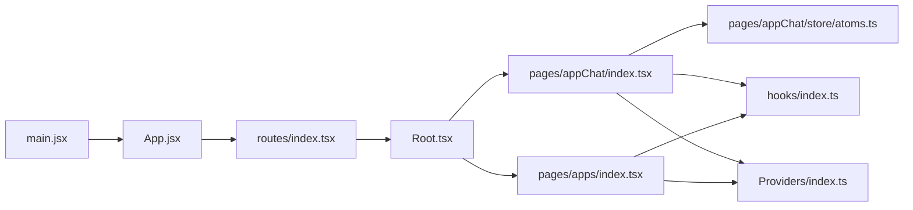

# 页面组件系统

<cite>
**本文引用的文件**
- [src/frontend/client/src/App.jsx](file://src/frontend/client/src/App.jsx)
- [src/frontend/client/src/main.jsx](file://src/frontend/client/src/main.jsx)
- [src/frontend/client/src/routes/index.tsx](file://src/frontend/client/src/routes/index.tsx)
- [src/frontend/client/src/routes/Root.tsx](file://src/frontend/client/src/routes/Root.tsx)
- [src/frontend/client/src/routes/Dashboard.tsx](file://src/frontend/client/src/routes/Dashboard.tsx)
- [src/frontend/client/src/pages/appChat/index.tsx](file://src/frontend/client/src/pages/appChat/index.tsx)
- [src/frontend/client/src/pages/appChat/store/atoms.ts](file://src/frontend/client/src/pages/appChat/store/atoms.ts)
- [src/frontend/client/src/pages/apps/index.tsx](file://src/frontend/client/src/pages/apps/index.tsx)
- [src/frontend/client/src/store/index.ts](file://src/frontend/client/src/store/index.ts)
- [src/frontend/client/src/hooks/index.ts](file://src/frontend/client/src/hooks/index.ts)
- [src/frontend/client/src/Providers/index.ts](file://src/frontend/client/src/Providers/index.ts)
</cite>

## 目录
1. [简介](#简介)
2. [项目结构](#项目结构)
3. [核心组件](#核心组件)
4. [架构总览](#架构总览)
5. [详细组件分析](#详细组件分析)
6. [依赖关系分析](#依赖关系分析)
7. [性能考量](#性能考量)
8. [故障排查指南](#故障排查指南)
9. [结论](#结论)
10. [附录](#附录)

## 简介
本文件系统性梳理 Bisheng 客户端前端页面组件体系，重点覆盖：
- 路由系统设计与实现：路由配置、页面导航、错误边界与鉴权布局
- 应用聊天页面与应用管理页面的核心实现：参数传递、状态同步、数据流管理
- 状态管理：Recoil 状态原子与选择器、上下文 Provider 的组织方式
- 生命周期管理、性能优化策略与用户体验设计原则
- 开发最佳实践与常见问题解决方案

## 项目结构
客户端前端采用 React + Vite 构建，路由基于 React Router v6，状态管理以 Recoil 为核心，配合 TanStack Query 进行数据请求与缓存，UI 层通过自研组件库与 TailwindCSS 实现。

图表来源
- [src/frontend/client/src/main.jsx](file://src/frontend/client/src/main.jsx#L1-L18)
- [src/frontend/client/src/App.jsx](file://src/frontend/client/src/App.jsx#L13-L46)
- [src/frontend/client/src/routes/index.tsx](file://src/frontend/client/src/routes/index.tsx#L37-L137)

章节来源
- [src/frontend/client/src/main.jsx](file://src/frontend/client/src/main.jsx#L1-L18)
- [src/frontend/client/src/App.jsx](file://src/frontend/client/src/App.jsx#L13-L46)
- [src/frontend/client/src/routes/index.tsx](file://src/frontend/client/src/routes/index.tsx#L1-L138)

## 核心组件
- 应用根组件 App.jsx：装配全局提供者（QueryClient、Recoil、主题、无障碍、Toast、DnD），注入 RouterProvider 并挂载路由树
- 路由系统 routes/index.tsx：定义登录、注册、找回密码、2FA、邮箱验证等启动流程；受保护路由 Root；聊天页、应用中心、分享页等业务路由
- 根布局 Root.tsx：在受保护路由内渲染侧边导航与 Outlet，提供搜索、文件映射、助手/代理地图等上下文
- 应用聊天页 appChat/index.tsx：根据路由参数加载会话、拉取流程与历史消息、构建运行态状态、管理 SSE 流与 UI 状态
- 应用管理页 apps/index.tsx：应用卡片网格、分类导航、搜索与收藏、新建会话并跳转聊天页
- 状态管理 store/atoms.ts：Recoil 原子与选择器，统一管理聊天会话、运行态、提交数据、WebSocket 状态、配置等
- 全局状态聚合 store/index.ts：导出各类模块化状态，便于按需引入
- 钩子与上下文 hooks/index.ts 与 Providers/index.ts：封装通用 Hook 与业务上下文，如助手/代理地图、文件映射、搜索、会话设置等

章节来源
- [src/frontend/client/src/App.jsx](file://src/frontend/client/src/App.jsx#L13-L46)
- [src/frontend/client/src/routes/index.tsx](file://src/frontend/client/src/routes/index.tsx#L37-L137)
- [src/frontend/client/src/routes/Root.tsx](file://src/frontend/client/src/routes/Root.tsx#L18-L62)
- [src/frontend/client/src/pages/appChat/index.tsx](file://src/frontend/client/src/pages/appChat/index.tsx#L18-L156)
- [src/frontend/client/src/pages/appChat/store/atoms.ts](file://src/frontend/client/src/pages/appChat/store/atoms.ts#L8-L107)
- [src/frontend/client/src/pages/apps/index.tsx](file://src/frontend/client/src/pages/apps/index.tsx#L21-L311)
- [src/frontend/client/src/store/index.ts](file://src/frontend/client/src/store/index.ts#L1-L33)
- [src/frontend/client/src/hooks/index.ts](file://src/frontend/client/src/hooks/index.ts#L1-L35)
- [src/frontend/client/src/Providers/index.ts](file://src/frontend/client/src/Providers/index.ts#L1-L24)

## 架构总览
整体采用“提供者装配 + 路由分层 + 状态原子”的架构模式：
- 提供者装配：QueryClient、Recoil、主题、无障碍、Toast、DnD、RouterProvider
- 路由分层：启动页（注册/忘记密码/重置密码）、登录页（含 2FA）、受保护路由（Root + Outlet）、业务页（聊天/应用中心/分享）
- 状态原子：以 Recoil 为中心，围绕聊天会话、运行态、提交数据、WebSocket 状态、配置等建立原子与选择器

图表来源
- [src/frontend/client/src/App.jsx](file://src/frontend/client/src/App.jsx#L26-L44)
- [src/frontend/client/src/routes/index.tsx](file://src/frontend/client/src/routes/index.tsx#L37-L137)
- [src/frontend/client/src/routes/Root.tsx](file://src/frontend/client/src/routes/Root.tsx#L38-L61)
- [src/frontend/client/src/pages/appChat/store/atoms.ts](file://src/frontend/client/src/pages/appChat/store/atoms.ts#L8-L107)
- [src/frontend/client/src/store/index.ts](file://src/frontend/client/src/store/index.ts#L16-L32)

## 详细组件分析

### 路由系统与导航
- 路由表 routes/index.tsx
  - 启动流程：注册、忘记密码、重置密码等路径位于根路径下
  - 登录流程：在受保护路由中提供登录与 2FA 页面
  - 受保护路由 Root：渲染会话导航与 Outlet，提供搜索、文件映射、助手/代理地图上下文
  - 业务路由：
    - 聊天页：/c/:conversationId?、/linsight/:conversationId?、/linsight/case/:sopId
    - 应用中心：/apps
    - 应用聊天：/chat/:conversationId/:fid/:type
    - 分享：/share/:token、/share/:token/:vid
  - 错误边界：各路由可挂载 RouteErrorBoundary
  - 基础路径：basename 来自环境变量 __APP_ENV__.BASE_URL

- 根布局 Root.tsx
  - 读取认证状态，未认证则不渲染
  - 提供搜索、文件映射、助手/代理地图上下文
  - 会话导航与移动端导航组合，Outlet 接收上下文（如导航可见性）

- 仪表盘路由片段（注释保留）
  - 保留了仪表盘相关路由片段（提示词管理等），便于后续启用

章节来源
- [src/frontend/client/src/routes/index.tsx](file://src/frontend/client/src/routes/index.tsx#L37-L137)
- [src/frontend/client/src/routes/Root.tsx](file://src/frontend/client/src/routes/Root.tsx#L18-L62)
- [src/frontend/client/src/routes/Dashboard.tsx](file://src/frontend/client/src/routes/Dashboard.tsx#L10-L82)

### 应用聊天页面（AppChat）
- 参数与导航
  - 路由参数：conversationId、fid（flowId）、type（技能/工作流/助理）
  - 支持外部传参（chatId、flowId、flowType），内部优先使用路由参数
  - 只有当 conversationId 存在且当前会话 flow 数据就绪时才渲染 ChatView

- 数据加载与状态初始化
  - 若缓存存在则跳过重复加载；否则根据 flowType 分支：
    - 技能/工作流：并行拉取流程详情与历史消息，必要时回退到“丢失流程”占位
    - 助理：拉取助理详情与历史消息
  - 初始化会话数据（flow、messages、historyEnd），并设置运行态（输入禁用、引导语、上传显示等）

- 运行态与 UI 同步
  - 使用 runningState 管理每个会话的运行态（running、inputDisabled、showUpload、showStop、guideWord 等）
  - tabsState 用于构建阶段的表单键值与进度反馈
  - bishengConfState 保存全局配置，Root 在挂载时拉取并写入

- SSE 流与构建
  - 通过 postBuildInit 获取会话 ID，再以 EventSource 订阅 /api/v1/build/stream/{flowId}
  - 流式事件解析：日志、输入表单键、节点校验结果；最终返回校验通过性
  - 强制最小加载时间，提升交互感知

- 会话切换与缓存
  - chatsState 以 chatId 为键缓存会话数据，避免重复请求
  - currentChatState 与 currentRunningState 作为选择器，基于 chatIdState 自动派生当前会话与运行态

图表来源
- [src/frontend/client/src/pages/appChat/index.tsx](file://src/frontend/client/src/pages/appChat/index.tsx#L33-L147)
- [src/frontend/client/src/pages/appChat/store/atoms.ts](file://src/frontend/client/src/pages/appChat/store/atoms.ts#L38-L53)

章节来源
- [src/frontend/client/src/pages/appChat/index.tsx](file://src/frontend/client/src/pages/appChat/index.tsx#L18-L156)
- [src/frontend/client/src/pages/appChat/store/atoms.ts](file://src/frontend/client/src/pages/appChat/store/atoms.ts#L8-L107)

### 应用管理页面（AgentCenter）
- 导航与滚动
  - 通过 AgentNavigation 切换分类；支持“常用”直达顶部与按类别滚动定位
  - 使用 Intersection/MutationObserver 保证 DOM 就绪后再滚动，避免滚动异常

- 搜索与分页
  - 输入防抖触发搜索，循环拉取所有页结果，合并为搜索结果集
  - 支持清空搜索、高亮与覆盖渲染

- 收藏与刷新
  - addToFavorites/removeFromFavorites 支持对 flow/assistant/workflow 的收藏操作
  - refreshTrigger 用于触发应用数据刷新

- 新建会话与跳转
  - handleCardClick 生成新会话 ID，预写查询缓存，调用 navigate 跳转至 /chat/:cid/:fid/:type

图表来源
- [src/frontend/client/src/pages/apps/index.tsx](file://src/frontend/client/src/pages/apps/index.tsx#L21-L311)

章节来源
- [src/frontend/client/src/pages/apps/index.tsx](file://src/frontend/client/src/pages/apps/index.tsx#L21-L311)

### 状态管理与数据流
- Recoil 原子与选择器
  - chatsState：会话映射（key=chatId）
  - chatIdState：当前会话 ID
  - currentChatState：基于 chatsState 与 chatIdState 的派生选择器
  - runningState：每个会话的运行态映射
  - currentRunningState：基于 runningState 与 chatIdState 的派生选择器
  - submitDataState、chatFileState、webSocketStatusState、errorState、tabsState
  - bishengConfState：全局配置

- 全局状态聚合
  - store/index.ts 将多个模块状态聚合导出，便于按需引入

- 上下文与钩子
  - hooks/index.ts 汇总各类业务钩子（认证、助手、代理、文件、消息、SSE 等）
  - Providers/index.ts 暴露搜索、文件映射、助手/代理地图、会话设置等上下文

图表来源
- [src/frontend/client/src/pages/appChat/store/atoms.ts](file://src/frontend/client/src/pages/appChat/store/atoms.ts#L8-L107)
- [src/frontend/client/src/routes/Root.tsx](file://src/frontend/client/src/routes/Root.tsx#L67-L75)

章节来源
- [src/frontend/client/src/pages/appChat/store/atoms.ts](file://src/frontend/client/src/pages/appChat/store/atoms.ts#L8-L107)
- [src/frontend/client/src/store/index.ts](file://src/frontend/client/src/store/index.ts#L16-L32)
- [src/frontend/client/src/hooks/index.ts](file://src/frontend/client/src/hooks/index.ts#L1-L35)
- [src/frontend/client/src/Providers/index.ts](file://src/frontend/client/src/Providers/index.ts#L1-L24)

## 依赖关系分析
- 入口与根组件
  - main.jsx 装配 ApiErrorBoundaryProvider 与 App
  - App.jsx 装配 QueryClient、Recoil、主题、无障碍、Toast、DnD、RouterProvider

- 路由与布局
  - routes/index.tsx 定义路由树，Root 作为受保护路由的根布局，提供上下文与导航

- 页面与状态
  - AppChat 通过 Recoil 原子与选择器管理会话与运行态，结合 hooks 与 Providers 完成数据流闭环
  - AgentCenter 通过查询缓存与导航钩子实现高效交互

图表来源
- [src/frontend/client/src/main.jsx](file://src/frontend/client/src/main.jsx#L10-L17)
- [src/frontend/client/src/App.jsx](file://src/frontend/client/src/App.jsx#L26-L44)
- [src/frontend/client/src/routes/index.tsx](file://src/frontend/client/src/routes/index.tsx#L37-L137)
- [src/frontend/client/src/routes/Root.tsx](file://src/frontend/client/src/routes/Root.tsx#L38-L61)
- [src/frontend/client/src/pages/appChat/index.tsx](file://src/frontend/client/src/pages/appChat/index.tsx#L18-L156)
- [src/frontend/client/src/pages/appChat/store/atoms.ts](file://src/frontend/client/src/pages/appChat/store/atoms.ts#L8-L107)
- [src/frontend/client/src/pages/apps/index.tsx](file://src/frontend/client/src/pages/apps/index.tsx#L21-L311)
- [src/frontend/client/src/hooks/index.ts](file://src/frontend/client/src/hooks/index.ts#L1-L35)
- [src/frontend/client/src/Providers/index.ts](file://src/frontend/client/src/Providers/index.ts#L1-L24)

章节来源
- [src/frontend/client/src/main.jsx](file://src/frontend/client/src/main.jsx#L10-L17)
- [src/frontend/client/src/App.jsx](file://src/frontend/client/src/App.jsx#L26-L44)
- [src/frontend/client/src/routes/index.tsx](file://src/frontend/client/src/routes/index.tsx#L37-L137)
- [src/frontend/client/src/pages/appChat/store/atoms.ts](file://src/frontend/client/src/pages/appChat/store/atoms.ts#L8-L107)

## 性能考量
- 请求与缓存
  - 使用 TanStack Query 的 QueryClient 与 QueryCache，集中处理 401 等错误并触发错误边界
  - AppChat 对流程详情与历史消息采用并行请求，减少首屏等待
  - chatsState 缓存会话数据，避免重复请求

- 状态与渲染
  - Recoil 原子粒度清晰，选择器按需派生，降低无关重渲染
  - AgentCenter 使用防抖搜索与分页加载，控制请求频率与数据量

- 交互体验
  - SSE 流式构建强制最小加载时间，改善感知性能
  - 移动端导航与响应式布局，提升可用性

[本节为通用指导，不直接分析具体文件]

## 故障排查指南
- 401 未授权
  - App.jsx 中 QueryCache.onError 捕获 401 并通过 ApiErrorBoundary 触发错误处理
  - 建议：在登录/2FA 后重试或刷新页面

- 聊天页无内容
  - 确认 conversationId 是否存在，以及 currentChatState 是否已写入 flow 数据
  - 检查 AppChat 的 init 流程与并行请求是否成功

- 应用中心滚动异常
  - 确认分类切换时是否等待 DOM 就绪（MutationObserver）
  - 检查 scrollContainerRef 是否正确引用容器

- 收藏/搜索失败
  - 确认 addToFavorites/removeFromFavorites 的类型映射（1/5/其他）与后端一致
  - 搜索分页循环终止条件（每页不足 pageSize）是否满足

章节来源
- [src/frontend/client/src/App.jsx](file://src/frontend/client/src/App.jsx#L16-L24)
- [src/frontend/client/src/pages/appChat/index.tsx](file://src/frontend/client/src/pages/appChat/index.tsx#L33-L147)
- [src/frontend/client/src/pages/apps/index.tsx](file://src/frontend/client/src/pages/apps/index.tsx#L76-L116)

## 结论
Bisheng 客户端前端以 React Router v6 为骨架，Recoil 为核心状态管理，结合 TanStack Query 与自研 Provider，实现了清晰的路由分层、稳定的会话状态与高效的交互体验。聊天页与应用中心分别体现了参数驱动的数据加载、SSE 流式构建与搜索/收藏的复杂交互，具备良好的扩展性与可维护性。

[本节为总结性内容，不直接分析具体文件]

## 附录
- 最佳实践
  - 路由：将启动流程与受保护路由分离，明确错误边界与鉴权上下文
  - 状态：以原子为中心，选择器派生视图所需数据，避免跨组件重复订阅
  - 请求：对并行请求进行并发控制与错误兜底，必要时提供回退策略
  - 交互：对高频输入使用防抖，对长列表使用分页与虚拟化，对关键流程增加最小加载时间
  - 可访问性：启用 LiveAnnouncer，确保键盘与屏幕阅读器友好

- 常见问题
  - 路由参数缺失导致页面不渲染：在页面入口处进行参数校验与默认跳转
  - SSE 连接中断：在 onerror 中记录错误并提示用户重试
  - 搜索结果为空：确认分页终止条件与后端返回格式一致性

[本节为通用指导，不直接分析具体文件]