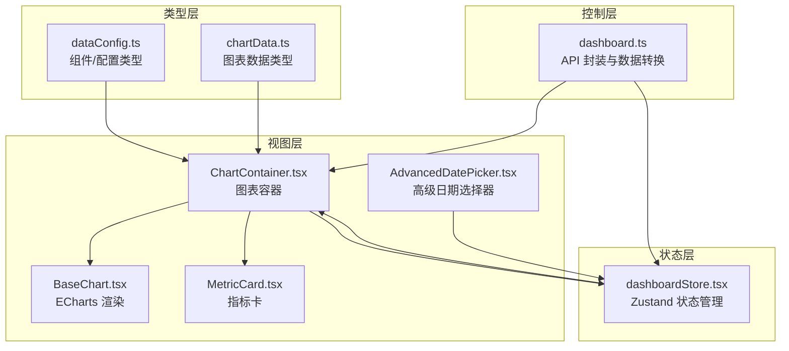
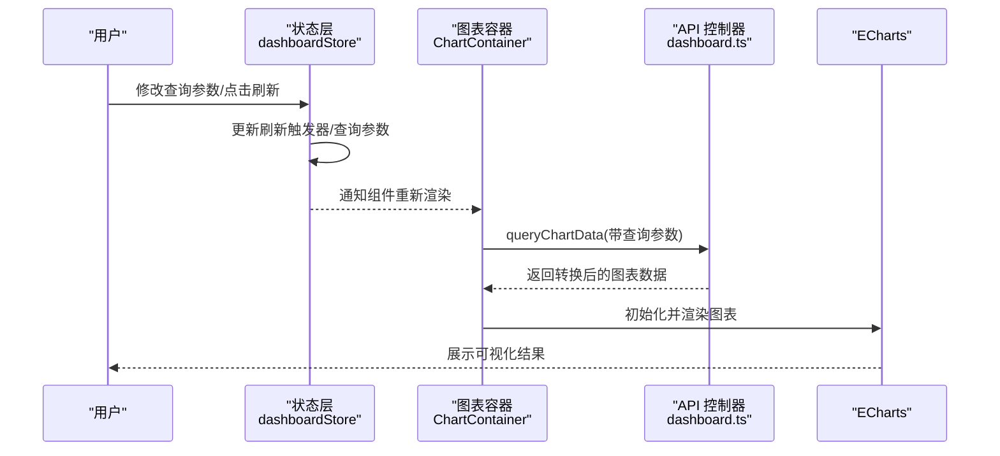
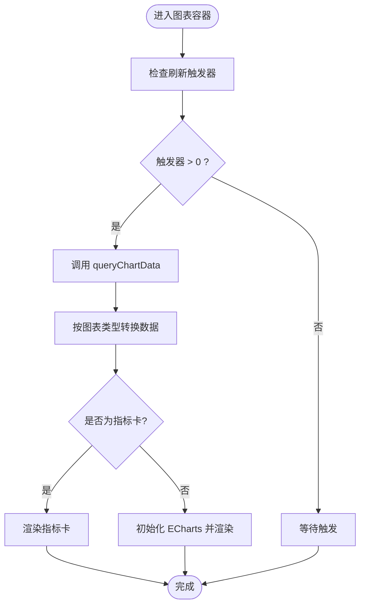
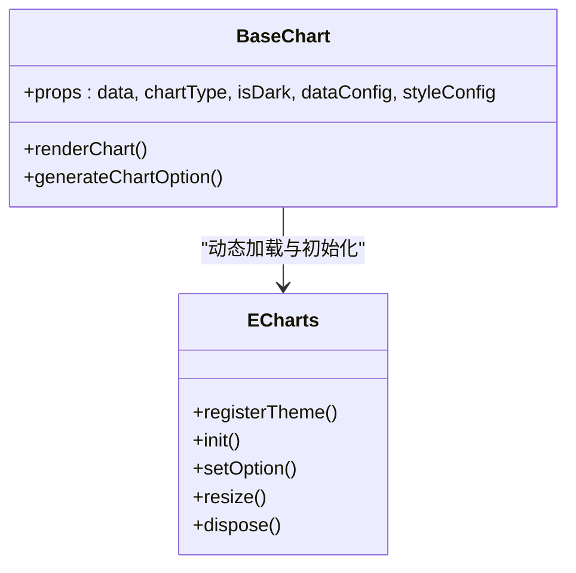
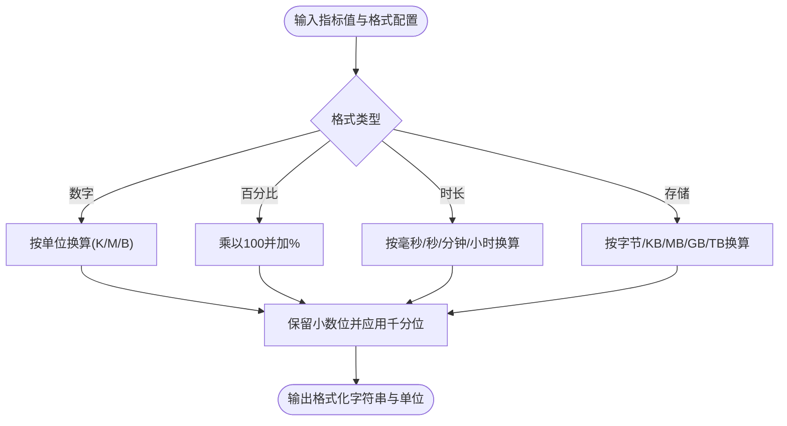
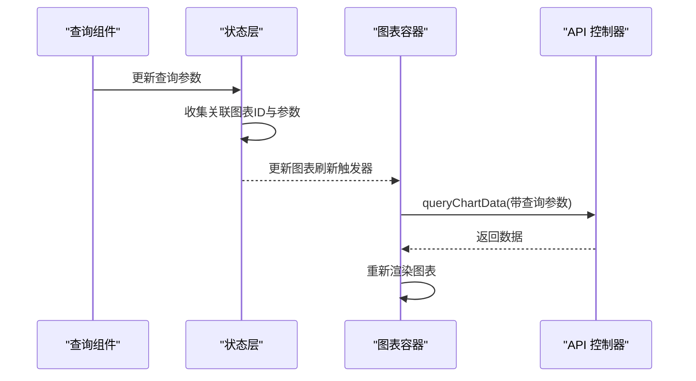
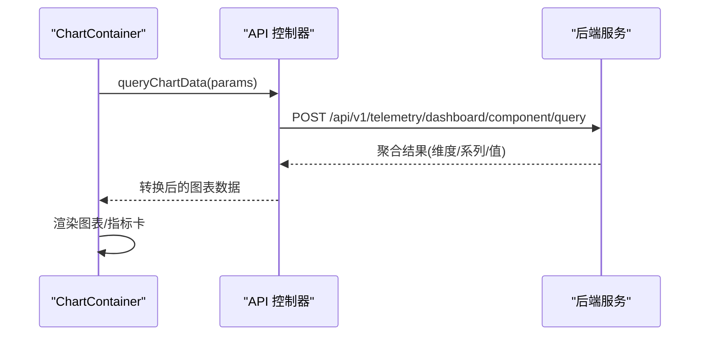
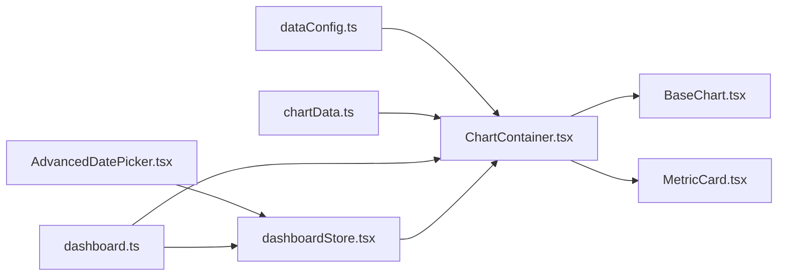

# 仪表盘管理

<cite>
**本文引用的文件**
- [src/frontend/platform/src/controllers/API/dashboard.ts](file://src/frontend/platform/src/controllers/API/dashboard.ts)
- [src/frontend/platform/src/store/dashboardStore.tsx](file://src/frontend/platform/src/store/dashboardStore.tsx)
- [src/frontend/platform/src/pages/Dashboard/types/dataConfig.ts](file://src/frontend/platform/src/pages/Dashboard/types/dataConfig.ts)
- [src/frontend/platform/src/pages/Dashboard/types/chartData.ts](file://src/frontend/platform/src/pages/Dashboard/types/chartData.ts)
- [src/frontend/platform/src/pages/Dashboard/components/charts/ChartContainer.tsx](file://src/frontend/platform/src/pages/Dashboard/components/charts/ChartContainer.tsx)
- [src/frontend/platform/src/pages/Dashboard/components/charts/BaseChart.tsx](file://src/frontend/platform/src/pages/Dashboard/components/charts/BaseChart.tsx)
- [src/frontend/platform/src/pages/Dashboard/components/charts/MetricCard.tsx](file://src/frontend/platform/src/pages/Dashboard/components/charts/MetricCard.tsx)
- [src/frontend/platform/src/pages/Dashboard/components/AdvancedDatePicker.tsx](file://src/frontend/platform/src/pages/Dashboard/components/AdvancedDatePicker.tsx)
- [src/frontend/platform/src/pages/Dashboard/components/editor/Home.tsx](file://src/frontend/platform/src/pages/Dashboard/components/editor/Home.tsx)
- [src/frontend/platform/public/locales/en-US/dashboard.json](file://src/frontend/platform/public/locales/en-US/dashboard.json)
</cite>

## 目录
1. [简介](#简介)
2. [项目结构](#项目结构)
3. [核心组件](#核心组件)
4. [架构总览](#架构总览)
5. [详细组件分析](#详细组件分析)
6. [依赖关系分析](#依赖关系分析)
7. [性能考量](#性能考量)
8. [故障排查指南](#故障排查指南)
9. [结论](#结论)
10. [附录](#附录)

## 简介
本文件面向 Bisheng 平台的仪表盘管理功能，系统性阐述前端仪表盘页面的实现架构与运行机制，覆盖以下方面：
- 数据可视化组件与统计图表展示
- 实时/轮询数据更新机制
- 仪表盘存储与状态管理（数据获取、缓存策略、状态同步）
- 业务指标计算与展示（用户活跃度、工作流执行统计、知识库使用情况等）
- 与后端 API 的数据交互（轮询、WebSocket、批量数据处理）
- 自定义指标添加与图表配置的开发指南

## 项目结构
仪表盘前端位于平台前端工程中，采用模块化组织：
- 控制层：封装与后端 API 的交互，负责数据查询与转换
- 状态层：基于状态管理库维护仪表盘编辑态与预览态的状态、历史快照、刷新触发器
- 视图层：图表容器、基础图表渲染、指标卡、高级日期选择器等组件
- 类型层：统一的数据配置、图表数据结构定义
- 编辑器：组件选择、画布布局、样式配置、查询组件联动

**图表来源**
- [src/frontend/platform/src/controllers/API/dashboard.ts](file://src/frontend/platform/src/controllers/API/dashboard.ts#L1-L290)
- [src/frontend/platform/src/store/dashboardStore.tsx](file://src/frontend/platform/src/store/dashboardStore.tsx#L1-L720)
- [src/frontend/platform/src/pages/Dashboard/components/charts/ChartContainer.tsx](file://src/frontend/platform/src/pages/Dashboard/components/charts/ChartContainer.tsx#L1-L120)
- [src/frontend/platform/src/pages/Dashboard/components/charts/BaseChart.tsx](file://src/frontend/platform/src/pages/Dashboard/components/charts/BaseChart.tsx#L1-L481)
- [src/frontend/platform/src/pages/Dashboard/components/charts/MetricCard.tsx](file://src/frontend/platform/src/pages/Dashboard/components/charts/MetricCard.tsx#L1-L215)
- [src/frontend/platform/src/pages/Dashboard/components/AdvancedDatePicker.tsx](file://src/frontend/platform/src/pages/Dashboard/components/AdvancedDatePicker.tsx#L1-L394)
- [src/frontend/platform/src/pages/Dashboard/types/dataConfig.ts](file://src/frontend/platform/src/pages/Dashboard/types/dataConfig.ts#L1-L281)
- [src/frontend/platform/src/pages/Dashboard/types/chartData.ts](file://src/frontend/platform/src/pages/Dashboard/types/chartData.ts#L1-L64)

**章节来源**
- [src/frontend/platform/src/controllers/API/dashboard.ts](file://src/frontend/platform/src/controllers/API/dashboard.ts#L1-L290)
- [src/frontend/platform/src/store/dashboardStore.tsx](file://src/frontend/platform/src/store/dashboardStore.tsx#L1-L720)
- [src/frontend/platform/src/pages/Dashboard/types/dataConfig.ts](file://src/frontend/platform/src/pages/Dashboard/types/dataConfig.ts#L1-L281)
- [src/frontend/platform/src/pages/Dashboard/types/chartData.ts](file://src/frontend/platform/src/pages/Dashboard/types/chartData.ts#L1-L64)

## 核心组件
- API 控制器：封装仪表盘与组件数据查询、数据集枚举、仪表盘 CRUD、发布与复制等操作；负责将后端返回的聚合结果按不同图表类型进行转换。
- 状态管理：维护当前仪表盘、布局、组件、刷新触发器、查询参数、历史快照（撤销/重做）、编辑态组件影子状态等。
- 图表容器：根据组件类型与刷新触发器，调用查询函数并渲染基础图表或指标卡。
- 基础图表：动态加载 ECharts，按容器尺寸生成配置，支持主题切换、网格、图例、提示框、数据标签等。
- 指标卡：数值格式化、单位换算、趋势箭头与标签展示。
- 高级日期选择器：支持最近天数快捷键、动态更新、月/日/小时粒度选择。

**章节来源**
- [src/frontend/platform/src/controllers/API/dashboard.ts](file://src/frontend/platform/src/controllers/API/dashboard.ts#L100-L290)
- [src/frontend/platform/src/store/dashboardStore.tsx](file://src/frontend/platform/src/store/dashboardStore.tsx#L18-L528)
- [src/frontend/platform/src/pages/Dashboard/components/charts/ChartContainer.tsx](file://src/frontend/platform/src/pages/Dashboard/components/charts/ChartContainer.tsx#L1-L120)
- [src/frontend/platform/src/pages/Dashboard/components/charts/BaseChart.tsx](file://src/frontend/platform/src/pages/Dashboard/components/charts/BaseChart.tsx#L1-L481)
- [src/frontend/platform/src/pages/Dashboard/components/charts/MetricCard.tsx](file://src/frontend/platform/src/pages/Dashboard/components/charts/MetricCard.tsx#L1-L215)
- [src/frontend/platform/src/pages/Dashboard/components/AdvancedDatePicker.tsx](file://src/frontend/platform/src/pages/Dashboard/components/AdvancedDatePicker.tsx#L1-L394)

## 架构总览
仪表盘前端采用“控制层-状态层-视图层”的分层设计，通过状态驱动渲染，API 控制器负责数据拉取与转换，视图层负责具体展示与交互。

**图表来源**
- [src/frontend/platform/src/store/dashboardStore.tsx](file://src/frontend/platform/src/store/dashboardStore.tsx#L310-L358)
- [src/frontend/platform/src/pages/Dashboard/components/charts/ChartContainer.tsx](file://src/frontend/platform/src/pages/Dashboard/components/charts/ChartContainer.tsx#L28-L47)
- [src/frontend/platform/src/controllers/API/dashboard.ts](file://src/frontend/platform/src/controllers/API/dashboard.ts#L192-L271)
- [src/frontend/platform/src/pages/Dashboard/components/charts/BaseChart.tsx](file://src/frontend/platform/src/pages/Dashboard/components/charts/BaseChart.tsx#L63-L112)

## 详细组件分析

### 图表容器与数据刷新
- 刷新机制：每个图表组件维护一个刷新触发器与关联的查询参数集合。当查询组件变更或手动刷新时，状态层更新对应图表的触发器，容器监听到变化后触发查询钩子。
- 数据获取：使用查询钩子在启用条件下发起请求，查询参数由状态层传入；若未配置或无数据或错误，渲染占位图与提示。
- 渲染分支：指标卡与各类柱状/折线/饼图分别渲染。

**图表来源**
- [src/frontend/platform/src/pages/Dashboard/components/charts/ChartContainer.tsx](file://src/frontend/platform/src/pages/Dashboard/components/charts/ChartContainer.tsx#L28-L120)
- [src/frontend/platform/src/controllers/API/dashboard.ts](file://src/frontend/platform/src/controllers/API/dashboard.ts#L192-L271)

**章节来源**
- [src/frontend/platform/src/pages/Dashboard/components/charts/ChartContainer.tsx](file://src/frontend/platform/src/pages/Dashboard/components/charts/ChartContainer.tsx#L1-L120)
- [src/frontend/platform/src/store/dashboardStore.tsx](file://src/frontend/platform/src/store/dashboardStore.tsx#L269-L358)

### 基础图表渲染与 ECharts 集成
- 动态加载：首次渲染时动态注入 ECharts 脚本，轮询直到可用后初始化实例。
- 主题与样式：根据组件样式配置与主题色生成 ECharts 主题，并注册到实例。
- 配置生成：根据图表类型生成坐标轴、系列、图例、提示框、网格等配置；支持堆叠、横向、面积图等变体。
- 响应式：监听容器尺寸变化与窗口 resize，自动调整图表大小。

**图表来源**
- [src/frontend/platform/src/pages/Dashboard/components/charts/BaseChart.tsx](file://src/frontend/platform/src/pages/Dashboard/components/charts/BaseChart.tsx#L10-L159)
- [src/frontend/platform/src/pages/Dashboard/components/charts/BaseChart.tsx](file://src/frontend/platform/src/pages/Dashboard/components/charts/BaseChart.tsx#L165-L481)

**章节来源**
- [src/frontend/platform/src/pages/Dashboard/components/charts/BaseChart.tsx](file://src/frontend/platform/src/pages/Dashboard/components/charts/BaseChart.tsx#L1-L481)

### 指标卡与数值格式化
- 数值格式化：支持数字、百分比、时长、存储四类格式，含单位换算、小数位、千分位与后缀。
- 趋势展示：根据趋势方向显示上升/下降/持平的图标与颜色。
- 样式映射：标题、副标题、指标值的字号、粗斜体、下划线、删除线、对齐与颜色均可配置。

**图表来源**
- [src/frontend/platform/src/pages/Dashboard/components/charts/MetricCard.tsx](file://src/frontend/platform/src/pages/Dashboard/components/charts/MetricCard.tsx#L17-L75)

**章节来源**
- [src/frontend/platform/src/pages/Dashboard/components/charts/MetricCard.tsx](file://src/frontend/platform/src/pages/Dashboard/components/charts/MetricCard.tsx#L1-L215)

### 高级日期选择器与查询联动
- 快捷键与动态更新：支持最近7/30/90/180天快捷键，动态模式下随当前时间滚动更新。
- 粒度控制：月/日/小时三种粒度，小时粒度支持起止小时输入。
- 查询联动：查询组件变更时，状态层收集其关联图表的刷新触发器与查询参数，统一触发图表刷新。

**图表来源**
- [src/frontend/platform/src/pages/Dashboard/components/AdvancedDatePicker.tsx](file://src/frontend/platform/src/pages/Dashboard/components/AdvancedDatePicker.tsx#L106-L152)
- [src/frontend/platform/src/store/dashboardStore.tsx](file://src/frontend/platform/src/store/dashboardStore.tsx#L310-L358)
- [src/frontend/platform/src/pages/Dashboard/components/charts/ChartContainer.tsx](file://src/frontend/platform/src/pages/Dashboard/components/charts/ChartContainer.tsx#L28-L47)

**章节来源**
- [src/frontend/platform/src/pages/Dashboard/components/AdvancedDatePicker.tsx](file://src/frontend/platform/src/pages/Dashboard/components/AdvancedDatePicker.tsx#L1-L394)
- [src/frontend/platform/src/store/dashboardStore.tsx](file://src/frontend/platform/src/store/dashboardStore.tsx#L310-L358)

### API 交互与数据转换
- 仪表盘 CRUD：获取列表、详情、创建、更新、删除、设为默认、复制、发布状态切换、分享链接生成。
- 数据集与字段：列出数据集、获取字段枚举。
- 图表查询：根据组件配置与查询参数构造时间过滤，后端返回聚合结果，前端按图表类型进行维度/系列转换。
- 数据类型：统一的图表数据与指标卡数据接口，支持多系列与饼图数据项。

**图表来源**
- [src/frontend/platform/src/controllers/API/dashboard.ts](file://src/frontend/platform/src/controllers/API/dashboard.ts#L192-L271)
- [src/frontend/platform/src/pages/Dashboard/types/chartData.ts](file://src/frontend/platform/src/pages/Dashboard/types/chartData.ts#L6-L64)

**章节来源**
- [src/frontend/platform/src/controllers/API/dashboard.ts](file://src/frontend/platform/src/controllers/API/dashboard.ts#L1-L290)
- [src/frontend/platform/src/pages/Dashboard/types/chartData.ts](file://src/frontend/platform/src/pages/Dashboard/types/chartData.ts#L1-L64)

### 编辑器与组件选择
- 组件选择：编辑器首页提供多种图表类型的卡片选择，点击后在画布中生成对应组件与默认布局。
- 画布布局：基于网格布局库，组件具有最小/最大宽高约束，支持拖拽与调整大小。
- 样式与配置：组件样式面板与数据配置抽屉，支持标题、轴、图例、颜色、数据标签等配置。

**章节来源**
- [src/frontend/platform/src/pages/Dashboard/components/editor/Home.tsx](file://src/frontend/platform/src/pages/Dashboard/components/editor/Home.tsx#L28-L46)
- [src/frontend/platform/src/store/dashboardStore.tsx](file://src/frontend/platform/src/store/dashboardStore.tsx#L129-L170)

## 依赖关系分析
- 控制层依赖状态层提供的查询参数与刷新触发器，同时依赖类型层的数据结构定义。
- 视图层之间存在清晰的单向依赖：容器依赖控制器与状态层；基础图表依赖容器与类型层；指标卡依赖容器与类型层。
- 高级日期选择器与状态层双向协作，前者提供参数，后者维护参数与触发刷新。

**图表来源**
- [src/frontend/platform/src/pages/Dashboard/types/dataConfig.ts](file://src/frontend/platform/src/pages/Dashboard/types/dataConfig.ts#L1-L281)
- [src/frontend/platform/src/pages/Dashboard/types/chartData.ts](file://src/frontend/platform/src/pages/Dashboard/types/chartData.ts#L1-L64)
- [src/frontend/platform/src/pages/Dashboard/components/charts/ChartContainer.tsx](file://src/frontend/platform/src/pages/Dashboard/components/charts/ChartContainer.tsx#L1-L120)
- [src/frontend/platform/src/pages/Dashboard/components/charts/BaseChart.tsx](file://src/frontend/platform/src/pages/Dashboard/components/charts/BaseChart.tsx#L1-L481)
- [src/frontend/platform/src/pages/Dashboard/components/charts/MetricCard.tsx](file://src/frontend/platform/src/pages/Dashboard/components/charts/MetricCard.tsx#L1-L215)
- [src/frontend/platform/src/pages/Dashboard/components/AdvancedDatePicker.tsx](file://src/frontend/platform/src/pages/Dashboard/components/AdvancedDatePicker.tsx#L1-L394)
- [src/frontend/platform/src/store/dashboardStore.tsx](file://src/frontend/platform/src/store/dashboardStore.tsx#L1-L720)
- [src/frontend/platform/src/controllers/API/dashboard.ts](file://src/frontend/platform/src/controllers/API/dashboard.ts#L1-L290)

**章节来源**
- [src/frontend/platform/src/store/dashboardStore.tsx](file://src/frontend/platform/src/store/dashboardStore.tsx#L1-L720)
- [src/frontend/platform/src/pages/Dashboard/types/dataConfig.ts](file://src/frontend/platform/src/pages/Dashboard/types/dataConfig.ts#L1-L281)
- [src/frontend/platform/src/pages/Dashboard/types/chartData.ts](file://src/frontend/platform/src/pages/Dashboard/types/chartData.ts#L1-L64)

## 性能考量
- 图表渲染性能
  - 使用动态脚本加载 ECharts，避免打包体积膨胀；初始化后复用实例，减少重复初始化开销。
  - ResizeObserver 与窗口 resize 监听，避免频繁重绘；仅在容器尺寸变化时触发 resize。
- 数据查询与缓存
  - 使用查询钩子按需启用，避免不必要的请求；通过刷新触发器精确控制刷新范围，减少全量刷新。
  - 建议在 API 层引入缓存策略（如按查询参数哈希缓存），降低重复请求成本。
- 内存与状态
  - 历史快照最多保留固定步数，防止内存泄漏；深拷贝快照避免引用共享导致的副作用。
- 渲染优化
  - 指标卡与基础图表按需渲染，未配置或无数据时显示占位图，避免无效渲染。

[本节为通用性能建议，无需特定文件引用]

## 故障排查指南
- 图表不显示或空白
  - 检查组件是否已配置数据配置与查询参数；确认刷新触发器是否被正确更新。
  - 查看容器错误分支与无数据占位图渲染逻辑。
- ECharts 加载失败
  - 检查动态脚本注入与轮询逻辑；确认资源路径与网络访问正常。
- 刷新无效
  - 确认查询组件是否正确关联目标图表；检查状态层的查询参数合并逻辑。
- 数值格式异常
  - 检查指标卡格式配置与单位换算逻辑；确保小数位与千分位设置合理。

**章节来源**
- [src/frontend/platform/src/pages/Dashboard/components/charts/ChartContainer.tsx](file://src/frontend/platform/src/pages/Dashboard/components/charts/ChartContainer.tsx#L82-L96)
- [src/frontend/platform/src/pages/Dashboard/components/charts/BaseChart.tsx](file://src/frontend/platform/src/pages/Dashboard/components/charts/BaseChart.tsx#L50-L61)
- [src/frontend/platform/src/store/dashboardStore.tsx](file://src/frontend/platform/src/store/dashboardStore.tsx#L310-L358)
- [src/frontend/platform/src/pages/Dashboard/components/charts/MetricCard.tsx](file://src/frontend/platform/src/pages/Dashboard/components/charts/MetricCard.tsx#L17-L75)

## 结论
Bisheng 仪表盘管理功能通过清晰的分层架构实现了从数据查询、状态管理到可视化渲染的完整链路。查询组件与图表组件的解耦设计使得联动刷新灵活可控，ECharts 的动态集成提供了丰富的图表能力。建议在后续迭代中进一步完善 API 缓存策略与 WebSocket 实时更新能力，以满足更复杂的业务场景需求。

## 附录

### 业务指标与展示方式
- 用户活跃度：可通过时间序列折线图或柱状图展示日/周/月活跃用户数，结合堆叠维度区分来源或角色。
- 工作流执行统计：使用柱状图或堆叠柱状图展示执行次数、成功/失败率，结合时间粒度与筛选器。
- 知识库使用情况：使用饼图或环形图展示文档分类占比，或使用指标卡展示总文档数、总大小等关键指标。

[本节为概念性说明，无需特定文件引用]

### 开发指南：自定义指标与图表配置
- 新增指标
  - 在数据配置中添加指标字段，选择聚合方式与格式化配置（数字/百分比/时长/存储）。
  - 若为虚拟指标，标记为虚拟并配置表达式或计算规则。
- 新增图表
  - 在编辑器首页选择图表类型，系统生成默认布局与样式配置。
  - 进入组件配置抽屉，设置维度、堆叠维度、筛选器、时间范围与结果限制。
- 查询联动
  - 创建查询组件，设置默认值与时间粒度；在查询组件中关联需要联动的图表组件ID。
  - 修改查询参数时，状态层自动合并其他查询组件的参数并触发图表刷新。

**章节来源**
- [src/frontend/platform/src/pages/Dashboard/types/dataConfig.ts](file://src/frontend/platform/src/pages/Dashboard/types/dataConfig.ts#L172-L281)
- [src/frontend/platform/src/store/dashboardStore.tsx](file://src/frontend/platform/src/store/dashboardStore.tsx#L310-L358)
- [src/frontend/platform/src/pages/Dashboard/components/editor/Home.tsx](file://src/frontend/platform/src/pages/Dashboard/components/editor/Home.tsx#L28-L46)

### 术语与本地化
- 图表类型与时间粒度等文案由国际化资源提供，便于多语言支持与扩展。

**章节来源**
- [src/frontend/platform/public/locales/en-US/dashboard.json](file://src/frontend/platform/public/locales/en-US/dashboard.json#L393-L425)