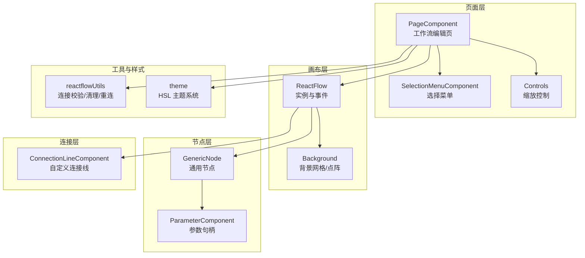
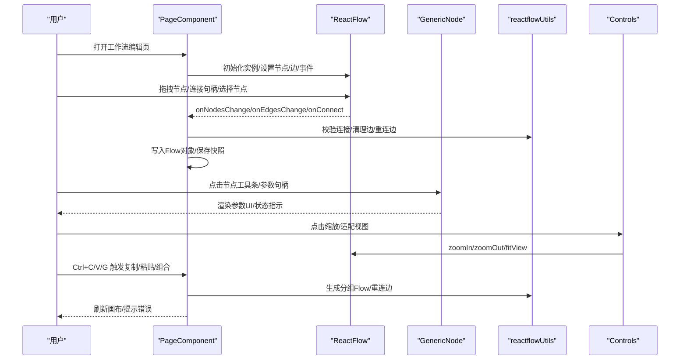
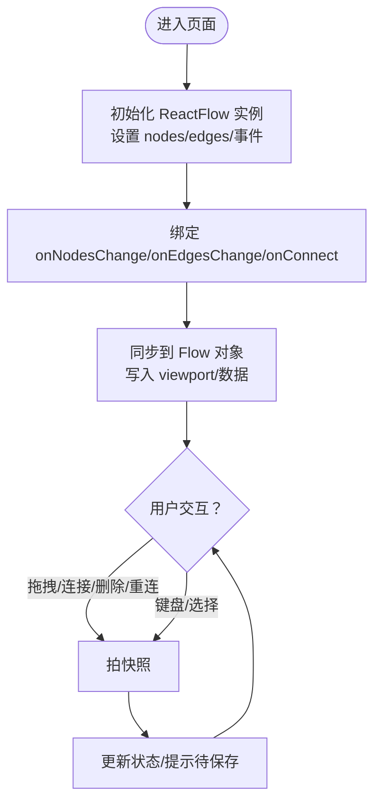
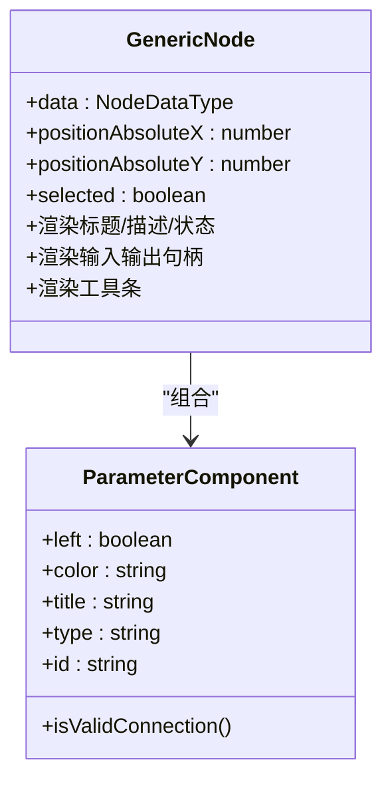
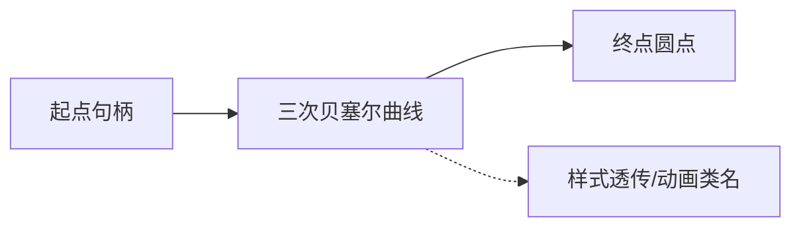
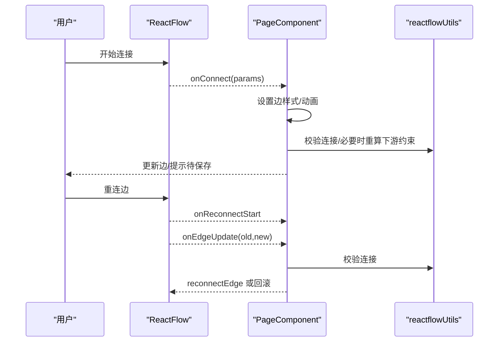
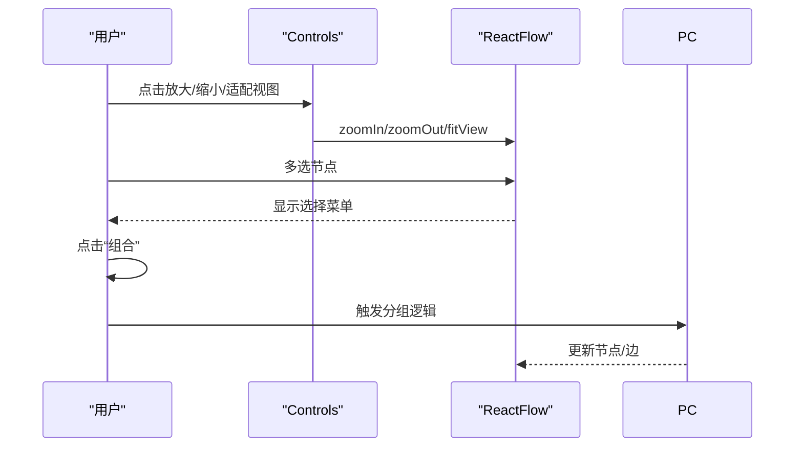
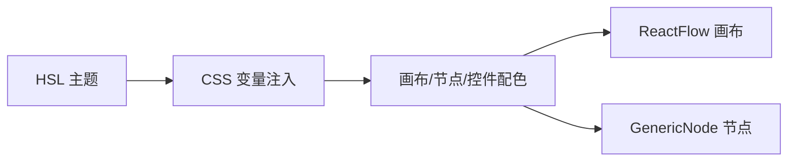
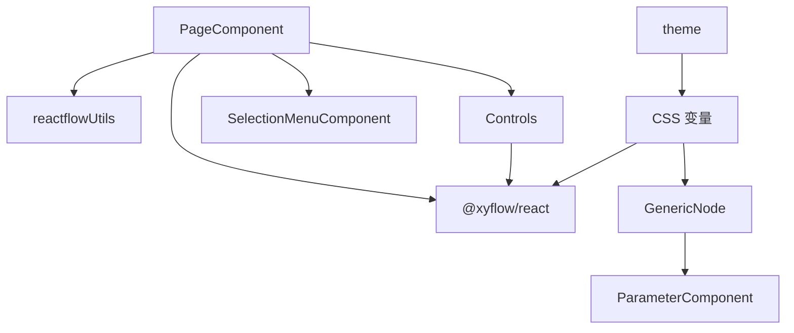

# React Flow 集成

<cite>
**本文引用的文件**
- [PageComponent/index.tsx](file://src/frontend/platform/src/pages/BuildPage/skills/editSkill/PageComponent/index.tsx)
- [ConnectionLineComponent/index.tsx](file://src/frontend/platform/src/pages/BuildPage/skills/editSkill/ConnectionLineComponent/index.tsx)
- [GenericNode/index.tsx](file://src/frontend/platform/src/CustomNodes/GenericNode/index.tsx)
- [reactflowUtils.ts](file://src/frontend/platform/src/util/reactflowUtils.ts)
- [Controls.tsx](file://src/frontend/platform/src/pages/BuildPage/flow/Controls.tsx)
- [SelectionMenuComponent/index.tsx](file://src/frontend/platform/src/pages/BuildPage/skills/editSkill/SelectionMenuComponent/index.tsx)
- [theme/index.tsx](file://src/frontend/platform/src/pages/SystemPage/theme/index.tsx)
</cite>

## 目录
1. [简介](#简介)
2. [项目结构](#项目结构)
3. [核心组件](#核心组件)
4. [架构总览](#架构总览)
5. [详细组件分析](#详细组件分析)
6. [依赖关系分析](#依赖关系分析)
7. [性能考虑](#性能考虑)
8. [故障排查指南](#故障排查指南)
9. [结论](#结论)
10. [附录](#附录)

## 简介
本文件面向 React Flow 在工作流编辑器中的集成与应用，系统性阐述从画布初始化、节点渲染、连接线绘制到交互事件处理的完整实现；同时覆盖自定义样式配置（节点主题、连接线样式、缩放与平移）、画布操作（鼠标与键盘）、以及性能优化策略（虚拟化渲染、批量更新、内存管理）。文档以实际源码为依据，辅以可视化图示，帮助开发者快速理解与扩展。

## 项目结构
React Flow 集成主要集中在平台前端页面目录中，围绕“工作流构建页”展开，关键文件如下：
- 页面容器：负责 ReactFlow 实例初始化、状态同步、事件绑定与工具栏集成
- 自定义节点：通用节点组件，承载参数输入输出、工具条与状态指示
- 连接线组件：自定义曲线连接线与末端圆点
- 工具函数：连接有效性校验、边清理、ID 映射与重连等
- 缩放控制：自定义工具面板，提供放大/缩小/适配视图
- 选择菜单：多选节点后的组合按钮工具条
- 主题系统：HSL 主题变量持久化与动态切换

图表来源
- [PageComponent/index.tsx](file://src/frontend/platform/src/pages/BuildPage/skills/editSkill/PageComponent/index.tsx#L339-L430)
- [GenericNode/index.tsx](file://src/frontend/platform/src/CustomNodes/GenericNode/index.tsx#L23-L262)
- [ConnectionLineComponent/index.tsx](file://src/frontend/platform/src/pages/BuildPage/skills/editSkill/ConnectionLineComponent/index.tsx#L1-L33)
- [reactflowUtils.ts](file://src/frontend/platform/src/util/reactflowUtils.ts#L102-L133)
- [Controls.tsx](file://src/frontend/platform/src/pages/BuildPage/flow/Controls.tsx#L14-L77)
- [SelectionMenuComponent/index.tsx](file://src/frontend/platform/src/pages/BuildPage/skills/editSkill/SelectionMenuComponent/index.tsx#L1-L60)
- [theme/index.tsx](file://src/frontend/platform/src/pages/SystemPage/theme/index.tsx#L61-L89)

章节来源
- [PageComponent/index.tsx](file://src/frontend/platform/src/pages/BuildPage/skills/editSkill/PageComponent/index.tsx#L1-L518)
- [GenericNode/index.tsx](file://src/frontend/platform/src/CustomNodes/GenericNode/index.tsx#L1-L263)
- [ConnectionLineComponent/index.tsx](file://src/frontend/platform/src/pages/BuildPage/skills/editSkill/ConnectionLineComponent/index.tsx#L1-L34)
- [reactflowUtils.ts](file://src/frontend/platform/src/util/reactflowUtils.ts#L1-L200)
- [Controls.tsx](file://src/frontend/platform/src/pages/BuildPage/flow/Controls.tsx#L1-L77)
- [SelectionMenuComponent/index.tsx](file://src/frontend/platform/src/pages/BuildPage/skills/editSkill/SelectionMenuComponent/index.tsx#L1-L60)
- [theme/index.tsx](file://src/frontend/platform/src/pages/SystemPage/theme/index.tsx#L1-L135)

## 核心组件
- 画布容器与事件桥接：页面组件负责初始化 ReactFlow 实例、绑定节点/边变更、连接、拖拽、删除、重连、键盘与选择事件，并将画布状态写回业务 Flow 对象
- 自定义节点：通用节点组件渲染标题、描述、输入输出参数句柄、节点工具条与构建状态指示
- 连接线组件：自定义曲线路径与末端圆点，支持动画类名与样式透传
- 工具函数：连接合法性校验、边清理、ID 映射与重连、选择验证与分组生成
- 缩放控制：自定义工具面板，提供放大/缩小/适配视图与新建注记入口
- 选择菜单：多选节点时显示“组合”按钮，触发分组逻辑
- 主题系统：HSL 主题变量持久化与动态切换，影响画布与组件配色

章节来源
- [PageComponent/index.tsx](file://src/frontend/platform/src/pages/BuildPage/skills/editSkill/PageComponent/index.tsx#L84-L449)
- [GenericNode/index.tsx](file://src/frontend/platform/src/CustomNodes/GenericNode/index.tsx#L23-L262)
- [ConnectionLineComponent/index.tsx](file://src/frontend/platform/src/pages/BuildPage/skills/editSkill/ConnectionLineComponent/index.tsx#L1-L33)
- [reactflowUtils.ts](file://src/frontend/platform/src/util/reactflowUtils.ts#L52-L133)
- [Controls.tsx](file://src/frontend/platform/src/pages/BuildPage/flow/Controls.tsx#L14-L77)
- [SelectionMenuComponent/index.tsx](file://src/frontend/platform/src/pages/BuildPage/skills/editSkill/SelectionMenuComponent/index.tsx#L1-L60)
- [theme/index.tsx](file://src/frontend/platform/src/pages/SystemPage/theme/index.tsx#L61-L89)

## 架构总览
下图展示从用户交互到数据更新的端到端流程，涵盖节点拖拽、连接建立、边重连、键盘复制粘贴、选择组合与缩放控制。

图表来源
- [PageComponent/index.tsx](file://src/frontend/platform/src/pages/BuildPage/skills/editSkill/PageComponent/index.tsx#L132-L449)
- [reactflowUtils.ts](file://src/frontend/platform/src/util/reactflowUtils.ts#L102-L133)
- [Controls.tsx](file://src/frontend/platform/src/pages/BuildPage/flow/Controls.tsx#L14-L77)

## 详细组件分析

### 画布初始化与事件桥接
- 初始化：通过回调注入 ReactFlow 实例，设置节点/边初始值，启用 fitView 与缩放范围
- 事件绑定：节点/边变更、连接、拖拽、删除、重连、选择开始/结束、键盘选择变化
- 状态同步：将 ReactFlow 对象转存为业务 Flow 数据，写入当前版本
- 快照机制：所有可撤销操作均先拍快照，保证撤销/重做一致性

图表来源
- [PageComponent/index.tsx](file://src/frontend/platform/src/pages/BuildPage/skills/editSkill/PageComponent/index.tsx#L84-L110)
- [PageComponent/index.tsx](file://src/frontend/platform/src/pages/BuildPage/skills/editSkill/PageComponent/index.tsx#L132-L201)

章节来源
- [PageComponent/index.tsx](file://src/frontend/platform/src/pages/BuildPage/skills/editSkill/PageComponent/index.tsx#L84-L110)
- [PageComponent/index.tsx](file://src/frontend/platform/src/pages/BuildPage/skills/editSkill/PageComponent/index.tsx#L132-L201)

### 节点渲染与参数句柄
- 节点外观：标题、描述、状态指示（构建中/通过/失败），支持分组节点的嵌套边框
- 参数句柄：左侧输入、右侧输出，支持动态颜色与类型提示
- 工具条：节点工具条组件，提供删除等操作入口
- 渲染容错：当图标缺失或模板不合法时，弹出错误并删除节点

图表来源
- [GenericNode/index.tsx](file://src/frontend/platform/src/CustomNodes/GenericNode/index.tsx#L23-L262)
- [GenericNode/index.tsx](file://src/frontend/platform/src/CustomNodes/GenericNode/components/parameterComponent/index.tsx#L308-L332)

章节来源
- [GenericNode/index.tsx](file://src/frontend/platform/src/CustomNodes/GenericNode/index.tsx#L23-L262)
- [GenericNode/index.tsx](file://src/frontend/platform/src/CustomNodes/GenericNode/components/parameterComponent/index.tsx#L308-L332)

### 连接线绘制与样式
- 自定义连接线：三次贝塞尔曲线路径，末端带小圆点，支持动画类名与样式透传
- 连接样式：统一 stroke 类名与宽度，按目标句柄类型附加不同类名
- 边更新：支持边重连起止、失败回滚删除临时边

图表来源
- [ConnectionLineComponent/index.tsx](file://src/frontend/platform/src/pages/BuildPage/skills/editSkill/ConnectionLineComponent/index.tsx#L1-L33)
- [PageComponent/index.tsx](file://src/frontend/platform/src/pages/BuildPage/skills/editSkill/PageComponent/index.tsx#L148-L185)

章节来源
- [ConnectionLineComponent/index.tsx](file://src/frontend/platform/src/pages/BuildPage/skills/editSkill/ConnectionLineComponent/index.tsx#L1-L33)
- [PageComponent/index.tsx](file://src/frontend/platform/src/pages/BuildPage/skills/editSkill/PageComponent/index.tsx#L148-L185)

### 交互事件处理
- 连接建立：onConnect 中统一设置边样式与动画，必要时根据上游节点类型调整下游约束
- 边重连：onReconnectStart/End 控制临时边生命周期，onEdgeUpdate 校验合法性后执行重连
- 删除：onDelete 过滤与被删节点关联的边
- 拖拽/选择：拖拽开始与选择开始均拍快照，确保可撤销
- 键盘：全局监听 Ctrl+C/V/G，分别执行复制、粘贴与组合

图表来源
- [PageComponent/index.tsx](file://src/frontend/platform/src/pages/BuildPage/skills/editSkill/PageComponent/index.tsx#L148-L300)
- [reactflowUtils.ts](file://src/frontend/platform/src/util/reactflowUtils.ts#L102-L133)

章节来源
- [PageComponent/index.tsx](file://src/frontend/platform/src/pages/BuildPage/skills/editSkill/PageComponent/index.tsx#L148-L300)
- [reactflowUtils.ts](file://src/frontend/platform/src/util/reactflowUtils.ts#L102-L133)

### 画布操作与导航
- 缩放控制：自定义面板提供放大/缩小/适配视图，支持新建注记入口
- 背景网格：点阵背景，深浅主题适配
- 选择菜单：多选节点后显示“组合”按钮，点击后调用工具函数生成分组 Flow 并重连边

图表来源
- [Controls.tsx](file://src/frontend/platform/src/pages/BuildPage/flow/Controls.tsx#L14-L77)
- [PageComponent/index.tsx](file://src/frontend/platform/src/pages/BuildPage/skills/editSkill/PageComponent/index.tsx#L376-L429)
- [SelectionMenuComponent/index.tsx](file://src/frontend/platform/src/pages/BuildPage/skills/editSkill/SelectionMenuComponent/index.tsx#L1-L60)

章节来源
- [Controls.tsx](file://src/frontend/platform/src/pages/BuildPage/flow/Controls.tsx#L14-L77)
- [PageComponent/index.tsx](file://src/frontend/platform/src/pages/BuildPage/skills/editSkill/PageComponent/index.tsx#L376-L429)
- [SelectionMenuComponent/index.tsx](file://src/frontend/platform/src/pages/BuildPage/skills/editSkill/SelectionMenuComponent/index.tsx#L1-L60)

### 自定义样式配置
- 节点主题：基于类型映射的颜色，支持分组节点的嵌套边框
- 连接线样式：统一 stroke 类名与宽度，按句柄类型附加类名
- 主题系统：HSL 主题变量持久化，动态写入 CSS 变量，支持恢复默认与背景模式切换

图表来源
- [theme/index.tsx](file://src/frontend/platform/src/pages/SystemPage/theme/index.tsx#L61-L89)
- [GenericNode/index.tsx](file://src/frontend/platform/src/CustomNodes/GenericNode/index.tsx#L90-L94)
- [ConnectionLineComponent/index.tsx](file://src/frontend/platform/src/pages/BuildPage/skills/editSkill/ConnectionLineComponent/index.tsx#L16-L18)

章节来源
- [theme/index.tsx](file://src/frontend/platform/src/pages/SystemPage/theme/index.tsx#L61-L89)
- [GenericNode/index.tsx](file://src/frontend/platform/src/CustomNodes/GenericNode/index.tsx#L90-L94)
- [ConnectionLineComponent/index.tsx](file://src/frontend/platform/src/pages/BuildPage/skills/editSkill/ConnectionLineComponent/index.tsx#L16-L18)

## 依赖关系分析
- 页面组件依赖 ReactFlow 提供的 hooks 与组件，同时依赖工具函数进行连接校验与边处理
- 通用节点依赖参数组件与工具条组件，渲染参数句柄与状态指示
- 缩放控制依赖 ReactFlow 的 useReactFlow 与 useViewport
- 主题系统通过写入 CSS 变量影响全局 UI

图表来源
- [PageComponent/index.tsx](file://src/frontend/platform/src/pages/BuildPage/skills/editSkill/PageComponent/index.tsx#L1-L50)
- [GenericNode/index.tsx](file://src/frontend/platform/src/CustomNodes/GenericNode/index.tsx#L1-L25)
- [Controls.tsx](file://src/frontend/platform/src/pages/BuildPage/flow/Controls.tsx#L14-L27)
- [theme/index.tsx](file://src/frontend/platform/src/pages/SystemPage/theme/index.tsx#L61-L89)

章节来源
- [PageComponent/index.tsx](file://src/frontend/platform/src/pages/BuildPage/skills/editSkill/PageComponent/index.tsx#L1-L50)
- [GenericNode/index.tsx](file://src/frontend/platform/src/CustomNodes/GenericNode/index.tsx#L1-L25)
- [Controls.tsx](file://src/frontend/platform/src/pages/BuildPage/flow/Controls.tsx#L14-L27)
- [theme/index.tsx](file://src/frontend/platform/src/pages/SystemPage/theme/index.tsx#L61-L89)

## 性能考虑
- 虚拟化渲染：对于大量节点/边的场景，建议采用 React Flow 的滚动区域与可见区域渲染策略，减少不必要的重绘
- 批量更新：对节点/边的批量变更应合并 setState 调用，避免频繁触发重渲染
- 内存管理：在组件卸载时及时清理 ReactFlow 实例引用，避免内存泄漏
- 连接校验与边清理：在连接建立/删除/重连时，优先进行合法性检查与边清理，降低后续渲染压力
- 动画与样式：连接线动画与样式类名应尽量轻量，避免在高频交互中造成卡顿

[本节为通用性能指导，不直接分析具体文件]

## 故障排查指南
- 连接不生效：检查连接合法性校验函数是否返回允许，确认句柄类型匹配与列表型字段限制
- 边丢失或异常：使用边清理函数检查源/目标节点与句柄是否存在，必要时重建边
- 节点渲染异常：检查节点图标映射与模板字段，缺失时会自动删除节点并提示错误
- 缩放/适配无效：确认最小/最大缩放范围与 fitView 配置，检查工具面板按钮绑定
- 主题不生效：确认 CSS 变量写入顺序与命名空间，确保主题持久化接口正常

章节来源
- [reactflowUtils.ts](file://src/frontend/platform/src/util/reactflowUtils.ts#L52-L91)
- [reactflowUtils.ts](file://src/frontend/platform/src/util/reactflowUtils.ts#L102-L133)
- [GenericNode/index.tsx](file://src/frontend/platform/src/CustomNodes/GenericNode/index.tsx#L61-L72)
- [Controls.tsx](file://src/frontend/platform/src/pages/BuildPage/flow/Controls.tsx#L14-L27)
- [theme/index.tsx](file://src/frontend/platform/src/pages/SystemPage/theme/index.tsx#L61-L89)

## 结论
该集成以页面组件为核心，串联 ReactFlow 画布、自定义节点与连接线、工具函数与主题系统，形成完整的可视化工作流编辑体验。通过严格的连接校验、边清理与快照机制，保障了交互的可靠性与可撤销性；通过 HSL 主题系统与自定义连接线，提升了视觉一致性与可读性。建议在大规模工作流场景中进一步引入虚拟化与批处理策略，持续优化性能表现。

## 附录
- 关键配置项
  - 画布缩放范围：最小/最大缩放
  - 画布适配：fitView
  - 连接线组件：自定义曲线与圆点
  - 主题变量：HSL 颜色空间与 CSS 变量注入
- 常用工具函数
  - 连接合法性校验
  - 边清理与 ID 映射
  - 选择验证与分组生成
  - 边重连与失败回滚

[本节为概览性附录，不直接分析具体文件]