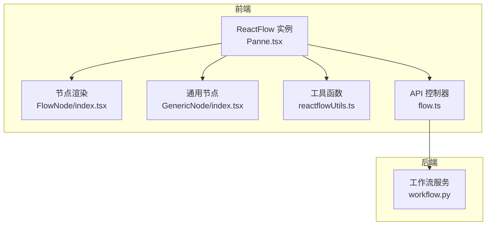
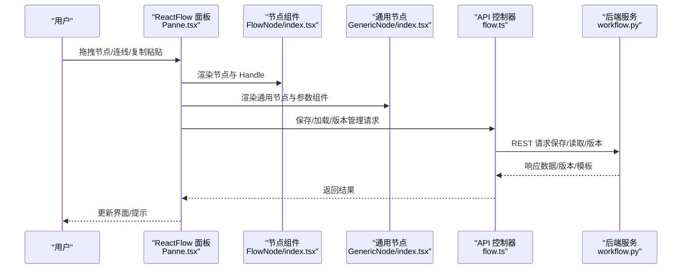
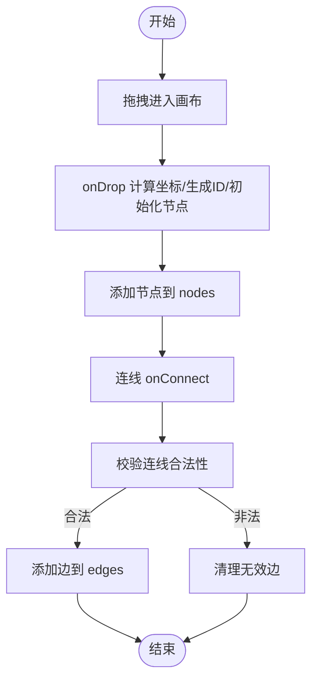
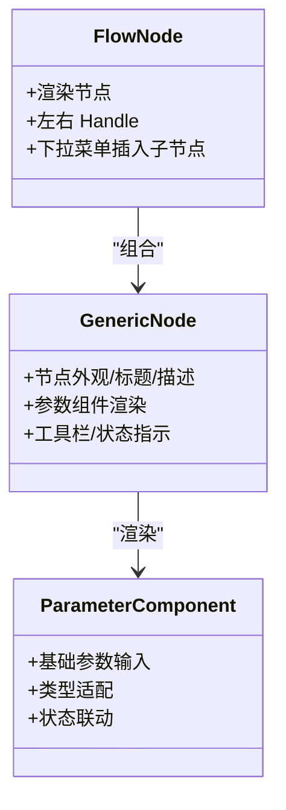
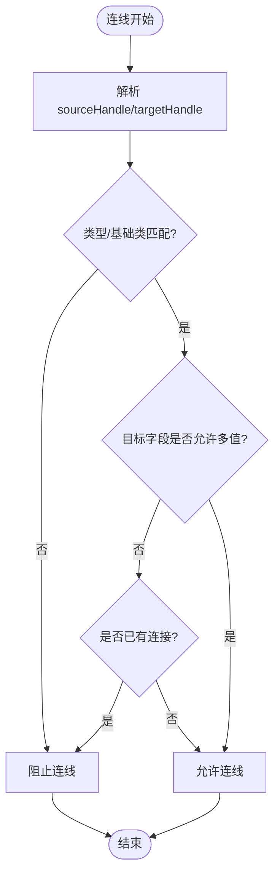
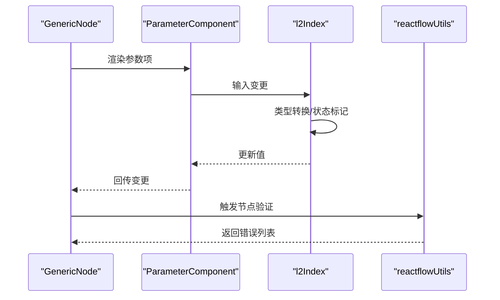
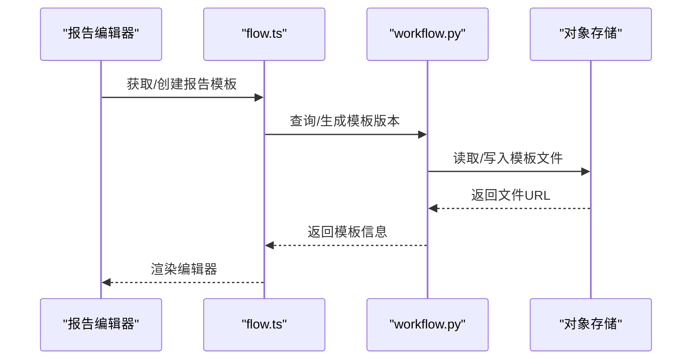
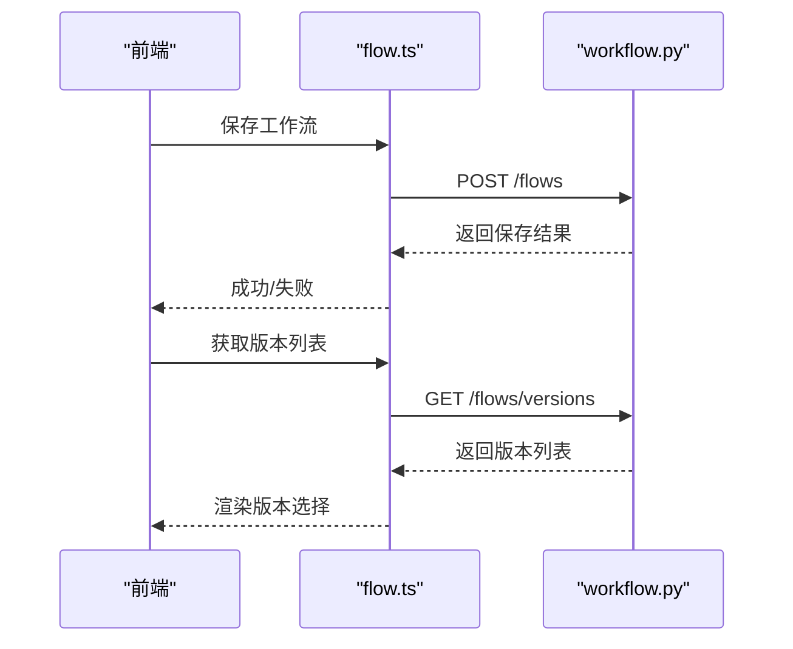
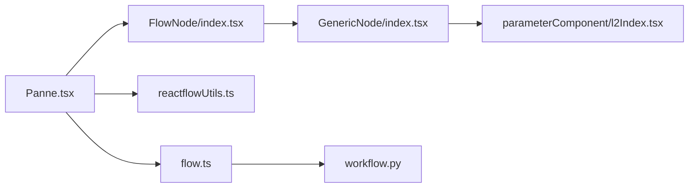

# 工作流编辑器

<cite>
**本文引用的文件**
- [src/frontend/platform/src/pages/BuildPage/flow/Panne.tsx](file://src/frontend/platform/src/pages/BuildPage/flow/Panne.tsx)
- [src/frontend/platform/src/pages/BuildPage/flow/FlowNode/index.tsx](file://src/frontend/platform/src/pages/BuildPage/flow/FlowNode/index.tsx)
- [src/frontend/platform/src/CustomNodes/GenericNode/index.tsx](file://src/frontend/platform/src/CustomNodes/GenericNode/index.tsx)
- [src/frontend/platform/src/util/reactflowUtils.ts](file://src/frontend/platform/src/util/reactflowUtils.ts)
- [src/frontend/platform/src/controllers/API/flow.ts](file://src/frontend/platform/src/controllers/API/flow.ts)
- [src/backend/bisheng/api/v1/workflow.py](file://src/backend/bisheng/api/v1/workflow.py)
- [src/frontend/platform/src/pages/BuildPage/flow/FlowNode/component/CodeOutputItem.tsx](file://src/frontend/platform/src/pages/BuildPage/flow/FlowNode/component/CodeOutputItem.tsx)
- [src/frontend/platform/src/CustomNodes/GenericNode/components/parameterComponent/l2Index.tsx](file://src/frontend/platform/src/CustomNodes/GenericNode/components/parameterComponent/l2Index.tsx)
- [src/frontend/platform/src/pages/BuildPage/flow/FlowNode/component/ReportWordEdit.tsx](file://src/frontend/platform/src/pages/BuildPage/flow/FlowNode/component/ReportWordEdit.tsx)
- [src/backend/bisheng/core/cache/utils.py](file://src/backend/bisheng/core/cache/utils.py)
</cite>

## 目录
1. [简介](#简介)
2. [项目结构](#项目结构)
3. [核心组件](#核心组件)
4. [架构总览](#架构总览)
5. [详细组件分析](#详细组件分析)
6. [依赖关系分析](#依赖关系分析)
7. [性能考量](#性能考量)
8. [故障排查指南](#故障排查指南)
9. [结论](#结论)
10. [附录](#附录)

## 简介
本技术文档围绕 Bisheng 工作流编辑器展开，系统性阐述基于 React Flow 的可视化编辑器实现，涵盖节点系统设计、拖拽与连接、画布操作、自定义节点开发、参数组件与校验、以及工作流保存/加载与版本管理的前后端协作机制。文档面向不同层次读者，既提供高层架构视图，也包含代码级细节与可视化图表。

## 项目结构
工作流编辑器主要由前端 React Flow 面板与后端 API 两部分组成：
- 前端：React Flow 实例、节点渲染、自定义节点、参数组件、工具函数、API 控制器等
- 后端：工作流 CRUD、版本管理、报告模板存储、WebSocket 推送等

**图表来源**
- [src/frontend/platform/src/pages/BuildPage/flow/Panne.tsx](file://src/frontend/platform/src/pages/BuildPage/flow/Panne.tsx#L134-L191)
- [src/frontend/platform/src/pages/BuildPage/flow/FlowNode/index.tsx](file://src/frontend/platform/src/pages/BuildPage/flow/FlowNode/index.tsx#L107-L364)
- [src/frontend/platform/src/CustomNodes/GenericNode/index.tsx](file://src/frontend/platform/src/CustomNodes/GenericNode/index.tsx#L23-L262)
- [src/frontend/platform/src/util/reactflowUtils.ts](file://src/frontend/platform/src/util/reactflowUtils.ts#L1-L1206)
- [src/frontend/platform/src/controllers/API/flow.ts](file://src/frontend/platform/src/controllers/API/flow.ts#L117-L243)
- [src/backend/bisheng/api/v1/workflow.py](file://src/backend/bisheng/api/v1/workflow.py#L32-L312)

**章节来源**
- [src/frontend/platform/src/pages/BuildPage/flow/Panne.tsx](file://src/frontend/platform/src/pages/BuildPage/flow/Panne.tsx#L1-L554)
- [src/frontend/platform/src/util/reactflowUtils.ts](file://src/frontend/platform/src/util/reactflowUtils.ts#L1-L1206)

## 核心组件
- React Flow 集成与画布控制：通过 Panne.tsx 初始化 ReactFlow 实例、注册节点与边类型、处理拖拽、连线、键盘快捷键、缩放与平移、选择与删除、复制粘贴等。
- 节点系统：FlowNode/index.tsx 提供节点渲染与左右 Handle；GenericNode/index.tsx 提供通用节点外观与参数组件渲染；参数组件位于 GenericNode/components/parameterComponent。
- 工具函数：reactflowUtils.ts 提供连线合法性校验、节点/边 ID 规范化、选择校验、节点模板合并、边处理等。
- API 控制器：flow.ts 封装工作流保存、读取、版本管理、变量与报告模板相关接口。
- 后端服务：workflow.py 提供工作流版本查询、创建、切换、上下线、报告模板回调与存储等。

**章节来源**
- [src/frontend/platform/src/pages/BuildPage/flow/Panne.tsx](file://src/frontend/platform/src/pages/BuildPage/flow/Panne.tsx#L134-L191)
- [src/frontend/platform/src/pages/BuildPage/flow/FlowNode/index.tsx](file://src/frontend/platform/src/pages/BuildPage/flow/FlowNode/index.tsx#L107-L364)
- [src/frontend/platform/src/CustomNodes/GenericNode/index.tsx](file://src/frontend/platform/src/CustomNodes/GenericNode/index.tsx#L23-L262)
- [src/frontend/platform/src/util/reactflowUtils.ts](file://src/frontend/platform/src/util/reactflowUtils.ts#L102-L133)
- [src/frontend/platform/src/controllers/API/flow.ts](file://src/frontend/platform/src/controllers/API/flow.ts#L117-L243)
- [src/backend/bisheng/api/v1/workflow.py](file://src/backend/bisheng/api/v1/workflow.py#L35-L133)

## 架构总览
工作流编辑器采用“前端可视化 + 后端服务”的分层架构。前端负责节点渲染、参数编辑、连线与画布操作；后端负责持久化、版本管理、报告模板与实时构建状态推送。

**图表来源**
- [src/frontend/platform/src/pages/BuildPage/flow/Panne.tsx](file://src/frontend/platform/src/pages/BuildPage/flow/Panne.tsx#L203-L510)
- [src/frontend/platform/src/pages/BuildPage/flow/FlowNode/index.tsx](file://src/frontend/platform/src/pages/BuildPage/flow/FlowNode/index.tsx#L107-L364)
- [src/frontend/platform/src/CustomNodes/GenericNode/index.tsx](file://src/frontend/platform/src/CustomNodes/GenericNode/index.tsx#L23-L262)
- [src/frontend/platform/src/controllers/API/flow.ts](file://src/frontend/platform/src/controllers/API/flow.ts#L117-L243)
- [src/backend/bisheng/api/v1/workflow.py](file://src/backend/bisheng/api/v1/workflow.py#L35-L133)

## 详细组件分析

### React Flow 集成与画布操作
- 节点与边类型注册：在 Panne.tsx 中注册自定义节点与边类型，并设置最小/最大缩放级别、背景网格、控制条等。
- 拖拽与放置：onDragOver/onDrop 支持从侧边栏拖入节点，自动计算屏幕坐标到画布坐标，生成唯一节点 ID 并初始化节点数据。
- 连线与校验：onConnect 使用自定义边类型，调用工具函数过滤无效边，确保连线合法。
- 选择与删除：支持多选、键盘删除、右键菜单等；对起始节点进行保护，防止误删。
- 复制粘贴：支持跨技能复制节点，自动重命名 ID、复制报告模板、保持相对位置。
- 快捷键：封装复制/粘贴/删除逻辑，避免误删起始节点。

**图表来源**
- [src/frontend/platform/src/pages/BuildPage/flow/Panne.tsx](file://src/frontend/platform/src/pages/BuildPage/flow/Panne.tsx#L260-L327)
- [src/frontend/platform/src/util/reactflowUtils.ts](file://src/frontend/platform/src/util/reactflowUtils.ts#L102-L133)

**章节来源**
- [src/frontend/platform/src/pages/BuildPage/flow/Panne.tsx](file://src/frontend/platform/src/pages/BuildPage/flow/Panne.tsx#L134-L191)
- [src/frontend/platform/src/pages/BuildPage/flow/Panne.tsx](file://src/frontend/platform/src/pages/BuildPage/flow/Panne.tsx#L203-L510)

### 节点系统设计
- 节点渲染：FlowNode/index.tsx 使用 Handle 定义左右输入输出点，支持下拉菜单快速插入子节点。
- 通用节点：GenericNode/index.tsx 负责节点外观、标题、描述、参数组件渲染、工具栏、状态指示等。
- 参数组件：GenericNode/components/parameterComponent 提供基础参数输入组件，支持数值、字符串、字典等类型，联动工作流状态标记为“待提交”。

**图表来源**
- [src/frontend/platform/src/pages/BuildPage/flow/FlowNode/index.tsx](file://src/frontend/platform/src/pages/BuildPage/flow/FlowNode/index.tsx#L107-L364)
- [src/frontend/platform/src/CustomNodes/GenericNode/index.tsx](file://src/frontend/platform/src/CustomNodes/GenericNode/index.tsx#L23-L262)
- [src/frontend/platform/src/CustomNodes/GenericNode/components/parameterComponent/l2Index.tsx](file://src/frontend/platform/src/CustomNodes/GenericNode/components/parameterComponent/l2Index.tsx#L19-L44)

**章节来源**
- [src/frontend/platform/src/pages/BuildPage/flow/FlowNode/index.tsx](file://src/frontend/platform/src/pages/BuildPage/flow/FlowNode/index.tsx#L21-L105)
- [src/frontend/platform/src/CustomNodes/GenericNode/index.tsx](file://src/frontend/platform/src/CustomNodes/GenericNode/index.tsx#L194-L250)
- [src/frontend/platform/src/CustomNodes/GenericNode/components/parameterComponent/l2Index.tsx](file://src/frontend/platform/src/CustomNodes/GenericNode/components/parameterComponent/l2Index.tsx#L19-L44)

### 连线与校验规则
- 连线合法性：isValidConnection 根据目标节点字段类型、基础类、是否列表等判断是否允许连接。
- 边处理：updateEdgesHandleIds 将边 Handle 序列化为可解析对象，便于后续校验与渲染。
- 选择校验：validateSelection 校验选区是否满足“至少两个节点、最多一个自由输出节点、所有节点均连通”等约束。

**图表来源**
- [src/frontend/platform/src/util/reactflowUtils.ts](file://src/frontend/platform/src/util/reactflowUtils.ts#L102-L133)
- [src/frontend/platform/src/util/reactflowUtils.ts](file://src/frontend/platform/src/util/reactflowUtils.ts#L330-L371)

**章节来源**
- [src/frontend/platform/src/util/reactflowUtils.ts](file://src/frontend/platform/src/util/reactflowUtils.ts#L102-L133)
- [src/frontend/platform/src/util/reactflowUtils.ts](file://src/frontend/platform/src/util/reactflowUtils.ts#L698-L742)

### 参数组件与节点验证
- 参数组件：l2Index.tsx 提供参数输入组件，支持数值类型转换、状态标记为“待提交”，并在值变更时触发工作流状态更新。
- 通用节点参数渲染：GenericNode/index.tsx 遍历节点模板，按显示与高级标记筛选参数，渲染 ParameterComponent。
- 节点验证：reactflowUtils.ts 的 validateNode/validateNodes 对必填字段、字典重复键/空键等进行校验，返回错误列表。

**图表来源**
- [src/frontend/platform/src/CustomNodes/GenericNode/index.tsx](file://src/frontend/platform/src/CustomNodes/GenericNode/index.tsx#L194-L226)
- [src/frontend/platform/src/CustomNodes/GenericNode/components/parameterComponent/l2Index.tsx](file://src/frontend/platform/src/CustomNodes/GenericNode/components/parameterComponent/l2Index.tsx#L19-L44)
- [src/frontend/platform/src/util/reactflowUtils.ts](file://src/frontend/platform/src/util/reactflowUtils.ts#L242-L292)

**章节来源**
- [src/frontend/platform/src/CustomNodes/GenericNode/index.tsx](file://src/frontend/platform/src/CustomNodes/GenericNode/index.tsx#L194-L226)
- [src/frontend/platform/src/CustomNodes/GenericNode/components/parameterComponent/l2Index.tsx](file://src/frontend/platform/src/CustomNodes/GenericNode/components/parameterComponent/l2Index.tsx#L19-L44)
- [src/frontend/platform/src/util/reactflowUtils.ts](file://src/frontend/platform/src/util/reactflowUtils.ts#L242-L292)

### 报告模板与变量
- 报告模板：ReportWordEdit.tsx 负责报告模板的创建、导入与变量插入，通过 Office 服务回调写入后端存储。
- 变量管理：flow.ts 提供变量的增删改查与批量保存接口，配合后端版本管理实现工作流变量与模板的协同。

**图表来源**
- [src/frontend/platform/src/pages/BuildPage/flow/FlowNode/component/ReportWordEdit.tsx](file://src/frontend/platform/src/pages/BuildPage/flow/FlowNode/component/ReportWordEdit.tsx#L13-L131)
- [src/backend/bisheng/api/v1/workflow.py](file://src/backend/bisheng/api/v1/workflow.py#L59-L133)

**章节来源**
- [src/frontend/platform/src/pages/BuildPage/flow/FlowNode/component/ReportWordEdit.tsx](file://src/frontend/platform/src/pages/BuildPage/flow/FlowNode/component/ReportWordEdit.tsx#L13-L131)
- [src/frontend/platform/src/controllers/API/flow.ts](file://src/frontend/platform/src/controllers/API/flow.ts#L71-L92)
- [src/backend/bisheng/api/v1/workflow.py](file://src/backend/bisheng/api/v1/workflow.py#L59-L133)

### 保存、加载与版本管理
- 保存/加载：flow.ts 提供保存与读取工作流接口，数据以 ReactFlow JSON 结构传输。
- 版本管理：flow.ts 提供版本列表、创建、切换、更新、删除接口；后端 workflow.py 提供对应 REST 端点。
- 数据清洗：后端缓存工具对序列化数据进行清洗，去除 viewport、聊天历史、节点位置等无关字段，仅保留稳定结构。

**图表来源**
- [src/frontend/platform/src/controllers/API/flow.ts](file://src/frontend/platform/src/controllers/API/flow.ts#L135-L150)
- [src/frontend/platform/src/controllers/API/flow.ts](file://src/frontend/platform/src/controllers/API/flow.ts#L286-L346)
- [src/backend/bisheng/api/v1/workflow.py](file://src/backend/bisheng/api/v1/workflow.py#L183-L241)
- [src/backend/bisheng/core/cache/utils.py](file://src/backend/bisheng/core/cache/utils.py#L104-L148)

**章节来源**
- [src/frontend/platform/src/controllers/API/flow.ts](file://src/frontend/platform/src/controllers/API/flow.ts#L117-L243)
- [src/backend/bisheng/api/v1/workflow.py](file://src/backend/bisheng/api/v1/workflow.py#L183-L241)
- [src/backend/bisheng/core/cache/utils.py](file://src/backend/bisheng/core/cache/utils.py#L104-L148)

## 依赖关系分析
- 前端组件耦合：Panne.tsx 作为画布容器，依赖 FlowNode/GenericNode/工具函数；GenericNode 依赖 ParameterComponent；参数组件依赖 TabsContext/typesContext 等上下文。
- 后端服务：workflow.py 提供工作流版本与报告模板相关接口，与对象存储交互。
- 数据一致性：工具函数统一处理边 Handle 的序列化/反序列化，保证前后端一致。

**图表来源**
- [src/frontend/platform/src/pages/BuildPage/flow/Panne.tsx](file://src/frontend/platform/src/pages/BuildPage/flow/Panne.tsx#L22-L51)
- [src/frontend/platform/src/pages/BuildPage/flow/FlowNode/index.tsx](file://src/frontend/platform/src/pages/BuildPage/flow/FlowNode/index.tsx#L107-L364)
- [src/frontend/platform/src/CustomNodes/GenericNode/index.tsx](file://src/frontend/platform/src/CustomNodes/GenericNode/index.tsx#L23-L262)
- [src/frontend/platform/src/CustomNodes/GenericNode/components/parameterComponent/l2Index.tsx](file://src/frontend/platform/src/CustomNodes/GenericNode/components/parameterComponent/l2Index.tsx#L19-L44)
- [src/frontend/platform/src/util/reactflowUtils.ts](file://src/frontend/platform/src/util/reactflowUtils.ts#L504-L510)
- [src/frontend/platform/src/controllers/API/flow.ts](file://src/frontend/platform/src/controllers/API/flow.ts#L117-L243)
- [src/backend/bisheng/api/v1/workflow.py](file://src/backend/bisheng/api/v1/workflow.py#L35-L133)

**章节来源**
- [src/frontend/platform/src/util/reactflowUtils.ts](file://src/frontend/platform/src/util/reactflowUtils.ts#L504-L510)

## 性能考量
- 边 Handle 序列化：使用自定义字符串化/反序列化，避免 JSON 字符串带来的解析开销与不稳定性。
- ID 规范化：统一生成节点/边 ID，减少冲突与回溯成本。
- 选择校验：validateSelection 在选区较小的情况下进行 O(n^2) 过滤，适合编辑场景；若节点规模扩大，建议优化为集合查找。
- 缓存清洗：后端序列化前对数据进行清洗，降低存储与传输体积。

[本节为通用指导，无需列出具体文件来源]

## 故障排查指南
- 节点无法渲染：检查节点类型映射与图标映射，确保 typesContext 中存在对应类型。
- 连线不生效：确认 isValidConnection 校验逻辑，检查目标字段类型与基础类是否匹配。
- 复制粘贴异常：核对节点 ID 替换逻辑与报告模板复制流程，确保唯一 ID 生成与相对位置计算正确。
- 版本切换失败：检查后端 change_version 接口与前端版本列表刷新逻辑。
- 报告模板未更新：确认 Office 回调写入对象存储的流程与版本键拼接逻辑。

**章节来源**
- [src/frontend/platform/src/CustomNodes/GenericNode/index.tsx](file://src/frontend/platform/src/CustomNodes/GenericNode/index.tsx#L61-L72)
- [src/frontend/platform/src/util/reactflowUtils.ts](file://src/frontend/platform/src/util/reactflowUtils.ts#L102-L133)
- [src/frontend/platform/src/pages/BuildPage/flow/Panne.tsx](file://src/frontend/platform/src/pages/BuildPage/flow/Panne.tsx#L350-L401)
- [src/frontend/platform/src/controllers/API/flow.ts](file://src/frontend/platform/src/controllers/API/flow.ts#L344-L346)
- [src/backend/bisheng/api/v1/workflow.py](file://src/backend/bisheng/api/v1/workflow.py#L111-L133)

## 结论
Bisheng 工作流编辑器通过 React Flow 实现了高扩展性的可视化编辑体验，结合通用节点与参数组件体系，实现了复杂节点的快速开发与统一渲染。前后端协作完善，覆盖保存、加载、版本管理与报告模板等关键能力。建议在大规模节点场景下进一步优化选择校验与边处理性能，并持续完善节点验证与错误提示体系。

[本节为总结性内容，无需列出具体文件来源]

## 附录
- 关键流程参考
  - 节点拖拽与放置：[src/frontend/platform/src/pages/BuildPage/flow/Panne.tsx](file://src/frontend/platform/src/pages/BuildPage/flow/Panne.tsx#L269-L299)
  - 连线合法性校验：[src/frontend/platform/src/util/reactflowUtils.ts](file://src/frontend/platform/src/util/reactflowUtils.ts#L102-L133)
  - 通用节点参数渲染：[src/frontend/platform/src/CustomNodes/GenericNode/index.tsx](file://src/frontend/platform/src/CustomNodes/GenericNode/index.tsx#L194-L226)
  - 参数组件输入处理：[src/frontend/platform/src/CustomNodes/GenericNode/components/parameterComponent/l2Index.tsx](file://src/frontend/platform/src/CustomNodes/GenericNode/components/parameterComponent/l2Index.tsx#L19-L44)
  - 工作流保存/加载：[src/frontend/platform/src/controllers/API/flow.ts](file://src/frontend/platform/src/controllers/API/flow.ts#L135-L150)
  - 版本管理接口：[src/frontend/platform/src/controllers/API/flow.ts](file://src/frontend/platform/src/controllers/API/flow.ts#L286-L346)
  - 报告模板回调：[src/backend/bisheng/api/v1/workflow.py](file://src/backend/bisheng/api/v1/workflow.py#L111-L133)
  - 数据清洗策略：[src/backend/bisheng/core/cache/utils.py](file://src/backend/bisheng/core/cache/utils.py#L104-L148)