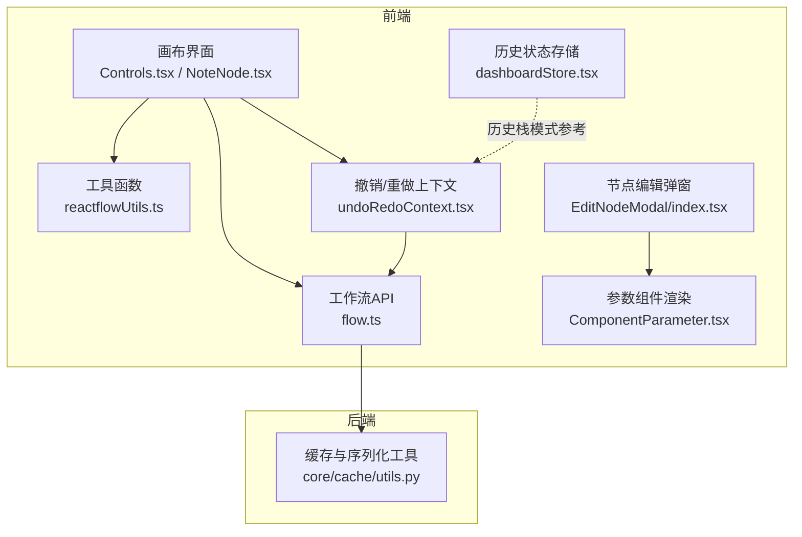
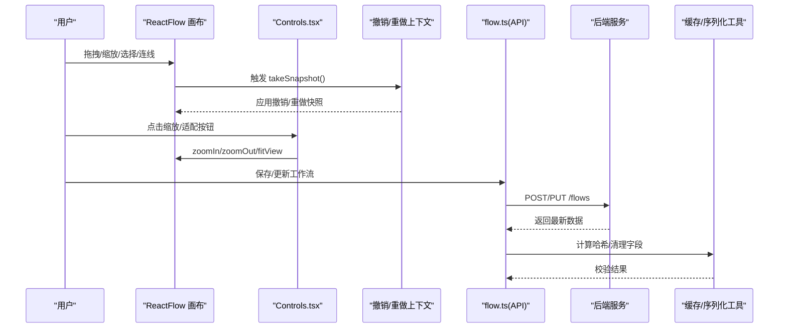
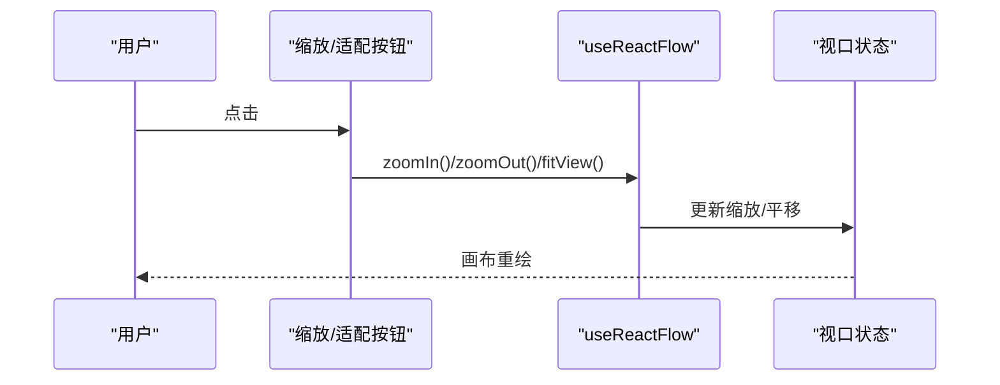
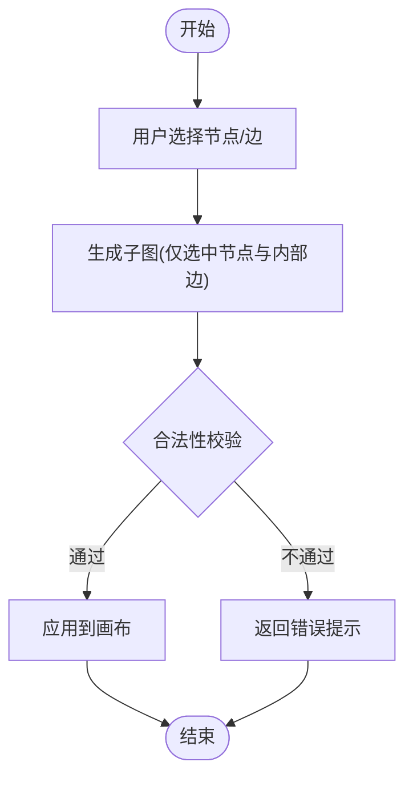
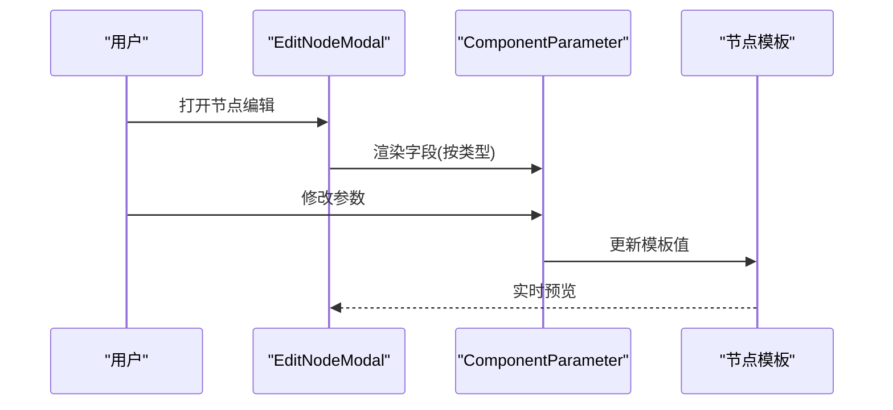
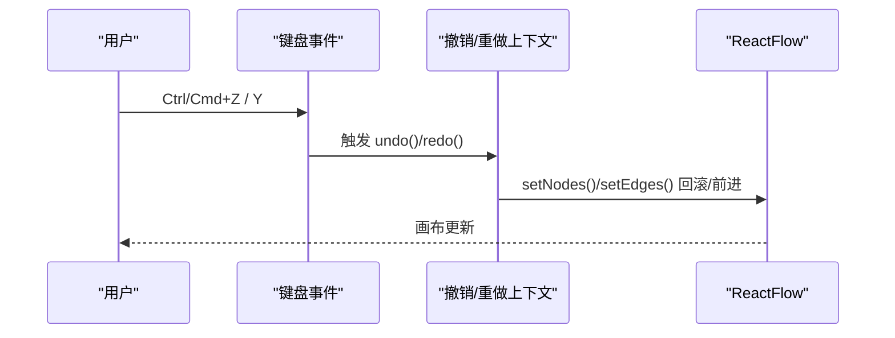
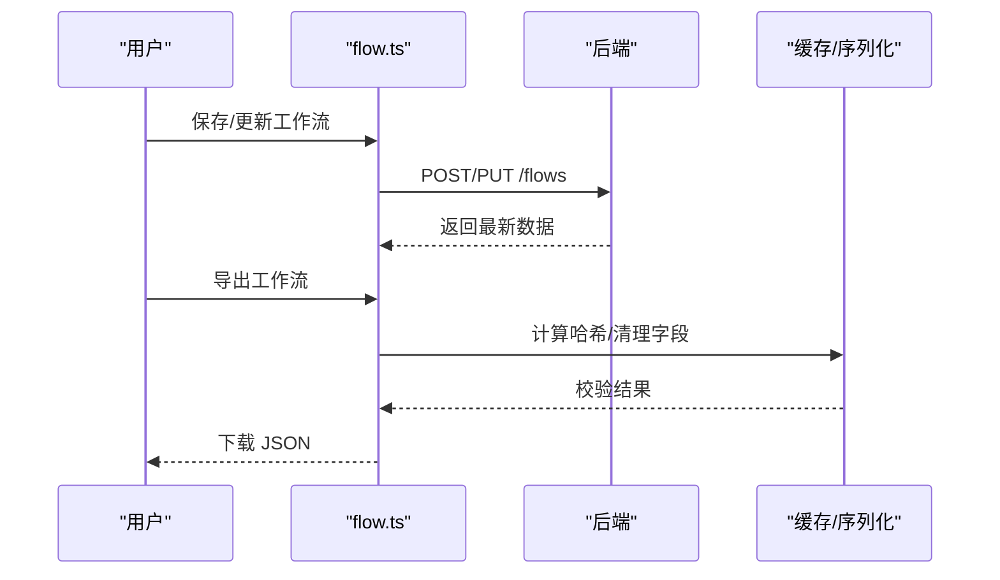
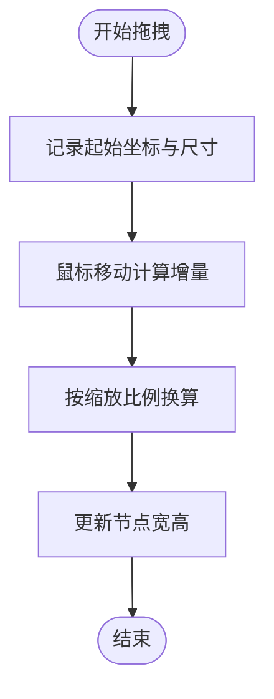
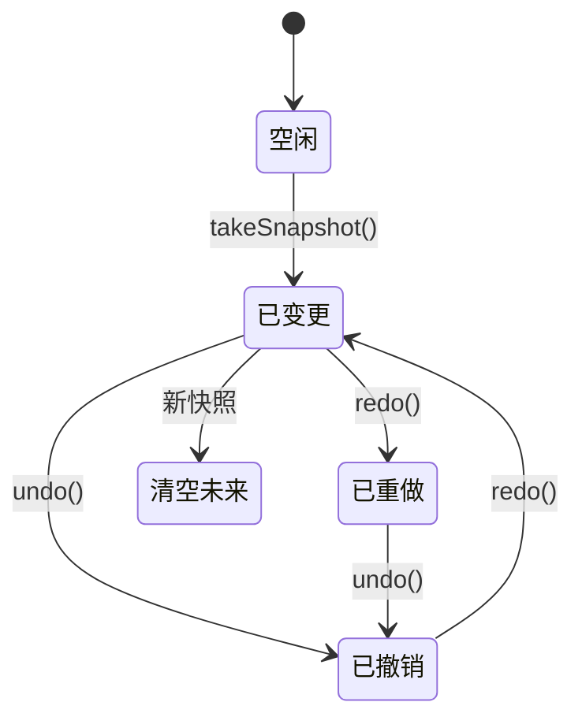
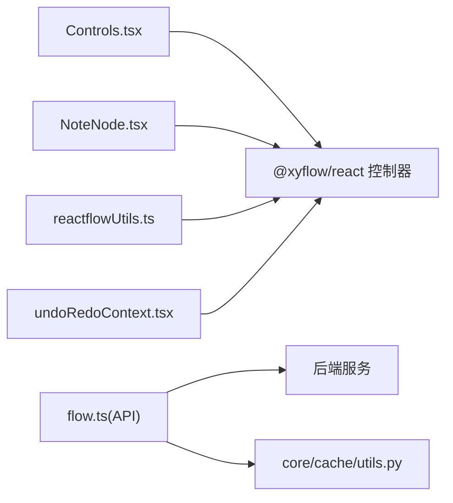

# 画布操作

<cite>
**本文引用的文件**
- [src/frontend/platform/src/pages/BuildPage/flow/Controls.tsx](file://src/frontend/platform/src/pages/BuildPage/flow/Controls.tsx)
- [src/frontend/platform/src/contexts/undoRedoContext.tsx](file://src/frontend/platform/src/contexts/undoRedoContext.tsx)
- [src/frontend/platform/src/util/reactflowUtils.ts](file://src/frontend/platform/src/util/reactflowUtils.ts)
- [src/frontend/platform/src/pages/BuildPage/flow/NoteNode.tsx](file://src/frontend/platform/src/pages/BuildPage/flow/NoteNode.tsx)
- [src/frontend/platform/src/controllers/API/flow.ts](file://src/frontend/platform/src/controllers/API/flow.ts)
- [src/frontend/platform/src/store/dashboardStore.tsx](file://src/frontend/platform/src/store/dashboardStore.tsx)
- [src/frontend/platform/src/pages/DiffFlowPage/components/ComponentParameter.tsx](file://src/frontend/platform/src/pages/DiffFlowPage/components/ComponentParameter.tsx)
- [src/frontend/platform/src/modals/EditNodeModal/index.tsx](file://src/frontend/platform/src/modals/EditNodeModal/index.tsx)
- [src/frontend/platform/src/components/codeAreaComponent/index.tsx](file://src/frontend/platform/src/components/codeAreaComponent/index.tsx)
- [src/frontend/platform/src/components/promptComponent/index.tsx](file://src/frontend/platform/src/components/promptComponent/index.tsx)
- [src/frontend/platform/src/pages/BuildPage/bench/LingSiWork.tsx](file://src/frontend/platform/src/pages/BuildPage/bench/LingSiWork.tsx)
- [src/frontend/platform/src/workspace/FilePreviewDrawer.tsx](file://src/frontend/platform/src/workspace/FilePreviewDrawer.tsx)
- [src/backend/bisheng/core/cache/utils.py](file://src/backend/bisheng/core/cache/utils.py)
</cite>

## 目录
1. [简介](#简介)
2. [项目结构](#项目结构)
3. [核心组件](#核心组件)
4. [架构总览](#架构总览)
5. [详细组件分析](#详细组件分析)
6. [依赖关系分析](#依赖关系分析)
7. [性能考量](#性能考量)
8. [故障排查指南](#故障排查指南)
9. [结论](#结论)
10. [附录](#附录)

## 简介
本技术文档聚焦于“工作流画布”的操作能力与实现，覆盖以下主题：
- 画布基本操作：缩放控制、平移导航、选择框选、多选操作
- 节点编辑：属性面板显示、参数修改、实时预览、撤销/重做
- 工作流保存与加载：数据序列化、版本控制、导入/导出格式
- 画布布局与对齐：自动布局算法、手动调整、网格对齐
- 画布状态管理：临时状态、持久化状态、恢复机制

文档以前端 React + @xyflow/react 为核心，结合后端 API 与工具函数，系统性梳理从用户交互到数据持久化的完整链路。

## 项目结构
围绕画布操作的相关前端模块主要分布在：
- BuildPage/flow：画布控件、节点渲染与工具栏
- controllers/API：工作流的增删改查、版本管理、权限校验
- util：通用工具（连接校验、模板合并、序列化等）
- contexts：全局撤销/重做上下文
- store：仪表盘布局的历史栈（可类比工作流画布历史管理）
- pages/DiffFlowPage：参数编辑与类型渲染
- workspace：导出/预览相关 UI

图表来源
- [src/frontend/platform/src/pages/BuildPage/flow/Controls.tsx](file://src/frontend/platform/src/pages/BuildPage/flow/Controls.tsx#L1-L77)
- [src/frontend/platform/src/pages/BuildPage/flow/NoteNode.tsx](file://src/frontend/platform/src/pages/BuildPage/flow/NoteNode.tsx#L1-L114)
- [src/frontend/platform/src/util/reactflowUtils.ts](file://src/frontend/platform/src/util/reactflowUtils.ts#L1-L800)
- [src/frontend/platform/src/contexts/undoRedoContext.tsx](file://src/frontend/platform/src/contexts/undoRedoContext.tsx#L1-L189)
- [src/frontend/platform/src/controllers/API/flow.ts](file://src/frontend/platform/src/controllers/API/flow.ts#L1-L386)
- [src/frontend/platform/src/store/dashboardStore.tsx](file://src/frontend/platform/src/store/dashboardStore.tsx#L466-L551)
- [src/frontend/platform/src/modals/EditNodeModal/index.tsx](file://src/frontend/platform/src/modals/EditNodeModal/index.tsx#L169-L196)
- [src/frontend/platform/src/pages/DiffFlowPage/components/ComponentParameter.tsx](file://src/frontend/platform/src/pages/DiffFlowPage/components/ComponentParameter.tsx#L104-L136)
- [src/backend/bisheng/core/cache/utils.py](file://src/backend/bisheng/core/cache/utils.py#L104-L148)

章节来源
- [src/frontend/platform/src/pages/BuildPage/flow/Controls.tsx](file://src/frontend/platform/src/pages/BuildPage/flow/Controls.tsx#L1-L77)
- [src/frontend/platform/src/pages/BuildPage/flow/NoteNode.tsx](file://src/frontend/platform/src/pages/BuildPage/flow/NoteNode.tsx#L1-L114)
- [src/frontend/platform/src/util/reactflowUtils.ts](file://src/frontend/platform/src/util/reactflowUtils.ts#L1-L800)
- [src/frontend/platform/src/contexts/undoRedoContext.tsx](file://src/frontend/platform/src/contexts/undoRedoContext.tsx#L1-L189)
- [src/frontend/platform/src/controllers/API/flow.ts](file://src/frontend/platform/src/controllers/API/flow.ts#L1-L386)
- [src/frontend/platform/src/store/dashboardStore.tsx](file://src/frontend/platform/src/store/dashboardStore.tsx#L466-L551)
- [src/frontend/platform/src/modals/EditNodeModal/index.tsx](file://src/frontend/platform/src/modals/EditNodeModal/index.tsx#L169-L196)
- [src/frontend/platform/src/pages/DiffFlowPage/components/ComponentParameter.tsx](file://src/frontend/platform/src/pages/DiffFlowPage/components/ComponentParameter.tsx#L104-L136)
- [src/backend/bisheng/core/cache/utils.py](file://src/backend/bisheng/core/cache/utils.py#L104-L148)

## 核心组件
- 画布控件与导航
  - 缩放与适配：通过 @xyflow/react 的 useReactFlow 提供 zoomIn/zoomOut/fitView 控制器，配合最小/最大缩放限制
  - 平移导航：由 @xyflow/react 的视口系统负责，支持拖拽平移与边界约束
- 选择与多选
  - 选择框选与多选：基于 @xyflow/react 的选择事件与边集过滤，支持仅保留与选中节点相连的边
- 节点编辑
  - 属性面板：EditNodeModal 展示节点模板字段；ComponentParameter 根据模板类型渲染输入组件（布尔、整数、浮点、文件等）
  - 实时预览：参数变更触发节点模板更新，工具函数对模板进行合并与校验
- 撤销/重做
  - 全局撤销/重做上下文：记录节点与边快照，支持键盘快捷键（Ctrl/Cmd+Z/Y）
- 工作流保存/加载/版本
  - 保存/更新：通过 API 将 ReactFlowJson 数据提交至后端
  - 版本管理：查询/创建/切换版本，支持版本级数据隔离
  - 导出：工具函数支持将工作流导出为 JSON 文件
- 状态管理
  - 临时状态：每次变更生成快照并清空未来历史
  - 持久化状态：后端数据库存储；前端本地缓存与哈希校验辅助

章节来源
- [src/frontend/platform/src/pages/BuildPage/flow/Controls.tsx](file://src/frontend/platform/src/pages/BuildPage/flow/Controls.tsx#L14-L77)
- [src/frontend/platform/src/contexts/undoRedoContext.tsx](file://src/frontend/platform/src/contexts/undoRedoContext.tsx#L49-L189)
- [src/frontend/platform/src/util/reactflowUtils.ts](file://src/frontend/platform/src/util/reactflowUtils.ts#L580-L742)
- [src/frontend/platform/src/modals/EditNodeModal/index.tsx](file://src/frontend/platform/src/modals/EditNodeModal/index.tsx#L169-L196)
- [src/frontend/platform/src/pages/DiffFlowPage/components/ComponentParameter.tsx](file://src/frontend/platform/src/pages/DiffFlowPage/components/ComponentParameter.tsx#L104-L136)
- [src/frontend/platform/src/controllers/API/flow.ts](file://src/frontend/platform/src/controllers/API/flow.ts#L117-L243)
- [src/frontend/platform/src/util/reactflowUtils.ts](file://src/frontend/platform/src/util/reactflowUtils.ts#L1116-L1157)
- [src/frontend/platform/src/store/dashboardStore.tsx](file://src/frontend/platform/src/store/dashboardStore.tsx#L466-L551)

## 架构总览
下图展示了从用户在画布上进行操作，到数据持久化与版本控制的整体流程。

图表来源
- [src/frontend/platform/src/pages/BuildPage/flow/Controls.tsx](file://src/frontend/platform/src/pages/BuildPage/flow/Controls.tsx#L14-L77)
- [src/frontend/platform/src/contexts/undoRedoContext.tsx](file://src/frontend/platform/src/contexts/undoRedoContext.tsx#L64-L115)
- [src/frontend/platform/src/controllers/API/flow.ts](file://src/frontend/platform/src/controllers/API/flow.ts#L135-L243)
- [src/backend/bisheng/core/cache/utils.py](file://src/backend/bisheng/core/cache/utils.py#L104-L148)

## 详细组件分析

### 画布导航与缩放
- 功能要点
  - 提供缩放加减与适配全图按钮
  - 通过 useReactFlow 获取控制器，结合最小/最大缩放限制
- 关键实现位置
  - 控件按钮与控制器绑定：[Controls.tsx](file://src/frontend/platform/src/pages/BuildPage/flow/Controls.tsx#L14-L77)
  - 视口与缩放限制：[Controls.tsx](file://src/frontend/platform/src/pages/BuildPage/flow/Controls.tsx#L21-L27)

图表来源
- [src/frontend/platform/src/pages/BuildPage/flow/Controls.tsx](file://src/frontend/platform/src/pages/BuildPage/flow/Controls.tsx#L14-L77)

章节来源
- [src/frontend/platform/src/pages/BuildPage/flow/Controls.tsx](file://src/frontend/platform/src/pages/BuildPage/flow/Controls.tsx#L14-L77)

### 选择与多选
- 功能要点
  - 选择框选后，仅保留与选中节点相连的边，确保子图完整性
  - 对选区进行合法性校验（至少两个节点、自由输出唯一、必须连通）
- 关键实现位置
  - 生成子图与过滤边：[reactflowUtils.ts](file://src/frontend/platform/src/util/reactflowUtils.ts#L580-L618)
  - 选区合法性校验：[reactflowUtils.ts](file://src/frontend/platform/src/util/reactflowUtils.ts#L698-L742)

图表来源
- [src/frontend/platform/src/util/reactflowUtils.ts](file://src/frontend/platform/src/util/reactflowUtils.ts#L580-L742)

章节来源
- [src/frontend/platform/src/util/reactflowUtils.ts](file://src/frontend/platform/src/util/reactflowUtils.ts#L580-L742)

### 节点编辑与参数面板
- 功能要点
  - 弹窗展示节点模板字段，按类型渲染输入组件（布尔、整型、浮点、文件、代码、提示词等）
  - 参数变更即时更新模板值，支持实时预览
- 关键实现位置
  - 参数组件渲染逻辑：[ComponentParameter.tsx](file://src/frontend/platform/src/pages/DiffFlowPage/components/ComponentParameter.tsx#L104-L136)
  - 节点编辑弹窗表格与字段展示：[EditNodeModal/index.tsx](file://src/frontend/platform/src/modals/EditNodeModal/index.tsx#L169-L196)
  - 代码/提示词组件入口：[codeAreaComponent/index.tsx](file://src/frontend/platform/src/components/codeAreaComponent/index.tsx#L31-L85), [promptComponent/index.tsx](file://src/frontend/platform/src/components/promptComponent/index.tsx#L90-L109)

图表来源
- [src/frontend/platform/src/modals/EditNodeModal/index.tsx](file://src/frontend/platform/src/modals/EditNodeModal/index.tsx#L169-L196)
- [src/frontend/platform/src/pages/DiffFlowPage/components/ComponentParameter.tsx](file://src/frontend/platform/src/pages/DiffFlowPage/components/ComponentParameter.tsx#L104-L136)
- [src/frontend/platform/src/components/codeAreaComponent/index.tsx](file://src/frontend/platform/src/components/codeAreaComponent/index.tsx#L31-L85)
- [src/frontend/platform/src/components/promptComponent/index.tsx](file://src/frontend/platform/src/components/promptComponent/index.tsx#L90-L109)

章节来源
- [src/frontend/platform/src/modals/EditNodeModal/index.tsx](file://src/frontend/platform/src/modals/EditNodeModal/index.tsx#L169-L196)
- [src/frontend/platform/src/pages/DiffFlowPage/components/ComponentParameter.tsx](file://src/frontend/platform/src/pages/DiffFlowPage/components/ComponentParameter.tsx#L104-L136)
- [src/frontend/platform/src/components/codeAreaComponent/index.tsx](file://src/frontend/platform/src/components/codeAreaComponent/index.tsx#L31-L85)
- [src/frontend/platform/src/components/promptComponent/index.tsx](file://src/frontend/platform/src/components/promptComponent/index.tsx#L90-L109)

### 撤销/重做
- 功能要点
  - 快照记录当前节点与边集合，支持撤销与重做
  - 键盘快捷键：Ctrl/Cmd+Z 撤销，Ctrl/Cmd+Shift+Z 或 Ctrl/Cmd+Y 重做
  - 每次新快照会清空未来历史，避免状态不一致
- 关键实现位置
  - 快照与历史栈：[undoRedoContext.tsx](file://src/frontend/platform/src/contexts/undoRedoContext.tsx#L64-L115)
  - 键盘事件监听与执行：[undoRedoContext.tsx](file://src/frontend/platform/src/contexts/undoRedoContext.tsx#L150-L176)

图表来源
- [src/frontend/platform/src/contexts/undoRedoContext.tsx](file://src/frontend/platform/src/contexts/undoRedoContext.tsx#L150-L176)

章节来源
- [src/frontend/platform/src/contexts/undoRedoContext.tsx](file://src/frontend/platform/src/contexts/undoRedoContext.tsx#L64-L115)
- [src/frontend/platform/src/contexts/undoRedoContext.tsx](file://src/frontend/platform/src/contexts/undoRedoContext.tsx#L150-L176)

### 工作流保存与加载
- 功能要点
  - 保存/更新：将 ReactFlowJson 数据提交至后端
  - 加载：根据 ID 获取工作流数据
  - 版本管理：查询/创建/切换版本，支持版本级数据隔离
  - 导出：将工作流导出为 JSON 文件
- 关键实现位置
  - 保存/更新接口：[flow.ts](file://src/frontend/platform/src/controllers/API/flow.ts#L135-L243)
  - 查询/切换版本接口：[flow.ts](file://src/frontend/platform/src/controllers/API/flow.ts#L286-L346)
  - 导出 JSON：[reactflowUtils.ts](file://src/frontend/platform/src/util/reactflowUtils.ts#L1116-L1124)

图表来源
- [src/frontend/platform/src/controllers/API/flow.ts](file://src/frontend/platform/src/controllers/API/flow.ts#L135-L243)
- [src/frontend/platform/src/util/reactflowUtils.ts](file://src/frontend/platform/src/util/reactflowUtils.ts#L1116-L1124)
- [src/backend/bisheng/core/cache/utils.py](file://src/backend/bisheng/core/cache/utils.py#L104-L148)

章节来源
- [src/frontend/platform/src/controllers/API/flow.ts](file://src/frontend/platform/src/controllers/API/flow.ts#L135-L243)
- [src/frontend/platform/src/util/reactflowUtils.ts](file://src/frontend/platform/src/util/reactflowUtils.ts#L1116-L1124)
- [src/backend/bisheng/core/cache/utils.py](file://src/backend/bisheng/core/cache/utils.py#L104-L148)

### 画布布局与对齐
- 功能要点
  - 自动布局：通过工具函数计算节点中心点，用于整体移动或分组节点定位
  - 手动调整：节点拖拽、注释节点尺寸拖拽
  - 网格对齐：注释节点拖拽尺寸时按缩放比例计算增量
- 关键实现位置
  - 计算节点中心点：[reactflowUtils.ts](file://src/frontend/platform/src/util/reactflowUtils.ts#L548-L562)
  - 注释节点尺寸拖拽：[NoteNode.tsx](file://src/frontend/platform/src/pages/BuildPage/flow/NoteNode.tsx#L33-L73)

图表来源
- [src/frontend/platform/src/pages/BuildPage/flow/NoteNode.tsx](file://src/frontend/platform/src/pages/BuildPage/flow/NoteNode.tsx#L33-L73)

章节来源
- [src/frontend/platform/src/util/reactflowUtils.ts](file://src/frontend/platform/src/util/reactflowUtils.ts#L548-L562)
- [src/frontend/platform/src/pages/BuildPage/flow/NoteNode.tsx](file://src/frontend/platform/src/pages/BuildPage/flow/NoteNode.tsx#L33-L73)

### 画布状态管理
- 功能要点
  - 临时状态：每次操作生成快照，清空未来历史，限制历史长度
  - 持久化状态：后端数据库存储工作流数据；前端本地缓存与哈希校验辅助
  - 恢复机制：撤销/重做基于历史栈回放
- 关键实现位置
  - 历史栈与快照：[undoRedoContext.tsx](file://src/frontend/platform/src/contexts/undoRedoContext.tsx#L64-L115)
  - 仪表盘历史栈（可类比）：[dashboardStore.tsx](file://src/frontend/platform/src/store/dashboardStore.tsx#L466-L551)
  - 后端哈希与清理字段：[core/cache/utils.py](file://src/backend/bisheng/core/cache/utils.py#L104-L148)

图表来源
- [src/frontend/platform/src/contexts/undoRedoContext.tsx](file://src/frontend/platform/src/contexts/undoRedoContext.tsx#L64-L115)
- [src/frontend/platform/src/store/dashboardStore.tsx](file://src/frontend/platform/src/store/dashboardStore.tsx#L466-L551)
- [src/backend/bisheng/core/cache/utils.py](file://src/backend/bisheng/core/cache/utils.py#L104-L148)

章节来源
- [src/frontend/platform/src/contexts/undoRedoContext.tsx](file://src/frontend/platform/src/contexts/undoRedoContext.tsx#L64-L115)
- [src/frontend/platform/src/store/dashboardStore.tsx](file://src/frontend/platform/src/store/dashboardStore.tsx#L466-L551)
- [src/backend/bisheng/core/cache/utils.py](file://src/backend/bisheng/core/cache/utils.py#L104-L148)

## 依赖关系分析
- 组件耦合
  - Controls.tsx 依赖 @xyflow/react 的控制器，耦合度低，便于扩展
  - undoRedoContext.tsx 通过 useReactFlow 读写节点/边，与画布强耦合但保持上下文独立
  - reactflowUtils.ts 提供纯函数式工具，降低业务层复杂度
- 外部依赖
  - 后端 API：工作流 CRUD、版本管理、权限校验
  - 缓存与序列化：后端工具负责哈希与字段清理，保证数据一致性

图表来源
- [src/frontend/platform/src/pages/BuildPage/flow/Controls.tsx](file://src/frontend/platform/src/pages/BuildPage/flow/Controls.tsx#L14-L77)
- [src/frontend/platform/src/pages/BuildPage/flow/NoteNode.tsx](file://src/frontend/platform/src/pages/BuildPage/flow/NoteNode.tsx#L1-L114)
- [src/frontend/platform/src/util/reactflowUtils.ts](file://src/frontend/platform/src/util/reactflowUtils.ts#L1-L800)
- [src/frontend/platform/src/contexts/undoRedoContext.tsx](file://src/frontend/platform/src/contexts/undoRedoContext.tsx#L1-L189)
- [src/frontend/platform/src/controllers/API/flow.ts](file://src/frontend/platform/src/controllers/API/flow.ts#L1-L386)
- [src/backend/bisheng/core/cache/utils.py](file://src/backend/bisheng/core/cache/utils.py#L104-L148)

章节来源
- [src/frontend/platform/src/pages/BuildPage/flow/Controls.tsx](file://src/frontend/platform/src/pages/BuildPage/flow/Controls.tsx#L14-L77)
- [src/frontend/platform/src/pages/BuildPage/flow/NoteNode.tsx](file://src/frontend/platform/src/pages/BuildPage/flow/NoteNode.tsx#L1-L114)
- [src/frontend/platform/src/util/reactflowUtils.ts](file://src/frontend/platform/src/util/reactflowUtils.ts#L1-L800)
- [src/frontend/platform/src/contexts/undoRedoContext.tsx](file://src/frontend/platform/src/contexts/undoRedoContext.tsx#L1-L189)
- [src/frontend/platform/src/controllers/API/flow.ts](file://src/frontend/platform/src/controllers/API/flow.ts#L1-L386)
- [src/backend/bisheng/core/cache/utils.py](file://src/backend/bisheng/core/cache/utils.py#L104-L148)

## 性能考量
- 历史栈大小控制：撤销/重做上下文限制最大历史条目，避免内存膨胀
- 选择过滤：仅保留与选中节点相连的边，减少后续处理规模
- 序列化与哈希：后端对工作流数据进行清洗与哈希计算，提升版本对比与缓存命中率
- 事件监听：撤销/重做上下文在卸载时移除键盘监听，防止内存泄漏

章节来源
- [src/frontend/platform/src/contexts/undoRedoContext.tsx](file://src/frontend/platform/src/contexts/undoRedoContext.tsx#L42-L45)
- [src/frontend/platform/src/util/reactflowUtils.ts](file://src/frontend/platform/src/util/reactflowUtils.ts#L580-L618)
- [src/backend/bisheng/core/cache/utils.py](file://src/backend/bisheng/core/cache/utils.py#L104-L148)

## 故障排查指南
- 无法撤销/重做
  - 检查是否启用快捷键监听与上下文是否正确包裹
  - 参考：[undoRedoContext.tsx](file://src/frontend/platform/src/contexts/undoRedoContext.tsx#L150-L176)
- 保存失败或版本异常
  - 确认网络请求与后端返回状态码
  - 参考：[flow.ts](file://src/frontend/platform/src/controllers/API/flow.ts#L135-L243)
- 导出文件为空或不可用
  - 检查导出函数调用与文件名生成
  - 参考：[reactflowUtils.ts](file://src/frontend/platform/src/util/reactflowUtils.ts#L1116-L1124)
- 权限不足
  - 使用写权限检查接口确认用户权限
  - 参考：[flow.ts](file://src/frontend/platform/src/controllers/API/flow.ts#L379-L386)
- 导出预览状态提示
  - 导出过程中的 loading/success/error 状态提示
  - 参考：[FilePreviewDrawer.tsx](file://src/frontend/platform/src/workspace/FilePreviewDrawer.tsx#L79-L104)

章节来源
- [src/frontend/platform/src/contexts/undoRedoContext.tsx](file://src/frontend/platform/src/contexts/undoRedoContext.tsx#L150-L176)
- [src/frontend/platform/src/controllers/API/flow.ts](file://src/frontend/platform/src/controllers/API/flow.ts#L135-L243)
- [src/frontend/platform/src/util/reactflowUtils.ts](file://src/frontend/platform/src/util/reactflowUtils.ts#L1116-L1124)
- [src/frontend/platform/src/controllers/API/flow.ts](file://src/frontend/platform/src/controllers/API/flow.ts#L379-L386)
- [src/frontend/platform/src/workspace/FilePreviewDrawer.tsx](file://src/frontend/platform/src/workspace/FilePreviewDrawer.tsx#L79-L104)

## 结论
本文档系统梳理了工作流画布的操作能力与实现细节，涵盖缩放导航、选择多选、节点编辑、撤销重做、保存加载与版本控制、布局对齐以及状态管理。通过 @xyflow/react 的控制器与工具函数的组合，配合后端 API 与缓存序列化工具，实现了稳定高效的画布体验。建议在后续迭代中持续关注历史栈大小、序列化性能与权限校验的健壮性。

## 附录
- 相关页面与场景
  - 工作台/仪表盘布局（可作为画布历史管理的参考实现）：[LingSiWork.tsx](file://src/frontend/platform/src/pages/BuildPage/bench/LingSiWork.tsx#L1-L22)

章节来源
- [src/frontend/platform/src/pages/BuildPage/bench/LingSiWork.tsx](file://src/frontend/platform/src/pages/BuildPage/bench/LingSiWork.tsx#L1-L22)