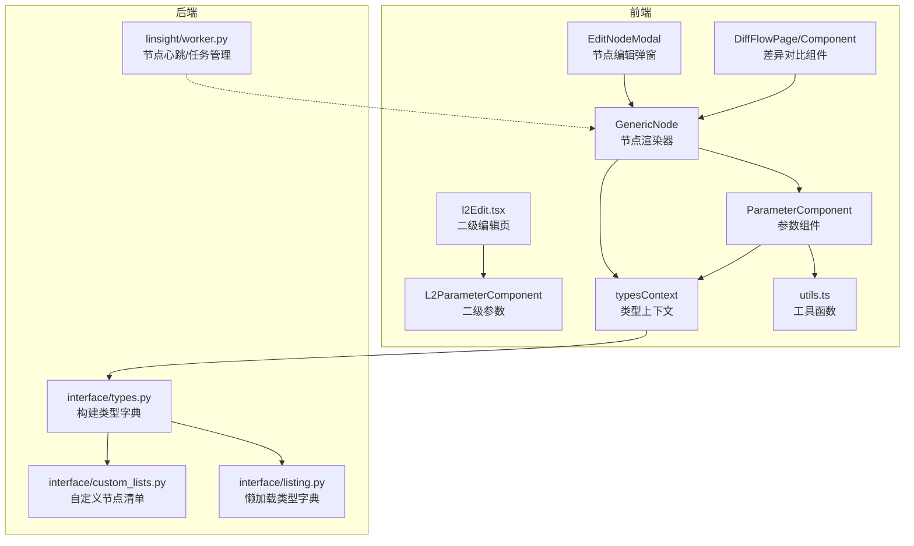
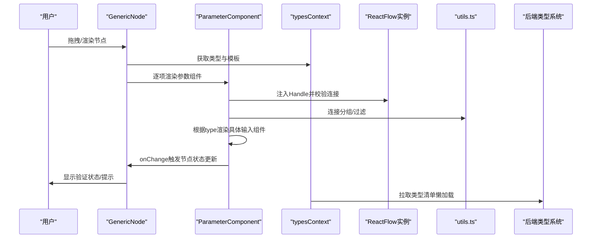
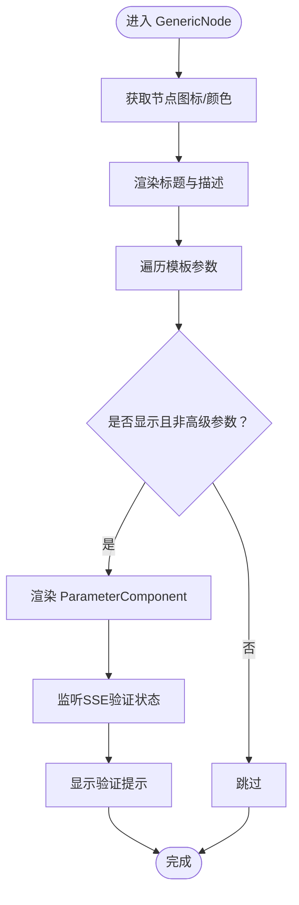
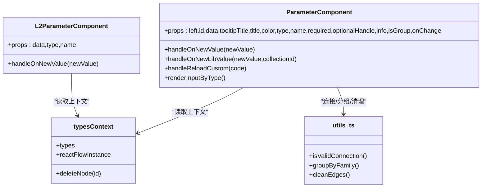
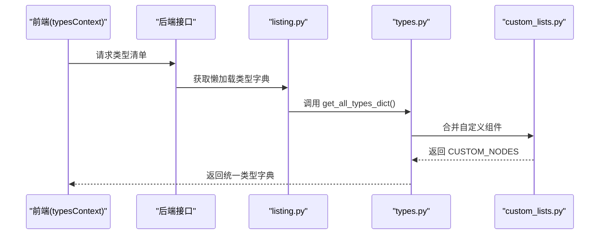
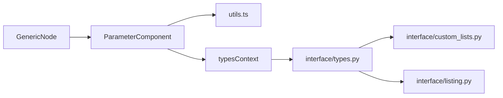

# 自定义节点开发

<cite>
**本文引用的文件**
- [src/frontend/platform/src/CustomNodes/GenericNode/index.tsx](file://src/frontend/platform/src/CustomNodes/GenericNode/index.tsx)
- [src/frontend/platform/src/CustomNodes/GenericNode/components/parameterComponent/index.tsx](file://src/frontend/platform/src/CustomNodes/GenericNode/components/parameterComponent/index.tsx)
- [src/frontend/platform/src/CustomNodes/GenericNode/components/parameterComponent/l2Index.tsx](file://src/frontend/platform/src/CustomNodes/GenericNode/components/parameterComponent/l2Index.tsx)
- [src/frontend/platform/src/contexts/typesContext.tsx](file://src/frontend/platform/src/contexts/typesContext.tsx)
- [src/frontend/platform/src/utils.ts](file://src/frontend/platform/src/utils.ts)
- [src/frontend/platform/src/pages/BuildPage/skills/l2Edit.tsx](file://src/frontend/platform/src/pages/BuildPage/skills/l2Edit.tsx)
- [src/frontend/platform/src/modals/EditNodeModal/index.tsx](file://src/frontend/platform/src/modals/EditNodeModal/index.tsx)
- [src/frontend/platform/src/pages/DiffFlowPage/components/Component.tsx](file://src/frontend/platform/src/pages/DiffFlowPage/components/Component.tsx)
- [src/backend/bisheng/interface/types.py](file://src/backend/bisheng/interface/types.py)
- [src/backend/bisheng/interface/custom_lists.py](file://src/backend/bisheng/interface/custom_lists.py)
- [src/backend/bisheng/interface/listing.py](file://src/backend/bisheng/interface/listing.py)
- [src/backend/bisheng/linsight/worker.py](file://src/backend/bisheng/linsight/worker.py)
</cite>

## 目录
1. [引言](#引言)
2. [项目结构](#项目结构)
3. [核心组件](#核心组件)
4. [架构总览](#架构总览)
5. [详细组件分析](#详细组件分析)
6. [依赖关系分析](#依赖关系分析)
7. [性能考量](#性能考量)
8. [故障排查指南](#故障排查指南)
9. [结论](#结论)
10. [附录：开发示例](#附录开发示例)

## 引言
本指南面向希望在该系统中开发“自定义节点”的工程师，围绕前端通用节点渲染器 GenericNode 的架构与实现进行深入解析，涵盖以下主题：
- 节点模板系统与参数组件化
- 动态表单生成与参数联动
- 节点开发流程：类型定义、参数配置、UI 组件开发、事件处理
- 参数组件系统：输入类型、验证规则、动态显隐与联动
- 节点注册与管理：节点清单、类型检查、版本兼容
- 完整开发示例：简单节点、复杂节点、第三方集成节点

## 项目结构
前端采用 React + TypeScript，节点渲染与参数编辑由 GenericNode 及其子组件 ParameterComponent 驱动；后端通过接口层聚合原生与自定义组件类型，供前端消费。

图示来源
- [src/frontend/platform/src/CustomNodes/GenericNode/index.tsx](file://src/frontend/platform/src/CustomNodes/GenericNode/index.tsx#L23-L263)
- [src/frontend/platform/src/CustomNodes/GenericNode/components/parameterComponent/index.tsx](file://src/frontend/platform/src/CustomNodes/GenericNode/components/parameterComponent/index.tsx#L39-L579)
- [src/frontend/platform/src/CustomNodes/GenericNode/components/parameterComponent/l2Index.tsx](file://src/frontend/platform/src/CustomNodes/GenericNode/components/parameterComponent/l2Index.tsx#L19-L225)
- [src/frontend/platform/src/contexts/typesContext.tsx](file://src/frontend/platform/src/contexts/typesContext.tsx#L71-L131)
- [src/frontend/platform/src/utils.ts](file://src/frontend/platform/src/utils.ts#L915-L953)
- [src/frontend/platform/src/pages/BuildPage/skills/l2Edit.tsx](file://src/frontend/platform/src/pages/BuildPage/skills/l2Edit.tsx#L222-L243)
- [src/frontend/platform/src/modals/EditNodeModal/index.tsx](file://src/frontend/platform/src/modals/EditNodeModal/index.tsx#L169-L196)
- [src/frontend/platform/src/pages/DiffFlowPage/components/Component.tsx](file://src/frontend/platform/src/pages/DiffFlowPage/components/Component.tsx#L86-L107)
- [src/backend/bisheng/interface/types.py](file://src/backend/bisheng/interface/types.py#L25-L81)
- [src/backend/bisheng/interface/custom_lists.py](file://src/backend/bisheng/interface/custom_lists.py#L115-L121)
- [src/backend/bisheng/interface/listing.py](file://src/backend/bisheng/interface/listing.py#L52-L75)
- [src/backend/bisheng/linsight/worker.py](file://src/backend/bisheng/linsight/worker.py#L40-L68)

章节来源
- [src/frontend/platform/src/CustomNodes/GenericNode/index.tsx](file://src/frontend/platform/src/CustomNodes/GenericNode/index.tsx#L23-L263)
- [src/frontend/platform/src/CustomNodes/GenericNode/components/parameterComponent/index.tsx](file://src/frontend/platform/src/CustomNodes/GenericNode/components/parameterComponent/index.tsx#L39-L579)
- [src/frontend/platform/src/CustomNodes/GenericNode/components/parameterComponent/l2Index.tsx](file://src/frontend/platform/src/CustomNodes/GenericNode/components/parameterComponent/l2Index.tsx#L19-L225)
- [src/frontend/platform/src/contexts/typesContext.tsx](file://src/frontend/platform/src/contexts/typesContext.tsx#L71-L131)
- [src/frontend/platform/src/utils.ts](file://src/frontend/platform/src/utils.ts#L915-L953)
- [src/frontend/platform/src/pages/BuildPage/skills/l2Edit.tsx](file://src/frontend/platform/src/pages/BuildPage/skills/l2Edit.tsx#L222-L243)
- [src/frontend/platform/src/modals/EditNodeModal/index.tsx](file://src/frontend/platform/src/modals/EditNodeModal/index.tsx#L169-L196)
- [src/frontend/platform/src/pages/DiffFlowPage/components/Component.tsx](file://src/frontend/platform/src/pages/DiffFlowPage/components/Component.tsx#L86-L107)
- [src/backend/bisheng/interface/types.py](file://src/backend/bisheng/interface/types.py#L25-L81)
- [src/backend/bisheng/interface/custom_lists.py](file://src/backend/bisheng/interface/custom_lists.py#L115-L121)
- [src/backend/bisheng/interface/listing.py](file://src/backend/bisheng/interface/listing.py#L52-L75)
- [src/backend/bisheng/linsight/worker.py](file://src/backend/bisheng/linsight/worker.py#L40-L68)

## 核心组件
- GenericNode：负责节点标题、描述、输入输出参数的渲染，以及节点状态提示与工具栏。
- ParameterComponent：根据模板类型动态渲染不同输入组件（字符串、布尔、数值、文件、变量、代码、提示词、嵌套字典等），并处理值变更、禁用逻辑、连接有效性校验、重载自定义组件等。
- L2ParameterComponent：用于二级编辑场景的参数渲染，简化交互并保持一致的值更新与状态提示。
- typesContext：提供类型列表、React Flow 实例、节点删除等能力，支撑节点渲染与连接约束。
- utils.ts：包含节点分组、基类检查、可用连接提示等工具函数，辅助参数组件的连接过滤与提示。
- 后端类型系统：通过 types.py 构建原生与自定义组件类型字典，custom_lists.py 汇总自定义节点清单，listing.py 提供懒加载类型字典。

章节来源
- [src/frontend/platform/src/CustomNodes/GenericNode/index.tsx](file://src/frontend/platform/src/CustomNodes/GenericNode/index.tsx#L23-L263)
- [src/frontend/platform/src/CustomNodes/GenericNode/components/parameterComponent/index.tsx](file://src/frontend/platform/src/CustomNodes/GenericNode/components/parameterComponent/index.tsx#L39-L579)
- [src/frontend/platform/src/CustomNodes/GenericNode/components/parameterComponent/l2Index.tsx](file://src/frontend/platform/src/CustomNodes/GenericNode/components/parameterComponent/l2Index.tsx#L19-L225)
- [src/frontend/platform/src/contexts/typesContext.tsx](file://src/frontend/platform/src/contexts/typesContext.tsx#L71-L131)
- [src/frontend/platform/src/utils.ts](file://src/frontend/platform/src/utils.ts#L915-L953)
- [src/backend/bisheng/interface/types.py](file://src/backend/bisheng/interface/types.py#L25-L81)
- [src/backend/bisheng/interface/custom_lists.py](file://src/backend/bisheng/interface/custom_lists.py#L115-L121)
- [src/backend/bisheng/interface/listing.py](file://src/backend/bisheng/interface/listing.py#L52-L75)

## 架构总览
前端以 GenericNode 为核心，结合 ParameterComponent 的多类型输入组件，完成节点模板到可视表单的映射；typesContext 提供类型与连接约束信息；utils.ts 提供连接过滤与分组提示；后端通过 types.py 与 custom_lists.py 聚合原生与自定义组件，形成统一的类型字典供前端使用。

图示来源
- [src/frontend/platform/src/CustomNodes/GenericNode/index.tsx](file://src/frontend/platform/src/CustomNodes/GenericNode/index.tsx#L23-L263)
- [src/frontend/platform/src/CustomNodes/GenericNode/components/parameterComponent/index.tsx](file://src/frontend/platform/src/CustomNodes/GenericNode/components/parameterComponent/index.tsx#L39-L579)
- [src/frontend/platform/src/CustomNodes/GenericNode/components/parameterComponent/l2Index.tsx](file://src/frontend/platform/src/CustomNodes/GenericNode/components/parameterComponent/l2Index.tsx#L19-L225)
- [src/frontend/platform/src/contexts/typesContext.tsx](file://src/frontend/platform/src/contexts/typesContext.tsx#L71-L131)
- [src/frontend/platform/src/utils.ts](file://src/frontend/platform/src/utils.ts#L915-L953)
- [src/backend/bisheng/interface/types.py](file://src/backend/bisheng/interface/types.py#L25-L81)

## 详细组件分析

### GenericNode：节点渲染与状态提示
- 负责节点标题、描述、输入输出参数的展示；支持分组节点的层级边框样式。
- 从 typesContext 读取类型映射与 React Flow 实例，用于图标、颜色与连接约束。
- 通过 SSE 上下文监听构建过程中的验证状态，并在 Tooltip 中展示参数级校验信息。
- 当无法识别节点类型时，自动删除该节点并提示错误。

图示来源
- [src/frontend/platform/src/CustomNodes/GenericNode/index.tsx](file://src/frontend/platform/src/CustomNodes/GenericNode/index.tsx#L23-L263)

章节来源
- [src/frontend/platform/src/CustomNodes/GenericNode/index.tsx](file://src/frontend/platform/src/CustomNodes/GenericNode/index.tsx#L23-L263)

### ParameterComponent：参数组件系统
- 输入组件类型覆盖：字符串（单行/多行/列表）、布尔、整数、浮点、文件、变量、按钮、知识库选择、代码、提示词、嵌套字典、键值对字典、模型选择（LLM/Embedding）等。
- 动态显隐与联动：
  - 基于模板字段的 required/show/advanced 控制显示。
  - 特定字段（如知识库索引/集合）与嵌入模型存在互斥或联动关系，通过 effect 自动切换嵌入模型字段的 required/show。
  - 禁用逻辑：当目标 Handle 已被连接或满足特定条件时禁用输入。
- 连接有效性：Handle 的 isValidConnection 委托给 utils.ts 的 isValidConnection，结合分组与类型过滤，仅允许合法连接。
- 值变更：统一通过 handleOnNewValue 更新模板值，并标记页面为“未保存”状态。
- 自定义组件重载：对于特定节点类型（如数据节点），支持在线重载模板并清理无效连线。

图示来源
- [src/frontend/platform/src/CustomNodes/GenericNode/components/parameterComponent/index.tsx](file://src/frontend/platform/src/CustomNodes/GenericNode/components/parameterComponent/index.tsx#L39-L579)
- [src/frontend/platform/src/CustomNodes/GenericNode/components/parameterComponent/l2Index.tsx](file://src/frontend/platform/src/CustomNodes/GenericNode/components/parameterComponent/l2Index.tsx#L19-L225)
- [src/frontend/platform/src/contexts/typesContext.tsx](file://src/frontend/platform/src/contexts/typesContext.tsx#L71-L131)
- [src/frontend/platform/src/utils.ts](file://src/frontend/platform/src/utils.ts#L915-L953)

章节来源
- [src/frontend/platform/src/CustomNodes/GenericNode/components/parameterComponent/index.tsx](file://src/frontend/platform/src/CustomNodes/GenericNode/components/parameterComponent/index.tsx#L39-L579)
- [src/frontend/platform/src/CustomNodes/GenericNode/components/parameterComponent/l2Index.tsx](file://src/frontend/platform/src/CustomNodes/GenericNode/components/parameterComponent/l2Index.tsx#L19-L225)
- [src/frontend/platform/src/contexts/typesContext.tsx](file://src/frontend/platform/src/contexts/typesContext.tsx#L71-L131)
- [src/frontend/platform/src/utils.ts](file://src/frontend/platform/src/utils.ts#L915-L953)

### 二级编辑与弹窗：L2ParameterComponent 与 EditNodeModal
- L2ParameterComponent：在二级编辑页按模板渲染参数，简化交互并保持与主流程一致的值更新。
- EditNodeModal：以表格形式展示节点参数（名称、当前值、显隐控制），便于批量查看与调整。
- DiffFlowPage/Component：在差异对比场景中，以只读方式展示节点模板参数，辅助审计与回溯。

章节来源
- [src/frontend/platform/src/pages/BuildPage/skills/l2Edit.tsx](file://src/frontend/platform/src/pages/BuildPage/skills/l2Edit.tsx#L222-L243)
- [src/frontend/platform/src/modals/EditNodeModal/index.tsx](file://src/frontend/platform/src/modals/EditNodeModal/index.tsx#L169-L196)
- [src/frontend/platform/src/pages/DiffFlowPage/components/Component.tsx](file://src/frontend/platform/src/pages/DiffFlowPage/components/Component.tsx#L86-L107)

### 节点注册与管理机制
- 后端类型字典：
  - types.py：聚合原生 LangChain 组件类型，同时合并自定义组件目录，形成统一类型字典。
  - custom_lists.py：汇总自定义节点清单（Agent、Chain、Embedding 等）。
  - listing.py：提供懒加载类型字典，避免一次性加载全部类型。
- 前端类型上下文：
  - typesContext.tsx：周期性拉取类型清单，失败时指数退避重试，成功后提供 types、reactFlowInstance、deleteNode 等能力。
- 节点生命周期与健康：
  - linsight/worker.py：节点心跳、任务所有权登记与释放、存活检测，保障节点可用性与任务分配。

图示来源
- [src/frontend/platform/src/contexts/typesContext.tsx](file://src/frontend/platform/src/contexts/typesContext.tsx#L71-L131)
- [src/backend/bisheng/interface/listing.py](file://src/backend/bisheng/interface/listing.py#L52-L75)
- [src/backend/bisheng/interface/types.py](file://src/backend/bisheng/interface/types.py#L74-L81)
- [src/backend/bisheng/interface/custom_lists.py](file://src/backend/bisheng/interface/custom_lists.py#L115-L121)

章节来源
- [src/frontend/platform/src/contexts/typesContext.tsx](file://src/frontend/platform/src/contexts/typesContext.tsx#L71-L131)
- [src/backend/bisheng/interface/listing.py](file://src/backend/bisheng/interface/listing.py#L52-L75)
- [src/backend/bisheng/interface/types.py](file://src/backend/bisheng/interface/types.py#L74-L81)
- [src/backend/bisheng/interface/custom_lists.py](file://src/backend/bisheng/interface/custom_lists.py#L115-L121)
- [src/backend/bisheng/linsight/worker.py](file://src/backend/bisheng/linsight/worker.py#L40-L68)

## 依赖关系分析
- 前端耦合度：
  - GenericNode 依赖 typesContext 与 utils.ts，确保渲染与连接约束解耦。
  - ParameterComponent 依赖多种输入组件与上下文，承担“参数到UI”的映射职责。
- 后端耦合度：
  - types.py 作为类型聚合入口，依赖多个 Creator 模块与自定义组件目录。
  - custom_lists.py 将原生与贡献组件统一到 CUSTOM_NODES，便于后端统一管理。

图示来源
- [src/frontend/platform/src/CustomNodes/GenericNode/index.tsx](file://src/frontend/platform/src/CustomNodes/GenericNode/index.tsx#L23-L263)
- [src/frontend/platform/src/CustomNodes/GenericNode/components/parameterComponent/index.tsx](file://src/frontend/platform/src/CustomNodes/GenericNode/components/parameterComponent/index.tsx#L39-L579)
- [src/frontend/platform/src/contexts/typesContext.tsx](file://src/frontend/platform/src/contexts/typesContext.tsx#L71-L131)
- [src/frontend/platform/src/utils.ts](file://src/frontend/platform/src/utils.ts#L915-L953)
- [src/backend/bisheng/interface/types.py](file://src/backend/bisheng/interface/types.py#L25-L81)
- [src/backend/bisheng/interface/custom_lists.py](file://src/backend/bisheng/interface/custom_lists.py#L115-L121)
- [src/backend/bisheng/interface/listing.py](file://src/backend/bisheng/interface/listing.py#L52-L75)

章节来源
- [src/frontend/platform/src/CustomNodes/GenericNode/index.tsx](file://src/frontend/platform/src/CustomNodes/GenericNode/index.tsx#L23-L263)
- [src/frontend/platform/src/CustomNodes/GenericNode/components/parameterComponent/index.tsx](file://src/frontend/platform/src/CustomNodes/GenericNode/components/parameterComponent/index.tsx#L39-L579)
- [src/frontend/platform/src/contexts/typesContext.tsx](file://src/frontend/platform/src/contexts/typesContext.tsx#L71-L131)
- [src/frontend/platform/src/utils.ts](file://src/frontend/platform/src/utils.ts#L915-L953)
- [src/backend/bisheng/interface/types.py](file://src/backend/bisheng/interface/types.py#L25-L81)
- [src/backend/bisheng/interface/custom_lists.py](file://src/backend/bisheng/interface/custom_lists.py#L115-L121)
- [src/backend/bisheng/interface/listing.py](file://src/backend/bisheng/interface/listing.py#L52-L75)

## 性能考量
- 前端渲染优化：
  - ParameterComponent 在值变更时仅标记页面为“未保存”，避免不必要的重渲染。
  - Handle 的位置更新通过 useUpdateNodeInternals 延迟同步，减少布局抖动。
- 连接过滤与分组：
  - 通过 groupByFamily 与 isValidConnection 缓解无效连接尝试带来的 UI 闪烁。
- 后端类型加载：
  - listing.py 的懒加载与 types.py 的缓存（LRU）降低初始加载成本，提升响应速度。

## 故障排查指南
- 节点无法渲染：
  - 现象：GenericNode 无法找到图标或类型映射，自动删除节点并提示错误。
  - 排查：确认后端类型清单是否包含该节点类型；检查前端 typesContext 是否成功拉取。
- 连接不可用：
  - 现象：Handle 无法连接或连接后立即被移除。
  - 排查：检查 isValidConnection 与 groupByFamily 的过滤结果；确认目标节点的 base_classes 与 input_types 匹配。
- 参数值未生效：
  - 现象：修改参数后未触发保存或状态未更新。
  - 排查：确认 handleOnNewValue 是否被调用；检查 tabs 上下文的 isPending 标记是否更新。
- 自定义组件重载失败：
  - 现象：点击重载后连线未清理或模板未更新。
  - 排查：确认 reloadCustom 接口返回的新模板结构；检查 cleanEdges 是否正确执行。

章节来源
- [src/frontend/platform/src/CustomNodes/GenericNode/index.tsx](file://src/frontend/platform/src/CustomNodes/GenericNode/index.tsx#L61-L72)
- [src/frontend/platform/src/CustomNodes/GenericNode/components/parameterComponent/index.tsx](file://src/frontend/platform/src/CustomNodes/GenericNode/components/parameterComponent/index.tsx#L142-L165)
- [src/frontend/platform/src/CustomNodes/GenericNode/components/parameterComponent/index.tsx](file://src/frontend/platform/src/CustomNodes/GenericNode/components/parameterComponent/index.tsx#L319-L321)
- [src/frontend/platform/src/CustomNodes/GenericNode/components/parameterComponent/index.tsx](file://src/frontend/platform/src/CustomNodes/GenericNode/components/parameterComponent/index.tsx#L490-L496)

## 结论
本指南系统梳理了 GenericNode 的架构与实现，明确了参数组件化、动态表单生成、类型检查与节点管理的关键路径。遵循本文档的开发流程与最佳实践，可高效实现从简单到复杂的自定义节点，并与第三方组件无缝集成。

## 附录：开发示例

### 示例一：简单节点（字符串+布尔）
- 节点类型定义：在后端类型字典中注册一个基础类型，模板包含字符串与布尔两个参数。
- 参数配置：字符串支持多行与密码模式；布尔开关用于启用/禁用某功能。
- UI 组件：使用 ParameterComponent 的字符串与布尔组件渲染；必要时在 onChange 中触发额外逻辑。
- 事件处理：监听节点状态变化，通过 SSE 上下文更新验证提示。

章节来源
- [src/frontend/platform/src/CustomNodes/GenericNode/components/parameterComponent/index.tsx](file://src/frontend/platform/src/CustomNodes/GenericNode/components/parameterComponent/index.tsx#L338-L377)
- [src/frontend/platform/src/CustomNodes/GenericNode/components/parameterComponent/index.tsx](file://src/frontend/platform/src/CustomNodes/GenericNode/components/parameterComponent/index.tsx#L407-L418)

### 示例二：复杂节点（嵌套字典+键值对+文件）
- 节点类型定义：模板包含 NestedDict、dict、file 等复杂类型。
- 参数配置：NestedDict 默认提供示例值；dict 支持重复键检测与数值转换；file 支持类型与后缀限制。
- UI 组件：使用 DictComponent、KeypairListComponent、InputFileComponent；在 onChange 中进行格式转换与去重校验。
- 事件处理：文件变更时同步 file_path 字段；键值对变更时检测重复键并提示。

章节来源
- [src/frontend/platform/src/CustomNodes/GenericNode/components/parameterComponent/index.tsx](file://src/frontend/platform/src/CustomNodes/GenericNode/components/parameterComponent/index.tsx#L505-L521)
- [src/frontend/platform/src/CustomNodes/GenericNode/components/parameterComponent/index.tsx](file://src/frontend/platform/src/CustomNodes/GenericNode/components/parameterComponent/index.tsx#L522-L541)
- [src/frontend/platform/src/CustomNodes/GenericNode/components/parameterComponent/index.tsx](file://src/frontend/platform/src/CustomNodes/GenericNode/components/parameterComponent/index.tsx#L450-L463)

### 示例三：第三方集成节点（模型/嵌入选择）
- 节点类型定义：模板包含 bisheng_model 与 bisheng_embedding 两种类型。
- 参数配置：通过 ModelSelect 组件选择模型或嵌入；onChange 同步到模板值。
- UI 组件：使用 ModelSelect 并绑定 value 与 onChange；在值变更时触发保存状态更新。
- 事件处理：与通用参数组件一致，统一走 handleOnNewValue 流程。

章节来源
- [src/frontend/platform/src/CustomNodes/GenericNode/components/parameterComponent/index.tsx](file://src/frontend/platform/src/CustomNodes/GenericNode/components/parameterComponent/index.tsx#L549-L571)

### 示例四：二级编辑与弹窗
- 二级编辑：在 l2Edit.tsx 中按模板渲染 L2ParameterComponent，支持更细粒度的参数配置。
- 节点编辑弹窗：EditNodeModal 以表格形式展示参数，便于批量查看与调整。
- 差异对比：DiffFlowPage/Component 以只读方式展示参数，辅助审计。

章节来源
- [src/frontend/platform/src/pages/BuildPage/skills/l2Edit.tsx](file://src/frontend/platform/src/pages/BuildPage/skills/l2Edit.tsx#L222-L243)
- [src/frontend/platform/src/modals/EditNodeModal/index.tsx](file://src/frontend/platform/src/modals/EditNodeModal/index.tsx#L169-L196)
- [src/frontend/platform/src/pages/DiffFlowPage/components/Component.tsx](file://src/frontend/platform/src/pages/DiffFlowPage/components/Component.tsx#L86-L107)