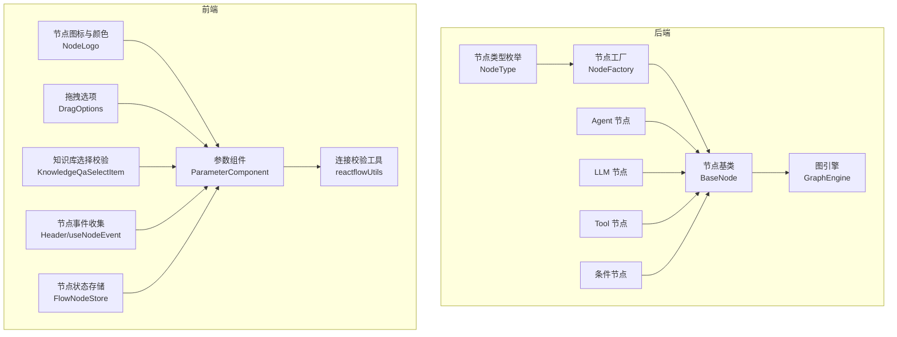
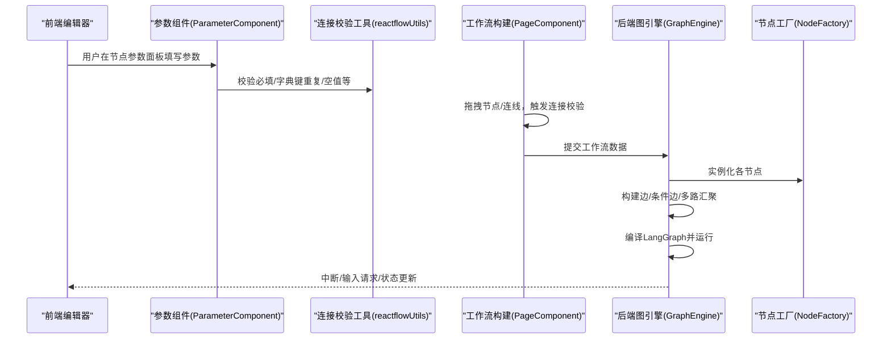
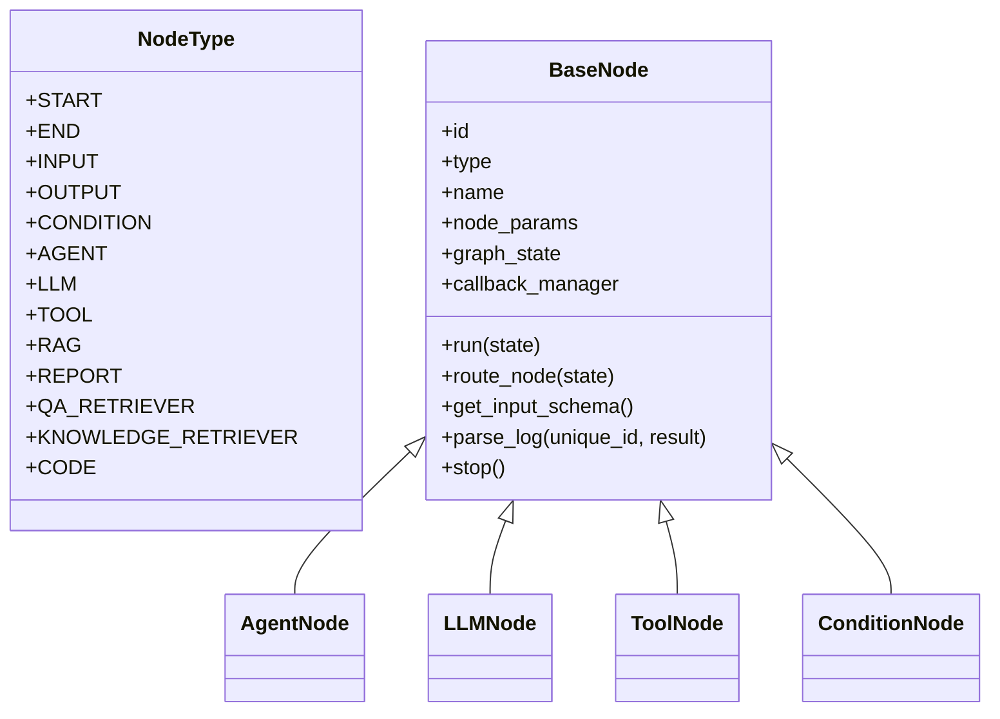
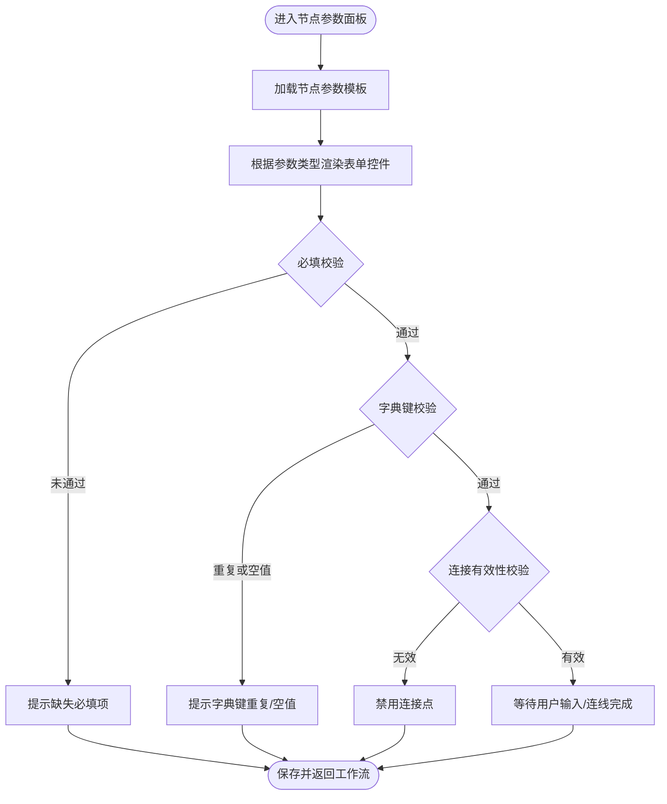
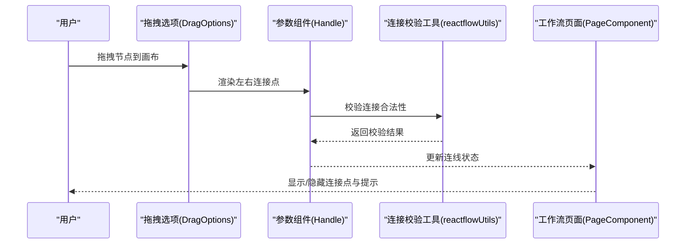
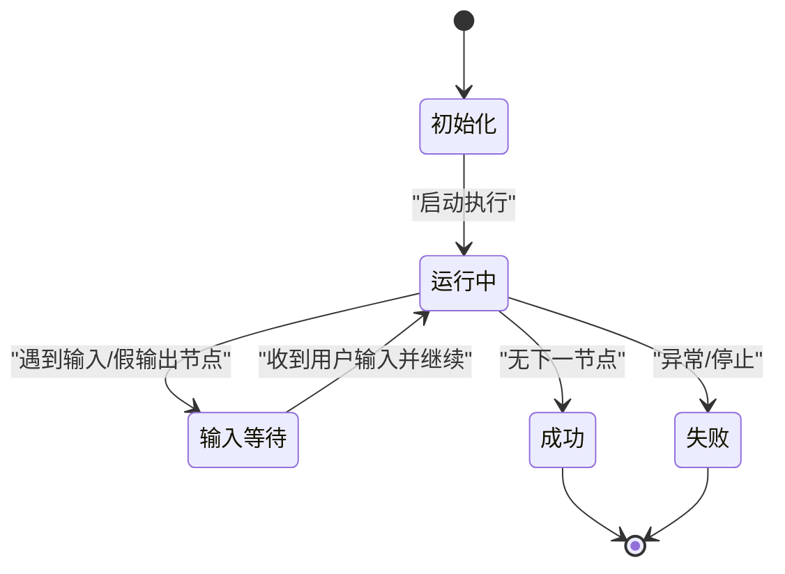
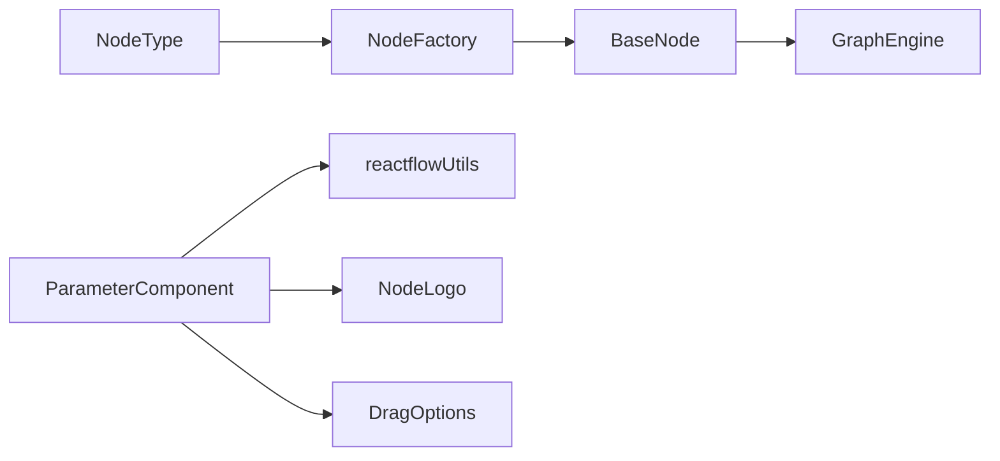

# 节点系统

<cite>
**本文引用的文件**
- [src/backend/bisheng/workflow/common/node.py](file://src/backend/bisheng/workflow/common/node.py)
- [src/backend/bisheng/workflow/nodes/base.py](file://src/backend/bisheng/workflow/nodes/base.py)
- [src/backend/bisheng/workflow/nodes/node_manage.py](file://src/backend/bisheng/workflow/nodes/node_manage.py)
- [src/backend/bisheng/workflow/graph/graph_engine.py](file://src/backend/bisheng/workflow/graph/graph_engine.py)
- [src/backend/bisheng/workflow/nodes/agent/agent.py](file://src/backend/bisheng/workflow/nodes/agent/agent.py)
- [src/backend/bisheng/workflow/nodes/llm/llm.py](file://src/backend/bisheng/workflow/nodes/llm/llm.py)
- [src/backend/bisheng/workflow/nodes/tool/tool.py](file://src/backend/bisheng/workflow/nodes/tool/tool.py)
- [src/backend/bisheng/workflow/nodes/condition/condition.py](file://src/backend/bisheng/workflow/nodes/condition/condition.py)
- [src/backend/bisheng/workflow/nodes/condition/conidition_case.py](file://src/backend/bisheng/workflow/nodes/condition/conidition_case.py)
- [src/frontend/platform/src/CustomNodes/GenericNode/components/parameterComponent/index.tsx](file://src/frontend/platform/src/CustomNodes/GenericNode/components/parameterComponent/index.tsx)
- [src/frontend/platform/src/pages/BuildPage/flow/FlowNode/NodeLogo.tsx](file://src/frontend/platform/src/pages/BuildPage/flow/FlowNode/NodeLogo.tsx)
- [src/frontend/platform/src/util/reactflowUtils.ts](file://src/frontend/platform/src/util/reactflowUtils.ts)
- [src/frontend/platform/src/pages/BuildPage/skills/editSkill/PageComponent/index.tsx](file://src/frontend/platform/src/pages/BuildPage/skills/editSkill/PageComponent/index.tsx)
- [src/frontend/platform/src/pages/BuildPage/flow/FlowNode/parameterComponent/DragOptions.tsx](file://src/frontend/platform/src/pages/BuildPage/flow/FlowNode/parameterComponent/DragOptions.tsx)
- [src/frontend/platform/src/pages/BuildPage/flow/FlowNode/parameterComponent/KnowledgeQaSelectItem.tsx](file://src/frontend/platform/src/pages/BuildPage/flow/FlowNode/parameterComponent/KnowledgeQaSelectItem.tsx)
- [src/frontend/platform/src/pages/BuildPage/flow/Header.tsx](file://src/frontend/platform/src/pages/BuildPage/flow/Header.tsx)
- [src/frontend/platform/src/pages/BuildPage/flow/FlowNode/FlowNodeStore.ts](file://src/frontend/platform/src/pages/BuildPage/flow/FlowNode/FlowNodeStore.ts)
- [src/frontend/platform/src/components/chatComponent/buildTrigger/index.tsx](file://src/frontend/platform/src/components/chatComponent/buildTrigger/index.tsx)
- [src/frontend/platform/src/pages/BuildPage/flow/FlowNode/ParameterSubGroup.tsx](file://src/frontend/platform/src/pages/BuildPage/flow/FlowNode/ParameterSubGroup.tsx)
- [src/frontend/platform/src/util/flowCompatible.ts](file://src/frontend/platform/src/util/flowCompatible.ts)
</cite>

## 目录
1. [简介](#简介)
2. [项目结构](#项目结构)
3. [核心组件](#核心组件)
4. [架构总览](#架构总览)
5. [详细组件分析](#详细组件分析)
6. [依赖关系分析](#依赖关系分析)
7. [性能考量](#性能考量)
8. [故障排查指南](#故障排查指南)
9. [结论](#结论)
10. [附录](#附录)

## 简介
本技术文档围绕工作流节点系统进行深入解析，覆盖节点类型定义与分类、节点属性配置体系、节点拖拽与连接机制、节点状态与生命周期管理，以及面向用户的节点自定义开发指南。目标是帮助开发者快速理解并扩展节点能力，同时为非技术用户提供可操作的使用指导。

## 项目结构
节点系统由后端工作流引擎与前端可视化编辑器协同构成：
- 后端负责节点类型定义、节点工厂、图编排与执行、回调与状态管理。
- 前端负责节点参数表单渲染、拖拽与连线、连接有效性校验、用户输入中断与恢复。

**图表来源**
- [src/backend/bisheng/workflow/common/node.py](file://src/backend/bisheng/workflow/common/node.py#L8-L26)
- [src/backend/bisheng/workflow/nodes/node_manage.py](file://src/backend/bisheng/workflow/nodes/node_manage.py#L16-L30)
- [src/backend/bisheng/workflow/nodes/base.py](file://src/backend/bisheng/workflow/nodes/base.py#L20-L67)
- [src/backend/bisheng/workflow/graph/graph_engine.py](file://src/backend/bisheng/workflow/graph/graph_engine.py#L27-L71)
- [src/frontend/platform/src/CustomNodes/GenericNode/components/parameterComponent/index.tsx](file://src/frontend/platform/src/CustomNodes/GenericNode/components/parameterComponent/index.tsx#L1-L579)
- [src/frontend/platform/src/pages/BuildPage/flow/FlowNode/NodeLogo.tsx](file://src/frontend/platform/src/pages/BuildPage/flow/FlowNode/NodeLogo.tsx#L1-L45)
- [src/frontend/platform/src/util/reactflowUtils.ts](file://src/frontend/platform/src/util/reactflowUtils.ts#L249-L472)
- [src/frontend/platform/src/pages/BuildPage/flow/FlowNode/parameterComponent/DragOptions.tsx](file://src/frontend/platform/src/pages/BuildPage/flow/FlowNode/parameterComponent/DragOptions.tsx#L138-L151)

**章节来源**
- [src/backend/bisheng/workflow/common/node.py](file://src/backend/bisheng/workflow/common/node.py#L8-L26)
- [src/backend/bisheng/workflow/nodes/node_manage.py](file://src/backend/bisheng/workflow/nodes/node_manage.py#L16-L30)
- [src/backend/bisheng/workflow/nodes/base.py](file://src/backend/bisheng/workflow/nodes/base.py#L20-L67)
- [src/backend/bisheng/workflow/graph/graph_engine.py](file://src/backend/bisheng/workflow/graph/graph_engine.py#L27-L71)
- [src/frontend/platform/src/CustomNodes/GenericNode/components/parameterComponent/index.tsx](file://src/frontend/platform/src/CustomNodes/GenericNode/components/parameterComponent/index.tsx#L1-L579)
- [src/frontend/platform/src/util/reactflowUtils.ts](file://src/frontend/platform/src/util/reactflowUtils.ts#L249-L472)

## 核心组件
- 节点类型与数据模型
  - 节点类型枚举定义了所有支持的节点类型，如开始、结束、输入、输出、条件、Agent、LLM、Tool、RAG、报告、检索等。
  - 节点数据模型包含节点标识、类型、名称、描述、分组参数、标签配置、工具键、版本号等字段。
- 节点工厂与实例化
  - 通过节点类型映射到具体节点类，统一实例化入口，便于扩展新的节点类型。
- 图引擎与执行
  - 构建节点映射、边管理、条件边与多路汇聚处理、LangGraph 编译与运行、状态判断与中断恢复。
- 基类与通用能力
  - 提供参数初始化、变量解析、输入 schema、日志解析、停止控制、回调事件等通用能力。

**章节来源**
- [src/backend/bisheng/workflow/common/node.py](file://src/backend/bisheng/workflow/common/node.py#L8-L26)
- [src/backend/bisheng/workflow/common/node.py](file://src/backend/bisheng/workflow/common/node.py#L48-L73)
- [src/backend/bisheng/workflow/nodes/node_manage.py](file://src/backend/bisheng/workflow/nodes/node_manage.py#L16-L30)
- [src/backend/bisheng/workflow/graph/graph_engine.py](file://src/backend/bisheng/workflow/graph/graph_engine.py#L27-L71)
- [src/backend/bisheng/workflow/nodes/base.py](file://src/backend/bisheng/workflow/nodes/base.py#L20-L67)

## 架构总览
节点系统采用“后端执行引擎 + 前端可视化编辑器”的双层架构：
- 后端以节点工厂为核心，将节点类型映射到具体实现；图引擎负责根据工作流数据构建执行图，编译为 LangGraph 并驱动执行。
- 前端提供参数组件、图标与颜色、连接校验、拖拽与连线、节点事件收集与状态存储，支撑节点的可视化配置与交互。

**图表来源**
- [src/frontend/platform/src/CustomNodes/GenericNode/components/parameterComponent/index.tsx](file://src/frontend/platform/src/CustomNodes/GenericNode/components/parameterComponent/index.tsx#L1-L579)
- [src/frontend/platform/src/util/reactflowUtils.ts](file://src/frontend/platform/src/util/reactflowUtils.ts#L249-L472)
- [src/frontend/platform/src/pages/BuildPage/skills/editSkill/PageComponent/index.tsx](file://src/frontend/platform/src/pages/BuildPage/skills/editSkill/PageComponent/index.tsx#L148-L165)
- [src/backend/bisheng/workflow/graph/graph_engine.py](file://src/backend/bisheng/workflow/graph/graph_engine.py#L27-L71)
- [src/backend/bisheng/workflow/nodes/node_manage.py](file://src/backend/bisheng/workflow/nodes/node_manage.py#L33-L44)

## 详细组件分析

### 节点类型与分类
- 节点类型枚举涵盖：开始、结束、输入、输出、条件、Agent、LLM、Tool、RAG、报告、QA 检索、知识检索、代码等。
- 对应节点类均继承自 BaseNode，具备统一的生命周期与回调接口。

**图表来源**
- [src/backend/bisheng/workflow/common/node.py](file://src/backend/bisheng/workflow/common/node.py#L8-L26)
- [src/backend/bisheng/workflow/nodes/base.py](file://src/backend/bisheng/workflow/nodes/base.py#L20-L67)
- [src/backend/bisheng/workflow/nodes/agent/agent.py](file://src/backend/bisheng/workflow/nodes/agent/agent.py#L50-L139)
- [src/backend/bisheng/workflow/nodes/llm/llm.py](file://src/backend/bisheng/workflow/nodes/llm/llm.py#L14-L66)
- [src/backend/bisheng/workflow/nodes/tool/tool.py](file://src/backend/bisheng/workflow/nodes/tool/tool.py#L10-L50)
- [src/backend/bisheng/workflow/nodes/condition/condition.py](file://src/backend/bisheng/workflow/nodes/condition/condition.py#L8-L45)

**章节来源**
- [src/backend/bisheng/workflow/common/node.py](file://src/backend/bisheng/workflow/common/node.py#L8-L26)
- [src/backend/bisheng/workflow/nodes/base.py](file://src/backend/bisheng/workflow/nodes/base.py#L20-L67)

### 节点属性配置系统
- 参数模型
  - NodeParams 定义参数键、标签、值、类型、帮助文本、占位符、是否必填、选项等。
  - NodeGroupParams 定义参数分组与描述。
  - BaseNodeData 包含节点基本信息、分组参数、标签配置、工具键、版本号，并提供按变量键查询参数信息的能力。
- 动态表单生成
  - 前端参数组件根据参数类型渲染对应输入控件（字符串、布尔、整型、浮点、提示词、代码、文件、下拉、字典、嵌套字典、变量、模型选择、知识库选择等）。
  - 连接点 Handle 的显示与有效性由参数组件内部逻辑控制，结合连接校验工具进行约束。
- 验证规则
  - 必填字段校验、字典键重复与空值校验、知识库存在性校验、变量可用性校验、连接有效性校验等。

**图表来源**
- [src/backend/bisheng/workflow/common/node.py](file://src/backend/bisheng/workflow/common/node.py#L28-L73)
- [src/frontend/platform/src/CustomNodes/GenericNode/components/parameterComponent/index.tsx](file://src/frontend/platform/src/CustomNodes/GenericNode/components/parameterComponent/index.tsx#L1-L579)
- [src/frontend/platform/src/util/reactflowUtils.ts](file://src/frontend/platform/src/util/reactflowUtils.ts#L249-L472)
- [src/frontend/platform/src/pages/BuildPage/flow/FlowNode/parameterComponent/KnowledgeQaSelectItem.tsx](file://src/frontend/platform/src/pages/BuildPage/flow/FlowNode/parameterComponent/KnowledgeQaSelectItem.tsx#L61-L89)

**章节来源**
- [src/backend/bisheng/workflow/common/node.py](file://src/backend/bisheng/workflow/common/node.py#L28-L73)
- [src/frontend/platform/src/CustomNodes/GenericNode/components/parameterComponent/index.tsx](file://src/frontend/platform/src/CustomNodes/GenericNode/components/parameterComponent/index.tsx#L1-L579)
- [src/frontend/platform/src/util/reactflowUtils.ts](file://src/frontend/platform/src/util/reactflowUtils.ts#L249-L472)

### 节点拖拽与连接机制
- 连接点定义
  - 参数组件在左侧/右侧渲染 Handle，支持目标/源类型、位置、样式、颜色与有效性校验。
- 连接线验证
  - 通过 isValidConnection 与连接校验工具对连线进行合法性检查，避免循环、非法类型或重复连接。
- 断开与重连
  - 前端提供清理无效连线的工具函数，支持在节点参数变化后自动清理并重建连接。
- 拖拽选项
  - 拖拽区域与排序支持，配合连接校验确保拓扑正确性。

**图表来源**
- [src/frontend/platform/src/pages/BuildPage/flow/FlowNode/parameterComponent/DragOptions.tsx](file://src/frontend/platform/src/pages/BuildPage/flow/FlowNode/parameterComponent/DragOptions.tsx#L138-L151)
- [src/frontend/platform/src/CustomNodes/GenericNode/components/parameterComponent/index.tsx](file://src/frontend/platform/src/CustomNodes/GenericNode/components/parameterComponent/index.tsx#L308-L332)
- [src/frontend/platform/src/util/reactflowUtils.ts](file://src/frontend/platform/src/util/reactflowUtils.ts#L249-L472)
- [src/frontend/platform/src/pages/BuildPage/skills/editSkill/PageComponent/index.tsx](file://src/frontend/platform/src/pages/BuildPage/skills/editSkill/PageComponent/index.tsx#L148-L165)

**章节来源**
- [src/frontend/platform/src/CustomNodes/GenericNode/components/parameterComponent/index.tsx](file://src/frontend/platform/src/CustomNodes/GenericNode/components/parameterComponent/index.tsx#L308-L332)
- [src/frontend/platform/src/util/reactflowUtils.ts](file://src/frontend/platform/src/util/reactflowUtils.ts#L249-L472)
- [src/frontend/platform/src/pages/BuildPage/skills/editSkill/PageComponent/index.tsx](file://src/frontend/platform/src/pages/BuildPage/skills/editSkill/PageComponent/index.tsx#L148-L165)

### 节点状态管理与生命周期
- 生命周期
  - 初始化：参数解析、变量映射、回调注册。
  - 执行：回调开始、实际运行、日志记录、变量写入全局状态、回调结束。
  - 停止：设置停止标志，抛出忽略异常，终止后续执行。
- 状态与中断
  - 图引擎在运行过程中检测下一节点类型，若为输入或假输出节点，则进入等待用户输入状态，并通过回调通知前端。
  - 前端接收输入后，调用继续执行接口恢复图执行。
- 状态持久化
  - 前端使用状态存储模块维护节点事件与表单状态，保障构建与运行过程中的状态一致性。

**图表来源**
- [src/backend/bisheng/workflow/nodes/base.py](file://src/backend/bisheng/workflow/nodes/base.py#L189-L230)
- [src/backend/bisheng/workflow/graph/graph_engine.py](file://src/backend/bisheng/workflow/graph/graph_engine.py#L358-L384)
- [src/frontend/platform/src/pages/BuildPage/flow/Header.tsx](file://src/frontend/platform/src/pages/BuildPage/flow/Header.tsx#L472-L505)
- [src/frontend/platform/src/pages/BuildPage/flow/FlowNode/FlowNodeStore.ts](file://src/frontend/platform/src/pages/BuildPage/flow/FlowNode/FlowNodeStore.ts#L1-L32)

**章节来源**
- [src/backend/bisheng/workflow/nodes/base.py](file://src/backend/bisheng/workflow/nodes/base.py#L189-L230)
- [src/backend/bisheng/workflow/graph/graph_engine.py](file://src/backend/bisheng/workflow/graph/graph_engine.py#L358-L384)
- [src/frontend/platform/src/pages/BuildPage/flow/Header.tsx](file://src/frontend/platform/src/pages/BuildPage/flow/Header.tsx#L472-L505)

### 节点自定义开发指南
- 新增节点类型
  - 在节点类型枚举中添加新类型，在节点工厂映射中注册对应类。
  - 实现节点类，继承 BaseNode，至少实现运行逻辑与可选的日志解析、输入 schema、路由逻辑。
- 参数组件开发
  - 在参数组件中新增对应参数类型的渲染与校验逻辑，确保与后端参数模型一致。
  - 如需特殊校验（如知识库存在性），在参数组件内集成校验逻辑并在前端提示。
- 验证器实现
  - 基于现有工具函数扩展校验规则，如字典键去重、空值检查、连接有效性等。
- 事件处理
  - 通过前端事件收集机制注册节点级校验与状态变更事件，保证构建流程可控。
- 兼容性与版本
  - 旧版节点数据兼容处理，确保升级后仍能正常工作。

**章节来源**
- [src/backend/bisheng/workflow/common/node.py](file://src/backend/bisheng/workflow/common/node.py#L8-L26)
- [src/backend/bisheng/workflow/nodes/node_manage.py](file://src/backend/bisheng/workflow/nodes/node_manage.py#L16-L30)
- [src/frontend/platform/src/CustomNodes/GenericNode/components/parameterComponent/index.tsx](file://src/frontend/platform/src/CustomNodes/GenericNode/components/parameterComponent/index.tsx#L1-L579)
- [src/frontend/platform/src/util/reactflowUtils.ts](file://src/frontend/platform/src/util/reactflowUtils.ts#L249-L472)
- [src/frontend/platform/src/pages/BuildPage/flow/Header.tsx](file://src/frontend/platform/src/pages/BuildPage/flow/Header.tsx#L472-L505)
- [src/frontend/platform/src/util/flowCompatible.ts](file://src/frontend/platform/src/util/flowCompatible.ts#L337-L394)

## 依赖关系分析
- 节点类型与工厂
  - 节点类型枚举与工厂映射共同决定节点实例化路径，耦合度低，扩展性强。
- 图引擎与节点
  - 图引擎通过工厂创建节点实例，管理边与条件边，编译 LangGraph 并驱动执行。
- 前端参数组件与校验
  - 参数组件依赖连接校验工具与节点图标/颜色，形成完整的可视化配置体验。

**图表来源**
- [src/backend/bisheng/workflow/common/node.py](file://src/backend/bisheng/workflow/common/node.py#L8-L26)
- [src/backend/bisheng/workflow/nodes/node_manage.py](file://src/backend/bisheng/workflow/nodes/node_manage.py#L16-L30)
- [src/backend/bisheng/workflow/nodes/base.py](file://src/backend/bisheng/workflow/nodes/base.py#L20-L67)
- [src/backend/bisheng/workflow/graph/graph_engine.py](file://src/backend/bisheng/workflow/graph/graph_engine.py#L27-L71)
- [src/frontend/platform/src/CustomNodes/GenericNode/components/parameterComponent/index.tsx](file://src/frontend/platform/src/CustomNodes/GenericNode/components/parameterComponent/index.tsx#L1-L579)
- [src/frontend/platform/src/util/reactflowUtils.ts](file://src/frontend/platform/src/util/reactflowUtils.ts#L249-L472)
- [src/frontend/platform/src/pages/BuildPage/flow/FlowNode/NodeLogo.tsx](file://src/frontend/platform/src/pages/BuildPage/flow/FlowNode/NodeLogo.tsx#L1-L45)
- [src/frontend/platform/src/pages/BuildPage/flow/FlowNode/parameterComponent/DragOptions.tsx](file://src/frontend/platform/src/pages/BuildPage/flow/FlowNode/parameterComponent/DragOptions.tsx#L138-L151)

**章节来源**
- [src/backend/bisheng/workflow/common/node.py](file://src/backend/bisheng/workflow/common/node.py#L8-L26)
- [src/backend/bisheng/workflow/nodes/node_manage.py](file://src/backend/bisheng/workflow/nodes/node_manage.py#L16-L30)
- [src/backend/bisheng/workflow/graph/graph_engine.py](file://src/backend/bisheng/workflow/graph/graph_engine.py#L27-L71)
- [src/frontend/platform/src/CustomNodes/GenericNode/components/parameterComponent/index.tsx](file://src/frontend/platform/src/CustomNodes/GenericNode/components/parameterComponent/index.tsx#L1-L579)

## 性能考量
- 执行深度与递归限制
  - 图引擎根据节点数量与最大步数计算递归上限，避免过深执行导致栈溢出。
- 多路汇聚与等待策略
  - 对多输入节点进行层级与分支分析，合理安排等待与并发，减少不必要的阻塞。
- 回调与日志
  - 通过回调与日志解析分离执行与观测，降低执行路径上的开销。
- 前端渲染优化
  - 参数组件按需渲染、连接点状态缓存、事件收集去抖，提升大图编辑体验。

**章节来源**
- [src/backend/bisheng/workflow/graph/graph_engine.py](file://src/backend/bisheng/workflow/graph/graph_engine.py#L277-L282)
- [src/backend/bisheng/workflow/graph/graph_engine.py](file://src/backend/bisheng/workflow/graph/graph_engine.py#L132-L177)
- [src/backend/bisheng/workflow/nodes/base.py](file://src/backend/bisheng/workflow/nodes/base.py#L90-L106)
- [src/frontend/platform/src/CustomNodes/GenericNode/components/parameterComponent/index.tsx](file://src/frontend/platform/src/CustomNodes/GenericNode/components/parameterComponent/index.tsx#L1-L579)

## 故障排查指南
- 常见问题
  - 节点缺少边：构建阶段会报错，需确保每个节点至少有一条边。
  - 输入节点未配置 schema：导致无法触发用户输入中断，需完善输入 schema。
  - 连接无效：参数类型不匹配或重复连接，前端会禁用连接点并提示。
  - 知识库不存在：参数组件校验失败，需确认知识库 ID 是否有效。
- 排查步骤
  - 检查节点参数是否满足必填与格式要求。
  - 使用连接校验工具定位无效连线。
  - 查看图引擎状态与回调事件，确认是否处于输入等待状态。
  - 前端构建状态与节点事件收集模块可用于定位构建失败原因。

**章节来源**
- [src/backend/bisheng/workflow/graph/graph_engine.py](file://src/backend/bisheng/workflow/graph/graph_engine.py#L84-L86)
- [src/backend/bisheng/workflow/graph/graph_engine.py](file://src/backend/bisheng/workflow/graph/graph_engine.py#L370-L383)
- [src/frontend/platform/src/util/reactflowUtils.ts](file://src/frontend/platform/src/util/reactflowUtils.ts#L249-L472)
- [src/frontend/platform/src/pages/BuildPage/flow/FlowNode/parameterComponent/KnowledgeQaSelectItem.tsx](file://src/frontend/platform/src/pages/BuildPage/flow/FlowNode/parameterComponent/KnowledgeQaSelectItem.tsx#L61-L89)
- [src/frontend/platform/src/pages/BuildPage/flow/Header.tsx](file://src/frontend/platform/src/pages/BuildPage/flow/Header.tsx#L472-L505)

## 结论
节点系统通过清晰的类型定义、工厂化实例化、图编排与执行、以及完善的前端可视化配置，实现了从设计到运行的全链路闭环。其模块化与可扩展性为后续新增节点类型与功能提供了良好基础。建议在扩展新节点时遵循统一的生命周期与回调规范，并配套完善前端参数组件与校验逻辑，确保用户体验与系统稳定性。

## 附录
- 节点图标与颜色
  - 不同节点类型对应不同的图标与颜色，便于在画布中快速识别节点用途。
- 版本兼容
  - 提供节点版本兼容函数，确保旧版节点数据在升级后仍可正常使用。

**章节来源**
- [src/frontend/platform/src/pages/BuildPage/flow/FlowNode/NodeLogo.tsx](file://src/frontend/platform/src/pages/BuildPage/flow/FlowNode/NodeLogo.tsx#L1-L45)
- [src/frontend/platform/src/util/flowCompatible.ts](file://src/frontend/platform/src/util/flowCompatible.ts#L337-L394)