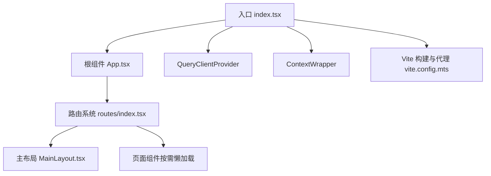
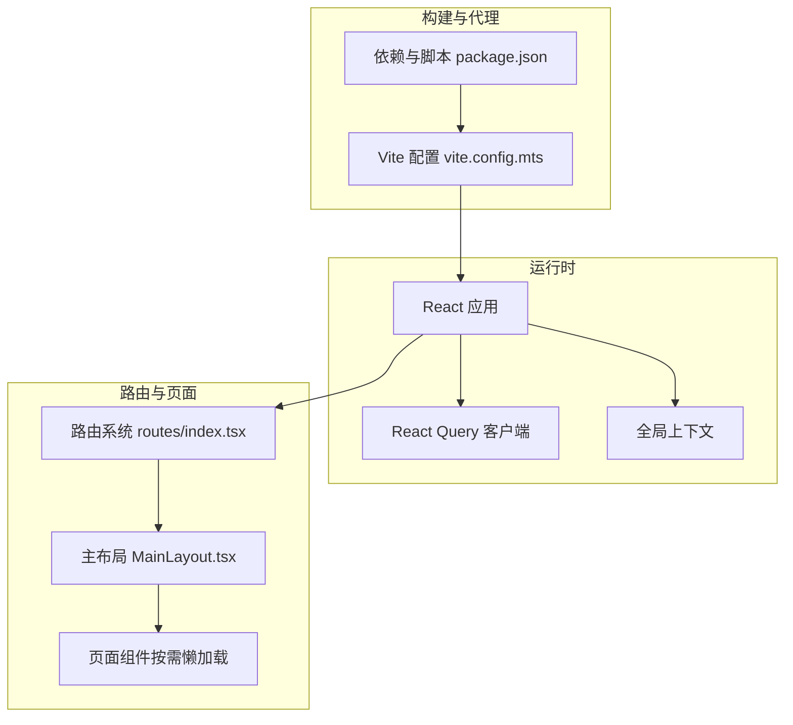
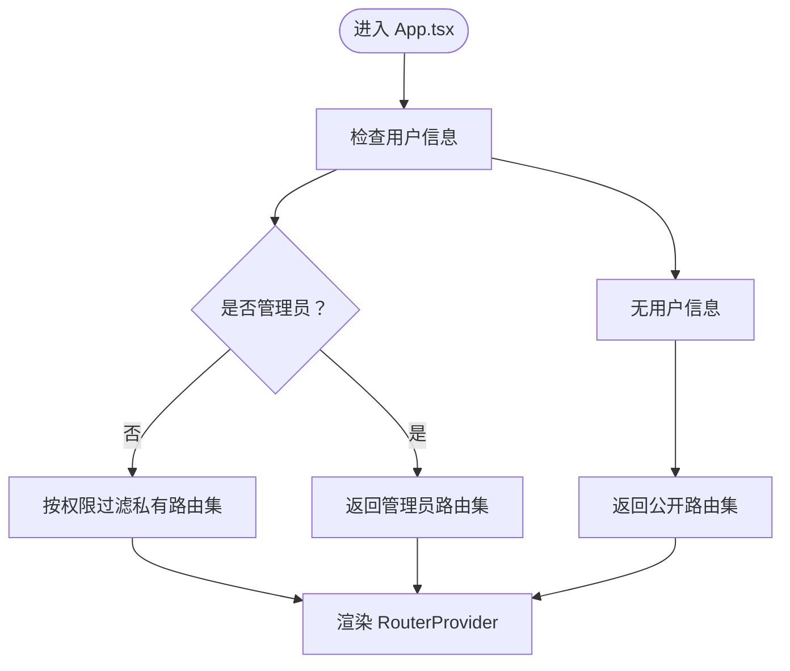
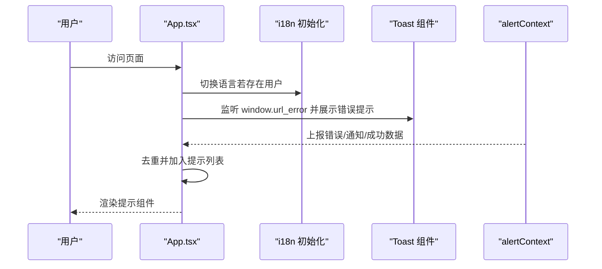
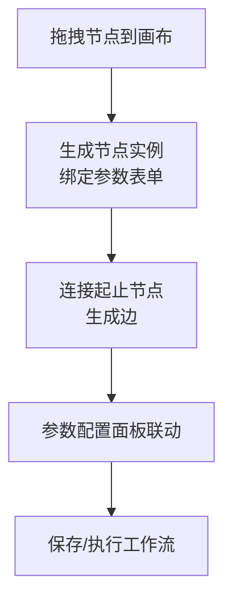
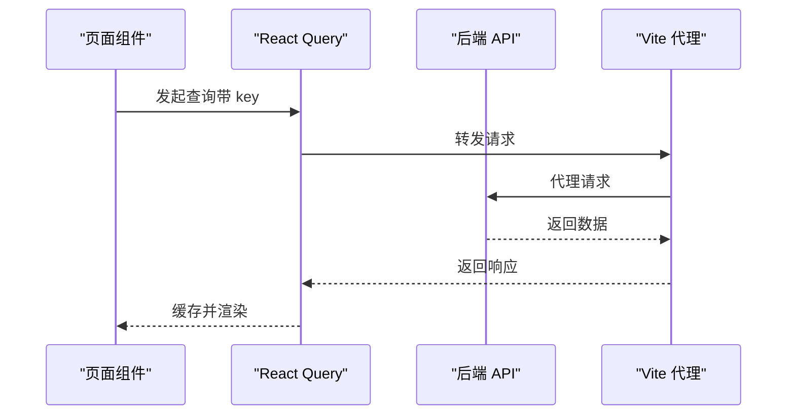
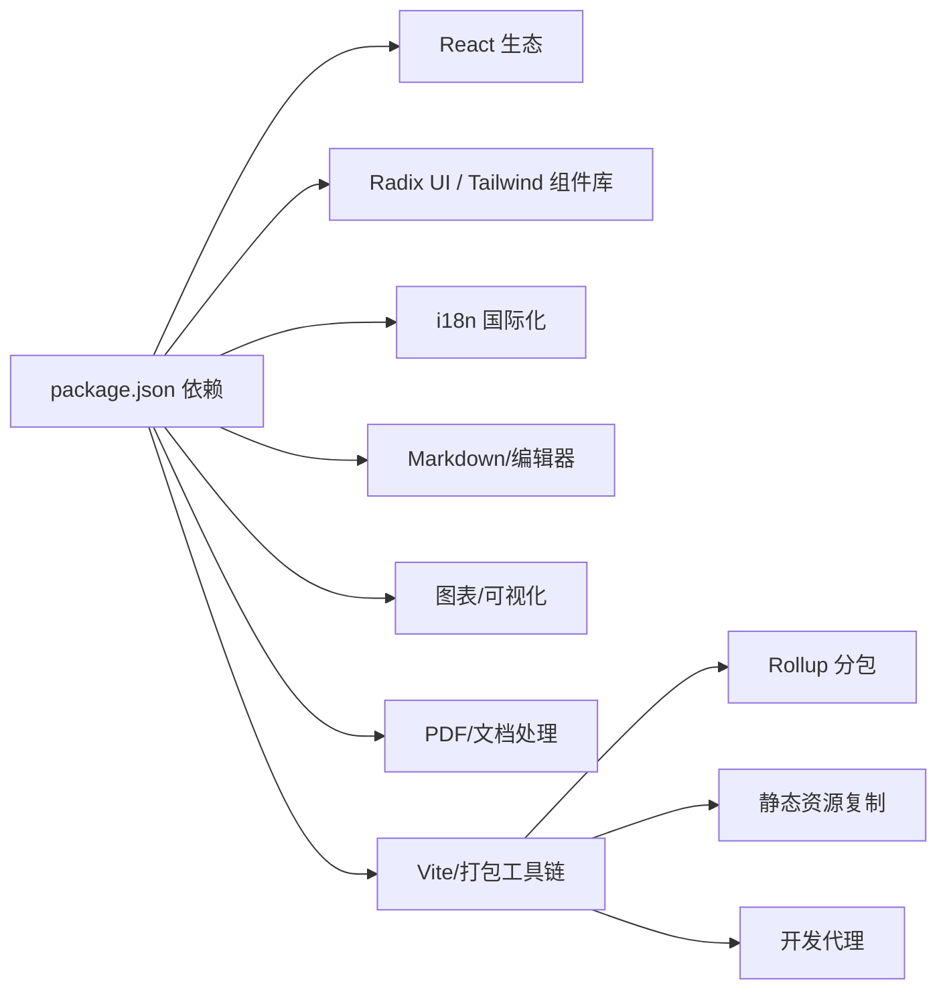

# 平台前端应用

<cite>
**本文引用的文件**
- [README.md](file://README.md)
- [package.json](file://src/frontend/platform/package.json)
- [vite.config.mts](file://src/frontend/platform/vite.config.mts)
- [App.tsx](file://src/frontend/platform/src/App.tsx)
- [index.tsx](file://src/frontend/platform/src/index.tsx)
- [routes/index.tsx](file://src/frontend/platform/src/routes/index.tsx)
- [MainLayout.tsx](file://src/frontend/platform/src/layout/MainLayout.tsx)
</cite>

## 目录
1. [简介](#简介)
2. [项目结构](#项目结构)
3. [核心组件](#核心组件)
4. [架构总览](#架构总览)
5. [详细组件分析](#详细组件分析)
6. [依赖关系分析](#依赖关系分析)
7. [性能考量](#性能考量)
8. [故障排查指南](#故障排查指南)
9. [结论](#结论)
10. [附录](#附录)

## 简介
本文件为 Bisheng 平台前端应用的全面技术文档，聚焦于面向管理员与开发者的工作台界面，基于 React + TypeScript + Tailwind CSS 技术栈构建。文档涵盖以下重点内容：
- 设计目标与用户群体：以企业级应用场景为核心，支持复杂工作流编排、知识库管理、模型微调与评估、系统与日志管理等。
- 路由系统与权限控制：动态路由按角色过滤菜单与页面权限，支持管理员与普通用户的差异化访问。
- 数据流与状态管理：结合 React Query 实现请求缓存与失效策略；全局上下文与 Toast 组件提供统一的状态与提示能力。
- 可视化工作流编辑器：基于 XYFlow 的节点拖拽、连线绘制与参数配置交互（详见“详细组件分析”）。
- 后端集成与实时数据：通过 Vite 代理转发 API 请求，支持 WebSocket 与文件服务；提供批量操作与增量更新的实践建议。
- 组件开发指南：自定义节点开发、插件系统扩展、主题与样式定制等高级能力。

## 项目结构
前端采用 Vite + React + TypeScript 构建，使用 Tailwind CSS 进行样式组织，并通过路由系统划分功能模块。核心目录与职责如下：
- src/frontend/platform/src：应用源代码
  - App.tsx：根组件，负责路由选择、国际化初始化、全局提示与用户上下文
  - index.tsx：入口文件，挂载 QueryClientProvider 与 ContextWrapper
  - routes/index.tsx：路由定义与权限过滤
  - layout/MainLayout.tsx：主布局容器
- 静态资源与构建
  - vite.config.mts：开发服务器、代理、分包与静态资源复制
  - package.json：依赖与脚本配置
- 文档与说明
  - README.md：平台特性与快速开始说明

图表来源
- [index.tsx](file://src/frontend/platform/src/index.tsx#L1-L36)
- [App.tsx](file://src/frontend/platform/src/App.tsx#L1-L246)
- [routes/index.tsx](file://src/frontend/platform/src/routes/index.tsx#L1-L187)
- [MainLayout.tsx](file://src/frontend/platform/src/layout/MainLayout.tsx)
- [vite.config.mts](file://src/frontend/platform/vite.config.mts#L1-L147)

章节来源
- [README.md](file://README.md#L31-L58)
- [package.json](file://src/frontend/platform/package.json#L1-L126)
- [vite.config.mts](file://src/frontend/platform/vite.config.mts#L1-L147)
- [App.tsx](file://src/frontend/platform/src/App.tsx#L1-L246)
- [index.tsx](file://src/frontend/platform/src/index.tsx#L1-L36)
- [routes/index.tsx](file://src/frontend/platform/src/routes/index.tsx#L1-L187)
- [MainLayout.tsx](file://src/frontend/platform/src/layout/MainLayout.tsx)

## 核心组件
- 根组件与上下文
  - App.tsx：负责国际化语言切换、动态路由选择、全局错误/通知/成功提示展示、键盘快捷键登出、Suspense 加载占位等。
  - index.tsx：初始化 QueryClient（禁用窗口焦点与挂载自动重试），包裹 ContextWrapper 与 App。
- 路由与权限
  - routes/index.tsx：定义私有路由、公开路由、权限过滤函数与权限字段；根据用户角色返回不同路由集。
- 主布局
  - MainLayout.tsx：承载侧边栏、面包屑与内容区域，作为大多数受控页面的容器。
- 构建与代理
  - vite.config.mts：设置代理目标、重写规则、静态资源复制、分包策略与开发服务器端口。

章节来源
- [App.tsx](file://src/frontend/platform/src/App.tsx#L1-L246)
- [index.tsx](file://src/frontend/platform/src/index.tsx#L1-L36)
- [routes/index.tsx](file://src/frontend/platform/src/routes/index.tsx#L1-L187)
- [MainLayout.tsx](file://src/frontend/platform/src/layout/MainLayout.tsx)
- [vite.config.mts](file://src/frontend/platform/vite.config.mts#L1-L147)

## 架构总览
前端采用“入口 -> 根组件 -> 路由 -> 页面”的层次化结构，配合上下文与查询客户端实现状态与数据流管理。路由系统根据用户权限动态渲染菜单与页面，主布局统一承载页面内容。

图表来源
- [index.tsx](file://src/frontend/platform/src/index.tsx#L1-L36)
- [App.tsx](file://src/frontend/platform/src/App.tsx#L1-L246)
- [routes/index.tsx](file://src/frontend/platform/src/routes/index.tsx#L1-L187)
- [MainLayout.tsx](file://src/frontend/platform/src/layout/MainLayout.tsx)
- [vite.config.mts](file://src/frontend/platform/vite.config.mts#L1-L147)
- [package.json](file://src/frontend/platform/package.json#L1-L126)

## 详细组件分析

### 路由系统与权限控制
- 动态路由
  - 私有路由集合包含多个业务域（如知识库、工作台、模型管理、系统与日志、评估、报表等），每个路由可携带权限标识。
  - 权限过滤函数对嵌套子路由进行递归过滤，仅保留当前用户具备权限的路由。
- 角色路由
  - 管理员与普通用户分别返回不同的路由集合；未登录用户进入公开路由（登录页、分享页等）。
- 基础路径
  - 路由配置包含基础路径（basename），用于支持子路径部署场景。

图表来源
- [App.tsx](file://src/frontend/platform/src/App.tsx#L174-L178)
- [routes/index.tsx](file://src/frontend/platform/src/routes/index.tsx#L147-L174)

章节来源
- [routes/index.tsx](file://src/frontend/platform/src/routes/index.tsx#L63-L174)
- [App.tsx](file://src/frontend/platform/src/App.tsx#L174-L178)

### 国际化与全局提示
- 国际化初始化
  - 根据用户语言设置初始化 i18next；在用户存在时从本地存储读取语言并切换。
- 全局提示
  - 提供错误、通知、成功三类提示组件，支持列表去重与移除；同时集成 Toast 组件库，用于 URL 错误提示与统一风格。

图表来源
- [App.tsx](file://src/frontend/platform/src/App.tsx#L158-L187)
- [App.tsx](file://src/frontend/platform/src/App.tsx#L211-L242)

章节来源
- [App.tsx](file://src/frontend/platform/src/App.tsx#L158-L187)
- [App.tsx](file://src/frontend/platform/src/App.tsx#L211-L242)

### 工作流编辑器（概念性说明）
- 技术选型
  - 基于 XYFlow（@xyflow/react）实现节点拖拽、连线绘制与参数配置面板联动。
- 交互流程（概念示意）
  - 用户从工具箱拖拽节点到画布，系统生成节点实例并绑定参数表单；连线由起止节点的锚点生成，支持正交/曲线样式；参数变更即时反映到节点显示与执行配置。
- 扩展建议
  - 自定义节点：实现节点渲染与输入输出端口；参数表单：基于字段类型生成表单控件；插件系统：注册节点工厂与工具箱分类；主题定制：通过 Tailwind 类名或 CSS 变量覆盖默认样式。

（本图为概念性流程图，不对应具体源码文件）

### 数据流与状态管理
- 查询客户端
  - 使用 React Query 管理远端数据缓存与失效策略，默认关闭窗口焦点与挂载重试，降低不必要的网络开销。
- 全局上下文
  - 用户上下文、位置上下文、提示上下文等贯穿应用，确保跨组件状态共享与事件传播。
- 构建与代理
  - Vite 代理将 /api/ 与 /health 等路由转发至后端服务，文件服务路由转发至独立文件服务；支持 WebSocket 与凭证传递。

图表来源
- [index.tsx](file://src/frontend/platform/src/index.tsx#L19-L27)
- [vite.config.mts](file://src/frontend/platform/vite.config.mts#L14-L48)

章节来源
- [index.tsx](file://src/frontend/platform/src/index.tsx#L19-L27)
- [vite.config.mts](file://src/frontend/platform/vite.config.mts#L14-L48)

### 组件开发指南（自定义节点、插件与主题）
- 自定义节点开发
  - 在工作流编辑器中新增节点类型，定义渲染组件、输入输出端口与参数表单；在工具箱中注册节点分类与图标。
- 插件系统扩展
  - 将节点工厂与工具箱映射注入到编辑器上下文，实现按需加载与热插拔。
- 主题与样式定制
  - 使用 Tailwind CSS 类名覆盖默认样式；通过 CSS 变量与暗色模式适配，保证在深色/浅色主题下的一致体验。

（本节为通用开发指导，不直接分析具体源码文件）

## 依赖关系分析
- 依赖概览
  - 前端核心依赖包括 React 生态、路由与状态管理、UI 组件库、国际化、Markdown/编辑器、图表与可视化、PDF/文档处理、分包与打包工具等。
- 分包策略
  - Vite Rollup 输出按第三方依赖进行手动分块，分离 Ace、XYFlow、PDFJS、大组件集合等，优化首屏与缓存命中。
- 代理与静态资源
  - 通过 Vite 插件复制 Ace 与 PDF Worker 资源，确保编辑器与 PDF 预览正常加载。

图表来源
- [package.json](file://src/frontend/platform/package.json#L5-L74)
- [vite.config.mts](file://src/frontend/platform/vite.config.mts#L68-L92)
- [vite.config.mts](file://src/frontend/platform/vite.config.mts#L112-L129)

章节来源
- [package.json](file://src/frontend/platform/package.json#L1-L126)
- [vite.config.mts](file://src/frontend/platform/vite.config.mts#L68-L92)
- [vite.config.mts](file://src/frontend/platform/vite.config.mts#L112-L129)

## 性能考量
- 构建与分包
  - 使用 Rollup 手动分块策略，减少单块体积，提升缓存复用率；生产环境启用最小化与哈希命名。
- 请求缓存
  - React Query 默认关闭重试与窗口焦点重拉，避免重复请求；合理设计查询 key 与失效策略。
- 资源加载
  - 复制 Ace 与 PDF Worker 至构建目录，减少运行时异步加载带来的抖动。
- 代理与网络
  - 代理配置开启凭证与 WebSocket 支持，保障实时通信与鉴权一致性。

（本节为通用性能建议，不直接分析具体源码文件）

## 故障排查指南
- 登录与权限
  - 若出现 403/404 页面，请确认用户权限与路由权限字段是否匹配；检查用户角色与 web_menu 字段。
- 国际化问题
  - 若语言未生效，检查用户是否存在且本地存储的语言键值是否正确。
- 代理与接口
  - 若接口 404 或跨域失败，检查 Vite 代理目标与重写规则；确认 /api/ 与 /health 前缀是否匹配。
- 文件服务
  - 文件上传/下载异常时，检查 /bisheng 与 /tmp-dir 代理目标与权限。
- 提示与错误
  - 使用全局提示组件查看错误列表；必要时通过 window.url_error 触发展示。

章节来源
- [routes/index.tsx](file://src/frontend/platform/src/routes/index.tsx#L147-L174)
- [App.tsx](file://src/frontend/platform/src/App.tsx#L158-L187)
- [vite.config.mts](file://src/frontend/platform/vite.config.mts#L14-L48)

## 结论
本前端应用围绕企业级工作台场景，采用现代化技术栈与工程化手段，实现了灵活的路由与权限体系、稳定的数据流与状态管理、以及可扩展的组件开发框架。通过可视化工作流编辑器与丰富的业务页面，平台能够支撑从知识库管理到模型微调、从系统监控到报表生成的全链路需求。后续可在自定义节点、插件系统与主题体系方面持续增强，以满足更复杂的业务定制化诉求。

## 附录
- 快速开始与部署
  - 参考平台 README 中的安装与启动步骤，确保硬件与依赖满足要求。
- 版本与引擎
  - package.json 中声明 Node 版本要求与依赖版本范围，构建脚本与代理目标可在 Vite 配置中调整。

章节来源
- [README.md](file://README.md#L58-L86)
- [package.json](file://src/frontend/platform/package.json#L122-L124)
- [vite.config.mts](file://src/frontend/platform/vite.config.mts#L16-L18)