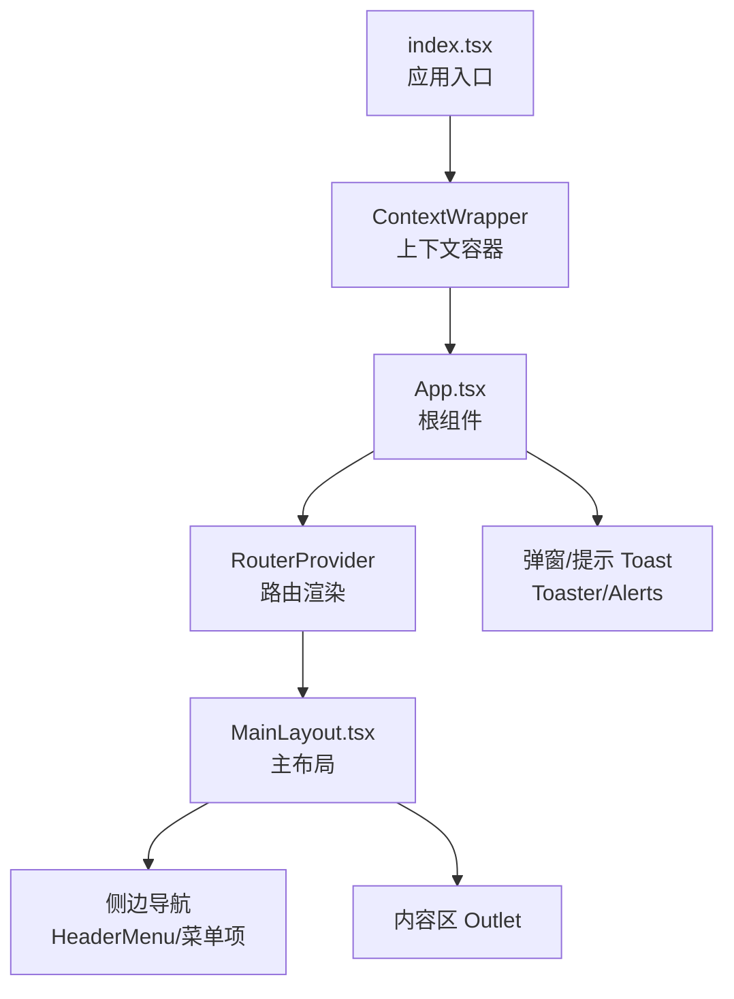
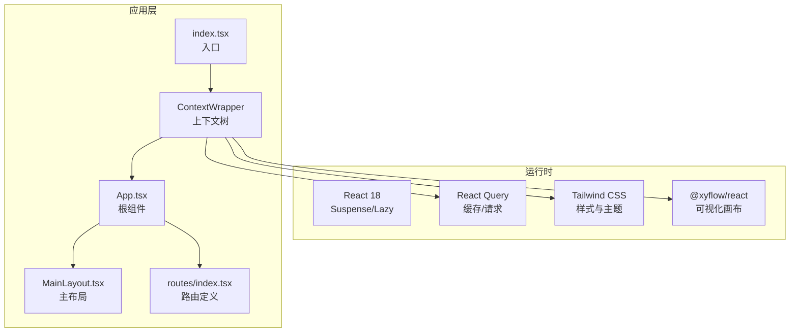
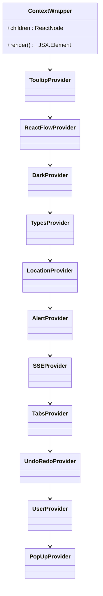
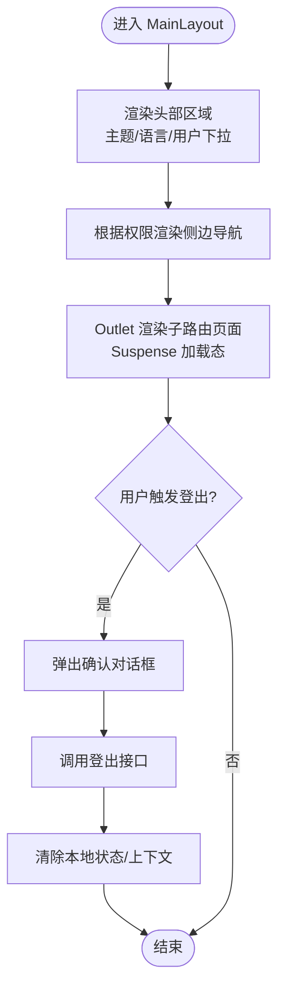
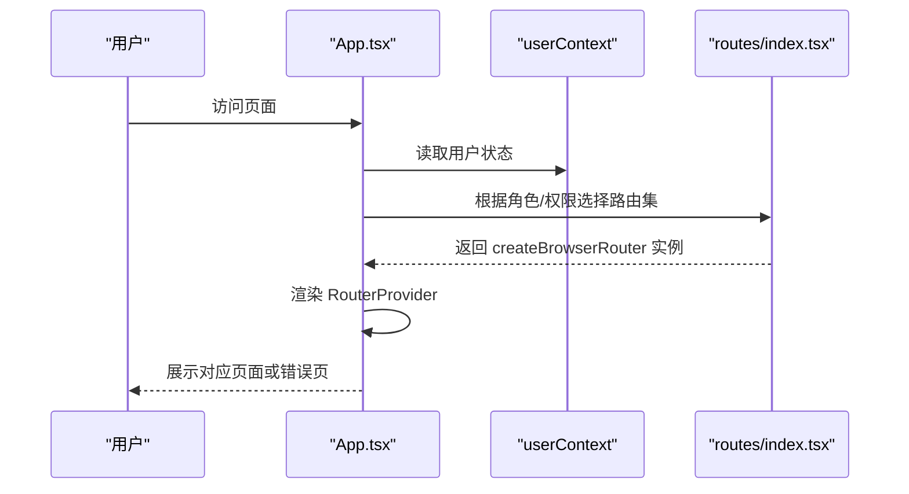
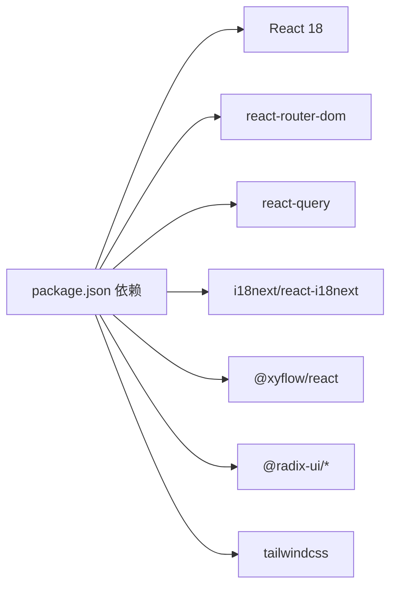

# 平台架构设计

<cite>
**本文引用的文件**
- [App.tsx](file://src/frontend/platform/src/App.tsx)
- [index.tsx](file://src/frontend/platform/src/index.tsx)
- [package.json](file://src/frontend/platform/package.json)
- [tsconfig.json](file://src/frontend/platform/tsconfig.json)
- [tailwind.config.js](file://src/frontend/platform/tailwind.config.js)
- [contexts/index.tsx](file://src/frontend/platform/src/contexts/index.tsx)
- [MainLayout.tsx](file://src/frontend/platform/src/layout/MainLayout.tsx)
- [routes/index.tsx](file://src/frontend/platform/src/routes/index.tsx)
</cite>

## 目录
1. [引言](#引言)
2. [项目结构](#项目结构)
3. [核心组件](#核心组件)
4. [架构总览](#架构总览)
5. [组件详解](#组件详解)
6. [依赖关系分析](#依赖关系分析)
7. [性能考量](#性能考量)
8. [故障排查指南](#故障排查指南)
9. [结论](#结论)
10. [附录](#附录)

## 引言
本技术文档面向 Bisheng 平台前端，系统性阐述基于 React + TypeScript + Tailwind CSS 的技术选型与实现细节，覆盖组件架构、状态管理、路由系统、主布局组件 MainLayout 的组织方式、上下文体系（用户、弹窗、标签页等）以及权限控制、动态路由加载与错误边界处理。文档同时提供最佳实践与性能优化建议，帮助开发者快速理解并高效迭代。

## 项目结构
前端采用 Vite + React 18 + TypeScript 构建，Tailwind CSS 提供样式基础，配合 Radix UI 组件库与自研 BS 组件库，形成统一的 UI 与交互规范。应用入口通过 ContextWrapper 注入多层上下文，再由 App 根据用户状态与权限动态选择路由集。

图表来源
- [index.tsx](file://src/frontend/platform/src/index.tsx#L1-L36)
- [contexts/index.tsx](file://src/frontend/platform/src/contexts/index.tsx#L1-L42)
- [App.tsx](file://src/frontend/platform/src/App.tsx#L1-L246)
- [MainLayout.tsx](file://src/frontend/platform/src/layout/MainLayout.tsx#L1-L278)

章节来源
- [index.tsx](file://src/frontend/platform/src/index.tsx#L1-L36)
- [package.json](file://src/frontend/platform/package.json#L1-L126)
- [tsconfig.json](file://src/frontend/platform/tsconfig.json#L1-L25)
- [tailwind.config.js](file://src/frontend/platform/tailwind.config.js#L1-L237)

## 核心组件
- 应用入口与上下文注入：在入口处以 React Query、TooltipProvider、ReactFlowProvider、DarkProvider、UserProvider 等多层 Provider 包裹应用，确保全局状态与 UI 能力可用。
- 根组件 App：负责国际化初始化、用户状态监听、动态路由选择、全局错误提示与 URL 错误提示的展示。
- 主布局 MainLayout：组织头部菜单、侧边导航、内容区，并提供主题切换、语言切换、用户下拉菜单与登出流程。
- 路由系统：按用户角色与权限过滤私有路由，支持公开路由与动态路由加载；统一错误边界处理。

章节来源
- [index.tsx](file://src/frontend/platform/src/index.tsx#L1-L36)
- [App.tsx](file://src/frontend/platform/src/App.tsx#L1-L246)
- [MainLayout.tsx](file://src/frontend/platform/src/layout/MainLayout.tsx#L1-L278)
- [routes/index.tsx](file://src/frontend/platform/src/routes/index.tsx#L1-L187)

## 架构总览
整体采用“入口注入上下文 -> 根组件决策 -> 布局组织 -> 路由驱动”的分层架构。UI 层以 Tailwind CSS 与 Radix UI 为基础，业务层通过上下文与路由协同完成权限控制与页面渲染。

图表来源
- [index.tsx](file://src/frontend/platform/src/index.tsx#L1-L36)
- [contexts/index.tsx](file://src/frontend/platform/src/contexts/index.tsx#L1-L42)
- [App.tsx](file://src/frontend/platform/src/App.tsx#L1-L246)
- [MainLayout.tsx](file://src/frontend/platform/src/layout/MainLayout.tsx#L1-L278)
- [routes/index.tsx](file://src/frontend/platform/src/routes/index.tsx#L1-L187)

## 组件详解

### 上下文系统设计
- 上下文容器 ContextWrapper：按固定顺序组合 TooltipProvider、ReactFlowProvider、DarkProvider、TypesProvider、LocationProvider、AlertProvider、SSEProvider、TabsProvider、UndoRedoProvider、UserProvider、PopUpProvider，保证 UI 能力与业务状态的有序注入。
- 用户上下文 userContext：存储当前登录用户信息，用于权限判断与头部用户信息展示。
- 弹窗上下文 alertContext：集中管理错误、通知、成功三类弹窗，支持去重、延迟展示与移除。
- 标签页上下文 tabsContext：用于工作流或编辑器场景下的标签页状态管理（如打开/关闭/切换）。
- 位置上下文 locationContext：维护当前路径、侧边栏显示状态、堆叠面板状态等，支撑主布局导航联动。
- 撤销/重做上下文 undoRedoContext：为复杂编辑场景提供操作历史管理。
- 类型上下文 typesContext：提供类型级配置与共享数据。
- SSE 上下文 SSEContext：用于服务端事件推送的订阅与清理。

图表来源
- [contexts/index.tsx](file://src/frontend/platform/src/contexts/index.tsx#L1-L42)

章节来源
- [contexts/index.tsx](file://src/frontend/platform/src/contexts/index.tsx#L1-L42)

### 主布局组件 MainLayout 实现原理
- 头部区域：包含 Logo、HeaderMenu（未在本文展开）、主题切换（明/暗）、语言切换（中/英/日）、用户下拉菜单（工作区跳转、修改密码、登出）。
- 侧边导航：根据用户 web_menu 与角色动态渲染菜单项（仪表盘、技能构建、知识库、数据集、模型、评估、标注、日志、系统），并提供 GitHub 文档链接与帮助入口。
- 内容区：通过 Outlet 渲染子路由页面，使用 Suspense 提供加载占位。
- 登出流程：使用确认对话框，调用后端登出接口，清除本地登录状态并重置用户上下文。
- 移动端提示：在小屏设备上提示最佳体验与外部链接。

图表来源
- [MainLayout.tsx](file://src/frontend/platform/src/layout/MainLayout.tsx#L1-L278)

章节来源
- [MainLayout.tsx](file://src/frontend/platform/src/layout/MainLayout.tsx#L1-L278)

### 路由系统设计
- 动态路由加载：大量页面组件通过 lazy 按需加载，结合 Suspense 提升首屏性能。
- 权限控制：getPrivateRouter 接收用户权限数组，递归过滤带 permission 的路由节点；管理员可直接获取完整路由。
- 路由集划分：getPrivateRouter 返回私有路由集合；getAdminRouter 返回管理员路由集合；publicRouter 面向未登录用户与公开分享页。
- 错误边界：每个路由节点可挂载 RouteErrorBoundary，统一捕获渲染异常并展示友好错误页。
- 基础路径：所有路由均设置 basename，适配部署前缀。

图表来源
- [App.tsx](file://src/frontend/platform/src/App.tsx#L174-L178)
- [routes/index.tsx](file://src/frontend/platform/src/routes/index.tsx#L147-L174)

章节来源
- [routes/index.tsx](file://src/frontend/platform/src/routes/index.tsx#L1-L187)
- [App.tsx](file://src/frontend/platform/src/App.tsx#L174-L178)

### 国际化与主题
- 国际化：基于 i18next 与 react-i18next，在 App 初始化语言、监听用户偏好并持久化；MainLayout 提供语言切换逻辑。
- 主题：通过 darkContext 切换明/暗主题，配合 Tailwind CSS 的 darkMode: ["class"] 与自定义颜色变量实现一致的主题风格。

章节来源
- [App.tsx](file://src/frontend/platform/src/App.tsx#L158-L167)
- [MainLayout.tsx](file://src/frontend/platform/src/layout/MainLayout.tsx#L34-L66)
- [tailwind.config.js](file://src/frontend/platform/tailwind.config.js#L8-L14)

## 依赖关系分析
- 运行时依赖：React 18、react-router-dom、react-query、i18next、@xyflow/react、Radix UI 系列组件等。
- 构建与工具：Vite、TypeScript、Tailwind CSS、SWC 插件、Prettier、PostCSS 等。
- 样式策略：Tailwind CSS 作为基础样式框架，结合自定义颜色变量与插件扩展，满足深色模式与多主题需求。

图表来源
- [package.json](file://src/frontend/platform/package.json#L1-L126)

章节来源
- [package.json](file://src/frontend/platform/package.json#L1-L126)
- [tsconfig.json](file://src/frontend/platform/tsconfig.json#L1-L25)
- [tailwind.config.js](file://src/frontend/platform/tailwind.config.js#L1-L237)

## 性能考量
- 路由懒加载：通过 lazy 与 Suspense 将大体积页面拆分为独立 chunk，减少首屏包体与白屏时间。
- 查询缓存：React Query 默认禁用窗口焦点与挂载重试，避免不必要的网络请求与重复渲染。
- 样式体积：Tailwind content 范围限定在 src 目录，结合 safelist 与按需引入，降低未使用样式的打包体积。
- 图标与第三方库：按需引入组件与图标，避免全量引入造成体积膨胀。
- 开发环境：TypeScript 关闭严格模式与隐式 any，提升开发效率；生产构建启用最小化与 Tree-shaking。

章节来源
- [routes/index.tsx](file://src/frontend/platform/src/routes/index.tsx#L13-L18)
- [index.tsx](file://src/frontend/platform/src/index.tsx#L19-L27)
- [tailwind.config.js](file://src/frontend/platform/tailwind.config.js#L9-L14)

## 故障排查指南
- 页面空白或长时间加载：检查 RouterProvider 是否正确传入 router；确认 getPrivateRouter/getAdminRouter 返回值是否为空且用户已登录。
- 权限相关 403/404：核对用户权限数组与路由 permission 字段；确认 getPrivateRouter 过滤逻辑生效。
- 国际化不生效：检查 i18n 初始化与用户语言偏好持久化；确认 changeLanguage 后刷新页面或触发重渲染。
- 主题切换无效：确认 darkContext 状态更新链路与 Tailwind darkMode 配置；检查自定义颜色变量是否正确。
- 弹窗/提示不显示：检查 alertContext 的状态更新与去重逻辑；确认 App 中 alertsList 的渲染与移除函数绑定。

章节来源
- [App.tsx](file://src/frontend/platform/src/App.tsx#L189-L244)
- [routes/index.tsx](file://src/frontend/platform/src/routes/index.tsx#L147-L174)
- [MainLayout.tsx](file://src/frontend/platform/src/layout/MainLayout.tsx#L41-L54)

## 结论
Bisheng 平台前端以 React + TypeScript + Tailwind CSS 为核心技术栈，结合多层上下文与路由权限控制，实现了高内聚、低耦合的前端架构。通过动态路由加载、统一错误边界与完善的国际化/主题体系，兼顾了可维护性与用户体验。建议在后续迭代中持续关注路由权限粒度、查询缓存策略与 Tailwind 样式治理，以进一步提升性能与可扩展性。

## 附录
- 构建与运行：使用 Vite 启动开发服务器，支持代理与热更新；生产构建输出静态资源，适配部署前缀。
- 代码规范：统一使用 Prettier 与 ESLint 规则，TypeScript 路径别名 @/* 指向 src，提升可读性与一致性。

章节来源
- [package.json](file://src/frontend/platform/package.json#L76-L82)
- [tsconfig.json](file://src/frontend/platform/tsconfig.json#L20-L22)