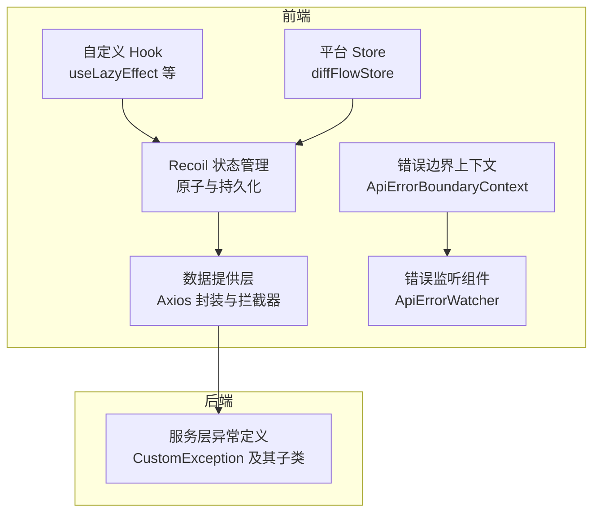
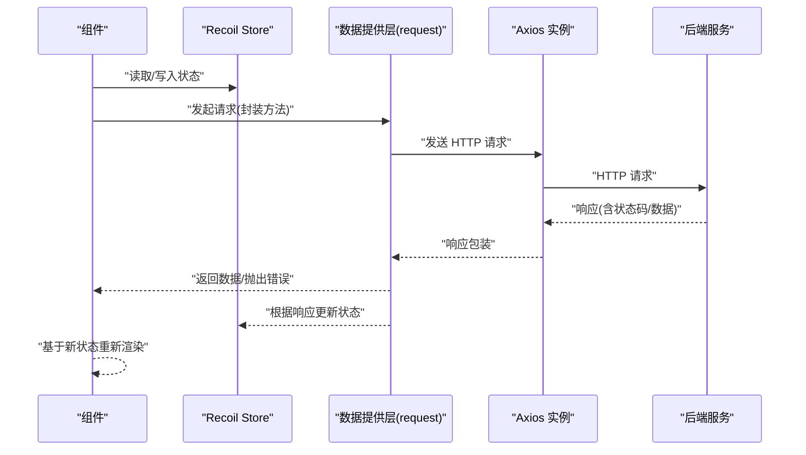
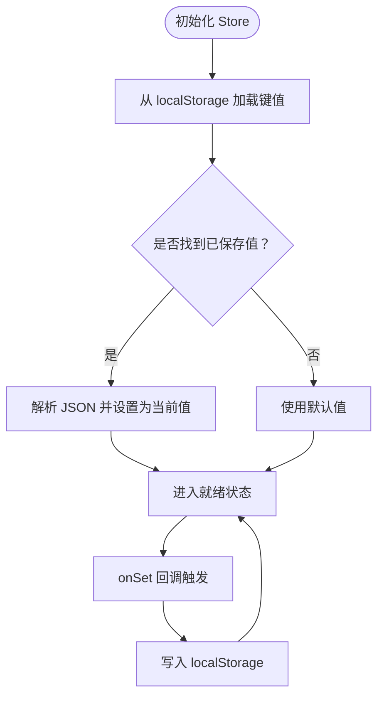
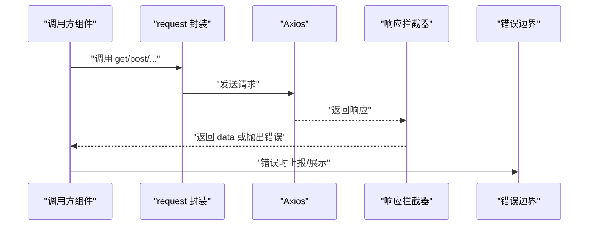
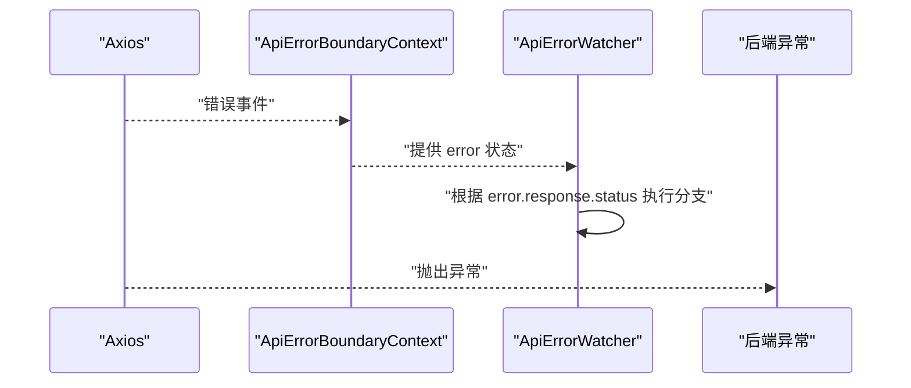
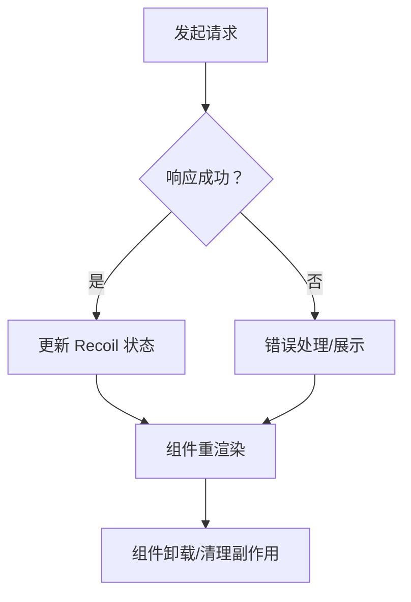
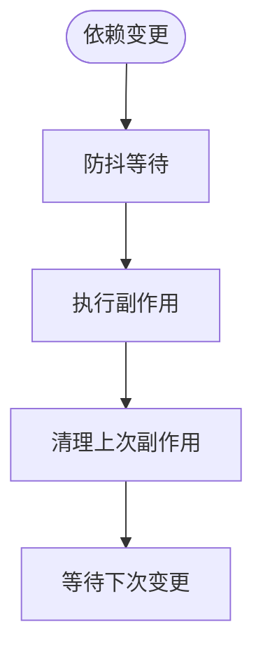
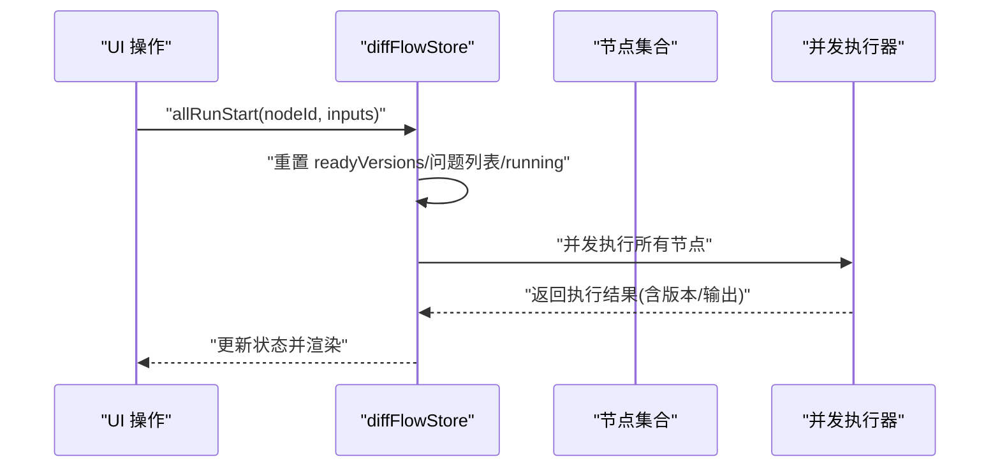
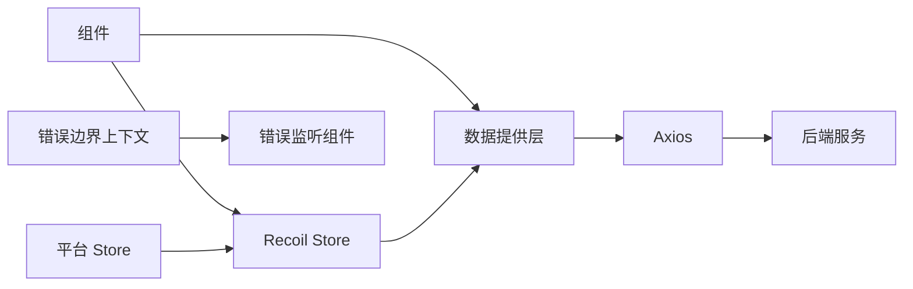

# 数据流管理

<cite>
**本文引用的文件**
- [src/frontend/client/src/store/index.ts](file://src/frontend/client/src/store/index.ts)
- [src/frontend/client/src/store/utils.ts](file://src/frontend/client/src/store/utils.ts)
- [src/frontend/client/src/data-provider/data-provider/src/request.ts](file://src/frontend/client/src/data-provider/data-provider/src/request.ts)
- [src/frontend/client/src/hooks/ApiErrorBoundaryContext.tsx](file://src/frontend/client/src/hooks/ApiErrorBoundaryContext.tsx)
- [src/frontend/client/src/components/Auth/ApiErrorWatcher.tsx](file://src/frontend/client/src/components/Auth/ApiErrorWatcher.tsx)
- [src/frontend/platform/src/store/diffFlowStore.tsx](file://src/frontend/platform/src/store/diffFlowStore.tsx)
- [src/frontend/platform/src/pages/BuildPage/flow/FlowChat/ChatPane.tsx](file://src/frontend/platform/src/pages/BuildPage/flow/FlowChat/ChatPane.tsx)
- [src/frontend/client/src/hooks/Generic/useLazyEffect.ts](file://src/frontend/client/src/hooks/Generic/useLazyEffect.ts)
- [src/backend/bisheng/services/store/exceptions.py](file://src/backend/bisheng/services/store/exceptions.py)
</cite>

## 目录
1. [简介](#简介)
2. [项目结构](#项目结构)
3. [核心组件](#核心组件)
4. [架构总览](#架构总览)
5. [详细组件分析](#详细组件分析)
6. [依赖关系分析](#依赖关系分析)
7. [性能考量](#性能考量)
8. [故障排查指南](#故障排查指南)
9. [结论](#结论)
10. [附录](#附录)

## 简介
本技术文档聚焦于 Bisheng 数据流管理系统中的数据流与状态管理，涵盖前端 Recoil 状态管理与 Store 设计模式、API 控制器与请求封装、错误边界与异常处理、缓存策略、数据生命周期（获取、更新、订阅、清理）、自定义 Hook 的设计与性能优化，以及类型系统与数据验证。文档以循序渐进的方式呈现，既适合具备一定技术背景的读者，也便于初学者理解整体架构。

## 项目结构
前端采用模块化的状态管理与数据访问层：
- 状态管理：Recoil 原子与选择器，结合本地持久化辅助工具，统一导出为全局 Store。
- 数据访问层：基于 Axios 的请求封装，内置拦截器、刷新令牌、错误处理与多部分上传支持。
- 错误边界：上下文提供者与监听器组件，集中处理 API 错误与路由跳转。
- 自定义 Hook：通用 Hook 库，如延迟执行副作用等，提升组件可复用性与性能。
- 平台侧 Store：面向工作流构建场景的状态管理，支持并发运行、版本控制与节点引用管理。

**图表来源**
- [src/frontend/client/src/store/index.ts](file://src/frontend/client/src/store/index.ts#L1-L33)
- [src/frontend/client/src/store/utils.ts](file://src/frontend/client/src/store/utils.ts#L1-L32)
- [src/frontend/client/src/data-provider/data-provider/src/request.ts](file://src/frontend/client/src/data-provider/data-provider/src/request.ts#L1-L187)
- [src/frontend/client/src/hooks/ApiErrorBoundaryContext.tsx](file://src/frontend/client/src/hooks/ApiErrorBoundaryContext.tsx#L1-L34)
- [src/frontend/client/src/components/Auth/ApiErrorWatcher.tsx](file://src/frontend/client/src/components/Auth/ApiErrorWatcher.tsx#L1-L18)
- [src/frontend/platform/src/store/diffFlowStore.tsx](file://src/frontend/platform/src/store/diffFlowStore.tsx#L121-L146)
- [src/backend/bisheng/services/store/exceptions.py](file://src/backend/bisheng/services/store/exceptions.py#L1-L30)

**章节来源**
- [src/frontend/client/src/store/index.ts](file://src/frontend/client/src/store/index.ts#L1-L33)
- [src/frontend/client/src/store/utils.ts](file://src/frontend/client/src/store/utils.ts#L1-L32)
- [src/frontend/client/src/data-provider/data-provider/src/request.ts](file://src/frontend/client/src/data-provider/data-provider/src/request.ts#L1-L187)
- [src/frontend/client/src/hooks/ApiErrorBoundaryContext.tsx](file://src/frontend/client/src/hooks/ApiErrorBoundaryContext.tsx#L1-L34)
- [src/frontend/client/src/components/Auth/ApiErrorWatcher.tsx](file://src/frontend/client/src/components/Auth/ApiErrorWatcher.tsx#L1-L18)
- [src/frontend/platform/src/store/diffFlowStore.tsx](file://src/frontend/platform/src/store/diffFlowStore.tsx#L121-L146)
- [src/backend/bisheng/services/store/exceptions.py](file://src/backend/bisheng/services/store/exceptions.py#L1-L30)

## 核心组件
- Recoil 状态管理与 Store 设计
  - 全局 Store 导出聚合多个领域模块，便于按功能域拆分与组合。
  - 提供本地持久化辅助函数，将 Recoil 原子与浏览器本地存储联动，确保刷新后状态不丢失。
- 数据提供层（API 控制器）
  - 统一封装 GET/POST/PUT/DELETE/PATCH，并支持多部分表单与二进制响应。
  - 内置响应拦截器，处理 401 刷新令牌、403 跳转、共享链接场景等。
  - 暴露刷新令牌与事件派发能力，用于更新认证头与广播令牌变更。
- 错误边界与监听
  - 上下文提供者集中管理错误状态；监听组件根据错误码进行路由或提示处理。
- 自定义 Hook
  - 如 useLazyEffect，通过防抖延迟执行副作用，减少频繁重渲染与无效请求。
- 平台 Store（工作流构建）
  - 支持并发运行、问题列表管理、节点引用管理与版本控制，满足复杂数据流生命周期管理需求。

**章节来源**
- [src/frontend/client/src/store/index.ts](file://src/frontend/client/src/store/index.ts#L1-L33)
- [src/frontend/client/src/store/utils.ts](file://src/frontend/client/src/store/utils.ts#L1-L32)
- [src/frontend/client/src/data-provider/data-provider/src/request.ts](file://src/frontend/client/src/data-provider/data-provider/src/request.ts#L1-L187)
- [src/frontend/client/src/hooks/ApiErrorBoundaryContext.tsx](file://src/frontend/client/src/hooks/ApiErrorBoundaryContext.tsx#L1-L34)
- [src/frontend/client/src/components/Auth/ApiErrorWatcher.tsx](file://src/frontend/client/src/components/Auth/ApiErrorWatcher.tsx#L1-L18)
- [src/frontend/platform/src/store/diffFlowStore.tsx](file://src/frontend/platform/src/store/diffFlowStore.tsx#L121-L146)
- [src/frontend/client/src/hooks/Generic/useLazyEffect.ts](file://src/frontend/client/src/hooks/Generic/useLazyEffect.ts#L1-L18)

## 架构总览
数据流从组件触发到后端 API，再回到前端状态更新与 UI 渲染的完整路径如下：

**图表来源**
- [src/frontend/client/src/data-provider/data-provider/src/request.ts](file://src/frontend/client/src/data-provider/data-provider/src/request.ts#L1-L187)
- [src/frontend/client/src/store/index.ts](file://src/frontend/client/src/store/index.ts#L1-L33)

## 详细组件分析

### 状态管理与 Store 设计（Recoil）
- 设计要点
  - 使用原子（atom）保存细粒度状态，使用选择器（selector）派生计算结果。
  - 通过本地持久化辅助函数，将关键状态与 localStorage 同步，避免刷新丢失。
  - Store 聚合导出，便于按模块拆分与按需引入。
- 生命周期
  - 初始化：从 localStorage 恢复状态；未命中则使用默认值。
  - 更新：onSet 回调写回 localStorage，保证跨会话一致性。
  - 订阅：组件通过 Recoil selector 订阅状态变化，自动重渲染。
  - 清理：组件卸载时 Recoil 自动清理订阅，无需手动解除。

**图表来源**
- [src/frontend/client/src/store/utils.ts](file://src/frontend/client/src/store/utils.ts#L1-L32)

**章节来源**
- [src/frontend/client/src/store/index.ts](file://src/frontend/client/src/store/index.ts#L1-L33)
- [src/frontend/client/src/store/utils.ts](file://src/frontend/client/src/store/utils.ts#L1-L32)

### API 控制器与请求封装
- 请求封装
  - 提供 get/getResponse/post/postMultiPart/postTTS/put/delete/deleteWithOptions/patch 等方法。
  - 默认 JSON 头部与多部分表单头部，TTS 场景支持 arraybuffer 响应。
- 响应处理
  - 统一返回 data 字段，简化上层调用。
  - 对 403 错误记录原始路径并跳转至新页面。
- 错误管理
  - 401 时标记重试并处理生产环境登录跳转逻辑（注释中保留刷新令牌流程）。
  - 未捕获错误直接透传，便于上层统一处理。
- 缓存策略
  - 当前未见显式 HTTP 缓存头配置；建议在需要时通过请求头或响应头控制缓存行为。

**图表来源**
- [src/frontend/client/src/data-provider/data-provider/src/request.ts](file://src/frontend/client/src/data-provider/data-provider/src/request.ts#L1-L187)
- [src/frontend/client/src/hooks/ApiErrorBoundaryContext.tsx](file://src/frontend/client/src/hooks/ApiErrorBoundaryContext.tsx#L1-L34)

**章节来源**
- [src/frontend/client/src/data-provider/data-provider/src/request.ts](file://src/frontend/client/src/data-provider/data-provider/src/request.ts#L1-L187)
- [src/frontend/client/src/hooks/ApiErrorBoundaryContext.tsx](file://src/frontend/client/src/hooks/ApiErrorBoundaryContext.tsx#L1-L34)

### 错误边界与监听
- 错误边界上下文
  - 提供错误状态与 setter，组件可通过 useApiErrorBoundary 获取并消费。
- 错误监听组件
  - 监听上下文中的错误，针对特定状态码（如 500）执行路由或提示逻辑。
- 后端异常定义
  - 自定义异常类与常见错误（401/403/400）映射，便于统一处理与前端联动。

**图表来源**
- [src/frontend/client/src/hooks/ApiErrorBoundaryContext.tsx](file://src/frontend/client/src/hooks/ApiErrorBoundaryContext.tsx#L1-L34)
- [src/frontend/client/src/components/Auth/ApiErrorWatcher.tsx](file://src/frontend/client/src/components/Auth/ApiErrorWatcher.tsx#L1-L18)
- [src/backend/bisheng/services/store/exceptions.py](file://src/backend/bisheng/services/store/exceptions.py#L1-L30)

**章节来源**
- [src/frontend/client/src/hooks/ApiErrorBoundaryContext.tsx](file://src/frontend/client/src/hooks/ApiErrorBoundaryContext.tsx#L1-L34)
- [src/frontend/client/src/components/Auth/ApiErrorWatcher.tsx](file://src/frontend/client/src/components/Auth/ApiErrorWatcher.tsx#L1-L18)
- [src/backend/bisheng/services/store/exceptions.py](file://src/backend/bisheng/services/store/exceptions.py#L1-L30)

### 数据流生命周期管理（获取、更新、订阅、清理）
- 数据获取
  - 通过数据提供层封装的方法发起请求，统一处理响应与错误。
- 状态更新
  - 在请求成功回调中更新 Recoil 状态；失败时通过错误边界或组件内部状态反馈。
- 组件订阅
  - 组件通过 Recoil selector 订阅状态变化，自动重渲染。
- 内存清理
  - 组件卸载时 Recoil 自动清理订阅；Hook 中的副作用（如定时器、防抖）应在清理函数中释放。

**图表来源**
- [src/frontend/client/src/data-provider/data-provider/src/request.ts](file://src/frontend/client/src/data-provider/data-provider/src/request.ts#L1-L187)
- [src/frontend/client/src/store/index.ts](file://src/frontend/client/src/store/index.ts#L1-L33)

**章节来源**
- [src/frontend/client/src/data-provider/data-provider/src/request.ts](file://src/frontend/client/src/data-provider/data-provider/src/request.ts#L1-L187)
- [src/frontend/client/src/store/index.ts](file://src/frontend/client/src/store/index.ts#L1-L33)

### 钩子函数库与性能优化
- useLazyEffect
  - 通过防抖延迟执行副作用，避免频繁重渲染与无效请求。
  - 依赖项变更时重新调度，清理阶段释放上一次的副作用。
- 设计模式与复用策略
  - 将通用逻辑抽象为 Hook，组件仅关注业务渲染，降低重复代码。
  - 结合 Recoil 与 Hook，实现“状态 + 行为”的解耦。

**图表来源**
- [src/frontend/client/src/hooks/Generic/useLazyEffect.ts](file://src/frontend/client/src/hooks/Generic/useLazyEffect.ts#L1-L18)

**章节来源**
- [src/frontend/client/src/hooks/Generic/useLazyEffect.ts](file://src/frontend/client/src/hooks/Generic/useLazyEffect.ts#L1-L18)

### 平台 Store（工作流构建场景）
- 功能特性
  - 并发运行控制：支持全量运行、版本管理与运行状态标记。
  - 问题列表管理：添加/移除问题，标记就绪状态。
  - 节点引用管理：维护 cellRefs，支持动态查询与清理。
- 数据流
  - 触发运行 -> 清空历史状态 -> 并发执行 -> 更新版本与问题 -> 渲染结果。

**图表来源**
- [src/frontend/platform/src/store/diffFlowStore.tsx](file://src/frontend/platform/src/store/diffFlowStore.tsx#L121-L146)

**章节来源**
- [src/frontend/platform/src/store/diffFlowStore.tsx](file://src/frontend/platform/src/store/diffFlowStore.tsx#L121-L146)

### 类型系统与数据验证
- 类型导出与聚合
  - 数据提供层统一导出类型定义（agents/assistants/files/mutations/queries/runs 等），便于上层组件与 Hook 使用。
- 设计建议
  - 在请求参数与响应体处使用类型约束，结合工具函数进行运行时校验。
  - 对于复杂对象，建议拆分为小的类型片段并复用，降低耦合度。

**章节来源**
- [src/frontend/client/src/data-provider/data-provider/src/index.ts](file://src/frontend/client/src/data-provider/data-provider/src/index.ts#L1-L37)

### 数据同步与冲突解决
- 同步机制
  - 并发运行时，平台 Store 通过版本号与 ready 标记管理各节点输出，避免脏读。
  - 节点引用通过 cellRefs 维护，支持动态查询与清理，减少内存泄漏风险。
- 冲突解决
  - 通过“就绪状态”与“版本号”协调不同节点的输出顺序，优先使用最新版本。
  - 对于输入表单与消息交互，按动作类型区分处理，避免覆盖。

**章节来源**
- [src/frontend/platform/src/store/diffFlowStore.tsx](file://src/frontend/platform/src/store/diffFlowStore.tsx#L121-L146)
- [src/frontend/platform/src/pages/BuildPage/flow/FlowChat/ChatPane.tsx](file://src/frontend/platform/src/pages/BuildPage/flow/FlowChat/ChatPane.tsx#L14-L51)

## 依赖关系分析
- 组件依赖
  - 组件依赖 Recoil Store 与数据提供层；错误边界组件依赖上下文提供者。
- 状态与数据流
  - Store 与数据提供层双向协作：Store 写入状态，数据提供层驱动状态更新。
- 平台 Store 与工作流
  - 平台 Store 管理复杂数据流生命周期，与 UI 交互紧密。

**图表来源**
- [src/frontend/client/src/store/index.ts](file://src/frontend/client/src/store/index.ts#L1-L33)
- [src/frontend/client/src/data-provider/data-provider/src/request.ts](file://src/frontend/client/src/data-provider/data-provider/src/request.ts#L1-L187)
- [src/frontend/client/src/hooks/ApiErrorBoundaryContext.tsx](file://src/frontend/client/src/hooks/ApiErrorBoundaryContext.tsx#L1-L34)
- [src/frontend/client/src/components/Auth/ApiErrorWatcher.tsx](file://src/frontend/client/src/components/Auth/ApiErrorWatcher.tsx#L1-L18)
- [src/frontend/platform/src/store/diffFlowStore.tsx](file://src/frontend/platform/src/store/diffFlowStore.tsx#L121-L146)

**章节来源**
- [src/frontend/client/src/store/index.ts](file://src/frontend/client/src/store/index.ts#L1-L33)
- [src/frontend/client/src/data-provider/data-provider/src/request.ts](file://src/frontend/client/src/data-provider/data-provider/src/request.ts#L1-L187)
- [src/frontend/client/src/hooks/ApiErrorBoundaryContext.tsx](file://src/frontend/client/src/hooks/ApiErrorBoundaryContext.tsx#L1-L34)
- [src/frontend/client/src/components/Auth/ApiErrorWatcher.tsx](file://src/frontend/client/src/components/Auth/ApiErrorWatcher.tsx#L1-L18)
- [src/frontend/platform/src/store/diffFlowStore.tsx](file://src/frontend/platform/src/store/diffFlowStore.tsx#L121-L146)

## 性能考量
- 防抖与节流
  - 使用 useLazyEffect 对高频变更进行防抖，减少不必要的副作用执行。
- 状态粒度
  - 将状态拆分为更细的原子，降低无关更新导致的重渲染范围。
- 请求合并
  - 对于并发请求，建议在数据提供层统一调度，避免重复请求。
- 缓存策略
  - 对静态资源与只读数据增加 HTTP 缓存头；对用户态数据保持本地持久化同步。
- 组件卸载
  - 在 Hook 清理函数中释放定时器、防抖实例与订阅，防止内存泄漏。

## 故障排查指南
- 常见错误与定位
  - 401 未授权：检查刷新令牌流程与登录跳转逻辑；确认拦截器是否正确处理重试。
  - 403 禁止访问：查看拦截器中路径判断与跳转逻辑。
  - 500 服务器错误：通过错误监听组件定位并提示用户。
- 排查步骤
  - 打开浏览器开发者工具，查看网络面板与控制台日志。
  - 在数据提供层增加日志输出，定位具体请求与响应。
  - 检查 Recoil 状态是否被意外重置或持久化失败。
- 异常定义
  - 后端自定义异常类与状态码映射，便于前后端一致处理。

**章节来源**
- [src/frontend/client/src/data-provider/data-provider/src/request.ts](file://src/frontend/client/src/data-provider/data-provider/src/request.ts#L100-L172)
- [src/frontend/client/src/components/Auth/ApiErrorWatcher.tsx](file://src/frontend/client/src/components/Auth/ApiErrorWatcher.tsx#L1-L18)
- [src/backend/bisheng/services/store/exceptions.py](file://src/backend/bisheng/services/store/exceptions.py#L1-L30)

## 结论
Bisheng 数据流管理系统通过 Recoil 实现细粒度状态管理，并结合本地持久化与统一的数据提供层，形成清晰的请求封装与错误处理机制。平台 Store 进一步扩展了复杂数据流生命周期的管理能力。配合自定义 Hook 与类型系统，整体架构在可维护性、可扩展性与性能方面均具备良好基础。后续可在缓存策略、并发控制与冲突解决细节上持续优化。

## 附录
- 关键文件索引
  - 状态管理与 Store：[src/frontend/client/src/store/index.ts](file://src/frontend/client/src/store/index.ts#L1-L33)、[src/frontend/client/src/store/utils.ts](file://src/frontend/client/src/store/utils.ts#L1-L32)
  - 数据提供层与请求封装：[src/frontend/client/src/data-provider/data-provider/src/request.ts](file://src/frontend/client/src/data-provider/data-provider/src/request.ts#L1-L187)
  - 错误边界与监听：[src/frontend/client/src/hooks/ApiErrorBoundaryContext.tsx](file://src/frontend/client/src/hooks/ApiErrorBoundaryContext.tsx#L1-L34)、[src/frontend/client/src/components/Auth/ApiErrorWatcher.tsx](file://src/frontend/client/src/components/Auth/ApiErrorWatcher.tsx#L1-L18)
  - 平台 Store：[src/frontend/platform/src/store/diffFlowStore.tsx](file://src/frontend/platform/src/store/diffFlowStore.tsx#L121-L146)
  - 类型系统导出：[src/frontend/client/src/data-provider/data-provider/src/index.ts](file://src/frontend/client/src/data-provider/data-provider/src/index.ts#L1-L37)
  - 后端异常定义：[src/backend/bisheng/services/store/exceptions.py](file://src/backend/bisheng/services/store/exceptions.py#L1-L30)