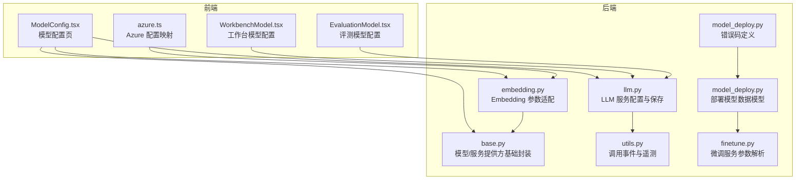
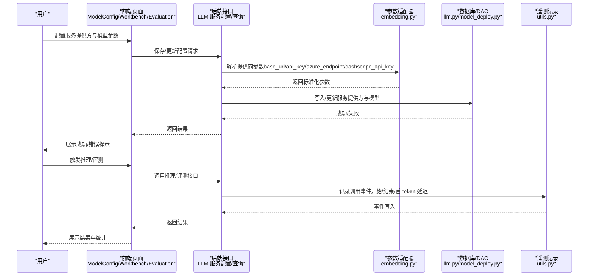
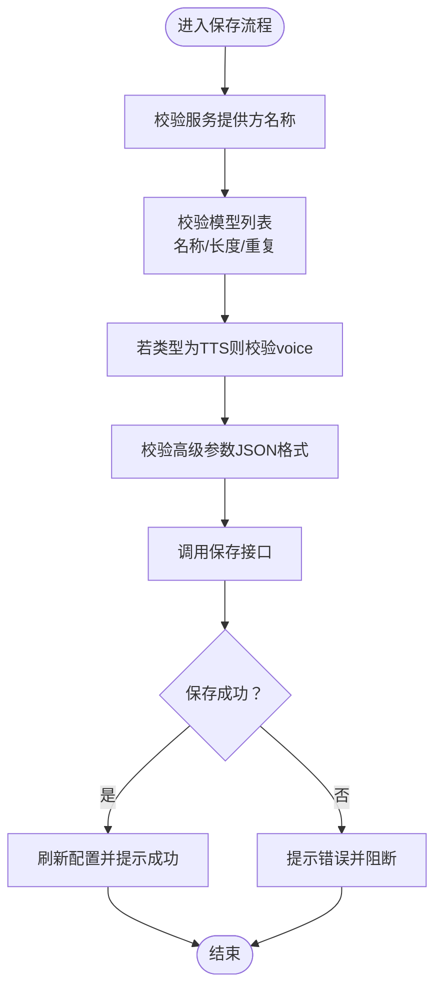
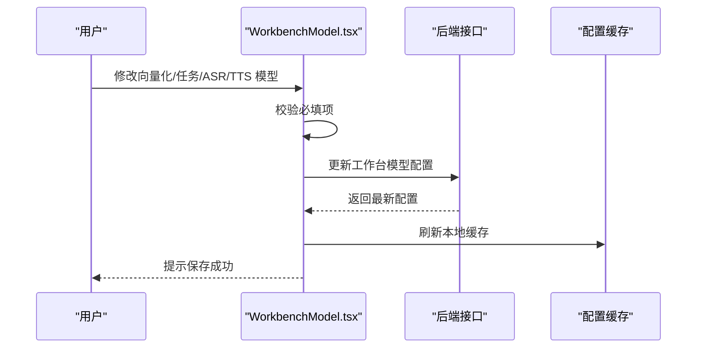
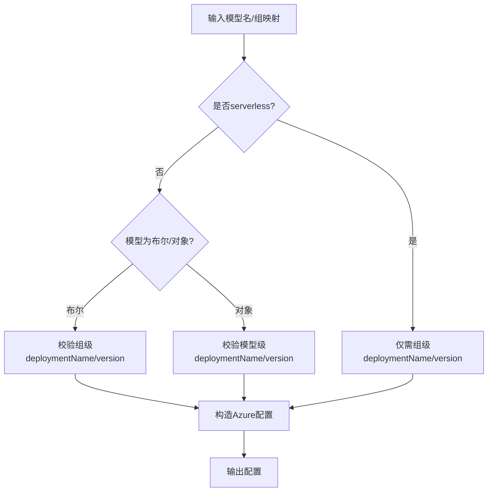
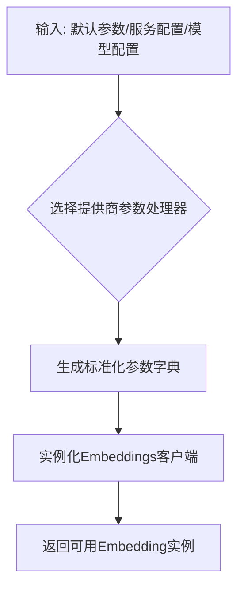
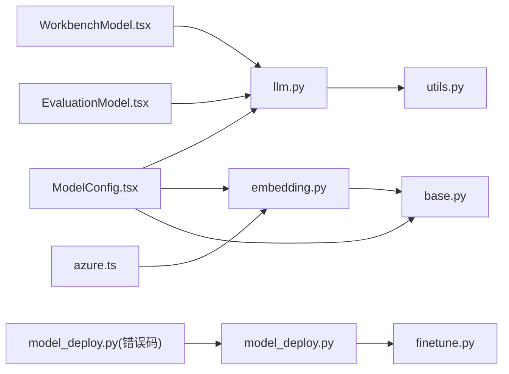

# 模型管理

<cite>
**本文引用的文件**   
- [ModelConfig.tsx](file://src/frontend/platform/src/pages/ModelPage/manage/ModelConfig.tsx)
- [WorkbenchModel.tsx](file://src/frontend/platform/src/pages/ModelPage/manage/tabs/WorkbenchModel.tsx)
- [EvaluationModel.tsx](file://src/frontend/platform/src/pages/ModelPage/manage/tabs/EvaluationModel.tsx)
- [azure.ts](file://src/frontend/client/src/data-provider/data-provider/src/azure.ts)
- [embedding.py](file://src/backend/bisheng/llm/domain/llm/embedding.py)
- [base.py](file://src/backend/bisheng/llm/domain/llm/base.py)
- [llm.py](file://src/backend/bisheng/llm/domain/services/llm.py)
- [utils.py](file://src/backend/bisheng/llm/domain/utils.py)
- [model_deploy.py](file://src/backend/bisheng/finetune/domain/models/model_deploy.py)
- [finetune.py](file://src/backend/bisheng/finetune/domain/services/finetune.py)
- [model_deploy.py](file://src/backend/bisheng/common/errcode/model_deploy.py)
- [dashboard.json](file://src/frontend/platform/public/locales/en-US/dashboard.json)
</cite>

## 目录
1. [简介](#简介)
2. [项目结构](#项目结构)
3. [核心组件](#核心组件)
4. [架构总览](#架构总览)
5. [详细组件分析](#详细组件分析)
6. [依赖关系分析](#依赖关系分析)
7. [性能考量](#性能考量)
8. [故障排查指南](#故障排查指南)
9. [结论](#结论)
10. [附录](#附录)

## 简介
本技术文档面向 Bisheng 的“模型管理”功能，系统性阐述模型管理页面的实现、模型配置与推理服务配置、多模型提供商集成（OpenAI、Azure、通义千问、ChatGLM 等）、模型参数配置界面（温度、最大令牌数、频率惩罚等）、模型性能监控（响应时间、成本统计、使用量跟踪）、模型测试与调试工具（推理测试、参数调优、效果评估），以及模型版本管理与部署配置相关能力。文档同时提供可视化图示与分层讲解，帮助开发者与非技术读者快速理解与上手。

## 项目结构
模型管理功能由前端页面与后端服务协同完成：
- 前端负责模型管理页面、推理服务配置、工作台模型配置、评测模型配置、参数模板与校验、国际化文案等。
- 后端负责模型与服务提供方的持久化、参数解析与适配、调用链路与遥测埋点、错误码定义与统一返回。

**图表来源**
- [ModelConfig.tsx](file://src/frontend/platform/src/pages/ModelPage/manage/ModelConfig.tsx#L398-L702)
- [WorkbenchModel.tsx](file://src/frontend/platform/src/pages/ModelPage/manage/tabs/WorkbenchModel.tsx#L54-L254)
- [EvaluationModel.tsx](file://src/frontend/platform/src/pages/ModelPage/manage/tabs/EvaluationModel.tsx#L11-L34)
- [azure.ts](file://src/frontend/client/src/data-provider/data-provider/src/azure.ts#L117-L201)
- [embedding.py](file://src/backend/bisheng/llm/domain/llm/embedding.py#L1-L179)
- [base.py](file://src/backend/bisheng/llm/domain/llm/base.py#L1-L82)
- [llm.py](file://src/backend/bisheng/llm/domain/services/llm.py#L250-L277)
- [utils.py](file://src/backend/bisheng/llm/domain/utils.py#L111-L126)
- [model_deploy.py](file://src/backend/bisheng/finetune/domain/models/model_deploy.py#L1-L106)
- [finetune.py](file://src/backend/bisheng/finetune/domain/services/finetune.py#L28-L52)
- [model_deploy.py](file://src/backend/bisheng/common/errcode/model_deploy.py#L1-L8)

**章节来源**
- [ModelConfig.tsx](file://src/frontend/platform/src/pages/ModelPage/manage/ModelConfig.tsx#L366-L386)
- [WorkbenchModel.tsx](file://src/frontend/platform/src/pages/ModelPage/manage/tabs/WorkbenchModel.tsx#L54-L167)
- [EvaluationModel.tsx](file://src/frontend/platform/src/pages/ModelPage/manage/tabs/EvaluationModel.tsx#L11-L34)
- [azure.ts](file://src/frontend/client/src/data-provider/data-provider/src/azure.ts#L117-L201)
- [embedding.py](file://src/backend/bisheng/llm/domain/llm/embedding.py#L69-L86)
- [base.py](file://src/backend/bisheng/llm/domain/llm/base.py#L10-L82)
- [llm.py](file://src/backend/bisheng/llm/domain/services/llm.py#L250-L277)
- [utils.py](file://src/backend/bisheng/llm/domain/utils.py#L111-L126)
- [model_deploy.py](file://src/backend/bisheng/finetune/domain/models/model_deploy.py#L1-L106)
- [finetune.py](file://src/backend/bisheng/finetune/domain/services/finetune.py#L28-L52)
- [model_deploy.py](file://src/backend/bisheng/common/errcode/model_deploy.py#L1-L8)

## 核心组件
- 模型配置页面（ModelConfig.tsx）
  - 支持新增/编辑服务提供方（OpenAI、Azure OpenAI、Ollama、xinference、llamacpp、vllm、通义千问、DeepSeek、硅基流动、火山引擎、智谱 AI、讯飞星火、腾讯云、月之暗面、百度千帆、Minimax、Anthropic、MindIE、bishengRT）。
  - 支持为每个模型配置类型（LLM、Embedding、Rerank、ASR、TTS），并按提供商与模型类型生成高级参数模板。
  - 支持每日调用限制开关与次数设置；支持删除模型与服务提供方。
- 工作台模型配置（WorkbenchModel.tsx）
  - 配置向量化模型、任务模型（LLM）、执行模式（函数调用/React），以及 ASR/TTS 模型。
  - 支持嵌入模型变更时的二次确认提示。
- 评测模型配置（EvaluationModel.tsx）
  - 设置默认评测使用的模型 ID 并保存。
- Azure 配置映射（azure.ts）
  - 将模型名映射到组与部署信息，支持 serverless 与实例名校验。
- Embedding 参数适配（embedding.py）
  - 针对不同提供商（OpenAI、Azure OpenAI、通义千问、Ollama、xinference、llamacpp、vllm 等）生成统一的参数字典，处理 base_url、api_key、azure_endpoint、dashscope_api_key 等。
- 基础封装（base.py）
  - 统一获取模型与服务提供方信息，提供配置读取与状态更新接口。
- LLM 服务配置保存（llm.py）
  - 保存/更新服务提供方配置，校验模型名称重复、名称长度与必填项。
- 遥测与调用事件（utils.py）
  - 记录模型调用开始/结束时间、首 token 延迟、应用与用户上下文等指标。
- 部署模型数据模型与微调服务（model_deploy.py、finetune.py）
  - 定义部署模型的数据结构与 DAO 方法；解析微调命令参数。
- 错误码（model_deploy.py）
  - 定义“模型不存在”的错误码。

**章节来源**
- [ModelConfig.tsx](file://src/frontend/platform/src/pages/ModelPage/manage/ModelConfig.tsx#L366-L386)
- [WorkbenchModel.tsx](file://src/frontend/platform/src/pages/ModelPage/manage/tabs/WorkbenchModel.tsx#L54-L167)
- [EvaluationModel.tsx](file://src/frontend/platform/src/pages/ModelPage/manage/tabs/EvaluationModel.tsx#L11-L34)
- [azure.ts](file://src/frontend/client/src/data-provider/data-provider/src/azure.ts#L117-L201)
- [embedding.py](file://src/backend/bisheng/llm/domain/llm/embedding.py#L17-L86)
- [base.py](file://src/backend/bisheng/llm/domain/llm/base.py#L10-L82)
- [llm.py](file://src/backend/bisheng/llm/domain/services/llm.py#L250-L277)
- [utils.py](file://src/backend/bisheng/llm/domain/utils.py#L111-L126)
- [model_deploy.py](file://src/backend/bisheng/finetune/domain/models/model_deploy.py#L1-L106)
- [finetune.py](file://src/backend/bisheng/finetune/domain/services/finetune.py#L28-L52)
- [model_deploy.py](file://src/backend/bisheng/common/errcode/model_deploy.py#L1-L8)

## 架构总览
模型管理从“前端页面配置”到“后端参数适配与持久化”，再到“推理调用与遥测统计”的完整闭环如下：

**图表来源**
- [ModelConfig.tsx](file://src/frontend/platform/src/pages/ModelPage/manage/ModelConfig.tsx#L496-L575)
- [WorkbenchModel.tsx](file://src/frontend/platform/src/pages/ModelPage/manage/tabs/WorkbenchModel.tsx#L71-L115)
- [EvaluationModel.tsx](file://src/frontend/platform/src/pages/ModelPage/manage/tabs/EvaluationModel.tsx#L24-L34)
- [embedding.py](file://src/backend/bisheng/llm/domain/llm/embedding.py#L17-L86)
- [llm.py](file://src/backend/bisheng/llm/domain/services/llm.py#L250-L277)
- [utils.py](file://src/backend/bisheng/llm/domain/utils.py#L111-L126)

## 详细组件分析

### 模型配置页面（ModelConfig.tsx）
- 功能要点
  - 服务提供方选择与名称校验（长度限制、重复检查）。
  - 模型列表增删改，支持模型类型切换（LLM/Embedding/Rerank/ASR/TTS）。
  - 高级参数模板与 JSON 校验，支持按提供商与模型类型自动填充默认模板。
  - TTS 类型需要填写 voice；部分提供商支持 web 搜索开关与 max_tokens/max_output_tokens/num_ctx 等参数。
  - 每日调用限制开关与次数设置。
- 关键流程（保存）
  - 校验名称、模型名称、重复、TTS voice 必填、高级参数 JSON 合法性。
  - 调用保存接口，成功后刷新配置并返回。
- 可视化（保存流程）

**图表来源**
- [ModelConfig.tsx](file://src/frontend/platform/src/pages/ModelPage/manage/ModelConfig.tsx#L506-L551)
- [ModelConfig.tsx](file://src/frontend/platform/src/pages/ModelPage/manage/ModelConfig.tsx#L558-L575)

**章节来源**
- [ModelConfig.tsx](file://src/frontend/platform/src/pages/ModelPage/manage/ModelConfig.tsx#L366-L386)
- [ModelConfig.tsx](file://src/frontend/platform/src/pages/ModelPage/manage/ModelConfig.tsx#L496-L575)

### 工作台模型配置（WorkbenchModel.tsx）
- 功能要点
  - 选择向量化模型、任务模型（LLM）、执行模式（函数调用/React）。
  - 选择 ASR/TTS 模型（可为空）。
  - 嵌入模型变更时弹出二次确认，避免影响下游检索质量。
- 关键流程（保存）
  - 组装请求体（任务模型、向量化模型、执行模式、ASR/TTS 模型）。
  - 调用更新接口并刷新配置，最后提示成功。

**图表来源**
- [WorkbenchModel.tsx](file://src/frontend/platform/src/pages/ModelPage/manage/tabs/WorkbenchModel.tsx#L71-L115)
- [WorkbenchModel.tsx](file://src/frontend/platform/src/pages/ModelPage/manage/tabs/WorkbenchModel.tsx#L117-L140)

**章节来源**
- [WorkbenchModel.tsx](file://src/frontend/platform/src/pages/ModelPage/manage/tabs/WorkbenchModel.tsx#L54-L167)

### 评测模型配置（EvaluationModel.tsx）
- 功能要点
  - 选择默认评测使用的模型 ID 并保存。
  - 无模型时提示必填。
- 关键流程（保存）
  - 校验模型 ID 存在性，调用更新接口并提示成功。

**章节来源**
- [EvaluationModel.tsx](file://src/frontend/platform/src/pages/ModelPage/manage/tabs/EvaluationModel.tsx#L11-L34)

### Azure 配置映射（azure.ts）
- 功能要点
  - 将模型名映射到组与部署信息，支持 serverless 场景与实例名校验。
  - 对布尔模型与对象模型分别校验 deploymentName 与 version 是否缺失。
- 关键流程（映射）
  - 根据模型名与组映射，构造 baseURL、headers、serverless 等配置。

**图表来源**
- [azure.ts](file://src/frontend/client/src/data-provider/data-provider/src/azure.ts#L117-L201)

**章节来源**
- [azure.ts](file://src/frontend/client/src/data-provider/data-provider/src/azure.ts#L117-L201)

### Embedding 参数适配（embedding.py）
- 功能要点
  - 针对不同提供商（OpenAI/Azure/Qwen/Ollama/xinference/llamacpp/vllm/minimax/zhipu/tencent/volcengine/silicon）生成统一参数字典。
  - 处理 base_url、api_key、azure_endpoint、azure_deployment、dashscope_api_key 等字段。
  - 支持 user_kwargs 合并与覆盖。
- 关键流程（初始化客户端）
  - 根据服务类型选择对应 Embeddings 类，合并默认参数与提供商参数，创建客户端实例。

**图表来源**
- [embedding.py](file://src/backend/bisheng/llm/domain/llm/embedding.py#L17-L86)
- [embedding.py](file://src/backend/bisheng/llm/domain/llm/embedding.py#L146-L159)

**章节来源**
- [embedding.py](file://src/backend/bisheng/llm/domain/llm/embedding.py#L17-L86)
- [embedding.py](file://src/backend/bisheng/llm/domain/llm/embedding.py#L146-L159)

### 基础封装（base.py）
- 功能要点
  - 统一获取模型与服务提供方信息（异步/同步）。
  - 提供配置读取方法与模型状态更新接口。
- 关键流程（获取模型/服务信息）
  - 通过 DAO 查询模型与服务提供方，返回元组。

**章节来源**
- [base.py](file://src/backend/bisheng/llm/domain/llm/base.py#L26-L59)

### LLM 服务配置保存（llm.py）
- 功能要点
  - 保存/更新服务提供方配置，校验名称唯一性与模型名称重复。
  - 使用字段掩码更新配置，确保敏感字段安全。
- 关键流程（保存/更新）
  - 校验服务提供方名称是否存在冲突。
  - 校验模型名称重复，组装模型字典并更新服务配置。

**章节来源**
- [llm.py](file://src/backend/bisheng/llm/domain/services/llm.py#L250-L277)

### 遥测与调用事件（utils.py）
- 功能要点
  - 记录模型调用事件，包含模型 ID/名称、服务提供方 ID/名称、应用 ID/名称/类型、起止时间、首 token 延迟等。
- 关键流程（记录事件）
  - 在推理调用前后记录事件，便于后续性能分析与成本统计。

**章节来源**
- [utils.py](file://src/backend/bisheng/llm/domain/utils.py#L111-L126)

### 部署模型数据模型与微调服务（model_deploy.py、finetune.py）
- 功能要点
  - 定义部署模型的数据结构与 DAO 方法（查找、插入、更新、删除）。
  - 微调服务解析额外参数，组合训练指令参数，包含基础模型路径、模板、微调方式等。
- 关键流程（微调参数解析）
  - 复制额外参数，注入基础模型路径与模板，设置微调类型。

**章节来源**
- [model_deploy.py](file://src/backend/bisheng/finetune/domain/models/model_deploy.py#L1-L106)
- [finetune.py](file://src/backend/bisheng/finetune/domain/services/finetune.py#L28-L52)

### 错误码（model_deploy.py）
- 功能要点
  - 定义“模型不存在”的错误码，用于部署模块统一返回。

**章节来源**
- [model_deploy.py](file://src/backend/bisheng/common/errcode/model_deploy.py#L1-L8)

## 依赖关系分析
- 前端组件间依赖
  - ModelConfig.tsx 依赖 WorkbenchModel.tsx/EvaluationModel.tsx 的配置项与保存逻辑。
  - azure.ts 为 embedding.py 提供 Azure 配置映射能力。
- 后端组件间依赖
  - embedding.py 依赖 base.py 获取模型/服务信息。
  - llm.py 依赖 DAO 进行持久化操作。
  - utils.py 依赖遥测服务记录调用事件。
  - model_deploy.py 与 finetune.py 共同支撑微调与部署能力。
- 错误码依赖
  - model_deploy.py 中的错误码被部署模块使用。

**图表来源**
- [ModelConfig.tsx](file://src/frontend/platform/src/pages/ModelPage/manage/ModelConfig.tsx#L398-L702)
- [WorkbenchModel.tsx](file://src/frontend/platform/src/pages/ModelPage/manage/tabs/WorkbenchModel.tsx#L54-L254)
- [EvaluationModel.tsx](file://src/frontend/platform/src/pages/ModelPage/manage/tabs/EvaluationModel.tsx#L11-L34)
- [azure.ts](file://src/frontend/client/src/data-provider/data-provider/src/azure.ts#L117-L201)
- [embedding.py](file://src/backend/bisheng/llm/domain/llm/embedding.py#L1-L179)
- [base.py](file://src/backend/bisheng/llm/domain/llm/base.py#L1-L82)
- [llm.py](file://src/backend/bisheng/llm/domain/services/llm.py#L250-L277)
- [utils.py](file://src/backend/bisheng/llm/domain/utils.py#L111-L126)
- [model_deploy.py](file://src/backend/bisheng/finetune/domain/models/model_deploy.py#L1-L106)
- [finetune.py](file://src/backend/bisheng/finetune/domain/services/finetune.py#L28-L52)
- [model_deploy.py](file://src/backend/bisheng/common/errcode/model_deploy.py#L1-L8)

**章节来源**
- [ModelConfig.tsx](file://src/frontend/platform/src/pages/ModelPage/manage/ModelConfig.tsx#L398-L702)
- [WorkbenchModel.tsx](file://src/frontend/platform/src/pages/ModelPage/manage/tabs/WorkbenchModel.tsx#L54-L254)
- [EvaluationModel.tsx](file://src/frontend/platform/src/pages/ModelPage/manage/tabs/EvaluationModel.tsx#L11-L34)
- [azure.ts](file://src/frontend/client/src/data-provider/data-provider/src/azure.ts#L117-L201)
- [embedding.py](file://src/backend/bisheng/llm/domain/llm/embedding.py#L1-L179)
- [base.py](file://src/backend/bisheng/llm/domain/llm/base.py#L1-L82)
- [llm.py](file://src/backend/bisheng/llm/domain/services/llm.py#L250-L277)
- [utils.py](file://src/backend/bisheng/llm/domain/utils.py#L111-L126)
- [model_deploy.py](file://src/backend/bisheng/finetune/domain/models/model_deploy.py#L1-L106)
- [finetune.py](file://src/backend/bisheng/finetune/domain/services/finetune.py#L28-L52)
- [model_deploy.py](file://src/backend/bisheng/common/errcode/model_deploy.py#L1-L8)

## 性能考量
- 响应时间与首 token 延迟
  - 通过遥测记录开始/结束时间与首 token 延迟，可用于性能分析与优化。
- 成本统计与使用量跟踪
  - 国际化文案中包含“Token 消耗”“模型调用次数”“模型调用成功率”“并发会话数”等指标，可用于成本与用量统计。
- 参数调优建议
  - 温度、top_p、最大令牌数、频率惩罚等参数直接影响生成质量与成本，建议结合业务场景进行 A/B 测试与灰度发布。

**章节来源**
- [utils.py](file://src/backend/bisheng/llm/domain/utils.py#L111-L126)
- [dashboard.json](file://src/frontend/platform/public/locales/en-US/dashboard.json#L480-L489)

## 故障排查指南
- 服务提供方配置错误
  - 检查服务提供方名称长度与重复；确认提供商参数（如 api_key、base_url、azure_endpoint 等）正确。
- 模型不存在
  - 部署模块错误码包含“模型不存在”，请确认模型已创建并处于在线状态。
- Azure 配置问题
  - 确认组/模型级 deploymentName 与 version 是否齐全；serverless 场景需满足实例名要求。
- 高级参数 JSON 校验失败
  - 确保 JSON 结构合法且为对象类型；参考模板自动填充。

**章节来源**
- [model_deploy.py](file://src/backend/bisheng/common/errcode/model_deploy.py#L1-L8)
- [azure.ts](file://src/frontend/client/src/data-provider/data-provider/src/azure.ts#L117-L201)
- [ModelConfig.tsx](file://src/frontend/platform/src/pages/ModelPage/manage/ModelConfig.tsx#L506-L551)

## 结论
Bisheng 的模型管理功能通过“前端配置页面 + 后端参数适配与持久化 + 遥测统计”的架构，实现了对多提供商模型的统一接入与高效管理。借助高级参数模板、工作台与评测模型配置、Azure 映射与错误码体系，开发者可以快速完成模型配置、测试与优化，并基于遥测数据进行性能与成本分析。

## 附录
- 支持的模型提供商（节选）
  - OpenAI、Azure OpenAI、Ollama、xinference、llamacpp、vllm、通义千问、DeepSeek、硅基流动、火山引擎、智谱 AI、讯飞星火、腾讯云、月之暗面、百度千帆、Minimax、Anthropic、MindIE、bishengRT。
- 模型参数配置界面（节选）
  - 温度、top_p、最大令牌数、频率惩罚、presence_penalty、重试次数、请求超时、user_kwargs 等。

**章节来源**
- [ModelConfig.tsx](file://src/frontend/platform/src/pages/ModelPage/manage/ModelConfig.tsx#L366-L386)
- [ModelConfig.tsx](file://src/frontend/platform/src/pages/ModelPage/manage/ModelConfig.tsx#L165-L201)