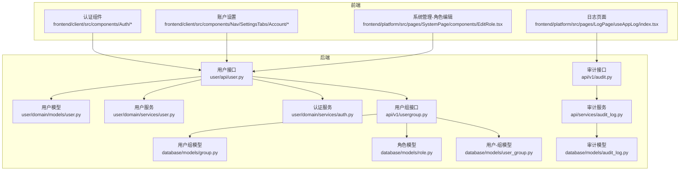
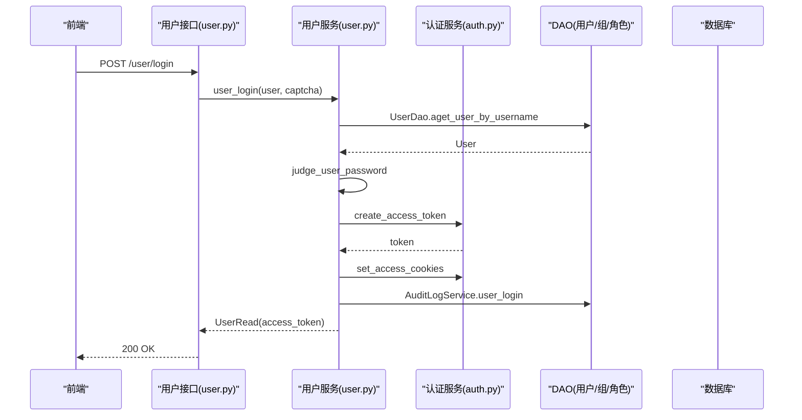
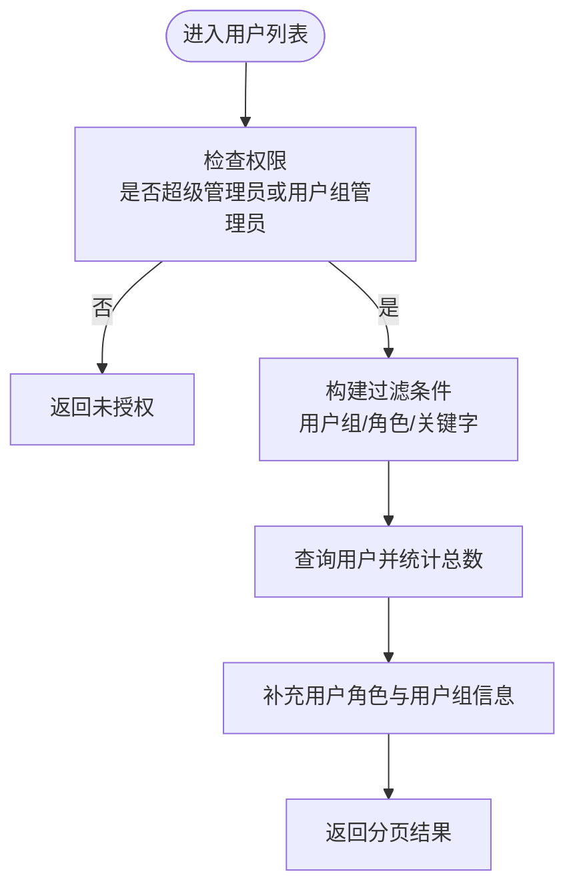
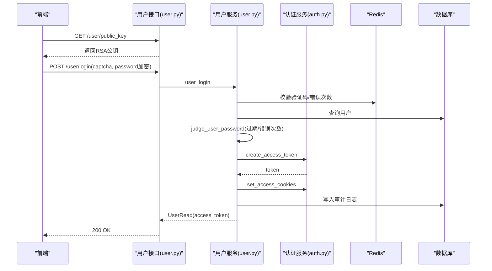
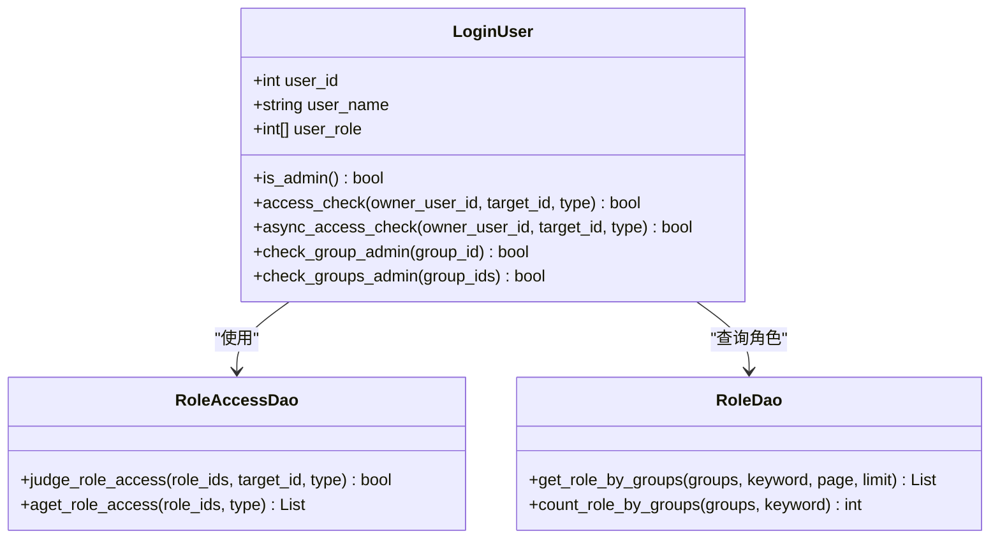
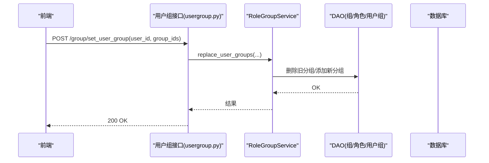
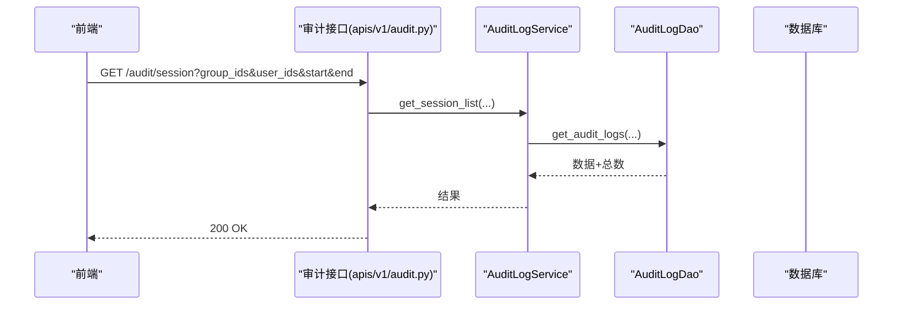
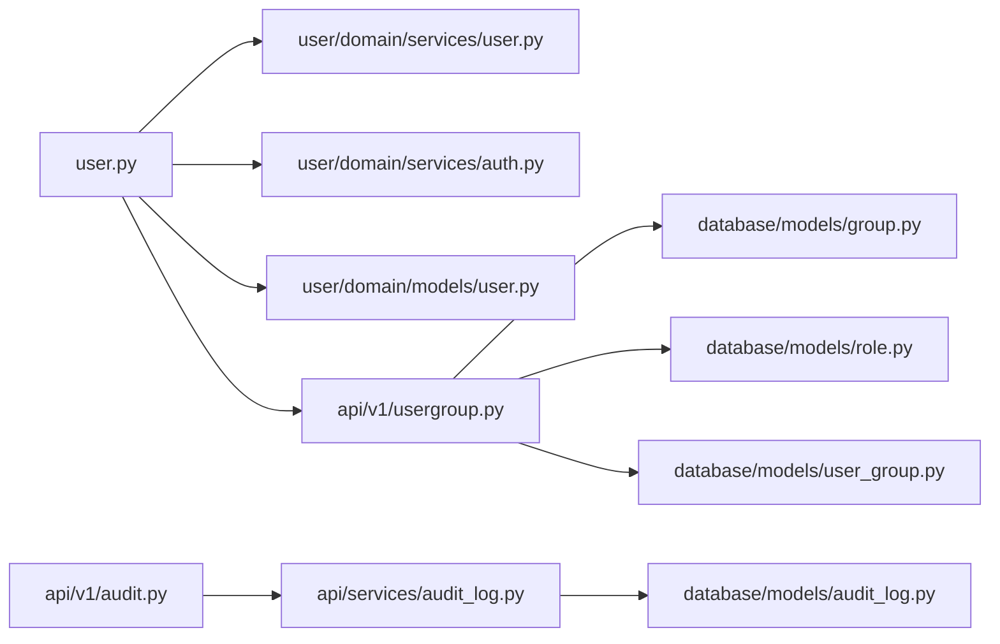

# 用户管理

<cite>
**本文引用的文件**
- [src/backend/bisheng/user/api/user.py](file://src/backend/bisheng/user/api/user.py)
- [src/backend/bisheng/user/domain/models/user.py](file://src/backend/bisheng/user/domain/models/user.py)
- [src/backend/bisheng/user/domain/services/user.py](file://src/backend/bisheng/user/domain/services/user.py)
- [src/backend/bisheng/user/domain/services/auth.py](file://src/backend/bisheng/user/domain/services/auth.py)
- [src/backend/bisheng/api/v1/usergroup.py](file://src/backend/bisheng/api/v1/usergroup.py)
- [src/backend/bisheng/database/models/group.py](file://src/backend/bisheng/database/models/group.py)
- [src/backend/bisheng/database/models/role.py](file://src/backend/bisheng/database/models/role.py)
- [src/backend/bisheng/database/models/user_group.py](file://src/backend/bisheng/database/models/user_group.py)
- [src/backend/bisheng/api/services/audit_log.py](file://src/backend/bisheng/api/services/audit_log.py)
- [src/backend/bisheng/database/models/audit_log.py](file://src/backend/bisheng/database/models/audit_log.py)
- [src/backend/bisheng/api/v1/audit.py](file://src/backend/bisheng/api/v1/audit.py)
- [src/backend/bisheng/api/v1/endpoints.py](file://src/backend/bisheng/api/v1/endpoints.py)
- [src/frontend/client/src/data-provider/data-service.ts](file://src/frontend/client/src/data-provider/data-service.ts)
- [src/frontend/client/src/components/Auth/index.ts](file://src/frontend/client/src/components/Auth/index.ts)
- [src/frontend/client/src/components/Auth/SocialLoginRender.tsx](file://src/frontend/client/src/components/Auth/SocialLoginRender.tsx)
- [src/frontend/platform/src/pages/SystemPage/components/EditRole.tsx](file://src/frontend/platform/src/pages/SystemPage/components/EditRole.tsx)
- [src/frontend/platform/src/pages/LogPage/useAppLog/index.tsx](file://src/frontend/platform/src/pages/LogPage/useAppLog/index.tsx)
- [src/frontend/client/src/components/Nav/SettingsTabs/Account/Account.tsx](file://src/frontend/client/src/components/Nav/SettingsTabs/Account/Account.tsx)
- [src/frontend/client/src/components/Nav/SettingsTabs/Account/DeleteAccount.tsx](file://src/frontend/client/src/components/Nav/SettingsTabs/Account/DeleteAccount.tsx)
</cite>

## 目录
1. [简介](#简介)
2. [项目结构](#项目结构)
3. [核心组件](#核心组件)
4. [架构总览](#架构总览)
5. [详细组件分析](#详细组件分析)
6. [依赖关系分析](#依赖关系分析)
7. [性能考量](#性能考量)
8. [故障排查指南](#故障排查指南)
9. [结论](#结论)
10. [附录](#附录)

## 简介
本技术文档围绕 Bisheng 的用户管理系统，系统性阐述用户管理页面与后端实现，涵盖以下主题：
- 用户列表展示与筛选、用户信息编辑、权限分配
- 登录认证体系：本地登录、密码重置、两步验证、社交登录集成
- 权限控制设计：角色管理、权限分配、资源访问控制
- 用户组管理：组织架构、用户分组、批量操作
- 安全审计：登录日志、会话审计、导出与查询
- 用户数据管理：隐私保护、数据导出、账户注销

## 项目结构
后端采用 FastAPI + SQLModel 架构，前端使用 React + TypeScript。用户管理相关模块分布如下：
- 后端
  - 用户接口层：用户注册、登录、列表、更新、角色与权限管理、密码重置等
  - 领域模型：User、Group、Role、UserGroup 及其 DAO
  - 认证服务：JWT、Cookie、权限校验、访问控制
  - 审计日志：登录事件、会话审计、导出
  - 用户组接口：用户分组、管理员设置、资源查询
- 前端
  - 认证组件：登录、注册、重置密码、两步验证、社交登录
  - 系统管理：角色编辑、权限分配
  - 日志与审计：审计日志查询、导出
  - 账户设置：头像、两步验证、删除账户

图表来源
- [src/backend/bisheng/user/api/user.py](file://src/backend/bisheng/user/api/user.py#L1-L712)
- [src/backend/bisheng/user/domain/models/user.py](file://src/backend/bisheng/user/domain/models/user.py#L1-L281)
- [src/backend/bisheng/user/domain/services/user.py](file://src/backend/bisheng/user/domain/services/user.py#L1-L187)
- [src/backend/bisheng/user/domain/services/auth.py](file://src/backend/bisheng/user/domain/services/auth.py#L1-L338)
- [src/backend/bisheng/api/v1/usergroup.py](file://src/backend/bisheng/api/v1/usergroup.py#L1-L186)
- [src/backend/bisheng/database/models/group.py](file://src/backend/bisheng/database/models/group.py#L1-L105)
- [src/backend/bisheng/database/models/role.py](file://src/backend/bisheng/database/models/role.py#L1-L125)
- [src/backend/bisheng/database/models/user_group.py](file://src/backend/bisheng/database/models/user_group.py#L1-L256)
- [src/backend/bisheng/api/services/audit_log.py](file://src/backend/bisheng/api/services/audit_log.py#L33-L55)
- [src/backend/bisheng/database/models/audit_log.py](file://src/backend/bisheng/database/models/audit_log.py#L94-L136)
- [src/backend/bisheng/api/v1/audit.py](file://src/backend/bisheng/api/v1/audit.py#L30-L98)

章节来源
- [src/backend/bisheng/user/api/user.py](file://src/backend/bisheng/user/api/user.py#L1-L712)
- [src/backend/bisheng/api/v1/usergroup.py](file://src/backend/bisheng/api/v1/usergroup.py#L1-L186)

## 核心组件
- 用户接口层（FastAPI）
  - 提供用户注册、登录、登出、列表查询、信息更新、角色与权限管理、密码重置等接口
  - 实现基于用户组与角色的权限过滤与校验
- 用户领域模型与 DAO
  - User、Group、Role、UserGroup 模型及查询方法
  - 支持分页、关键字检索、批量操作
- 认证与授权服务
  - JWT 生成与校验、Cookie 设置、权限装饰器、资源访问控制
- 审计日志
  - 登录事件记录、会话审计、导出 CSV
- 用户组接口
  - 用户分组 CRUD、管理员设置、资源查询、批量替换用户分组

章节来源
- [src/backend/bisheng/user/api/user.py](file://src/backend/bisheng/user/api/user.py#L107-L221)
- [src/backend/bisheng/user/domain/models/user.py](file://src/backend/bisheng/user/domain/models/user.py#L82-L180)
- [src/backend/bisheng/user/domain/services/auth.py](file://src/backend/bisheng/user/domain/services/auth.py#L24-L338)
- [src/backend/bisheng/api/services/audit_log.py](file://src/backend/bisheng/api/services/audit_log.py#L33-L55)
- [src/backend/bisheng/api/v1/usergroup.py](file://src/backend/bisheng/api/v1/usergroup.py#L71-L123)

## 架构总览
用户管理整体采用“接口层-服务层-模型层-DAO 层”的分层架构，前后端通过 REST 接口交互。

图表来源
- [src/backend/bisheng/user/api/user.py](file://src/backend/bisheng/user/api/user.py#L132-L169)
- [src/backend/bisheng/user/domain/services/user.py](file://src/backend/bisheng/user/domain/services/user.py#L132-L169)
- [src/backend/bisheng/user/domain/services/auth.py](file://src/backend/bisheng/user/domain/services/auth.py#L257-L281)

## 详细组件分析

### 用户列表与信息编辑
- 列表查询
  - 支持按用户组、角色、姓名关键字分页查询
  - 非超级管理员仅能查看其有管理权限的用户组内的用户
- 信息更新
  - 支持启用/禁用用户、清理错误密码次数
  - 禁止修改系统管理员状态
- 角色与权限
  - 用户角色增删改由管理员或用户组管理员执行
  - 批量替换用户所属用户组，遵循权限范围

图表来源
- [src/backend/bisheng/user/api/user.py](file://src/backend/bisheng/user/api/user.py#L150-L221)

章节来源
- [src/backend/bisheng/user/api/user.py](file://src/backend/bisheng/user/api/user.py#L150-L221)

### 登录认证系统
- 本地登录
  - 支持验证码开关、RSA 解密密码、密码强度策略与错误次数限制
  - 登录成功写入 JWT Cookie，并记录审计日志与遥测事件
- 密码重置
  - 管理员重置用户密码，需满足用户组管理员权限
  - 支持在线用户修改密码与非登录用户凭用户名校验后修改
- 两步验证
  - 前端账户设置中提供开启两步验证与备份码管理入口
- 社交登录
  - 前端支持 Google、Apple、OpenID 等社交登录按钮渲染
  - 后端提供 SSO 登录接口（受系统配置控制）

图表来源
- [src/backend/bisheng/user/api/user.py](file://src/backend/bisheng/user/api/user.py#L107-L169)
- [src/backend/bisheng/user/domain/services/user.py](file://src/backend/bisheng/user/domain/services/user.py#L132-L169)
- [src/backend/bisheng/user/domain/services/auth.py](file://src/backend/bisheng/user/domain/services/auth.py#L257-L281)

章节来源
- [src/backend/bisheng/user/api/user.py](file://src/backend/bisheng/user/api/user.py#L53-L94)
- [src/backend/bisheng/user/domain/services/user.py](file://src/backend/bisheng/user/domain/services/user.py#L105-L129)
- [src/frontend/client/src/components/Auth/index.ts](file://src/frontend/client/src/components/Auth/index.ts#L1-L7)
- [src/frontend/client/src/components/Auth/SocialLoginRender.tsx](file://src/frontend/client/src/components/Auth/SocialLoginRender.tsx#L59-L116)

### 权限控制系统
- 角色与权限
  - 角色属于用户组，内置系统管理员与默认角色
  - 角色权限通过 RoleAccessDao 统一管理，支持 WEB_MENU 等类型
- 资源访问控制
  - LoginUser 提供 access_check、async_access_check、copiable_check 等方法
  - 支持按资源 ID 与访问类型进行细粒度授权判断
- 权限分配流程
  - 用户组管理员仅能对自身管理的用户组内角色进行增删改
  - 更新用户角色时记录审计日志，包含变更前后的角色集合

图表来源
- [src/backend/bisheng/user/domain/services/auth.py](file://src/backend/bisheng/user/domain/services/auth.py#L95-L338)
- [src/backend/bisheng/database/models/role.py](file://src/backend/bisheng/database/models/role.py#L42-L108)

章节来源
- [src/backend/bisheng/database/models/role.py](file://src/backend/bisheng/database/models/role.py#L42-L108)
- [src/backend/bisheng/user/domain/services/auth.py](file://src/backend/bisheng/user/domain/services/auth.py#L154-L222)

### 用户组管理
- 组管理
  - 支持创建、更新、删除用户组；默认用户组用于新用户初始化
- 用户分组
  - 批量设置用户所属用户组，遵循权限范围
  - 获取用户所属组、组内成员列表
- 管理员设置
  - 批量设置用户组管理员，覆盖历史管理员
- 资源管理
  - 查询用户组下的各类资源（应用等），支持分页与名称过滤

图表来源
- [src/backend/bisheng/api/v1/usergroup.py](file://src/backend/bisheng/api/v1/usergroup.py#L71-L82)
- [src/backend/bisheng/database/models/user_group.py](file://src/backend/bisheng/database/models/user_group.py#L140-L179)

章节来源
- [src/backend/bisheng/api/v1/usergroup.py](file://src/backend/bisheng/api/v1/usergroup.py#L19-L123)
- [src/backend/bisheng/database/models/group.py](file://src/backend/bisheng/database/models/group.py#L44-L105)
- [src/backend/bisheng/database/models/user_group.py](file://src/backend/bisheng/database/models/user_group.py#L53-L256)

### 安全审计
- 审计日志查询
  - 支持按用户组、操作人、时间范围、系统标识、事件类型过滤
  - 非超级管理员仅能查看其管理的用户组范围内的日志
- 会话审计
  - 支持会话列表查询与导出 CSV
- 审计模型
  - 使用 JSON 字段存储 group_ids，便于多用户组关联查询

图表来源
- [src/backend/bisheng/api/v1/audit.py](file://src/backend/bisheng/api/v1/audit.py#L38-L58)
- [src/backend/bisheng/api/services/audit_log.py](file://src/backend/bisheng/api/services/audit_log.py#L33-L55)
- [src/backend/bisheng/database/models/audit_log.py](file://src/backend/bisheng/database/models/audit_log.py#L94-L136)

章节来源
- [src/backend/bisheng/api/v1/audit.py](file://src/backend/bisheng/api/v1/audit.py#L30-L98)
- [src/backend/bisheng/api/services/audit_log.py](file://src/backend/bisheng/api/services/audit_log.py#L33-L55)
- [src/backend/bisheng/database/models/audit_log.py](file://src/backend/bisheng/database/models/audit_log.py#L94-L136)

### 用户数据管理
- 数据导出
  - 审计会话支持导出 CSV，前端提供导出触发与下载链接
- 隐私保护
  - 登录接口与密码相关接口均进行敏感信息处理与错误提示
- 账户注销
  - 前端提供删除账户组件，要求用户确认邮箱一致后方可执行注销并自动退出登录

章节来源
- [src/backend/bisheng/api/v1/audit.py](file://src/backend/bisheng/api/v1/audit.py#L61-L98)
- [src/frontend/platform/src/pages/LogPage/useAppLog/index.tsx](file://src/frontend/platform/src/pages/LogPage/useAppLog/index.tsx#L1-L21)
- [src/frontend/client/src/components/Nav/SettingsTabs/Account/DeleteAccount.tsx](file://src/frontend/client/src/components/Nav/SettingsTabs/Account/DeleteAccount.tsx#L1-L139)

## 依赖关系分析
- 组件耦合
  - 用户接口层依赖用户服务与认证服务，服务层依赖 DAO 与配置服务
  - 用户组接口依赖用户组服务与角色 DAO
  - 审计接口依赖审计服务与审计 DAO
- 外部依赖
  - Redis 用于验证码、错误次数、当前会话缓存
  - JWT 用于身份令牌与 Cookie 存储
  - 数据库使用 SQLModel 进行 ORM 映射

图表来源
- [src/backend/bisheng/user/api/user.py](file://src/backend/bisheng/user/api/user.py#L1-L712)
- [src/backend/bisheng/api/v1/usergroup.py](file://src/backend/bisheng/api/v1/usergroup.py#L1-L186)
- [src/backend/bisheng/api/v1/audit.py](file://src/backend/bisheng/api/v1/audit.py#L1-L98)

章节来源
- [src/backend/bisheng/user/api/user.py](file://src/backend/bisheng/user/api/user.py#L1-L712)
- [src/backend/bisheng/api/v1/usergroup.py](file://src/backend/bisheng/api/v1/usergroup.py#L1-L186)
- [src/backend/bisheng/api/v1/audit.py](file://src/backend/bisheng/api/v1/audit.py#L1-L98)

## 性能考量
- 分页与过滤
  - 用户列表与角色列表均支持分页与关键字过滤，避免一次性加载大量数据
- 缓存策略
  - Redis 缓存验证码、RSA 私钥、错误次数、当前会话，降低数据库压力
- 异步查询
  - 审计日志与部分 DAO 方法提供异步实现，提升高并发场景下的响应能力
- 数据库索引
  - 关键字段如用户名、邮箱、用户组 ID、角色 ID 等建立索引，优化查询性能

## 故障排查指南
- 登录失败
  - 检查验证码是否开启、验证码是否正确、错误次数是否超限导致账号被禁用
  - 确认密码是否通过 RSA 解密与 MD5 哈希一致
- 权限不足
  - 非超级管理员只能在自身管理的用户组范围内进行操作
  - 角色与权限分配需确保用户组管理员身份
- 审计日志为空
  - 非超级管理员仅能看到其管理的用户组范围内的日志
  - 检查过滤参数（用户组、时间范围、事件类型）是否过于严格
- 导出失败
  - 确认会话查询参数正确，导出接口返回 URL 后前端可正常下载

章节来源
- [src/backend/bisheng/user/domain/services/user.py](file://src/backend/bisheng/user/domain/services/user.py#L74-L102)
- [src/backend/bisheng/api/services/audit_log.py](file://src/backend/bisheng/api/services/audit_log.py#L33-L55)
- [src/backend/bisheng/api/v1/audit.py](file://src/backend/bisheng/api/v1/audit.py#L61-L98)

## 结论
Bisheng 用户管理系统以清晰的分层架构实现了完整的用户生命周期管理与权限控制，结合 Redis 缓存与 JWT 认证，兼顾了安全性与性能。通过用户组与角色的组合，系统支持细粒度的资源访问控制，并提供了完善的审计与导出能力，满足企业级用户管理需求。

## 附录
- 前端认证与账户设置
  - 认证组件入口与社交登录渲染
  - 账户设置中的两步验证与删除账户
- 公共接口
  - 环境变量与配置获取接口，供前端初始化使用

章节来源
- [src/frontend/client/src/components/Auth/index.ts](file://src/frontend/client/src/components/Auth/index.ts#L1-L7)
- [src/frontend/client/src/components/Auth/SocialLoginRender.tsx](file://src/frontend/client/src/components/Auth/SocialLoginRender.tsx#L59-L116)
- [src/frontend/client/src/components/Nav/SettingsTabs/Account/Account.tsx](file://src/frontend/client/src/components/Nav/SettingsTabs/Account/Account.tsx#L1-L39)
- [src/frontend/client/src/components/Nav/SettingsTabs/Account/DeleteAccount.tsx](file://src/frontend/client/src/components/Nav/SettingsTabs/Account/DeleteAccount.tsx#L1-L139)
- [src/backend/bisheng/api/v1/endpoints.py](file://src/backend/bisheng/api/v1/endpoints.py#L132-L154)