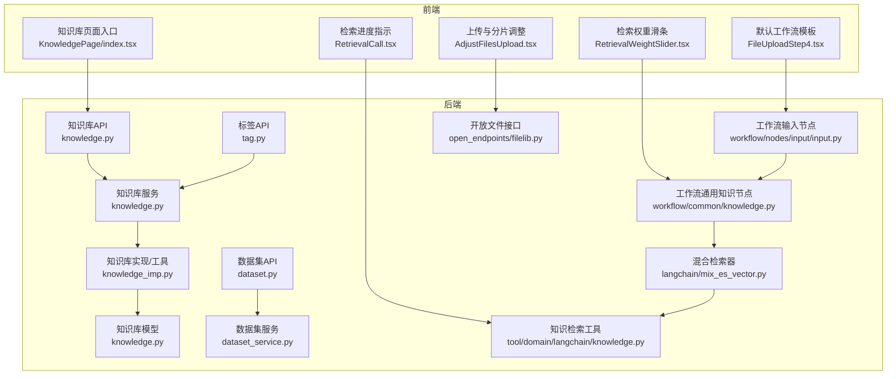
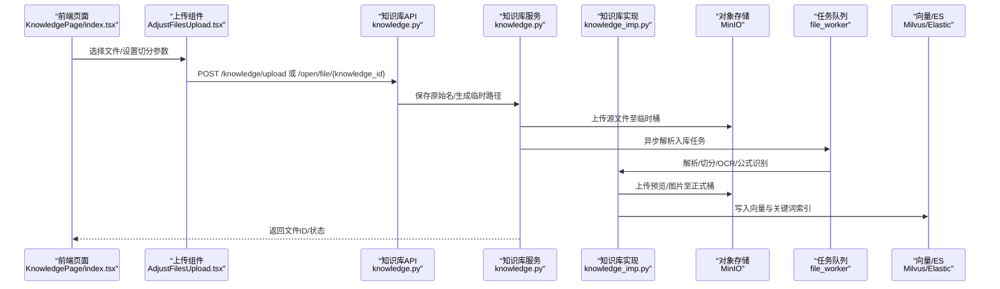
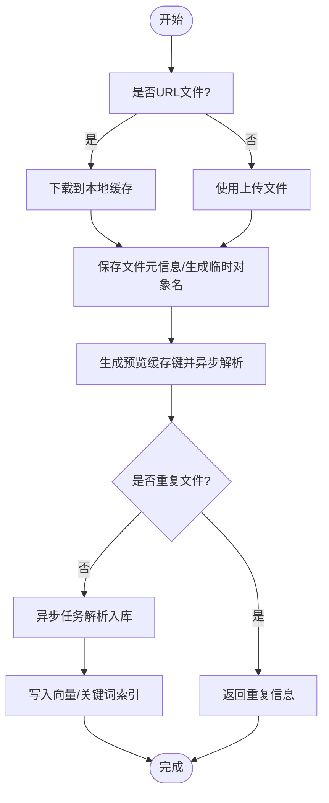
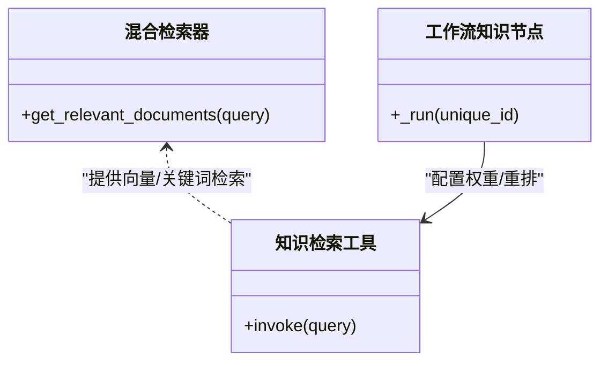
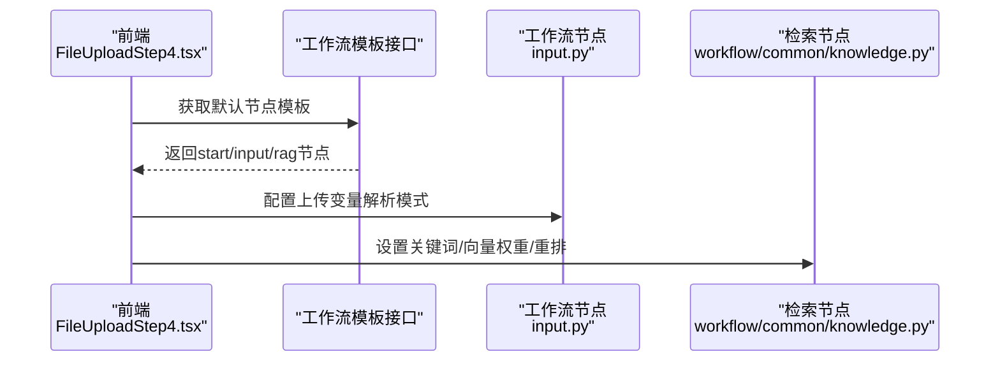
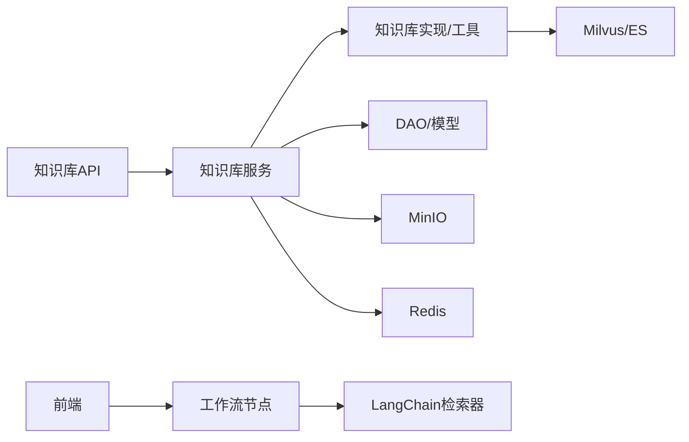

# 知识库管理

<cite>
**本文引用的文件**
- [src/backend/bisheng/knowledge/api/endpoints/knowledge.py](file://src/backend/bisheng/knowledge/api/endpoints/knowledge.py)
- [src/backend/bisheng/api/services/knowledge.py](file://src/backend/bisheng/api/services/knowledge.py)
- [src/backend/bisheng/api/services/knowledge_imp.py](file://src/backend/bisheng/api/services/knowledge_imp.py)
- [src/backend/bisheng/knowledge/domain/models/knowledge.py](file://src/backend/bisheng/knowledge/domain/models/knowledge.py)
- [src/backend/bisheng/api/v1/dataset.py](file://src/backend/bisheng/api/v1/dataset.py)
- [src/backend/bisheng/api/services/dataset_service.py](file://src/backend/bisheng/api/services/dataset_service.py)
- [src/backend/bisheng/api/v1/tag.py](file://src/backend/bisheng/api/v1/tag.py)
- [src/backend/bisheng/workflow/nodes/input/input.py](file://src/backend/bisheng/workflow/nodes/input/input.py)
- [src/backend/bisheng/workflow/common/knowledge.py](file://src/backend/bisheng/workflow/common/knowledge.py)
- [src/backend/bisheng_langchain/retrievers/mix_es_vector.py](file://src/backend/bisheng_langchain/retrievers/mix_es_vector.py)
- [src/backend/bisheng/tool/domain/langchain/knowledge.py](file://src/backend/bisheng/tool/domain/langchain/knowledge.py)
- [src/backend/bisheng/open_endpoints/api/endpoints/filelib.py](file://src/backend/bisheng/open_endpoints/api/endpoints/filelib.py)
- [src/frontend/platform/src/pages/KnowledgePage/index.tsx](file://src/frontend/platform/src/pages/KnowledgePage/index.tsx)
- [src/frontend/platform/src/pages/KnowledgePage/AdjustFilesUpload.tsx](file://src/frontend/platform/src/pages/KnowledgePage/AdjustFilesUpload.tsx)
- [src/frontend/platform/src/pages/KnowledgePage/components/FileUploadStep4.tsx](file://src/frontend/platform/src/pages/KnowledgePage/components/FileUploadStep4.tsx)
- [src/frontend/platform/src/pages/BuildPage/flow/FlowNode/component/RetrievalWeightSlider.tsx](file://src/frontend/platform/src/pages/BuildPage/flow/FlowNode/component/RetrievalWeightSlider.tsx)
- [src/frontend/client/src/components/Chat/Messages/Content/RetrievalCall.tsx](file://src/frontend/client/src/components/Chat/Messages/Content/RetrievalCall.tsx)
</cite>

## 目录
1. [简介](#简介)
2. [项目结构](#项目结构)
3. [核心组件](#核心组件)
4. [架构总览](#架构总览)
5. [详细组件分析](#详细组件分析)
6. [依赖关系分析](#依赖关系分析)
7. [性能考量](#性能考量)
8. [故障排查指南](#故障排查指南)
9. [结论](#结论)
10. [附录](#附录)

## 简介
本技术文档围绕 Bisheng 的“知识库管理”能力进行系统化梳理，覆盖知识库页面实现、文档上传与处理、批量操作、数据集管理、标签体系、检索与搜索、与工作流的集成以及文件处理流程（格式支持、预览与进度监控）。文档以代码级事实为基础，配合可视化图示帮助读者快速理解前后端协作机制与数据流转。

## 项目结构
后端采用 FastAPI 路由分层：知识库路由位于知识域 API 层，服务层封装业务逻辑，领域模型定义知识库与文件实体；前端平台页通过 Tabs 切换“文件数据”和“问答数据”，并提供上传、分片预览、重试等交互。

图表来源
- [src/backend/bisheng/knowledge/api/endpoints/knowledge.py](file://src/backend/bisheng/knowledge/api/endpoints/knowledge.py#L48-L1016)
- [src/backend/bisheng/api/services/knowledge.py](file://src/backend/bisheng/api/services/knowledge.py#L72-L1299)
- [src/backend/bisheng/api/services/knowledge_imp.py](file://src/backend/bisheng/api/services/knowledge_imp.py#L1-L1582)
- [src/backend/bisheng/knowledge/domain/models/knowledge.py](file://src/backend/bisheng/knowledge/domain/models/knowledge.py#L1-L532)
- [src/backend/bisheng/api/v1/dataset.py](file://src/backend/bisheng/api/v1/dataset.py#L1-L53)
- [src/backend/bisheng/api/services/dataset_service.py](file://src/backend/bisheng/api/services/dataset_service.py#L1-L80)
- [src/backend/bisheng/api/v1/tag.py](file://src/backend/bisheng/api/v1/tag.py#L1-L93)
- [src/backend/bisheng/workflow/nodes/input/input.py](file://src/backend/bisheng/workflow/nodes/input/input.py#L151-L172)
- [src/backend/bisheng/workflow/common/knowledge.py](file://src/backend/bisheng/workflow/common/knowledge.py#L185-L211)
- [src/backend/bisheng_langchain/retrievers/mix_es_vector.py](file://src/backend/bisheng_langchain/retrievers/mix_es_vector.py#L34-L60)
- [src/backend/bisheng/tool/domain/langchain/knowledge.py](file://src/backend/bisheng/tool/domain/langchain/knowledge.py#L30-L58)
- [src/backend/bisheng/open_endpoints/api/endpoints/filelib.py](file://src/backend/bisheng/open_endpoints/api/endpoints/filelib.py#L85-L132)
- [src/frontend/platform/src/pages/KnowledgePage/index.tsx](file://src/frontend/platform/src/pages/KnowledgePage/index.tsx#L1-L38)
- [src/frontend/platform/src/pages/KnowledgePage/AdjustFilesUpload.tsx](file://src/frontend/platform/src/pages/KnowledgePage/AdjustFilesUpload.tsx#L209-L241)
- [src/frontend/platform/src/pages/KnowledgePage/components/FileUploadStep4.tsx](file://src/frontend/platform/src/pages/KnowledgePage/components/FileUploadStep4.tsx#L207-L227)
- [src/frontend/platform/src/pages/BuildPage/flow/FlowNode/component/RetrievalWeightSlider.tsx](file://src/frontend/platform/src/pages/BuildPage/flow/FlowNode/component/RetrievalWeightSlider.tsx#L32-L51)
- [src/frontend/client/src/components/Chat/Messages/Content/RetrievalCall.tsx](file://src/frontend/client/src/components/Chat/Messages/Content/RetrievalCall.tsx#L1-L53)

章节来源
- [src/backend/bisheng/knowledge/api/endpoints/knowledge.py](file://src/backend/bisheng/knowledge/api/endpoints/knowledge.py#L48-L1016)
- [src/frontend/platform/src/pages/KnowledgePage/index.tsx](file://src/frontend/platform/src/pages/KnowledgePage/index.tsx#L1-L38)

## 核心组件
- 知识库 API 与服务
  - 知识库路由：提供上传、预览、分片更新、处理、复制、删除、文件列表、QA 管理、导出/导入等接口。
  - 知识库服务：封装鉴权、缓存、向量化存储清理、MinIO 文件清理、回调钩子、文件入库与异步处理调度。
  - 知识库实现/工具：负责解析、切分、图片与预览文件上传、向量化入库、元数据聚合与 Telemetry 上报。
  - 领域模型：定义知识库类型、状态、元数据字段类型及 DAO 查询/统计方法。
- 数据集管理
  - 数据集 API：列表、创建、删除。
  - 数据集服务：校验名称重复、对象存储命名、关联 QA 数据。
- 标签管理
  - 标签 API：查询、创建、更新、删除、标签资源关联、首页标签展示与更新。
- 检索与 RAG 集成
  - 工作流输入节点：解析上传变量（保留原文、抽取文本、写入知识库）。
  - 工作流通用知识节点：高级检索开关、用户认证、最大块大小、关键词/向量权重、重排开关与模型。
  - 混合检索器：向量与关键词检索融合策略。
  - 知识检索工具：统一调用 Milvus 与 ES 检索，并可选重排。
- 文件处理与预览
  - 开放文件接口：支持本地或 URL 文件上传，参数化切分规则、OCR、公式识别、页眉页脚过滤、Excel 规则。
  - 前端上传与分片：生成预览、分片编辑、重复文件检测、回调通知。

章节来源
- [src/backend/bisheng/knowledge/api/endpoints/knowledge.py](file://src/backend/bisheng/knowledge/api/endpoints/knowledge.py#L51-L201)
- [src/backend/bisheng/api/services/knowledge.py](file://src/backend/bisheng/api/services/knowledge.py#L72-L234)
- [src/backend/bisheng/api/services/knowledge_imp.py](file://src/backend/bisheng/api/services/knowledge_imp.py#L75-L200)
- [src/backend/bisheng/knowledge/domain/models/knowledge.py](file://src/backend/bisheng/knowledge/domain/models/knowledge.py#L18-L72)
- [src/backend/bisheng/api/v1/dataset.py](file://src/backend/bisheng/api/v1/dataset.py#L15-L52)
- [src/backend/bisheng/api/services/dataset_service.py](file://src/backend/bisheng/api/services/dataset_service.py#L13-L80)
- [src/backend/bisheng/api/v1/tag.py](file://src/backend/bisheng/api/v1/tag.py#L13-L92)
- [src/backend/bisheng/workflow/nodes/input/input.py](file://src/backend/bisheng/workflow/nodes/input/input.py#L151-L172)
- [src/backend/bisheng/workflow/common/knowledge.py](file://src/backend/bisheng/workflow/common/knowledge.py#L185-L211)
- [src/backend/bisheng_langchain/retrievers/mix_es_vector.py](file://src/backend/bisheng_langchain/retrievers/mix_es_vector.py#L34-L60)
- [src/backend/bisheng/tool/domain/langchain/knowledge.py](file://src/backend/bisheng/tool/domain/langchain/knowledge.py#L30-L58)
- [src/backend/bisheng/open_endpoints/api/endpoints/filelib.py](file://src/backend/bisheng/open_endpoints/api/endpoints/filelib.py#L85-L132)

## 架构总览
下图展示从前端到后端的知识库页面与文件处理主路径，包括上传、预览、分片、异步解析入库、向量化与检索链路。

图表来源
- [src/frontend/platform/src/pages/KnowledgePage/index.tsx](file://src/frontend/platform/src/pages/KnowledgePage/index.tsx#L13-L38)
- [src/frontend/platform/src/pages/KnowledgePage/AdjustFilesUpload.tsx](file://src/frontend/platform/src/pages/KnowledgePage/AdjustFilesUpload.tsx#L209-L241)
- [src/backend/bisheng/knowledge/api/endpoints/knowledge.py](file://src/backend/bisheng/knowledge/api/endpoints/knowledge.py#L51-L101)
- [src/backend/bisheng/api/services/knowledge.py](file://src/backend/bisheng/api/services/knowledge.py#L544-L591)
- [src/backend/bisheng/api/services/knowledge_imp.py](file://src/backend/bisheng/api/services/knowledge_imp.py#L85-L200)
- [src/backend/bisheng/open_endpoints/api/endpoints/filelib.py](file://src/backend/bisheng/open_endpoints/api/endpoints/filelib.py#L85-L132)

## 详细组件分析

### 知识库页面与列表展示
- 页面入口：平台页通过 Tabs 切换“文件数据/问答数据”，便于在同一界面内管理两类知识形态。
- 列表查询：后端提供按名称/描述/类型/排序的分页查询，支持管理员与角色访问控制。
- 权限控制：非管理员仅可见自身与授权的知识库；支持复制、重建、删除等操作前的权限校验。

章节来源
- [src/frontend/platform/src/pages/KnowledgePage/index.tsx](file://src/frontend/platform/src/pages/KnowledgePage/index.tsx#L13-L38)
- [src/backend/bisheng/knowledge/api/endpoints/knowledge.py](file://src/backend/bisheng/knowledge/api/endpoints/knowledge.py#L283-L298)
- [src/backend/bisheng/api/services/knowledge.py](file://src/backend/bisheng/api/services/knowledge.py#L74-L114)

### 文档上传与处理
- 上传接口
  - 平台侧：支持本地文件与 URL 文件两种来源，参数包括分隔符、分隔规则、切分长度/重叠、保留图片、强制 OCR、公式识别、页眉页脚过滤、Excel 规则等。
  - 开放接口：统一走 /open/file/{knowledge_id}，内部转交知识库服务处理。
- 预览与分片
  - 后端生成预览缓存键，异步执行解析，返回预览文件 ID；前端轮询状态并获取分片列表。
  - 支持更新/删除单个分片子块，便于人工修正。
- 入库与异步处理
  - 服务层保存文件记录、上传源文件至 MinIO、标记等待解析；异步任务触发解析、切分、OCR、公式识别、图片与预览文件上传、向量化入库。
- 重复文件检测
  - 基于 MD5 与文件名双重判断，避免重复入库；若重复，返回重复信息供前端处理。

图表来源
- [src/backend/bisheng/open_endpoints/api/endpoints/filelib.py](file://src/backend/bisheng/open_endpoints/api/endpoints/filelib.py#L85-L132)
- [src/backend/bisheng/knowledge/api/endpoints/knowledge.py](file://src/backend/bisheng/knowledge/api/endpoints/knowledge.py#L116-L190)
- [src/backend/bisheng/api/services/knowledge.py](file://src/backend/bisheng/api/services/knowledge.py#L544-L591)
- [src/backend/bisheng/api/services/knowledge_imp.py](file://src/backend/bisheng/api/services/knowledge_imp.py#L75-L200)

章节来源
- [src/backend/bisheng/open_endpoints/api/endpoints/filelib.py](file://src/backend/bisheng/open_endpoints/api/endpoints/filelib.py#L85-L132)
- [src/backend/bisheng/knowledge/api/endpoints/knowledge.py](file://src/backend/bisheng/knowledge/api/endpoints/knowledge.py#L116-L190)
- [src/backend/bisheng/api/services/knowledge.py](file://src/backend/bisheng/api/services/knowledge.py#L544-L591)

### 批量操作与重试
- 批量删除：支持按文件 ID 删除。
- 重试机制：失败文件可重新提交，服务层更新状态、复制临时对象至正式目录、重新入队异步任务。
- 失败处理：记录错误原因，支持前端二次确认覆盖。

章节来源
- [src/backend/bisheng/knowledge/api/endpoints/knowledge.py](file://src/backend/bisheng/knowledge/api/endpoints/knowledge.py#L410-L428)
- [src/backend/bisheng/api/services/knowledge.py](file://src/backend/bisheng/api/services/knowledge.py#L634-L694)

### 数据集管理
- 列表与创建：支持关键字分页查询、创建时校验名称重复、可选绑定对象存储与 QA 列表。
- 删除：删除时清理对象存储与数据库记录。

章节来源
- [src/backend/bisheng/api/v1/dataset.py](file://src/backend/bisheng/api/v1/dataset.py#L15-L52)
- [src/backend/bisheng/api/services/dataset_service.py](file://src/backend/bisheng/api/services/dataset_service.py#L13-L80)

### 标签管理
- 标签 CRUD：支持创建、更新、删除。
- 资源关联：支持标签与知识库/工作流/助手等资源的关联与解绑。
- 首页展示：支持设置首页展示标签集合。

章节来源
- [src/backend/bisheng/api/v1/tag.py](file://src/backend/bisheng/api/v1/tag.py#L13-L92)

### 检索与搜索
- 关键词搜索与语义检索融合：混合检索器支持多种组合策略（关键词优先、向量优先、混合）。
- 检索节点配置：工作流知识节点支持用户认证、最大块大小、关键词/向量权重、重排开关与模型。
- 工具封装：统一调用向量与关键词检索，支持二次重排。

图表来源
- [src/backend/bisheng_langchain/retrievers/mix_es_vector.py](file://src/backend/bisheng_langchain/retrievers/mix_es_vector.py#L34-L60)
- [src/backend/bisheng/tool/domain/langchain/knowledge.py](file://src/backend/bisheng/tool/domain/langchain/knowledge.py#L30-L58)
- [src/backend/bisheng/workflow/common/knowledge.py](file://src/backend/bisheng/workflow/common/knowledge.py#L185-L211)

章节来源
- [src/backend/bisheng_langchain/retrievers/mix_es_vector.py](file://src/backend/bisheng_langchain/retrievers/mix_es_vector.py#L34-L60)
- [src/backend/bisheng/tool/domain/langchain/knowledge.py](file://src/backend/bisheng/tool/domain/langchain/knowledge.py#L30-L58)
- [src/backend/bisheng/workflow/common/knowledge.py](file://src/backend/bisheng/workflow/common/knowledge.py#L185-L211)

### 与工作流集成
- 输入节点变量解析：根据解析模式（保留原文、抽取文本、写入知识库）映射文件路径/内容/图片路径。
- 默认工作流模板：上传完成后可基于模板生成包含 start/input/rag 节点的工作流草稿。
- 检索权重与重排：前端权重滑条与后端高级检索开关联动，影响最终召回质量。

图表来源
- [src/frontend/platform/src/pages/KnowledgePage/components/FileUploadStep4.tsx](file://src/frontend/platform/src/pages/KnowledgePage/components/FileUploadStep4.tsx#L207-L227)
- [src/backend/bisheng/workflow/nodes/input/input.py](file://src/backend/bisheng/workflow/nodes/input/input.py#L151-L172)
- [src/backend/bisheng/workflow/common/knowledge.py](file://src/backend/bisheng/workflow/common/knowledge.py#L185-L211)

章节来源
- [src/frontend/platform/src/pages/KnowledgePage/components/FileUploadStep4.tsx](file://src/frontend/platform/src/pages/KnowledgePage/components/FileUploadStep4.tsx#L207-L227)
- [src/backend/bisheng/workflow/nodes/input/input.py](file://src/backend/bisheng/workflow/nodes/input/input.py#L151-L172)
- [src/frontend/platform/src/pages/BuildPage/flow/FlowNode/component/RetrievalWeightSlider.tsx](file://src/frontend/platform/src/pages/BuildPage/flow/FlowNode/component/RetrievalWeightSlider.tsx#L32-L51)

### 文件处理流程（格式支持、预览、进度）
- 格式支持：文本、PDF、HTML、Markdown、Word、PowerPoint 等；部分格式需 LibreOffice 转换。
- 预览与分区：解析后生成分片与页级分区信息，支持缩略图与 PDF 预览链接。
- 进度监控：前端通过预览状态接口轮询，结合聊天消息中的检索进度组件展示处理阶段。

章节来源
- [src/backend/bisheng/api/services/knowledge_imp.py](file://src/backend/bisheng/api/services/knowledge_imp.py#L75-L200)
- [src/backend/bisheng/knowledge/api/endpoints/knowledge.py](file://src/backend/bisheng/knowledge/api/endpoints/knowledge.py#L116-L190)
- [src/frontend/client/src/components/Chat/Messages/Content/RetrievalCall.tsx](file://src/frontend/client/src/components/Chat/Messages/Content/RetrievalCall.tsx#L1-L53)

## 依赖关系分析
- 组件耦合
  - 知识库 API 依赖服务层；服务层依赖实现/工具、DAO、向量化客户端与 MinIO。
  - 工作流节点依赖通用知识节点与 LangChain 检索器；前端权重滑条驱动后端高级检索参数。
- 外部依赖
  - 向量存储：Milvus；关键词检索：Elasticsearch。
  - 对象存储：MinIO；缓存：Redis（预览缓存、状态键）。
- 循环依赖
  - 未见直接循环；服务层对实现/工具存在单向依赖，避免循环。

图表来源
- [src/backend/bisheng/knowledge/api/endpoints/knowledge.py](file://src/backend/bisheng/knowledge/api/endpoints/knowledge.py#L48-L1016)
- [src/backend/bisheng/api/services/knowledge.py](file://src/backend/bisheng/api/services/knowledge.py#L72-L234)
- [src/backend/bisheng/api/services/knowledge_imp.py](file://src/backend/bisheng/api/services/knowledge_imp.py#L1-L1582)
- [src/backend/bisheng/workflow/common/knowledge.py](file://src/backend/bisheng/workflow/common/knowledge.py#L185-L211)

章节来源
- [src/backend/bisheng/knowledge/api/endpoints/knowledge.py](file://src/backend/bisheng/knowledge/api/endpoints/knowledge.py#L48-L1016)
- [src/backend/bisheng/api/services/knowledge.py](file://src/backend/bisheng/api/services/knowledge.py#L72-L234)

## 性能考量
- 异步化：文件解析与入库通过 Celery 异步执行，避免阻塞请求。
- 缓存：预览分片与解析元信息缓存于 Redis，减少重复计算。
- 分页与限制：列表查询支持分页与限制，降低一次性数据传输压力。
- 存储与索引：向量与关键词索引分离，混合检索器按策略融合，兼顾召回与速度。
- IO 优化：MinIO 分批删除与对象复制，避免大事务阻塞。

## 故障排查指南
- 上传失败
  - 检查文件名为空、下载异常、缓存键生成失败。
  - 参考：[上传接口](file://src/backend/bisheng/open_endpoints/api/endpoints/filelib.py#L85-L132)
- 预览状态异常
  - 预览缓存键不存在或解析错误，检查 Redis 键与异步任务状态。
  - 参考：[预览接口](file://src/backend/bisheng/knowledge/api/endpoints/knowledge.py#L116-L167)
- 重复文件
  - MD5 与文件名重复导致入库失败，前端应提示覆盖或跳过。
  - 参考：[重复检测](file://src/backend/bisheng/api/services/knowledge.py#L718-L791)
- 向量/ES 清理失败
  - 删除知识库时需清理 Milvus 分区与 ES 索引，确认索引存在性与权限。
  - 参考：[向量/ES 清理](file://src/backend/bisheng/api/services/knowledge.py#L300-L329)
- 权限不足
  - 非管理员或无写权限会触发未授权错误，检查角色与访问控制。
  - 参考：[权限校验](file://src/backend/bisheng/api/services/knowledge.py#L244-L248)

章节来源
- [src/backend/bisheng/open_endpoints/api/endpoints/filelib.py](file://src/backend/bisheng/open_endpoints/api/endpoints/filelib.py#L85-L132)
- [src/backend/bisheng/knowledge/api/endpoints/knowledge.py](file://src/backend/bisheng/knowledge/api/endpoints/knowledge.py#L116-L167)
- [src/backend/bisheng/api/services/knowledge.py](file://src/backend/bisheng/api/services/knowledge.py#L300-L329)

## 结论
Bisheng 的知识库管理以“API-服务-实现-存储/索引”的清晰分层构建，前端通过直观的上传与分片编辑体验，后端以异步任务与缓存提升吞吐，结合标签与工作流实现灵活的知识治理与应用编排。检索链路支持关键词与语义融合，并可通过权重与重排精细调优，满足多样化的 RAG 场景需求。

## 附录
- 常用接口速览
  - 知识库：创建、复制、删除、列表、详情、更新、文件列表、分片查询/更新/删除、预览、重试、导出/导入等。
  - 数据集：列表、创建、删除。
  - 标签：查询、创建、更新、删除、资源关联、首页标签设置。
- 前端组件速览
  - 知识库页面入口、上传与分片调整、默认工作流模板、检索权重滑条、检索进度指示。