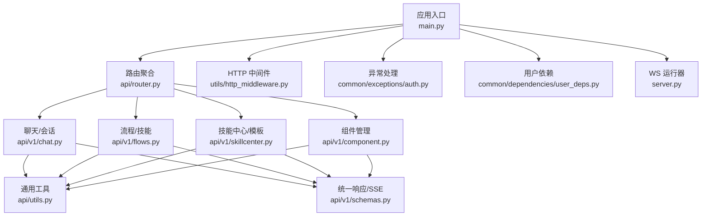
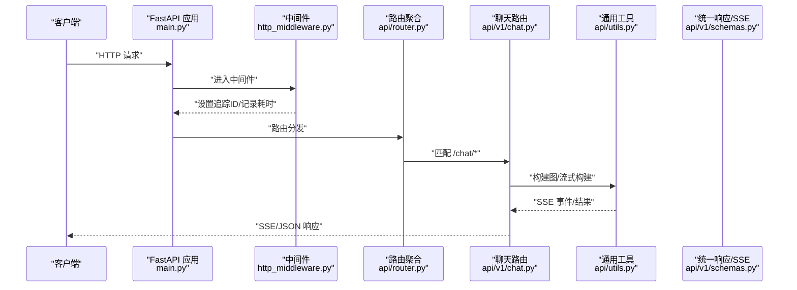
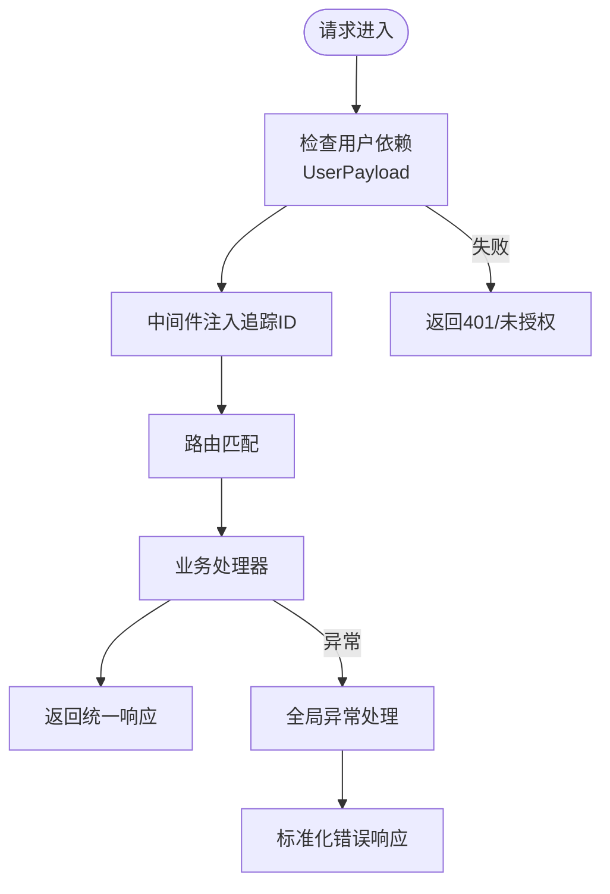
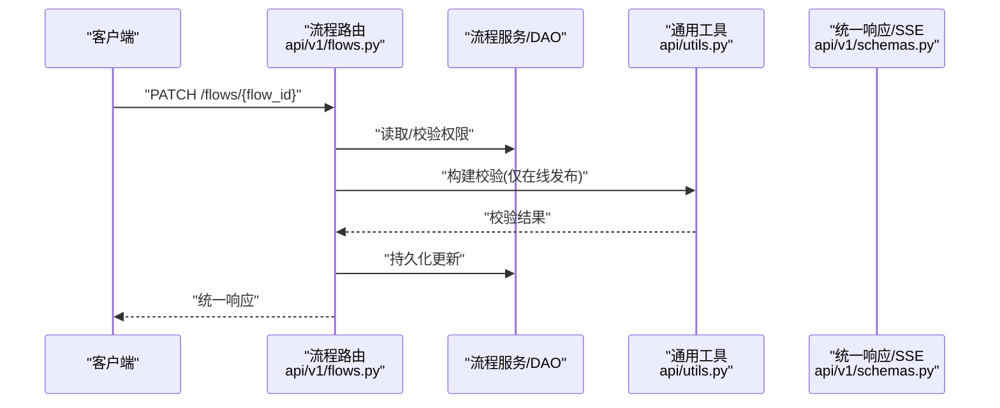
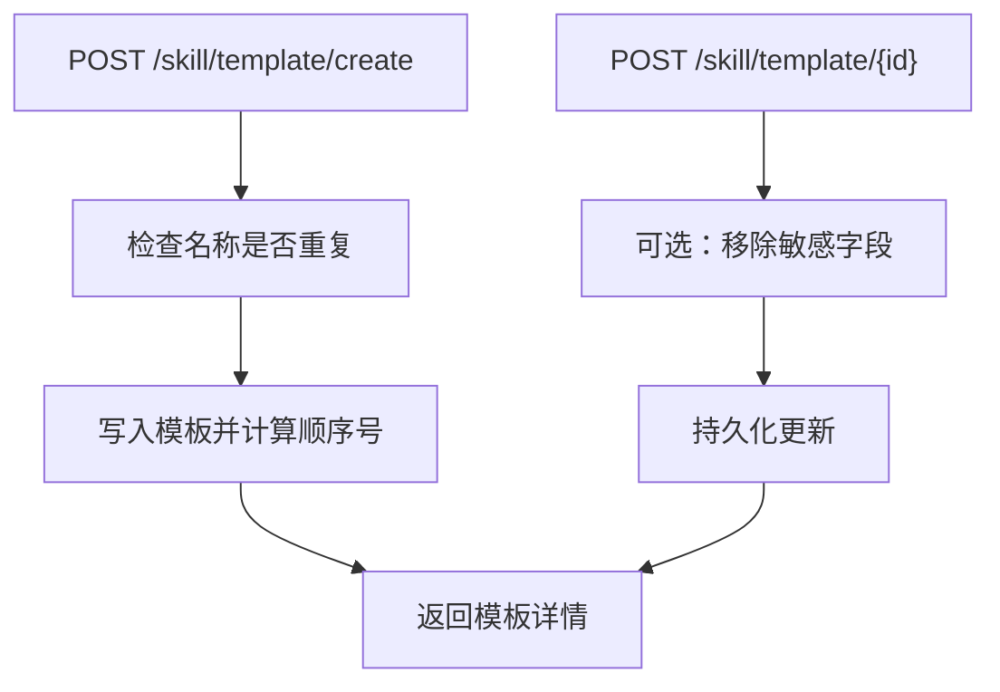
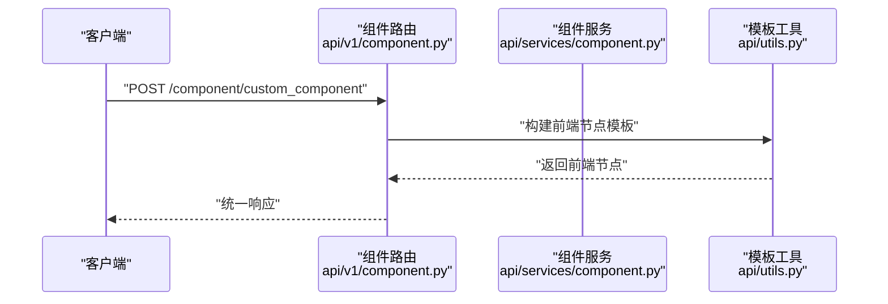
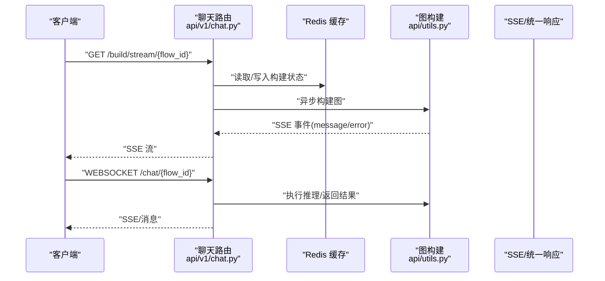
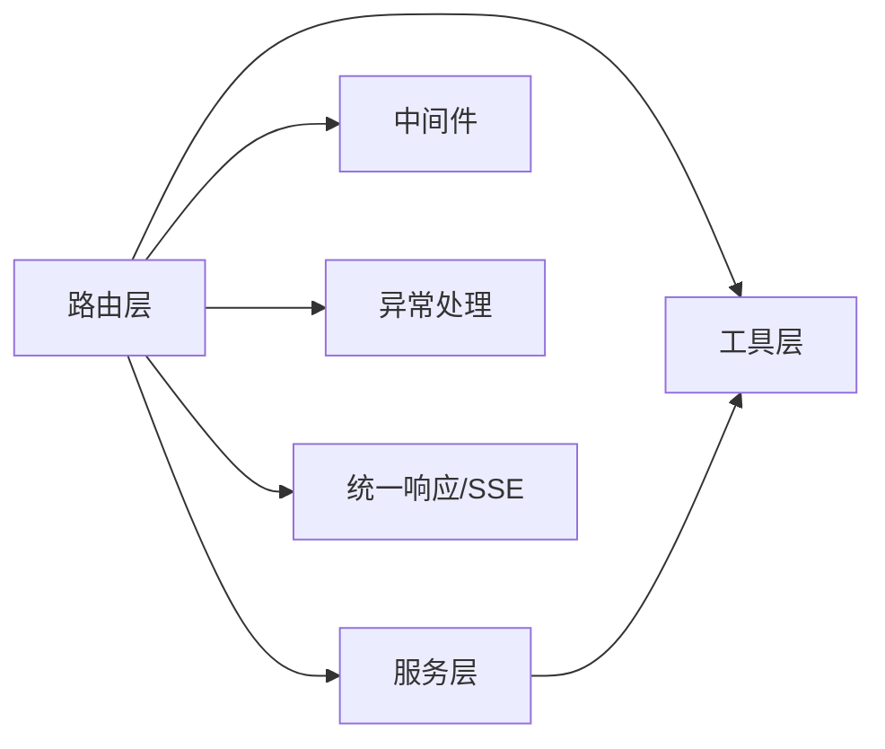

# API 组件

<cite>
**本文引用的文件**
- [src/backend/bisheng/main.py](file://src/backend/bisheng/main.py)
- [src/backend/bisheng/server.py](file://src/backend/bisheng/server.py)
- [src/backend/bisheng/api/router.py](file://src/backend/bisheng/api/router.py)
- [src/backend/bisheng/api/utils.py](file://src/backend/bisheng/api/utils.py)
- [src/backend/bisheng/api/v1/chat.py](file://src/backend/bisheng/api/v1/chat.py)
- [src/backend/bisheng/api/v1/flows.py](file://src/backend/bisheng/api/v1/flows.py)
- [src/backend/bisheng/api/v1/skillcenter.py](file://src/backend/bisheng/api/v1/skillcenter.py)
- [src/backend/bisheng/api/v1/component.py](file://src/backend/bisheng/api/v1/component.py)
- [src/backend/bisheng/api/v1/schemas.py](file://src/backend/bisheng/api/v1/schemas.py)
- [src/backend/bisheng/common/dependencies/user_deps.py](file://src/backend/bisheng/common/dependencies/user_deps.py)
- [src/backend/bisheng/api/services/component.py](file://src/backend/bisheng/api/services/component.py)
- [src/backend/bisheng/utils/http_middleware.py](file://src/backend/bisheng/utils/http_middleware.py)
- [src/backend/bisheng/common/exceptions/auth.py](file://src/backend/bisheng/common/exceptions/auth.py)
- [src/backend/bisheng/common/constants/enums/telemetry.py](file://src/backend/bisheng/common/constants/enums/telemetry.py)
</cite>

## 目录
1. [简介](#简介)
2. [项目结构](#项目结构)
3. [核心组件](#核心组件)
4. [架构总览](#架构总览)
5. [详细组件分析](#详细组件分析)
6. [依赖关系分析](#依赖关系分析)
7. [性能考量](#性能考量)
8. [故障排查指南](#故障排查指南)
9. [结论](#结论)
10. [附录](#附录)

## 简介
本文件面向 API 组件系统，聚焦以下能力与职责：
- API 访问控制与认证：基于用户依赖注入与中间件的统一鉴权入口，以及异常处理策略。
- 流程 API 访问：技能（Skill）、工作流（Workflow）与模板版本管理，支持在线校验、版本对比与流式构建。
- 技能 API 访问：通过 WebSocket 提供实时对话与流式构建，结合 Redis 缓存与 SSE 事件流。
- 数据传输协议：统一响应模型、SSE 事件格式、WebSocket 消息类型与参数约束。
- 组件 API：自定义组件的保存、更新、加载与前端节点模板生成。
- 安全策略：敏感信息过滤、CORS 配置、中间件日志与追踪头。
- 性能监控与调试：中间件统计、追踪 ID、SSE 错误回传与异常处理。

## 项目结构
后端采用 FastAPI 构建，路由按功能域拆分，核心入口负责组装路由与中间件，工具模块提供通用能力，服务层封装业务逻辑，依赖层提供用户上下文与访问控制。

图表来源
- [src/backend/bisheng/main.py](file://src/backend/bisheng/main.py#L64-L102)
- [src/backend/bisheng/api/router.py](file://src/backend/bisheng/api/router.py#L1-L61)
- [src/backend/bisheng/api/v1/chat.py](file://src/backend/bisheng/api/v1/chat.py#L49-L719)
- [src/backend/bisheng/api/v1/flows.py](file://src/backend/bisheng/api/v1/flows.py#L26-L226)
- [src/backend/bisheng/api/v1/skillcenter.py](file://src/backend/bisheng/api/v1/skillcenter.py#L16-L110)
- [src/backend/bisheng/api/v1/component.py](file://src/backend/bisheng/api/v1/component.py#L12-L89)
- [src/backend/bisheng/utils/http_middleware.py](file://src/backend/bisheng/utils/http_middleware.py#L12-L47)
- [src/backend/bisheng/api/utils.py](file://src/backend/bisheng/api/utils.py#L1-L382)
- [src/backend/bisheng/api/v1/schemas.py](file://src/backend/bisheng/api/v1/schemas.py#L69-L232)
- [src/backend/bisheng/server.py](file://src/backend/bisheng/server.py#L4-L21)

章节来源
- [src/backend/bisheng/main.py](file://src/backend/bisheng/main.py#L64-L102)
- [src/backend/bisheng/api/router.py](file://src/backend/bisheng/api/router.py#L1-L61)

## 核心组件
- 应用入口与生命周期
  - 创建 FastAPI 实例、注册中间件（CORS、自定义 HTTP、WebSocket 日志）、全局异常处理器、健康检查端点与路由挂载。
  - 生命周期钩子负责初始化应用上下文、服务与默认数据，退出时清理资源。
- 路由聚合
  - v1 路由聚合多条子路由（聊天、流程、技能中心、组件、知识、LLM、工作台等），v2 路由提供开放接口前缀。
- 通用工具
  - 图构建与流式构建、输入键响应构造、敏感信息过滤、URL 内容下载、模板字段更新、缓存键生成等。
- 服务层
  - 组件服务封装 CRUD 与存在性校验；流程服务负责版本管理、在线校验、版本对比与 Hook。
- 中间件与异常
  - 自定义 HTTP 中间件记录请求与耗时、注入追踪 ID；WebSocket 中间件注入追踪 ID；统一异常处理返回标准响应。
- 统一响应与事件
  - 统一响应模型、SSE 事件数据结构、WebSocket 类型枚举与消息体校验。

章节来源
- [src/backend/bisheng/main.py](file://src/backend/bisheng/main.py#L21-L102)
- [src/backend/bisheng/api/router.py](file://src/backend/bisheng/api/router.py#L23-L61)
- [src/backend/bisheng/api/utils.py](file://src/backend/bisheng/api/utils.py#L71-L155)
- [src/backend/bisheng/api/v1/schemas.py](file://src/backend/bisheng/api/v1/schemas.py#L69-L232)
- [src/backend/bisheng/utils/http_middleware.py](file://src/backend/bisheng/utils/http_middleware.py#L12-L47)

## 架构总览
下图展示从客户端到后端 API 的典型交互路径，涵盖认证、中间件、路由、服务与工具链。

图表来源
- [src/backend/bisheng/main.py](file://src/backend/bisheng/main.py#L64-L102)
- [src/backend/bisheng/utils/http_middleware.py](file://src/backend/bisheng/utils/http_middleware.py#L12-L33)
- [src/backend/bisheng/api/router.py](file://src/backend/bisheng/api/router.py#L23-L61)
- [src/backend/bisheng/api/v1/chat.py](file://src/backend/bisheng/api/v1/chat.py#L510-L565)
- [src/backend/bisheng/api/utils.py](file://src/backend/bisheng/api/utils.py#L71-L155)
- [src/backend/bisheng/api/v1/schemas.py](file://src/backend/bisheng/api/v1/schemas.py#L224-L232)

## 详细组件分析

### 认证与访问控制
- 用户依赖注入
  - 通过用户依赖类注入当前登录用户上下文，所有受保护路由均依赖该依赖以获取用户标识与权限。
- 中间件与追踪
  - HTTP 中间件注入 X-Trace-ID 并记录请求耗时；WebSocket 中间件在 WS 握手阶段注入追踪 ID。
- 异常处理
  - 全局异常处理器统一返回标准响应；JWT 解码异常单独处理并返回 401。
- CORS 与安全
  - 默认允许跨域请求；生产环境建议限制具体来源。

图表来源
- [src/backend/bisheng/common/dependencies/user_deps.py](file://src/backend/bisheng/common/dependencies/user_deps.py#L4-L6)
- [src/backend/bisheng/utils/http_middleware.py](file://src/backend/bisheng/utils/http_middleware.py#L12-L33)
- [src/backend/bisheng/common/exceptions/auth.py](file://src/backend/bisheng/common/exceptions/auth.py#L1-L16)
- [src/backend/bisheng/main.py](file://src/backend/bisheng/main.py#L21-L49)

章节来源
- [src/backend/bisheng/common/dependencies/user_deps.py](file://src/backend/bisheng/common/dependencies/user_deps.py#L4-L6)
- [src/backend/bisheng/utils/http_middleware.py](file://src/backend/bisheng/utils/http_middleware.py#L12-L47)
- [src/backend/bisheng/common/exceptions/auth.py](file://src/backend/bisheng/common/exceptions/auth.py#L1-L16)
- [src/backend/bisheng/main.py](file://src/backend/bisheng/main.py#L21-L102)

### 流程 API（技能/工作流）
- 能力概览
  - 技能/工作流的创建、查询、更新、删除、版本管理与在线校验。
  - 版本对比支持流式输出，便于前端增量渲染。
- 关键流程
  - 在线发布前进行构建校验，确保图可被成功实例化。
  - 更新时对敏感字段进行过滤，保障密钥不外泄。
- 参数与响应
  - 使用统一响应模型与版本比较请求模型；SSE 事件用于版本对比过程反馈。

图表来源
- [src/backend/bisheng/api/v1/flows.py](file://src/backend/bisheng/api/v1/flows.py#L126-L171)
- [src/backend/bisheng/api/utils.py](file://src/backend/bisheng/api/utils.py#L158-L169)
- [src/backend/bisheng/api/v1/schemas.py](file://src/backend/bisheng/api/v1/schemas.py#L69-L87)

章节来源
- [src/backend/bisheng/api/v1/flows.py](file://src/backend/bisheng/api/v1/flows.py#L26-L226)
- [src/backend/bisheng/api/utils.py](file://src/backend/bisheng/api/utils.py#L158-L169)
- [src/backend/bisheng/api/v1/schemas.py](file://src/backend/bisheng/api/v1/schemas.py#L69-L87)

### 技能 API（模板与版本）
- 能力概览
  - 模板创建、查询、更新、删除；名称重复校验；顺序号维护。
  - 更新时可选择移除敏感字段，避免泄露。
- 参数与约束
  - 支持按名称、类型、分页查询；更新时排除敏感字段（如 API Key）。

图表来源
- [src/backend/bisheng/api/v1/skillcenter.py](file://src/backend/bisheng/api/v1/skillcenter.py#L20-L96)

章节来源
- [src/backend/bisheng/api/v1/skillcenter.py](file://src/backend/bisheng/api/v1/skillcenter.py#L16-L110)
- [src/backend/bisheng/api/utils.py](file://src/backend/bisheng/api/utils.py#L22-L33)

### 组件 API（自定义组件）
- 能力概览
  - 列表、保存、更新、删除自定义组件。
  - 支持从原始代码构建前端节点模板，并与原始前端节点合并模板值。
- 处理流程
  - 保存/更新时写入用户信息与版本号；删除按用户与名称定位。
  - 加载时读取文件内容并构建模板，支持字段级更新。

图表来源
- [src/backend/bisheng/api/v1/component.py](file://src/backend/bisheng/api/v1/component.py#L50-L61)
- [src/backend/bisheng/api/services/component.py](file://src/backend/bisheng/api/services/component.py#L9-L41)
- [src/backend/bisheng/api/utils.py](file://src/backend/bisheng/api/utils.py#L347-L365)

章节来源
- [src/backend/bisheng/api/v1/component.py](file://src/backend/bisheng/api/v1/component.py#L12-L89)
- [src/backend/bisheng/api/services/component.py](file://src/backend/bisheng/api/services/component.py#L9-L41)
- [src/backend/bisheng/api/utils.py](file://src/backend/bisheng/api/utils.py#L347-L365)

### 聊天 API（WebSocket 与流式构建）
- 能力概览
  - 会话列表、历史查询、消息增删改、点赞/复制/评论、在线技能列表。
  - WebSocket 对话：建立连接、校验技能状态、流式构建图、下发输入键与内存键、执行推理。
  - 流式构建：初始化、状态轮询、事件流输出、错误回传。
- 数据协议
  - SSE 事件：message/error/end 等事件类型；统一响应模型；WebSocket 类型枚举。
  - 输入键响应：包含 input_keys/memory_keys/handle_keys，用于前端表单渲染。
- 错误与重试
  - 构建失败或未就绪时通过 SSE 返回错误事件；WebSocket 侧捕获异常并关闭连接。
  - 会话删除时清理临时向量库与审计日志。

图表来源
- [src/backend/bisheng/api/v1/chat.py](file://src/backend/bisheng/api/v1/chat.py#L567-L719)
- [src/backend/bisheng/api/utils.py](file://src/backend/bisheng/api/utils.py#L71-L155)
- [src/backend/bisheng/api/v1/schemas.py](file://src/backend/bisheng/api/v1/schemas.py#L224-L232)

章节来源
- [src/backend/bisheng/api/v1/chat.py](file://src/backend/bisheng/api/v1/chat.py#L49-L719)
- [src/backend/bisheng/api/utils.py](file://src/backend/bisheng/api/utils.py#L71-L155)
- [src/backend/bisheng/api/v1/schemas.py](file://src/backend/bisheng/api/v1/schemas.py#L28-L35)

## 依赖关系分析
- 组件耦合
  - 路由层仅负责分发，业务逻辑集中在服务层与工具层，保持高内聚低耦合。
  - 中间件与异常处理作为横切关注点，贯穿所有路由。
- 外部依赖
  - Redis 用于构建状态缓存与会话管理；数据库通过 DAO/Service 层抽象。
  - SSE 与 WebSocket 作为实时通信载体，分别用于状态轮询与长连接对话。
- 循环依赖
  - 当前结构未见循环导入；路由聚合与各模块解耦良好。

图表来源
- [src/backend/bisheng/api/router.py](file://src/backend/bisheng/api/router.py#L23-L61)
- [src/backend/bisheng/api/v1/chat.py](file://src/backend/bisheng/api/v1/chat.py#L49-L719)
- [src/backend/bisheng/api/v1/flows.py](file://src/backend/bisheng/api/v1/flows.py#L26-L226)
- [src/backend/bisheng/api/utils.py](file://src/backend/bisheng/api/utils.py#L1-L382)
- [src/backend/bisheng/api/v1/schemas.py](file://src/backend/bisheng/api/v1/schemas.py#L69-L232)
- [src/backend/bisheng/utils/http_middleware.py](file://src/backend/bisheng/utils/http_middleware.py#L12-L47)
- [src/backend/bisheng/common/exceptions/auth.py](file://src/backend/bisheng/common/exceptions/auth.py#L1-L16)

章节来源
- [src/backend/bisheng/api/router.py](file://src/backend/bisheng/api/router.py#L23-L61)
- [src/backend/bisheng/api/v1/chat.py](file://src/backend/bisheng/api/v1/chat.py#L49-L719)
- [src/backend/bisheng/api/v1/flows.py](file://src/backend/bisheng/api/v1/flows.py#L26-L226)
- [src/backend/bisheng/api/utils.py](file://src/backend/bisheng/api/utils.py#L1-L382)
- [src/backend/bisheng/api/v1/schemas.py](file://src/backend/bisheng/api/v1/schemas.py#L69-L232)
- [src/backend/bisheng/utils/http_middleware.py](file://src/backend/bisheng/utils/http_middleware.py#L12-L47)
- [src/backend/bisheng/common/exceptions/auth.py](file://src/backend/bisheng/common/exceptions/auth.py#L1-L16)

## 性能考量
- 中间件统计
  - HTTP 中间件记录处理时间与追踪 ID，便于定位慢请求。
- 构建缓存
  - Redis 缓存构建状态与图数据，避免重复构建；超时控制减少内存占用。
- 流式输出
  - SSE 与异步迭代器降低首屏延迟，提升用户体验。
- 线程池与进程
  - 应用启动时初始化线程池，服务退出时回收资源；WS 运行器使用 Gunicorn 托管。

章节来源
- [src/backend/bisheng/utils/http_middleware.py](file://src/backend/bisheng/utils/http_middleware.py#L12-L33)
- [src/backend/bisheng/api/v1/chat.py](file://src/backend/bisheng/api/v1/chat.py#L567-L621)
- [src/backend/bisheng/server.py](file://src/backend/bisheng/server.py#L4-L21)
- [src/backend/bisheng/main.py](file://src/backend/bisheng/main.py#L52-L61)

## 故障排查指南
- 认证失败
  - 检查用户依赖注入是否生效；确认中间件已注入追踪 ID；查看全局异常处理器对 JWT 解码错误的处理。
- 构建失败
  - 查看 SSE 错误事件与日志；确认 Redis 中构建状态；检查图节点构建顺序与参数。
- 权限不足
  - 确认用户对资源的访问类型（读/写）；检查服务层的访问控制逻辑。
- WebSocket 断开
  - 捕获异常并返回统一错误消息；检查技能状态与版本数据是否就绪。
- 版本对比异常
  - 确认输入参数与版本 ID；查看流式事件中的错误回传。

章节来源
- [src/backend/bisheng/common/exceptions/auth.py](file://src/backend/bisheng/common/exceptions/auth.py#L1-L16)
- [src/backend/bisheng/api/v1/chat.py](file://src/backend/bisheng/api/v1/chat.py#L559-L565)
- [src/backend/bisheng/api/v1/flows.py](file://src/backend/bisheng/api/v1/flows.py#L137-L155)
- [src/backend/bisheng/api/v1/schemas.py](file://src/backend/bisheng/api/v1/schemas.py#L224-L232)

## 结论
本 API 组件系统通过清晰的路由分层、统一的响应模型与中间件体系，实现了对聊天、流程、技能与组件的完整覆盖。借助 Redis 缓存与 SSE/WS 实时通信，系统在易用性与性能上取得平衡。建议在生产环境中进一步完善 CORS 白名单、密钥过滤策略与可观测性指标采集。

## 附录
- 统一响应模型
  - 字段：status_code、status_message、data；成功与错误均有固定结构。
- SSE 事件模型
  - 字段：event、data；字符串化用于客户端解析。
- WebSocket 类型
  - 包含 start/stream/end/error/info/file/begin/close/end_cover/over 等类型，用于消息语义区分。

章节来源
- [src/backend/bisheng/api/v1/schemas.py](file://src/backend/bisheng/api/v1/schemas.py#L69-L87)
- [src/backend/bisheng/api/v1/schemas.py](file://src/backend/bisheng/api/v1/schemas.py#L224-L232)
- [src/backend/bisheng/api/v1/schemas.py](file://src/backend/bisheng/api/v1/schemas.py#L159-L177)