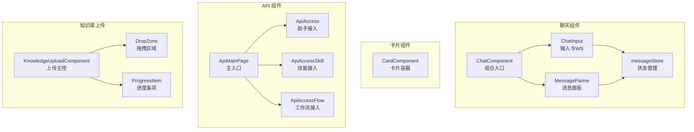
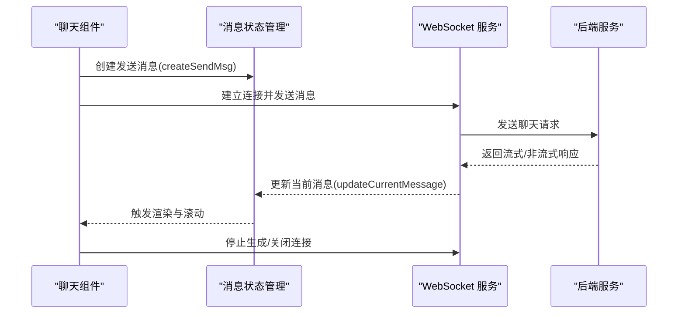
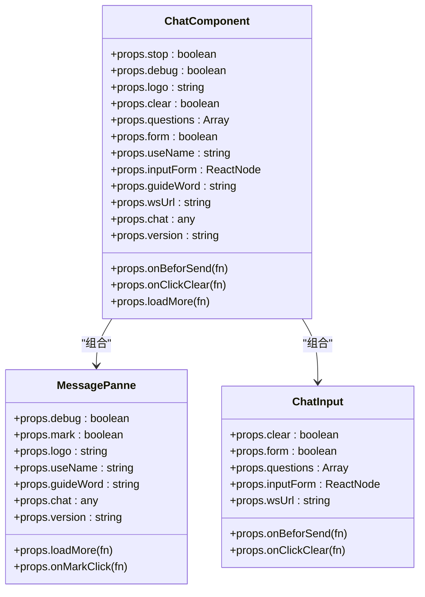
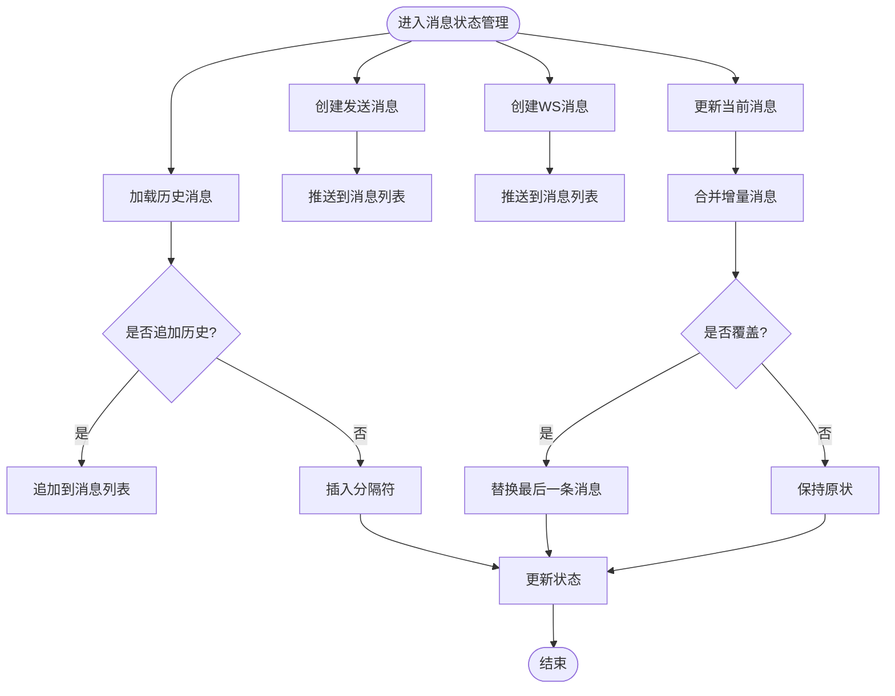
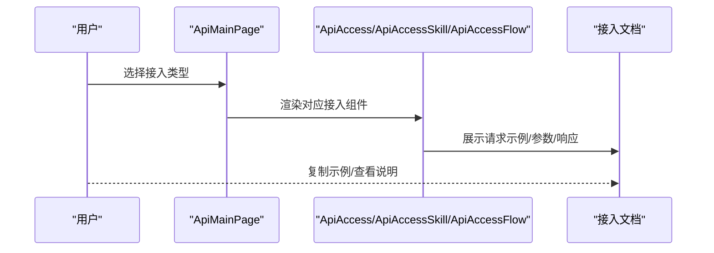
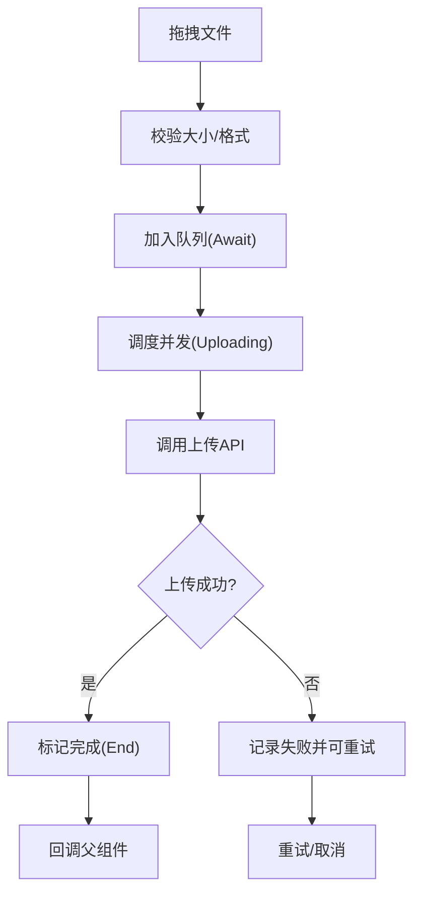
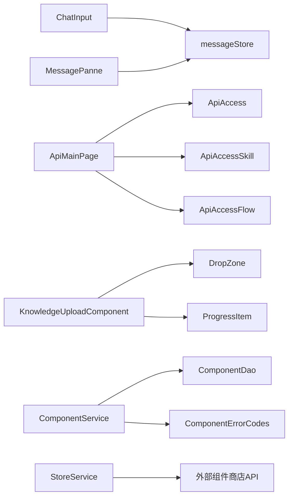

# BS-Comp 业务组件

<cite>
**本文引用的文件**
- [src/frontend/platform/src/components/bs-comp/chatComponent/index.tsx](file://src/frontend/platform/src/components/bs-comp/chatComponent/index.tsx)
- [src/frontend/platform/src/components/bs-comp/chatComponent/ChatInput.tsx](file://src/frontend/platform/src/components/bs-comp/chatComponent/ChatInput.tsx)
- [src/frontend/platform/src/components/bs-comp/chatComponent/MessagePanne.tsx](file://src/frontend/platform/src/components/bs-comp/chatComponent/MessagePanne.tsx)
- [src/frontend/platform/src/components/bs-comp/chatComponent/messageStore.ts](file://src/frontend/platform/src/components/bs-comp/chatComponent/messageStore.ts)
- [src/frontend/platform/src/components/bs-comp/cardComponent/index.tsx](file://src/frontend/platform/src/components/bs-comp/cardComponent/index.tsx)
- [src/frontend/platform/src/components/bs-comp/apiComponent/index.tsx](file://src/frontend/platform/src/components/bs-comp/apiComponent/index.tsx)
- [src/frontend/platform/src/components/bs-comp/apiComponent/ApiAccess.tsx](file://src/frontend/platform/src/components/bs-comp/apiComponent/ApiAccess.tsx)
- [src/frontend/platform/src/components/bs-comp/apiComponent/ApiAccessFlow.tsx](file://src/frontend/platform/src/components/bs-comp/apiComponent/ApiAccessFlow.tsx)
- [src/frontend/platform/src/components/bs-comp/apiComponent/ApiAccessSkill.tsx](file://src/frontend/platform/src/components/bs-comp/apiComponent/ApiAccessSkill.tsx)
- [src/frontend/platform/src/components/bs-comp/knowledgeUploadComponent/index.tsx](file://src/frontend/platform/src/components/bs-comp/knowledgeUploadComponent/index.tsx)
- [src/frontend/platform/src/components/bs-comp/knowledgeUploadComponent/DropZone.tsx](file://src/frontend/platform/src/components/bs-comp/knowledgeUploadComponent/DropZone.tsx)
- [src/frontend/platform/src/components/bs-comp/knowledgeUploadComponent/ProgressItem.tsx](file://src/frontend/platform/src/components/bs-comp/knowledgeUploadComponent/ProgressItem.tsx)
- [src/frontend/platform/src/pages/ChatAppPage/components/ChatHome.tsx](file://src/frontend/platform/src/pages/ChatAppPage/components/ChatHome.tsx)
- [src/backend/bisheng/api/services/component.py](file://src/backend/bisheng/api/services/component.py)
- [src/backend/bisheng/database/models/component.py](file://src/backend/bisheng/database/models/component.py)
- [src/backend/bisheng/common/errcode/component.py](file://src/backend/bisheng/common/errcode/component.py)
- [src/backend/bisheng/services/store/service.py](file://src/backend/bisheng/services/store/service.py)
</cite>

## 目录
1. [简介](#简介)
2. [项目结构](#项目结构)
3. [核心组件](#核心组件)
4. [架构总览](#架构总览)
5. [详细组件分析](#详细组件分析)
6. [依赖分析](#依赖分析)
7. [性能考量](#性能考量)
8. [故障排查指南](#故障排查指南)
9. [结论](#结论)
10. [附录](#附录)

## 简介
本文件系统性梳理 BS-Comp 业务组件库，聚焦平台特定的业务组件实现，包括聊天组件、卡片组件、API 组件、知识库上传组件等。文档化各组件的功能特性、配置选项、事件回调机制，说明组件间的协作关系、数据流转与状态管理，提供使用示例、参数配置与扩展方法，并给出性能优化策略、错误处理机制与调试技巧，展示组件在实际业务场景中的应用模式。

## 项目结构
BS-Comp 位于前端平台组件目录，按功能域划分：
- 聊天组件：负责消息渲染、输入交互、WebSocket 通信与消息状态管理
- 卡片组件：通用卡片容器，支持多种布局与交互行为
- API 组件：提供助手、技能、工作流三种接入方式的文档与示例
- 知识库上传组件：文件拖拽、并发上传、进度跟踪与结果反馈

图表来源
- [src/frontend/platform/src/components/bs-comp/chatComponent/index.tsx](file://src/frontend/platform/src/components/bs-comp/chatComponent/index.tsx#L1-L27)
- [src/frontend/platform/src/components/bs-comp/chatComponent/MessagePanne.tsx](file://src/frontend/platform/src/components/bs-comp/chatComponent/MessagePanne.tsx#L1-L165)
- [src/frontend/platform/src/components/bs-comp/chatComponent/ChatInput.tsx](file://src/frontend/platform/src/components/bs-comp/chatComponent/ChatInput.tsx#L1-L394)
- [src/frontend/platform/src/components/bs-comp/chatComponent/messageStore.ts](file://src/frontend/platform/src/components/bs-comp/chatComponent/messageStore.ts#L1-L343)
- [src/frontend/platform/src/components/bs-comp/cardComponent/index.tsx](file://src/frontend/platform/src/components/bs-comp/cardComponent/index.tsx#L1-L197)
- [src/frontend/platform/src/components/bs-comp/apiComponent/index.tsx](file://src/frontend/platform/src/components/bs-comp/apiComponent/index.tsx#L1-L113)
- [src/frontend/platform/src/components/bs-comp/apiComponent/ApiAccess.tsx](file://src/frontend/platform/src/components/bs-comp/apiComponent/ApiAccess.tsx#L1-L272)
- [src/frontend/platform/src/components/bs-comp/apiComponent/ApiAccessSkill.tsx](file://src/frontend/platform/src/components/bs-comp/apiComponent/ApiAccessSkill.tsx#L1-L309)
- [src/frontend/platform/src/components/bs-comp/apiComponent/ApiAccessFlow.tsx](file://src/frontend/platform/src/components/bs-comp/apiComponent/ApiAccessFlow.tsx#L1-L1080)
- [src/frontend/platform/src/components/bs-comp/knowledgeUploadComponent/index.tsx](file://src/frontend/platform/src/components/bs-comp/knowledgeUploadComponent/index.tsx#L1-L182)
- [src/frontend/platform/src/components/bs-comp/knowledgeUploadComponent/DropZone.tsx](file://src/frontend/platform/src/components/bs-comp/knowledgeUploadComponent/DropZone.tsx#L1-L65)
- [src/frontend/platform/src/components/bs-comp/knowledgeUploadComponent/ProgressItem.tsx](file://src/frontend/platform/src/components/bs-comp/knowledgeUploadComponent/ProgressItem.tsx#L1-L137)

章节来源
- [src/frontend/platform/src/components/bs-comp/chatComponent/index.tsx](file://src/frontend/platform/src/components/bs-comp/chatComponent/index.tsx#L1-L27)
- [src/frontend/platform/src/components/bs-comp/cardComponent/index.tsx](file://src/frontend/platform/src/components/bs-comp/cardComponent/index.tsx#L1-L197)
- [src/frontend/platform/src/components/bs-comp/apiComponent/index.tsx](file://src/frontend/platform/src/components/bs-comp/apiComponent/index.tsx#L1-L113)
- [src/frontend/platform/src/components/bs-comp/knowledgeUploadComponent/index.tsx](file://src/frontend/platform/src/components/bs-comp/knowledgeUploadComponent/index.tsx#L1-L182)

## 核心组件
- 聊天组件：提供消息面板与输入区域，封装 WebSocket 通信、消息状态管理与引导问题展示
- 卡片组件：统一卡片 UI，支持新建、编辑、开关、设置、删除等操作
- API 组件：提供助手、技能、工作流三种接入方式的接入文档与示例代码
- 知识库上传组件：支持拖拽上传、并发控制、进度跟踪与结果反馈

章节来源
- [src/frontend/platform/src/components/bs-comp/chatComponent/MessagePanne.tsx](file://src/frontend/platform/src/components/bs-comp/chatComponent/MessagePanne.tsx#L1-L165)
- [src/frontend/platform/src/components/bs-comp/chatComponent/ChatInput.tsx](file://src/frontend/platform/src/components/bs-comp/chatComponent/ChatInput.tsx#L1-L394)
- [src/frontend/platform/src/components/bs-comp/cardComponent/index.tsx](file://src/frontend/platform/src/components/bs-comp/cardComponent/index.tsx#L1-L197)
- [src/frontend/platform/src/components/bs-comp/apiComponent/ApiAccess.tsx](file://src/frontend/platform/src/components/bs-comp/apiComponent/ApiAccess.tsx#L1-L272)
- [src/frontend/platform/src/components/bs-comp/knowledgeUploadComponent/index.tsx](file://src/frontend/platform/src/components/bs-comp/knowledgeUploadComponent/index.tsx#L1-L182)

## 架构总览
BS-Comp 的前端架构围绕“组件-状态-通信”三层展开：
- 组件层：各业务组件职责清晰，通过 props 与回调进行解耦
- 状态层：聊天消息采用集中式状态管理，统一处理历史加载、滚动、流式更新与覆盖逻辑
- 通信层：聊天组件通过 WebSocket 与后端实时通信，API 组件提供接入文档与示例，知识库上传组件通过独立 API 完成文件上传

图表来源
- [src/frontend/platform/src/components/bs-comp/chatComponent/ChatInput.tsx](file://src/frontend/platform/src/components/bs-comp/chatComponent/ChatInput.tsx#L105-L220)
- [src/frontend/platform/src/components/bs-comp/chatComponent/messageStore.ts](file://src/frontend/platform/src/components/bs-comp/chatComponent/messageStore.ts#L167-L291)

## 详细组件分析

### 聊天组件（ChatComponent）
- 组合入口：将消息面板与输入区域组合，提供 logo、debug、版本号、引导词等配置
- 输入区域：支持表单弹出、引导问题、清屏、停止生成、语音转文字等
- 消息面板：根据消息类别渲染不同消息类型，支持滚动加载历史、自动滚动、分隔符与运行日志
- 状态管理：通过集中式 store 管理消息、历史、滚动与引导问题显示

图表来源
- [src/frontend/platform/src/components/bs-comp/chatComponent/index.tsx](file://src/frontend/platform/src/components/bs-comp/chatComponent/index.tsx#L1-L27)
- [src/frontend/platform/src/components/bs-comp/chatComponent/MessagePanne.tsx](file://src/frontend/platform/src/components/bs-comp/chatComponent/MessagePanne.tsx#L1-L165)
- [src/frontend/platform/src/components/bs-comp/chatComponent/ChatInput.tsx](file://src/frontend/platform/src/components/bs-comp/chatComponent/ChatInput.tsx#L1-L394)

章节来源
- [src/frontend/platform/src/components/bs-comp/chatComponent/index.tsx](file://src/frontend/platform/src/components/bs-comp/chatComponent/index.tsx#L1-L27)
- [src/frontend/platform/src/components/bs-comp/chatComponent/MessagePanne.tsx](file://src/frontend/platform/src/components/bs-comp/chatComponent/MessagePanne.tsx#L1-L165)
- [src/frontend/platform/src/components/bs-comp/chatComponent/ChatInput.tsx](file://src/frontend/platform/src/components/bs-comp/chatComponent/ChatInput.tsx#L1-L394)

### 消息状态管理（messageStore）
- 职责：统一管理聊天消息、历史消息、滚动控制、引导问题显示、消息创建与更新
- 关键能力：
  - 历史加载与分页：支持加载更多历史、过滤非同一会话消息
  - 消息创建：发送消息、开始消息、运行日志消息
  - 流式更新：合并增量消息、处理思考日志、覆盖逻辑
  - 分隔符与系统消息：插入分隔符、系统提示消息
  - 清空与销毁：清空消息、销毁会话

图表来源
- [src/frontend/platform/src/components/bs-comp/chatComponent/messageStore.ts](file://src/frontend/platform/src/components/bs-comp/chatComponent/messageStore.ts#L102-L139)
- [src/frontend/platform/src/components/bs-comp/chatComponent/messageStore.ts](file://src/frontend/platform/src/components/bs-comp/chatComponent/messageStore.ts#L148-L291)

章节来源
- [src/frontend/platform/src/components/bs-comp/chatComponent/messageStore.ts](file://src/frontend/platform/src/components/bs-comp/chatComponent/messageStore.ts#L1-L343)

### 卡片组件（CardComponent）
- 功能：通用卡片容器，支持新建卡片、编辑态开关、设置、删除、添加模板等
- 特性：根据类型渲染不同布局，支持头像、描述、标签面板、脚部徽章等
- 交互：支持点击、开关切换、删除、设置、添加模板等回调

章节来源
- [src/frontend/platform/src/components/bs-comp/cardComponent/index.tsx](file://src/frontend/platform/src/components/bs-comp/cardComponent/index.tsx#L1-L197)

### API 组件（ApiMainPage 与接入文档）
- 主入口：根据类型（助手/技能/工作流）切换不同接入文档
- 接入文档：
  - 助手接入：提供请求示例、参数说明、响应结构
  - 技能接入：提供技能 ID、输入参数、会话参数、tweaks 参数与示例
  - 工作流接入：提供执行与停止接口、事件类型与处理方式、输入输出 schema

图表来源
- [src/frontend/platform/src/components/bs-comp/apiComponent/index.tsx](file://src/frontend/platform/src/components/bs-comp/apiComponent/index.tsx#L28-L82)
- [src/frontend/platform/src/components/bs-comp/apiComponent/ApiAccess.tsx](file://src/frontend/platform/src/components/bs-comp/apiComponent/ApiAccess.tsx#L32-L272)
- [src/frontend/platform/src/components/bs-comp/apiComponent/ApiAccessSkill.tsx](file://src/frontend/platform/src/components/bs-comp/apiComponent/ApiAccessSkill.tsx#L17-L309)
- [src/frontend/platform/src/components/bs-comp/apiComponent/ApiAccessFlow.tsx](file://src/frontend/platform/src/components/bs-comp/apiComponent/ApiAccessFlow.tsx#L20-L1080)

章节来源
- [src/frontend/platform/src/components/bs-comp/apiComponent/index.tsx](file://src/frontend/platform/src/components/bs-comp/apiComponent/index.tsx#L1-L113)
- [src/frontend/platform/src/components/bs-comp/apiComponent/ApiAccess.tsx](file://src/frontend/platform/src/components/bs-comp/apiComponent/ApiAccess.tsx#L1-L272)
- [src/frontend/platform/src/components/bs-comp/apiComponent/ApiAccessSkill.tsx](file://src/frontend/platform/src/components/bs-comp/apiComponent/ApiAccessSkill.tsx#L1-L309)
- [src/frontend/platform/src/components/bs-comp/apiComponent/ApiAccessFlow.tsx](file://src/frontend/platform/src/components/bs-comp/apiComponent/ApiAccessFlow.tsx#L1-L1080)

### 知识库上传组件（KnowledgeUploadComponent）
- 功能：拖拽上传、并发调度、进度跟踪、结果反馈
- 并发控制：最多 6 个并发任务，自动调度等待与上传任务
- 进度项：支持上传中、完成、失败状态，失败可重试，支持取消
- 文件校验：大小限制、格式过滤、重复文件名检测

图表来源
- [src/frontend/platform/src/components/bs-comp/knowledgeUploadComponent/index.tsx](file://src/frontend/platform/src/components/bs-comp/knowledgeUploadComponent/index.tsx#L40-L137)
- [src/frontend/platform/src/components/bs-comp/knowledgeUploadComponent/DropZone.tsx](file://src/frontend/platform/src/components/bs-comp/knowledgeUploadComponent/DropZone.tsx#L19-L51)
- [src/frontend/platform/src/components/bs-comp/knowledgeUploadComponent/ProgressItem.tsx](file://src/frontend/platform/src/components/bs-comp/knowledgeUploadComponent/ProgressItem.tsx#L21-L61)

章节来源
- [src/frontend/platform/src/components/bs-comp/knowledgeUploadComponent/index.tsx](file://src/frontend/platform/src/components/bs-comp/knowledgeUploadComponent/index.tsx#L1-L182)
- [src/frontend/platform/src/components/bs-comp/knowledgeUploadComponent/DropZone.tsx](file://src/frontend/platform/src/components/bs-comp/knowledgeUploadComponent/DropZone.tsx#L1-L65)
- [src/frontend/platform/src/components/bs-comp/knowledgeUploadComponent/ProgressItem.tsx](file://src/frontend/platform/src/components/bs-comp/knowledgeUploadComponent/ProgressItem.tsx#L1-L137)

## 依赖分析
- 组件间依赖
  - ChatComponent 组合 MessagePanne 与 ChatInput
  - ChatInput 依赖 messageStore 进行消息状态管理
  - API 组件通过路由参数动态选择接入文档
  - 知识库上传组件依赖 DropZone 与 ProgressItem
- 后端集成
  - 组件服务与模型：组件的增删改查与错误码定义
  - 组件商店服务：搜索、过滤、分页查询与计数

图表来源
- [src/frontend/platform/src/components/bs-comp/chatComponent/ChatInput.tsx](file://src/frontend/platform/src/components/bs-comp/chatComponent/ChatInput.tsx#L1-L394)
- [src/frontend/platform/src/components/bs-comp/chatComponent/messageStore.ts](file://src/frontend/platform/src/components/bs-comp/chatComponent/messageStore.ts#L1-L343)
- [src/frontend/platform/src/components/bs-comp/apiComponent/index.tsx](file://src/frontend/platform/src/components/bs-comp/apiComponent/index.tsx#L1-L113)
- [src/frontend/platform/src/components/bs-comp/knowledgeUploadComponent/index.tsx](file://src/frontend/platform/src/components/bs-comp/knowledgeUploadComponent/index.tsx#L1-L182)
- [src/backend/bisheng/api/services/component.py](file://src/backend/bisheng/api/services/component.py#L1-L32)
- [src/backend/bisheng/database/models/component.py](file://src/backend/bisheng/database/models/component.py#L29-L66)
- [src/backend/bisheng/common/errcode/component.py](file://src/backend/bisheng/common/errcode/component.py#L1-L12)
- [src/backend/bisheng/services/store/service.py](file://src/backend/bisheng/services/store/service.py#L149-L504)

章节来源
- [src/backend/bisheng/api/services/component.py](file://src/backend/bisheng/api/services/component.py#L1-L32)
- [src/backend/bisheng/database/models/component.py](file://src/backend/bisheng/database/models/component.py#L29-L66)
- [src/backend/bisheng/common/errcode/component.py](file://src/backend/bisheng/common/errcode/component.py#L1-L12)
- [src/backend/bisheng/services/store/service.py](file://src/backend/bisheng/services/store/service.py#L149-L504)

## 性能考量
- 聊天组件
  - 消息自动滚动节流：滚动事件节流，避免频繁 DOM 操作
  - 历史加载防抖：滚动至顶部时触发加载，设置查询锁防止重复请求
  - WebSocket 单例：避免重复连接，降低资源消耗
- 知识库上传
  - 并发上限：固定最大并发，避免资源争用
  - 进度回调：仅在必要时更新 UI，减少重绘
  - 取消上传：支持 AbortController 取消未完成请求
- API 组件
  - 示例代码复制：使用一次性复制动作，避免重复渲染
  - 语法高亮：按需渲染，减少不必要的计算

章节来源
- [src/frontend/platform/src/components/bs-comp/chatComponent/MessagePanne.tsx](file://src/frontend/platform/src/components/bs-comp/chatComponent/MessagePanne.tsx#L25-L71)
- [src/frontend/platform/src/components/bs-comp/chatComponent/ChatInput.tsx](file://src/frontend/platform/src/components/bs-comp/chatComponent/ChatInput.tsx#L121-L220)
- [src/frontend/platform/src/components/bs-comp/knowledgeUploadComponent/index.tsx](file://src/frontend/platform/src/components/bs-comp/knowledgeUploadComponent/index.tsx#L45-L74)
- [src/frontend/platform/src/components/bs-comp/knowledgeUploadComponent/ProgressItem.tsx](file://src/frontend/platform/src/components/bs-comp/knowledgeUploadComponent/ProgressItem.tsx#L19-L61)
- [src/frontend/platform/src/components/bs-comp/apiComponent/ApiAccess.tsx](file://src/frontend/platform/src/components/bs-comp/apiComponent/ApiAccess.tsx#L84-L99)

## 故障排查指南
- 聊天组件
  - WebSocket 连接失败：检查 wsUrl 与协议（wss/ws），确认后端服务可用
  - 消息重复或未闭合：检查流式更新与覆盖逻辑，确保消息 id 唯一
  - 停止生成无效：确认 stop 状态与禁用条件，避免在锁定状态下触发
- 知识库上传
  - 文件过大：检查 appConfig.uploadFileMaxSize，提示用户调整
  - 格式不支持：DropZone 会提示不支持的扩展名，确认允许的格式集合
  - 上传失败：查看 onFail 回调，支持重试与取消
- API 组件
  - 请求示例复制：确认复制动作与消息提示
  - 参数缺失：核对必填参数与示例，确保请求体正确
- 后端组件服务
  - 组件存在/不存在：根据错误码判断组件是否已存在或不存在
  - 权限与密钥：检查 API Key 与授权状态，避免 401/403

章节来源
- [src/frontend/platform/src/components/bs-comp/chatComponent/ChatInput.tsx](file://src/frontend/platform/src/components/bs-comp/chatComponent/ChatInput.tsx#L105-L220)
- [src/frontend/platform/src/components/bs-comp/knowledgeUploadComponent/DropZone.tsx](file://src/frontend/platform/src/components/bs-comp/knowledgeUploadComponent/DropZone.tsx#L32-L51)
- [src/frontend/platform/src/components/bs-comp/knowledgeUploadComponent/ProgressItem.tsx](file://src/frontend/platform/src/components/bs-comp/knowledgeUploadComponent/ProgressItem.tsx#L44-L56)
- [src/backend/bisheng/common/errcode/component.py](file://src/backend/bisheng/common/errcode/component.py#L1-L12)
- [src/backend/bisheng/services/store/service.py](file://src/backend/bisheng/services/store/service.py#L491-L499)

## 结论
BS-Comp 业务组件库通过清晰的职责划分与状态管理，实现了聊天、卡片、API、知识库上传等核心业务能力。组件间通过 props 与回调解耦，配合集中式状态管理与后端服务，满足复杂业务场景下的交互与数据流转需求。建议在实际使用中关注性能优化与错误处理，结合示例与参数配置快速落地。

## 附录
- 使用示例与参数配置
  - 聊天组件：通过 ChatComponent 传入 wsUrl、onBeforSend、onClickClear 等回调，配置引导词与表单弹出
  - 卡片组件：通过 CardComponent 传入标题、描述、类型、回调等，支持多种布局与交互
  - API 组件：通过 ApiMainPage 选择接入类型，查看对应接入文档与示例
  - 知识库上传组件：通过 KnowledgeUploadComponent 传入知识库 ID、文件变更回调与初始文件列表
- 扩展方法
  - 聊天组件：自定义消息类型渲染、扩展 WebSocket 事件处理
  - 卡片组件：扩展头部选择器、标签面板与脚部徽章
  - API 组件：新增接入类型与示例代码
  - 知识库上传组件：扩展文件类型、上传策略与进度 UI

章节来源
- [src/frontend/platform/src/components/bs-comp/chatComponent/index.tsx](file://src/frontend/platform/src/components/bs-comp/chatComponent/index.tsx#L1-L27)
- [src/frontend/platform/src/components/bs-comp/cardComponent/index.tsx](file://src/frontend/platform/src/components/bs-comp/cardComponent/index.tsx#L16-L38)
- [src/frontend/platform/src/components/bs-comp/apiComponent/index.tsx](file://src/frontend/platform/src/components/bs-comp/apiComponent/index.tsx#L20-L26)
- [src/frontend/platform/src/components/bs-comp/knowledgeUploadComponent/index.tsx](file://src/frontend/platform/src/components/bs-comp/knowledgeUploadComponent/index.tsx#L23-L30)
- [src/frontend/platform/src/pages/ChatAppPage/components/ChatHome.tsx](file://src/frontend/platform/src/pages/ChatAppPage/components/ChatHome.tsx#L141-L155)