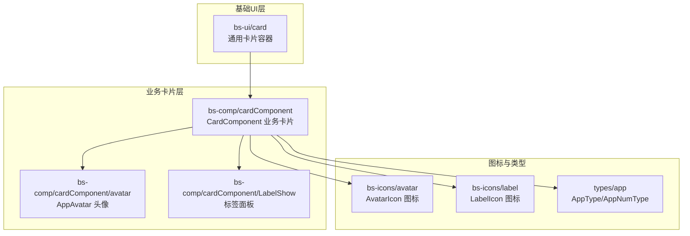
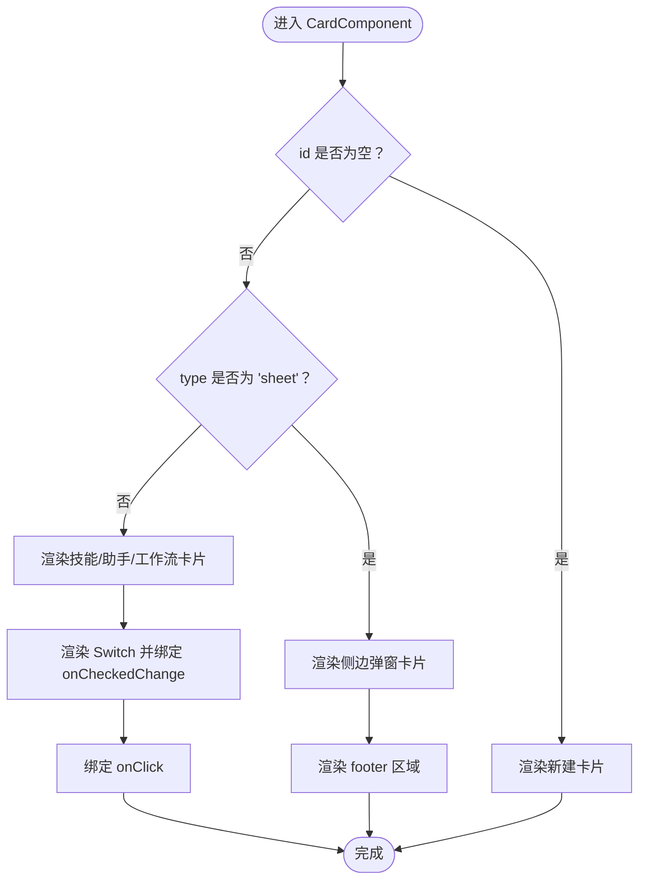
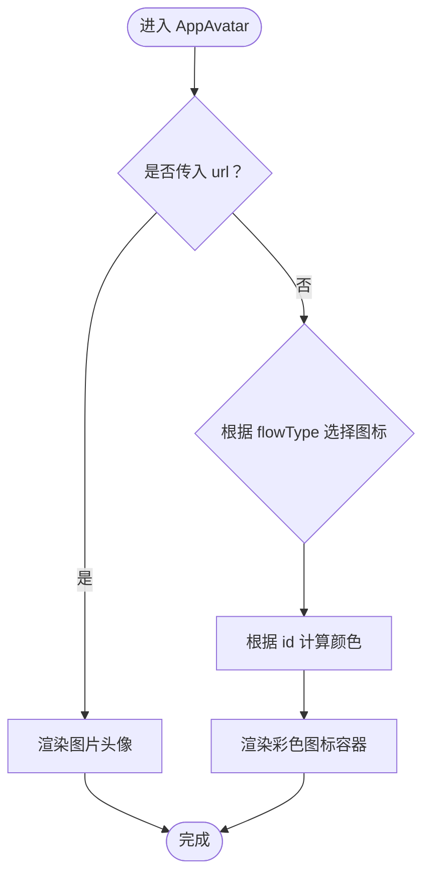
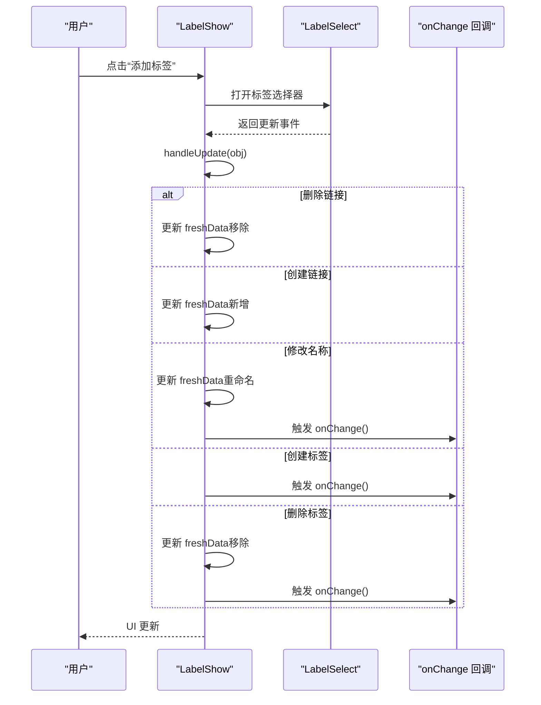
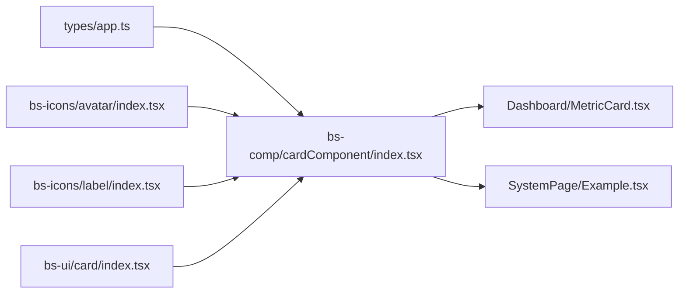

# 卡片组件

<cite>
**本文引用的文件**
- [src/frontend/platform/src/components/bs-comp/cardComponent/index.tsx](file://src/frontend/platform/src/components/bs-comp/cardComponent/index.tsx)
- [src/frontend/platform/src/components/bs-comp/cardComponent/avatar.tsx](file://src/frontend/platform/src/components/bs-comp/cardComponent/avatar.tsx)
- [src/frontend/platform/src/components/bs-comp/cardComponent/LabelShow.tsx](file://src/frontend/platform/src/components/bs-comp/cardComponent/LabelShow.tsx)
- [src/frontend/platform/src/components/bs-ui/card/index.tsx](file://src/frontend/platform/src/components/bs-ui/card/index.tsx)
- [src/frontend/platform/src/components/bs-icons/avatar/index.tsx](file://src/frontend/platform/src/components/bs-icons/avatar/index.tsx)
- [src/frontend/platform/src/components/bs-icons/label/index.tsx](file://src/frontend/platform/src/components/bs-icons/label/index.tsx)
- [src/frontend/platform/src/types/app.ts](file://src/frontend/platform/src/types/app.ts)
- [src/frontend/platform/src/pages/BuildPage/skills/CardSelectVersion.tsx](file://src/frontend/platform/src/pages/BuildPage/skills/CardSelectVersion.tsx)
- [src/frontend/platform/src/pages/Dashboard/components/charts/MetricCard.tsx](file://src/frontend/platform/src/pages/Dashboard/components/charts/MetricCard.tsx)
- [src/frontend/client/src/components/Prompts/Groups/ListCard.tsx](file://src/frontend/client/src/components/Prompts/Groups/ListCard.tsx)
- [src/frontend/client/src/components/ui/Card.tsx](file://src/frontend/client/src/components/ui/Card.tsx)
- [src/frontend/platform/src/pages/SystemPage/theme/Example.tsx](file://src/frontend/platform/src/pages/SystemPage/theme/Example.tsx)
</cite>

## 目录
1. [简介](#简介)
2. [项目结构](#项目结构)
3. [核心组件](#核心组件)
4. [架构总览](#架构总览)
5. [组件详解](#组件详解)
6. [依赖关系分析](#依赖关系分析)
7. [性能与可访问性](#性能与可访问性)
8. [故障排查指南](#故障排查指南)
9. [结论](#结论)
10. [附录：使用示例与最佳实践](#附录使用示例与最佳实践)

## 简介
本技术文档聚焦于“卡片组件系统”，围绕标签显示、头像组件等核心能力，系统阐述其设计模式、样式定制、交互行为、数据绑定与状态管理、事件处理机制，并提供主题适配、响应式布局与无障碍支持建议。文档同时给出在不同业务场景下的布局组合与视觉优化方法，帮助开发者快速理解并正确使用卡片组件。

## 项目结构
卡片组件体系由三部分构成：
- 基础卡片 UI 组件：封装通用的卡片容器与子块（头部、标题、描述、内容、页脚）。
- 卡片业务组件：面向具体业务（技能、助手、工作流、新建卡片、侧边弹窗卡片）的卡片容器，负责布局、交互与事件分发。
- 卡片配套能力：头像组件（支持图片与图标）、标签面板（增删改查标签并联动 UI 展示）。



**图示来源**
- [src/frontend/platform/src/components/bs-ui/card/index.tsx](file://src/frontend/platform/src/components/bs-ui/card/index.tsx#L1-L76)
- [src/frontend/platform/src/components/bs-comp/cardComponent/index.tsx](file://src/frontend/platform/src/components/bs-comp/cardComponent/index.tsx#L1-L197)
- [src/frontend/platform/src/components/bs-comp/cardComponent/avatar.tsx](file://src/frontend/platform/src/components/bs-comp/cardComponent/avatar.tsx#L1-L38)
- [src/frontend/platform/src/components/bs-comp/cardComponent/LabelShow.tsx](file://src/frontend/platform/src/components/bs-comp/cardComponent/LabelShow.tsx#L1-L123)
- [src/frontend/platform/src/components/bs-icons/avatar/index.tsx](file://src/frontend/platform/src/components/bs-icons/avatar/index.tsx#L1-L10)
- [src/frontend/platform/src/components/bs-icons/label/index.tsx](file://src/frontend/platform/src/components/bs-icons/label/index.tsx#L1-L10)
- [src/frontend/platform/src/types/app.ts](file://src/frontend/platform/src/types/app.ts#L1-L27)

**章节来源**
- [src/frontend/platform/src/components/bs-ui/card/index.tsx](file://src/frontend/platform/src/components/bs-ui/card/index.tsx#L1-L76)
- [src/frontend/platform/src/components/bs-comp/cardComponent/index.tsx](file://src/frontend/platform/src/components/bs-comp/cardComponent/index.tsx#L1-L197)
- [src/frontend/platform/src/components/bs-comp/cardComponent/avatar.tsx](file://src/frontend/platform/src/components/bs-comp/cardComponent/avatar.tsx#L1-L38)
- [src/frontend/platform/src/components/bs-comp/cardComponent/LabelShow.tsx](file://src/frontend/platform/src/components/bs-comp/cardComponent/LabelShow.tsx#L1-L123)
- [src/frontend/platform/src/components/bs-icons/avatar/index.tsx](file://src/frontend/platform/src/components/bs-icons/avatar/index.tsx#L1-L10)
- [src/frontend/platform/src/components/bs-icons/label/index.tsx](file://src/frontend/platform/src/components/bs-icons/label/index.tsx#L1-L10)
- [src/frontend/platform/src/types/app.ts](file://src/frontend/platform/src/types/app.ts#L1-L27)

## 核心组件
- 通用卡片容器：提供统一的卡片结构（头部、标题、描述、内容、页脚），并内置悬停阴影、边框等通用样式。
- 业务卡片容器：根据类型（新建、普通、侧边弹窗、技能/助手/工作流列表）渲染不同布局；支持开关切换、操作按钮、用户信息展示、标签面板等。
- 头像组件：支持图片头像与图标头像，按 ID 计算颜色，保证视觉一致性。
- 标签面板：支持标签增删改查、权限控制、与资源对象关联，动态更新 UI 展示。

**章节来源**
- [src/frontend/platform/src/components/bs-ui/card/index.tsx](file://src/frontend/platform/src/components/bs-ui/card/index.tsx#L1-L76)
- [src/frontend/platform/src/components/bs-comp/cardComponent/index.tsx](file://src/frontend/platform/src/components/bs-comp/cardComponent/index.tsx#L1-L197)
- [src/frontend/platform/src/components/bs-comp/cardComponent/avatar.tsx](file://src/frontend/platform/src/components/bs-comp/cardComponent/avatar.tsx#L1-L38)
- [src/frontend/platform/src/components/bs-comp/cardComponent/LabelShow.tsx](file://src/frontend/platform/src/components/bs-comp/cardComponent/LabelShow.tsx#L1-L123)

## 架构总览
卡片组件采用“基础 UI + 业务容器 + 能力插件”的分层设计：
- 基础 UI 层：提供卡片容器与子块，确保一致的视觉与交互基线。
- 业务容器层：根据业务形态（新建、列表、侧边弹窗）选择性渲染，注入图标、开关、按钮、标签等能力。
- 能力插件层：头像、标签面板等可复用能力通过 props 注入，降低耦合度。

```mermaid
classDiagram
class Card {
+HTMLAttributes
+className
}
class CardHeader
class CardTitle
class CardDescription
class CardContent
class CardFooter
class CardComponent {
+props : IProps
+render() : JSX.Element
+handleCheckedChange()
}
class AppAvatar {
+props : {id, flowType, url, className}
+render() : JSX.Element
}
class LabelShow {
+props : {data, user, all, type, onChange}
+render() : JSX.Element
+handleUpdate()
}
CardComponent --> Card : "使用"
CardComponent --> CardHeader : "使用"
CardComponent --> CardTitle : "使用"
CardComponent --> CardDescription : "使用"
CardComponent --> CardContent : "使用"
CardComponent --> CardFooter : "使用"
CardComponent --> AppAvatar : "使用"
CardComponent --> LabelShow : "使用"
```

**图示来源**
- [src/frontend/platform/src/components/bs-ui/card/index.tsx](file://src/frontend/platform/src/components/bs-ui/card/index.tsx#L1-L76)
- [src/frontend/platform/src/components/bs-comp/cardComponent/index.tsx](file://src/frontend/platform/src/components/bs-comp/cardComponent/index.tsx#L1-L197)
- [src/frontend/platform/src/components/bs-comp/cardComponent/avatar.tsx](file://src/frontend/platform/src/components/bs-comp/cardComponent/avatar.tsx#L1-L38)
- [src/frontend/platform/src/components/bs-comp/cardComponent/LabelShow.tsx](file://src/frontend/platform/src/components/bs-comp/cardComponent/LabelShow.tsx#L1-L123)

## 组件详解

### 通用卡片容器（bs-ui/card）
- 设计要点：基于 Radix UI 的 forwardRef 封装，提供统一的 className 合并策略，内置悬停阴影与暗色主题边框。
- 使用建议：作为业务卡片的基础容器，避免重复定义样式；如需覆盖，通过 className 扩展。

**章节来源**
- [src/frontend/platform/src/components/bs-ui/card/index.tsx](file://src/frontend/platform/src/components/bs-ui/card/index.tsx#L1-L76)

### 业务卡片容器（CardComponent）
- 数据模型与状态
  - 输入参数：data、id、logo、type、title、description、checked、user、currentUser、labelPannel、isAdmin、headSelecter、footer、onClick、onSwitchClick、onAddTemp、onCheckedChange、onDelete、onSetting。
  - 内部状态：本地 checked 状态，用于受控/非受控切换。
- 渲染分支
  - 新建卡片（id 为空）：带加号与引导文案，点击进入创建流程。
  - 侧边弹窗卡片（type 为 sheet）：紧凑布局，适合列表滚动场景。
  - 技能/助手/工作流列表卡片：完整布局，包含开关、标签面板、用户信息、操作按钮。
- 交互行为
  - 开关切换：支持编辑态下触发 onCheckedChange 并回滚（返回 false 时阻止本地状态变更）。
  - 操作按钮：管理员或具备权限时显示添加模板、删除等按钮；点击时阻止事件冒泡。
  - 标题图标背景：基于 id 计算渐变色，保持视觉一致性。
- 可扩展点
  - 通过 headSelecter 插入自定义选择器。
  - 通过 labelPannel 注入标签面板。
  - 通过 footer 注入自定义页脚区域。



**图示来源**
- [src/frontend/platform/src/components/bs-comp/cardComponent/index.tsx](file://src/frontend/platform/src/components/bs-comp/cardComponent/index.tsx#L70-L196)

**章节来源**
- [src/frontend/platform/src/components/bs-comp/cardComponent/index.tsx](file://src/frontend/platform/src/components/bs-comp/cardComponent/index.tsx#L1-L197)
- [src/frontend/platform/src/types/app.ts](file://src/frontend/platform/src/types/app.ts#L1-L27)

### 头像组件（AppAvatar）
- 功能：优先展示图片头像，否则根据类型选择图标，并按 id 计算颜色。
- 计算逻辑：取 id 前四位字符转十六进制，映射到预设渐变色数组，保证同 id 的颜色稳定。
- 使用：作为 CardComponent 的 logo 或用户头像展示。



**图示来源**
- [src/frontend/platform/src/components/bs-comp/cardComponent/avatar.tsx](file://src/frontend/platform/src/components/bs-comp/cardComponent/avatar.tsx#L14-L37)

**章节来源**
- [src/frontend/platform/src/components/bs-comp/cardComponent/avatar.tsx](file://src/frontend/platform/src/components/bs-comp/cardComponent/avatar.tsx#L1-L38)
- [src/frontend/platform/src/components/bs-icons/avatar/index.tsx](file://src/frontend/platform/src/components/bs-icons/avatar/index.tsx#L1-L10)

### 标签面板（LabelShow）
- 权限控制：根据 data.write、用户角色、所属组、创建者等判断是否可编辑。
- 数据绑定：内部维护 freshData（已选标签）、allData（全部标签），onChange 回调用于外部刷新。
- 事件处理：支持创建标签、修改名称、删除链接、删除标签等事件，统一通过 handleUpdate 分发。
- 渲染策略：无写权限仅展示；有写权限时区分操作者与普通用户，提供不同交互体验。



**图示来源**
- [src/frontend/platform/src/components/bs-comp/cardComponent/LabelShow.tsx](file://src/frontend/platform/src/components/bs-comp/cardComponent/LabelShow.tsx#L41-L68)

**章节来源**
- [src/frontend/platform/src/components/bs-comp/cardComponent/LabelShow.tsx](file://src/frontend/platform/src/components/bs-comp/cardComponent/LabelShow.tsx#L1-L123)

## 依赖关系分析
- 类型依赖：AppType/AppNumType 定义业务卡片类型枚举，影响卡片渲染分支与图标选择。
- 图标依赖：AvatarIcon、LabelIcon 提供图标资源，分别用于头像占位与标签入口。
- UI 依赖：CardComponent 依赖 bs-ui/card 的容器能力，形成稳定的 UI 基线。
- 页面集成：示例页面展示了卡片在仪表盘、系统主题示例中的使用方式。



**图示来源**
- [src/frontend/platform/src/types/app.ts](file://src/frontend/platform/src/types/app.ts#L1-L27)
- [src/frontend/platform/src/components/bs-comp/cardComponent/index.tsx](file://src/frontend/platform/src/components/bs-comp/cardComponent/index.tsx#L1-L197)
- [src/frontend/platform/src/components/bs-icons/avatar/index.tsx](file://src/frontend/platform/src/components/bs-icons/avatar/index.tsx#L1-L10)
- [src/frontend/platform/src/components/bs-icons/label/index.tsx](file://src/frontend/platform/src/components/bs-icons/label/index.tsx#L1-L10)
- [src/frontend/platform/src/components/bs-ui/card/index.tsx](file://src/frontend/platform/src/components/bs-ui/card/index.tsx#L1-L76)
- [src/frontend/platform/src/pages/Dashboard/components/charts/MetricCard.tsx](file://src/frontend/platform/src/pages/Dashboard/components/charts/MetricCard.tsx#L1-L215)
- [src/frontend/platform/src/pages/SystemPage/theme/Example.tsx](file://src/frontend/platform/src/pages/SystemPage/theme/Example.tsx#L146-L161)

**章节来源**
- [src/frontend/platform/src/types/app.ts](file://src/frontend/platform/src/types/app.ts#L1-L27)
- [src/frontend/platform/src/components/bs-comp/cardComponent/index.tsx](file://src/frontend/platform/src/components/bs-comp/cardComponent/index.tsx#L1-L197)
- [src/frontend/platform/src/components/bs-icons/avatar/index.tsx](file://src/frontend/platform/src/components/bs-icons/avatar/index.tsx#L1-L10)
- [src/frontend/platform/src/components/bs-icons/label/index.tsx](file://src/frontend/platform/src/components/bs-icons/label/index.tsx#L1-L10)
- [src/frontend/platform/src/components/bs-ui/card/index.tsx](file://src/frontend/platform/src/components/bs-ui/card/index.tsx#L1-L76)
- [src/frontend/platform/src/pages/Dashboard/components/charts/MetricCard.tsx](file://src/frontend/platform/src/pages/Dashboard/components/charts/MetricCard.tsx#L1-L215)
- [src/frontend/platform/src/pages/SystemPage/theme/Example.tsx](file://src/frontend/platform/src/pages/SystemPage/theme/Example.tsx#L146-L161)

## 性能与可访问性
- 性能
  - 颜色计算：头像颜色计算使用 useMemo 缓存，避免重复计算。
  - 列表渲染：卡片内容区设置固定高度与滚动条隐藏，减少布局抖动。
  - 事件冒泡：操作按钮点击时阻止冒泡，避免误触卡片点击。
- 可访问性
  - 键盘可达：卡片容器提供 role、tabIndex、aria-* 属性，便于键盘与读屏访问。
  - 文案国际化：使用 i18n 提供多语言文案，确保开关文本与提示语一致。
  - 对比度：深色主题下边框与悬停态对比度满足可读性要求。

**章节来源**
- [src/frontend/platform/src/components/bs-comp/cardComponent/avatar.tsx](file://src/frontend/platform/src/components/bs-comp/cardComponent/avatar.tsx#L16-L24)
- [src/frontend/platform/src/components/bs-comp/cardComponent/index.tsx](file://src/frontend/platform/src/components/bs-comp/cardComponent/index.tsx#L162-L168)
- [src/frontend/client/src/components/Prompts/Groups/ListCard.tsx](file://src/frontend/client/src/components/Prompts/Groups/ListCard.tsx#L25-L58)

## 故障排查指南
- 开关切换无效
  - 检查 onCheckedChange 是否返回 false 导致本地状态不更新。
  - 确认 edit 为 true 时才允许切换。
- 操作按钮不显示
  - 确认 isAdmin 或具备 write/write_by_group/write_by_creator 权限。
  - 确认卡片类型与业务卡片渲染分支匹配。
- 标签面板不更新
  - 确认 onChange 回调被调用，且外部刷新了数据源。
  - 检查事件类型是否在 handleUpdate 中被正确处理。
- 头像颜色异常
  - 检查 id 字符串前缀长度与字符编码转换结果，确保映射到有效索引。

**章节来源**
- [src/frontend/platform/src/components/bs-comp/cardComponent/index.tsx](file://src/frontend/platform/src/components/bs-comp/cardComponent/index.tsx#L96-L100)
- [src/frontend/platform/src/components/bs-comp/cardComponent/LabelShow.tsx](file://src/frontend/platform/src/components/bs-comp/cardComponent/LabelShow.tsx#L41-L68)
- [src/frontend/platform/src/components/bs-comp/cardComponent/avatar.tsx](file://src/frontend/platform/src/components/bs-comp/cardComponent/avatar.tsx#L16-L24)

## 结论
卡片组件系统通过“基础 UI + 业务容器 + 能力插件”的分层设计，实现了高内聚、低耦合的可复用能力。业务卡片容器以类型驱动渲染，结合头像与标签面板等能力，覆盖从新建到列表、从编辑到展示的全链路场景。配合权限控制、事件冒泡拦截与无障碍属性，既保证了良好的用户体验，也为多主题与多语言提供了扩展空间。

## 附录：使用示例与最佳实践

### 使用示例
- 基础卡片示例（系统主题页）
  - 示例路径：[src/frontend/platform/src/pages/SystemPage/theme/Example.tsx](file://src/frontend/platform/src/pages/SystemPage/theme/Example.tsx#L146-L161)
  - 说明：在示例页中直接使用 bs-ui/card 的 Card 组件，验证基础容器样式与交互。
- 业务卡片示例（仪表盘指标卡）
  - 示例路径：[src/frontend/platform/src/pages/Dashboard/components/charts/MetricCard.tsx](file://src/frontend/platform/src/pages/Dashboard/components/charts/MetricCard.tsx#L169-L215)
  - 说明：MetricCard 未直接使用 CardComponent，但展示了卡片容器在复杂布局中的应用思路。
- 列表卡片示例（客户端提示词卡片）
  - 示例路径：[src/frontend/client/src/components/Prompts/Groups/ListCard.tsx](file://src/frontend/client/src/components/Prompts/Groups/ListCard.tsx#L25-L58)
  - 说明：ListCard 展示了卡片在列表场景下的无障碍属性与交互设计。

**章节来源**
- [src/frontend/platform/src/pages/SystemPage/theme/Example.tsx](file://src/frontend/platform/src/pages/SystemPage/theme/Example.tsx#L146-L161)
- [src/frontend/platform/src/pages/Dashboard/components/charts/MetricCard.tsx](file://src/frontend/platform/src/pages/Dashboard/components/charts/MetricCard.tsx#L169-L215)
- [src/frontend/client/src/components/Prompts/Groups/ListCard.tsx](file://src/frontend/client/src/components/Prompts/Groups/ListCard.tsx#L25-L58)

### 主题适配与响应式设计
- 主题适配
  - 深色/浅色主题下边框与悬停态颜色差异已在 bs-ui/card 中内置，业务卡片可直接继承。
  - 若需进一步定制，可通过 className 覆盖关键变量（如边框、阴影、背景色）。
- 响应式布局
  - 卡片宽度固定（如 320px），在网格布局中保持对齐；在侧边弹窗场景使用紧凑尺寸（如 316px）。
  - 列表卡片可参考客户端 ListCard 的外层容器类名，实现 hover 效果与阴影过渡。

**章节来源**
- [src/frontend/platform/src/components/bs-ui/card/index.tsx](file://src/frontend/platform/src/components/bs-ui/card/index.tsx#L10-L16)
- [src/frontend/platform/src/components/bs-comp/cardComponent/index.tsx](file://src/frontend/platform/src/components/bs-comp/cardComponent/index.tsx#L122-L133)
- [src/frontend/client/src/components/Prompts/Groups/ListCard.tsx](file://src/frontend/client/src/components/Prompts/Groups/ListCard.tsx#L25-L58)

### 无障碍访问支持
- 键盘可达性：为卡片容器提供 role="button"、tabIndex、aria-labelledby/aria-describedby/aria-label。
- 文案与图标：为图标提供可读性文案或 aria-hidden 控制，避免重复读屏。
- 交互反馈：开关、按钮等交互元素提供可见反馈（如 hover 背景色变化）。

**章节来源**
- [src/frontend/client/src/components/Prompts/Groups/ListCard.tsx](file://src/frontend/client/src/components/Prompts/Groups/ListCard.tsx#L25-L58)
- [src/frontend/platform/src/components/bs-comp/cardComponent/index.tsx](file://src/frontend/platform/src/components/bs-comp/cardComponent/index.tsx#L162-L168)

### 不同业务场景下的布局组合
- 新建卡片：适用于“+ 新建”入口，强调引导性与点击反馈。
- 列表卡片：适用于技能/助手/工作流列表，强调信息密度与操作按钮显隐。
- 侧边弹窗卡片：适用于弹窗/抽屉内的卡片列表，强调紧凑与滚动友好。
- 标签面板：与业务卡片组合，提供标签管理与权限控制。

**章节来源**
- [src/frontend/platform/src/components/bs-comp/cardComponent/index.tsx](file://src/frontend/platform/src/components/bs-comp/cardComponent/index.tsx#L102-L153)
- [src/frontend/platform/src/components/bs-comp/cardComponent/LabelShow.tsx](file://src/frontend/platform/src/components/bs-comp/cardComponent/LabelShow.tsx#L74-L121)