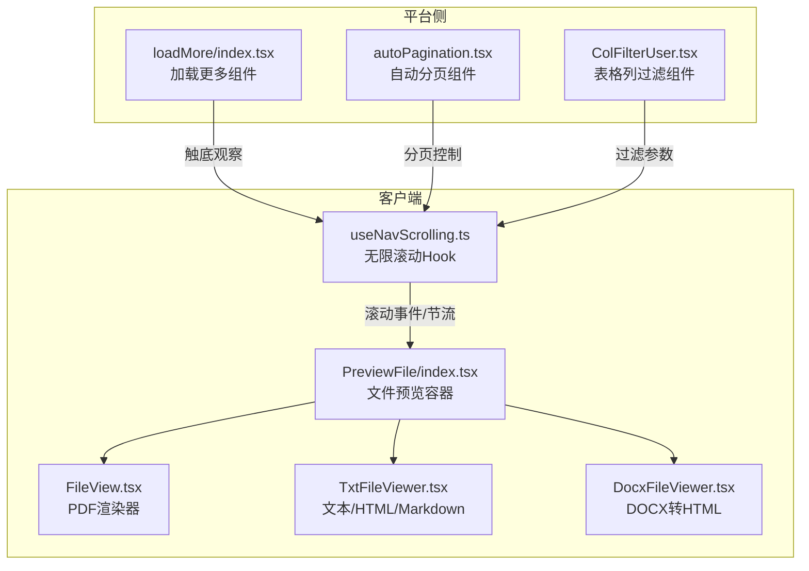
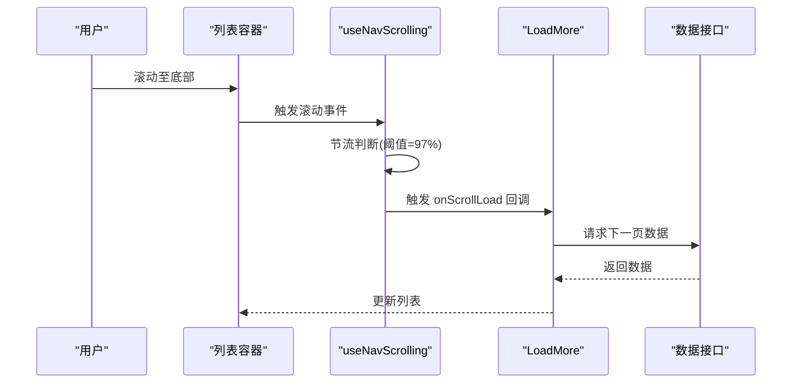
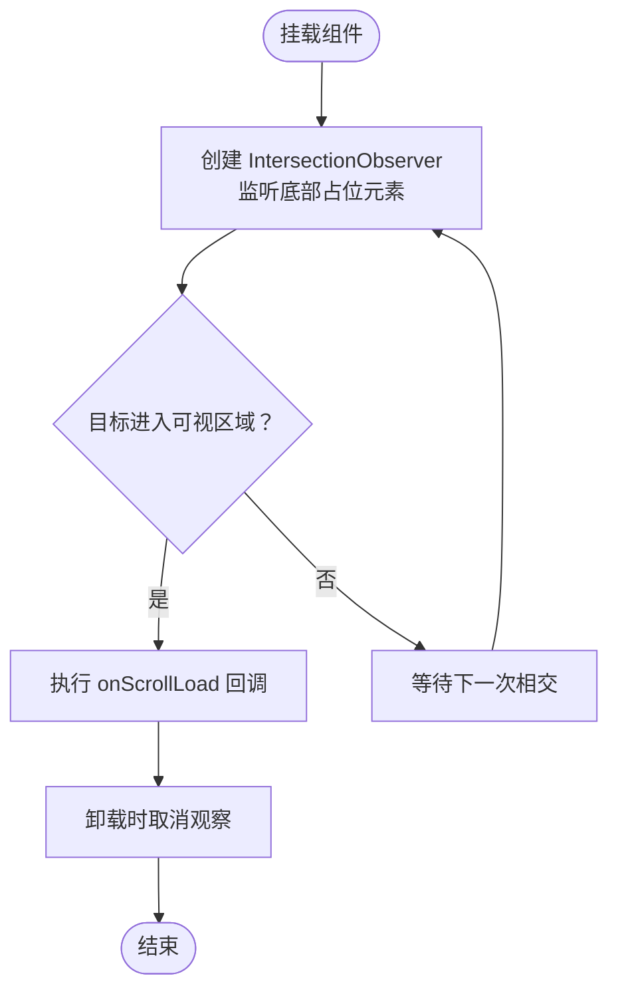
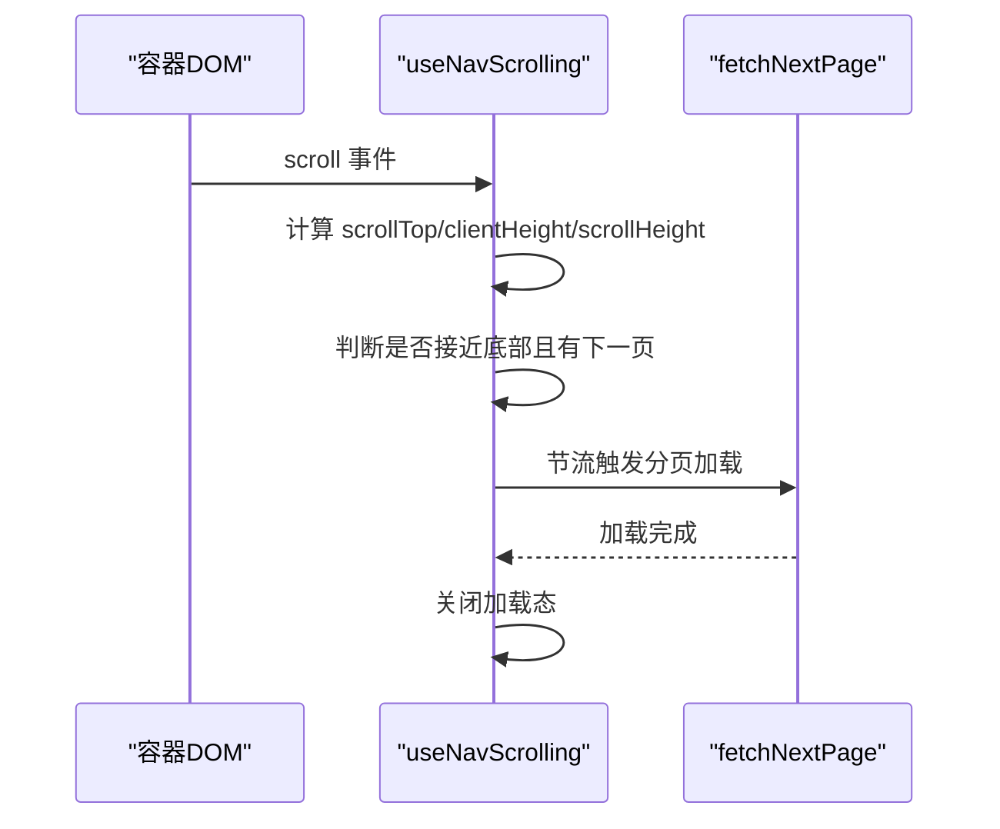
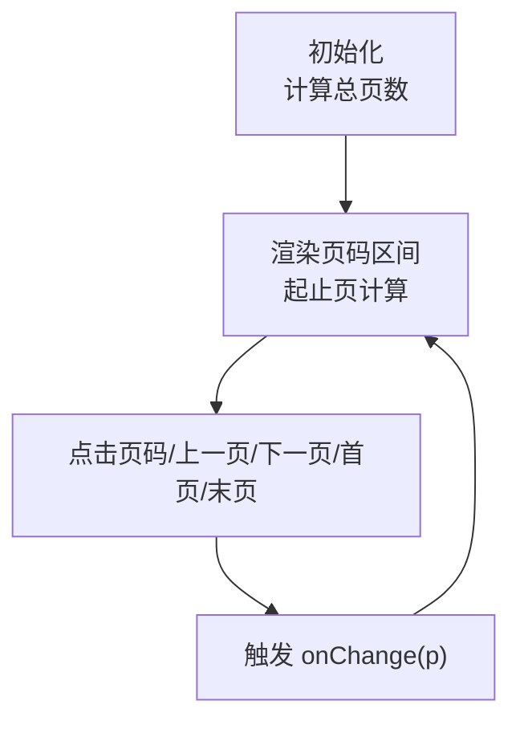
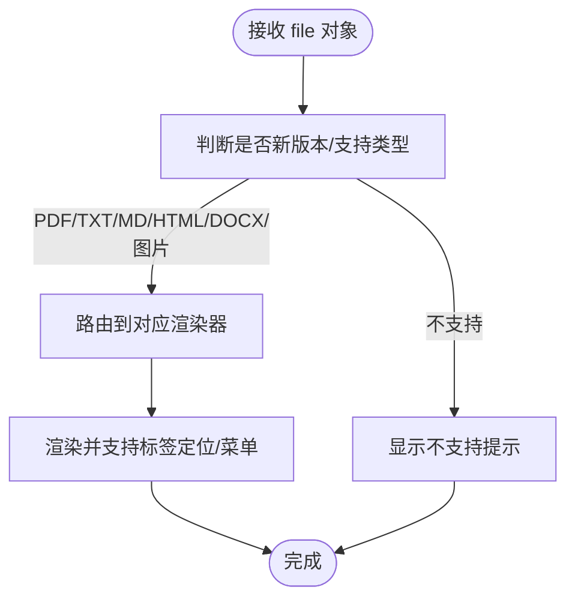
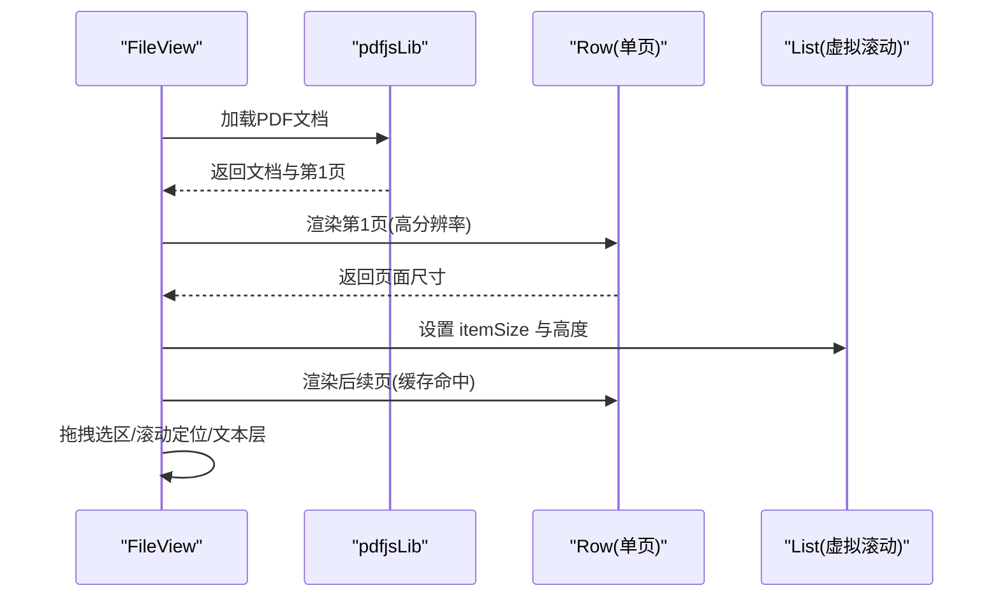
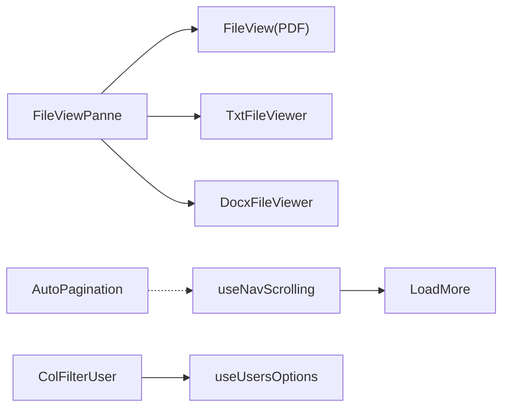

# 工具组件

<cite>
**本文引用的文件**
- [src/frontend/platform/src/components/bs-comp/loadMore/index.tsx](file://src/frontend/platform/src/components/bs-comp/loadMore/index.tsx)
- [src/frontend/client/src/hooks/Nav/useNavScrolling.ts](file://src/frontend/client/src/hooks/Nav/useNavScrolling.ts)
- [src/frontend/platform/src/components/bs-ui/pagination/autoPagination.tsx](file://src/frontend/platform/src/components/bs-ui/pagination/autoPagination.tsx)
- [src/frontend/platform/src/components/bs-comp/tableComponent/ColFilterUser.tsx](file://src/frontend/platform/src/components/bs-comp/tableComponent/ColFilterUser.tsx)
- [src/frontend/client/src/components/PreviewFile/index.tsx](file://src/frontend/client/src/components/PreviewFile/index.tsx)
- [src/frontend/client/src/components/PreviewFile/FileView.tsx](file://src/frontend/client/src/components/PreviewFile/FileView.tsx)
- [src/frontend/client/src/components/PreviewFile/TxtFileViewer.tsx](file://src/frontend/client/src/components/PreviewFile/TxtFileViewer.tsx)
- [src/frontend/client/src/components/PreviewFile/DocxFileViewer.tsx](file://src/frontend/client/src/components/PreviewFile/DocxFileViewer.tsx)
</cite>

## 目录
1. [简介](#简介)
2. [项目结构](#项目结构)
3. [核心组件](#核心组件)
4. [架构总览](#架构总览)
5. [详细组件分析](#详细组件分析)
6. [依赖关系分析](#依赖关系分析)
7. [性能考量](#性能考量)
8. [故障排查指南](#故障排查指南)
9. [结论](#结论)
10. [附录](#附录)

## 简介
本技术文档聚焦于工具组件系统，覆盖以下关键能力与组件：
- 加载更多组件：基于 IntersectionObserver 的“触底加载”机制，用于长列表或分页数据的懒加载。
- 表格列过滤组件：面向用户字段的多选过滤弹窗，支持搜索、分页加载、已选项置顶等交互。
- 文件预览组件：统一的文件预览容器，按文件类型路由到 PDF、TXT、MD、HTML、DOCX 或图片渲染；内置 PDF 高性能渲染、标注与文本层叠加、拖拽选区等能力。

文档同时阐述组件的通用性设计、可复用性实现与扩展机制，并提供完整的使用示例与最佳实践，涵盖无限滚动、数据过滤、文件展示等典型场景。

## 项目结构
工具组件主要分布在前端客户端与平台侧两个入口：
- 客户端入口：包含无限滚动 Hook、文件预览系列组件（PDF、TXT、DOCX、图片）。
- 平台入口：包含加载更多组件、自动分页组件、表格列过滤组件等。



图表来源
- [src/frontend/client/src/hooks/Nav/useNavScrolling.ts](file://src/frontend/client/src/hooks/Nav/useNavScrolling.ts#L1-L66)
- [src/frontend/client/src/components/PreviewFile/index.tsx](file://src/frontend/client/src/components/PreviewFile/index.tsx#L1-L97)
- [src/frontend/client/src/components/PreviewFile/FileView.tsx](file://src/frontend/client/src/components/PreviewFile/FileView.tsx#L1-L439)
- [src/frontend/client/src/components/PreviewFile/TxtFileViewer.tsx](file://src/frontend/client/src/components/PreviewFile/TxtFileViewer.tsx#L1-L66)
- [src/frontend/client/src/components/PreviewFile/DocxFileViewer.tsx](file://src/frontend/client/src/components/PreviewFile/DocxFileViewer.tsx#L1-L92)
- [src/frontend/platform/src/components/bs-comp/loadMore/index.tsx](file://src/frontend/platform/src/components/bs-comp/loadMore/index.tsx#L1-L25)
- [src/frontend/platform/src/components/bs-ui/pagination/autoPagination.tsx](file://src/frontend/platform/src/components/bs-ui/pagination/autoPagination.tsx#L1-L145)
- [src/frontend/platform/src/components/bs-comp/tableComponent/ColFilterUser.tsx](file://src/frontend/platform/src/components/bs-comp/tableComponent/ColFilterUser.tsx#L1-L108)

章节来源
- [src/frontend/client/src/hooks/Nav/useNavScrolling.ts](file://src/frontend/client/src/hooks/Nav/useNavScrolling.ts#L1-L66)
- [src/frontend/client/src/components/PreviewFile/index.tsx](file://src/frontend/client/src/components/PreviewFile/index.tsx#L1-L97)
- [src/frontend/platform/src/components/bs-comp/loadMore/index.tsx](file://src/frontend/platform/src/components/bs-comp/loadMore/index.tsx#L1-L25)
- [src/frontend/platform/src/components/bs-ui/pagination/autoPagination.tsx](file://src/frontend/platform/src/components/bs-ui/pagination/autoPagination.tsx#L1-L145)
- [src/frontend/platform/src/components/bs-comp/tableComponent/ColFilterUser.tsx](file://src/frontend/platform/src/components/bs-comp/tableComponent/ColFilterUser.tsx#L1-L108)

## 核心组件
- 加载更多组件（LoadMore）
  - 基于 IntersectionObserver，在目标元素进入可视区域时触发回调，常用于“触底加载”。
  - 可通过阈值与根边距微调触发时机。
- 无限滚动 Hook（useNavScrolling）
  - 监听容器滚动，计算接近底部阈值后触发分页加载；内部使用节流避免频繁请求。
  - 提供容器引用与回到顶部等辅助能力。
- 自动分页组件（AutoPagination）
  - 支持页码跳转、可见页数控制、禁用态、国际化文案等；与无限滚动可组合使用。
- 表格列过滤组件（ColFilterUser）
  - 弹出式多选过滤，支持搜索、分页加载、已选项置顶；提供重置与确认操作。
- 文件预览容器（FileViewPanne）
  - 统一入口，根据文件后缀与解析类型选择具体渲染器（PDF、TXT、MD、HTML、DOCX、图片）。
- PDF 渲染器（FileView）
  - 基于 pdfjs-dist，支持高分辨率渲染、文本层、批注层、标签高亮、拖拽选区、滚动定位等。
- 文本/HTML/Markdown 查看器（TxtFileViewer）
  - 按类型渲染，支持 Markdown 渲染与 HTML sandbox 嵌入。
- DOCX 查看器（DocxFileViewer）
  - 基于 mammoth 转换为 HTML 后渲染，内置样式与错误提示。

章节来源
- [src/frontend/platform/src/components/bs-comp/loadMore/index.tsx](file://src/frontend/platform/src/components/bs-comp/loadMore/index.tsx#L1-L25)
- [src/frontend/client/src/hooks/Nav/useNavScrolling.ts](file://src/frontend/client/src/hooks/Nav/useNavScrolling.ts#L1-L66)
- [src/frontend/platform/src/components/bs-ui/pagination/autoPagination.tsx](file://src/frontend/platform/src/components/bs-ui/pagination/autoPagination.tsx#L1-L145)
- [src/frontend/platform/src/components/bs-comp/tableComponent/ColFilterUser.tsx](file://src/frontend/platform/src/components/bs-comp/tableComponent/ColFilterUser.tsx#L1-L108)
- [src/frontend/client/src/components/PreviewFile/index.tsx](file://src/frontend/client/src/components/PreviewFile/index.tsx#L1-L97)
- [src/frontend/client/src/components/PreviewFile/FileView.tsx](file://src/frontend/client/src/components/PreviewFile/FileView.tsx#L1-L439)
- [src/frontend/client/src/components/PreviewFile/TxtFileViewer.tsx](file://src/frontend/client/src/components/PreviewFile/TxtFileViewer.tsx#L1-L66)
- [src/frontend/client/src/components/PreviewFile/DocxFileViewer.tsx](file://src/frontend/client/src/components/PreviewFile/DocxFileViewer.tsx#L1-L92)

## 架构总览
工具组件围绕“数据懒加载 + 列表渲染 + 内容预览”的主路径协作：
- 无限滚动 Hook 与加载更多组件共同驱动“触底加载”，保证长列表的流畅体验。
- 自动分页组件负责页码导航与跳转，适合静态分页场景。
- 表格列过滤组件提供灵活的数据筛选入口，结合无限滚动实现“筛选 + 懒加载”的组合模式。
- 文件预览容器作为统一入口，按类型路由到对应渲染器，确保跨格式的一致体验。



图表来源
- [src/frontend/client/src/hooks/Nav/useNavScrolling.ts](file://src/frontend/client/src/hooks/Nav/useNavScrolling.ts#L29-L41)
- [src/frontend/platform/src/components/bs-comp/loadMore/index.tsx](file://src/frontend/platform/src/components/bs-comp/loadMore/index.tsx#L3-L24)

## 详细组件分析

### 加载更多组件（LoadMore）
- 功能特性
  - 基于 IntersectionObserver 观察底部占位元素，进入可视区域即触发 onScrollLoad。
  - 可配置阈值与根边距，以适配不同滚动容器与触发时机。
- 使用场景
  - 长列表懒加载、无限滚动、分页数据追加。
- 配置选项
  - onScrollLoad: 触底回调函数。
- 扩展机制
  - 可替换为自定义观察策略（如滚动事件 + 阈值），或接入分页状态管理。



图表来源
- [src/frontend/platform/src/components/bs-comp/loadMore/index.tsx](file://src/frontend/platform/src/components/bs-comp/loadMore/index.tsx#L3-L24)

章节来源
- [src/frontend/platform/src/components/bs-comp/loadMore/index.tsx](file://src/frontend/platform/src/components/bs-comp/loadMore/index.tsx#L1-L25)

### 无限滚动 Hook（useNavScrolling）
- 功能特性
  - 监听容器滚动，当滚动到底部阈值（约 97%）且存在下一页时触发分页加载。
  - 使用节流降低滚动事件频率，避免频繁请求。
  - 提供容器引用与移动到顶部的能力。
- 使用场景
  - 与 LoadMore 组合实现“触底加载”，或独立用于长列表分页。
- 配置选项
  - hasNextPage: 是否还有下一页。
  - isFetchingNextPage: 当前是否正在拉取下一页。
  - setShowLoading: 控制加载态显示。
  - fetchNextPage: 分页加载函数。
- 扩展机制
  - 可注入自定义阈值、节流时间、容器选择器等。



图表来源
- [src/frontend/client/src/hooks/Nav/useNavScrolling.ts](file://src/frontend/client/src/hooks/Nav/useNavScrolling.ts#L29-L41)

章节来源
- [src/frontend/client/src/hooks/Nav/useNavScrolling.ts](file://src/frontend/client/src/hooks/Nav/useNavScrolling.ts#L1-L66)

### 自动分页组件（AutoPagination）
- 功能特性
  - 根据总条目与每页大小计算总页数，动态渲染可见页码区间。
  - 支持“跳到某页”输入框、禁用态、国际化文案。
- 使用场景
  - 静态分页、大数据量表格的页码导航。
- 配置选项
  - page/pageSize/total/maxVisiblePages/showJumpInput/jumpToText/pageText/onChange。
- 扩展机制
  - 可扩展为“省略号”页码、快捷跳转、页码范围自适应等。



图表来源
- [src/frontend/platform/src/components/bs-ui/pagination/autoPagination.tsx](file://src/frontend/platform/src/components/bs-ui/pagination/autoPagination.tsx#L36-L115)

章节来源
- [src/frontend/platform/src/components/bs-ui/pagination/autoPagination.tsx](file://src/frontend/platform/src/components/bs-ui/pagination/autoPagination.tsx#L1-L145)

### 表格列过滤组件（ColFilterUser）
- 功能特性
  - 弹出式多选过滤，支持搜索、分页加载、已选项置顶。
  - 提供重置与确认按钮，回调返回当前选中值。
- 使用场景
  - 用户列表、知识库文件等表格列的多条件筛选。
- 配置选项
  - label: 标签过滤（可选）。
  - onFilter: 过滤回调。
- 扩展机制
  - 可替换为通用的“列过滤器”抽象，支持多种字段类型与操作符。

```mermaid
sequenceDiagram
participant U as "用户"
participant Pop as "弹出层"
participant Opt as "useUsersOptions"
participant API as "用户接口"
U->>Pop : 打开过滤弹窗
U->>Opt : 输入关键词(防抖)
Opt->>API : 搜索/分页加载
API-->>Opt : 返回选项列表
Opt-->>Pop : 更新选项(已选项置顶)
U->>Pop : 多选/重置/确认
Pop->>U : 触发 onFilter(选中值)
```

图表来源
- [src/frontend/platform/src/components/bs-comp/tableComponent/ColFilterUser.tsx](file://src/frontend/platform/src/components/bs-comp/tableComponent/ColFilterUser.tsx#L12-L64)
- [src/frontend/platform/src/components/bs-comp/tableComponent/ColFilterUser.tsx](file://src/frontend/platform/src/components/bs-comp/tableComponent/ColFilterUser.tsx#L68-L108)

章节来源
- [src/frontend/platform/src/components/bs-comp/tableComponent/ColFilterUser.tsx](file://src/frontend/platform/src/components/bs-comp/tableComponent/ColFilterUser.tsx#L1-L108)

### 文件预览容器（FileViewPanne）
- 功能特性
  - 统一入口，根据文件后缀与解析类型选择渲染器。
  - 支持 PDF、TXT、MD、HTML、DOCX、图片等格式。
  - 内置标签定位、来源段落菜单、国际化文案。
- 使用场景
  - 知识库文件、对话附件、报告预览等。
- 配置选项
  - file: 包含文件元数据、chunks、解析类型等。
- 扩展机制
  - 可新增格式处理器、统一错误提示与回退策略。



图表来源
- [src/frontend/client/src/components/PreviewFile/index.tsx](file://src/frontend/client/src/components/PreviewFile/index.tsx#L46-L75)

章节来源
- [src/frontend/client/src/components/PreviewFile/index.tsx](file://src/frontend/client/src/components/PreviewFile/index.tsx#L1-L97)

### PDF 渲染器（FileView）
- 功能特性
  - 基于 pdfjs-dist，支持高分辨率渲染、文本层、批注层、标签高亮、拖拽选区、滚动定位。
  - 使用 ResizeObserver 与节流优化尺寸变更与滚动事件。
  - 缓存页面对象，减少重复渲染成本。
- 使用场景
  - PDF 文件预览、标注高亮、定位到特定段落。
- 配置选项
  - startIndex/drawfont/select/scrollTo/fileUrl/labels/onPageChange/onSelectLabel。
- 扩展机制
  - 可扩展为“页面缩放”、“书签导航”、“复制/搜索”等高级功能。



图表来源
- [src/frontend/client/src/components/PreviewFile/FileView.tsx](file://src/frontend/client/src/components/PreviewFile/FileView.tsx#L234-L390)

章节来源
- [src/frontend/client/src/components/PreviewFile/FileView.tsx](file://src/frontend/client/src/components/PreviewFile/FileView.tsx#L1-L439)

### 文本/HTML/Markdown 查看器（TxtFileViewer）
- 功能特性
  - 按类型渲染：普通文本、HTML（sandbox）、Markdown。
  - 错误处理与加载态。
- 使用场景
  - 日志、说明文档、网页片段等轻量内容预览。
- 配置选项
  - html/markdown/filePath。
- 扩展机制
  - 可增加语法高亮、主题切换、下载链接等。

章节来源
- [src/frontend/client/src/components/PreviewFile/TxtFileViewer.tsx](file://src/frontend/client/src/components/PreviewFile/TxtFileViewer.tsx#L1-L66)

### DOCX 查看器（DocxFileViewer）
- 功能特性
  - 使用 mammoth 将 DOCX 转换为 HTML 后渲染，内置样式与错误提示。
- 使用场景
  - 报告、合同、文档预览。
- 配置选项
  - filePath。
- 扩展机制
  - 可增加“原文件下载”、“转换进度”等。

章节来源
- [src/frontend/client/src/components/PreviewFile/DocxFileViewer.tsx](file://src/frontend/client/src/components/PreviewFile/DocxFileViewer.tsx#L1-L92)

## 依赖关系分析
- 组件内聚与耦合
  - FileViewPanne 与 FileView/TxtFileViewer/DocxFileViewer 形成“容器-渲染器”关系，职责清晰。
  - useNavScrolling 与 LoadMore 在无限滚动场景中松耦合，可通过 onScrollLoad 插拔式接入。
  - ColFilterUser 与 useUsersOptions 解耦，便于替换为其他数据源。
- 外部依赖
  - pdfjs-dist、mammoth、react-window、lodash/throttle 等。
- 潜在循环依赖
  - 当前文件间无明显循环导入；若引入跨目录共享逻辑，建议通过公共 Hook/工具模块解耦。



图表来源
- [src/frontend/client/src/components/PreviewFile/index.tsx](file://src/frontend/client/src/components/PreviewFile/index.tsx#L1-L97)
- [src/frontend/client/src/components/PreviewFile/FileView.tsx](file://src/frontend/client/src/components/PreviewFile/FileView.tsx#L1-L439)
- [src/frontend/client/src/components/PreviewFile/TxtFileViewer.tsx](file://src/frontend/client/src/components/PreviewFile/TxtFileViewer.tsx#L1-L66)
- [src/frontend/client/src/components/PreviewFile/DocxFileViewer.tsx](file://src/frontend/client/src/components/PreviewFile/DocxFileViewer.tsx#L1-L92)
- [src/frontend/client/src/hooks/Nav/useNavScrolling.ts](file://src/frontend/client/src/hooks/Nav/useNavScrolling.ts#L1-L66)
- [src/frontend/platform/src/components/bs-comp/loadMore/index.tsx](file://src/frontend/platform/src/components/bs-comp/loadMore/index.tsx#L1-L25)
- [src/frontend/platform/src/components/bs-ui/pagination/autoPagination.tsx](file://src/frontend/platform/src/components/bs-ui/pagination/autoPagination.tsx#L1-L145)
- [src/frontend/platform/src/components/bs-comp/tableComponent/ColFilterUser.tsx](file://src/frontend/platform/src/components/bs-comp/tableComponent/ColFilterUser.tsx#L1-L108)

## 性能考量
- 无限滚动与懒加载
  - 使用节流与阈值控制，避免频繁触发；合理设置容器高度与滚动事件监听范围。
- PDF 渲染
  - 高分辨率渲染与文本层叠加会带来额外开销；建议：
    - 启用页面缓存，减少重复渲染。
    - 按需开启文本层与批注层，必要时延迟加载。
    - 使用虚拟滚动与 ResizeObserver 节流，降低 DOM 变更频率。
- 文件预览
  - 图片预览时注意资源替换与跨域问题；文本/HTML 渲染使用 sandbox 保障安全。
- 分页与过滤
  - 列表过滤与搜索建议使用防抖；分页加载时保持加载态与骨架屏，提升感知性能。

## 故障排查指南
- PDF 无法加载或空白
  - 检查文件 URL 替换与 worker 路径；确认网络可访问与跨域策略。
  - 关注错误捕获与“源文件不存在”提示。
- 拖拽选区无效
  - 确认标签坐标与页面偏移计算一致；检查滚动偏移与缩放比例。
- 文本/HTML/DOCX 渲染异常
  - 文本渲染失败时查看错误信息；HTML sandbox 限制可能影响部分脚本行为；DOCX 转换失败时提供下载原文件链接。
- 无限滚动不触发
  - 检查容器滚动事件绑定、阈值与 hasNextPage/isFetchingNextPage 状态；确认节流生效。

章节来源
- [src/frontend/client/src/components/PreviewFile/FileView.tsx](file://src/frontend/client/src/components/PreviewFile/FileView.tsx#L274-L297)
- [src/frontend/client/src/components/PreviewFile/TxtFileViewer.tsx](file://src/frontend/client/src/components/PreviewFile/TxtFileViewer.tsx#L9-L31)
- [src/frontend/client/src/components/PreviewFile/DocxFileViewer.tsx](file://src/frontend/client/src/components/PreviewFile/DocxFileViewer.tsx#L11-L37)
- [src/frontend/client/src/hooks/Nav/useNavScrolling.ts](file://src/frontend/client/src/hooks/Nav/useNavScrolling.ts#L29-L41)

## 结论
工具组件系统通过“容器 + 渲染器”的分层设计，实现了加载更多、无限滚动、表格过滤与文件预览的高复用与可扩展能力。结合节流、缓存与虚拟滚动等优化手段，可在复杂业务场景下保持良好的性能与用户体验。建议在实际项目中：
- 明确组件边界，优先使用通用 Hook 与抽象渲染器。
- 在无限滚动与分页场景中统一状态管理与加载态控制。
- 对 PDF 等重型渲染场景进行渐进增强与按需加载。

## 附录
- 使用示例（路径指引）
  - 无限滚动：在列表容器中引入 useNavScrolling，并在回调中调用分页加载函数。
    - 示例路径：[useNavScrolling](file://src/frontend/client/src/hooks/Nav/useNavScrolling.ts#L5-L27)
  - 加载更多：在列表底部放置 LoadMore 组件，传入 onScrollLoad。
    - 示例路径：[LoadMore](file://src/frontend/platform/src/components/bs-comp/loadMore/index.tsx#L3-L24)
  - 自动分页：传入 page/pageSize/total 等参数，监听 onChange。
    - 示例路径：[AutoPagination](file://src/frontend/platform/src/components/bs-ui/pagination/autoPagination.tsx#L26-L44)
  - 表格列过滤：传入 label 与 onFilter，内部集成搜索与分页加载。
    - 示例路径：[ColFilterUser](file://src/frontend/platform/src/components/bs-comp/tableComponent/ColFilterUser.tsx#L12-L64)
  - 文件预览：传入 file 对象，组件自动选择 PDF/TXT/MD/HTML/DOCX/图片渲染器。
    - 示例路径：[FileViewPanne](file://src/frontend/client/src/components/PreviewFile/index.tsx#L46-L75)
  - PDF 渲染：传入 fileUrl、labels、onSelectLabel 等参数，启用文本层与批注层。
    - 示例路径：[FileView](file://src/frontend/client/src/components/PreviewFile/FileView.tsx#L234-L390)