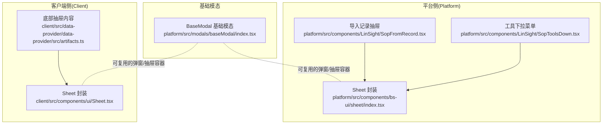
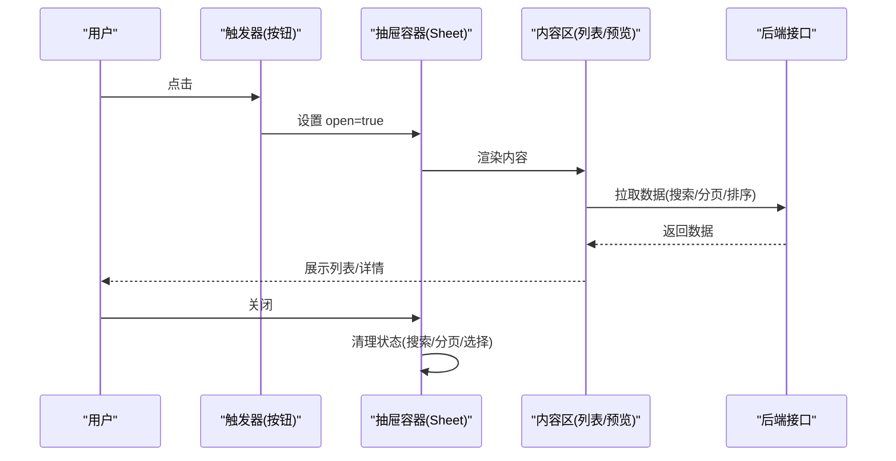
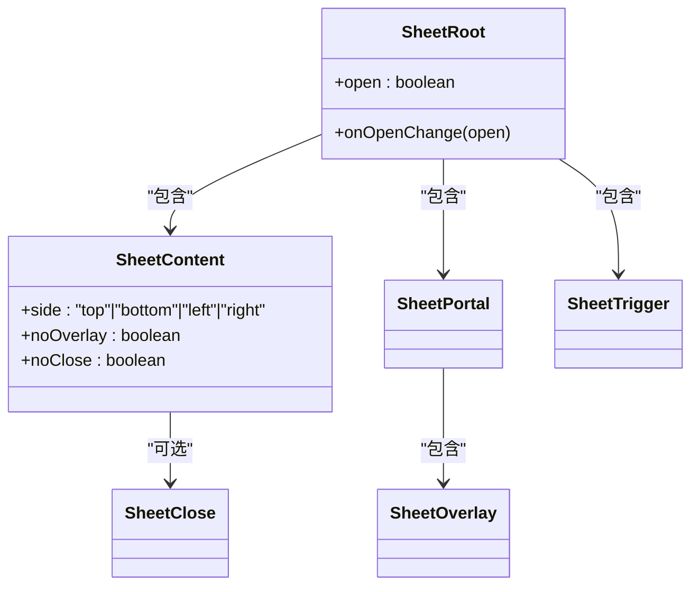
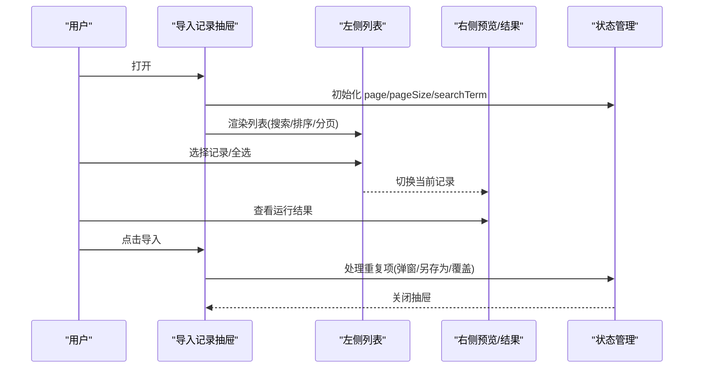
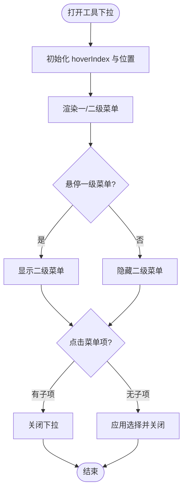
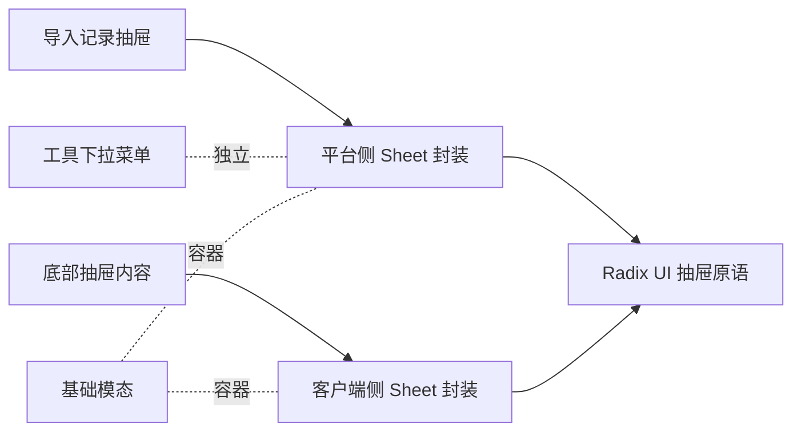

# 抽屉组件

<cite>
**本文引用的文件**
- [src/frontend/platform/src/components/bs-ui/sheet/index.tsx](file://src/frontend/platform/src/components/bs-ui/sheet/index.tsx)
- [src/frontend/client/src/components/ui/Sheet.tsx](file://src/frontend/client/src/components/ui/Sheet.tsx)
- [src/frontend/platform/src/modals/baseModal/index.tsx](file://src/frontend/platform/src/modals/baseModal/index.tsx)
- [src/frontend/platform/src/components/LinSight/SopFromRecord.tsx](file://src/frontend/platform/src/components/LinSight/SopFromRecord.tsx)
- [src/frontend/platform/src/components/LinSight/SopToolsDown.tsx](file://src/frontend/platform/src/components/LinSight/SopToolsDown.tsx)
- [src/frontend/client/src/data-provider/data-provider/src/artifacts.ts](file://src/frontend/client/src/data-provider/data-provider/src/artifacts.ts)
</cite>

## 目录
1. [简介](#简介)
2. [项目结构](#项目结构)
3. [核心组件](#核心组件)
4. [架构总览](#架构总览)
5. [详细组件分析](#详细组件分析)
6. [依赖关系分析](#依赖关系分析)
7. [性能考量](#性能考量)
8. [故障排查指南](#故障排查指南)
9. [结论](#结论)
10. [附录：使用示例与最佳实践](#附录使用示例与最佳实践)

## 简介
本文件系统性梳理并文档化本仓库中的抽屉组件体系，覆盖以下能力：
- 应用模板抽屉（LinSight 导入记录抽屉）
- 技能聊天抽屉（通过对话/抽屉组合实现的侧边交互）
- 技能抽屉（工具选择下拉/抽屉联动）
- 标签抽屉（基于抽屉的筛选/配置面板）
- 工具抽屉（工具选择与上下文切换）

重点涵盖：
- 打开/关闭机制与状态管理
- 内容渲染与布局适配
- 动画与过渡效果
- 与主界面的交互方式与数据流
- 响应式设计与用户体验优化
- 在不同业务场景下的应用模式与扩展方法

## 项目结构
围绕“抽屉”主题，前端侧存在两套实现：
- 平台侧（platform）：基于 Radix UI 的 Sheet 组件封装，用于大型面板抽屉（如导入记录抽屉）
- 客户端侧（client）：基于 Radix UI 的 Sheet 组件封装，用于通用抽屉
- 数据层（artifacts.ts）：提供移动端风格的抽屉内容组件（底部抽屉）

图表来源
- [src/frontend/platform/src/components/bs-ui/sheet/index.tsx](file://src/frontend/platform/src/components/bs-ui/sheet/index.tsx#L1-L133)
- [src/frontend/client/src/components/ui/Sheet.tsx](file://src/frontend/client/src/components/ui/Sheet.tsx#L1-L139)
- [src/frontend/platform/src/modals/baseModal/index.tsx](file://src/frontend/platform/src/modals/baseModal/index.tsx#L1-L163)
- [src/frontend/platform/src/components/LinSight/SopFromRecord.tsx](file://src/frontend/platform/src/components/LinSight/SopFromRecord.tsx#L280-L558)
- [src/frontend/platform/src/components/LinSight/SopToolsDown.tsx](file://src/frontend/platform/src/components/LinSight/SopToolsDown.tsx#L1-L202)
- [src/frontend/client/src/data-provider/data-provider/src/artifacts.ts](file://src/frontend/client/src/data-provider/data-provider/src/artifacts.ts#L1140-L1181)

章节来源
- [src/frontend/platform/src/components/bs-ui/sheet/index.tsx](file://src/frontend/platform/src/components/bs-ui/sheet/index.tsx#L1-L133)
- [src/frontend/client/src/components/ui/Sheet.tsx](file://src/frontend/client/src/components/ui/Sheet.tsx#L1-L139)
- [src/frontend/platform/src/modals/baseModal/index.tsx](file://src/frontend/platform/src/modals/baseModal/index.tsx#L1-L163)
- [src/frontend/platform/src/components/LinSight/SopFromRecord.tsx](file://src/frontend/platform/src/components/LinSight/SopFromRecord.tsx#L280-L558)
- [src/frontend/platform/src/components/LinSight/SopToolsDown.tsx](file://src/frontend/platform/src/components/LinSight/SopToolsDown.tsx#L1-L202)
- [src/frontend/client/src/data-provider/data-provider/src/artifacts.ts](file://src/frontend/client/src/data-provider/data-provider/src/artifacts.ts#L1140-L1181)

## 核心组件
- 平台侧 Sheet 封装：提供带遮罩、滑入滑出动画、可选关闭按钮、支持多方向（上/下/左/右）的抽屉骨架
- 客户端侧 Sheet 封装：与平台侧类似，但样式与类名策略略有差异，适配客户端主题
- 导入记录抽屉：以平台侧 Sheet 为核心，承载“记录列表 + 预览/结果页”的双栏布局，支持搜索、排序、分页、批量导入
- 工具下拉菜单：非抽屉形态，但与抽屉联动，用于工具选择与二级菜单展示
- 底部抽屉内容：提供移动端风格的抽屉内容骨架（底部抽屉）

章节来源
- [src/frontend/platform/src/components/bs-ui/sheet/index.tsx](file://src/frontend/platform/src/components/bs-ui/sheet/index.tsx#L1-L133)
- [src/frontend/client/src/components/ui/Sheet.tsx](file://src/frontend/client/src/components/ui/Sheet.tsx#L1-L139)
- [src/frontend/platform/src/components/LinSight/SopFromRecord.tsx](file://src/frontend/platform/src/components/LinSight/SopFromRecord.tsx#L280-L558)
- [src/frontend/platform/src/components/LinSight/SopToolsDown.tsx](file://src/frontend/platform/src/components/LinSight/SopToolsDown.tsx#L1-L202)
- [src/frontend/client/src/data-provider/data-provider/src/artifacts.ts](file://src/frontend/client/src/data-provider/data-provider/src/artifacts.ts#L1140-L1181)

## 架构总览
抽屉组件的控制流通常遵循如下路径：
- 触发器（按钮/链接）设置 open 状态
- Sheet 或 Dialog/Sheet 容器根据 open 切换显示/隐藏
- 内容区按需加载数据或渲染复杂 UI（表格、Markdown、任务流）
- 关闭时清理状态（清空搜索、重置分页、关闭重复项确认）

图表来源
- [src/frontend/platform/src/components/LinSight/SopFromRecord.tsx](file://src/frontend/platform/src/components/LinSight/SopFromRecord.tsx#L280-L558)
- [src/frontend/platform/src/components/bs-ui/sheet/index.tsx](file://src/frontend/platform/src/components/bs-ui/sheet/index.tsx#L1-L133)

## 详细组件分析

### 平台侧 Sheet 封装（应用模板抽屉核心）
- 能力要点
  - 支持四向抽屉（上/下/左/右），默认右侧
  - 遮罩层与滑入滑出动画，支持关闭按钮
  - Portal 渲染，避免层级与溢出问题
  - 可选无遮罩/无关闭按钮模式
- 使用建议
  - 大型面板优先使用平台侧 Sheet，便于统一动画与交互
  - 注意侧向宽度与内容区滚动策略

图表来源
- [src/frontend/platform/src/components/bs-ui/sheet/index.tsx](file://src/frontend/platform/src/components/bs-ui/sheet/index.tsx#L1-L133)

章节来源
- [src/frontend/platform/src/components/bs-ui/sheet/index.tsx](file://src/frontend/platform/src/components/bs-ui/sheet/index.tsx#L1-L133)

### 客户端侧 Sheet 封装（通用抽屉）
- 能力要点
  - 与平台侧一致的 API 与行为模型
  - 样式适配客户端主题，类名策略略有差异
- 使用建议
  - 通用场景优先使用客户端侧 Sheet，确保视觉一致性

章节来源
- [src/frontend/client/src/components/ui/Sheet.tsx](file://src/frontend/client/src/components/ui/Sheet.tsx#L1-L139)

### 导入记录抽屉（应用模板抽屉）
- 场景定位
  - 从历史 SOP 记录中批量/单条导入，支持预览与运行结果对比
- 结构组成
  - 左侧：记录列表（含搜索、排序、分页、多选）、右侧：指南手册/运行结果
  - 顶部标题与描述由 SheetHeader/Title 提供
- 交互流程
  - 打开：onOpenChange(true)，初始化分页与搜索参数
  - 搜索：防抖触发，重置页码
  - 分页/排序：变更后重新拉取
  - 导入：单条或批量导入，处理重复名称冲突（另存为新/覆盖）

图表来源
- [src/frontend/platform/src/components/LinSight/SopFromRecord.tsx](file://src/frontend/platform/src/components/LinSight/SopFromRecord.tsx#L280-L558)

章节来源
- [src/frontend/platform/src/components/LinSight/SopFromRecord.tsx](file://src/frontend/platform/src/components/LinSight/SopFromRecord.tsx#L280-L558)

### 工具下拉菜单（技能抽屉联动）
- 场景定位
  - 工具选择与二级菜单联动，支持位置自适应与点击外部关闭
- 能力要点
  - 一级菜单悬停高亮，联动二级菜单展示
  - 自动计算弹窗位置，避免越界
  - 点击外部区域自动关闭

图表来源
- [src/frontend/platform/src/components/LinSight/SopToolsDown.tsx](file://src/frontend/platform/src/components/LinSight/SopToolsDown.tsx#L1-L202)

章节来源
- [src/frontend/platform/src/components/LinSight/SopToolsDown.tsx](file://src/frontend/platform/src/components/LinSight/SopToolsDown.tsx#L1-L202)

### 底部抽屉内容（移动端风格）
- 场景定位
  - 移动端底部抽屉，常用于轻量配置/预览
- 能力要点
  - 固定底部入口（拖拽条）
  - Portal 渲染，避免层级问题

章节来源
- [src/frontend/client/src/data-provider/data-provider/src/artifacts.ts](file://src/frontend/client/src/data-provider/data-provider/src/artifacts.ts#L1140-L1181)

### 基础模态（可复用容器）
- 场景定位
  - 作为通用弹窗/抽屉容器，提供 Header/Content/Footer/Trigger 结构化组织
- 能力要点
  - 支持尺寸变体与高度/最小宽度控制
  - 支持回调 onOpenChange

章节来源
- [src/frontend/platform/src/modals/baseModal/index.tsx](file://src/frontend/platform/src/modals/baseModal/index.tsx#L1-L163)

## 依赖关系分析
- 组件耦合
  - 导入记录抽屉强依赖平台侧 Sheet；工具下拉菜单独立于 Sheet，但与之在同一页面生态
  - 客户端侧 Sheet 与平台侧 Sheet 共享 API，但样式策略不同
- 外部依赖
  - Radix UI 对话框/抽屉原语
  - Tailwind 类名工具（cn/cva）
- 潜在风险
  - 同一页面同时使用平台侧与客户端侧 Sheet 时，注意样式冲突
  - 底部抽屉与桌面端交互不一致，需按设备区分使用

图表来源
- [src/frontend/platform/src/components/bs-ui/sheet/index.tsx](file://src/frontend/platform/src/components/bs-ui/sheet/index.tsx#L1-L133)
- [src/frontend/client/src/components/ui/Sheet.tsx](file://src/frontend/client/src/components/ui/Sheet.tsx#L1-L139)
- [src/frontend/platform/src/components/LinSight/SopFromRecord.tsx](file://src/frontend/platform/src/components/LinSight/SopFromRecord.tsx#L280-L558)
- [src/frontend/platform/src/components/LinSight/SopToolsDown.tsx](file://src/frontend/platform/src/components/LinSight/SopToolsDown.tsx#L1-L202)
- [src/frontend/client/src/data-provider/data-provider/src/artifacts.ts](file://src/frontend/client/src/data-provider/data-provider/src/artifacts.ts#L1140-L1181)
- [src/frontend/platform/src/modals/baseModal/index.tsx](file://src/frontend/platform/src/modals/baseModal/index.tsx#L1-L163)

## 性能考量
- 渲染优化
  - 列表采用虚拟滚动/分页，避免一次性渲染大量节点
  - 防抖搜索减少请求频率
- 动画与交互
  - 使用 CSS 过渡与 Radix 动画钩子，避免强制同步布局
- 状态管理
  - 打开/关闭时清理临时状态（搜索词、分页、选择集），降低内存占用
- 设备适配
  - 移动端使用底部抽屉，桌面端使用侧边抽屉，避免不必要的大屏资源浪费

## 故障排查指南
- 打不开/无法关闭
  - 检查 open/onOpenChange 是否正确绑定
  - 确认遮罩点击是否被拦截（平台侧 SheetOverlay 已阻止事件冒泡）
- 内容不更新
  - 确认搜索/分页/排序变更后是否重新拉取数据
  - 检查防抖逻辑是否生效
- 位置异常
  - 工具下拉菜单会自动调整位置，检查父容器边界与安全边距
- 样式冲突
  - 同时使用平台侧与客户端侧 Sheet 时，注意类名与主题变量差异

章节来源
- [src/frontend/platform/src/components/bs-ui/sheet/index.tsx](file://src/frontend/platform/src/components/bs-ui/sheet/index.tsx#L1-L133)
- [src/frontend/platform/src/components/LinSight/SopFromRecord.tsx](file://src/frontend/platform/src/components/LinSight/SopFromRecord.tsx#L280-L558)
- [src/frontend/platform/src/components/LinSight/SopToolsDown.tsx](file://src/frontend/platform/src/components/LinSight/SopToolsDown.tsx#L1-L202)

## 结论
本仓库的抽屉组件体系以 Radix UI 为基础，结合平台侧与客户端侧的封装，形成统一且灵活的交互基座。导入记录抽屉展示了大型面板抽屉的完整生命周期与数据流；工具下拉菜单体现了与抽屉联动的轻量交互；底部抽屉内容满足移动端体验。通过合理选择组件与遵循状态管理规范，可在不同业务场景下快速构建高质量的抽屉交互。

## 附录：使用示例与最佳实践
- 抽屉触发
  - 使用 SheetTrigger 或按钮 onClick 设置 open=true
  - 示例参考：导入记录抽屉的打开与关闭
- 内容展示
  - 左右分栏：左侧列表 + 右侧预览/结果
  - 上下分栏：顶部标题/描述 + 中部内容 + 底部操作
- 用户操作
  - 搜索：防抖 + 重置页码
  - 排序：变更字段与方向后刷新
  - 分页：变更页码/页大小后刷新
  - 导入：单条/批量导入，处理重复项（另存为/覆盖）
- 布局适配
  - 桌面端：右侧/左侧抽屉
  - 移动端：底部抽屉
- 扩展方法
  - 新增抽屉：基于平台侧/客户端侧 Sheet 封装，复用 Header/Content/Footer 结构
  - 联动交互：与工具下拉菜单配合，实现二级菜单联动
  - 容器复用：通过基础模态容器组织结构化内容

章节来源
- [src/frontend/platform/src/components/LinSight/SopFromRecord.tsx](file://src/frontend/platform/src/components/LinSight/SopFromRecord.tsx#L280-L558)
- [src/frontend/platform/src/components/LinSight/SopToolsDown.tsx](file://src/frontend/platform/src/components/LinSight/SopToolsDown.tsx#L1-L202)
- [src/frontend/platform/src/modals/baseModal/index.tsx](file://src/frontend/platform/src/modals/baseModal/index.tsx#L1-L163)
- [src/frontend/client/src/data-provider/data-provider/src/artifacts.ts](file://src/frontend/client/src/data-provider/data-provider/src/artifacts.ts#L1140-L1181)