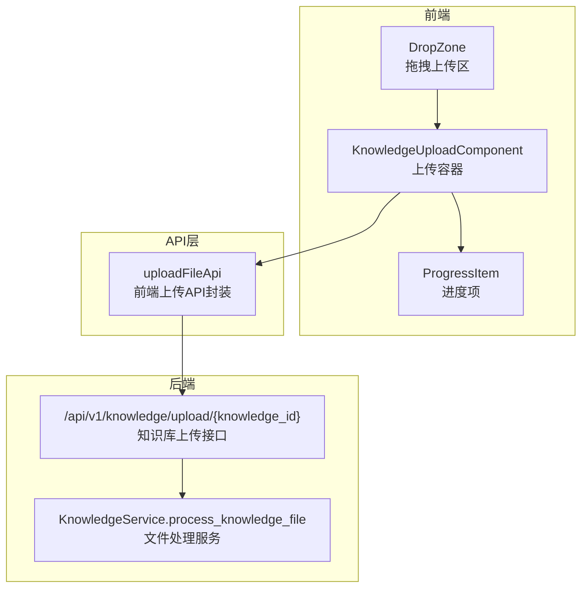
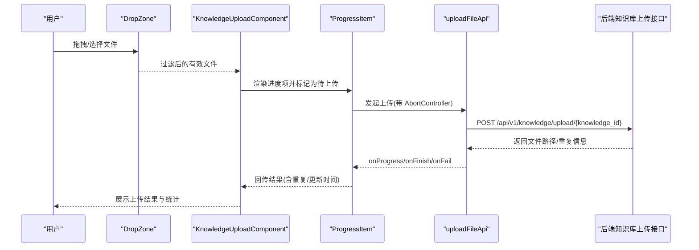

# 知识库上传组件

<cite>
**本文引用的文件**
- [src/frontend/platform/src/components/bs-comp/knowledgeUploadComponent/index.tsx](file://src/frontend/platform/src/components/bs-comp/knowledgeUploadComponent/index.tsx)
- [src/frontend/platform/src/components/bs-comp/knowledgeUploadComponent/DropZone.tsx](file://src/frontend/platform/src/components/bs-comp/knowledgeUploadComponent/DropZone.tsx)
- [src/frontend/platform/src/components/bs-comp/knowledgeUploadComponent/ProgressItem.tsx](file://src/frontend/platform/src/components/bs-comp/knowledgeUploadComponent/ProgressItem.tsx)
- [src/frontend/platform/src/controllers/API/index.ts](file://src/frontend/platform/src/controllers/API/index.ts)
- [src/backend/bisheng/knowledge/api/endpoints/knowledge.py](file://src/backend/bisheng/knowledge/api/endpoints/knowledge.py)
- [src/backend/bisheng/api/services/knowledge.py](file://src/backend/bisheng/api/services/knowledge.py)
- [src/frontend/platform/src/contexts/locationContext.tsx](file://src/frontend/platform/src/contexts/locationContext.tsx)
- [src/frontend/platform/src/modals/UploadModal/upload.ts](file://src/frontend/platform/src/modals/UploadModal/upload.ts)
- [src/frontend/platform/src/components/inputFileComponent/index.tsx](file://src/frontend/platform/src/components/inputFileComponent/index.tsx)
</cite>

## 目录
1. [简介](#简介)
2. [项目结构](#项目结构)
3. [核心组件](#核心组件)
4. [架构总览](#架构总览)
5. [组件详解](#组件详解)
6. [依赖关系分析](#依赖关系分析)
7. [性能与并发优化](#性能与并发优化)
8. [故障排查指南](#故障排查指南)
9. [结论](#结论)
10. [附录](#附录)

## 简介
本技术文档围绕“知识库上传组件”进行系统性梳理，覆盖前端拖拽上传区域、进度条显示、文件类型与大小限制、进度监控、错误处理、与后端文件系统交互、以及在知识库管理场景中的应用模式与扩展建议。文档以代码级可视化图示呈现组件间调用链路与数据流，帮助开发者快速理解与二次开发。

## 项目结构
知识库上传组件由前端三大子组件与后端接口共同组成：
- 前端组件
  - 拖拽上传区 DropZone：负责文件拖拽接收、格式过滤与提示
  - 进度项 ProgressItem：负责单文件上传状态、进度、重试与删除
  - 上传容器 KnowledgeUploadComponent：负责多文件队列、调度与结果回调
- 后端接口
  - 知识库上传接口：保存文件、去重判断、返回重复信息
  - 知识库文件处理服务：异步解析入库、回调通知



图表来源
- [src/frontend/platform/src/components/bs-comp/knowledgeUploadComponent/DropZone.tsx](file://src/frontend/platform/src/components/bs-comp/knowledgeUploadComponent/DropZone.tsx#L1-L65)
- [src/frontend/platform/src/components/bs-comp/knowledgeUploadComponent/ProgressItem.tsx](file://src/frontend/platform/src/components/bs-comp/knowledgeUploadComponent/ProgressItem.tsx#L1-L137)
- [src/frontend/platform/src/components/bs-comp/knowledgeUploadComponent/index.tsx](file://src/frontend/platform/src/components/bs-comp/knowledgeUploadComponent/index.tsx#L1-L182)
- [src/frontend/platform/src/controllers/API/index.ts](file://src/frontend/platform/src/controllers/API/index.ts#L1057-L1104)
- [src/backend/bisheng/knowledge/api/endpoints/knowledge.py](file://src/backend/bisheng/knowledge/api/endpoints/knowledge.py#L73-L114)
- [src/backend/bisheng/api/services/knowledge.py](file://src/backend/bisheng/api/services/knowledge.py#L544-L564)

章节来源
- [src/frontend/platform/src/components/bs-comp/knowledgeUploadComponent/index.tsx](file://src/frontend/platform/src/components/bs-comp/knowledgeUploadComponent/index.tsx#L1-L182)
- [src/frontend/platform/src/components/bs-comp/knowledgeUploadComponent/DropZone.tsx](file://src/frontend/platform/src/components/bs-comp/knowledgeUploadComponent/DropZone.tsx#L1-L65)
- [src/frontend/platform/src/components/bs-comp/knowledgeUploadComponent/ProgressItem.tsx](file://src/frontend/platform/src/components/bs-comp/knowledgeUploadComponent/ProgressItem.tsx#L1-L137)
- [src/frontend/platform/src/controllers/API/index.ts](file://src/frontend/platform/src/controllers/API/index.ts#L1057-L1104)
- [src/backend/bisheng/knowledge/api/endpoints/knowledge.py](file://src/backend/bisheng/knowledge/api/endpoints/knowledge.py#L73-L114)
- [src/backend/bisheng/api/services/knowledge.py](file://src/backend/bisheng/api/services/knowledge.py#L544-L564)

## 核心组件
- 拖拽上传区 DropZone
  - 功能：支持拖拽接收文件；根据系统配置动态展示允许的文件类型；对不支持的类型进行提示；仅将合法文件传递给父组件
  - 关键点：基于 react-dropzone 的 accept 配置与扩展名白名单过滤；通过上下文获取最大上传大小与是否启用 ETL4LM 扩展类型
- 进度项 ProgressItem
  - 功能：单文件上传状态展示、进度条、重试按钮、取消上传、结果回调
  - 关键点：使用 AbortController 实现可取消上传；onProgress 更新进度；onFinish/onFail 回传结果；支持重试
- 上传容器 KnowledgeUploadComponent
  - 功能：维护进度列表、调度上传、汇总成功/失败文件、与父组件通信
  - 关键点：useEffect 监听进度列表变化触发上传；统一回调 onResulte 与 onDelete

章节来源
- [src/frontend/platform/src/components/bs-comp/knowledgeUploadComponent/DropZone.tsx](file://src/frontend/platform/src/components/bs-comp/knowledgeUploadComponent/DropZone.tsx#L1-L65)
- [src/frontend/platform/src/components/bs-comp/knowledgeUploadComponent/ProgressItem.tsx](file://src/frontend/platform/src/components/bs-comp/knowledgeUploadComponent/ProgressItem.tsx#L1-L137)
- [src/frontend/platform/src/components/bs-comp/knowledgeUploadComponent/index.tsx](file://src/frontend/platform/src/components/bs-comp/knowledgeUploadComponent/index.tsx#L1-L182)

## 架构总览
从前端到后端的完整上传流程如下：



图表来源
- [src/frontend/platform/src/components/bs-comp/knowledgeUploadComponent/DropZone.tsx](file://src/frontend/platform/src/components/bs-comp/knowledgeUploadComponent/DropZone.tsx#L19-L51)
- [src/frontend/platform/src/components/bs-comp/knowledgeUploadComponent/ProgressItem.tsx](file://src/frontend/platform/src/components/bs-comp/knowledgeUploadComponent/ProgressItem.tsx#L21-L61)
- [src/frontend/platform/src/controllers/API/index.ts](file://src/frontend/platform/src/controllers/API/index.ts#L1060-L1104)
- [src/backend/bisheng/knowledge/api/endpoints/knowledge.py](file://src/backend/bisheng/knowledge/api/endpoints/knowledge.py#L73-L114)

## 组件详解

### 拖拽上传区 DropZone
- 文件类型与大小限制
  - 类型：根据系统配置决定是否包含图片类扩展；通过 accept 与扩展名白名单双重过滤
  - 大小：从上下文 appConfig.uploadFileMaxSize 获取最大值，结合其他组件校验逻辑使用
- 行为
  - 接收拖拽事件；过滤不支持类型并提示；仅将合法文件回调给父组件
- 交互
  - 支持点击或拖拽放置；展示支持的格式文案与最大大小提示

章节来源
- [src/frontend/platform/src/components/bs-comp/knowledgeUploadComponent/DropZone.tsx](file://src/frontend/platform/src/components/bs-comp/knowledgeUploadComponent/DropZone.tsx#L12-L55)
- [src/frontend/platform/src/contexts/locationContext.tsx](file://src/frontend/platform/src/contexts/locationContext.tsx#L66-L89)

### 进度项 ProgressItem
- 上传状态机
  - 待上传(Await) → 上传中(Uploading) → 完成/失败(End/Fail)
- 进度与取消
  - 使用 onUploadProgress 更新进度；AbortController 可随时取消
- 结果反馈
  - onFinish：进度置100，回传文件路径、是否重复、更新时间
  - onFail：进度置100，回传空路径与重复标记
- 重试与删除
  - 错误时显示重试按钮；点击重试会重新发起上传
  - 支持取消当前上传并删除该项

章节来源
- [src/frontend/platform/src/components/bs-comp/knowledgeUploadComponent/ProgressItem.tsx](file://src/frontend/platform/src/components/bs-comp/knowledgeUploadComponent/ProgressItem.tsx#L10-L61)

### 上传容器 KnowledgeUploadComponent
- 多文件队列
  - 维护进度列表；useEffect 监听新增项并触发上传
- 结果与统计
  - 成功/失败文件分别记录；回调父组件 onFileChange/onSelectFile
- 与后端集成
  - 通过 uploadFileApi 发起上传；接收进度、完成与失败回调

章节来源
- [src/frontend/platform/src/components/bs-comp/knowledgeUploadComponent/index.tsx](file://src/frontend/platform/src/components/bs-comp/knowledgeUploadComponent/index.tsx#L23-L182)

### 前端上传 API 封装 uploadFileApi
- 请求配置
  - 使用 FormData 传输文件；设置 Content-Type 为 multipart/form-data
  - onUploadProgress 计算百分比并回调 UI
  - 使用 AbortController 支持取消
- 错误处理
  - 捕获异常；区分取消与失败；最终清理信号

章节来源
- [src/frontend/platform/src/controllers/API/index.ts](file://src/frontend/platform/src/controllers/API/index.ts#L1060-L1104)

### 后端知识库上传接口
- 接口路径
  - POST /api/v1/knowledge/upload/{knowledge_id}
- 核心逻辑
  - 保存上传文件至存储；计算文件 MD5；查询是否重复；返回文件路径与重复信息
- 异常处理
  - 捕获异常并抛出统一错误

章节来源
- [src/backend/bisheng/knowledge/api/endpoints/knowledge.py](file://src/backend/bisheng/knowledge/api/endpoints/knowledge.py#L73-L114)

### 文件处理服务（异步解析）
- 入口
  - KnowledgeService.process_knowledge_file：保存文件并异步派发解析任务
- 流程
  - 保存文件元信息 → 生成预览缓存键 → 分发 Celery 任务进行解析入库 → 触发钩子记录审计日志

章节来源
- [src/backend/bisheng/api/services/knowledge.py](file://src/backend/bisheng/api/services/knowledge.py#L544-L564)

## 依赖关系分析

```mermaid
classDiagram
class DropZone {
+props : onDrop
+accept : 支持的扩展名集合
+onDrop(acceptedFiles, rejectedFiles)
}
class ProgressItem {
+props : item, knowledgeId, onResulte, onDelete
+uploadApi()
+handleCancel()
+状态 : Await/Uploading/End
}
class KnowledgeUploadComponent {
+props : knowledgeId, onFileChange, onSelectFile
+进度列表 : Progress[]
+useEffect监听进度变化
}
class uploadFileApi {
+FormData
+AbortController
+onProgress/onFinish/onFail
}
class 知识库上传接口 {
+POST /api/v1/knowledge/upload/{knowledge_id}
+保存文件/去重/返回路径
}
DropZone --> KnowledgeUploadComponent : "回调有效文件"
KnowledgeUploadComponent --> ProgressItem : "渲染进度项"
ProgressItem --> uploadFileApi : "发起上传"
uploadFileApi --> 知识库上传接口 : "HTTP请求"
```

图表来源
- [src/frontend/platform/src/components/bs-comp/knowledgeUploadComponent/DropZone.tsx](file://src/frontend/platform/src/components/bs-comp/knowledgeUploadComponent/DropZone.tsx#L19-L51)
- [src/frontend/platform/src/components/bs-comp/knowledgeUploadComponent/ProgressItem.tsx](file://src/frontend/platform/src/components/bs-comp/knowledgeUploadComponent/ProgressItem.tsx#L21-L61)
- [src/frontend/platform/src/components/bs-comp/knowledgeUploadComponent/index.tsx](file://src/frontend/platform/src/components/bs-comp/knowledgeUploadComponent/index.tsx#L41-L43)
- [src/frontend/platform/src/controllers/API/index.ts](file://src/frontend/platform/src/controllers/API/index.ts#L1060-L1104)
- [src/backend/bisheng/knowledge/api/endpoints/knowledge.py](file://src/backend/bisheng/knowledge/api/endpoints/knowledge.py#L73-L114)

## 性能与并发优化
- 并发控制
  - 当前实现逐个文件串行上传。若需提升吞吐，可在容器层引入“并发数上限”策略，例如每次最多 N 个活跃上传，超出排队，完成后释放槽位
- 进度与内存
  - onUploadProgress 中仅更新当前项进度，避免全量重渲染；可结合虚拟列表优化长列表性能
- 取消与资源回收
  - 每个 ProgressItem 使用独立 AbortController；在重试或删除时及时 abort，防止悬挂请求占用带宽
- 后端解析
  - 后端采用 Celery 异步解析，避免阻塞上传接口；前端可通过回调 URL 或轮询获取解析进度

[本节为通用优化建议，无需特定文件引用]

## 故障排查指南
- 常见问题定位
  - 文件类型被拒绝：检查 DropZone 的 accept 与扩展名白名单是否匹配；确认系统配置 enableEtl4lm 是否开启图片类扩展
  - 上传进度不更新：确认 onUploadProgress 是否被调用；检查后端是否正确返回进度事件
  - 上传失败：查看 onFail 回调与错误日志；区分取消与网络异常
  - 重复文件：后端返回重复标记与更新时间；前端可据此提示或引导用户确认覆盖
- 建议排查步骤
  - 前端：打开浏览器网络面板，确认请求头 Content-Type 为 multipart/form-data；观察进度事件与响应体
  - 后端：查看知识库上传接口日志，确认文件保存、MD5 计算与重复检测逻辑是否正常执行

章节来源
- [src/frontend/platform/src/components/bs-comp/knowledgeUploadComponent/DropZone.tsx](file://src/frontend/platform/src/components/bs-comp/knowledgeUploadComponent/DropZone.tsx#L24-L50)
- [src/frontend/platform/src/components/bs-comp/knowledgeUploadComponent/ProgressItem.tsx](file://src/frontend/platform/src/components/bs-comp/knowledgeUploadComponent/ProgressItem.tsx#L45-L56)
- [src/frontend/platform/src/controllers/API/index.ts](file://src/frontend/platform/src/controllers/API/index.ts#L1095-L1103)
- [src/backend/bisheng/knowledge/api/endpoints/knowledge.py](file://src/backend/bisheng/knowledge/api/endpoints/knowledge.py#L96-L107)

## 结论
知识库上传组件通过“拖拽上传区 + 进度项 + 上传容器”的组合，实现了清晰的职责分离与良好的用户体验。前端以 AbortController 提供可控的上传生命周期，后端以去重与异步解析保障可靠性。建议在生产环境中引入并发控制与更细粒度的进度回调，以进一步提升吞吐与可观测性。

[本节为总结性内容，无需特定文件引用]

## 附录

### 使用示例（操作步骤）
- 文件选择
  - 在 DropZone 区域点击或拖拽文件；系统自动过滤不支持类型并提示
- 拖拽上传
  - 选择有效文件后，容器自动调度上传；每个文件独立显示进度
- 进度显示
  - ProgressItem 内部使用透明遮罩模拟进度条；onProgress 回调实时更新
- 结果反馈
  - 完成后回传文件路径与重复信息；失败时可点击重试或取消

章节来源
- [src/frontend/platform/src/components/bs-comp/knowledgeUploadComponent/DropZone.tsx](file://src/frontend/platform/src/components/bs-comp/knowledgeUploadComponent/DropZone.tsx#L57-L65)
- [src/frontend/platform/src/components/bs-comp/knowledgeUploadComponent/ProgressItem.tsx](file://src/frontend/platform/src/components/bs-comp/knowledgeUploadComponent/ProgressItem.tsx#L17-L61)
- [src/frontend/platform/src/components/bs-comp/knowledgeUploadComponent/index.tsx](file://src/frontend/platform/src/components/bs-comp/knowledgeUploadComponent/index.tsx#L162-L179)

### 文件类型与大小限制
- 类型限制
  - 默认支持：PDF、TXT、DOCX、DOC、PPT、PPTX、MD、HTML、XLS、XLSX、CSV
  - 若启用 ETL4LM：额外支持 PNG、JPG、JPEG、BMP
- 大小限制
  - 从系统配置 appConfig.uploadFileMaxSize 获取最大值（MB）；可在其他组件中配合校验

章节来源
- [src/frontend/platform/src/components/bs-comp/knowledgeUploadComponent/DropZone.tsx](file://src/frontend/platform/src/components/bs-comp/knowledgeUploadComponent/DropZone.tsx#L13-L18)
- [src/frontend/platform/src/contexts/locationContext.tsx](file://src/frontend/platform/src/contexts/locationContext.tsx#L87-L88)

### 与文件系统的交互
- 前端
  - 使用 FormData 与 AbortController；onUploadProgress 实时上报进度
- 后端
  - 保存文件至存储；计算 MD5；查询重复；返回文件路径与重复信息；异步派发解析任务

章节来源
- [src/frontend/platform/src/controllers/API/index.ts](file://src/frontend/platform/src/controllers/API/index.ts#L1074-L1104)
- [src/backend/bisheng/knowledge/api/endpoints/knowledge.py](file://src/backend/bisheng/knowledge/api/endpoints/knowledge.py#L84-L107)
- [src/backend/bisheng/api/services/knowledge.py](file://src/backend/bisheng/api/services/knowledge.py#L544-L564)

### 扩展方法
- 增加并发上传
  - 在容器层维护“活跃上传计数”，超过阈值则排队；完成后释放
- 增强错误提示
  - 对不同错误码映射具体提示文案；在 ProgressItem 中展示更详细的错误原因
- 支持断点续传
  - 前端分片上传 + 后端断点合并；结合进度回调与重试机制

[本节为扩展建议，无需特定文件引用]