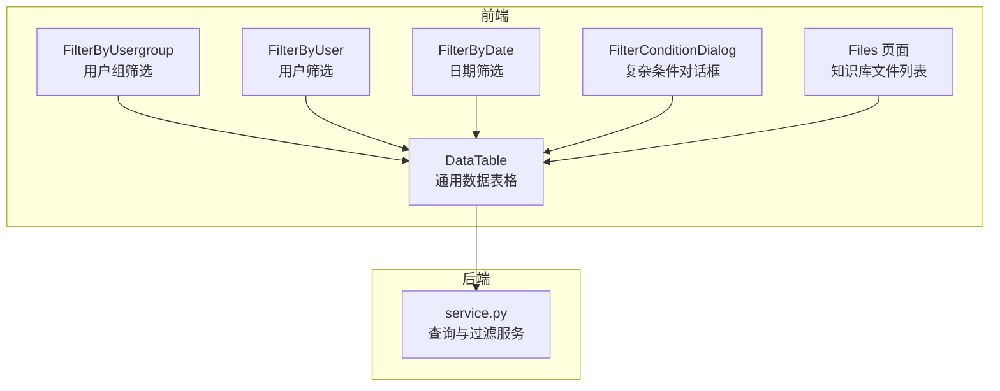
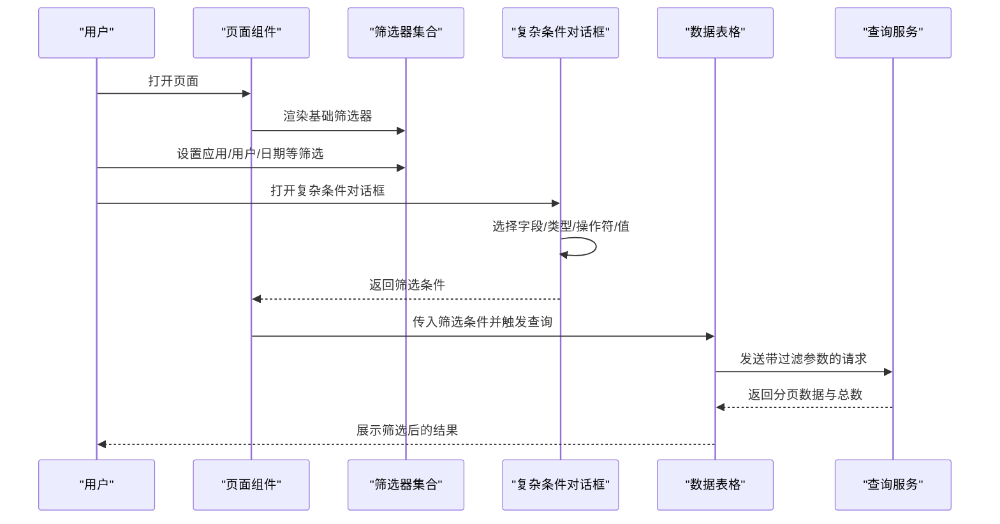
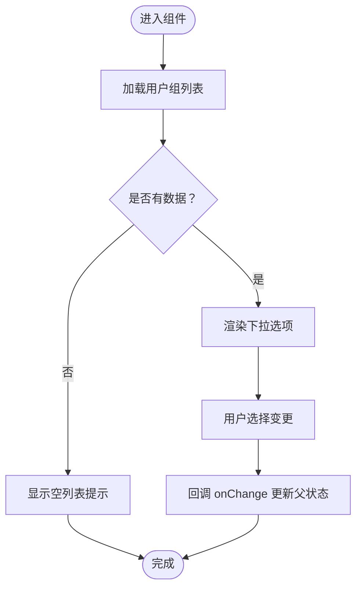
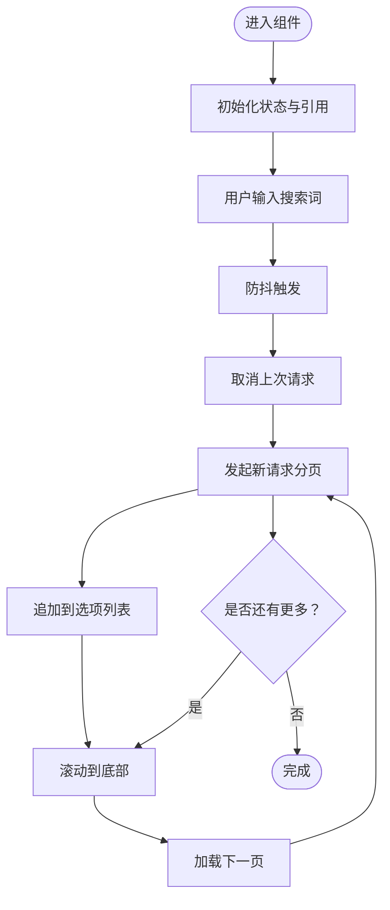
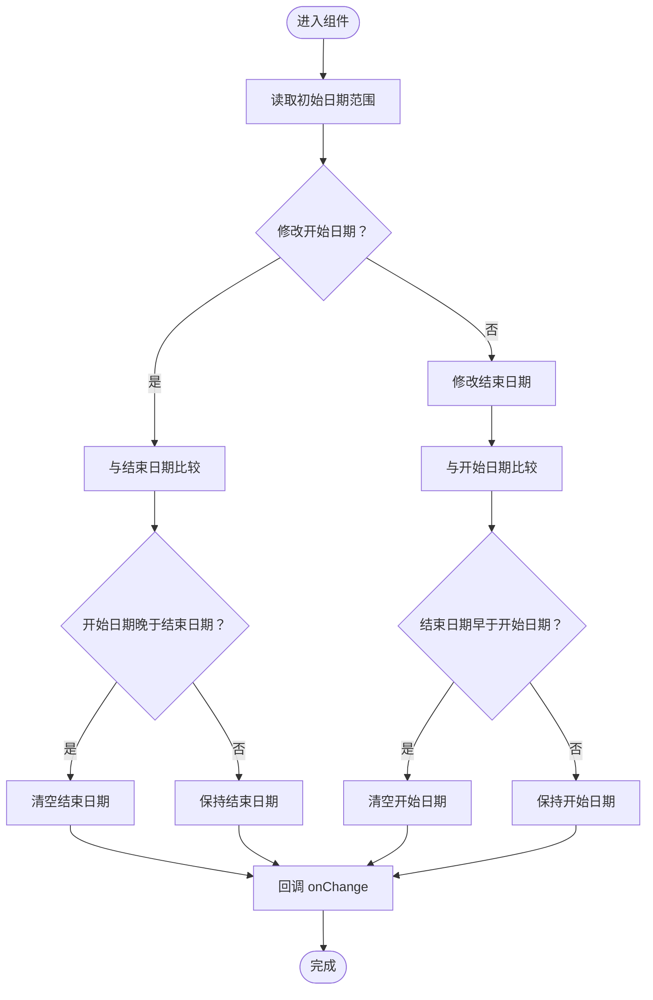
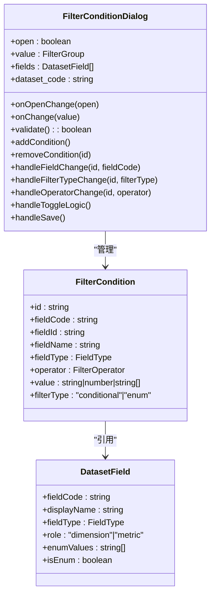
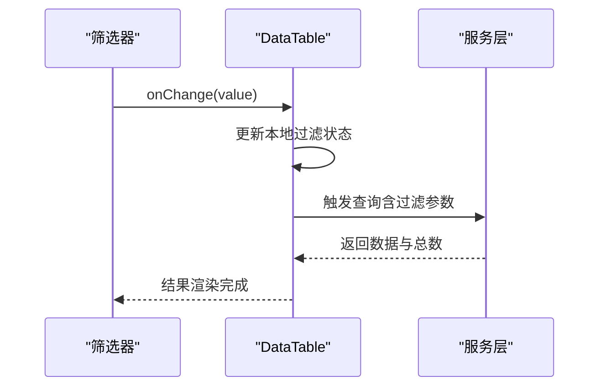
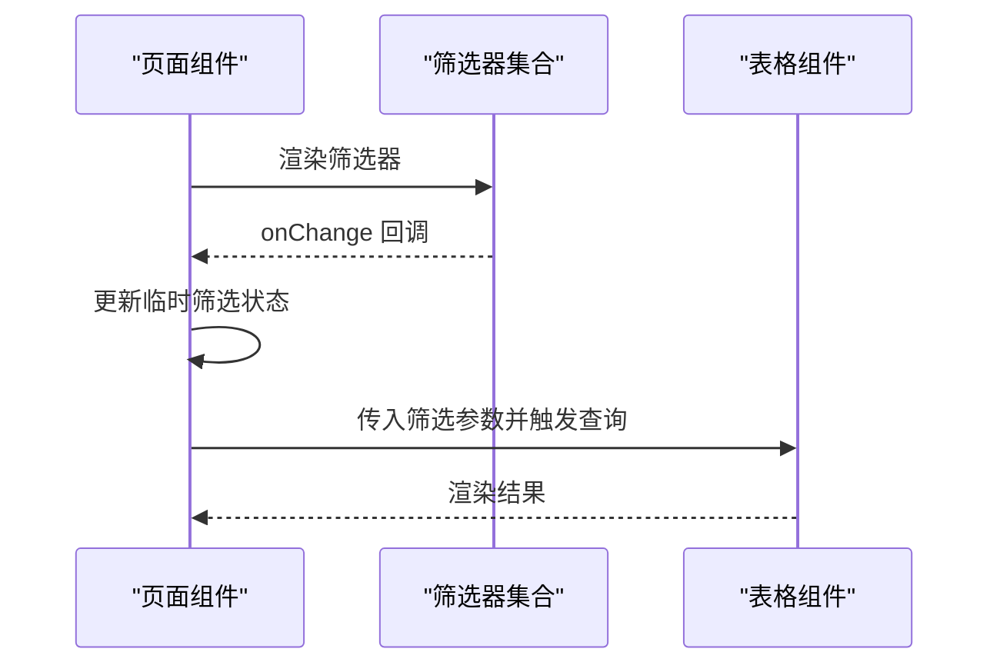
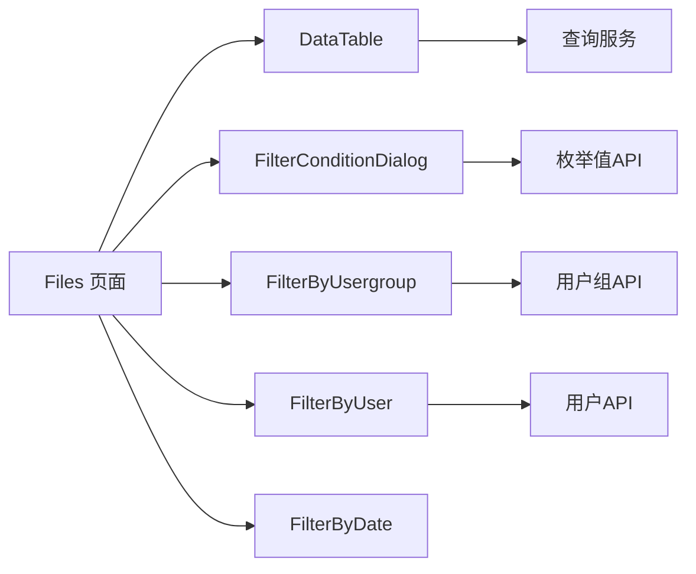

# 筛选表格组件

<cite>
**本文引用的文件**
- [FilterByUsergroup.tsx](file://src/frontend/platform/src/components/bs-comp/filterTableDataComponent/FilterByUsergroup.tsx)
- [FilterByUser.tsx](file://src/frontend/platform/src/components/bs-comp/filterTableDataComponent/FilterByUser.tsx)
- [FilterByDate.tsx](file://src/frontend/platform/src/components/bs-comp/filterTableDataComponent/FilterByDate.tsx)
- [FilterConditionDialog.tsx](file://src/frontend/platform/src/pages/Dashboard/components/config/FilterConditionDialog.tsx)
- [DataTable.tsx](file://src/frontend/client/src/components/ui/DataTable.tsx)
- [Files.tsx](file://src/frontend/platform/src/pages/KnowledgePage/components/Files.tsx)
- [service.py](file://src/backend/bisheng/services/store/service.py)
- [hook.ts](file://src/frontend/platform/src/util/hook.ts)
</cite>

## 目录
1. [简介](#简介)
2. [项目结构](#项目结构)
3. [核心组件](#核心组件)
4. [架构总览](#架构总览)
5. [组件详解](#组件详解)
6. [依赖关系分析](#依赖关系分析)
7. [性能考量](#性能考量)
8. [故障排查指南](#故障排查指南)
9. [结论](#结论)
10. [附录](#附录)

## 简介
本技术文档围绕“筛选表格组件系统”展开，聚焦于按应用、日期、用户、用户组等维度的筛选能力，系统性阐述筛选组件的数据过滤机制、查询条件构建、结果集更新策略，以及与表格组件的协作方式、状态同步与性能优化。文档同时提供完整的使用示例、用户体验设计要点、搜索建议与批量操作支持，并给出在数据管理场景中的应用模式与扩展方法。

## 项目结构
筛选表格组件由前端筛选器与后端查询服务共同构成：
- 前端筛选器：用户组、用户、日期三类基础筛选器；复杂条件对话框用于构建多字段、多操作符的复合筛选。
- 表格组件：通用数据表格，支持列过滤、排序、分页、行选择与关键词搜索。
- 后端服务：统一接收筛选条件，拼装查询参数并返回带分页与计数的结果集。

**图表来源**
- [FilterByUsergroup.tsx](file://src/frontend/platform/src/components/bs-comp/filterTableDataComponent/FilterByUsergroup.tsx#L1-L77)
- [FilterByUser.tsx](file://src/frontend/platform/src/components/bs-comp/filterTableDataComponent/FilterByUser.tsx#L1-L133)
- [FilterByDate.tsx](file://src/frontend/platform/src/components/bs-comp/filterTableDataComponent/FilterByDate.tsx#L1-L59)
- [FilterConditionDialog.tsx](file://src/frontend/platform/src/pages/Dashboard/components/config/FilterConditionDialog.tsx#L1-L200)
- [DataTable.tsx](file://src/frontend/client/src/components/ui/DataTable.tsx#L206-L405)
- [Files.tsx](file://src/frontend/platform/src/pages/KnowledgePage/components/Files.tsx#L506-L531)
- [service.py](file://src/backend/bisheng/services/store/service.py#L217-L242)

**章节来源**
- [FilterByUsergroup.tsx](file://src/frontend/platform/src/components/bs-comp/filterTableDataComponent/FilterByUsergroup.tsx#L1-L77)
- [FilterByUser.tsx](file://src/frontend/platform/src/components/bs-comp/filterTableDataComponent/FilterByUser.tsx#L1-L133)
- [FilterByDate.tsx](file://src/frontend/platform/src/components/bs-comp/filterTableDataComponent/FilterByDate.tsx#L1-L59)
- [FilterConditionDialog.tsx](file://src/frontend/platform/src/pages/Dashboard/components/config/FilterConditionDialog.tsx#L1-L200)
- [DataTable.tsx](file://src/frontend/client/src/components/ui/DataTable.tsx#L206-L405)
- [Files.tsx](file://src/frontend/platform/src/pages/KnowledgePage/components/Files.tsx#L506-L531)
- [service.py](file://src/backend/bisheng/services/store/service.py#L217-L242)

## 核心组件
- 用户组筛选器：基于用户组列表进行单选筛选，支持加载态与空列表提示。
- 用户筛选器：多选 + 搜索 + 滚动加载，支持防抖搜索与请求中断。
- 日期筛选器：双日历面板，自动约束起止时间关系。
- 复杂条件对话框：支持 AND/OR 逻辑、字段选择、筛选类型（条件/枚举）、操作符与值输入，支持枚举值的分页与搜索。
- 通用数据表格：支持列过滤、排序、分页、关键词搜索、行选择与批量删除。
- 查询服务：将前端筛选条件组装为后端可识别的过滤表达式并执行查询。

**章节来源**
- [FilterByUsergroup.tsx](file://src/frontend/platform/src/components/bs-comp/filterTableDataComponent/FilterByUsergroup.tsx#L11-L44)
- [FilterByUser.tsx](file://src/frontend/platform/src/components/bs-comp/filterTableDataComponent/FilterByUser.tsx#L12-L28)
- [FilterByDate.tsx](file://src/frontend/platform/src/components/bs-comp/filterTableDataComponent/FilterByDate.tsx#L10-L58)
- [FilterConditionDialog.tsx](file://src/frontend/platform/src/pages/Dashboard/components/config/FilterConditionDialog.tsx#L28-L70)
- [DataTable.tsx](file://src/frontend/client/src/components/ui/DataTable.tsx#L64-L80)
- [service.py](file://src/backend/bisheng/services/store/service.py#L217-L242)

## 架构总览
筛选流程从页面入口触发，通过筛选器收集条件，构建查询参数，交由表格组件渲染结果；复杂条件可通过对话框统一生成；后端服务将条件拼装为过滤表达式并返回数据。

**图表来源**
- [Files.tsx](file://src/frontend/platform/src/pages/KnowledgePage/components/Files.tsx#L506-L531)
- [FilterConditionDialog.tsx](file://src/frontend/platform/src/pages/Dashboard/components/config/FilterConditionDialog.tsx#L442-L486)
- [DataTable.tsx](file://src/frontend/client/src/components/ui/DataTable.tsx#L206-L405)
- [service.py](file://src/backend/bisheng/services/store/service.py#L217-L242)

## 组件详解

### 用户组筛选器（FilterByUsergroup）
- 功能：提供用户组下拉选择，支持加载中禁用与空列表提示。
- 数据源：通过用户组 API 获取列表，使用独立加载钩子控制请求生命周期。
- 状态同步：父组件通过 value 与 onChange 进行双向绑定，实现与表格筛选状态的联动。

**图表来源**
- [FilterByUsergroup.tsx](file://src/frontend/platform/src/components/bs-comp/filterTableDataComponent/FilterByUsergroup.tsx#L47-L77)

**章节来源**
- [FilterByUsergroup.tsx](file://src/frontend/platform/src/components/bs-comp/filterTableDataComponent/FilterByUsergroup.tsx#L11-L44)
- [FilterByUsergroup.tsx](file://src/frontend/platform/src/components/bs-comp/filterTableDataComponent/FilterByUsergroup.tsx#L47-L77)

### 用户筛选器（FilterByUser）
- 功能：多选用户，支持搜索、滚动加载更多、防抖搜索与请求中断。
- 性能：使用防抖减少高频搜索请求；使用 AbortController 取消上一次未完成请求；分页加载避免一次性加载过多数据。
- 状态同步：父组件通过 value 与 onChange 接收选中项，与表格筛选状态保持一致。

**图表来源**
- [FilterByUser.tsx](file://src/frontend/platform/src/components/bs-comp/filterTableDataComponent/FilterByUser.tsx#L31-L133)

**章节来源**
- [FilterByUser.tsx](file://src/frontend/platform/src/components/bs-comp/filterTableDataComponent/FilterByUser.tsx#L12-L28)
- [FilterByUser.tsx](file://src/frontend/platform/src/components/bs-comp/filterTableDataComponent/FilterByUser.tsx#L31-L133)

### 日期筛选器（FilterByDate）
- 功能：双日历面板，自动约束起止时间关系（开始时间不得晚于结束时间，反之亦然）。
- 交互：分别处理起始与结束日期变更，必要时清空冲突侧日期以保证合法区间。

**图表来源**
- [FilterByDate.tsx](file://src/frontend/platform/src/components/bs-comp/filterTableDataComponent/FilterByDate.tsx#L18-L38)

**章节来源**
- [FilterByDate.tsx](file://src/frontend/platform/src/components/bs-comp/filterTableDataComponent/FilterByDate.tsx#L10-L58)

### 复杂条件对话框（FilterConditionDialog）
- 功能：支持 AND/OR 逻辑、字段选择、筛选类型（条件/枚举）、操作符与值输入；枚举值支持分页与搜索。
- 数据模型：条件对象包含字段编码、类型、操作符与值；支持动态增删条件。
- 交互：根据字段类型自动切换默认操作符与输入控件；空值操作符无需输入值；保存时进行校验。

**图表来源**
- [FilterConditionDialog.tsx](file://src/frontend/platform/src/pages/Dashboard/components/config/FilterConditionDialog.tsx#L28-L70)
- [FilterConditionDialog.tsx](file://src/frontend/platform/src/pages/Dashboard/components/config/FilterConditionDialog.tsx#L442-L486)
- [FilterConditionDialog.tsx](file://src/frontend/platform/src/pages/Dashboard/components/config/FilterConditionDialog.tsx#L497-L527)
- [FilterConditionDialog.tsx](file://src/frontend/platform/src/pages/Dashboard/components/config/FilterConditionDialog.tsx#L530-L552)
- [FilterConditionDialog.tsx](file://src/frontend/platform/src/pages/Dashboard/components/config/FilterConditionDialog.tsx#L553-L577)
- [FilterConditionDialog.tsx](file://src/frontend/platform/src/pages/Dashboard/components/config/FilterConditionDialog.tsx#L579-L590)
- [FilterConditionDialog.tsx](file://src/frontend/platform/src/pages/Dashboard/components/config/FilterConditionDialog.tsx#L593-L606)
- [FilterConditionDialog.tsx](file://src/frontend/platform/src/pages/Dashboard/components/config/FilterConditionDialog.tsx#L615-L618)

**章节来源**
- [FilterConditionDialog.tsx](file://src/frontend/platform/src/pages/Dashboard/components/config/FilterConditionDialog.tsx#L28-L70)
- [FilterConditionDialog.tsx](file://src/frontend/platform/src/pages/Dashboard/components/config/FilterConditionDialog.tsx#L442-L486)
- [FilterConditionDialog.tsx](file://src/frontend/platform/src/pages/Dashboard/components/config/FilterConditionDialog.tsx#L497-L527)
- [FilterConditionDialog.tsx](file://src/frontend/platform/src/pages/Dashboard/components/config/FilterConditionDialog.tsx#L530-L552)
- [FilterConditionDialog.tsx](file://src/frontend/platform/src/pages/Dashboard/components/config/FilterConditionDialog.tsx#L553-L577)
- [FilterConditionDialog.tsx](file://src/frontend/platform/src/pages/Dashboard/components/config/FilterConditionDialog.tsx#L579-L590)
- [FilterConditionDialog.tsx](file://src/frontend/platform/src/pages/Dashboard/components/config/FilterConditionDialog.tsx#L593-L606)
- [FilterConditionDialog.tsx](file://src/frontend/platform/src/pages/Dashboard/components/config/FilterConditionDialog.tsx#L615-L618)

### 通用数据表格（DataTable）
- 能力：列过滤、排序、分页、关键词搜索、行选择与批量删除。
- 协作：通过 onFilterChange 与 filterValue 与筛选器联动；支持分页加载更多。
- 批量操作：启用行选择后，提供批量删除按钮与禁用态控制。

**图表来源**
- [DataTable.tsx](file://src/frontend/client/src/components/ui/DataTable.tsx#L206-L405)
- [DataTable.tsx](file://src/frontend/client/src/components/ui/DataTable.tsx#L64-L80)

**章节来源**
- [DataTable.tsx](file://src/frontend/client/src/components/ui/DataTable.tsx#L64-L80)
- [DataTable.tsx](file://src/frontend/client/src/components/ui/DataTable.tsx#L206-L405)

### 页面集成示例（知识库文件列表）
- 入口：页面顶部提供筛选器与确认/重置按钮，点击确认后应用筛选并刷新表格。
- 协作：筛选器状态与表格状态通过父组件集中管理，确保一致性。

**图表来源**
- [Files.tsx](file://src/frontend/platform/src/pages/KnowledgePage/components/Files.tsx#L506-L531)

**章节来源**
- [Files.tsx](file://src/frontend/platform/src/pages/KnowledgePage/components/Files.tsx#L506-L531)

## 依赖关系分析
- 组件内聚：筛选器各自封装独立状态与副作用，通过 props 与回调与父组件解耦。
- 组件耦合：复杂条件对话框与通用表格存在间接耦合（通过筛选条件对象），但通过清晰的数据模型降低耦合度。
- 外部依赖：用户组与用户 API、枚举值 API、通用表格组件库。
- 循环依赖：未发现循环依赖迹象。

**图表来源**
- [FilterByUsergroup.tsx](file://src/frontend/platform/src/components/bs-comp/filterTableDataComponent/FilterByUsergroup.tsx#L1-L77)
- [FilterByUser.tsx](file://src/frontend/platform/src/components/bs-comp/filterTableDataComponent/FilterByUser.tsx#L1-L133)
- [FilterConditionDialog.tsx](file://src/frontend/platform/src/pages/Dashboard/components/config/FilterConditionDialog.tsx#L1-L200)
- [DataTable.tsx](file://src/frontend/client/src/components/ui/DataTable.tsx#L206-L405)
- [Files.tsx](file://src/frontend/platform/src/pages/KnowledgePage/components/Files.tsx#L506-L531)

**章节来源**
- [FilterByUsergroup.tsx](file://src/frontend/platform/src/components/bs-comp/filterTableDataComponent/FilterByUsergroup.tsx#L1-L77)
- [FilterByUser.tsx](file://src/frontend/platform/src/components/bs-comp/filterTableDataComponent/FilterByUser.tsx#L1-L133)
- [FilterConditionDialog.tsx](file://src/frontend/platform/src/pages/Dashboard/components/config/FilterConditionDialog.tsx#L1-L200)
- [DataTable.tsx](file://src/frontend/client/src/components/ui/DataTable.tsx#L206-L405)
- [Files.tsx](file://src/frontend/platform/src/pages/KnowledgePage/components/Files.tsx#L506-L531)

## 性能考量
- 请求去抖与中断：用户搜索采用防抖，滚动加载采用分页，避免重复请求与数据堆积。
- 请求取消：使用 AbortController 在组件卸载或重新请求前主动取消上一次请求。
- 分页与虚拟化：表格组件支持分页与容器虚拟化，减少 DOM 节点数量。
- 状态最小化：筛选器仅在必要时触发查询，避免不必要的重渲染。
- 合理的默认值与占位符：提升首屏体验与可访问性。

[本节为通用性能指导，不直接分析具体文件]

## 故障排查指南
- 用户组/用户列表为空：检查对应 API 是否返回 records 字段，确认网络请求是否被中断或报错。
- 搜索无结果：确认防抖间隔与关键字长度；检查分页参数与 hasMore 标志。
- 日期筛选异常：确认起止日期变更逻辑，确保冲突日期被正确清空。
- 复杂条件保存失败：检查必填字段与空值操作符的特殊处理；查看错误提示文案定位问题。
- 表格无数据：确认筛选条件是否过严导致全为空；检查分页参数与 totalCount 的一致性。

**章节来源**
- [FilterByUsergroup.tsx](file://src/frontend/platform/src/components/bs-comp/filterTableDataComponent/FilterByUsergroup.tsx#L52-L77)
- [FilterByUser.tsx](file://src/frontend/platform/src/components/bs-comp/filterTableDataComponent/FilterByUser.tsx#L68-L125)
- [FilterByDate.tsx](file://src/frontend/platform/src/components/bs-comp/filterTableDataComponent/FilterByDate.tsx#L18-L38)
- [FilterConditionDialog.tsx](file://src/frontend/platform/src/pages/Dashboard/components/config/FilterConditionDialog.tsx#L497-L527)
- [DataTable.tsx](file://src/frontend/client/src/components/ui/DataTable.tsx#L206-L405)

## 结论
筛选表格组件系统通过基础筛选器与复杂条件对话框的组合，实现了灵活而强大的数据过滤能力；配合通用表格组件与后端查询服务，形成从 UI 到数据的完整链路。系统在性能与可用性方面做了多项优化，适合在大规模数据管理场景中稳定运行。后续可在枚举值搜索、筛选历史与快捷预设等方面进一步增强用户体验。

[本节为总结性内容，不直接分析具体文件]

## 附录

### 使用示例（步骤说明）
- 设置筛选条件
  - 用户组：打开用户组筛选器，选择目标分组。
  - 用户：打开用户筛选器，输入关键字进行搜索，勾选需要的用户。
  - 日期：在起止日期面板中选择时间范围。
  - 复杂条件：打开复杂条件对话框，添加字段、选择筛选类型与操作符，输入值或枚举项，设置 AND/OR 逻辑。
- 动态过滤
  - 任一筛选器变更后，表格会自动触发查询；复杂条件对话框保存后同样生效。
- 结果展示
  - 表格展示筛选后的数据，支持排序、分页与关键词搜索；启用批量选择后可进行批量删除等操作。

**章节来源**
- [FilterByUsergroup.tsx](file://src/frontend/platform/src/components/bs-comp/filterTableDataComponent/FilterByUsergroup.tsx#L11-L44)
- [FilterByUser.tsx](file://src/frontend/platform/src/components/bs-comp/filterTableDataComponent/FilterByUser.tsx#L12-L28)
- [FilterByDate.tsx](file://src/frontend/platform/src/components/bs-comp/filterTableDataComponent/FilterByDate.tsx#L10-L58)
- [FilterConditionDialog.tsx](file://src/frontend/platform/src/pages/Dashboard/components/config/FilterConditionDialog.tsx#L700-L880)
- [DataTable.tsx](file://src/frontend/client/src/components/ui/DataTable.tsx#L206-L405)
- [Files.tsx](file://src/frontend/platform/src/pages/KnowledgePage/components/Files.tsx#L506-L531)

### 查询条件构建与后端对接
- 前端将筛选条件序列化为后端可识别的过滤表达式，统一通过查询服务执行。
- 服务层负责将多个条件以 AND 组合，并附加排序、分页与字段选择等参数。

**章节来源**
- [service.py](file://src/backend/bisheng/services/store/service.py#L217-L242)

### 用户体验设计要点
- 明确的占位符与提示文案，帮助用户快速理解筛选项。
- 自动约束与即时反馈（如日期冲突提示），降低误操作成本。
- 复杂条件对话框提供直观的字段与操作符选择，支持枚举值的搜索与分页加载。
- 表格支持关键词搜索与批量操作，提升数据浏览与管理效率。

**章节来源**
- [FilterByDate.tsx](file://src/frontend/platform/src/components/bs-comp/filterTableDataComponent/FilterByDate.tsx#L10-L58)
- [FilterConditionDialog.tsx](file://src/frontend/platform/src/pages/Dashboard/components/config/FilterConditionDialog.tsx#L700-L880)
- [DataTable.tsx](file://src/frontend/client/src/components/ui/DataTable.tsx#L206-L405)

### 扩展方法
- 新增筛选维度：参考现有筛选器的结构，新增组件并通过 onChange 与父组件通信。
- 优化复杂条件：增加筛选历史、快捷预设、条件模板等功能。
- 性能优化：对长列表与高并发场景引入缓存、增量加载与更细粒度的状态管理。

[本节为通用扩展建议，不直接分析具体文件]