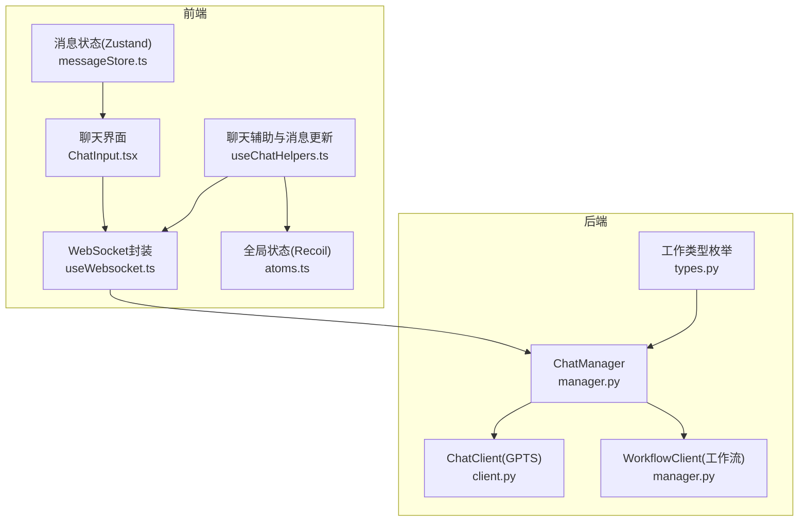
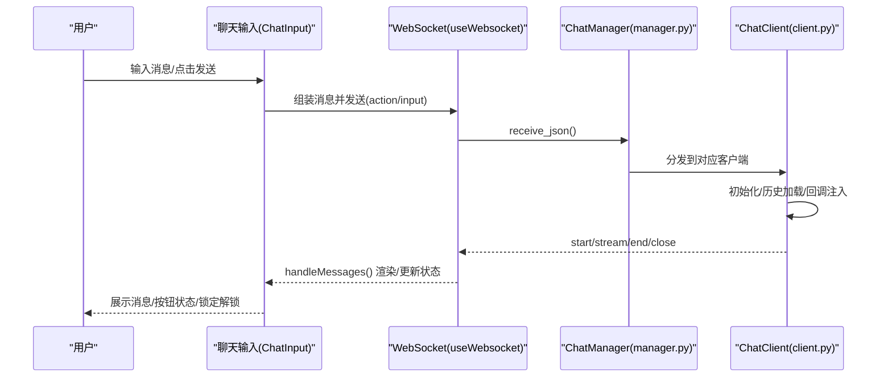
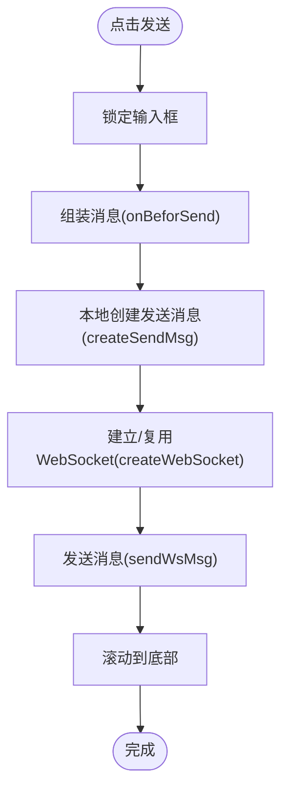
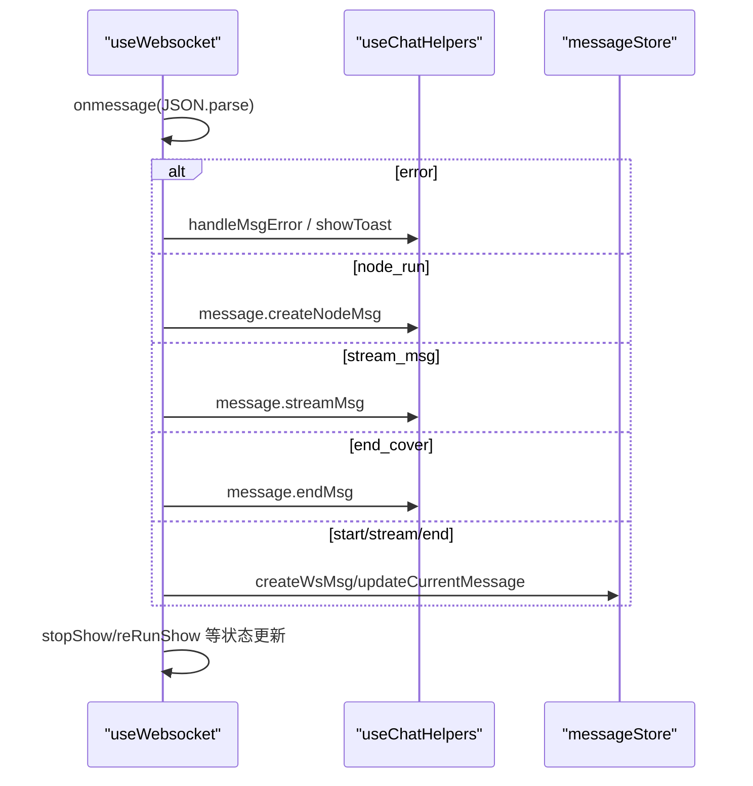
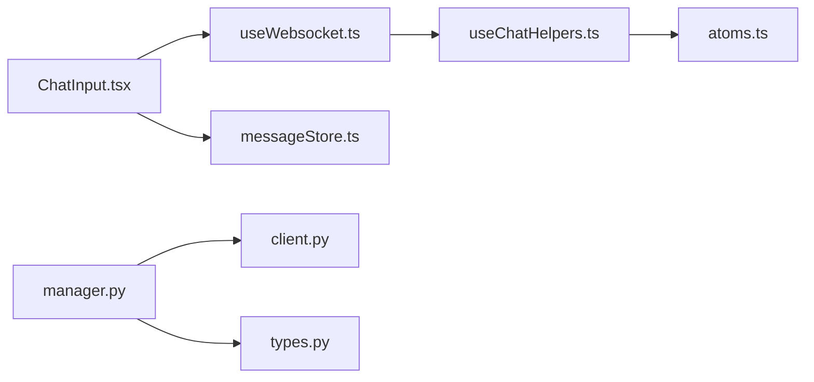

# 聊天组件

<cite>
**本文引用的文件**
- [useChatHelpers.ts](file://src/frontend/client/src/pages/appChat/useChatHelpers.ts)
- [useWebsocket.ts](file://src/frontend/client/src/pages/appChat/useWebsocket.ts)
- [ChatInput.tsx](file://src/frontend/platform/src/components/bs-comp/chatComponent/ChatInput.tsx)
- [messageStore.ts](file://src/frontend/platform/src/components/bs-comp/chatComponent/messageStore.ts)
- [manager.py](file://src/backend/bisheng/chat/manager.py)
- [client.py](file://src/backend/bisheng/chat/client.py)
- [types.py](file://src/backend/bisheng/chat/types.py)
- [SearchMessage.tsx](file://src/frontend/client/src/components/Chat/Messages/SearchMessage.tsx)
- [README.md](file://src/frontend/client/src/pages/appChat/README.md)
- [atoms.ts](file://src/frontend/client/src/pages/appChat/store/atoms.ts)
</cite>

## 目录
1. [简介](#简介)
2. [项目结构](#项目结构)
3. [核心组件](#核心组件)
4. [架构总览](#架构总览)
5. [组件详解](#组件详解)
6. [依赖关系分析](#依赖关系分析)
7. [性能考量](#性能考量)
8. [故障排查指南](#故障排查指南)
9. [结论](#结论)
10. [附录：使用示例与最佳实践](#附录使用示例与最佳实践)

## 简介
本技术文档围绕聊天组件系统进行深入剖析，涵盖聊天输入框、消息显示、按钮操作等核心组件的实现与交互；系统性阐述状态管理机制、消息存储策略、实时通信处理流程；说明组件间事件传递与数据绑定方式；提供完整使用示例与性能优化、内存管理、错误处理策略，并展示在不同业务场景下的应用模式与扩展方法。

## 项目结构
前端采用 React + Zustand/Recoil 状态管理，后端基于 FastAPI + WebSocket 实现聊天会话与消息分发。前端通过 WebSocket 与后端交互，后端根据会话类型（技能/助手/工作流）调度不同客户端处理器，最终将消息以流式或非流式方式回传前端。

图表来源
- [ChatInput.tsx](file://src/frontend/platform/src/components/bs-comp/chatComponent/ChatInput.tsx#L1-L394)
- [useWebsocket.ts](file://src/frontend/client/src/pages/appChat/useWebsocket.ts#L1-L375)
- [useChatHelpers.ts](file://src/frontend/client/src/pages/appChat/useChatHelpers.ts#L1-L448)
- [messageStore.ts](file://src/frontend/platform/src/components/bs-comp/chatComponent/messageStore.ts#L1-L343)
- [manager.py](file://src/backend/bisheng/chat/manager.py#L204-L288)
- [client.py](file://src/backend/bisheng/chat/client.py#L33-L372)
- [types.py](file://src/backend/bisheng/chat/types.py#L1-L23)

章节来源
- [ChatInput.tsx](file://src/frontend/platform/src/components/bs-comp/chatComponent/ChatInput.tsx#L1-L394)
- [useWebsocket.ts](file://src/frontend/client/src/pages/appChat/useWebsocket.ts#L1-L375)
- [useChatHelpers.ts](file://src/frontend/client/src/pages/appChat/useChatHelpers.ts#L1-L448)
- [messageStore.ts](file://src/frontend/platform/src/components/bs-comp/chatComponent/messageStore.ts#L1-L343)
- [manager.py](file://src/backend/bisheng/chat/manager.py#L1-L718)
- [client.py](file://src/backend/bisheng/chat/client.py#L1-L372)
- [types.py](file://src/backend/bisheng/chat/types.py#L1-L23)

## 核心组件
- 聊天输入组件：负责输入框、发送按钮、停止按钮、表单输入、引导问题、语音转文字等交互，同时维护输入锁定与会话切换逻辑。
- WebSocket 封装：负责连接建立、消息分发、错误处理、重连策略、动作类型（输入/停止/重启/表单提交等）。
- 聊天辅助与消息更新：负责消息去重、流式更新、分段插入、错误与关闭处理、运行态控制。
- 消息状态管理（Zustand）：负责历史消息加载、消息列表维护、消息合并与覆盖、分隔符插入等。
- 后端 ChatManager：负责 WebSocket 连接管理、消息持久化、任务调度、异常处理、会话生命周期。
- ChatClient：负责 GPTS 类型会话的历史加载、回调注入、消息入库、流式队列处理、停止逻辑。

章节来源
- [ChatInput.tsx](file://src/frontend/platform/src/components/bs-comp/chatComponent/ChatInput.tsx#L73-L119)
- [useWebsocket.ts](file://src/frontend/client/src/pages/appChat/useWebsocket.ts#L28-L223)
- [useChatHelpers.ts](file://src/frontend/client/src/pages/appChat/useChatHelpers.ts#L134-L414)
- [messageStore.ts](file://src/frontend/platform/src/components/bs-comp/chatComponent/messageStore.ts#L92-L330)
- [manager.py](file://src/backend/bisheng/chat/manager.py#L86-L288)
- [client.py](file://src/backend/bisheng/chat/client.py#L33-L372)

## 架构总览
前端通过 WebSocket 与后端交互，后端根据会话类型选择对应客户端处理器。消息以“开始/流式/结束/关闭”等类型在前后端之间流转，前端负责渲染与状态更新，后端负责业务执行与持久化。

图表来源
- [ChatInput.tsx](file://src/frontend/platform/src/components/bs-comp/chatComponent/ChatInput.tsx#L73-L119)
- [useWebsocket.ts](file://src/frontend/client/src/pages/appChat/useWebsocket.ts#L91-L207)
- [manager.py](file://src/backend/bisheng/chat/manager.py#L204-L288)
- [client.py](file://src/backend/bisheng/chat/client.py#L68-L372)

## 组件详解

### 聊天输入组件（ChatInput）
职责与特性
- 输入框自适应高度、回车发送、语音转文字集成。
- 发送前清理输入框、创建发送消息、锁定输入、建立/复用 WebSocket 并发送消息。
- 停止按钮：向后端发送停止动作，前端更新按钮状态与输入锁定。
- 表单输入：当后端返回 input 类型消息时，前端弹出表单并收集数据后再次发送。
- 引导问题：支持点击快速发送预设问题。
- 会话切换：首次连接时发送空消息以初始化会话。

交互流程（发送消息）

图表来源
- [ChatInput.tsx](file://src/frontend/platform/src/components/bs-comp/chatComponent/ChatInput.tsx#L73-L119)

章节来源
- [ChatInput.tsx](file://src/frontend/platform/src/components/bs-comp/chatComponent/ChatInput.tsx#L18-L394)

### WebSocket 封装（useWebsocket）
职责与特性
- 连接管理：根据协议自动选择 ws/wss，连接成功后发送初始化消息（技能/助手/工作流）。
- 消息分发：根据消息类型（begin/start/stream/end/close/error）调用 useChatHelpers 或 messageStore 进行状态更新。
- 动作类型：INPUT/STOP/RESTART/FORM_SUBMIT/SKILL_INPUT/SKILL_FORM_SUBMIT 等。
- 重连与错误：捕获 onerror/onclose，必要时提示与清理状态。
- 提交数据联动：监听 submitDataState，自动发送对应动作消息。

序列图（消息接收与处理）

图表来源
- [useWebsocket.ts](file://src/frontend/client/src/pages/appChat/useWebsocket.ts#L118-L207)

章节来源
- [useWebsocket.ts](file://src/frontend/client/src/pages/appChat/useWebsocket.ts#L28-L375)

### 聊天辅助与消息更新（useChatHelpers）
职责与特性
- 消息分类与更新：createMsg/streamMsg/skillStreamMsg 等针对不同类别消息进行创建/更新。
- 流式消息合并：基于 unique_id+output_key 定位消息并增量更新。
- 去重与闭合：deduplicateMessages 去除重复消息；endMsg 在安全审计时删除未结束消息并闭合。
- 运行态控制：stopShow/reRunShow/showInputForm/showGuideQuestion 等控制 UI 与输入状态。
- URL 生成：根据会话类型动态生成 WebSocket URL（技能/助手/工作流）。

章节来源
- [useChatHelpers.ts](file://src/frontend/client/src/pages/appChat/useChatHelpers.ts#L134-L448)
- [atoms.ts](file://src/frontend/client/src/pages/appChat/store/atoms.ts#L1-L107)

### 消息状态管理（Zustand messageStore）
职责与特性
- 历史消息加载：按需加载历史消息，支持“追加历史/分页加载”。
- 消息合并与覆盖：根据 run logs 类型与 extra 字段匹配当前消息，支持 end/end_cover 覆盖。
- 分隔符与系统消息：插入分隔符、引导问题、系统提示等。
- 消息去重与边界处理：对无内容的中间消息进行剔除，避免空消息污染界面。

章节来源
- [messageStore.ts](file://src/frontend/platform/src/components/bs-comp/chatComponent/messageStore.ts#L92-L330)

### 后端 ChatManager 与 ChatClient
职责与特性
- ChatManager
  - 连接管理：accept_client/dispatch_client，维持 active_clients 与 active_connections。
  - 消息持久化：ChatHistory.add_message 将消息写入数据库并通知订阅者。
  - 任务调度：线程池执行业务任务，异常统一捕获并返回错误消息。
  - 生命周期：连接关闭、异常关闭、会话结束统计与审计日志。
- ChatClient（GPTS）
  - 历史加载：get_latest_history 仅取完整问答对，避免中断历史影响。
  - 回调注入：AsyncGptsDebugCallbackHandler 注入流式输出队列。
  - 停止逻辑：stop_handle_message 清理队列并将残留内容入库与回传。

章节来源
- [manager.py](file://src/backend/bisheng/chat/manager.py#L86-L718)
- [client.py](file://src/backend/bisheng/chat/client.py#L33-L372)
- [types.py](file://src/backend/bisheng/chat/types.py#L1-L23)

### 消息显示组件（SearchMessage）
职责与特性
- 渲染用户/助手消息头像、标签与内容。
- 支持搜索类消息的子行、按钮与内容区域渲染。
- 通过 Recoil 状态控制用户名显示与字号等样式。

章节来源
- [SearchMessage.tsx](file://src/frontend/client/src/components/Chat/Messages/SearchMessage.tsx#L1-L78)

## 依赖关系分析
- 前端依赖
  - useChatHelpers 依赖 Recoil 状态（chatsState/currentChatState/runningState 等）。
  - useWebsocket 依赖 useChatHelpers 与 submitDataState，负责动作派发。
  - ChatInput 依赖 messageStore 与 WebSocket，负责 UI 交互与输入锁定。
- 后端依赖
  - ChatManager 依赖 ChatClient/WorkflowClient，根据 WorkType 分发消息。
  - ChatClient 依赖 AssistantAgent、AsyncGptsDebugCallbackHandler、数据库 DAO。

图表来源
- [useChatHelpers.ts](file://src/frontend/client/src/pages/appChat/useChatHelpers.ts#L1-L448)
- [useWebsocket.ts](file://src/frontend/client/src/pages/appChat/useWebsocket.ts#L1-L375)
- [ChatInput.tsx](file://src/frontend/platform/src/components/bs-comp/chatComponent/ChatInput.tsx#L1-L394)
- [messageStore.ts](file://src/frontend/platform/src/components/bs-comp/chatComponent/messageStore.ts#L1-L343)
- [manager.py](file://src/backend/bisheng/chat/manager.py#L1-L718)
- [client.py](file://src/backend/bisheng/chat/client.py#L1-L372)
- [types.py](file://src/backend/bisheng/chat/types.py#L1-L23)
- [atoms.ts](file://src/frontend/client/src/pages/appChat/store/atoms.ts#L1-L107)

章节来源
- [README.md](file://src/frontend/client/src/pages/appChat/README.md#L5-L7)

## 性能考量
- 前端
  - 使用 Immer 与不可变更新减少不必要的重渲染。
  - 流式消息按 unique_id+output_key 合并，避免频繁重建 DOM。
  - 自适应输入框高度，减少布局抖动。
  - 消息去重与空消息过滤，降低渲染压力。
- 后端
  - 线程池执行业务任务，避免阻塞 WebSocket 主循环。
  - 流式输出通过队列聚合，减少频繁 IO。
  - 会话历史仅取完整问答对，缩短上下文长度。
- 通用
  - WebSocket 连接复用与单例管理，避免重复握手。
  - 错误与关闭消息及时清理，防止资源泄漏。

[本节为通用指导，无需特定文件引用]

## 故障排查指南
- 连接失败
  - 检查协议是否为 wss（HTTPS），确保后端 WebSocket 地址正确。
  - 查看 onerror/onclose 回调中的错误码与原因，必要时提示用户网络问题。
- 消息未显示
  - 确认消息类型与 category 是否被前端处理（如 node_run/input/guide_question 等）。
  - 检查流式消息合并键（unique_id+output_key）是否一致。
- 输入无法发送
  - 检查输入锁定状态（inputLock.locked），表单弹窗可能临时锁定输入。
  - 确认 submitDataState 是否被消费（useEffect 中监听 submitData）。
- 后端异常
  - 查看 ChatManager 的异常捕获与关闭逻辑，确认错误消息是否回传。
  - 检查 ChatClient 的停止逻辑与流式队列清理。

章节来源
- [useWebsocket.ts](file://src/frontend/client/src/pages/appChat/useWebsocket.ts#L113-L117)
- [ChatInput.tsx](file://src/frontend/platform/src/components/bs-comp/chatComponent/ChatInput.tsx#L105-L119)
- [manager.py](file://src/backend/bisheng/chat/manager.py#L204-L288)
- [client.py](file://src/backend/bisheng/chat/client.py#L264-L289)

## 结论
该聊天组件系统通过清晰的前后端分工与状态管理，实现了稳定的消息收发、流式渲染与会话生命周期管理。前端以 React/Zustand/Recoil 保证交互流畅与状态可控，后端以 ChatManager/ChatClient 提供可扩展的业务处理能力。通过合理的去重、合并与错误处理策略，系统在复杂业务场景下仍能保持良好的性能与用户体验。

[本节为总结，无需特定文件引用]

## 附录：使用示例与最佳实践

### 使用示例
- 发送消息
  - 前端：用户输入消息 → ChatInput 组装消息 → WebSocket 发送 → 后端处理 → useChatHelpers 更新消息 → 渲染显示。
  - 参考路径：[ChatInput.tsx](file://src/frontend/platform/src/components/bs-comp/chatComponent/ChatInput.tsx#L73-L119)、[useWebsocket.ts](file://src/frontend/client/src/pages/appChat/useWebsocket.ts#L224-L239)
- 接收消息
  - 前端：WebSocket 监听消息 → 分类处理（流式/结束/错误/节点运行）→ useChatHelpers 或 messageStore 更新 → 渲染。
  - 参考路径：[useWebsocket.ts](file://src/frontend/client/src/pages/appChat/useWebsocket.ts#L118-L207)、[README.md](file://src/frontend/client/src/pages/appChat/README.md#L5-L7)
- 用户反馈
  - 前端：错误提示（toast）、运行态控制（停止/重试）、输入锁定/解锁。
  - 参考路径：[useWebsocket.ts](file://src/frontend/client/src/pages/appChat/useWebsocket.ts#L144-L152)、[ChatInput.tsx](file://src/frontend/platform/src/components/bs-comp/chatComponent/ChatInput.tsx#L112-L119)

### 最佳实践
- 前端
  - 使用 submitDataState 驱动动作发送，避免直接跨组件耦合。
  - 对流式消息进行去重与合并，提升渲染效率。
  - 严格区分 run logs 与普通消息，使用 extra 字段精准定位。
- 后端
  - 通过线程池隔离耗时任务，避免阻塞 WebSocket。
  - 对异常进行分类处理并回传前端友好提示。
  - 会话历史仅取完整问答对，减少上下文噪声。

[本节为通用指导，无需特定文件引用]