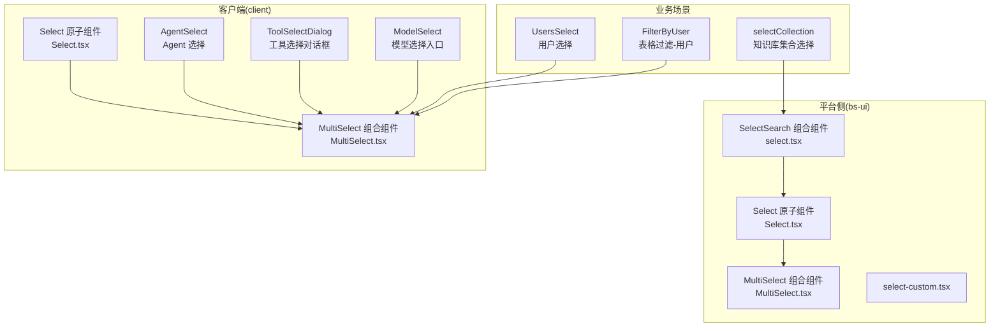
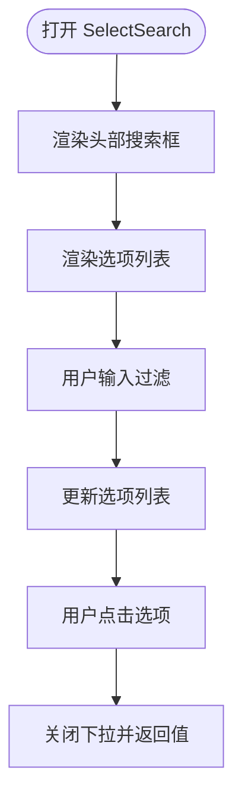
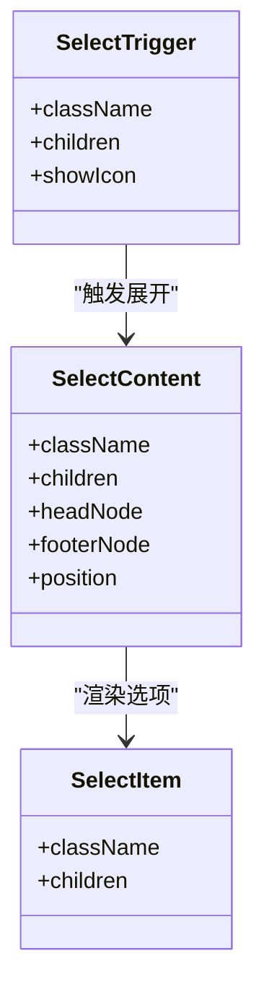
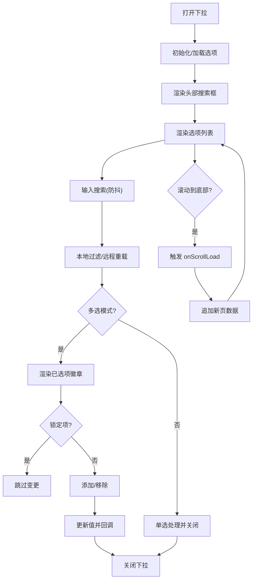
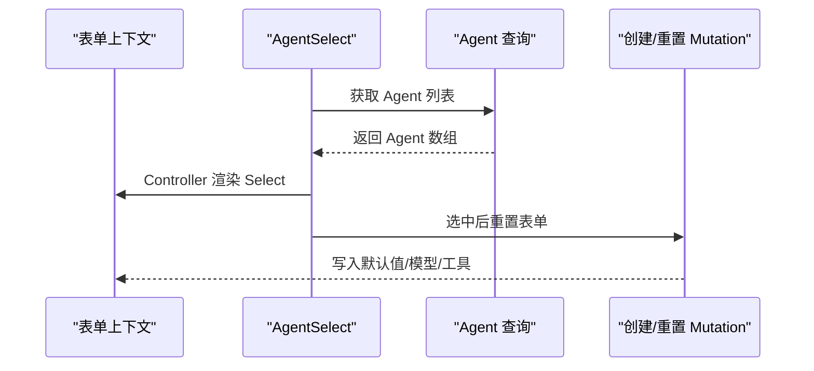
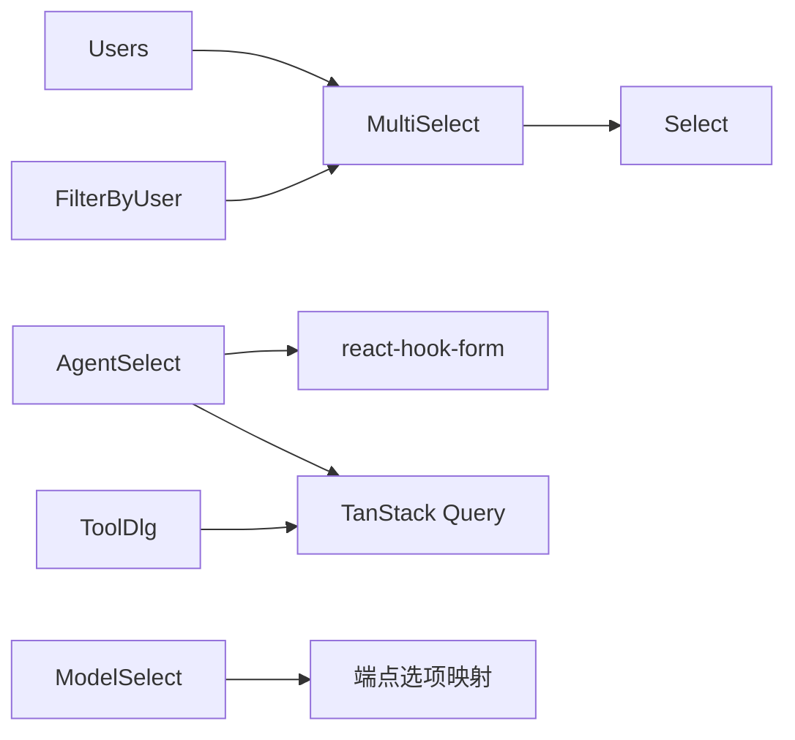

# 选择组件

<cite>
**本文引用的文件**
- [src/frontend/platform/src/components/bs-ui/select/select.tsx](file://src/frontend/platform/src/components/bs-ui/select/select.tsx)
- [src/frontend/client/src/components/ui/Select.tsx](file://src/frontend/client/src/components/ui/Select.tsx)
- [src/frontend/client/src/components/ui/MultiSelect.tsx](file://src/frontend/client/src/components/ui/MultiSelect.tsx)
- [src/frontend/platform/src/components/ui/select-custom.tsx](file://src/frontend/platform/src/components/ui/select-custom.tsx)
- [src/frontend/platform/src/pages/BuildPage/skills/editSkill/CollectionNameComponent/selectCollection.tsx](file://src/frontend/platform/src/pages/BuildPage/skills/editSkill/CollectionNameComponent/selectCollection.tsx)
- [src/frontend/client/src/components/SidePanel/Agents/AgentSelect.tsx](file://src/frontend/client/src/components/SidePanel/Agents/AgentSelect.tsx)
- [src/frontend/client/src/components/Tools/ToolSelectDialog.tsx](file://src/frontend/client/src/components/Tools/ToolSelectDialog.tsx)
- [src/frontend/client/src/components/Input/ModelSelect/ModelSelect.tsx](file://src/frontend/client/src/components/Input/ModelSelect/ModelSelect.tsx)
- [src/frontend/platform/src/components/bs-comp/selectComponent/Users.tsx](file://src/frontend/platform/src/components/bs-comp/selectComponent/Users.tsx)
- [src/frontend/platform/src/components/bs-comp/filterTableDataComponent/FilterByUser.tsx](file://src/frontend/platform/src/components/bs-comp/filterTableDataComponent/FilterByUser.tsx)
</cite>

## 目录
1. [简介](#简介)
2. [项目结构](#项目结构)
3. [核心组件](#核心组件)
4. [架构总览](#架构总览)
5. [详细组件分析](#详细组件分析)
6. [依赖分析](#依赖分析)
7. [性能考虑](#性能考虑)
8. [故障排查指南](#故障排查指南)
9. [结论](#结论)
10. [附录：使用示例与最佳实践](#附录使用示例与最佳实践)

## 简介
本技术文档聚焦于选择组件系统，覆盖标签选择、用户选择、知识库选择等核心场景，系统性阐述以下主题：
- 数据源管理：本地静态选项、远程分页加载、搜索过滤
- 选项渲染：单选/多选模式、可锁定项、清空按钮、头部/底部节点
- 值变更通知：受控/非受控、表单集成（react-hook-form）、回调链路
- 验证机制：错误态样式、必填校验、禁用状态
- 性能优化：防抖搜索、虚拟滚动/高度自适应、IntersectionObserver 懒加载
- 应用模式：表单字段、配置面板、对话框选择、工具安装选择

## 项目结构
选择组件体系由两套实现构成：
- 平台侧（platform）：基于 Radix UI 的 Select 原子组件与组合组件（含搜索输入、多选容器、自定义样式等）
- 客户端（client）：面向业务的 Select、MultiSelect、以及业务场景组件（如 AgentSelect、ToolSelectDialog、ModelSelect）



图表来源
- [src/frontend/platform/src/components/bs-ui/select/select.tsx](file://src/frontend/platform/src/components/bs-ui/select/select.tsx#L1-L47)
- [src/frontend/client/src/components/ui/Select.tsx](file://src/frontend/client/src/components/ui/Select.tsx#L1-L155)
- [src/frontend/client/src/components/ui/MultiSelect.tsx](file://src/frontend/client/src/components/ui/MultiSelect.tsx#L1-L304)
- [src/frontend/platform/src/components/ui/select-custom.tsx](file://src/frontend/platform/src/components/ui/select-custom.tsx#L1-L108)
- [src/frontend/client/src/components/SidePanel/Agents/AgentSelect.tsx](file://src/frontend/client/src/components/SidePanel/Agents/AgentSelect.tsx#L1-L190)
- [src/frontend/client/src/components/Tools/ToolSelectDialog.tsx](file://src/frontend/client/src/components/Tools/ToolSelectDialog.tsx#L1-L257)
- [src/frontend/client/src/components/Input/ModelSelect/ModelSelect.tsx](file://src/frontend/client/src/components/Input/ModelSelect/ModelSelect.tsx#L1-L51)
- [src/frontend/platform/src/components/bs-comp/selectComponent/Users.tsx](file://src/frontend/platform/src/components/bs-comp/selectComponent/Users.tsx#L1-L48)
- [src/frontend/platform/src/components/bs-comp/filterTableDataComponent/FilterByUser.tsx](file://src/frontend/platform/src/components/bs-comp/filterTableDataComponent/FilterByUser.tsx#L1-L41)

章节来源
- [src/frontend/platform/src/components/bs-ui/select/select.tsx](file://src/frontend/platform/src/components/bs-ui/select/select.tsx#L1-L47)
- [src/frontend/client/src/components/ui/Select.tsx](file://src/frontend/client/src/components/ui/Select.tsx#L1-L155)
- [src/frontend/client/src/components/ui/MultiSelect.tsx](file://src/frontend/client/src/components/ui/MultiSelect.tsx#L1-L304)
- [src/frontend/platform/src/components/ui/select-custom.tsx](file://src/frontend/platform/src/components/ui/select-custom.tsx#L1-L108)

## 核心组件
- 平台 Select 原子组件：提供 Trigger、Content、Item、Group 等基础能力，支持 popper 定位、Portal 渲染、滚动按钮占位等
- 平台 SelectSearch 组合组件：在 SelectContent 内部嵌入 SearchInput，实现“带搜索”的下拉列表
- 客户端 Select 原子组件：与平台版本类似，但样式与图标略有差异
- 客户端 MultiSelect 组合组件：支持多选、搜索防抖、滚动懒加载、清空按钮、锁定项、错误态样式、受控/非受控值管理
- 业务组件：AgentSelect（表单+查询集成）、ToolSelectDialog（对话框+分页+搜索）、ModelSelect（按端点动态渲染选项）

章节来源
- [src/frontend/platform/src/components/bs-ui/select/select.tsx](file://src/frontend/platform/src/components/bs-ui/select/select.tsx#L1-L47)
- [src/frontend/client/src/components/ui/Select.tsx](file://src/frontend/client/src/components/ui/Select.tsx#L1-L155)
- [src/frontend/client/src/components/ui/MultiSelect.tsx](file://src/frontend/client/src/components/ui/MultiSelect.tsx#L1-L304)

## 架构总览
选择组件的控制流遵循“受控值 + 回调通知”的模式，结合数据源（本地/远程）与渲染（单选/多选）策略，形成统一的交互体验。

```mermaid
sequenceDiagram
participant U as "用户"
participant MS as "MultiSelect"
participant SC as "SelectContent"
participant OPT as "选项列表"
participant DS as "数据源(本地/远程)"
U->>MS : 打开下拉
MS->>SC : 渲染内容区
SC->>OPT : 渲染选项
U->>OPT : 点击选项
OPT-->>MS : 通知值变更
MS->>MS : 更新内部值/受控值
MS-->>U : 关闭下拉/显示选中项
MS->>DS : 搜索时触发 onSearch
MS->>DS : 滚动触底触发 onScrollLoad
```

图表来源
- [src/frontend/client/src/components/ui/MultiSelect.tsx](file://src/frontend/client/src/components/ui/MultiSelect.tsx#L96-L304)

## 详细组件分析

### 平台 SelectSearch 组件
- 功能要点
  - 在 SelectContent 中插入 SearchInput，支持输入事件透传与键盘事件冒泡阻止
  - 支持外部 children 与 options 列表渲染
  - 提供 selectClass/contentClass 自定义样式
- 适用场景
  - 需要“带搜索”的下拉选择，如知识库集合选择



图表来源
- [src/frontend/platform/src/components/bs-ui/select/select.tsx](file://src/frontend/platform/src/components/bs-ui/select/select.tsx#L18-L47)

章节来源
- [src/frontend/platform/src/components/bs-ui/select/select.tsx](file://src/frontend/platform/src/components/bs-ui/select/select.tsx#L1-L47)

### 客户端 Select 原子组件
- 功能要点
  - 封装 Radix UI Select，提供 Trigger、Content、Item、Label、Separator 等
  - 支持图标切换、Portal 渲染、popper 定位、Viewport 尺寸适配
  - 支持 headNode/footerNode 注入自定义头部/底部节点
- 适用场景
  - 表单字段、配置面板、对话框等基础选择



图表来源
- [src/frontend/client/src/components/ui/Select.tsx](file://src/frontend/client/src/components/ui/Select.tsx#L14-L153)

章节来源
- [src/frontend/client/src/components/ui/Select.tsx](file://src/frontend/client/src/components/ui/Select.tsx#L1-L155)

### 客户端 MultiSelect 组合组件
- 数据源与渲染
  - options: 选项数组（label/value），支持本地过滤与远程分页
  - children/footerNode: 可注入额外节点或底部加载提示
  - 头部 tabs/searchPlaceholder/placeholder 控制头部区域
- 多选/单选
  - multiple=false：单选，自动关闭下拉
  - multiple=true：多选，渲染 Badge，支持删除、锁定项、清空
- 搜索与懒加载
  - 防抖搜索：useDebounce 控制 500ms
  - 滚动懒加载：IntersectionObserver 监听底部节点进入视口触发 onScrollLoad
- 值变更与表单集成
  - 受控/非受控：value/defaultValue
  - onChange 回调：返回当前值数组或对象数组（取决于是否启用 onScrollLoad）
  - 错误态：error/errorKeys 控制边框颜色与高亮
  - 禁用/锁定：disabled/lockedValues
- 适用场景
  - 用户选择、角色/权限选择、工具选择、表格过滤



图表来源
- [src/frontend/client/src/components/ui/MultiSelect.tsx](file://src/frontend/client/src/components/ui/MultiSelect.tsx#L96-L304)

章节来源
- [src/frontend/client/src/components/ui/MultiSelect.tsx](file://src/frontend/client/src/components/ui/MultiSelect.tsx#L1-L304)

### 平台 select-custom.tsx
- 功能要点
  - 轻量封装 Radix UI Select，简化 Trigger/Content/Item 结构
  - 支持 position="popper" 的定位策略
- 适用场景
  - 对样式要求较低、快速复用的基础选择器

章节来源
- [src/frontend/platform/src/components/ui/select-custom.tsx](file://src/frontend/platform/src/components/ui/select-custom.tsx#L1-L108)

### 业务场景组件

#### AgentSelect（用户选择/表单集成）
- 数据源：通过查询 Hook 获取 Agent 列表，并映射为选项
- 表单集成：使用 react-hook-form 的 Controller，将选中值写入表单上下文
- 交互：根据选中 Agent 动态重置表单字段（模型、工具、能力等）



图表来源
- [src/frontend/client/src/components/SidePanel/Agents/AgentSelect.tsx](file://src/frontend/client/src/components/SidePanel/Agents/AgentSelect.tsx#L154-L188)

章节来源
- [src/frontend/client/src/components/SidePanel/Agents/AgentSelect.tsx](file://src/frontend/client/src/components/SidePanel/Agents/AgentSelect.tsx#L1-L190)

#### ToolSelectDialog（工具选择对话框）
- 数据源：可用工具列表，支持搜索过滤与分页
- 交互：安装/卸载工具，必要时触发认证流程
- 与 MultiSelect 的关系：对话框内工具网格可视为“多选”场景的可视化呈现

章节来源
- [src/frontend/client/src/components/Tools/ToolSelectDialog.tsx](file://src/frontend/client/src/components/Tools/ToolSelectDialog.tsx#L1-L257)

#### ModelSelect（模型选择入口）
- 数据源：按会话端点动态选择对应模型选项组件
- 适用场景：不同端点（如 OpenAI、Azure）使用不同的模型选项渲染器

章节来源
- [src/frontend/client/src/components/Input/ModelSelect/ModelSelect.tsx](file://src/frontend/client/src/components/Input/ModelSelect/ModelSelect.tsx#L1-L51)

#### UsersSelect（用户选择）
- 数据源：远程分页加载用户，支持搜索与滚动加载
- 交互：多选/单选、锁定不可编辑项、清空按钮

章节来源
- [src/frontend/platform/src/components/bs-comp/selectComponent/Users.tsx](file://src/frontend/platform/src/components/bs-comp/selectComponent/Users.tsx#L1-L48)

#### FilterByUser（表格过滤-用户）
- 数据源：远程分页加载用户，支持搜索与滚动加载
- 交互：多选过滤，支持错误态与占位符

章节来源
- [src/frontend/platform/src/components/bs-comp/filterTableDataComponent/FilterByUser.tsx](file://src/frontend/platform/src/components/bs-comp/filterTableDataComponent/FilterByUser.tsx#L1-L41)

#### selectCollection（知识库集合选择）
- 数据源：本地/远程知识库列表，支持搜索过滤
- 交互：选中项置顶、点击选择回调

章节来源
- [src/frontend/platform/src/pages/BuildPage/skills/editSkill/CollectionNameComponent/selectCollection.tsx](file://src/frontend/platform/src/pages/BuildPage/skills/editSkill/CollectionNameComponent/selectCollection.tsx#L1-L58)

## 依赖分析
- 组件耦合
  - MultiSelect 依赖 Select 原子组件与 SearchInput，具备较强内聚性
  - AgentSelect 依赖 react-hook-form 与数据层查询，耦合业务逻辑
- 外部依赖
  - Radix UI：提供可访问性与 DOM Portal 能力
  - react-hook-form：表单受控与校验
  - TanStack Query：远程数据加载与缓存
- 循环依赖
  - 未发现直接循环依赖；业务组件通过数据层间接耦合



图表来源
- [src/frontend/client/src/components/ui/MultiSelect.tsx](file://src/frontend/client/src/components/ui/MultiSelect.tsx#L1-L304)
- [src/frontend/client/src/components/SidePanel/Agents/AgentSelect.tsx](file://src/frontend/client/src/components/SidePanel/Agents/AgentSelect.tsx#L1-L190)
- [src/frontend/client/src/components/Tools/ToolSelectDialog.tsx](file://src/frontend/client/src/components/Tools/ToolSelectDialog.tsx#L1-L257)
- [src/frontend/client/src/components/Input/ModelSelect/ModelSelect.tsx](file://src/frontend/client/src/components/Input/ModelSelect/ModelSelect.tsx#L1-L51)
- [src/frontend/platform/src/components/bs-comp/selectComponent/Users.tsx](file://src/frontend/platform/src/components/bs-comp/selectComponent/Users.tsx#L1-L48)
- [src/frontend/platform/src/components/bs-comp/filterTableDataComponent/FilterByUser.tsx](file://src/frontend/platform/src/components/bs-comp/filterTableDataComponent/FilterByUser.tsx#L1-L41)

## 性能考虑
- 搜索防抖：MultiSelect 使用 500ms 防抖，降低高频输入对渲染与请求的压力
- 懒加载：通过 IntersectionObserver 监听底部节点，仅在接近底部时触发下一页加载
- 视图优化：SelectContent 使用 Portal 与 popper 定位，避免布局抖动；MultiSelect 支持高度自适应与内部滚动
- 缓存与去重：建议在数据层使用缓存与去重策略，避免重复请求同一关键词
- 渲染优化：大量选项时优先使用远程过滤与分页，减少本地渲染压力

## 故障排查指南
- 无法显示选项
  - 检查 options 是否为空或未正确传入
  - 确认 onOpenChange/onLoad 是否被调用以触发数据加载
- 搜索无效
  - 确认 onSearch 是否绑定，防抖时间是否合理
- 滚动不触发
  - 检查 footerRef 是否存在且可见，IntersectionObserver 阈值与根容器设置
- 多选徽章点击无效
  - 确认 onPointerDown 是否阻止冒泡，删除逻辑是否正确
- 表单值未更新
  - 确认受控值 value 与 onChange 是否成对出现，react-hook-form 的 Controller 是否正确包裹
- 错误态样式未生效
  - 检查 error/errorKeys 是否传入，样式类名拼接逻辑

章节来源
- [src/frontend/client/src/components/ui/MultiSelect.tsx](file://src/frontend/client/src/components/ui/MultiSelect.tsx#L188-L221)
- [src/frontend/client/src/components/SidePanel/Agents/AgentSelect.tsx](file://src/frontend/client/src/components/SidePanel/Agents/AgentSelect.tsx#L28-L122)

## 结论
该选择组件体系以平台级原子组件为基础，结合客户端组合组件与业务场景组件，实现了从基础选择到复杂表单/对话框/过滤的全栈覆盖。其核心优势在于：
- 统一的受控/非受控模式与回调通知
- 强大的远程数据加载与搜索过滤能力
- 多选/单选、锁定项、清空、错误态等丰富交互
- 易于扩展的组合与注入点（headNode/footerNode）

## 附录：使用示例与最佳实践

### 示例一：用户选择（多选 + 远程分页 + 搜索）
- 数据源：UsersSelect
- 关键参数：options、onLoad、onSearch、onScrollLoad、onChange
- 最佳实践：设置合理的分页大小与防抖间隔；对锁定值进行白名单管理

章节来源
- [src/frontend/platform/src/components/bs-comp/selectComponent/Users.tsx](file://src/frontend/platform/src/components/bs-comp/selectComponent/Users.tsx#L1-L48)
- [src/frontend/client/src/components/ui/MultiSelect.tsx](file://src/frontend/client/src/components/ui/MultiSelect.tsx#L188-L221)

### 示例二：表格过滤-用户（多选过滤）
- 数据源：FilterByUser
- 关键参数：value、placeholder、onChange
- 最佳实践：在 onChange 中同步更新表格过滤条件；对错误态进行提示

章节来源
- [src/frontend/platform/src/components/bs-comp/filterTableDataComponent/FilterByUser.tsx](file://src/frontend/platform/src/components/bs-comp/filterTableDataComponent/FilterByUser.tsx#L1-L41)

### 示例三：知识库集合选择（本地搜索）
- 数据源：selectCollection
- 关键参数：collectionId、onChange
- 最佳实践：选中项置顶提升可发现性；对搜索结果进行节流

章节来源
- [src/frontend/platform/src/pages/BuildPage/skills/editSkill/CollectionNameComponent/selectCollection.tsx](file://src/frontend/platform/src/pages/BuildPage/skills/editSkill/CollectionNameComponent/selectCollection.tsx#L1-L58)

### 示例四：Agent 选择（表单集成）
- 数据源：Agent 查询
- 关键参数：selectedAgentId、setCurrentAgentId、createMutation
- 最佳实践：在选中后重置表单字段；对全局/项目级 Agent 进行视觉区分

章节来源
- [src/frontend/client/src/components/SidePanel/Agents/AgentSelect.tsx](file://src/frontend/client/src/components/SidePanel/Agents/AgentSelect.tsx#L1-L190)

### 示例五：工具选择（对话框 + 分页 + 搜索）
- 数据源：可用工具查询
- 关键参数：toolsFormKey、endpoint、isOpen、setIsOpen
- 最佳实践：安装/卸载工具时同步更新表单值；认证失败时及时反馈

章节来源
- [src/frontend/client/src/components/Tools/ToolSelectDialog.tsx](file://src/frontend/client/src/components/Tools/ToolSelectDialog.tsx#L1-L257)

### 示例六：模型选择（按端点动态渲染）
- 数据源：会话端点对应的模型列表
- 关键参数：conversation、setOption、popover、showAbove
- 最佳实践：根据端点类型选择合适的选项组件；保持 UI 一致性

章节来源
- [src/frontend/client/src/components/Input/ModelSelect/ModelSelect.tsx](file://src/frontend/client/src/components/Input/ModelSelect/ModelSelect.tsx#L1-L51)