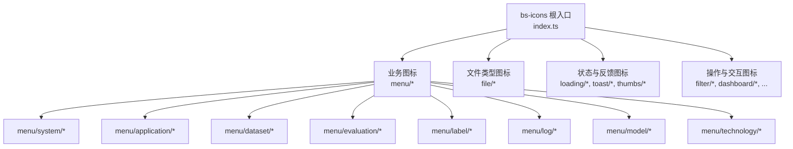
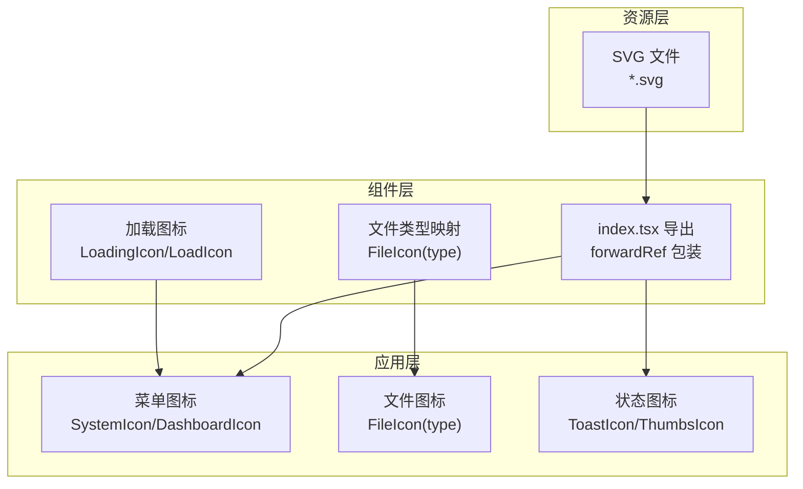
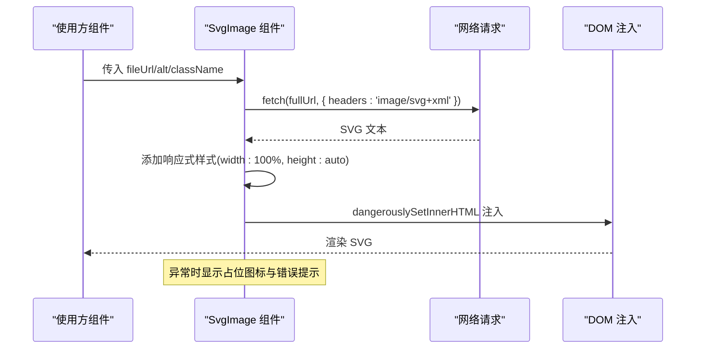
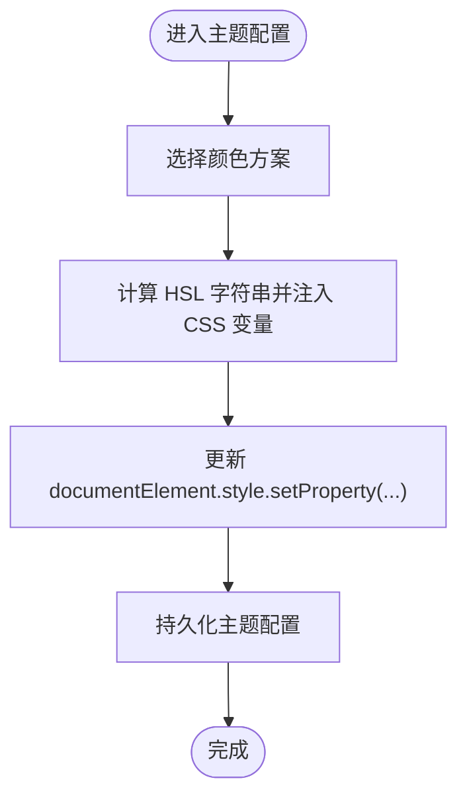
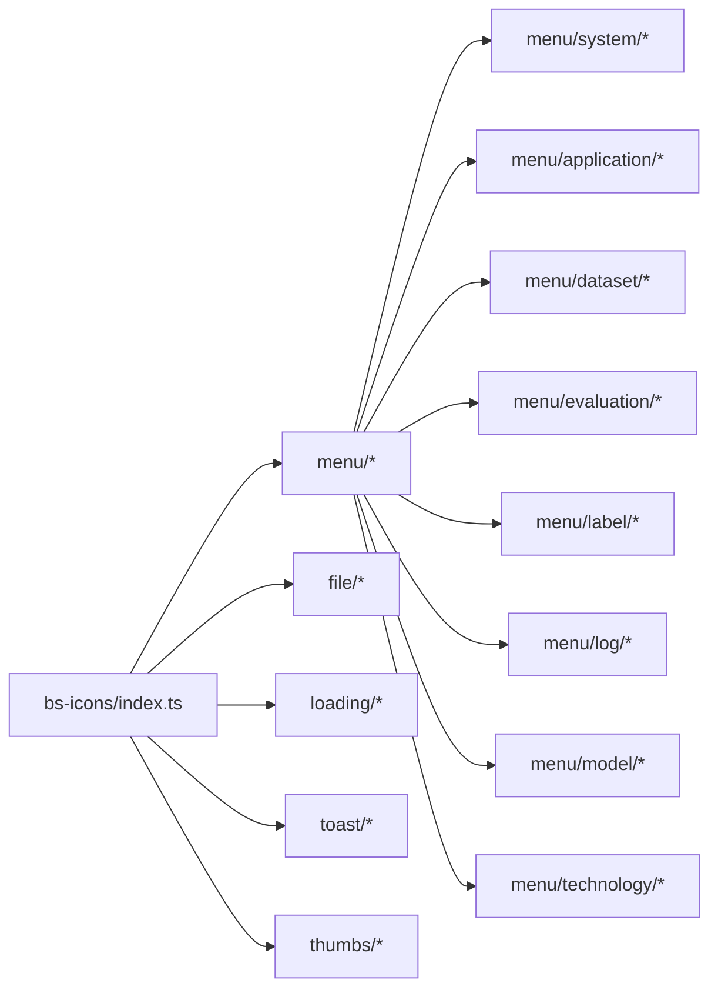

# BS-Icons 图标系统

<cite>
**本文引用的文件**
- [src/frontend/platform/src/components/bs-icons/index.ts](file://src/frontend/platform/src/components/bs-icons/index.ts)
- [src/frontend/platform/src/components/bs-icons/file/index.tsx](file://src/frontend/platform/src/components/bs-icons/file/index.tsx)
- [src/frontend/platform/src/components/bs-icons/loading/index.tsx](file://src/frontend/platform/src/components/bs-icons/loading/index.tsx)
- [src/frontend/platform/src/components/bs-icons/menu/system/index.tsx](file://src/frontend/platform/src/components/bs-icons/menu/system/index.tsx)
- [src/frontend/platform/src/components/bs-icons/filter/index.tsx](file://src/frontend/platform/src/components/bs-icons/filter/index.tsx)
- [src/frontend/platform/src/components/bs-icons/dashboard/index.tsx](file://src/frontend/platform/src/components/bs-icons/dashboard/index.tsx)
- [src/frontend/platform/src/components/LinSight/SvgImage.tsx](file://src/frontend/platform/src/components/LinSight/SvgImage.tsx)
- [src/frontend/client/src/components/SvgImage.tsx](file://src/frontend/client/src/components/SvgImage.tsx)
- [src/frontend/platform/src/pages/SystemPage/theme/index.tsx](file://src/frontend/platform/src/pages/SystemPage/theme/index.tsx)
- [src/frontend/platform/src/pages/Dashboard/components/config/StyleConfigPanel.tsx](file://src/frontend/platform/src/pages/Dashboard/components/config/StyleConfigPanel.tsx)
- [src/frontend/platform/src/pages/Dashboard/colorSchemes.ts](file://src/frontend/platform/src/pages/Dashboard/colorSchemes.ts)
</cite>

## 目录
1. [简介](#简介)
2. [项目结构](#项目结构)
3. [核心组件](#核心组件)
4. [架构总览](#架构总览)
5. [详细组件分析](#详细组件分析)
6. [依赖关系分析](#依赖关系分析)
7. [性能考量](#性能考量)
8. [故障排查指南](#故障排查指南)
9. [结论](#结论)
10. [附录](#附录)

## 简介
本文件为 BS-Icons 图标系统的技术文档，覆盖图标系统的组织架构（业务图标、提供商图标、操作图标等）、设计规范与尺寸标准、颜色约定、组件使用方式、动态加载机制、图标缓存策略、搜索与筛选实现细节、自定义图标添加流程、SVG 优化技术以及主题适配方案，并给出在不同组件中的应用示例与最佳实践。

## 项目结构
BS-Icons 图标系统主要位于前端平台侧的 bs-icons 组件库中，采用按功能域分层的目录组织方式：
- 按功能域分组：如 menu、file、loading、toast、thumbs 等
- 每个功能域下包含对应的 SVG 资源与 index.tsx 导出文件
- 通过统一的 index.ts 汇总导出，便于上层按需引入

图表来源
- [src/frontend/platform/src/components/bs-icons/index.ts](file://src/frontend/platform/src/components/bs-icons/index.ts#L1-L43)
- [src/frontend/platform/src/components/bs-icons/file/index.tsx](file://src/frontend/platform/src/components/bs-icons/file/index.tsx#L1-L66)
- [src/frontend/platform/src/components/bs-icons/menu/system/index.tsx](file://src/frontend/platform/src/components/bs-icons/menu/system/index.tsx#L1-L19)

章节来源
- [src/frontend/platform/src/components/bs-icons/index.ts](file://src/frontend/platform/src/components/bs-icons/index.ts#L1-L43)

## 核心组件
- 统一入口导出：通过根 index.ts 将各图标组件集中导出，便于按需引入与 Tree-shaking
- 动态 SVG 组件：使用 ?react 后缀将 SVG 直接作为 React 组件导入，支持 className 透传与 forwardRef
- 文件类型图标：根据文件扩展名映射到对应图标组件，提供默认兜底
- 加载与反馈图标：支持品牌可配置的加载动画与文案
- 主题适配：通过 CSS 变量与 HSL 调整，实现深浅色模式与主题切换

章节来源
- [src/frontend/platform/src/components/bs-icons/index.ts](file://src/frontend/platform/src/components/bs-icons/index.ts#L1-L43)
- [src/frontend/platform/src/components/bs-icons/file/index.tsx](file://src/frontend/platform/src/components/bs-icons/file/index.tsx#L1-L66)
- [src/frontend/platform/src/components/bs-icons/loading/index.tsx](file://src/frontend/platform/src/components/bs-icons/loading/index.tsx#L1-L22)

## 架构总览
BS-Icons 的整体架构由“资源层（SVG）+ 组件层（React）+ 应用层（使用方）”构成。资源层以 SVG 文件为主；组件层通过 ?react 将 SVG 转换为 React 组件并暴露 forwardRef；应用层通过统一入口按需引入图标组件并在 UI 中渲染。

图表来源
- [src/frontend/platform/src/components/bs-icons/menu/system/index.tsx](file://src/frontend/platform/src/components/bs-icons/menu/system/index.tsx#L1-L19)
- [src/frontend/platform/src/components/bs-icons/file/index.tsx](file://src/frontend/platform/src/components/bs-icons/file/index.tsx#L1-L66)
- [src/frontend/platform/src/components/bs-icons/loading/index.tsx](file://src/frontend/platform/src/components/bs-icons/loading/index.tsx#L1-L22)

## 详细组件分析

### 图标分类与组织
- 业务图标（menu）：涵盖系统、应用、数据集、评估、标签、日志、模型、技术等维度，便于导航与功能分区
- 文件类型图标（file）：覆盖 PDF、DOC/DOCX、PPT/PPTX、TXT/HTML/JSON、图片（JPG/JPEG/PNG/BMP）、CSV/XLS/XLSX 等
- 状态与反馈图标（loading、toast、thumbs）：用于加载、成功/警告/错误、点赞/取消点赞等场景
- 操作图标（filter、dashboard 等）：用于筛选、仪表盘等交互动作

章节来源
- [src/frontend/platform/src/components/bs-icons/index.ts](file://src/frontend/platform/src/components/bs-icons/index.ts#L1-L43)
- [src/frontend/platform/src/components/bs-icons/file/index.tsx](file://src/frontend/platform/src/components/bs-icons/file/index.tsx#L13-L66)
- [src/frontend/platform/src/components/bs-icons/menu/system/index.tsx](file://src/frontend/platform/src/components/bs-icons/menu/system/index.tsx#L1-L19)

### 设计规范与尺寸标准
- 统一尺寸：多数图标采用 24×24 像素视口，部分业务图标采用 16×16 视口
- 统一描边与填充：使用 currentColor 保持与主题色一致
- 响应式处理：在动态加载 SVG 时自动添加 width: 100%、height: auto，保证容器内自适应

章节来源
- [src/frontend/platform/src/components/bs-icons/menu/system/index.tsx](file://src/frontend/platform/src/components/bs-icons/menu/system/index.tsx#L16-L18)
- [src/frontend/platform/src/components/LinSight/SvgImage.tsx](file://src/frontend/platform/src/components/LinSight/SvgImage.tsx#L17-L23)
- [src/frontend/client/src/components/SvgImage.tsx](file://src/frontend/client/src/components/SvgImage.tsx#L72-L74)

### 颜色约定
- 使用 currentColor 与 CSS 变量，确保与主题色一致
- 支持品牌可配置加载图标与动画类名，满足定制化需求
- 主题系统通过 HSL 调整与 CSS 变量注入，实现深浅色与品牌色切换

章节来源
- [src/frontend/platform/src/components/bs-icons/loading/index.tsx](file://src/frontend/platform/src/components/bs-icons/loading/index.tsx#L18-L21)
- [src/frontend/platform/src/pages/SystemPage/theme/index.tsx](file://src/frontend/platform/src/pages/SystemPage/theme/index.tsx#L65-L89)

### 图标组件使用方法
- 通过根入口按需引入：import { SystemIcon, FileIcon, LoadingIcon } from 'bs-icons'
- 传入 className 实现尺寸与样式控制：className="size-6 text-primary"
- 文件类型图标通过 type 参数选择：FileIcon({ type: 'pdf' })

章节来源
- [src/frontend/platform/src/components/bs-icons/index.ts](file://src/frontend/platform/src/components/bs-icons/index.ts#L1-L43)
- [src/frontend/platform/src/components/bs-icons/file/index.tsx](file://src/frontend/platform/src/components/bs-icons/file/index.tsx#L48-L66)

### 动态加载机制
- 动态加载 SVG：通过 fetch 获取 SVG 文本，处理响应式样式后注入到 DOM
- 错误处理：网络异常或解析失败时显示占位图标与错误提示
- 取消请求：组件卸载时主动 abort，避免内存泄漏与竞态

图表来源
- [src/frontend/platform/src/components/LinSight/SvgImage.tsx](file://src/frontend/platform/src/components/LinSight/SvgImage.tsx#L10-L108)
- [src/frontend/client/src/components/SvgImage.tsx](file://src/frontend/client/src/components/SvgImage.tsx#L56-L112)

### 图标缓存策略
- 浏览器缓存：SVG 作为静态资源由浏览器缓存，减少重复请求
- 组件级缓存：动态加载后的 SVG 文本可缓存在组件内部状态，避免重复解析
- 建议：对高频使用的图标建立跨组件共享缓存，结合 key 或唯一标识控制刷新

章节来源
- [src/frontend/platform/src/components/LinSight/SvgImage.tsx](file://src/frontend/platform/src/components/LinSight/SvgImage.tsx#L14-L84)
- [src/frontend/client/src/components/SvgImage.tsx](file://src/frontend/client/src/components/SvgImage.tsx#L56-L87)

### 图标搜索与筛选
- 文件类型筛选：基于 FileIcon 的 type 映射表进行过滤与高亮
- 主题色筛选：通过主题面板选择颜色方案，影响所有使用 currentColor 的图标
- 自定义筛选：可在上层组件中根据业务语义（如文件类型、状态）构建筛选器

章节来源
- [src/frontend/platform/src/components/bs-icons/file/index.tsx](file://src/frontend/platform/src/components/bs-icons/file/index.tsx#L28-L46)
- [src/frontend/platform/src/pages/Dashboard/components/config/StyleConfigPanel.tsx](file://src/frontend/platform/src/pages/Dashboard/components/config/StyleConfigPanel.tsx#L376-L399)
- [src/frontend/platform/src/pages/Dashboard/colorSchemes.ts](file://src/frontend/platform/src/pages/Dashboard/colorSchemes.ts#L400-L443)

### 自定义图标添加流程
- 新建目录：在 bs-icons 下新增功能域子目录（如 custom/newFeature）
- 准备 SVG：确保 SVG 符合 24×24 视口，使用 currentColor，去除固定颜色
- 导入与导出：在该目录的 index.tsx 中使用 ?react 导入 SVG 并 forwardRef 包装
- 统一导出：在根 index.ts 中新增导出项，供上层使用

章节来源
- [src/frontend/platform/src/components/bs-icons/menu/system/index.tsx](file://src/frontend/platform/src/components/bs-icons/menu/system/index.tsx#L1-L9)

### SVG 优化技术
- 内联 SVG：通过 ?react 直接内联为 React 组件，利于 Tree-shaking 与样式控制
- 响应式样式：自动注入 width: 100%、height: auto，适配容器尺寸
- 路径简化：建议在设计阶段精简路径点，减少体积
- 批量压缩：构建时对 SVG 进行压缩与去注释

章节来源
- [src/frontend/platform/src/components/bs-icons/menu/system/index.tsx](file://src/frontend/platform/src/components/bs-icons/menu/system/index.tsx#L16-L18)
- [src/frontend/platform/src/components/LinSight/SvgImage.tsx](file://src/frontend/platform/src/components/LinSight/SvgImage.tsx#L17-L23)

### 图标主题适配方案
- CSS 变量注入：通过主题面板将 HSL 值转换为字符串并注入到 :root
- 动态更新：用户修改主题时，实时更新 CSS 变量，图标随主题变化
- 品牌定制：支持替换加载图标与动画类名，满足品牌一致性

图表来源
- [src/frontend/platform/src/pages/SystemPage/theme/index.tsx](file://src/frontend/platform/src/pages/SystemPage/theme/index.tsx#L65-L89)
- [src/frontend/platform/src/pages/Dashboard/components/config/StyleConfigPanel.tsx](file://src/frontend/platform/src/pages/Dashboard/components/config/StyleConfigPanel.tsx#L376-L399)
- [src/frontend/platform/src/pages/Dashboard/colorSchemes.ts](file://src/frontend/platform/src/pages/Dashboard/colorSchemes.ts#L400-L443)

## 依赖关系分析
- 组件耦合：各图标组件仅依赖其对应的 SVG 资源，耦合度低，便于独立维护
- 统一入口：根 index.ts 聚合导出，降低上层使用复杂度
- 上层依赖：菜单、文件列表、状态反馈等组件通过统一入口引入图标

图表来源
- [src/frontend/platform/src/components/bs-icons/index.ts](file://src/frontend/platform/src/components/bs-icons/index.ts#L1-L43)

章节来源
- [src/frontend/platform/src/components/bs-icons/index.ts](file://src/frontend/platform/src/components/bs-icons/index.ts#L1-L43)

## 性能考量
- 按需引入：通过 ES 模块与 ?react 导入，配合打包工具 Tree-shaking，减少无关图标体积
- 缓存复用：浏览器缓存与组件内缓存相结合，降低重复请求与解析成本
- 渲染优化：SVG 内联组件避免额外 DOM 层级，减少重排与重绘
- 主题切换：CSS 变量更新比重新渲染组件更高效

## 故障排查指南
- SVG 加载失败
  - 现象：动态加载组件显示错误占位图标并输出错误日志
  - 排查：检查 URL 是否正确、网络是否可达、服务端是否返回 SVG 文本
  - 处理：确认 BASE_URL 配置、headers 设置 Accept: image/svg+xml
- 图标不显示或样式异常
  - 现象：图标缺失或颜色不正确
  - 排查：确认 className 是否包含 size-* 与 text-* 类；检查主题 CSS 变量是否生效
- 文件类型图标未命中
  - 现象：type 不匹配导致默认图标显示
  - 排查：核对 type 是否在映射表中；必要时新增映射或扩展类型

章节来源
- [src/frontend/platform/src/components/LinSight/SvgImage.tsx](file://src/frontend/platform/src/components/LinSight/SvgImage.tsx#L72-L79)
- [src/frontend/client/src/components/SvgImage.tsx](file://src/frontend/client/src/components/SvgImage.tsx#L75-L82)
- [src/frontend/platform/src/components/bs-icons/file/index.tsx](file://src/frontend/platform/src/components/bs-icons/file/index.tsx#L58-L65)

## 结论
BS-Icons 图标系统通过清晰的功能域划分、统一的导出入口与动态加载能力，实现了图标资源的标准化与可扩展性。结合 CSS 变量与 HSL 主题系统，图标在不同组件与主题下均能保持一致的视觉体验。建议在实际使用中遵循尺寸与颜色规范，合理利用缓存与按需引入，以获得最佳性能与开发体验。

## 附录
- 最佳实践
  - 使用统一入口按需引入图标，避免全量导入
  - 在容器中通过 className 控制尺寸与颜色，保持一致性
  - 对于动态 SVG，确保响应式样式已注入
  - 主题切换时优先使用 CSS 变量，减少重渲染
- 常见问题
  - 如需新增图标，遵循“新建目录 → 准备 SVG → 导入导出 → 统一导出”的流程
  - 若图标颜色不符合预期，检查主题 CSS 变量与 currentColor 的使用