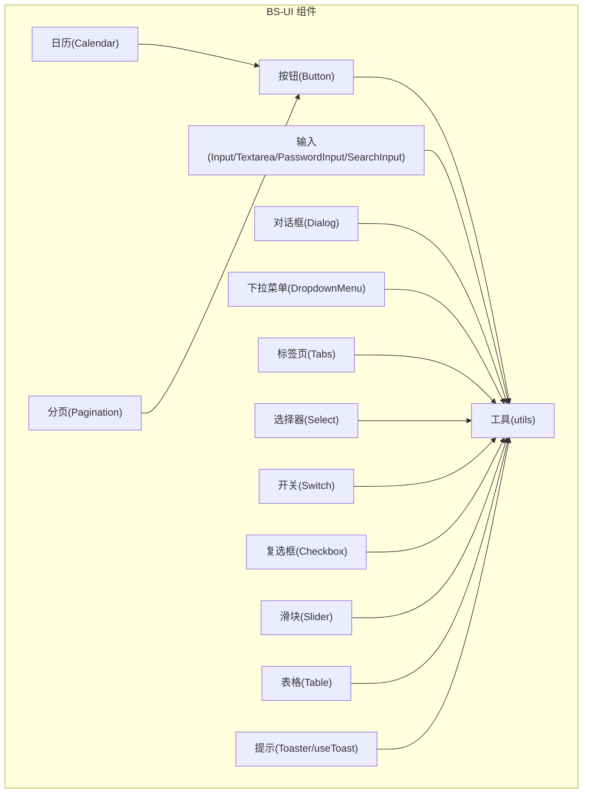
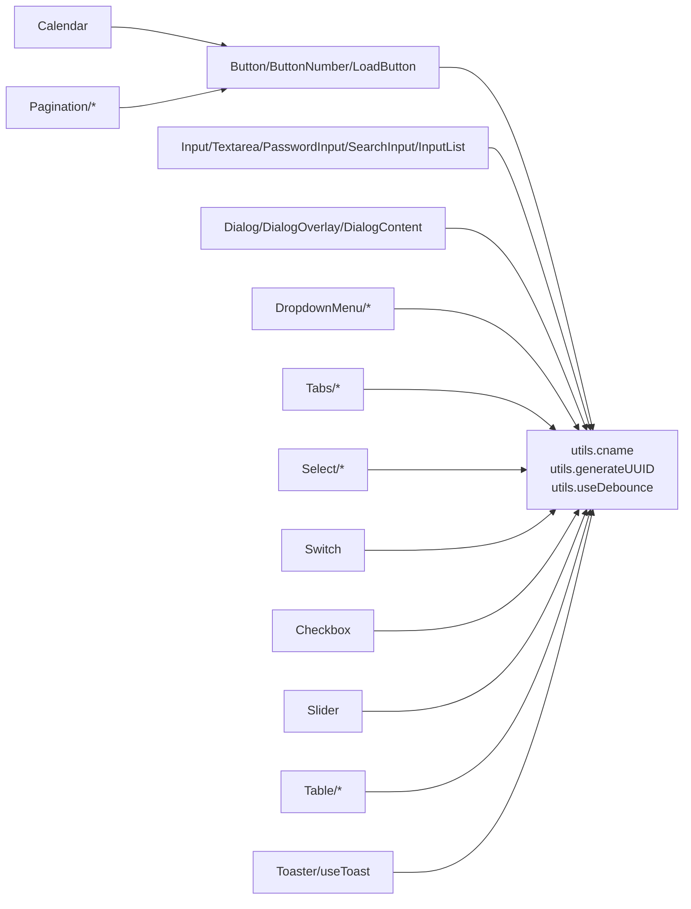
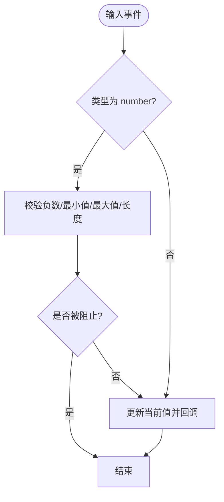
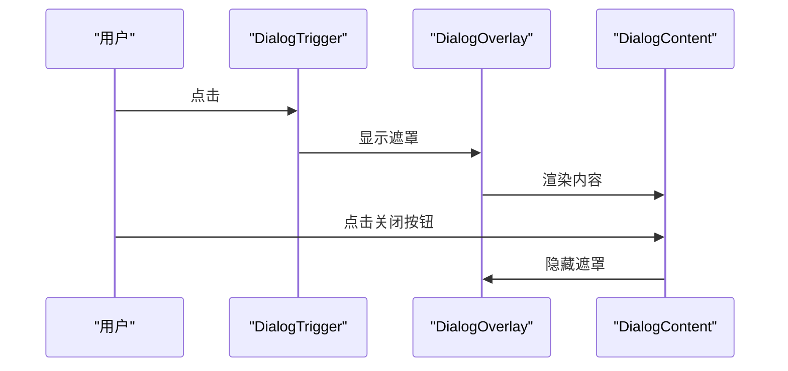
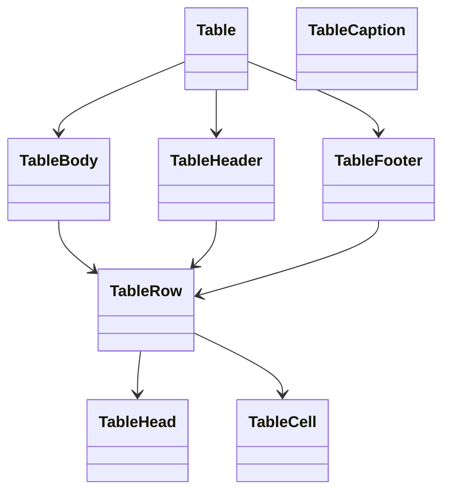
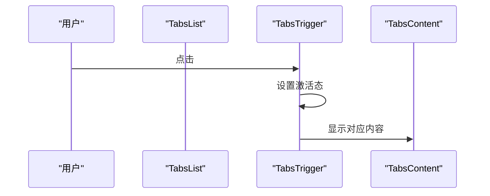
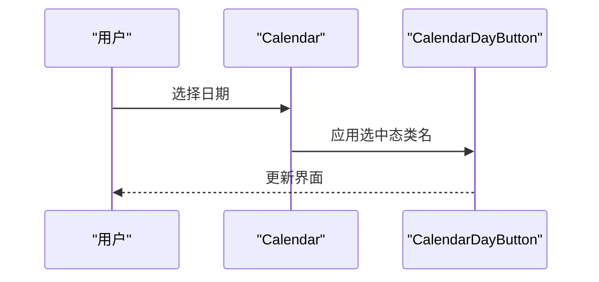
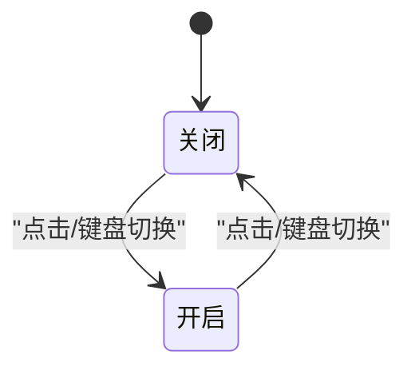
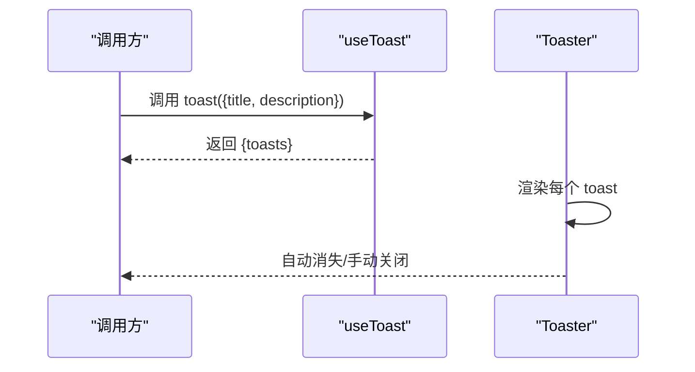
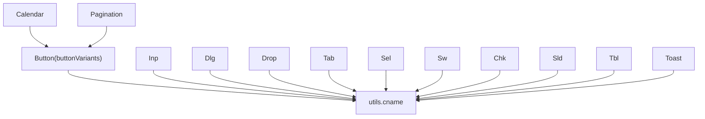

# BS-UI 基础组件

<cite>
**本文引用的文件**
- [src/frontend/platform/src/components/bs-ui/button/index.tsx](file://src/frontend/platform/src/components/bs-ui/button/index.tsx)
- [src/frontend/platform/src/components/bs-ui/input/index.tsx](file://src/frontend/platform/src/components/bs-ui/input/index.tsx)
- [src/frontend/platform/src/components/bs-ui/dialog/index.tsx](file://src/frontend/platform/src/components/bs-ui/dialog/index.tsx)
- [src/frontend/platform/src/components/bs-ui/dropdownMenu/index.tsx](file://src/frontend/platform/src/components/bs-ui/dropdownMenu/index.tsx)
- [src/frontend/platform/src/components/bs-ui/table/index.tsx](file://src/frontend/platform/src/components/bs-ui/table/index.tsx)
- [src/frontend/platform/src/components/bs-ui/tabs/index.tsx](file://src/frontend/platform/src/components/bs-ui/tabs/index.tsx)
- [src/frontend/platform/src/components/bs-ui/select/index.tsx](file://src/frontend/platform/src/components/bs-ui/select/index.tsx)
- [src/frontend/platform/src/components/bs-ui/utils.tsx](file://src/frontend/platform/src/components/bs-ui/utils.tsx)
- [src/frontend/platform/src/components/bs-ui/toast/index.tsx](file://src/frontend/platform/src/components/bs-ui/toast/index.tsx)
- [src/frontend/platform/src/components/bs-ui/switch/index.tsx](file://src/frontend/platform/src/components/bs-ui/switch/index.tsx)
- [src/frontend/platform/src/components/bs-ui/checkBox/index.tsx](file://src/frontend/platform/src/components/bs-ui/checkBox/index.tsx)
- [src/frontend/platform/src/components/bs-ui/slider/index.tsx](file://src/frontend/platform/src/components/bs-ui/slider/index.tsx)
- [src/frontend/platform/src/components/bs-ui/calendar/index.tsx](file://src/frontend/platform/src/components/bs-ui/calendar/index.tsx)
- [src/frontend/platform/src/components/bs-ui/pagination/index.tsx](file://src/frontend/platform/src/components/bs-ui/pagination/index.tsx)
</cite>

## 目录
1. [简介](#简介)
2. [项目结构](#项目结构)
3. [核心组件](#核心组件)
4. [架构总览](#架构总览)
5. [组件详解](#组件详解)
6. [依赖关系分析](#依赖关系分析)
7. [性能考量](#性能考量)
8. [故障排查指南](#故障排查指南)
9. [结论](#结论)
10. [附录](#附录)

## 简介
本文件为 BS-UI 基础组件库的技术文档，面向使用 shadcn/ui 设计风格的前端团队与个人开发者。文档覆盖按钮、输入框、对话框、下拉菜单、表格、标签页、进度条、选择器、日历、分页、开关、复选框、滑块、提示气泡等核心 UI 组件，系统阐述其属性接口、事件处理、样式定制、可访问性与主题适配，并提供使用示例、最佳实践与常见问题解决方案。

## 项目结构
BS-UI 组件集中于平台前端侧的 bs-ui 目录，采用按功能域拆分的组织方式：
- 组件按功能模块划分，如 button、input、dialog、dropdownMenu、table、tabs、select、calendar、pagination、switch、checkBox、slider、toast、utils 等
- 组件统一通过工具函数进行类名合并与通用能力封装
- 组件广泛使用 Radix UI 作为无障碍与状态管理基础，结合 Tailwind CSS 实现主题与样式



图表来源
- [src/frontend/platform/src/components/bs-ui/button/index.tsx](file://src/frontend/platform/src/components/bs-ui/button/index.tsx#L1-L110)
- [src/frontend/platform/src/components/bs-ui/input/index.tsx](file://src/frontend/platform/src/components/bs-ui/input/index.tsx#L1-L510)
- [src/frontend/platform/src/components/bs-ui/dialog/index.tsx](file://src/frontend/platform/src/components/bs-ui/dialog/index.tsx#L1-L114)
- [src/frontend/platform/src/components/bs-ui/dropdownMenu/index.tsx](file://src/frontend/platform/src/components/bs-ui/dropdownMenu/index.tsx#L1-L257)
- [src/frontend/platform/src/components/bs-ui/table/index.tsx](file://src/frontend/platform/src/components/bs-ui/table/index.tsx#L1-L120)
- [src/frontend/platform/src/components/bs-ui/tabs/index.tsx](file://src/frontend/platform/src/components/bs-ui/tabs/index.tsx#L1-L55)
- [src/frontend/platform/src/components/bs-ui/select/index.tsx](file://src/frontend/platform/src/components/bs-ui/select/index.tsx#L1-L163)
- [src/frontend/platform/src/components/bs-ui/calendar/index.tsx](file://src/frontend/platform/src/components/bs-ui/calendar/index.tsx#L1-L224)
- [src/frontend/platform/src/components/bs-ui/pagination/index.tsx](file://src/frontend/platform/src/components/bs-ui/pagination/index.tsx#L1-L116)
- [src/frontend/platform/src/components/bs-ui/switch/index.tsx](file://src/frontend/platform/src/components/bs-ui/switch/index.tsx#L1-L31)
- [src/frontend/platform/src/components/bs-ui/checkBox/index.tsx](file://src/frontend/platform/src/components/bs-ui/checkBox/index.tsx#L1-L30)
- [src/frontend/platform/src/components/bs-ui/slider/index.tsx](file://src/frontend/platform/src/components/bs-ui/slider/index.tsx#L1-L29)
- [src/frontend/platform/src/components/bs-ui/toast/index.tsx](file://src/frontend/platform/src/components/bs-ui/toast/index.tsx#L1-L38)
- [src/frontend/platform/src/components/bs-ui/utils.tsx](file://src/frontend/platform/src/components/bs-ui/utils.tsx#L1-L52)

章节来源
- [src/frontend/platform/src/components/bs-ui/button/index.tsx](file://src/frontend/platform/src/components/bs-ui/button/index.tsx#L1-L110)
- [src/frontend/platform/src/components/bs-ui/utils.tsx](file://src/frontend/platform/src/components/bs-ui/utils.tsx#L1-L52)

## 核心组件
- 按钮 Button：支持多种变体与尺寸，支持“作为子元素渲染”与加载态按钮 LoadButton、数值增减按钮 ButtonNumber
- 输入 Input/Textarea/PasswordInput/SearchInput：提供数字输入校验、密码显隐、搜索输入、列表输入 InputList、字数统计等
- 对话框 Dialog：根组件、触发器、内容、标题、描述、页脚等组合使用
- 下拉菜单 DropdownMenu：支持组、项、勾选项、单选项、标签、分隔符、快捷键、子菜单
- 表格 Table：表头、表体、表尾、行、单元格、标题单元格、说明
- 标签页 Tabs：列表、触发器、内容区
- 选择器 Select：触发器、内容、视口、滚动按钮、标签、项、分隔符
- 日历 Calendar：国际化、范围选择、自定义组件映射、按钮样式
- 分页 Pagination：导航、内容、链接、上一页/下一页、省略号
- 开关 Switch：带文案显示的开关
- 复选框 Checkbox：标准复选框
- 滑块 Slider：数值范围拖动
- 提示 Toaster/useToast：全局提示展示
- 工具 utils：类名合并、UUID、防抖 Hook

章节来源
- [src/frontend/platform/src/components/bs-ui/button/index.tsx](file://src/frontend/platform/src/components/bs-ui/button/index.tsx#L37-L55)
- [src/frontend/platform/src/components/bs-ui/input/index.tsx](file://src/frontend/platform/src/components/bs-ui/input/index.tsx#L8-L97)
- [src/frontend/platform/src/components/bs-ui/dialog/index.tsx](file://src/frontend/platform/src/components/bs-ui/dialog/index.tsx#L7-L51)
- [src/frontend/platform/src/components/bs-ui/dropdownMenu/index.tsx](file://src/frontend/platform/src/components/bs-ui/dropdownMenu/index.tsx#L8-L51)
- [src/frontend/platform/src/components/bs-ui/table/index.tsx](file://src/frontend/platform/src/components/bs-ui/table/index.tsx#L4-L96)
- [src/frontend/platform/src/components/bs-ui/tabs/index.tsx](file://src/frontend/platform/src/components/bs-ui/tabs/index.tsx#L7-L52)
- [src/frontend/platform/src/components/bs-ui/select/index.tsx](file://src/frontend/platform/src/components/bs-ui/select/index.tsx#L8-L103)
- [src/frontend/platform/src/components/bs-ui/calendar/index.tsx](file://src/frontend/platform/src/components/bs-ui/calendar/index.tsx#L19-L182)
- [src/frontend/platform/src/components/bs-ui/pagination/index.tsx](file://src/frontend/platform/src/components/bs-ui/pagination/index.tsx#L6-L62)
- [src/frontend/platform/src/components/bs-ui/switch/index.tsx](file://src/frontend/platform/src/components/bs-ui/switch/index.tsx#L5-L27)
- [src/frontend/platform/src/components/bs-ui/checkBox/index.tsx](file://src/frontend/platform/src/components/bs-ui/checkBox/index.tsx#L8-L26)
- [src/frontend/platform/src/components/bs-ui/slider/index.tsx](file://src/frontend/platform/src/components/bs-ui/slider/index.tsx#L8-L24)
- [src/frontend/platform/src/components/bs-ui/toast/index.tsx](file://src/frontend/platform/src/components/bs-ui/toast/index.tsx#L12-L37)
- [src/frontend/platform/src/components/bs-ui/utils.tsx](file://src/frontend/platform/src/components/bs-ui/utils.tsx#L8-L50)

## 架构总览
BS-UI 组件遵循以下设计原则：
- 可组合性：以 Radix UI 为基础，提供原生 DOM 属性透传与 Slot 容器，便于组合与扩展
- 变体与尺寸：通过 class-variance-authority 生成变体与尺寸类，统一风格
- 主题适配：Tailwind CSS 与暗色模式变量配合，组件内部使用深浅主题类名
- 可访问性：遵循 ARIA 语义，键盘可达，焦点管理由 Radix UI 负责
- 工具函数：统一类名合并、UUID、防抖等通用能力



图表来源
- [src/frontend/platform/src/components/bs-ui/utils.tsx](file://src/frontend/platform/src/components/bs-ui/utils.tsx#L8-L50)
- [src/frontend/platform/src/components/bs-ui/button/index.tsx](file://src/frontend/platform/src/components/bs-ui/button/index.tsx#L43-L55)
- [src/frontend/platform/src/components/bs-ui/input/index.tsx](file://src/frontend/platform/src/components/bs-ui/input/index.tsx#L14-L97)
- [src/frontend/platform/src/components/bs-ui/dialog/index.tsx](file://src/frontend/platform/src/components/bs-ui/dialog/index.tsx#L15-L51)
- [src/frontend/platform/src/components/bs-ui/dropdownMenu/index.tsx](file://src/frontend/platform/src/components/bs-ui/dropdownMenu/index.tsx#L33-L51)
- [src/frontend/platform/src/components/bs-ui/tabs/index.tsx](file://src/frontend/platform/src/components/bs-ui/tabs/index.tsx#L9-L36)
- [src/frontend/platform/src/components/bs-ui/select/index.tsx](file://src/frontend/platform/src/components/bs-ui/select/index.tsx#L14-L34)
- [src/frontend/platform/src/components/bs-ui/calendar/index.tsx](file://src/frontend/platform/src/components/bs-ui/calendar/index.tsx#L34-L70)
- [src/frontend/platform/src/components/bs-ui/pagination/index.tsx](file://src/frontend/platform/src/components/bs-ui/pagination/index.tsx#L40-L61)
- [src/frontend/platform/src/components/bs-ui/switch/index.tsx](file://src/frontend/platform/src/components/bs-ui/switch/index.tsx#L9-L27)
- [src/frontend/platform/src/components/bs-ui/checkBox/index.tsx](file://src/frontend/platform/src/components/bs-ui/checkBox/index.tsx#L12-L26)
- [src/frontend/platform/src/components/bs-ui/slider/index.tsx](file://src/frontend/platform/src/components/bs-ui/slider/index.tsx#L12-L24)
- [src/frontend/platform/src/components/bs-ui/table/index.tsx](file://src/frontend/platform/src/components/bs-ui/table/index.tsx#L4-L96)
- [src/frontend/platform/src/components/bs-ui/toast/index.tsx](file://src/frontend/platform/src/components/bs-ui/toast/index.tsx#L12-L37)

## 组件详解

### 按钮 Button
- 属性接口
  - ButtonProps：继承 HTMLButtonElement 属性，支持 variant、size、asChild
  - ButtonNumber Props：数值增减按钮，支持 defaultValue、value、max、min、step、size、onChange
  - LoadButton Props：在加载态禁用按钮，自动前置加载图标
- 事件处理
  - 数值增减：内部维护受控/非受控状态，onChange 回调返回最新值
  - 加载态：根据 loading/disabled 控制禁用
- 样式定制
  - 通过 variant/size 与 className 合并，支持 asChild 使用 Slot 包裹任意元素
- 可访问性与主题
  - 使用 Radix UI Slot，保持语义与键盘可达；深浅主题类名自动切换
- 使用示例路径
  - [按钮组件定义](file://src/frontend/platform/src/components/bs-ui/button/index.tsx#L37-L55)
  - [数值增减按钮](file://src/frontend/platform/src/components/bs-ui/button/index.tsx#L58-L102)
  - [加载按钮](file://src/frontend/platform/src/components/bs-ui/button/index.tsx#L104-L109)

```mermaid
classDiagram
class Button {
+props : ButtonProps
+ref : HTMLButtonElement
}
class ButtonNumber {
+props : {defaultValue?, value?, max?, min?, step?, size?, onChange?}
+state : number
}
class LoadButton {
+props : {loading?, disabled?}
}
Button --> "uses" Utils["cname"]
```

图表来源
- [src/frontend/platform/src/components/bs-ui/button/index.tsx](file://src/frontend/platform/src/components/bs-ui/button/index.tsx#L43-L55)
- [src/frontend/platform/src/components/bs-ui/button/index.tsx](file://src/frontend/platform/src/components/bs-ui/button/index.tsx#L58-L102)
- [src/frontend/platform/src/components/bs-ui/button/index.tsx](file://src/frontend/platform/src/components/bs-ui/button/index.tsx#L104-L109)
- [src/frontend/platform/src/components/bs-ui/utils.tsx](file://src/frontend/platform/src/components/bs-ui/utils.tsx#L8-L10)

章节来源
- [src/frontend/platform/src/components/bs-ui/button/index.tsx](file://src/frontend/platform/src/components/bs-ui/button/index.tsx#L37-L109)
- [src/frontend/platform/src/components/bs-ui/utils.tsx](file://src/frontend/platform/src/components/bs-ui/utils.tsx#L8-L10)

### 输入 Input/Textarea/PasswordInput/SearchInput/InputList
- 属性接口
  - InputProps：继承 HTMLInputElement，支持 boxClassName、showCount
  - PasswordInput/PassInput：支持 label、tooltip、required、error、name 等
  - TextareaProps：继承 HTMLTextAreaElement
  - InputList：支持 dict 结构、rules、value/defaultValue、onChange 回调
- 事件处理
  - 数字输入校验：阻止负数、最小值限制、最大值限制、粘贴拦截
  - 密码输入：双模式显示与隐藏、粘贴处理、星号显示
  - 列表输入：动态增删、唯一 key、变更回调
- 样式定制
  - 支持外层容器类名 boxClassName，内层输入类名 className
  - 计数显示：在 showCount 与 maxLength 同时存在时显示
- 可访问性与主题
  - 深浅主题类名自动切换，tooltip 支持帮助信息
- 使用示例路径
  - [输入组件](file://src/frontend/platform/src/components/bs-ui/input/index.tsx#L8-L97)
  - [密码输入](file://src/frontend/platform/src/components/bs-ui/input/index.tsx#L111-L346)
  - [多行文本](file://src/frontend/platform/src/components/bs-ui/input/index.tsx#L352-L402)
  - [列表输入](file://src/frontend/platform/src/components/bs-ui/input/index.tsx#L408-L507)



图表来源
- [src/frontend/platform/src/components/bs-ui/input/index.tsx](file://src/frontend/platform/src/components/bs-ui/input/index.tsx#L18-L37)

章节来源
- [src/frontend/platform/src/components/bs-ui/input/index.tsx](file://src/frontend/platform/src/components/bs-ui/input/index.tsx#L8-L507)

### 对话框 Dialog
- 组成部件
  - Root、Trigger、Portal、Overlay、Content、Header、Footer、Title、Description、Close
- 属性接口
  - Content 支持 close 控制关闭按钮显隐
- 动画与交互
  - 打开/关闭动画、居中布局、可选关闭按钮
- 可访问性与主题
  - 聚焦管理、键盘关闭、深色背景覆盖
- 使用示例路径
  - [对话框组件](file://src/frontend/platform/src/components/bs-ui/dialog/index.tsx#L7-L112)



图表来源
- [src/frontend/platform/src/components/bs-ui/dialog/index.tsx](file://src/frontend/platform/src/components/bs-ui/dialog/index.tsx#L7-L51)

章节来源
- [src/frontend/platform/src/components/bs-ui/dialog/index.tsx](file://src/frontend/platform/src/components/bs-ui/dialog/index.tsx#L7-L112)

### 下拉菜单 DropdownMenu
- 组成部件
  - Root、Portal、Trigger、Content、Group、Label、Item、CheckboxItem、RadioGroup、RadioItem、Separator、Shortcut、Sub/SubTrigger/SubContent
- 属性接口
  - Item 支持 inset、variant（default/destructive）
  - SubTrigger 支持 inset
  - ItemIndicator 支持自定义图标
- 动画与交互
  - 基于 Radix UI 的展开/收起、方向偏移、滚动可视区域
- 可访问性与主题
  - 键盘导航、焦点可见性、深浅主题类名
- 使用示例路径
  - [下拉菜单组件](file://src/frontend/platform/src/components/bs-ui/dropdownMenu/index.tsx#L8-L256)

```mermaid
classDiagram
class DropdownMenuRoot
class DropdownMenuTrigger
class DropdownMenuContent
class DropdownMenuItem {
+props : {inset?, variant?}
}
class DropdownMenuSubTrigger {
+props : {inset?}
}
DropdownMenuRoot --> DropdownMenuTrigger
DropdownMenuRoot --> DropdownMenuContent
DropdownMenuContent --> DropdownMenuItem
DropdownMenuContent --> DropdownMenuSubTrigger
```

图表来源
- [src/frontend/platform/src/components/bs-ui/dropdownMenu/index.tsx](file://src/frontend/platform/src/components/bs-ui/dropdownMenu/index.tsx#L8-L51)
- [src/frontend/platform/src/components/bs-ui/dropdownMenu/index.tsx](file://src/frontend/platform/src/components/bs-ui/dropdownMenu/index.tsx#L61-L82)
- [src/frontend/platform/src/components/bs-ui/dropdownMenu/index.tsx](file://src/frontend/platform/src/components/bs-ui/dropdownMenu/index.tsx#L200-L222)

章节来源
- [src/frontend/platform/src/components/bs-ui/dropdownMenu/index.tsx](file://src/frontend/platform/src/components/bs-ui/dropdownMenu/index.tsx#L8-L256)

### 表格 Table
- 组成部件
  - Table、TableHeader、TableBody、TableFooter、TableRow、TableHead、TableCell、TableCaption
- 属性接口
  - Table 支持 noScroll 控制是否启用横向滚动容器
- 样式与交互
  - 行悬停、奇偶行背景、复选框对齐、圆角处理
- 可访问性与主题
  - 深浅主题下的背景与悬停对比度
- 使用示例路径
  - [表格组件](file://src/frontend/platform/src/components/bs-ui/table/index.tsx#L4-L119)



图表来源
- [src/frontend/platform/src/components/bs-ui/table/index.tsx](file://src/frontend/platform/src/components/bs-ui/table/index.tsx#L4-L16)
- [src/frontend/platform/src/components/bs-ui/table/index.tsx](file://src/frontend/platform/src/components/bs-ui/table/index.tsx#L18-L36)
- [src/frontend/platform/src/components/bs-ui/table/index.tsx](file://src/frontend/platform/src/components/bs-ui/table/index.tsx#L53-L96)

章节来源
- [src/frontend/platform/src/components/bs-ui/table/index.tsx](file://src/frontend/platform/src/components/bs-ui/table/index.tsx#L4-L119)

### 标签页 Tabs
- 组成部件
  - Root、List、Trigger、Content
- 属性接口
  - Trigger 支持激活态样式切换
- 样式与交互
  - 激活态边框与背景、悬停效果、内容显隐控制
- 可访问性与主题
  - 深浅主题下的颜色与阴影
- 使用示例路径
  - [标签页组件](file://src/frontend/platform/src/components/bs-ui/tabs/index.tsx#L7-L54)



图表来源
- [src/frontend/platform/src/components/bs-ui/tabs/index.tsx](file://src/frontend/platform/src/components/bs-ui/tabs/index.tsx#L9-L52)

章节来源
- [src/frontend/platform/src/components/bs-ui/tabs/index.tsx](file://src/frontend/platform/src/components/bs-ui/tabs/index.tsx#L7-L54)

### 选择器 Select
- 组成部件
  - Root、Trigger、Content、Viewport、ScrollUpButton、ScrollDownButton、Label、Item、Separator、Value
- 属性接口
  - Trigger 支持 showIcon 控制下拉箭头
  - Content 支持 headNode/footerNode、position、auto
  - Item 支持 showIcon、customContent
- 动画与交互
  - 弹出位置与动画、滚动可视区域、指示器
- 可访问性与主题
  - 深浅主题边框与背景
- 使用示例路径
  - [选择器组件](file://src/frontend/platform/src/components/bs-ui/select/index.tsx#L8-L161)

```mermaid
classDiagram
class SelectRoot
class SelectTrigger {
+props : {showIcon?}
}
class SelectContent {
+props : {headNode?, footerNode?, auto?, position?}
}
class SelectItem {
+props : {showIcon?, customContent?}
}
SelectRoot --> SelectTrigger
SelectRoot --> SelectContent
SelectContent --> SelectItem
```

图表来源
- [src/frontend/platform/src/components/bs-ui/select/index.tsx](file://src/frontend/platform/src/components/bs-ui/select/index.tsx#L14-L34)
- [src/frontend/platform/src/components/bs-ui/select/index.tsx](file://src/frontend/platform/src/components/bs-ui/select/index.tsx#L71-L103)
- [src/frontend/platform/src/components/bs-ui/select/index.tsx](file://src/frontend/platform/src/components/bs-ui/select/index.tsx#L117-L144)

章节来源
- [src/frontend/platform/src/components/bs-ui/select/index.tsx](file://src/frontend/platform/src/components/bs-ui/select/index.tsx#L8-L161)

### 日历 Calendar
- 属性接口
  - 支持 showOutsideDays、captionLayout、buttonVariant、formatters、components
- 动画与交互
  - 国际化（中英）、范围选择、按钮样式映射、焦点管理
- 可访问性与主题
  - 深浅主题下的选中与范围高亮
- 使用示例路径
  - [日历组件](file://src/frontend/platform/src/components/bs-ui/calendar/index.tsx#L19-L182)



图表来源
- [src/frontend/platform/src/components/bs-ui/calendar/index.tsx](file://src/frontend/platform/src/components/bs-ui/calendar/index.tsx#L184-L220)

章节来源
- [src/frontend/platform/src/components/bs-ui/calendar/index.tsx](file://src/frontend/platform/src/components/bs-ui/calendar/index.tsx#L19-L224)

### 分页 Pagination
- 组成部件
  - Root、Content、Item、Link、Previous、Next、Ellipsis
- 属性接口
  - Link 支持 isActive、size
- 样式与交互
  - 激活态边框与背景、暗色模式适配、左右导航按钮
- 可访问性与主题
  - ARIA 标注当前页
- 使用示例路径
  - [分页组件](file://src/frontend/platform/src/components/bs-ui/pagination/index.tsx#L6-L114)

```mermaid
classDiagram
class Pagination
class PaginationContent
class PaginationItem
class PaginationLink {
+props : {isActive?, size?}
}
class PaginationPrevious
class PaginationNext
class PaginationEllipsis
Pagination --> PaginationContent
PaginationContent --> PaginationItem
PaginationItem --> PaginationLink
Pagination --> PaginationPrevious
Pagination --> PaginationNext
Pagination --> PaginationEllipsis
```

图表来源
- [src/frontend/platform/src/components/bs-ui/pagination/index.tsx](file://src/frontend/platform/src/components/bs-ui/pagination/index.tsx#L6-L26)
- [src/frontend/platform/src/components/bs-ui/pagination/index.tsx](file://src/frontend/platform/src/components/bs-ui/pagination/index.tsx#L36-L62)
- [src/frontend/platform/src/components/bs-ui/pagination/index.tsx](file://src/frontend/platform/src/components/bs-ui/pagination/index.tsx#L64-L94)

章节来源
- [src/frontend/platform/src/components/bs-ui/pagination/index.tsx](file://src/frontend/platform/src/components/bs-ui/pagination/index.tsx#L6-L114)

### 开关 Switch
- 属性接口
  - 支持 texts 文案数组，分别在开启/关闭态显示
- 样式与交互
  - 指针动画、深浅主题颜色切换
- 可访问性与主题
  - 语义化根元素、键盘切换
- 使用示例路径
  - [开关组件](file://src/frontend/platform/src/components/bs-ui/switch/index.tsx#L5-L27)



图表来源
- [src/frontend/platform/src/components/bs-ui/switch/index.tsx](file://src/frontend/platform/src/components/bs-ui/switch/index.tsx#L9-L27)

章节来源
- [src/frontend/platform/src/components/bs-ui/switch/index.tsx](file://src/frontend/platform/src/components/bs-ui/switch/index.tsx#L5-L27)

### 复选框 Checkbox
- 属性接口
  - 继承原生属性，支持指示器图标
- 样式与交互
  - 选中态背景与边框、指示器图标
- 可访问性与主题
  - 深浅主题对比度
- 使用示例路径
  - [复选框组件](file://src/frontend/platform/src/components/bs-ui/checkBox/index.tsx#L8-L26)

章节来源
- [src/frontend/platform/src/components/bs-ui/checkBox/index.tsx](file://src/frontend/platform/src/components/bs-ui/checkBox/index.tsx#L8-L26)

### 滑块 Slider
- 属性接口
  - 继承原生属性，支持自定义轨道与拇指
- 样式与交互
  - 轨道与范围填充、拇指焦点样式
- 可访问性与主题
  - 键盘与触控支持
- 使用示例路径
  - [滑块组件](file://src/frontend/platform/src/components/bs-ui/slider/index.tsx#L8-L24)

章节来源
- [src/frontend/platform/src/components/bs-ui/slider/index.tsx](file://src/frontend/platform/src/components/bs-ui/slider/index.tsx#L8-L24)

### 提示 Toaster/useToast
- 组件组成
  - Toaster：消费 useToast 返回的 toasts 并渲染
  - useToast：提供全局提示状态与派发方法
- 样式与交互
  - 自动消失、关闭按钮、图标类型映射
- 使用示例路径
  - [提示组件](file://src/frontend/platform/src/components/bs-ui/toast/index.tsx#L12-L37)



图表来源
- [src/frontend/platform/src/components/bs-ui/toast/index.tsx](file://src/frontend/platform/src/components/bs-ui/toast/index.tsx#L12-L37)

章节来源
- [src/frontend/platform/src/components/bs-ui/toast/index.tsx](file://src/frontend/platform/src/components/bs-ui/toast/index.tsx#L12-L37)

## 依赖关系分析
- 组件间耦合
  - Calendar 依赖 Button 的变体样式
  - Pagination 依赖 Button 的变体与尺寸
  - 多数组件依赖 utils.cname 进行类名合并
- 外部依赖
  - Radix UI：提供无障碍与状态管理
  - class-variance-authority：生成变体类
  - lucide-react：图标
  - react-day-picker：日历
  - date-fns：国际化本地化
- 循环依赖
  - 未发现循环依赖，组件通过工具函数解耦



图表来源
- [src/frontend/platform/src/components/bs-ui/calendar/index.tsx](file://src/frontend/platform/src/components/bs-ui/calendar/index.tsx#L60-L69)
- [src/frontend/platform/src/components/bs-ui/pagination/index.tsx](file://src/frontend/platform/src/components/bs-ui/pagination/index.tsx#L50-L58)
- [src/frontend/platform/src/components/bs-ui/button/index.tsx](file://src/frontend/platform/src/components/bs-ui/button/index.tsx#L6-L35)
- [src/frontend/platform/src/components/bs-ui/utils.tsx](file://src/frontend/platform/src/components/bs-ui/utils.tsx#L8-L10)

章节来源
- [src/frontend/platform/src/components/bs-ui/calendar/index.tsx](file://src/frontend/platform/src/components/bs-ui/calendar/index.tsx#L60-L69)
- [src/frontend/platform/src/components/bs-ui/pagination/index.tsx](file://src/frontend/platform/src/components/bs-ui/pagination/index.tsx#L50-L58)
- [src/frontend/platform/src/components/bs-ui/utils.tsx](file://src/frontend/platform/src/components/bs-ui/utils.tsx#L8-L10)

## 性能考量
- 渲染优化
  - 使用 React.forwardRef 与 memo 化策略减少重渲染
  - 仅在必要时更新内部状态（如输入组件的受控/非受控值）
- 样式合并
  - 通过 utils.cname 合并类名，避免重复与冲突
- 动画与交互
  - 使用 Radix UI 的内置动画，避免自定义复杂动画导致掉帧
- 可访问性
  - 保持键盘可达与焦点管理，避免额外的 DOM 操作影响性能

## 故障排查指南
- 输入组件相关
  - 数字输入无效：检查 min/max/maxLength 是否导致值被阻断
  - 密码粘贴异常：确认粘贴事件处理逻辑与 selectionStart/selectionEnd
- 对话框相关
  - 内容无法关闭：确认 Close 元素是否渲染，Overlay 是否正确挂载
- 下拉菜单相关
  - 子菜单不显示：检查 Portal 是否正确渲染，Content 的 position 与 viewport
- 表格相关
  - 横向滚动异常：检查 Table 的 noScroll 与容器宽度
- 日历相关
  - 国际化不生效：确认 i18next 语言设置与 locale 引入
- 分页相关
  - 激活态样式异常：确认 isActive 与 buttonVariants 的 variant 映射
- 开关/复选框/滑块
  - 深浅主题颜色不一致：检查主题类名与数据属性状态

章节来源
- [src/frontend/platform/src/components/bs-ui/input/index.tsx](file://src/frontend/platform/src/components/bs-ui/input/index.tsx#L18-L37)
- [src/frontend/platform/src/components/bs-ui/dialog/index.tsx](file://src/frontend/platform/src/components/bs-ui/dialog/index.tsx#L33-L51)
- [src/frontend/platform/src/components/bs-ui/dropdownMenu/index.tsx](file://src/frontend/platform/src/components/bs-ui/dropdownMenu/index.tsx#L39-L50)
- [src/frontend/platform/src/components/bs-ui/table/index.tsx](file://src/frontend/platform/src/components/bs-ui/table/index.tsx#L8-L14)
- [src/frontend/platform/src/components/bs-ui/calendar/index.tsx](file://src/frontend/platform/src/components/bs-ui/calendar/index.tsx#L34-L35)
- [src/frontend/platform/src/components/bs-ui/pagination/index.tsx](file://src/frontend/platform/src/components/bs-ui/pagination/index.tsx#L49-L58)
- [src/frontend/platform/src/components/bs-ui/switch/index.tsx](file://src/frontend/platform/src/components/bs-ui/switch/index.tsx#L9-L27)
- [src/frontend/platform/src/components/bs-ui/checkBox/index.tsx](file://src/frontend/platform/src/components/bs-ui/checkBox/index.tsx#L12-L26)
- [src/frontend/platform/src/components/bs-ui/slider/index.tsx](file://src/frontend/platform/src/components/bs-ui/slider/index.tsx#L12-L24)

## 结论
BS-UI 基础组件库以 shadcn/ui 风格为核心，结合 Radix UI 与 Tailwind CSS，提供了高可组合性、强可访问性与良好主题适配的 UI 基础设施。通过统一的工具函数与变体系统，组件在保证一致性的同时具备灵活的定制能力。建议在实际项目中遵循组件的属性约定与可访问性规范，充分利用工具函数与 Hook，以获得更佳的开发体验与用户体验。

## 附录
- TypeScript 类型定义
  - ButtonProps、InputProps、TextareaProps、SelectProps 等均直接继承原生 HTML 属性，便于与表单与验证库集成
- React Hook 使用
  - useDebounce：适用于搜索、过滤等高频输入场景
  - useToast：全局提示派发与状态管理
- 最佳实践
  - 优先使用 asChild 包裹非按钮元素，保持语义与可访问性
  - 在深色模式下确保对比度与可读性
  - 对于长列表与复杂交互，合理拆分组件与使用懒加载