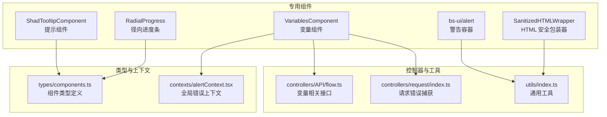
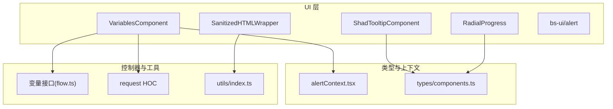
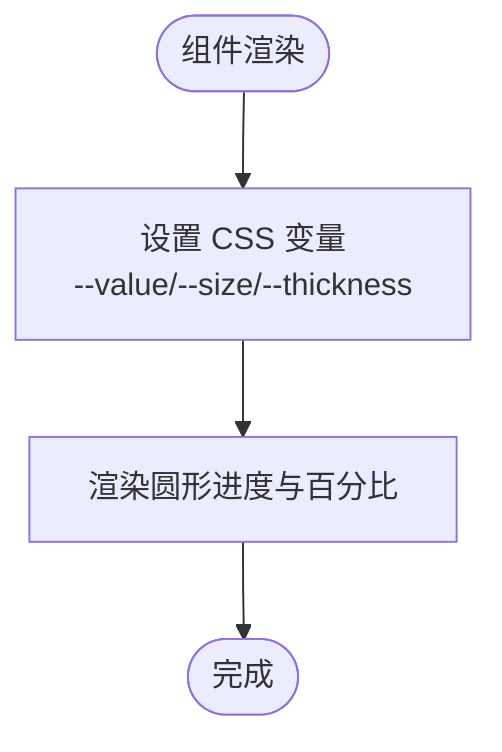
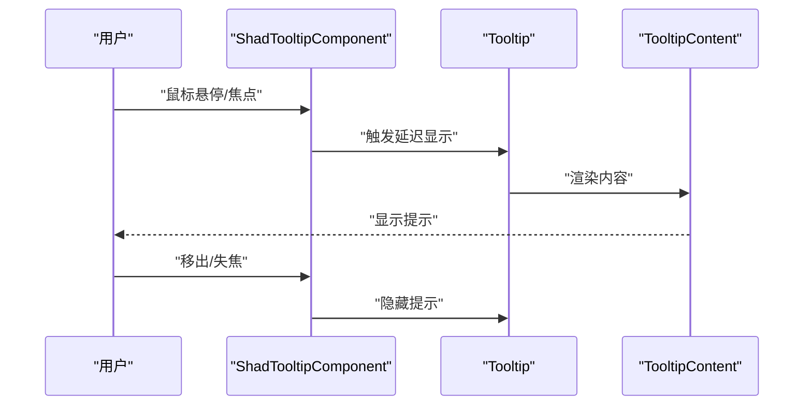
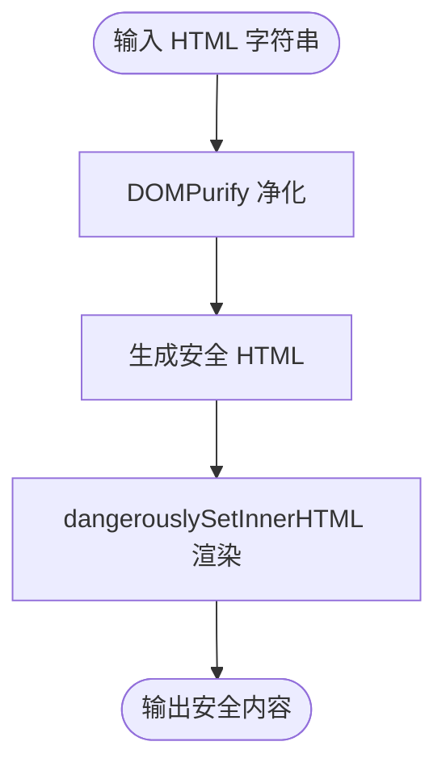
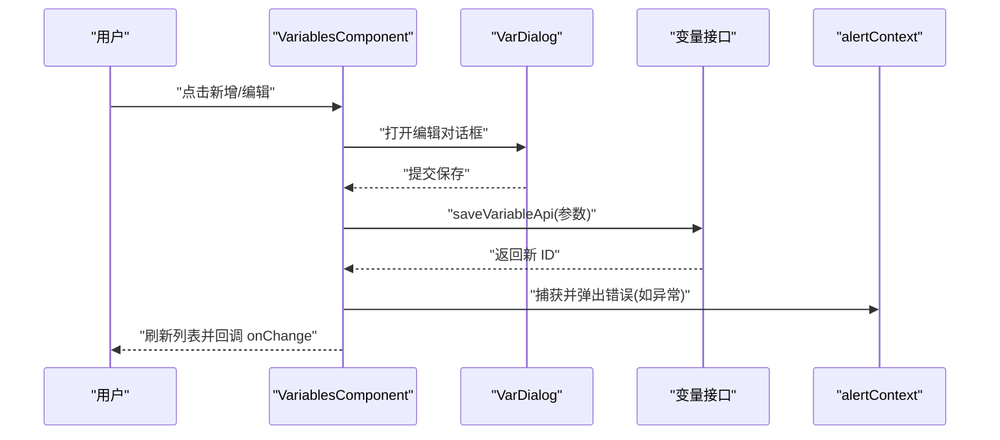
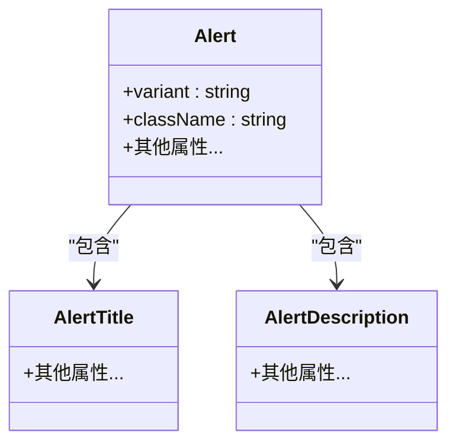
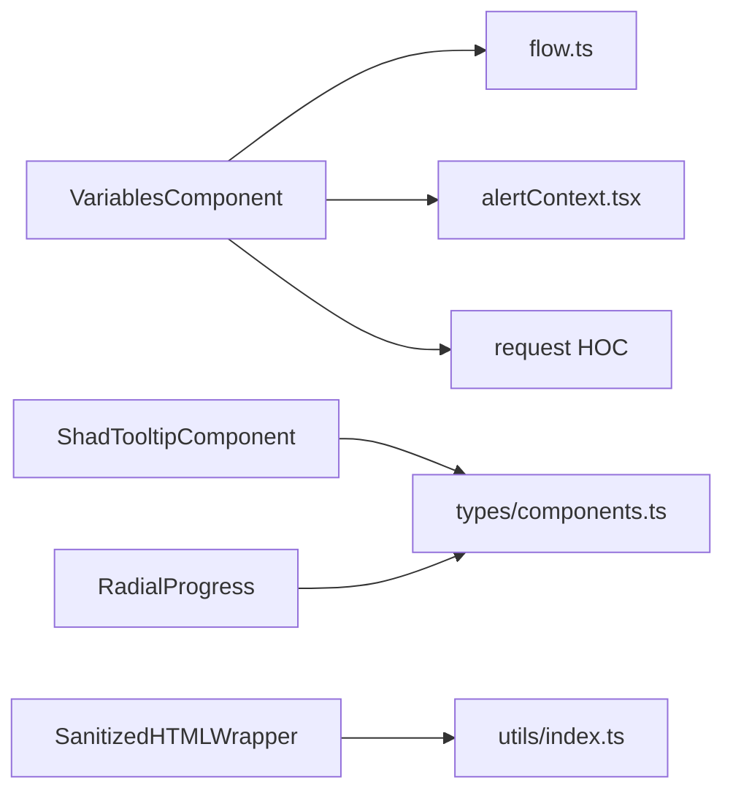

# 专用组件

<cite>
**本文引用的文件**
- [src/frontend/platform/src/components/RadialProgress/index.tsx](file://src/frontend/platform/src/components/RadialProgress/index.tsx)
- [src/frontend/platform/src/components/ShadTooltipComponent/index.tsx](file://src/frontend/platform/src/components/ShadTooltipComponent/index.tsx)
- [src/frontend/platform/src/components/SanitizedHTMLWrapper/index.tsx](file://src/frontend/platform/src/components/SanitizedHTMLWrapper/index.tsx)
- [src/frontend/platform/src/components/VariablesComponent/index.tsx](file://src/frontend/platform/src/components/VariablesComponent/index.tsx)
- [src/frontend/platform/src/components/bs-ui/alert.tsx](file://src/frontend/platform/src/components/bs-ui/alert.tsx)
- [src/frontend/platform/src/types/components.ts](file://src/frontend/platform/src/types/components.ts)
- [src/frontend/platform/src/controllers/API/flow.ts](file://src/frontend/platform/src/controllers/API/flow.ts)
- [src/frontend/platform/src/contexts/alertContext.tsx](file://src/frontend/platform/src/contexts/alertContext.tsx)
- [src/frontend/platform/src/utils/index.ts](file://src/frontend/platform/src/utils/index.ts)
- [src/frontend/platform/src/controllers/request/index.ts](file://src/frontend/platform/src/controllers/request/index.ts)
</cite>

## 目录
1. [简介](#简介)
2. [项目结构](#项目结构)
3. [核心组件](#核心组件)
4. [架构总览](#架构总览)
5. [组件详解](#组件详解)
6. [依赖关系分析](#依赖关系分析)
7. [性能与内存优化](#性能与内存优化)
8. [测试与调试](#测试与调试)
9. [结论](#结论)
10. [附录：使用示例与扩展指南](#附录使用示例与扩展指南)

## 简介
本文件聚焦于平台前端专用组件的实现与使用，覆盖以下核心组件：
- 径向进度条组件：以 CSS 变量驱动的纯样式进度指示器
- 提示组件：基于通用 Tooltip 的封装，统一气泡提示风格
- HTML 安全包装器：对富文本内容进行安全净化后渲染
- 变量组件：工作流节点变量的增删改查与表单交互
- 警告容器组件：统一错误/警告信息展示的语义化容器

这些组件在提升用户体验与开发效率方面具有重要作用：通过一致的视觉与交互风格降低认知成本；通过安全渲染与完善的错误处理保障稳定性；通过可复用的交互模式加速业务功能迭代。

## 项目结构
专用组件主要位于前端平台工程的组件目录中，采用按功能域分层组织的方式：
- RadialProgress：径向进度条
- ShadTooltipComponent：提示组件
- SanitizedHTMLWrapper：HTML 安全包装器
- VariablesComponent：变量组件
- bs-ui/alert：警告容器组件

图表来源
- [src/frontend/platform/src/components/RadialProgress/index.tsx](file://src/frontend/platform/src/components/RadialProgress/index.tsx#L1-L19)
- [src/frontend/platform/src/components/ShadTooltipComponent/index.tsx](file://src/frontend/platform/src/components/ShadTooltipComponent/index.tsx#L1-L27)
- [src/frontend/platform/src/components/SanitizedHTMLWrapper/index.tsx](file://src/frontend/platform/src/components/SanitizedHTMLWrapper/index.tsx#L1-L22)
- [src/frontend/platform/src/components/VariablesComponent/index.tsx](file://src/frontend/platform/src/components/VariablesComponent/index.tsx#L1-L146)
- [src/frontend/platform/src/components/bs-ui/alert.tsx](file://src/frontend/platform/src/components/bs-ui/alert.tsx#L1-L59)
- [src/frontend/platform/src/types/components.ts](file://src/frontend/platform/src/types/components.ts)
- [src/frontend/platform/src/controllers/API/flow.ts](file://src/frontend/platform/src/controllers/API/flow.ts)
- [src/frontend/platform/src/contexts/alertContext.tsx](file://src/frontend/platform/src/contexts/alertContext.tsx)
- [src/frontend/platform/src/controllers/request/index.ts](file://src/frontend/platform/src/controllers/request/index.ts)
- [src/frontend/platform/src/utils/index.ts](file://src/frontend/platform/src/utils/index.ts)

章节来源
- [src/frontend/platform/src/components/RadialProgress/index.tsx](file://src/frontend/platform/src/components/RadialProgress/index.tsx#L1-L19)
- [src/frontend/platform/src/components/ShadTooltipComponent/index.tsx](file://src/frontend/platform/src/components/ShadTooltipComponent/index.tsx#L1-L27)
- [src/frontend/platform/src/components/SanitizedHTMLWrapper/index.tsx](file://src/frontend/platform/src/components/SanitizedHTMLWrapper/index.tsx#L1-L22)
- [src/frontend/platform/src/components/VariablesComponent/index.tsx](file://src/frontend/platform/src/components/VariablesComponent/index.tsx#L1-L146)
- [src/frontend/platform/src/components/bs-ui/alert.tsx](file://src/frontend/platform/src/components/bs-ui/alert.tsx#L1-L59)

## 核心组件
- 径向进度条：通过 CSS 自定义属性驱动圆形进度绘制，轻量高效，适合流程状态、加载进度等场景
- 提示组件：统一封装 Tooltip 行为，支持方向、延迟、样式类等配置
- HTML 安全包装器：对富文本进行安全净化后再渲染，避免 XSS 风险
- 变量组件：围绕工作流节点维护变量列表，支持新增、编辑、删除与必填校验
- 警告容器：提供默认与破坏性两种变体，用于统一错误/警告信息展示

章节来源
- [src/frontend/platform/src/components/RadialProgress/index.tsx](file://src/frontend/platform/src/components/RadialProgress/index.tsx#L1-L19)
- [src/frontend/platform/src/components/ShadTooltipComponent/index.tsx](file://src/frontend/platform/src/components/ShadTooltipComponent/index.tsx#L1-L27)
- [src/frontend/platform/src/components/SanitizedHTMLWrapper/index.tsx](file://src/frontend/platform/src/components/SanitizedHTMLWrapper/index.tsx#L1-L22)
- [src/frontend/platform/src/components/VariablesComponent/index.tsx](file://src/frontend/platform/src/components/VariablesComponent/index.tsx#L1-L146)
- [src/frontend/platform/src/components/bs-ui/alert.tsx](file://src/frontend/platform/src/components/bs-ui/alert.tsx#L1-L59)

## 架构总览
专用组件与类型、上下文、控制器及工具模块之间的关系如下：

图表来源
- [src/frontend/platform/src/components/VariablesComponent/index.tsx](file://src/frontend/platform/src/components/VariablesComponent/index.tsx#L1-L146)
- [src/frontend/platform/src/controllers/API/flow.ts](file://src/frontend/platform/src/controllers/API/flow.ts)
- [src/frontend/platform/src/contexts/alertContext.tsx](file://src/frontend/platform/src/contexts/alertContext.tsx)
- [src/frontend/platform/src/controllers/request/index.ts](file://src/frontend/platform/src/controllers/request/index.ts)
- [src/frontend/platform/src/components/ShadTooltipComponent/index.tsx](file://src/frontend/platform/src/components/ShadTooltipComponent/index.tsx#L1-L27)
- [src/frontend/platform/src/components/RadialProgress/index.tsx](file://src/frontend/platform/src/components/RadialProgress/index.tsx#L1-L19)
- [src/frontend/platform/src/types/components.ts](file://src/frontend/platform/src/types/components.ts)
- [src/frontend/platform/src/utils/index.ts](file://src/frontend/platform/src/utils/index.ts)

## 组件详解

### 径向进度条组件（RadialProgress）
- 功能概述
  - 基于 CSS 自定义属性实现圆形进度指示，支持颜色分类与百分比显示
  - 通过内联样式注入数值与尺寸参数，避免复杂计算与额外依赖
- 关键实现点
  - 使用 CSS 变量控制进度值、大小与厚度，保证渲染性能
  - 百分比文本以较小字号显示，兼顾可读性与空间占用
- 使用场景
  - 工作流节点执行进度、上传/下载进度、任务完成度等
- 配置选项
  - value：进度值（0~1），通过 CSS 变量映射
  - color：颜色类别（字符串），用于选择样式类名
- 性能与内存
  - 纯样式实现，无状态组件，开销极低
  - 不持有外部状态，渲染路径短，适合高频更新
- 扩展建议
  - 支持动画过渡、多色渐变、自定义尺寸与厚度
  - 对接节流/防抖以减少频繁更新带来的重绘

图表来源
- [src/frontend/platform/src/components/RadialProgress/index.tsx](file://src/frontend/platform/src/components/RadialProgress/index.tsx#L1-L19)

章节来源
- [src/frontend/platform/src/components/RadialProgress/index.tsx](file://src/frontend/platform/src/components/RadialProgress/index.tsx#L1-L19)

### 提示组件（ShadTooltipComponent）
- 功能概述
  - 封装通用 Tooltip，提供触发元素、内容、方向、延迟与样式类等配置
  - 默认启用碰撞规避与粘性定位，提升在复杂布局中的可用性
- 关键实现点
  - 通过 Tooltip/TooltipTrigger/TooltipContent 组合实现
  - 支持 asChild 透传子元素事件，保持交互一致性
- 使用场景
  - 按钮/图标悬停说明、字段帮助文案、操作提示等
- 配置选项
  - content：提示内容（字符串或 JSX）
  - side：提示方位（上/下/左/右）
  - asChild：是否透传子元素（布尔）
  - styleClasses：自定义样式类
  - delayDuration：延迟时间（毫秒）
- 性能与内存
  - 仅在悬停时激活，无常驻状态
  - 合理设置 delayDuration 可减少频繁闪烁
- 扩展建议
  - 支持多行文本、HTML 内容、主题变体
  - 结合屏幕边界检测与自适应方向

图表来源
- [src/frontend/platform/src/components/ShadTooltipComponent/index.tsx](file://src/frontend/platform/src/components/ShadTooltipComponent/index.tsx#L1-L27)

章节来源
- [src/frontend/platform/src/components/ShadTooltipComponent/index.tsx](file://src/frontend/platform/src/components/ShadTooltipComponent/index.tsx#L1-L27)

### HTML 安全包装器（SanitizedHTMLWrapper）
- 功能概述
  - 对传入的 HTML 字符串进行安全净化，再通过 dangerouslySetInnerHTML 渲染
  - 提供点击回调与警告抑制选项，满足不同场景需求
- 关键实现点
  - 借助 DOMPurify 进行白名单过滤，避免脚本注入
  - 通过 className 与 onClick 外部化样式与交互
- 使用场景
  - 富文本展示、Markdown 渲染结果、第三方内容嵌入
- 配置选项
  - className：容器样式类
  - content：HTML 字符串
  - onClick：点击回调
  - suppressWarning：是否抑制内容可编辑警告
- 安全与性能
  - 净化过程在渲染前完成，避免重复解析
  - 对大段 HTML 建议分块渲染或懒加载
- 扩展建议
  - 支持自定义净化规则、白名单标签/属性
  - 提供预览模式与源码查看能力

图表来源
- [src/frontend/platform/src/components/SanitizedHTMLWrapper/index.tsx](file://src/frontend/platform/src/components/SanitizedHTMLWrapper/index.tsx#L1-L22)

章节来源
- [src/frontend/platform/src/components/SanitizedHTMLWrapper/index.tsx](file://src/frontend/platform/src/components/SanitizedHTMLWrapper/index.tsx#L1-L22)

### 变量组件（VariablesComponent）
- 功能概述
  - 维护工作流节点的变量列表，支持新增、编辑、删除与必填校验
  - 通过对话框编辑单项，保存时调用接口并回写 ID 与更新标记
- 关键实现点
  - 依赖 alertContext 显示错误提示
  - 使用 captureAndAlertRequestErrorHoc 捕获并弹出请求异常
  - 通过 get/save/del 接口与后端交互，保存时根据类型转换数据格式
- 使用场景
  - 工作流节点参数配置、动态输入项管理、必填项校验
- 配置选项
  - vid：版本 ID
  - nodeId：节点 ID
  - flowId：流程 ID
  - onChange：变量名称数组变更回调
- 数据模型与流程
  - 列表项包含：id、name、type（文本/选择）、maxLength、options、required、update 等
  - 新增时生成临时 UUID，保存成功后替换为真实 ID
  - 删除时若已更新则调用删除接口同步后端
- 性能与内存
  - 使用深拷贝克隆列表，避免直接修改引用导致的不可控渲染
  - 滚轮事件监听在卸载时清理，防止内存泄漏
- 扩展建议
  - 支持拖拽排序、批量导入导出、变量模板
  - 增加字段类型（整数、浮点、日期）与校验规则

图表来源
- [src/frontend/platform/src/components/VariablesComponent/index.tsx](file://src/frontend/platform/src/components/VariablesComponent/index.tsx#L1-L146)
- [src/frontend/platform/src/controllers/API/flow.ts](file://src/frontend/platform/src/controllers/API/flow.ts)
- [src/frontend/platform/src/contexts/alertContext.tsx](file://src/frontend/platform/src/contexts/alertContext.tsx)
- [src/frontend/platform/src/controllers/request/index.ts](file://src/frontend/platform/src/controllers/request/index.ts)

章节来源
- [src/frontend/platform/src/components/VariablesComponent/index.tsx](file://src/frontend/platform/src/components/VariablesComponent/index.tsx#L1-L146)

### 警告容器组件（bs-ui/alert）
- 功能概述
  - 提供默认与破坏性两种变体，用于展示警告/错误信息
  - 支持标题与描述子元素，语义化结构便于无障碍访问
- 关键实现点
  - 基于 class-variance-authority 动态组合样式类
  - forwardRef 包裹，允许父级获取 DOM 引用
- 使用场景
  - 表单校验失败、系统错误提示、操作确认提醒
- 配置选项
  - variant：变体（default/destructive）
  - className：自定义样式类
  - 其他 HTML 属性透传至根元素
- 性能与内存
  - 无状态组件，渲染开销极小
  - 适合在高密度区域复用

图表来源
- [src/frontend/platform/src/components/bs-ui/alert.tsx](file://src/frontend/platform/src/components/bs-ui/alert.tsx#L1-L59)

章节来源
- [src/frontend/platform/src/components/bs-ui/alert.tsx](file://src/frontend/platform/src/components/bs-ui/alert.tsx#L1-L59)

## 依赖关系分析
- 类型与上下文
  - 组件类型定义集中于 types/components.ts，确保参数规范与可维护性
  - 全局错误上下文 alertContext.tsx 为变量组件提供统一错误弹窗能力
- 控制器与工具
  - 变量组件通过 controllers/API/flow.ts 与后端交互
  - 请求错误捕获通过 controllers/request/index.ts 提供 HOC 能力
  - 通用工具函数位于 utils/index.ts，如 UUID 生成等

图表来源
- [src/frontend/platform/src/components/VariablesComponent/index.tsx](file://src/frontend/platform/src/components/VariablesComponent/index.tsx#L1-L146)
- [src/frontend/platform/src/controllers/API/flow.ts](file://src/frontend/platform/src/controllers/API/flow.ts)
- [src/frontend/platform/src/contexts/alertContext.tsx](file://src/frontend/platform/src/contexts/alertContext.tsx)
- [src/frontend/platform/src/controllers/request/index.ts](file://src/frontend/platform/src/controllers/request/index.ts)
- [src/frontend/platform/src/components/ShadTooltipComponent/index.tsx](file://src/frontend/platform/src/components/ShadTooltipComponent/index.tsx#L1-L27)
- [src/frontend/platform/src/components/RadialProgress/index.tsx](file://src/frontend/platform/src/components/RadialProgress/index.tsx#L1-L19)
- [src/frontend/platform/src/types/components.ts](file://src/frontend/platform/src/types/components.ts)
- [src/frontend/platform/src/utils/index.ts](file://src/frontend/platform/src/utils/index.ts)

章节来源
- [src/frontend/platform/src/types/components.ts](file://src/frontend/platform/src/types/components.ts)
- [src/frontend/platform/src/contexts/alertContext.tsx](file://src/frontend/platform/src/contexts/alertContext.tsx)
- [src/frontend/platform/src/controllers/API/flow.ts](file://src/frontend/platform/src/controllers/API/flow.ts)
- [src/frontend/platform/src/controllers/request/index.ts](file://src/frontend/platform/src/controllers/request/index.ts)
- [src/frontend/platform/src/utils/index.ts](file://src/frontend/platform/src/utils/index.ts)

## 性能与内存优化
- 渲染路径优化
  - 径向进度条与提示组件均为纯样式/轻状态组件，避免不必要的重渲染
  - 变量组件使用深拷贝与受控状态，减少意外更新引发的连锁渲染
- 事件与资源释放
  - 变量组件在卸载时移除滚轮事件监听，防止内存泄漏
- 错误与异常处理
  - 通过请求 HOC 统一捕获异常并弹窗提示，避免未处理异常导致页面崩溃
- 安全与健壮性
  - HTML 安全包装器在渲染前完成净化，降低 XSS 风险
- 可扩展建议
  - 对高频更新的进度条增加节流/防抖
  - 对大列表的变量组件引入虚拟滚动与懒加载

[本节为通用指导，无需列出具体文件来源]

## 测试与调试
- 单元测试建议
  - 变量组件：模拟接口返回、验证保存/删除流程、断言回调触发
  - 提示组件：验证方向、延迟、样式类生效
  - HTML 安全包装器：验证脚本被移除、合法标签保留
  - 径向进度条：验证 CSS 变量注入与百分比显示
- 调试技巧
  - 使用浏览器开发者工具检查 CSS 变量值与 DOM 结构
  - 在变量组件中打印保存参数与接口响应，定位数据格式问题
  - 对提示组件设置较短延迟，便于快速验证交互
- 故障排除
  - 若提示不显示：检查 Tooltip 是否正确包裹子元素、asChild 设置
  - 若 HTML 净化后内容异常：核对输入内容与净化规则
  - 若变量保存失败：确认必填校验、重名校验与接口返回的 ID 回写

[本节为通用指导，无需列出具体文件来源]

## 结论
专用组件通过简洁的实现与一致的交互风格，有效提升了平台的可用性与开发效率。径向进度条与提示组件提供了直观的状态反馈；HTML 安全包装器保障了内容安全；变量组件实现了工作流参数的可视化管理；警告容器统一了错误信息的呈现方式。建议在后续迭代中进一步增强可配置性与可访问性，并完善自动化测试覆盖。

[本节为总结性内容，无需列出具体文件来源]

## 附录：使用示例与扩展指南
- 使用示例（路径指引）
  - 径向进度条：参考组件文件路径
    - [src/frontend/platform/src/components/RadialProgress/index.tsx](file://src/frontend/platform/src/components/RadialProgress/index.tsx#L1-L19)
  - 提示组件：参考组件文件路径
    - [src/frontend/platform/src/components/ShadTooltipComponent/index.tsx](file://src/frontend/platform/src/components/ShadTooltipComponent/index.tsx#L1-L27)
  - HTML 安全包装器：参考组件文件路径
    - [src/frontend/platform/src/components/SanitizedHTMLWrapper/index.tsx](file://src/frontend/platform/src/components/SanitizedHTMLWrapper/index.tsx#L1-L22)
  - 变量组件：参考组件文件路径
    - [src/frontend/platform/src/components/VariablesComponent/index.tsx](file://src/frontend/platform/src/components/VariablesComponent/index.tsx#L1-L146)
  - 警告容器：参考组件文件路径
    - [src/frontend/platform/src/components/bs-ui/alert.tsx](file://src/frontend/platform/src/components/bs-ui/alert.tsx#L1-L59)
- 集成方法
  - 在页面中直接导入对应组件并传入所需参数
  - 变量组件需结合后端接口与上下文使用，确保错误提示与数据持久化正常
- 扩展指南
  - 新增配置项时优先在类型定义中声明，保证 IDE 提示与类型安全
  - 对需要与后端交互的组件，统一使用请求 HOC 进行异常处理
  - 对涉及安全的组件（如 HTML 渲染）务必在渲染前完成净化

[本节为补充性内容，无需列出具体文件来源]