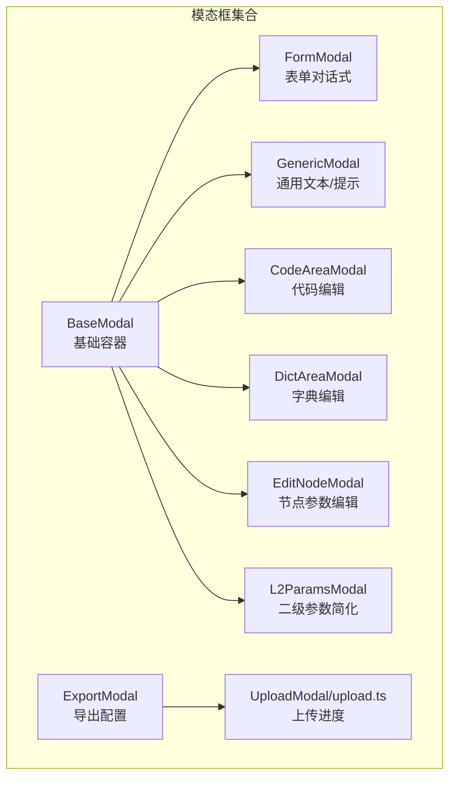
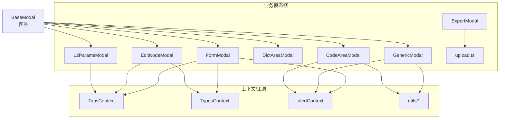
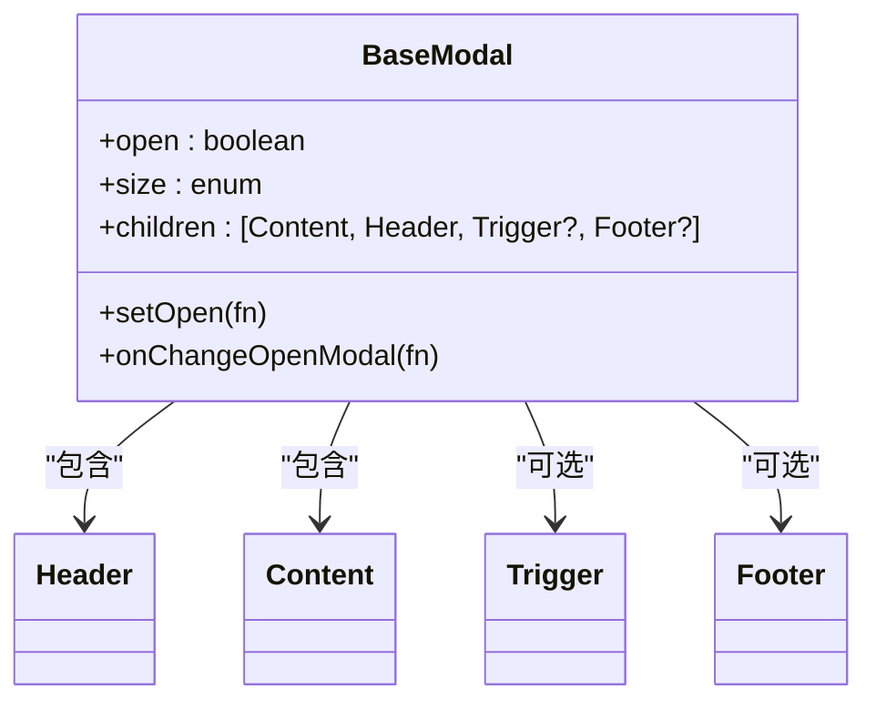
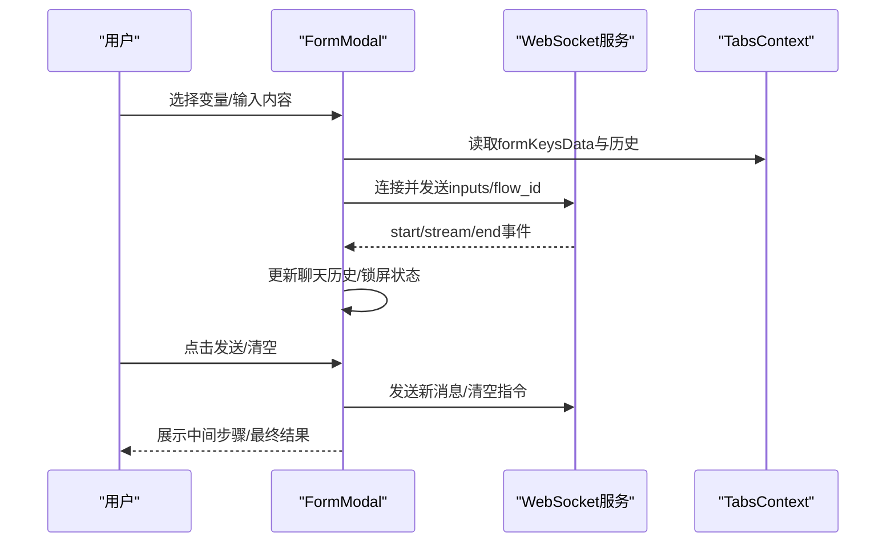
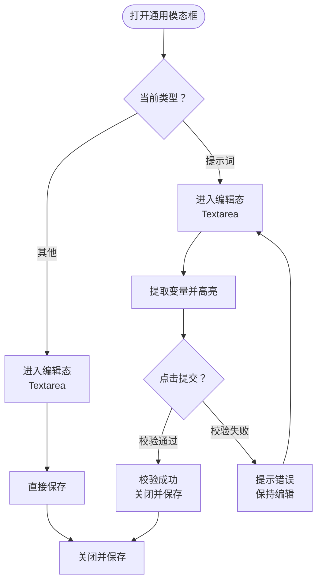
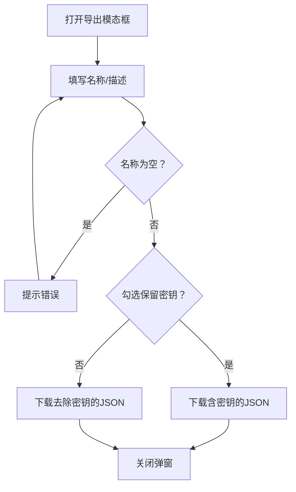
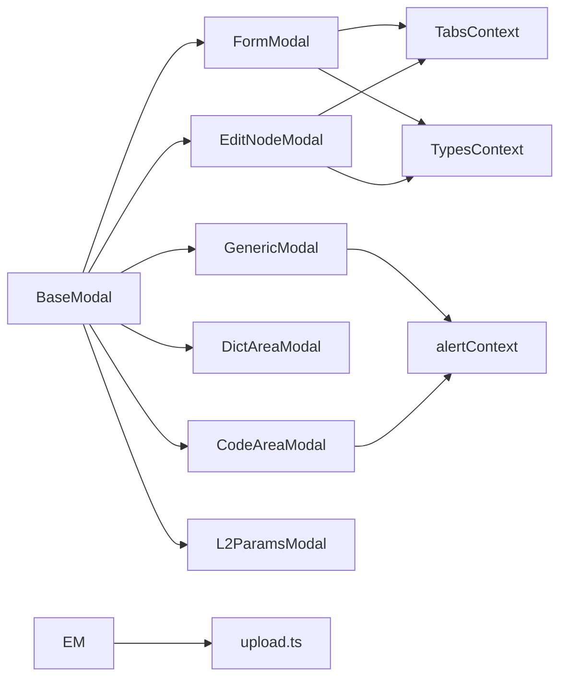

# 模态框系统

<cite>
**本文档引用的文件**
- [src/frontend/platform/src/modals/baseModal/index.tsx](file://src/frontend/platform/src/modals/baseModal/index.tsx)
- [src/frontend/platform/src/modals/formModal/index.tsx](file://src/frontend/platform/src/modals/formModal/index.tsx)
- [src/frontend/platform/src/modals/genericModal/index.tsx](file://src/frontend/platform/src/modals/genericModal/index.tsx)
- [src/frontend/platform/src/modals/exportModal/index.tsx](file://src/frontend/platform/src/modals/exportModal/index.tsx)
- [src/frontend/platform/src/modals/UploadModal/upload.ts](file://src/frontend/platform/src/modals/UploadModal/upload.ts)
- [src/frontend/platform/src/modals/codeAreaModal/index.tsx](file://src/frontend/platform/src/modals/codeAreaModal/index.tsx)
- [src/frontend/platform/src/modals/dictAreaModal/index.tsx](file://src/frontend/platform/src/modals/dictAreaModal/index.tsx)
- [src/frontend/platform/src/modals/EditNodeModal/index.tsx](file://src/frontend/platform/src/modals/EditNodeModal/index.tsx)
- [src/frontend/platform/src/modals/L2ParamsModal/index.tsx](file://src/frontend/platform/src/modals/L2ParamsModal/index.tsx)
- [src/frontend/platform/src/modals/formModal/chatInput/index.tsx](file://src/frontend/platform/src/modals/formModal/chatInput/index.tsx)
</cite>

## 目录
1. [简介](#简介)
2. [项目结构](#项目结构)
3. [核心组件](#核心组件)
4. [架构总览](#架构总览)
5. [详细组件分析](#详细组件分析)
6. [依赖关系分析](#依赖关系分析)
7. [性能考虑](#性能考虑)
8. [故障排查指南](#故障排查指南)
9. [结论](#结论)
10. [附录](#附录)

## 简介
本文件系统性梳理平台前端模态框体系，覆盖通用模态框、表单模态框、参数配置模态框、导入导出模态框等类型，阐述其设计架构、状态管理、生命周期控制、动画与交互、数据传递与验证、提交处理、定制化与样式覆盖、响应式适配、可访问性支持以及最佳实践。目标是帮助开发者快速理解并高效扩展模态框能力。

## 项目结构
模态框相关代码集中于平台前端目录下的 modals 子目录，按功能划分为多个独立组件，均以统一的 BaseModal 为基础进行封装，保证一致的交互体验与样式规范。

图表来源
- [src/frontend/platform/src/modals/baseModal/index.tsx](file://src/frontend/platform/src/modals/baseModal/index.tsx#L1-L163)
- [src/frontend/platform/src/modals/formModal/index.tsx](file://src/frontend/platform/src/modals/formModal/index.tsx#L1-L591)
- [src/frontend/platform/src/modals/genericModal/index.tsx](file://src/frontend/platform/src/modals/genericModal/index.tsx#L1-L312)
- [src/frontend/platform/src/modals/exportModal/index.tsx](file://src/frontend/platform/src/modals/exportModal/index.tsx#L1-L107)
- [src/frontend/platform/src/modals/UploadModal/upload.ts](file://src/frontend/platform/src/modals/UploadModal/upload.ts#L1-L34)
- [src/frontend/platform/src/modals/codeAreaModal/index.tsx](file://src/frontend/platform/src/modals/codeAreaModal/index.tsx#L1-L116)
- [src/frontend/platform/src/modals/dictAreaModal/index.tsx](file://src/frontend/platform/src/modals/dictAreaModal/index.tsx#L1-L71)
- [src/frontend/platform/src/modals/EditNodeModal/index.tsx](file://src/frontend/platform/src/modals/EditNodeModal/index.tsx#L1-L376)
- [src/frontend/platform/src/modals/L2ParamsModal/index.tsx](file://src/frontend/platform/src/modals/L2ParamsModal/index.tsx#L1-L179)

章节来源
- [src/frontend/platform/src/modals/baseModal/index.tsx](file://src/frontend/platform/src/modals/baseModal/index.tsx#L1-L163)

## 核心组件
- BaseModal：提供统一的头部、内容区、触发器、页脚与尺寸控制，作为所有具体模态框的基础容器。
- FormModal：面向工作流表单的“聊天式”交互，内置输入变量选择、消息历史、WebSocket 实时通信与发送处理。
- GenericModal：通用文本/提示编辑与校验，支持变量高亮与提示词验证流程。
- ExportModal：导出技能时的配置弹窗，支持是否保留密钥的选择与下载。
- CodeAreaModal：基于 AceEditor 的 Python 代码编辑与语法校验。
- DictAreaModal：基于 AceEditor 的 JSON 字典编辑与校验。
- EditNodeModal：节点参数编辑面板，支持多种输入组件与高级字段切换。
- L2ParamsModal：二级参数简化配置，按组件维度批量设置别名与启用状态。
- UploadModal/upload.ts：上传文件并回调进度，配合文件组件使用。

章节来源
- [src/frontend/platform/src/modals/baseModal/index.tsx](file://src/frontend/platform/src/modals/baseModal/index.tsx#L53-L163)
- [src/frontend/platform/src/modals/formModal/index.tsx](file://src/frontend/platform/src/modals/formModal/index.tsx#L35-L591)
- [src/frontend/platform/src/modals/genericModal/index.tsx](file://src/frontend/platform/src/modals/genericModal/index.tsx#L27-L312)
- [src/frontend/platform/src/modals/exportModal/index.tsx](file://src/frontend/platform/src/modals/exportModal/index.tsx#L21-L107)
- [src/frontend/platform/src/modals/codeAreaModal/index.tsx](file://src/frontend/platform/src/modals/codeAreaModal/index.tsx#L20-L116)
- [src/frontend/platform/src/modals/dictAreaModal/index.tsx](file://src/frontend/platform/src/modals/dictAreaModal/index.tsx#L10-L71)
- [src/frontend/platform/src/modals/EditNodeModal/index.tsx](file://src/frontend/platform/src/modals/EditNodeModal/index.tsx#L40-L376)
- [src/frontend/platform/src/modals/L2ParamsModal/index.tsx](file://src/frontend/platform/src/modals/L2ParamsModal/index.tsx#L139-L179)
- [src/frontend/platform/src/modals/UploadModal/upload.ts](file://src/frontend/platform/src/modals/UploadModal/upload.ts#L4-L34)

## 架构总览
模态框系统采用“容器 + 业务组件”的分层架构：
- 容器层：BaseModal 提供统一的 Dialog 包裹、尺寸映射、头部/内容/页脚/触发器组合。
- 业务层：各具体模态框在 BaseModal 内部组织自身布局与交互，共享上下文与工具函数。
- 通信层：FormModal 使用 WebSocket 实现实时消息流；上传通过独立工具函数处理进度回调。
- 状态层：通过 open/onOpenChange 控制显隐；内部状态由各组件自行维护，必要时与 TabsContext、TypesContext 等联动。

图表来源
- [src/frontend/platform/src/modals/baseModal/index.tsx](file://src/frontend/platform/src/modals/baseModal/index.tsx#L75-L157)
- [src/frontend/platform/src/modals/formModal/index.tsx](file://src/frontend/platform/src/modals/formModal/index.tsx#L35-L591)
- [src/frontend/platform/src/modals/genericModal/index.tsx](file://src/frontend/platform/src/modals/genericModal/index.tsx#L27-L312)
- [src/frontend/platform/src/modals/exportModal/index.tsx](file://src/frontend/platform/src/modals/exportModal/index.tsx#L21-L107)
- [src/frontend/platform/src/modals/UploadModal/upload.ts](file://src/frontend/platform/src/modals/UploadModal/upload.ts#L4-L34)

## 详细组件分析

### BaseModal 基础容器
- 设计要点
  - 通过子组件组合实现 Header、Content、Trigger、Footer 的声明式嵌套。
  - 支持多种尺寸映射，动态计算最小宽度与高度类名。
  - 对外暴露 open/onOpenChange 与 onChangeOpenModal 回调，便于上层监听状态变化。
- 生命周期
  - 组件挂载时根据 size 计算样式类，每次 open 变化触发回调。
- 可定制点
  - 通过 size 参数控制宽高比例，支持“占满高度”的变体。
  - 可选 Trigger 作为外部触发入口，隐藏或透传 asChild。

图表来源
- [src/frontend/platform/src/modals/baseModal/index.tsx](file://src/frontend/platform/src/modals/baseModal/index.tsx#L53-L163)

章节来源
- [src/frontend/platform/src/modals/baseModal/index.tsx](file://src/frontend/platform/src/modals/baseModal/index.tsx#L75-L157)

### 表单模态框 FormModal
- 功能概述
  - 工作流表单的“聊天式”交互：左侧变量选择与编辑，右侧消息历史与输入。
  - 通过 WebSocket 流式接收消息，支持思考过程、中间步骤与文件附件展示。
  - 发送前对节点进行校验，失败时提示错误列表。
- 数据流
  - 输入变量来自 TabsContext 中的 formKeysData，通过 Accordion 展示与切换。
  - 聊天历史以数组形式维护，支持增量更新与合并策略。
  - 发送时将当前图状态、flow_id、inputs、历史记录等打包发送。
- 交互细节
  - 支持清空历史、禁用输入（锁屏）与自动滚动到底部。
  - ChatInput 支持多行自适应高度、Shift+Enter 换行、Enter 发送、语音转写集成。

图表来源
- [src/frontend/platform/src/modals/formModal/index.tsx](file://src/frontend/platform/src/modals/formModal/index.tsx#L314-L380)
- [src/frontend/platform/src/modals/formModal/chatInput/index.tsx](file://src/frontend/platform/src/modals/formModal/chatInput/index.tsx#L7-L121)

章节来源
- [src/frontend/platform/src/modals/formModal/index.tsx](file://src/frontend/platform/src/modals/formModal/index.tsx#L35-L591)
- [src/frontend/platform/src/modals/formModal/chatInput/index.tsx](file://src/frontend/platform/src/modals/formModal/chatInput/index.tsx#L7-L121)

### 通用模态框 GenericModal
- 功能概述
  - 文本/提示编辑与高亮展示，支持变量提取与提示词校验。
  - 编辑态与只读态切换，点击内容进入编辑。
- 数据与验证
  - 通过正则提取花括号变量，高亮展示并限制长度。
  - 提交时根据类型执行不同动作：直接保存或触发校验流程。
- 交互细节
  - 关闭时清理编辑状态，调用 PopUpContext 关闭弹窗。
  - 支持深色主题下的高亮样式切换。

图表来源
- [src/frontend/platform/src/modals/genericModal/index.tsx](file://src/frontend/platform/src/modals/genericModal/index.tsx#L135-L175)

章节来源
- [src/frontend/platform/src/modals/genericModal/index.tsx](file://src/frontend/platform/src/modals/genericModal/index.tsx#L27-L312)

### 导出模态框 ExportModal
- 功能概述
  - 技能导出配置：名称、描述、是否保留密钥。
  - 下载前进行基础校验，缺失必填项时提示错误。
- 交互细节
  - 关闭时延迟关闭弹窗，避免闪烁。
  - 通过 TabsContext 的 downloadFlow 执行下载。

图表来源
- [src/frontend/platform/src/modals/exportModal/index.tsx](file://src/frontend/platform/src/modals/exportModal/index.tsx#L40-L61)

章节来源
- [src/frontend/platform/src/modals/exportModal/index.tsx](file://src/frontend/platform/src/modals/exportModal/index.tsx#L21-L107)

### 代码编辑模态框 CodeAreaModal
- 功能概述
  - 基于 AceEditor 的 Python 代码编辑，支持主题切换与自动补全。
  - 提交前调用后端接口进行语法与导入检查，通过后保存并关闭。
- 交互细节
  - 关闭时清理编辑状态，调用 PopUpContext 关闭弹窗。
  - 错误信息通过 alertContext 展示。

章节来源
- [src/frontend/platform/src/modals/codeAreaModal/index.tsx](file://src/frontend/platform/src/modals/codeAreaModal/index.tsx#L20-L116)

### 字典编辑模态框 DictAreaModal
- 功能概述
  - 基于 AceEditor 的 JSON 字典编辑，实时校验 JSON 格式。
  - 校验失败时阻止提交并提示错误。
- 交互细节
  - 通过 Trigger 外部触发，支持“占满高度”的尺寸变体。

章节来源
- [src/frontend/platform/src/modals/dictAreaModal/index.tsx](file://src/frontend/platform/src/modals/dictAreaModal/index.tsx#L10-L71)

### 节点参数编辑模态框 EditNodeModal
- 功能概述
  - 遍历节点模板渲染多种输入组件（字符串、布尔、浮点、整数、文件、代码、提示词等）。
  - 支持高级字段开关、ID 修改与保存。
- 交互细节
  - 在线版本禁止编辑保存，通过 toast 提示。
  - 与 TabsContext、TypesContext 协作，更新节点值并标记待保存状态。

章节来源
- [src/frontend/platform/src/modals/EditNodeModal/index.tsx](file://src/frontend/platform/src/modals/EditNodeModal/index.tsx#L40-L376)

### 二级参数简化模态框 L2ParamsModal
- 功能概述
  - 按组件维度批量设置参数别名与启用状态，简化复杂工作流的配置。
- 交互细节
  - 使用手风琴展开组件参数列表，支持编辑别名与切换开关。

章节来源
- [src/frontend/platform/src/modals/L2ParamsModal/index.tsx](file://src/frontend/platform/src/modals/L2ParamsModal/index.tsx#L139-L179)

### 上传工具 UploadModal/upload.ts
- 功能概述
  - 文件上传并回调进度，支持知识库与图标两类类型。
  - 通过 onUploadProgress 计算百分比并传递给上层 UI。
- 交互细节
  - 成功后回调 100%，异常时返回空字符串并打印错误日志。

章节来源
- [src/frontend/platform/src/modals/UploadModal/upload.ts](file://src/frontend/platform/src/modals/UploadModal/upload.ts#L4-L34)

## 依赖关系分析
- 组件耦合
  - 所有具体模态框均依赖 BaseModal，形成统一的外观与行为基线。
  - FormModal 与 EditNodeModal 依赖 TabsContext/TypesContext 获取工作流与节点状态。
  - GenericModal/CodeAreaModal 依赖 alertContext 与 PopUpContext 管理全局提示与弹窗关闭。
- 外部依赖
  - FormModal 依赖 WebSocket 与后端流式接口。
  - 代码/字典编辑依赖 AceEditor。
  - 上传依赖控制器 API 与进度回调。

图表来源
- [src/frontend/platform/src/modals/baseModal/index.tsx](file://src/frontend/platform/src/modals/baseModal/index.tsx#L1-L163)
- [src/frontend/platform/src/modals/formModal/index.tsx](file://src/frontend/platform/src/modals/formModal/index.tsx#L1-L591)
- [src/frontend/platform/src/modals/genericModal/index.tsx](file://src/frontend/platform/src/modals/genericModal/index.tsx#L1-L312)
- [src/frontend/platform/src/modals/exportModal/index.tsx](file://src/frontend/platform/src/modals/exportModal/index.tsx#L1-L107)
- [src/frontend/platform/src/modals/UploadModal/upload.ts](file://src/frontend/platform/src/modals/UploadModal/upload.ts#L1-L34)

## 性能考虑
- 渲染优化
  - BaseModal 仅在 open 变化时触发回调，避免频繁重渲染。
  - FormModal 使用 useMemo 从 TabsContext 中提取输入键，减少不必要的计算。
- 交互优化
  - ChatInput 自动调整高度与防抖输入，降低 DOM 操作频率。
  - 代码/字典编辑器启用自动补全与主题切换，注意在大文件场景下的性能影响。
- 通信优化
  - WebSocket 连接复用，仅在断开或锁屏状态改变时重建连接。
  - 上传进度回调节流，避免 UI 频繁刷新。

## 故障排查指南
- WebSocket 异常
  - 现象：无法接收流式消息或连接中断。
  - 排查：检查 getWebSocketUrl 生成的地址与 token；确认后端服务运行状态；查看 onerror/onclose 分支的错误提示。
- 表单校验失败
  - 现象：发送按钮不可用或提示缺失必要信息。
  - 排查：确认 TabsContext 中 formKeysData 是否存在；检查节点验证规则与必填项。
- 上传失败
  - 现象：上传进度不更新或报错。
  - 排查：确认 FormData 构造与 headers 设置；检查 onUploadProgress 回调是否被正确调用；查看后端接口返回。
- 编辑器校验失败
  - 现象：保存按钮不可用或提示错误列表。
  - 排查：检查 AceEditor 的校验回调与错误数组；确认后端返回的错误结构。

章节来源
- [src/frontend/platform/src/modals/formModal/index.tsx](file://src/frontend/platform/src/modals/formModal/index.tsx#L182-L312)
- [src/frontend/platform/src/modals/UploadModal/upload.ts](file://src/frontend/platform/src/modals/UploadModal/upload.ts#L28-L33)
- [src/frontend/platform/src/modals/codeAreaModal/index.tsx](file://src/frontend/platform/src/modals/codeAreaModal/index.tsx#L42-L72)

## 结论
该模态框系统以 BaseModal 为核心，结合多种业务场景的专用组件，实现了统一的外观、灵活的状态管理与良好的可扩展性。通过上下文与工具函数的协作，满足了从简单文本编辑到复杂工作流交互的多样化需求。建议在新增模态框时遵循现有模式：以 BaseModal 为基础，明确 open/onOpenChange 语义，合理拆分头部/内容/页脚，必要时引入上下文与工具函数，确保一致的用户体验与可维护性。

## 附录
- 可访问性与键盘导航
  - 所有模态框均基于 Dialog 组件，具备基本的焦点管理与 ESC 关闭能力。
  - 建议在自定义组件中补充：
    - 初始焦点设置（如输入框自动聚焦）。
    - Tab 键循环控制，避免焦点逃逸到背景页面。
    - 键盘快捷键支持（如 Enter 发送、Esc 关闭）。
- 样式覆盖与响应式适配
  - 通过 size 参数与 Tailwind 类名组合，可在不同屏幕尺寸下调整最小宽度与高度。
  - 建议为窄屏设备增加额外的断点类名，确保内容区滚动与按钮位置合理。
- 最佳实践
  - 明确状态边界：仅在模态框内维护必要的本地状态，复杂状态尽量下沉至上下文。
  - 保持一致性：统一使用 BaseModal 的尺寸与布局约定，避免重复样式。
  - 错误处理：为网络请求与校验提供清晰的错误提示，并允许用户撤销或重试。
  - 性能优先：对高频更新的输入与列表进行节流/防抖，避免不必要的重渲染。