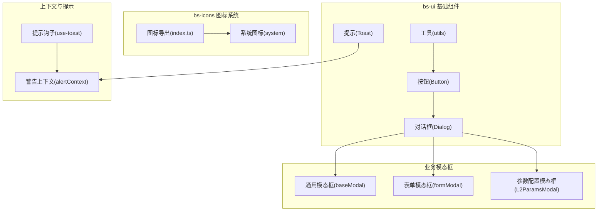
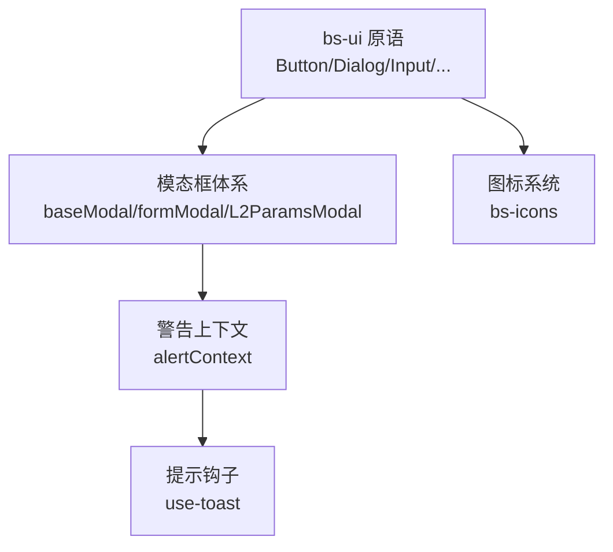
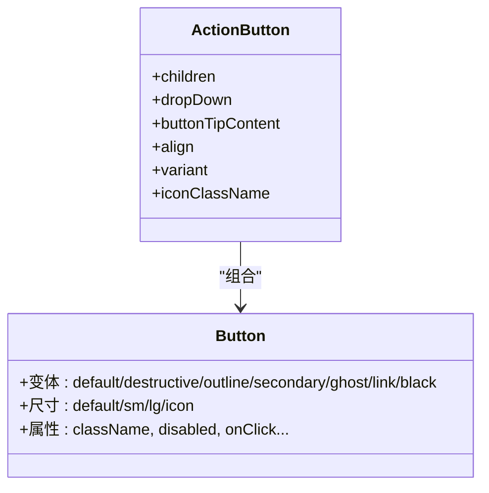
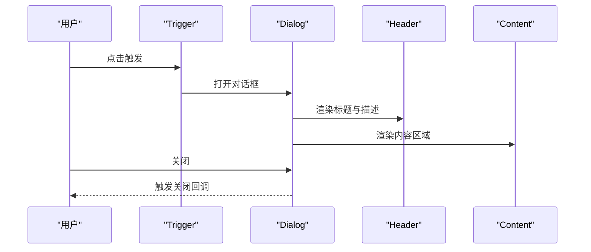
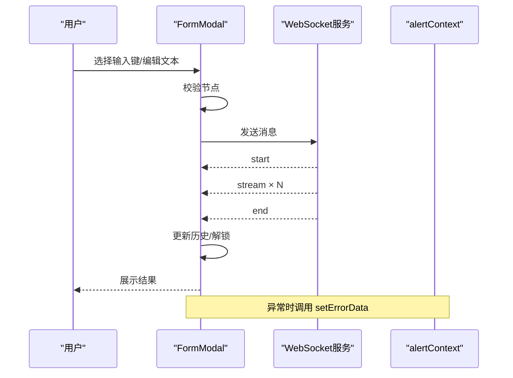
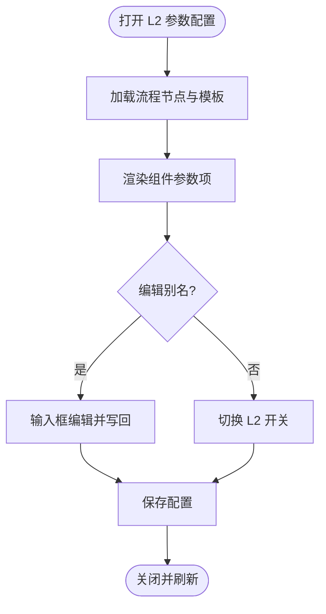
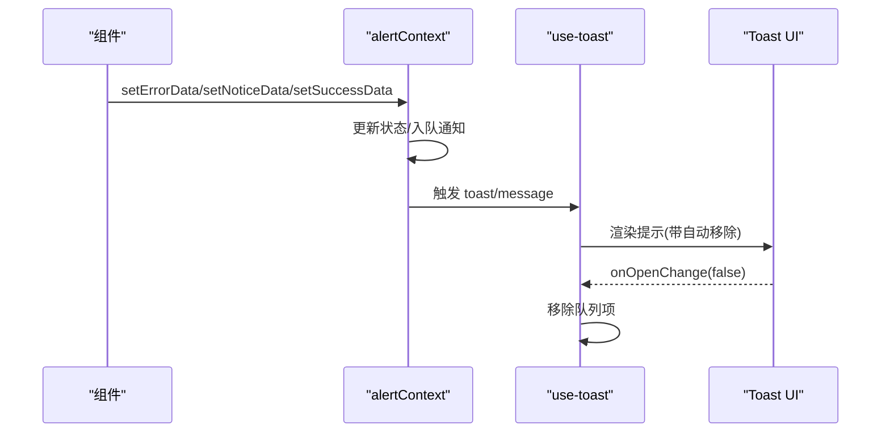
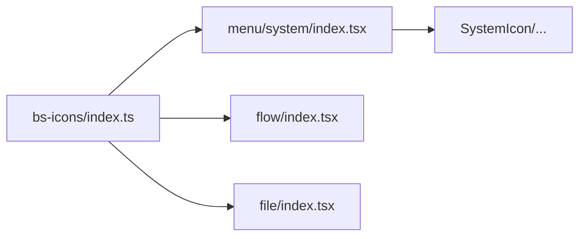
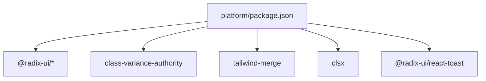

# 组件库系统

<cite>
**本文引用的文件**
- [package.json](file://src/frontend/platform/package.json)
- [utils.tsx](file://src/frontend/platform/src/components/bs-ui/utils.tsx)
- [button/index.tsx](file://src/frontend/platform/src/components/bs-ui/button/index.tsx)
- [button/actionButton.tsx](file://src/frontend/platform/src/components/bs-ui/button/actionButton.tsx)
- [dialog/index.tsx](file://src/frontend/platform/src/components/bs-ui/dialog/index.tsx)
- [baseModal/index.tsx](file://src/frontend/platform/src/modals/baseModal/index.tsx)
- [formModal/index.tsx](file://src/frontend/platform/src/modals/formModal/index.tsx)
- [L2ParamsModal/index.tsx](file://src/frontend/platform/src/modals/L2ParamsModal/index.tsx)
- [toast/use-toast.tsx](file://src/frontend/platform/src/components/bs-ui/toast/use-toast.tsx)
- [alertContext.tsx](file://src/frontend/platform/src/contexts/alertContext.tsx)
- [bs-icons/index.ts](file://src/frontend/platform/src/components/bs-icons/index.ts)
- [system/index.tsx](file://src/frontend/platform/src/components/bs-icons/menu/system/index.tsx)
- [Example.tsx](file://src/frontend/platform/src/pages/SystemPage/theme/Example.tsx)
</cite>

## 目录
1. [简介](#简介)
2. [项目结构](#项目结构)
3. [核心组件](#核心组件)
4. [架构总览](#架构总览)
5. [详细组件分析](#详细组件分析)
6. [依赖关系分析](#依赖关系分析)
7. [性能考量](#性能考量)
8. [故障排查指南](#故障排查指南)
9. [结论](#结论)
10. [附录](#附录)

## 简介
本文件面向 Bisheng 平台前端组件库系统，系统由三部分构成：bs-ui 基础组件、bs-icons 图标系统、以及业务模态框与提示系统。本文档从架构、数据流、交互设计、可访问性、测试与文档生成最佳实践等维度，对组件库进行系统化技术说明，并给出组件开发规范与扩展建议。

## 项目结构
- 前端工程位于 src/frontend/platform，采用基于 Radix UI 的可组合基础组件库（bs-ui），通过 Tailwind/CVA 实现主题与变体；图标系统（bs-icons）以模块化 SVG 导出；业务层通过对话框（Dialog）封装形成通用模态框、表单模态框、参数配置模态框；警告提示系统通过上下文（alertContext）与 Toast 管理器统一调度。

**图表来源**
- [button/index.tsx](file://src/frontend/platform/src/components/bs-ui/button/index.tsx#L1-L35)
- [dialog/index.tsx](file://src/frontend/platform/src/components/bs-ui/dialog/index.tsx)
- [baseModal/index.tsx](file://src/frontend/platform/src/modals/baseModal/index.tsx#L1-L48)
- [formModal/index.tsx](file://src/frontend/platform/src/modals/formModal/index.tsx#L1-L591)
- [L2ParamsModal/index.tsx](file://src/frontend/platform/src/modals/L2ParamsModal/index.tsx#L1-L179)
- [toast/use-toast.tsx](file://src/frontend/platform/src/components/bs-ui/toast/use-toast.tsx#L1-L203)
- [alertContext.tsx](file://src/frontend/platform/src/contexts/alertContext.tsx#L1-L163)
- [bs-icons/index.ts](file://src/frontend/platform/src/components/bs-icons/index.ts#L1-L43)
- [system/index.tsx](file://src/frontend/platform/src/components/bs-icons/menu/system/index.tsx#L1-L16)

**章节来源**
- [package.json](file://src/frontend/platform/package.json#L1-L126)

## 核心组件
- bs-ui 基础组件：以 Radix UI 为底层，结合 class-variance-authority（CVA）与 Tailwind 合并策略，提供按钮、输入、选择、表格、日历、开关、滑块、标签、对话框、提示等高复用 UI 原语。
- bs-icons 图标系统：按功能域拆分目录（如 menu/system、flow、file 等），每个图标以 SVG 模块导出并统一在 index.ts 中聚合导出，便于按需引入与 Tree-shaking。
- 业务模态框：基于 bs-ui 的 Dialog 封装，形成通用模态框、表单模态框（含聊天与 WebSocket 流式输出）、参数配置模态框（L2 参数简化配置）。
- 警告提示系统：通过 alertContext 管理错误、通知、成功三种状态与通知中心列表；Toast 提示通过 use-toast 管理队列与自动移除。

**章节来源**
- [button/index.tsx](file://src/frontend/platform/src/components/bs-ui/button/index.tsx#L1-L35)
- [button/actionButton.tsx](file://src/frontend/platform/src/components/bs-ui/button/actionButton.tsx#L1-L47)
- [dialog/index.tsx](file://src/frontend/platform/src/components/bs-ui/dialog/index.tsx)
- [baseModal/index.tsx](file://src/frontend/platform/src/modals/baseModal/index.tsx#L1-L48)
- [formModal/index.tsx](file://src/frontend/platform/src/modals/formModal/index.tsx#L1-L591)
- [L2ParamsModal/index.tsx](file://src/frontend/platform/src/modals/L2ParamsModal/index.tsx#L1-L179)
- [toast/use-toast.tsx](file://src/frontend/platform/src/components/bs-ui/toast/use-toast.tsx#L1-L203)
- [alertContext.tsx](file://src/frontend/platform/src/contexts/alertContext.tsx#L1-L163)
- [bs-icons/index.ts](file://src/frontend/platform/src/components/bs-icons/index.ts#L1-L43)
- [system/index.tsx](file://src/frontend/platform/src/components/bs-icons/menu/system/index.tsx#L1-L16)

## 架构总览
- 组件层：bs-ui 作为原子组件层，提供一致的视觉与交互基线；业务层通过 Dialog 包裹形成模态框体系。
- 数据层：alertContext 统一管理错误/通知/成功状态与通知中心；use-toast 负责 Toast 队列与生命周期。
- 图标层：bs-icons 以模块化目录组织，index.ts 聚合导出，支持按需引入。
- 工具层：utils 提供样式合并、防抖等通用能力，贯穿组件与业务逻辑。

**图表来源**
- [button/index.tsx](file://src/frontend/platform/src/components/bs-ui/button/index.tsx#L1-L35)
- [dialog/index.tsx](file://src/frontend/platform/src/components/bs-ui/dialog/index.tsx)
- [baseModal/index.tsx](file://src/frontend/platform/src/modals/baseModal/index.tsx#L1-L48)
- [formModal/index.tsx](file://src/frontend/platform/src/modals/formModal/index.tsx#L1-L591)
- [L2ParamsModal/index.tsx](file://src/frontend/platform/src/modals/L2ParamsModal/index.tsx#L1-L179)
- [alertContext.tsx](file://src/frontend/platform/src/contexts/alertContext.tsx#L1-L163)
- [toast/use-toast.tsx](file://src/frontend/platform/src/components/bs-ui/toast/use-toast.tsx#L1-L203)
- [bs-icons/index.ts](file://src/frontend/platform/src/components/bs-icons/index.ts#L1-L43)

## 详细组件分析

### bs-ui 按钮与动作按钮
- Button：使用 CVA 定义变体与尺寸，结合工具函数合并类名，支持多种视觉与交互状态。
- ActionButton：在按钮右侧集成下拉菜单，支持 Tooltip 提示，常用于“主操作+下拉菜单”的复合交互。

**图表来源**
- [button/index.tsx](file://src/frontend/platform/src/components/bs-ui/button/index.tsx#L1-L35)
- [button/actionButton.tsx](file://src/frontend/platform/src/components/bs-ui/button/actionButton.tsx#L1-L47)

**章节来源**
- [button/index.tsx](file://src/frontend/platform/src/components/bs-ui/button/index.tsx#L1-L35)
- [button/actionButton.tsx](file://src/frontend/platform/src/components/bs-ui/button/actionButton.tsx#L1-L47)

### 通用模态框（baseModal）
- 结构：Header/Content/Footer/Trigger 组合，基于 bs-ui Dialog，支持描述文本与灵活的 children 插槽。
- 行为：Trigger 支持 asChild 与禁用控制；Header 支持传入描述；Content 保证全宽高布局。

**图表来源**
- [baseModal/index.tsx](file://src/frontend/platform/src/modals/baseModal/index.tsx#L1-L48)
- [dialog/index.tsx](file://src/frontend/platform/src/components/bs-ui/dialog/index.tsx)

**章节来源**
- [baseModal/index.tsx](file://src/frontend/platform/src/modals/baseModal/index.tsx#L1-L48)

### 表单模态框（formModal）
- 功能：封装表单变量选择、聊天输入、WebSocket 流式输出、历史记录渲染、清空聊天等。
- 交互：通过 TabsContext 读取表单键值，使用 Toggle 切换当前聊天键；发送消息时校验节点并构造输入对象；错误通过 alertContext 统一提示。
- 通信：建立 WebSocket 连接，处理 start/stream/end 事件，动态更新聊天历史；异常时提示并尝试重连。

**图表来源**
- [formModal/index.tsx](file://src/frontend/platform/src/modals/formModal/index.tsx#L1-L591)
- [alertContext.tsx](file://src/frontend/platform/src/contexts/alertContext.tsx#L1-L163)

**章节来源**
- [formModal/index.tsx](file://src/frontend/platform/src/modals/formModal/index.tsx#L1-L591)

### 参数配置模态框（L2ParamsModal）
- 功能：对流程中的组件参数进行“别名”编辑与“是否启用 L2 参数”切换，支持多组件参数批量配置。
- 交互：使用 Accordion 展示组件参数项，Switch 控制 l2 开关，输入框编辑别名；保存时回写到流程数据。

**图表来源**
- [L2ParamsModal/index.tsx](file://src/frontend/platform/src/modals/L2ParamsModal/index.tsx#L1-L179)

**章节来源**
- [L2ParamsModal/index.tsx](file://src/frontend/platform/src/modals/L2ParamsModal/index.tsx#L1-L179)

### 警告提示系统（alertContext + use-toast）
- alertContext：集中管理错误、通知、成功三类状态与通知中心列表，支持新增、清空、按 id 移除。
- use-toast：管理 Toast 队列，限制数量与自动移除，支持 message 与 toast 两类提示；通过 onOpenChange 生命周期回收。

**图表来源**
- [alertContext.tsx](file://src/frontend/platform/src/contexts/alertContext.tsx#L1-L163)
- [toast/use-toast.tsx](file://src/frontend/platform/src/components/bs-ui/toast/use-toast.tsx#L1-L203)

**章节来源**
- [alertContext.tsx](file://src/frontend/platform/src/contexts/alertContext.tsx#L1-L163)
- [toast/use-toast.tsx](file://src/frontend/platform/src/components/bs-ui/toast/use-toast.tsx#L1-L203)

### 图标系统（bs-icons）
- 组织方式：按功能域划分目录（menu/system、flow、file 等），每个图标以 SVG 模块导出并通过 index.ts 聚合。
- 使用方式：统一从 bs-icons 导入具体图标组件，支持 className 自定义尺寸与颜色。

**图表来源**
- [bs-icons/index.ts](file://src/frontend/platform/src/components/bs-icons/index.ts#L1-L43)
- [system/index.tsx](file://src/frontend/platform/src/components/bs-icons/menu/system/index.tsx#L1-L16)

**章节来源**
- [bs-icons/index.ts](file://src/frontend/platform/src/components/bs-icons/index.ts#L1-L43)
- [system/index.tsx](file://src/frontend/platform/src/components/bs-icons/menu/system/index.tsx#L1-L16)

### 示例页面（主题示例）
- 在示例页面中引入了大量 bs-ui 组件（如 Accordion、Badge、Button、Calendar、Card、Checkbox、Input、Label、Pagination、Radio、Select、Slider、Switch、Table、Toast 等），用于展示组件库的使用方式与主题一致性。

**章节来源**
- [Example.tsx](file://src/frontend/platform/src/pages/SystemPage/theme/Example.tsx#L1-L39)

## 依赖关系分析
- 组件依赖：bs-ui 大量依赖 @radix-ui/* 与 class-variance-authority、tailwind-merge 等；模态框依赖 bs-ui Dialog；Toast 依赖 @radix-ui/react-toast。
- 图标依赖：bs-icons 为纯 SVG 导出，不引入运行时依赖，便于按需打包。
- 工具依赖：utils 使用 clsx 与 tailwind-merge 合并类名，提供防抖与 UUID 工具。

**图表来源**
- [package.json](file://src/frontend/platform/package.json#L1-L126)

**章节来源**
- [package.json](file://src/frontend/platform/package.json#L1-L126)

## 性能考量
- 按需引入：bs-icons 通过 index.ts 聚合导出，建议业务侧仅导入所需图标，避免全量引入导致包体增大。
- 组件复用：Dialog 作为容器组件，尽量将内容组件拆分为独立模块并在需要时懒加载，减少初始渲染压力。
- Toast 队列：use-toast 限制同时展示数量并设置自动移除时间，避免过多提示堆积影响交互。
- 防抖与去抖：utils 提供 useDebounce，适用于高频输入或搜索场景，降低重渲染频率。

[本节为通用指导，无需特定文件引用]

## 故障排查指南
- 模态框无法关闭或重复打开
  - 检查 Dialog 的 open/onOpenChange 受控状态是否正确传递。
  - 确认 baseModal 的 Trigger 是否被隐藏或禁用。
- 表单模态框 WebSocket 异常
  - 查看 alertContext 的错误提示；确认 WebSocket URL 与鉴权头是否正确；检查连接状态与异常回调。
- Toast 不消失或重复出现
  - 检查 use-toast 的 onOpenChange 生命周期与自动移除定时器；确认 TOAST_REMOVE_DELAY 设置是否合理。
- 图标不显示或样式异常
  - 确认从 bs-icons 正确导入图标组件；检查 className 与 viewBox；SVG 文件路径是否正确。

**章节来源**
- [baseModal/index.tsx](file://src/frontend/platform/src/modals/baseModal/index.tsx#L1-L48)
- [formModal/index.tsx](file://src/frontend/platform/src/modals/formModal/index.tsx#L1-L591)
- [toast/use-toast.tsx](file://src/frontend/platform/src/components/bs-ui/toast/use-toast.tsx#L1-L203)
- [bs-icons/index.ts](file://src/frontend/platform/src/components/bs-icons/index.ts#L1-L43)

## 结论
Bisheng 组件库系统以 bs-ui 为基础，结合 bs-icons 与业务模态框，构建了统一、可扩展且具备良好可访问性的前端组件体系。通过 alertContext 与 use-toast 的协同，实现了统一的警告与提示体验。建议在后续迭代中持续完善组件文档与测试覆盖率，强化可访问性与国际化支持。

[本节为总结性内容，无需特定文件引用]

## 附录

### 组件开发指南（命名规范、样式约定、交互设计、可访问性）
- 命名规范
  - 组件文件夹与导出组件采用 PascalCase；图标组件以 Icon 结尾（如 SystemIcon）。
  - 模态框文件夹以大写开头（如 baseModal、formModal、L2ParamsModal）。
- 样式约定
  - 使用 CVA 定义变体与尺寸，通过工具函数合并类名，保持一致的视觉基线。
  - 尺寸与间距遵循 Tailwind 默认规范，避免硬编码像素值。
- 交互设计
  - 对外暴露受控 props（如 open/onOpenChange），内部状态最小化。
  - 提供无障碍属性（aria-*）与键盘导航支持。
- 可访问性
  - 为按钮、输入、对话框等组件提供合适的 role、aria-* 属性。
  - 确保焦点管理与键盘操作（Tab/Enter/Esc）符合 WCAG 基准。

**章节来源**
- [button/index.tsx](file://src/frontend/platform/src/components/bs-ui/button/index.tsx#L1-L35)
- [utils.tsx](file://src/frontend/platform/src/components/bs-ui/utils.tsx#L1-L52)

### 组件测试与文档生成最佳实践
- 单元测试
  - 对工具函数（如防抖、UUID）编写独立测试；对组件行为（如 Dialog 打开/关闭、Toast 显示/移除）进行快照或交互测试。
- 文档生成
  - 使用 Storybook 或类似工具为每个组件生成示例页，覆盖变体、尺寸、交互状态。
  - 为业务模态框补充使用示例与参数说明，标注依赖上下文与外部服务（如 WebSocket）。
- 回归与监控
  - 在 CI 中加入组件快照与交互测试；对关键路径（如表单模态框）增加端到端测试。

[本节为通用指导，无需特定文件引用]