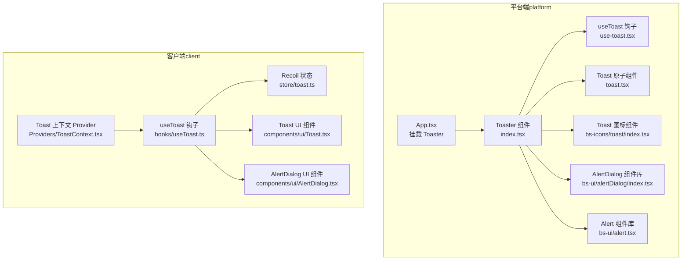
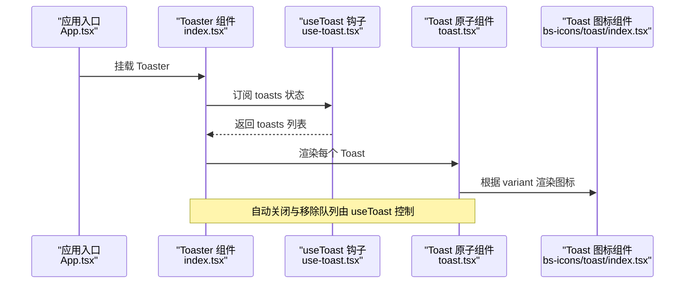
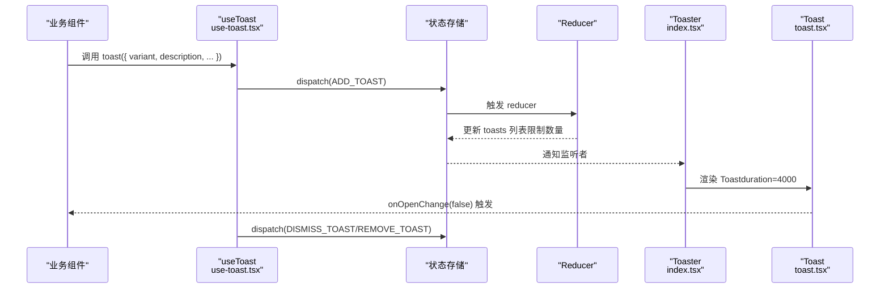
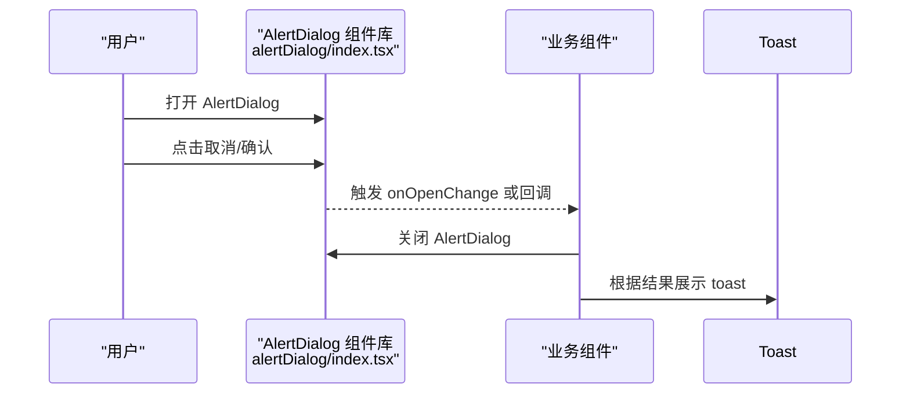
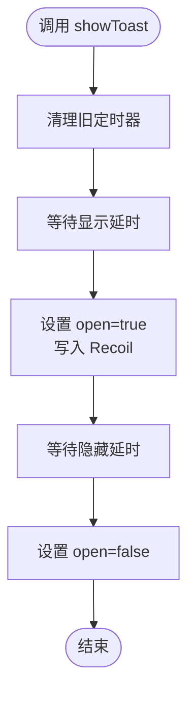
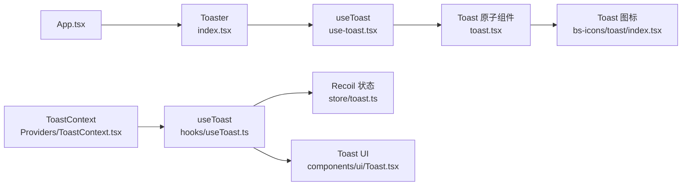

# 警告提示系统

<cite>
**本文引用的文件**
- [src/frontend/platform/src/components/bs-ui/toast/index.tsx](file://src/frontend/platform/src/components/bs-ui/toast/index.tsx)
- [src/frontend/platform/src/components/bs-ui/toast/use-toast.tsx](file://src/frontend/platform/src/components/bs-ui/toast/use-toast.tsx)
- [src/frontend/platform/src/components/bs-ui/toast/toast.tsx](file://src/frontend/platform/src/components/bs-ui/toast/toast.tsx)
- [src/frontend/platform/src/components/bs-icons/toast/index.tsx](file://src/frontend/platform/src/components/bs-icons/toast/index.tsx)
- [src/frontend/platform/src/components/bs-ui/alertDialog/index.tsx](file://src/frontend/platform/src/components/bs-ui/alertDialog/index.tsx)
- [src/frontend/platform/src/components/bs-ui/alert.tsx](file://src/frontend/platform/src/components/bs-ui/alert.tsx)
- [src/frontend/platform/src/components/LinSight/DeleteConfirmModal.tsx](file://src/frontend/platform/src/components/LinSight/DeleteConfirmModal.tsx)
- [src/frontend/platform/src/App.tsx](file://src/frontend/platform/src/App.tsx)
- [src/frontend/client/src/hooks/useToast.ts](file://src/frontend/client/src/hooks/useToast.ts)
- [src/frontend/client/src/store/toast.ts](file://src/frontend/client/src/store/toast.ts)
- [src/frontend/client/src/Providers/ToastContext.tsx](file://src/frontend/client/src/Providers/ToastContext.tsx)
- [src/frontend/client/src/components/ui/Toast.tsx](file://src/frontend/client/src/components/ui/Toast.tsx)
- [src/frontend/client/src/components/ui/AlertDialog.tsx](file://src/frontend/client/src/components/ui/AlertDialog.tsx)
</cite>

## 目录
1. [简介](#简介)
2. [项目结构](#项目结构)
3. [核心组件](#核心组件)
4. [架构总览](#架构总览)
5. [组件详解](#组件详解)
6. [依赖关系分析](#依赖关系分析)
7. [性能与可用性](#性能与可用性)
8. [故障排查指南](#故障排查指南)
9. [结论](#结论)
10. [附录](#附录)

## 简介
本技术文档围绕警告提示系统进行深入解析，覆盖成功提示、错误提示、通知提醒、确认对话框等不同类型的提示组件。文档将阐述提示组件的显示时机、持续时间与自动关闭机制，说明消息格式、样式定制与位置配置选项，并提供全局管理与局部使用的两种接入方式。同时，文档给出可访问性支持、键盘快捷键与屏幕阅读器兼容性的建议与现状说明，并总结提示系统在用户体验优化与错误处理中的关键作用。

## 项目结构
提示系统由两套并行实现构成：
- 平台端（platform）：基于 Radix UI 的 Toast 提示与 AlertDialog 确认对话框，采用自研状态管理与图标组件。
- 客户端（client）：基于 Recoil 的全局状态提示与上下文封装，提供更通用的全局调用能力。

图表来源
- [src/frontend/platform/src/App.tsx](file://src/frontend/platform/src/App.tsx#L240-L244)
- [src/frontend/platform/src/components/bs-ui/toast/index.tsx](file://src/frontend/platform/src/components/bs-ui/toast/index.tsx#L12-L37)
- [src/frontend/platform/src/components/bs-ui/toast/use-toast.tsx](file://src/frontend/platform/src/components/bs-ui/toast/use-toast.tsx#L1-L203)
- [src/frontend/platform/src/components/bs-ui/toast/toast.tsx](file://src/frontend/platform/src/components/bs-ui/toast/toast.tsx#L1-L128)
- [src/frontend/platform/src/components/bs-icons/toast/index.tsx](file://src/frontend/platform/src/components/bs-icons/toast/index.tsx#L1-L22)
- [src/frontend/platform/src/components/bs-ui/alertDialog/index.tsx](file://src/frontend/platform/src/components/bs-ui/alertDialog/index.tsx#L1-L141)
- [src/frontend/platform/src/components/bs-ui/alert.tsx](file://src/frontend/platform/src/components/bs-ui/alert.tsx#L1-L59)
- [src/frontend/client/src/hooks/useToast.ts](file://src/frontend/client/src/hooks/useToast.ts#L1-L63)
- [src/frontend/client/src/store/toast.ts](file://src/frontend/client/src/store/toast.ts#L1-L14)
- [src/frontend/client/src/Providers/ToastContext.tsx](file://src/frontend/client/src/Providers/ToastContext.tsx#L1-L21)
- [src/frontend/client/src/components/ui/Toast.tsx](file://src/frontend/client/src/components/ui/Toast.tsx#L1-L57)
- [src/frontend/client/src/components/ui/AlertDialog.tsx](file://src/frontend/client/src/components/ui/AlertDialog.tsx#L1-L65)

章节来源
- [src/frontend/platform/src/App.tsx](file://src/frontend/platform/src/App.tsx#L180-L246)
- [src/frontend/platform/src/components/bs-ui/toast/index.tsx](file://src/frontend/platform/src/components/bs-ui/toast/index.tsx#L1-L38)
- [src/frontend/client/src/hooks/useToast.ts](file://src/frontend/client/src/hooks/useToast.ts#L1-L63)

## 核心组件
- 平台端 Toast
  - Toaster：全局渲染器，订阅 useToast 状态并渲染多个 Toast。
  - useToast：状态管理钩子，提供 toast/message/dismiss 等 API。
  - Toast 原子组件：Root、Viewport、Title、Description、Close、Action 等。
  - 图标组件：根据 variant 渲染 info/success/warning/error 对应图标。
- 平台端确认对话框
  - AlertDialog：基于 Radix UI 的确认对话框组件库，含 Overlay、Content、Title、Description、Action、Cancel 等。
- 客户端全局提示
  - useToast（Recoil）：通过 Recoil 状态控制提示显示与隐藏，支持定时自动关闭。
  - ToastContext：全局上下文，暴露 showToast 方法供任意组件调用。
  - Toast UI 组件：基于 Radix UI 的 Root/Description 实现，按 severity 应用样式。
- 错误/通知提醒
  - Alert：基础警示容器，支持默认与破坏性样式。
  - DeleteConfirmModal：简易删除确认弹窗（非 Radix 对话框）。

章节来源
- [src/frontend/platform/src/components/bs-ui/toast/index.tsx](file://src/frontend/platform/src/components/bs-ui/toast/index.tsx#L1-L38)
- [src/frontend/platform/src/components/bs-ui/toast/use-toast.tsx](file://src/frontend/platform/src/components/bs-ui/toast/use-toast.tsx#L1-L203)
- [src/frontend/platform/src/components/bs-ui/toast/toast.tsx](file://src/frontend/platform/src/components/bs-ui/toast/toast.tsx#L1-L128)
- [src/frontend/platform/src/components/bs-icons/toast/index.tsx](file://src/frontend/platform/src/components/bs-icons/toast/index.tsx#L1-L22)
- [src/frontend/platform/src/components/bs-ui/alertDialog/index.tsx](file://src/frontend/platform/src/components/bs-ui/alertDialog/index.tsx#L1-L141)
- [src/frontend/platform/src/components/bs-ui/alert.tsx](file://src/frontend/platform/src/components/bs-ui/alert.tsx#L1-L59)
- [src/frontend/client/src/hooks/useToast.ts](file://src/frontend/client/src/hooks/useToast.ts#L1-L63)
- [src/frontend/client/src/Providers/ToastContext.tsx](file://src/frontend/client/src/Providers/ToastContext.tsx#L1-L21)
- [src/frontend/client/src/components/ui/Toast.tsx](file://src/frontend/client/src/components/ui/Toast.tsx#L1-L57)
- [src/frontend/client/src/components/ui/AlertDialog.tsx](file://src/frontend/client/src/components/ui/AlertDialog.tsx#L1-L65)
- [src/frontend/platform/src/components/LinSight/DeleteConfirmModal.tsx](file://src/frontend/platform/src/components/LinSight/DeleteConfirmModal.tsx#L1-L38)

## 架构总览
平台端与客户端分别提供提示能力，二者互不冲突，可按需选择或组合使用。

图表来源
- [src/frontend/platform/src/App.tsx](file://src/frontend/platform/src/App.tsx#L240-L244)
- [src/frontend/platform/src/components/bs-ui/toast/index.tsx](file://src/frontend/platform/src/components/bs-ui/toast/index.tsx#L12-L37)
- [src/frontend/platform/src/components/bs-ui/toast/use-toast.tsx](file://src/frontend/platform/src/components/bs-ui/toast/use-toast.tsx#L180-L199)
- [src/frontend/platform/src/components/bs-ui/toast/toast.tsx](file://src/frontend/platform/src/components/bs-ui/toast/toast.tsx#L45-L61)
- [src/frontend/platform/src/components/bs-icons/toast/index.tsx](file://src/frontend/platform/src/components/bs-icons/toast/index.tsx#L9-L21)

## 组件详解

### 平台端 Toast（全局渲染器）
- 设计要点
  - Toaster 作为全局渲染器，遍历 useToast 返回的 toasts 列表，为每个条目渲染一个 Toast。
  - 使用 ToastViewport 固定在页面右上角，确保层级最高且不影响滚动。
  - Toast 内部通过 ToastIcon 根据 variant 渲染对应图标，标题与描述分别映射到 ToastTitle 与 ToastDescription。
- 显示时机与自动关闭
  - 显示时机：调用 toast()/message() 后立即加入 toasts 列表并打开。
  - 自动关闭：Toast 的 onOpenChange 在关闭动画结束后触发，useToast 将其标记为关闭并进入移除队列，最终从列表中移除。
- 持续时间
  - Toast 组件在渲染时传入固定 duration（例如 4000ms），用于控制显示时长。
- 样式与位置
  - 通过 variants（info/success/warning/error）与 message 变体区分“右侧告警”和“中间提示”的视觉风格。
  - 位置固定在视口右上角，支持滑入/滑出动画与触摸滑动关闭。
- 全局管理与局部使用
  - 全局：在应用根节点挂载 Toaster，任何模块可通过 useToast 导出的 toast/message/dismiss 调用。
  - 局部：在需要的页面或组件内直接使用 useToast 并渲染 Toaster 子树。

图表来源
- [src/frontend/platform/src/components/bs-ui/toast/use-toast.tsx](file://src/frontend/platform/src/components/bs-ui/toast/use-toast.tsx#L143-L174)
- [src/frontend/platform/src/components/bs-ui/toast/use-toast.tsx](file://src/frontend/platform/src/components/bs-ui/toast/use-toast.tsx#L75-L128)
- [src/frontend/platform/src/components/bs-ui/toast/index.tsx](file://src/frontend/platform/src/components/bs-ui/toast/index.tsx#L12-L37)
- [src/frontend/platform/src/components/bs-ui/toast/toast.tsx](file://src/frontend/platform/src/components/bs-ui/toast/toast.tsx#L45-L61)

章节来源
- [src/frontend/platform/src/components/bs-ui/toast/index.tsx](file://src/frontend/platform/src/components/bs-ui/toast/index.tsx#L1-L38)
- [src/frontend/platform/src/components/bs-ui/toast/use-toast.tsx](file://src/frontend/platform/src/components/bs-ui/toast/use-toast.tsx#L1-L203)
- [src/frontend/platform/src/components/bs-ui/toast/toast.tsx](file://src/frontend/platform/src/components/bs-ui/toast/toast.tsx#L1-L128)
- [src/frontend/platform/src/components/bs-icons/toast/index.tsx](file://src/frontend/platform/src/components/bs-icons/toast/index.tsx#L1-L22)

### 平台端确认对话框（AlertDialog）
- 设计要点
  - 基于 Radix UI 的 AlertDialog，提供 Overlay、Portal、Content、Title、Description、Action、Cancel 等原子组件。
  - 支持居中弹出、遮罩层、动画过渡与键盘交互。
- 使用场景
  - 删除确认、危险操作二次确认、重要信息确认等。
- 与 Toast 的配合
  - 可在用户点击“取消/确认”后，结合 Toast 展示结果反馈。

图表来源
- [src/frontend/platform/src/components/bs-ui/alertDialog/index.tsx](file://src/frontend/platform/src/components/bs-ui/alertDialog/index.tsx#L1-L141)

章节来源
- [src/frontend/platform/src/components/bs-ui/alertDialog/index.tsx](file://src/frontend/platform/src/components/bs-ui/alertDialog/index.tsx#L1-L141)

### 客户端全局提示（Recoil）
- 设计要点
  - 通过 Recoil 状态控制提示的 open/message/severity/showIcon/duration。
  - useToast 钩子负责调度显示/隐藏逻辑，支持延时显示与定时隐藏。
  - ToastContext 提供全局上下文，任意组件可通过 useContext 获取 showToast。
- 显示时机与自动关闭
  - showToast 接收参数后，先清理旧定时器，再设置显示定时器，随后设置隐藏定时器。
  - onOpenChange 用于同步 UI 状态与 Recoil 状态。
- 样式与位置
  - UI 组件按 severity 应用边框/背景色，支持图标开关。
  - 位置与布局由具体 UI 组件决定，通常位于页面顶部或中心区域。

图表来源
- [src/frontend/client/src/hooks/useToast.ts](file://src/frontend/client/src/hooks/useToast.ts#L23-L51)
- [src/frontend/client/src/store/toast.ts](file://src/frontend/client/src/store/toast.ts#L1-L14)
- [src/frontend/client/src/Providers/ToastContext.tsx](file://src/frontend/client/src/Providers/ToastContext.tsx#L1-L21)
- [src/frontend/client/src/components/ui/Toast.tsx](file://src/frontend/client/src/components/ui/Toast.tsx#L1-L57)

章节来源
- [src/frontend/client/src/hooks/useToast.ts](file://src/frontend/client/src/hooks/useToast.ts#L1-L63)
- [src/frontend/client/src/store/toast.ts](file://src/frontend/client/src/store/toast.ts#L1-L14)
- [src/frontend/client/src/Providers/ToastContext.tsx](file://src/frontend/client/src/Providers/ToastContext.tsx#L1-L21)
- [src/frontend/client/src/components/ui/Toast.tsx](file://src/frontend/client/src/components/ui/Toast.tsx#L1-L57)

### 错误/通知提醒（Alert 与 DeleteConfirmModal）
- Alert
  - 作为静态警示容器，支持默认与破坏性样式，适合在页面内嵌展示。
- DeleteConfirmModal
  - 简易确认弹窗，适用于不需要 Radix 对话框的场景，便于快速集成。

章节来源
- [src/frontend/platform/src/components/bs-ui/alert.tsx](file://src/frontend/platform/src/components/bs-ui/alert.tsx#L1-L59)
- [src/frontend/platform/src/components/LinSight/DeleteConfirmModal.tsx](file://src/frontend/platform/src/components/LinSight/DeleteConfirmModal.tsx#L1-L38)

## 依赖关系分析
- 平台端
  - App.tsx 挂载 Toaster，统一管理 Toast 生命周期。
  - Toaster 依赖 useToast 提供的状态与 API。
  - Toast 原子组件依赖 Radix UI 与 class-variance-authority，样式通过 variants 控制。
  - 图标组件根据 variant 动态选择 SVG。
- 客户端
  - ToastContext 将 useToast 暴露为全局方法，便于跨组件调用。
  - useToast 依赖 Recoil 状态与定时器，实现延迟显示与自动隐藏。
  - UI 组件基于 Radix UI Root/Description 实现，样式由外部类名控制。

图表来源
- [src/frontend/platform/src/App.tsx](file://src/frontend/platform/src/App.tsx#L240-L244)
- [src/frontend/platform/src/components/bs-ui/toast/index.tsx](file://src/frontend/platform/src/components/bs-ui/toast/index.tsx#L1-L38)
- [src/frontend/platform/src/components/bs-ui/toast/use-toast.tsx](file://src/frontend/platform/src/components/bs-ui/toast/use-toast.tsx#L1-L203)
- [src/frontend/platform/src/components/bs-ui/toast/toast.tsx](file://src/frontend/platform/src/components/bs-ui/toast/toast.tsx#L1-L128)
- [src/frontend/platform/src/components/bs-icons/toast/index.tsx](file://src/frontend/platform/src/components/bs-icons/toast/index.tsx#L1-L22)
- [src/frontend/client/src/Providers/ToastContext.tsx](file://src/frontend/client/src/Providers/ToastContext.tsx#L1-L21)
- [src/frontend/client/src/hooks/useToast.ts](file://src/frontend/client/src/hooks/useToast.ts#L1-L63)
- [src/frontend/client/src/store/toast.ts](file://src/frontend/client/src/store/toast.ts#L1-L14)
- [src/frontend/client/src/components/ui/Toast.tsx](file://src/frontend/client/src/components/ui/Toast.tsx#L1-L57)

章节来源
- [src/frontend/platform/src/App.tsx](file://src/frontend/platform/src/App.tsx#L180-L246)
- [src/frontend/platform/src/components/bs-ui/toast/index.tsx](file://src/frontend/platform/src/components/bs-ui/toast/index.tsx#L1-L38)
- [src/frontend/client/src/Providers/ToastContext.tsx](file://src/frontend/client/src/Providers/ToastContext.tsx#L1-L21)

## 性能与可用性
- 性能特性
  - 平台端 Toast 通过有限队列（TOAST_LIMIT）限制同时显示数量，避免频繁渲染造成卡顿。
  - 使用 Radix UI 的动画与手势交互，保证流畅体验。
- 可访问性
  - Toast 原子组件基于 Radix UI，具备基础无障碍语义与键盘交互能力。
  - 建议：为关键提示增加 aria-live 区域或在全局上下文中补充 ARIA 属性，确保屏幕阅读器可感知。
- 键盘快捷键
  - 当前实现未显式绑定全局快捷键；可在应用层通过事件监听实现 ESC 关闭、Enter 确认等行为。
- 屏幕阅读器兼容性
  - 建议：为 Toast 添加 role="alert" 或 aria-live="assertive"，并在关闭时及时释放焦点。

[本节为通用指导，无需特定文件引用]

## 故障排查指南
- Toast 不显示
  - 检查是否在应用根节点挂载 Toaster。
  - 确认 useToast 返回的 toasts 列表非空。
- 自动关闭过快或过慢
  - 平台端：检查 Toast 渲染时传入的 duration 是否正确。
  - 客户端：检查 showToast 的 duration 参数与定时器逻辑。
- 多个 Toast 互相覆盖
  - 平台端：TOAST_LIMIT 限制为 1，若需并行显示请调整该阈值。
- 确认对话框无法关闭
  - 检查 AlertDialog 的 open/onOpenChange 是否正确绑定。
- 全局上下文无效
  - 确认 ToastContext.Provider 包裹了调用 showToast 的组件树。

章节来源
- [src/frontend/platform/src/components/bs-ui/toast/use-toast.tsx](file://src/frontend/platform/src/components/bs-ui/toast/use-toast.tsx#L8-L9)
- [src/frontend/platform/src/components/bs-ui/toast/toast.tsx](file://src/frontend/platform/src/components/bs-ui/toast/toast.tsx#L45-L61)
- [src/frontend/client/src/hooks/useToast.ts](file://src/frontend/client/src/hooks/useToast.ts#L23-L51)
- [src/frontend/client/src/Providers/ToastContext.tsx](file://src/frontend/client/src/Providers/ToastContext.tsx#L17-L21)

## 结论
本提示系统在平台端与客户端分别提供了高内聚、低耦合的实现方案。平台端以 Radix UI 为基础，强调样式与交互的一致性；客户端以 Recoil 为核心，强调全局状态与便捷调用。两者均可满足成功提示、错误提示、通知提醒与确认对话框等常见需求，并通过自动关闭、样式变体与图标组件实现良好的用户体验。建议在大型应用中结合业务场景选择合适的实现方式，或在必要时进行统一封装以提升一致性与可维护性。

[本节为总结，无需特定文件引用]

## 附录

### 消息格式与样式定制
- 消息格式
  - 支持 title、description（字符串或字符串数组）、variant（info/success/warning/error）、action（可选）等字段。
- 样式定制
  - 通过 variants 控制边框、背景与文本颜色；message 变体用于居中提示风格。
  - 可通过 className 扩展样式，ToastViewport 控制定位与层级。

章节来源
- [src/frontend/platform/src/components/bs-ui/toast/toast.tsx](file://src/frontend/platform/src/components/bs-ui/toast/toast.tsx#L24-L43)
- [src/frontend/platform/src/components/bs-icons/toast/index.tsx](file://src/frontend/platform/src/components/bs-icons/toast/index.tsx#L7-L21)

### 位置配置选项
- 平台端 Toast
  - 固定在视口右上角，支持滑入/滑出动画与触摸滑动关闭。
- 客户端 Toast UI
  - 位置由具体 UI 组件决定，通常位于页面顶部或中心区域。

章节来源
- [src/frontend/platform/src/components/bs-ui/toast/toast.tsx](file://src/frontend/platform/src/components/bs-ui/toast/toast.tsx#L9-L22)
- [src/frontend/client/src/components/ui/Toast.tsx](file://src/frontend/client/src/components/ui/Toast.tsx#L14-L23)

### 全局管理与局部使用
- 全局管理
  - 在应用根节点挂载 Toaster，通过 useToast 全局调用 toast/message/dismiss。
- 局部使用
  - 在特定页面或组件内引入 Toaster 子树，仅在该范围内生效。

章节来源
- [src/frontend/platform/src/App.tsx](file://src/frontend/platform/src/App.tsx#L240-L244)
- [src/frontend/platform/src/components/bs-ui/toast/index.tsx](file://src/frontend/platform/src/components/bs-ui/toast/index.tsx#L12-L37)