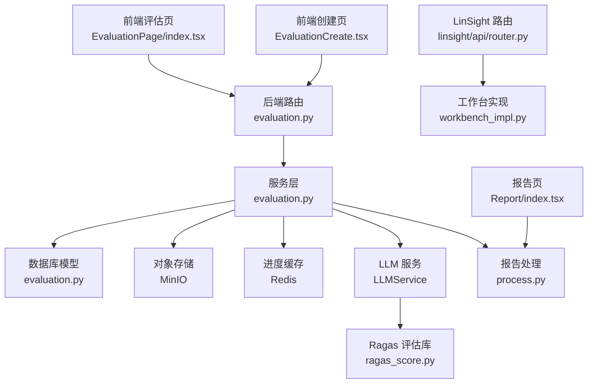
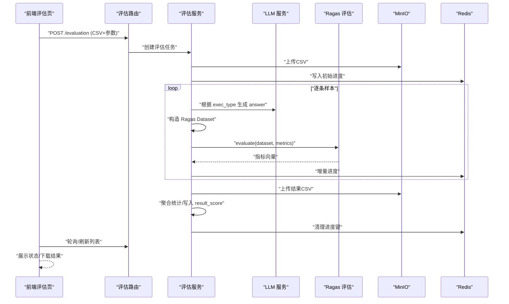
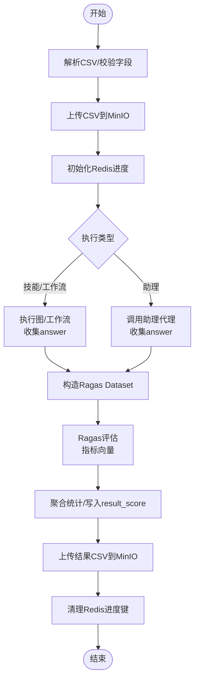
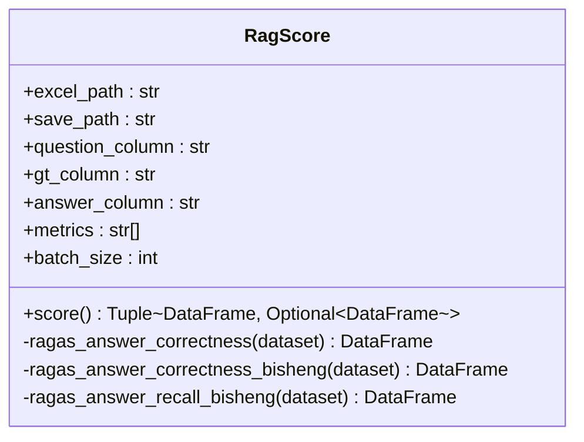
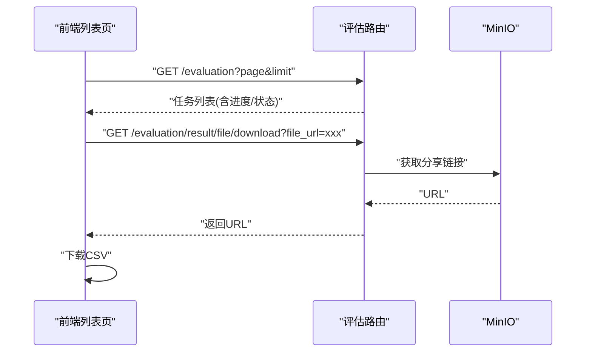
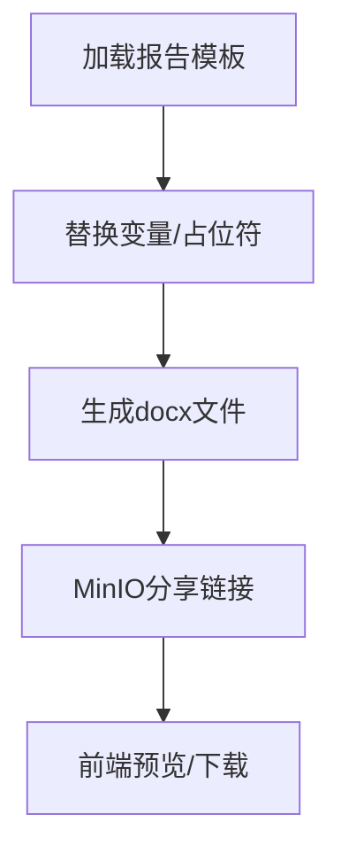
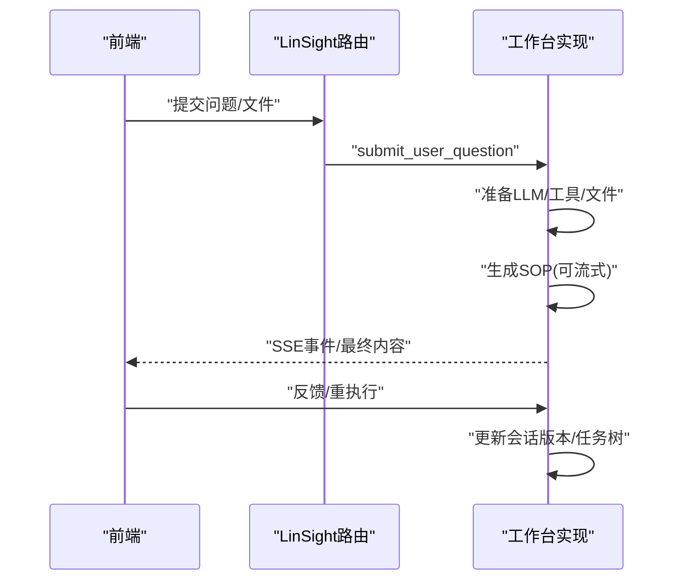
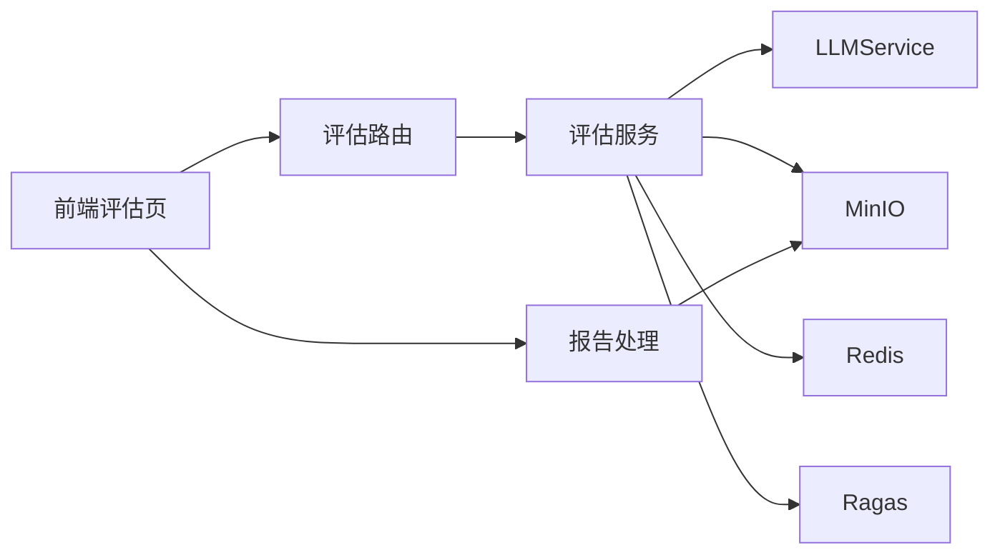

# 评估系统

<cite>
**本文引用的文件**
- [src/backend/bisheng/api/v1/evaluation.py](file://src/backend/bisheng/api/v1/evaluation.py)
- [src/backend/bisheng/api/services/evaluation.py](file://src/backend/bisheng/api/services/evaluation.py)
- [src/backend/bisheng/database/models/evaluation.py](file://src/backend/bisheng/database/models/evaluation.py)
- [src/backend/bisheng_langchain/rag/scoring/ragas_score.py](file://src/backend/bisheng_langchain/rag/scoring/ragas_score.py)
- [src/backend/bisheng_langchain/rag/run_rag_evaluate_web.py](file://src/backend/bisheng_langchain/rag/run_rag_evaluate_web.py)
- [src/backend/bisheng/processing/process.py](file://src/backend/bisheng/processing/process.py)
- [src/frontend/platform/src/pages/EvaluationPage/index.tsx](file://src/frontend/platform/src/pages/EvaluationPage/index.tsx)
- [src/frontend/platform/src/pages/EvaluationPage/EvaluationCreate.tsx](file://src/frontend/platform/src/pages/EvaluationPage/EvaluationCreate.tsx)
- [src/frontend/platform/src/pages/EvaluationPage/types.ts](file://src/frontend/platform/src/pages/EvaluationPage/types.ts)
- [src/frontend/platform/src/controllers/API/evaluate.ts](file://src/frontend/platform/src/controllers/API/evaluate.ts)
- [src/backend/bisheng/linsight/api/router.py](file://src/backend/bisheng/linsight/api/router.py)
- [src/backend/bisheng/linsight/domain/services/workbench_impl.py](file://src/backend/bisheng/linsight/domain/services/workbench_impl.py)
</cite>

## 目录
1. [引言](#引言)
2. [项目结构](#项目结构)
3. [核心组件](#核心组件)
4. [架构总览](#架构总览)
5. [详细组件分析](#详细组件分析)
6. [依赖关系分析](#依赖关系分析)
7. [性能考量](#性能考量)
8. [故障排查指南](#故障排查指南)
9. [结论](#结论)
10. [附录](#附录)

## 引言
本技术文档面向 Bisheng 评估系统，聚焦评估页面的实现架构与端到端流程，覆盖评估任务创建、评估数据准备、评估结果展示；深入解析评估指标计算（准确率、召回率、F1 分数等）；阐述评估报告生成（模板、数据导出、可视化）；说明 LinSight 评估工具的集成与使用（自动评估、人工评估、混合评估模式）；并提供评估数据管理（标注、质量控制、样本筛选）与结果分析优化建议。

## 项目结构
后端采用 FastAPI 路由 + 服务层 + 数据模型 + 工作流执行器的分层设计；前端采用 React + TypeScript 的页面组件与 API 控制器；评估链路贯穿 CSV 数据读取、LLM 指令驱动的 Ragas 评估、MinIO 存储、Redis 进度缓存与数据库持久化。

图表来源
- [src/backend/bisheng/api/v1/evaluation.py](file://src/backend/bisheng/api/v1/evaluation.py#L1-L104)
- [src/backend/bisheng/api/services/evaluation.py](file://src/backend/bisheng/api/services/evaluation.py#L1-L426)
- [src/backend/bisheng/database/models/evaluation.py](file://src/backend/bisheng/database/models/evaluation.py#L1-L98)
- [src/backend/bisheng_langchain/rag/scoring/ragas_score.py](file://src/backend/bisheng_langchain/rag/scoring/ragas_score.py#L1-L184)
- [src/backend/bisheng/processing/process.py](file://src/backend/bisheng/processing/process.py#L1-L357)
- [src/backend/bisheng/linsight/api/router.py](file://src/backend/bisheng/linsight/api/router.py#L1-L8)
- [src/backend/bisheng/linsight/domain/services/workbench_impl.py](file://src/backend/bisheng/linsight/domain/services/workbench_impl.py#L1-L800)

章节来源
- [src/backend/bisheng/api/v1/evaluation.py](file://src/backend/bisheng/api/v1/evaluation.py#L1-L104)
- [src/backend/bisheng/api/services/evaluation.py](file://src/backend/bisheng/api/services/evaluation.py#L1-L426)
- [src/backend/bisheng/database/models/evaluation.py](file://src/backend/bisheng/database/models/evaluation.py#L1-L98)
- [src/backend/bisheng/processing/process.py](file://src/backend/bisheng/processing/process.py#L1-L357)
- [src/backend/bisheng_langchain/rag/scoring/ragas_score.py](file://src/backend/bisheng_langchain/rag/scoring/ragas_score.py#L1-L184)
- [src/backend/bisheng/linsight/api/router.py](file://src/backend/bisheng/linsight/api/router.py#L1-L8)
- [src/backend/bisheng/linsight/domain/services/workbench_impl.py](file://src/backend/bisheng/linsight/domain/services/workbench_impl.py#L1-L800)

## 核心组件
- 评估 API 路由：负责接收 CSV 文件、执行类型、版本号、提示词，创建评估任务并异步执行。
- 评估服务层：解析 CSV、调用 LLM 执行 Ragas 评估、聚合指标、上传结果、更新状态。
- 数据模型：定义评估任务的字段、状态枚举、DAO 查询与更新。
- 报告处理：基于模板与替换变量生成报告并返回可下载链接。
- 前端评估页：展示任务列表、状态、进度、结果下载；创建页支持 CSV 上传、执行目标选择、提示词编辑。
- LinSight 集成：提供人机协同的 SOP 生成与任务树执行，支持混合评估模式。

章节来源
- [src/backend/bisheng/api/v1/evaluation.py](file://src/backend/bisheng/api/v1/evaluation.py#L1-L104)
- [src/backend/bisheng/api/services/evaluation.py](file://src/backend/bisheng/api/services/evaluation.py#L1-L426)
- [src/backend/bisheng/database/models/evaluation.py](file://src/backend/bisheng/database/models/evaluation.py#L1-L98)
- [src/backend/bisheng/processing/process.py](file://src/backend/bisheng/processing/process.py#L1-L357)
- [src/frontend/platform/src/pages/EvaluationPage/index.tsx](file://src/frontend/platform/src/pages/EvaluationPage/index.tsx#L1-L212)
- [src/frontend/platform/src/pages/EvaluationPage/EvaluationCreate.tsx](file://src/frontend/platform/src/pages/EvaluationPage/EvaluationCreate.tsx#L1-L426)
- [src/backend/bisheng/linsight/domain/services/workbench_impl.py](file://src/backend/bisheng/linsight/domain/services/workbench_impl.py#L1-L800)

## 架构总览
评估系统以“前端表单 → 后端路由 → 服务层 → LLM/Ragas → 结果落库/对象存储”的主干流程运行，并通过 Redis 缓存任务进度，通过 MinIO 存储 CSV/结果文件，最终在前端展示与下载。

图表来源
- [src/backend/bisheng/api/v1/evaluation.py](file://src/backend/bisheng/api/v1/evaluation.py#L28-L77)
- [src/backend/bisheng/api/services/evaluation.py](file://src/backend/bisheng/api/services/evaluation.py#L303-L426)
- [src/backend/bisheng_langchain/rag/scoring/ragas_score.py](file://src/backend/bisheng_langchain/rag/scoring/ragas_score.py#L35-L68)

章节来源
- [src/backend/bisheng/api/v1/evaluation.py](file://src/backend/bisheng/api/v1/evaluation.py#L1-L104)
- [src/backend/bisheng/api/services/evaluation.py](file://src/backend/bisheng/api/services/evaluation.py#L303-L426)

## 详细组件分析

### 评估任务创建与执行
- 前端创建页支持选择执行类型（技能/助理/工作流）、版本、上传 CSV、填写提示词；提交后触发后台任务。
- 后端路由解析请求，校验 CSV 字段与编码，上传至 MinIO，创建评估记录并入队异步任务。
- 服务层按 exec_type 分支：
  - 技能/工作流：从图构建器中提取输入键，批量执行节点或工作流，收集 answer。
  - 助理：调用助理代理生成回复。
- 评估阶段：构造 Ragas Dataset，调用 AnswerCorrectnessBisheng/AnswerRecallBisheng 等指标，汇总统计并上传结果 CSV，更新任务状态与 result_score。

图表来源
- [src/backend/bisheng/api/v1/evaluation.py](file://src/backend/bisheng/api/v1/evaluation.py#L28-L77)
- [src/backend/bisheng/api/services/evaluation.py](file://src/backend/bisheng/api/services/evaluation.py#L303-L426)
- [src/backend/bisheng_langchain/rag/scoring/ragas_score.py](file://src/backend/bisheng_langchain/rag/scoring/ragas_score.py#L35-L68)

章节来源
- [src/frontend/platform/src/pages/EvaluationPage/EvaluationCreate.tsx](file://src/frontend/platform/src/pages/EvaluationPage/EvaluationCreate.tsx#L109-L154)
- [src/backend/bisheng/api/v1/evaluation.py](file://src/backend/bisheng/api/v1/evaluation.py#L28-L77)
- [src/backend/bisheng/api/services/evaluation.py](file://src/backend/bisheng/api/services/evaluation.py#L303-L426)

### 评估数据准备与 CSV 规范
- CSV 必须包含至少两列：question、ground_truth；其余列用于展示与统计。
- 服务层解析 CSV 并进行空行/空列清洗，确保字段顺序与命名符合预期。
- 前端创建页限制文件类型为 CSV，大小不超过 10MB，并提供模板下载。

章节来源
- [src/backend/bisheng/api/services/evaluation.py](file://src/backend/bisheng/api/services/evaluation.py#L177-L187)
- [src/frontend/platform/src/pages/EvaluationPage/EvaluationCreate.tsx](file://src/frontend/platform/src/pages/EvaluationPage/EvaluationCreate.tsx#L52-L105)

### 评估指标计算（准确率、召回率、F1）
- 使用 Ragas 的 AnswerCorrectnessBisheng 与 AnswerRecallBisheng 计算指标，支持批处理与可选的 GT 拆分点分析。
- 服务层将 Ragas 输出转换为 DataFrame，映射到表格列：question、ground_truth、answer、statements_*、recall、precision、F1，并计算平均值作为总分。
- 前端展示时对百分比列格式化显示。

图表来源
- [src/backend/bisheng_langchain/rag/scoring/ragas_score.py](file://src/backend/bisheng_langchain/rag/scoring/ragas_score.py#L16-L78)

章节来源
- [src/backend/bisheng_langchain/rag/scoring/ragas_score.py](file://src/backend/bisheng_langchain/rag/scoring/ragas_score.py#L35-L68)
- [src/backend/bisheng/api/services/evaluation.py](file://src/backend/bisheng/api/services/evaluation.py#L373-L408)
- [src/frontend/platform/src/pages/EvaluationPage/types.ts](file://src/frontend/platform/src/pages/EvaluationPage/types.ts#L21-L37)

### 评估结果展示与下载
- 列表页轮询刷新，展示任务状态、进度、评分摘要、创建时间；支持下载结果 CSV。
- 下载接口通过 MinIO 生成分享链接，避免直接暴露存储地址。

图表来源
- [src/frontend/platform/src/pages/EvaluationPage/index.tsx](file://src/frontend/platform/src/pages/EvaluationPage/index.tsx#L54-L84)
- [src/backend/bisheng/api/v1/evaluation.py](file://src/backend/bisheng/api/v1/evaluation.py#L86-L95)
- [src/frontend/platform/src/controllers/API/evaluate.ts](file://src/frontend/platform/src/controllers/API/evaluate.ts#L36-L67)

章节来源
- [src/frontend/platform/src/pages/EvaluationPage/index.tsx](file://src/frontend/platform/src/pages/EvaluationPage/index.tsx#L1-L212)
- [src/backend/bisheng/api/v1/evaluation.py](file://src/backend/bisheng/api/v1/evaluation.py#L86-L95)
- [src/frontend/platform/src/controllers/API/evaluate.ts](file://src/frontend/platform/src/controllers/API/evaluate.ts#L1-L68)

### 评估报告生成（模板、数据导出、可视化）
- 报告处理模块支持两类场景：
  - 基于 Report 组件：加载模板、替换变量、生成 docx 并返回分享链接。
  - 自动问答批量：从输入节点批量取样，拼接结果文本。
- 评估结果 CSV 亦可作为报告素材，结合前端表格与可视化组件进行二次展示。

图表来源
- [src/backend/bisheng/processing/process.py](file://src/backend/bisheng/processing/process.py#L202-L245)

章节来源
- [src/backend/bisheng/processing/process.py](file://src/backend/bisheng/processing/process.py#L202-L245)

### LinSight 评估工具集成与使用
- 路由：统一挂载 /linsight 前缀，转发至具体端点。
- 工作坊实现：
  - 人参与文件：将已解析文件复制到会话目录，便于后续 SOP 生成与任务执行。
  - 提交问题：创建消息会话与会话版本，准备 LLM 与工具集。
  - SOP 生成：根据历史摘要、知识库与示例模板，流式生成 SOP 内容并持久化。
  - 任务树：按父子关系与链式顺序构建任务树，支持反馈迭代与重执行。
- 支持混合评估模式：前端可结合 LinSight 生成的 SOP 与人工标注，形成更全面的评估方案。

图表来源
- [src/backend/bisheng/linsight/api/router.py](file://src/backend/bisheng/linsight/api/router.py#L1-L8)
- [src/backend/bisheng/linsight/domain/services/workbench_impl.py](file://src/backend/bisheng/linsight/domain/services/workbench_impl.py#L129-L187)
- [src/backend/bisheng/linsight/domain/services/workbench_impl.py](file://src/backend/bisheng/linsight/domain/services/workbench_impl.py#L357-L450)

章节来源
- [src/backend/bisheng/linsight/api/router.py](file://src/backend/bisheng/linsight/api/router.py#L1-L8)
- [src/backend/bisheng/linsight/domain/services/workbench_impl.py](file://src/backend/bisheng/linsight/domain/services/workbench_impl.py#L1-L800)

### 评估数据管理（标注、质量控制、样本筛选）
- 标注：前端创建页要求 CSV 至少包含 question、ground_truth；LinSight 可结合知识库与示例模板辅助标注。
- 质量控制：Ragas 评估输出包含 statements_* 细项，可用于定位不一致语句；前端可据此进行二次审核。
- 样本筛选：LinSight 的任务树支持按链式顺序执行，便于对特定子任务进行抽样与回归验证。

章节来源
- [src/backend/bisheng/api/services/evaluation.py](file://src/backend/bisheng/api/services/evaluation.py#L177-L187)
- [src/backend/bisheng_langchain/rag/scoring/ragas_score.py](file://src/backend/bisheng_langchain/rag/scoring/ragas_score.py#L132-L156)
- [src/backend/bisheng/linsight/domain/services/workbench_impl.py](file://src/backend/bisheng/linsight/domain/services/workbench_impl.py#L606-L696)

### 评估结果分析与优化建议
- 指标维度：recall/precision/F1 的均值与分布可用于识别模型在不同问题类型上的表现差异。
- 分组统计：按 query_type_column 对指标进行分组聚合，便于定位特定类型问题的薄弱环节。
- 优化路径：结合 LinSight 的 SOP 生成与人工反馈，迭代提示词与检索策略；对低 F1 的样本进行人工标注与根因分析，形成闭环。

章节来源
- [src/backend/bisheng_langchain/rag/scoring/ragas_score.py](file://src/backend/bisheng_langchain/rag/scoring/ragas_score.py#L146-L156)
- [src/backend/bisheng/api/services/evaluation.py](file://src/backend/bisheng/api/services/evaluation.py#L373-L408)

## 依赖关系分析
- 组件耦合：
  - 评估路由与服务层高内聚，通过 LLMService 与 MinIO/Redis 解耦。
  - 评估服务层与 Ragas 评估库松耦合，通过 Dataset 接口交互。
  - 前端仅依赖 API 控制器，不直接访问存储与缓存。
- 外部依赖：
  - MinIO：对象存储 CSV/结果文件。
  - Redis：任务进度缓存。
  - LLMService：统一的 LLM 实例获取与温度配置。
  - Ragas：指标评估能力。

图表来源
- [src/backend/bisheng/api/v1/evaluation.py](file://src/backend/bisheng/api/v1/evaluation.py#L1-L104)
- [src/backend/bisheng/api/services/evaluation.py](file://src/backend/bisheng/api/services/evaluation.py#L1-L426)
- [src/backend/bisheng/processing/process.py](file://src/backend/bisheng/processing/process.py#L1-L357)

章节来源
- [src/backend/bisheng/api/v1/evaluation.py](file://src/backend/bisheng/api/v1/evaluation.py#L1-L104)
- [src/backend/bisheng/api/services/evaluation.py](file://src/backend/bisheng/api/services/evaluation.py#L1-L426)
- [src/backend/bisheng/processing/process.py](file://src/backend/bisheng/processing/process.py#L1-L357)

## 性能考量
- 批处理：Ragas 评估支持 batch_size 参数，建议根据 GPU/CPU 资源与延迟目标调整。
- 异步执行：评估任务通过后台任务队列执行，避免阻塞主线程。
- 缓存与复用：Redis 缓存进度键，MinIO 共享链接减少重复下载。
- 输入规范化：CSV 清洗与字段校验降低下游异常开销。

## 故障排查指南
- 任务失败：
  - 检查 CSV 格式是否满足最小列数与字段名要求。
  - 查看评估服务日志中的错误描述字段，长度受限以便前端展示。
- 进度异常：
  - 确认 Redis 中是否存在对应进度键，若异常应检查任务执行分支与增量逻辑。
- 下载失败：
  - 确认 MinIO 对象存在且分享链接有效；检查路由参数 file_url。

章节来源
- [src/backend/bisheng/api/services/evaluation.py](file://src/backend/bisheng/api/services/evaluation.py#L420-L425)
- [src/backend/bisheng/api/v1/evaluation.py](file://src/backend/bisheng/api/v1/evaluation.py#L86-L95)

## 结论
评估系统通过清晰的前后端分工、标准化的数据与指标处理、以及 LinSight 的人机协同能力，实现了从数据准备到结果展示与报告生成的完整闭环。建议在实际部署中关注批处理参数与资源配额，结合 LinSight 的 SOP 与人工反馈持续优化评估流程与模型表现。

## 附录
- 评估 Web Demo：提供 Gradio 界面，支持选择评估方法与批大小，一键生成带分数的 Excel。
- 前端 API 类型：统一了评估任务的返回结构，便于前端稳定消费。

章节来源
- [src/backend/bisheng_langchain/rag/run_rag_evaluate_web.py](file://src/backend/bisheng_langchain/rag/run_rag_evaluate_web.py#L14-L34)
- [src/frontend/platform/src/controllers/API/evaluate.ts](file://src/frontend/platform/src/controllers/API/evaluate.ts#L6-L29)