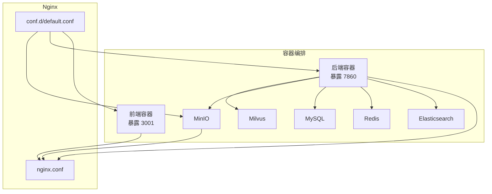
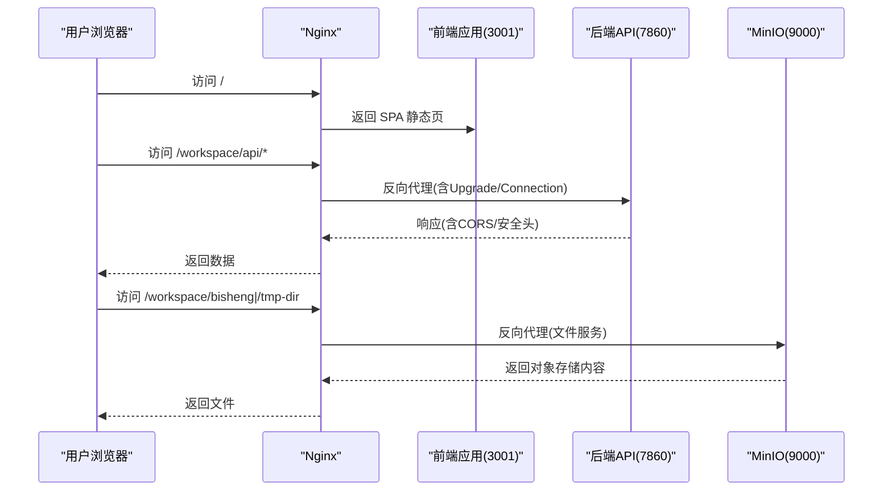
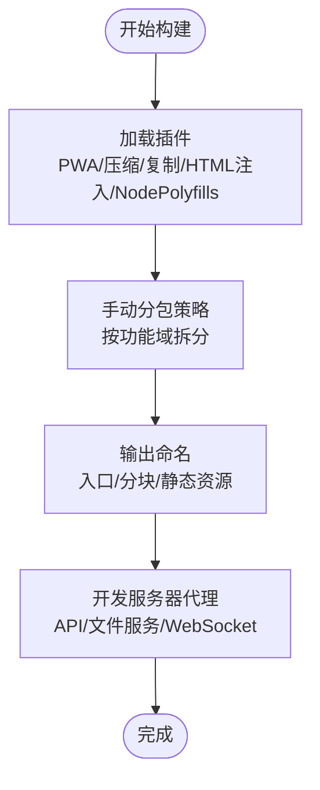
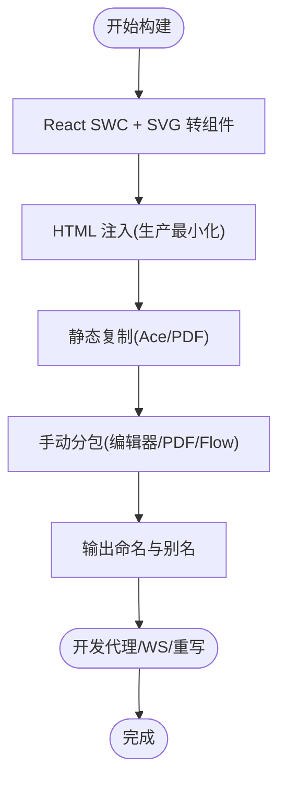
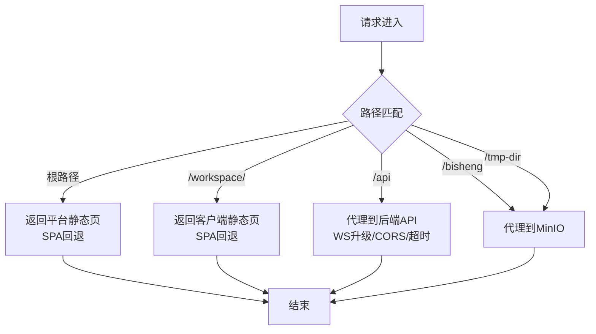
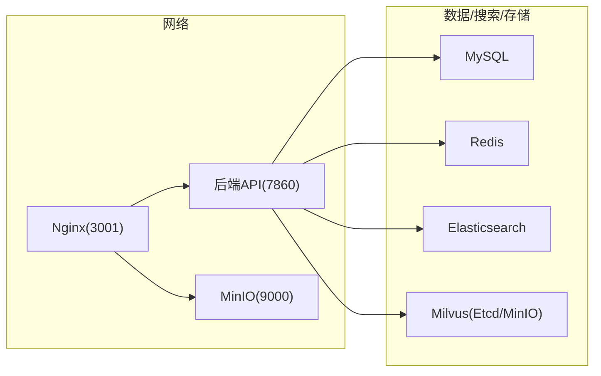
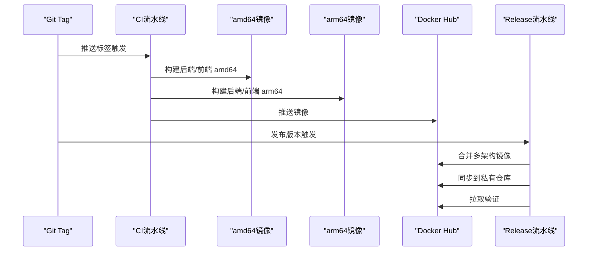
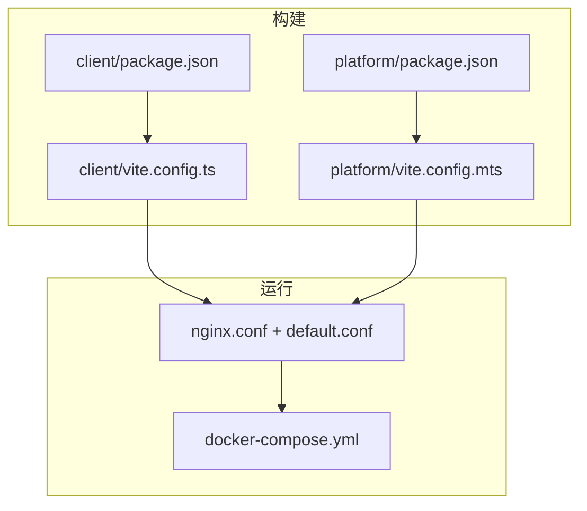

# 构建与部署

<cite>
**本文引用的文件**
- [src/frontend/client/vite.config.ts](file://src/frontend/client/vite.config.ts)
- [src/frontend/platform/vite.config.mts](file://src/frontend/platform/vite.config.mts)
- [src/frontend/client/package.json](file://src/frontend/client/package.json)
- [src/frontend/platform/package.json](file://src/frontend/platform/package.json)
- [src/frontend/client/tsconfig.json](file://src/frontend/client/tsconfig.json)
- [src/frontend/platform/tsconfig.json](file://src/frontend/platform/tsconfig.json)
- [src/frontend/client/tailwind.config.cjs](file://src/frontend/client/tailwind.config.cjs)
- [src/frontend/platform/tailwind.config.js](file://src/frontend/platform/tailwind.config.js)
- [docker/nginx/nginx.conf](file://docker/nginx/nginx.conf)
- [docker/nginx/conf.d/default.conf](file://docker/nginx/conf.d/default.conf)
- [docker/docker-compose.yml](file://docker/docker-compose.yml)
- [.github/workflows/ci.yml](file://.github/workflows/ci.yml)
- [.github/workflows/release.yml](file://.github/workflows/release.yml)
</cite>

## 目录
1. [简介](#简介)
2. [项目结构](#项目结构)
3. [核心组件](#核心组件)
4. [架构总览](#架构总览)
5. [详细组件分析](#详细组件分析)
6. [依赖关系分析](#依赖关系分析)
7. [性能考量](#性能考量)
8. [故障排除指南](#故障排除指南)
9. [结论](#结论)
10. [附录](#附录)

## 简介
本文件面向 Bisheng 前端（客户端与平台）的构建与部署，系统性梳理 Vite 构建配置优化、TypeScript 编译与 ESLint/Prettier 工具链、生产构建流程、Nginx 部署、Docker 容器化与多阶段构建、以及 CI/CD 流水线与发布策略。文档同时提供运维视角的最佳实践与排障建议，帮助读者在不同环境中稳定交付高质量前端产物。

## 项目结构
Bisheng 前端包含两个独立的 Vite 应用：
- 客户端应用（client）：面向终端用户，提供工作区与聊天界面等能力，使用 React 插件与 PWA、压缩、静态资源复制等插件。
- 平台应用（platform）：面向平台管理与可视化编辑场景，使用 React SWC 插件、SVG 转组件插件、HTML 注入与静态复制等。

两者均通过 Docker Compose 统一编排，由 Nginx 提供反向代理与静态资源服务，后端 API 与 MinIO 文件服务通过 Nginx 转发。

图表来源
- [docker/docker-compose.yml](file://docker/docker-compose.yml#L1-L201)
- [docker/nginx/nginx.conf](file://docker/nginx/nginx.conf#L1-L32)
- [docker/nginx/conf.d/default.conf](file://docker/nginx/conf.d/default.conf#L1-L65)

章节来源
- [docker/docker-compose.yml](file://docker/docker-compose.yml#L1-L201)
- [docker/nginx/nginx.conf](file://docker/nginx/nginx.conf#L1-L32)
- [docker/nginx/conf.d/default.conf](file://docker/nginx/conf.d/default.conf#L1-L65)

## 核心组件
- Vite 构建配置（客户端与平台）
  - 插件体系：React 插件、PWA、压缩、静态复制、HTML 注入、Node polyfills、SourceMap 排除等。
  - 代码分割：基于模块路径的手动分包策略，按功能域拆分 vendor、UI、编辑器、国际化、Markdown 处理等。
  - 资源命名：入口与分块文件带哈希，字体与静态资源分类输出。
  - 开发服务器：代理规则覆盖 API、文件服务、WebSocket，支持重写与日志。
- TypeScript 配置
  - 客户端：严格模式、声明生成、路径别名、包含/排除范围明确。
  - 平台：宽松严格度、路径别名、JSX 模式适配。
- Tailwind 配置
  - 客户端：深色模式、主题变量、动画与插件扩展。
  - 平台：内容扫描范围、深色模式、大量自定义颜色与工具类。
- Nginx 部署
  - gzip、缓存头控制、反向代理、WebSocket 升级、跨域与安全头。
- Docker 编排
  - 多服务健康检查、端口映射、卷挂载、后端依赖条件启动。
- CI/CD
  - 多架构镜像构建、镜像清单合并、私有仓库同步与拉取验证通知。

章节来源
- [src/frontend/client/vite.config.ts](file://src/frontend/client/vite.config.ts#L1-L330)
- [src/frontend/platform/vite.config.mts](file://src/frontend/platform/vite.config.mts#L1-L147)
- [src/frontend/client/package.json](file://src/frontend/client/package.json#L1-L157)
- [src/frontend/platform/package.json](file://src/frontend/platform/package.json#L1-L126)
- [src/frontend/client/tsconfig.json](file://src/frontend/client/tsconfig.json#L1-L40)
- [src/frontend/platform/tsconfig.json](file://src/frontend/platform/tsconfig.json#L1-L25)
- [src/frontend/client/tailwind.config.cjs](file://src/frontend/client/tailwind.config.cjs#L1-L141)
- [src/frontend/platform/tailwind.config.js](file://src/frontend/platform/tailwind.config.js#L1-L237)
- [docker/nginx/conf.d/default.conf](file://docker/nginx/conf.d/default.conf#L1-L65)
- [docker/docker-compose.yml](file://docker/docker-compose.yml#L1-L201)
- [.github/workflows/ci.yml](file://.github/workflows/ci.yml#L1-L188)
- [.github/workflows/release.yml](file://.github/workflows/release.yml#L1-L166)

## 架构总览
下图展示从浏览器到后端 API 与 MinIO 的请求路径，以及 Nginx 在其中的代理与缓存作用。

图表来源
- [docker/nginx/conf.d/default.conf](file://docker/nginx/conf.d/default.conf#L46-L64)
- [docker/docker-compose.yml](file://docker/docker-compose.yml#L41-L123)

章节来源
- [docker/nginx/conf.d/default.conf](file://docker/nginx/conf.d/default.conf#L1-L65)
- [docker/docker-compose.yml](file://docker/docker-compose.yml#L1-L201)

## 详细组件分析

### 客户端 Vite 构建配置（client）
- 插件与优化
  - PWA：注册类型与凭证、清单图标与缓存策略、导航回退白名单。
  - 压缩：阈值控制，减少小体积资源传输成本。
  - 静态复制：将 PDF Worker 等静态资源复制至构建目录。
  - SourceMap 排除：可选排除 node_modules 的 SourceMap 以减小体积。
  - HTML 注入：占位符替换与清理。
  - Node Polyfills：兼容性增强。
- 代码分割策略
  - 基于 node_modules 路径的精细分包：如 codemirror、markdown 处理、代码编辑器、国际化、日期工具、HTTP 客户端、虚拟化、表单、动画、高级输入等。
  - 语言包单独分包（locales），提升缓存命中率。
  - 通用 vendor 分包兜底。
- 输出与命名
  - 入口与分块文件带哈希；字体与静态资源按类型分类输出。
- 开发服务器
  - 代理 API、文件服务与 WebSocket，支持重写与请求日志。
  - 环境变量目录与前缀限制，便于区分脚本与域名相关变量。
- SourceMap 控制
  - 生产环境默认关闭，开发环境开启，避免泄露源码。

图表来源
- [src/frontend/client/vite.config.ts](file://src/frontend/client/vite.config.ts#L67-L151)
- [src/frontend/client/vite.config.ts](file://src/frontend/client/vite.config.ts#L157-L305)

章节来源
- [src/frontend/client/vite.config.ts](file://src/frontend/client/vite.config.ts#L1-L330)

### 平台 Vite 构建配置（platform）
- 插件与优化
  - React SWC：更快的编译速度。
  - SVG 转组件：提升 SVG 使用体验。
  - HTML 注入：在生产中最小化 HTML，注入动态脚本与基础路径。
  - 静态复制：复制 Ace Editor 与 PDF Worker 到构建目录。
- 代码分割策略
  - 针对 Ace Editor、PDF.js、React Flow、拖拽与窗口化等库进行分包。
- 开发服务器
  - 统一代理目标与重写逻辑，支持凭证与 WebSocket。
- 路径别名
  - 使用 @ 指向 src，提升导入一致性。

图表来源
- [src/frontend/platform/vite.config.mts](file://src/frontend/platform/vite.config.mts#L99-L134)
- [src/frontend/platform/vite.config.mts](file://src/frontend/platform/vite.config.mts#L65-L93)

章节来源
- [src/frontend/platform/vite.config.mts](file://src/frontend/platform/vite.config.mts#L1-L147)

### TypeScript 编译配置
- 客户端
  - 严格模式、声明生成、路径别名、包含/排除范围明确，便于 IDE 与类型检查。
- 平台
  - 放宽严格度但保留必要的类型检查，路径别名统一。

章节来源
- [src/frontend/client/tsconfig.json](file://src/frontend/client/tsconfig.json#L1-L40)
- [src/frontend/platform/tsconfig.json](file://src/frontend/platform/tsconfig.json#L1-L25)

### Tailwind 配置
- 客户端
  - 深色模式、主题变量、动画与 Radix UI 插件。
- 平台
  - 更丰富的颜色体系、工具类与插件集合，强调可定制性与可访问性。

章节来源
- [src/frontend/client/tailwind.config.cjs](file://src/frontend/client/tailwind.config.cjs#L1-L141)
- [src/frontend/platform/tailwind.config.js](file://src/frontend/platform/tailwind.config.js#L1-L237)

### Nginx 部署配置
- 基础
  - MIME 类型、日志格式、keepalive、gzip（可选）。
- 主站点
  - 根目录指向平台应用，SPA 回退到 index.html，禁止缓存 index.html。
  - 安全头：X-Frame-Options。
- 工作区
  - alias 指向客户端应用，SPA 回退到 /workspace/index.html，同样禁止缓存 index.html。
- API 代理
  - 重写去除 /workspace 前缀，转发到后端 API，升级 WebSocket，设置超时与请求头，允许大文件上传。
- 文件服务
  - 重写去除 /workspace 前缀，转发到 MinIO 对象存储。

图表来源
- [docker/nginx/conf.d/default.conf](file://docker/nginx/conf.d/default.conf#L21-L64)

章节来源
- [docker/nginx/nginx.conf](file://docker/nginx/nginx.conf#L1-L32)
- [docker/nginx/conf.d/default.conf](file://docker/nginx/conf.d/default.conf#L1-L65)

### Docker 容器化与编排
- 服务
  - MySQL、Redis、Elasticsearch、Etcd、MinIO、Milvus、后端 API 与 Worker、前端 Nginx。
- 健康检查
  - MySQL、Redis、Elasticsearch、Etcd、MinIO、Milvus、后端 API。
- 依赖关系
  - 后端 API 与 Worker 依赖数据库与缓存服务健康。
- 端口映射
  - 前端 Nginx 暴露 3001；后端 API 暴露 7860；MinIO 控制台 9001。
- 卷挂载
  - 配置文件、入口脚本、持久化数据目录。

图表来源
- [docker/docker-compose.yml](file://docker/docker-compose.yml#L1-L201)

章节来源
- [docker/docker-compose.yml](file://docker/docker-compose.yml#L1-L201)

### CI/CD 集成
- CI（多架构镜像构建）
  - 后端与前端分别构建 amd64 与 arm64 镜像并推送 Docker Hub。
  - 发布后通知飞书。
- Release（镜像合并与同步）
  - 合并多架构镜像为统一标签，同步到私有仓库，最后校验拉取。

图表来源
- [.github/workflows/ci.yml](file://.github/workflows/ci.yml#L16-L160)
- [.github/workflows/release.yml](file://.github/workflows/release.yml#L16-L101)

章节来源
- [.github/workflows/ci.yml](file://.github/workflows/ci.yml#L1-L188)
- [.github/workflows/release.yml](file://.github/workflows/release.yml#L1-L166)

## 依赖关系分析
- 构建期依赖
  - 客户端：React 插件、PWA、压缩、静态复制、Node polyfills、SourceMap 排除、HTML 注入。
  - 平台：React SWC、SVG 转组件、HTML 注入、静态复制。
- 运行期依赖
  - Nginx 作为统一入口，负责静态资源、代理与缓存头。
  - Docker Compose 统一编排，服务间健康检查与依赖顺序保证。

图表来源
- [src/frontend/client/vite.config.ts](file://src/frontend/client/vite.config.ts#L1-L330)
- [src/frontend/platform/vite.config.mts](file://src/frontend/platform/vite.config.mts#L1-L147)
- [src/frontend/client/package.json](file://src/frontend/client/package.json#L1-L157)
- [src/frontend/platform/package.json](file://src/frontend/platform/package.json#L1-L126)
- [docker/nginx/nginx.conf](file://docker/nginx/nginx.conf#L1-L32)
- [docker/nginx/conf.d/default.conf](file://docker/nginx/conf.d/default.conf#L1-L65)
- [docker/docker-compose.yml](file://docker/docker-compose.yml#L1-L201)

章节来源
- [src/frontend/client/vite.config.ts](file://src/frontend/client/vite.config.ts#L1-L330)
- [src/frontend/platform/vite.config.mts](file://src/frontend/platform/vite.config.mts#L1-L147)
- [src/frontend/client/package.json](file://src/frontend/client/package.json#L1-L157)
- [src/frontend/platform/package.json](file://src/frontend/platform/package.json#L1-L126)
- [docker/nginx/conf.d/default.conf](file://docker/nginx/conf.d/default.conf#L1-L65)
- [docker/docker-compose.yml](file://docker/docker-compose.yml#L1-L201)

## 性能考量
- 代码分割
  - 将大型第三方库按功能域拆分，提升缓存命中与首屏加载效率。
- 资源压缩
  - 启用压缩插件与 SourceMap 控制，平衡调试与传输体积。
- 静态资源复制
  - 将 PDF Worker 等外部资源复制到构建目录，避免运行时网络请求。
- Tailwind 按需
  - 内容扫描范围明确，避免无用样式打包。
- Nginx 缓存与安全
  - 禁用 index.html 缓存，确保更新即时生效；设置安全头与跨域头。
- Docker 健康检查
  - 服务健康检查降低不可用风险，保障整体可用性。

章节来源
- [src/frontend/client/vite.config.ts](file://src/frontend/client/vite.config.ts#L157-L305)
- [src/frontend/platform/vite.config.mts](file://src/frontend/platform/vite.config.mts#L65-L93)
- [docker/nginx/conf.d/default.conf](file://docker/nginx/conf.d/default.conf#L24-L59)
- [docker/docker-compose.yml](file://docker/docker-compose.yml#L15-L72)

## 故障排除指南
- 前端无法访问后端 API
  - 检查 Nginx 代理路径是否正确去除 /workspace 前缀。
  - 确认 Upgrade/Connection 请求头已设置，WebSocket 可用。
  - 查看代理超时与客户端最大上传大小配置。
- 客户端或平台静态资源 404
  - 确认 Nginx root/alias 指向正确目录。
  - 确保 SPA 回退到 index.html 的 try_files 配置生效。
- PWA 缓存导致更新不生效
  - 检查禁用缓存的 index.html 片段是否生效。
  - 确认 PWA 清单与缓存策略未缓存关键资源。
- Docker 服务启动失败
  - 查看对应服务健康检查日志与重启策略。
  - 确认卷挂载路径与权限正确。
- CI/CD 镜像拉取失败
  - 校验私有仓库凭据与镜像标签是否一致。
  - 使用 release 流程中的拉取验证步骤确认可用性。

章节来源
- [docker/nginx/conf.d/default.conf](file://docker/nginx/conf.d/default.conf#L46-L64)
- [docker/docker-compose.yml](file://docker/docker-compose.yml#L67-L72)
- [.github/workflows/release.yml](file://.github/workflows/release.yml#L103-L140)

## 结论
本文档从构建配置、工具链、部署与容器化、到 CI/CD 与运维排障，全面覆盖了 Bisheng 前端的交付路径。通过精细化的代码分割、资源压缩与缓存策略，结合 Nginx 的代理与安全头配置，以及 Docker 的健康检查与编排，能够实现稳定高效的前端交付与运行。建议在生产环境中持续关注缓存策略与镜像清单的同步，确保版本一致性与可追溯性。

## 附录
- 关键配置要点速览
  - 客户端：PWA、压缩、静态复制、SourceMap 排除、手动分包、开发代理。
  - 平台：SWC、SVG 转组件、HTML 注入、静态复制、手动分包、开发代理。
  - TypeScript：严格/宽松模式与路径别名。
  - Tailwind：内容扫描、深色模式、插件扩展。
  - Nginx：gzip、缓存头、代理、WS 升级、CORS。
  - Docker：健康检查、端口映射、卷挂载、依赖关系。
  - CI/CD：多架构镜像、清单合并、私有仓库同步与拉取验证。