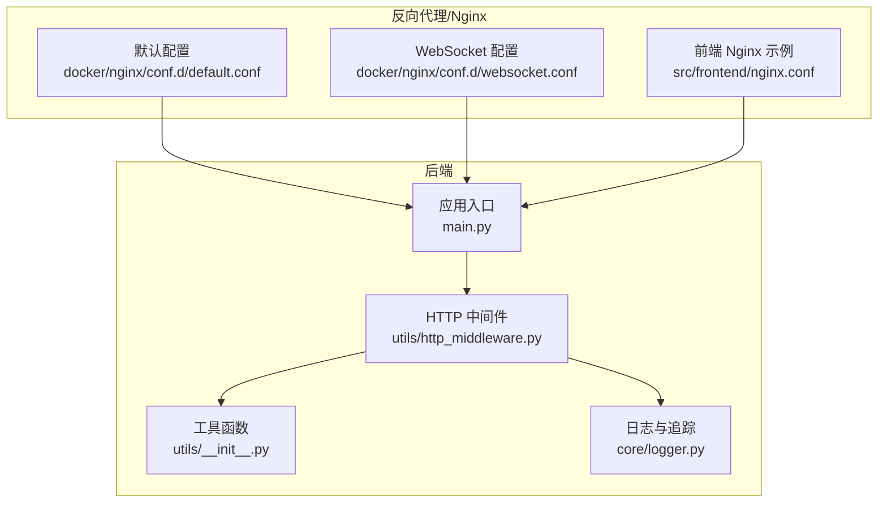
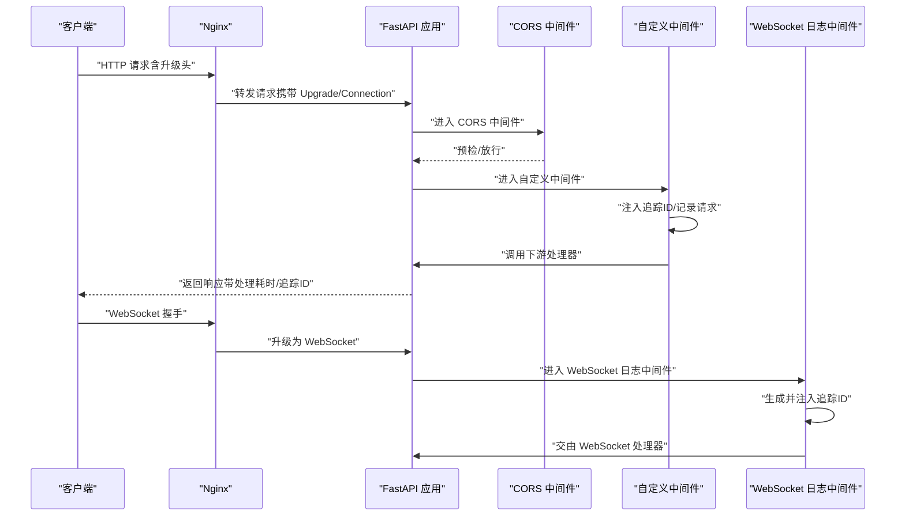
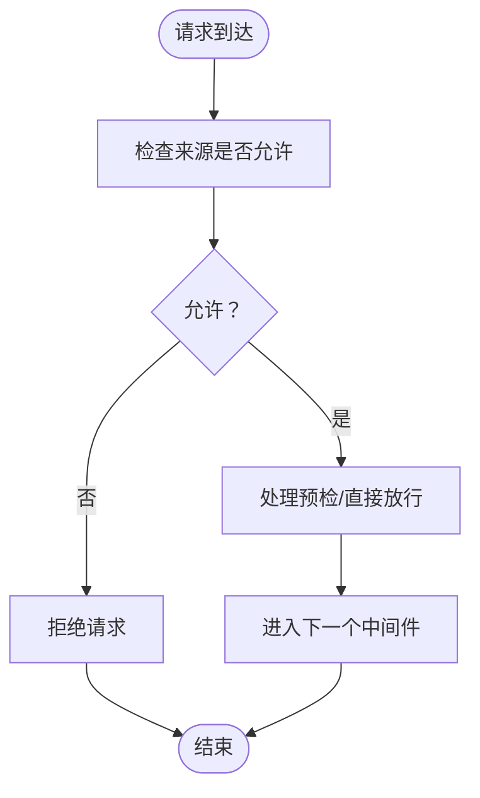
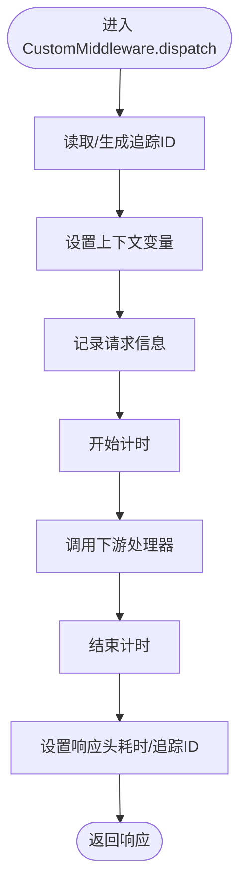
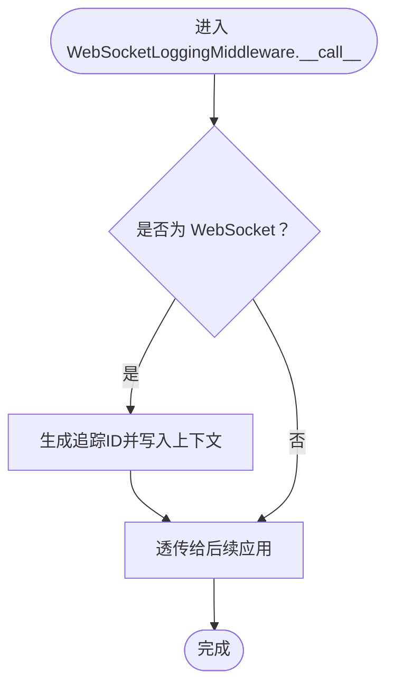
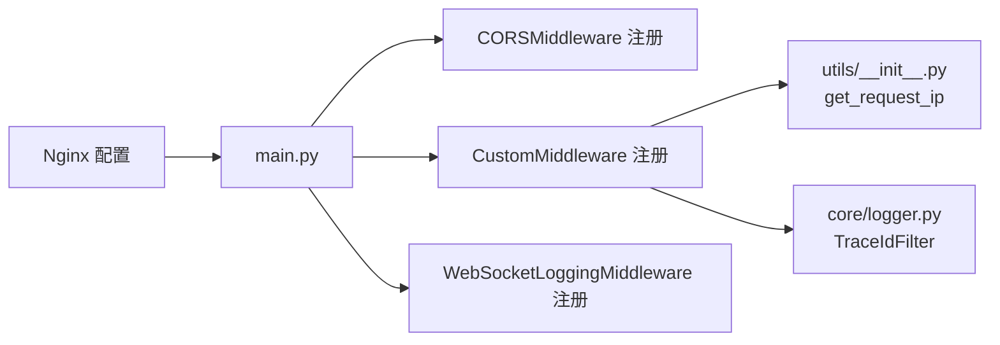

# 中间件系统

<cite>
**本文引用的文件**
- [src/backend/bisheng/utils/http_middleware.py](file://src/backend/bisheng/utils/http_middleware.py)
- [src/backend/bisheng/main.py](file://src/backend/bisheng/main.py)
- [src/backend/bisheng/utils/__init__.py](file://src/backend/bisheng/utils/__init__.py)
- [src/backend/bisheng/core/logger.py](file://src/backend/bisheng/core/logger.py)
- [docker/nginx/conf.d/default.conf](file://docker/nginx/conf.d/default.conf)
- [docker/nginx/conf.d/websocket.conf](file://docker/nginx/conf.d/websocket.conf)
- [src/frontend/nginx.conf](file://src/frontend/nginx.conf)
- [docker/bisheng/config/config.yaml](file://docker/bisheng/config/config.yaml)
</cite>

## 目录
1. [简介](#简介)
2. [项目结构](#项目结构)
3. [核心组件](#核心组件)
4. [架构总览](#架构总览)
5. [详细组件分析](#详细组件分析)
6. [依赖关系分析](#依赖关系分析)
7. [性能考量](#性能考量)
8. [故障排查指南](#故障排查指南)
9. [结论](#结论)
10. [附录：扩展与自定义示例](#附录扩展与自定义示例)

## 简介
本文件系统性梳理 Bisheng 后端中间件体系，重点覆盖以下方面：
- CORS 中间件：允许来源、凭证、方法、头部的配置与行为
- 自定义 HTTP 中间件：统一日志、请求耗时统计、追踪 ID 注入
- WebSocket 日志中间件：WebSocket 连接生命周期内的追踪 ID 注入
- 中间件执行顺序与优先级：CORS → 自定义中间件 → WebSocket 日志中间件
- 跨域请求处理、日志记录与请求验证的机制
- 性能优化与安全防护建议
- 扩展与自定义中间件的实践路径

## 项目结构
中间件相关代码集中在后端模块中，并通过 Nginx 配置实现 WebSocket 升级与跨域头注入。

**图表来源**
- [src/backend/bisheng/main.py](file://src/backend/bisheng/main.py#L64-L102)
- [src/backend/bisheng/utils/http_middleware.py](file://src/backend/bisheng/utils/http_middleware.py#L12-L46)
- [src/backend/bisheng/utils/__init__.py](file://src/backend/bisheng/utils/__init__.py#L22-L30)
- [src/backend/bisheng/core/logger.py](file://src/backend/bisheng/core/logger.py#L12-L28)
- [docker/nginx/conf.d/default.conf](file://docker/nginx/conf.d/default.conf#L46-L58)
- [docker/nginx/conf.d/websocket.conf](file://docker/nginx/conf.d/websocket.conf#L18-L28)
- [src/frontend/nginx.conf](file://src/frontend/nginx.conf#L34-L46)

**章节来源**
- [src/backend/bisheng/main.py](file://src/backend/bisheng/main.py#L64-L102)
- [src/backend/bisheng/utils/http_middleware.py](file://src/backend/bisheng/utils/http_middleware.py#L12-L46)
- [src/backend/bisheng/utils/__init__.py](file://src/backend/bisheng/utils/__init__.py#L22-L30)
- [src/backend/bisheng/core/logger.py](file://src/backend/bisheng/core/logger.py#L12-L28)
- [docker/nginx/conf.d/default.conf](file://docker/nginx/conf.d/default.conf#L46-L58)
- [docker/nginx/conf.d/websocket.conf](file://docker/nginx/conf.d/websocket.conf#L18-L28)
- [src/frontend/nginx.conf](file://src/frontend/nginx.conf#L34-L46)

## 核心组件
- CORS 中间件
  - 配置项：允许来源、凭证、方法、头部
  - 行为：在 FastAPI 中以 CORSMiddleware 形式注册，对所有路由生效
- 自定义 HTTP 中间件（CustomMiddleware）
  - 功能：注入追踪 ID、记录请求 IP 与路径、计算处理耗时、设置响应头
- WebSocket 日志中间件（WebSocketLoggingMiddleware）
  - 功能：在 WebSocket 连接建立时生成并注入追踪 ID

上述组件均在应用入口处按顺序注册，形成明确的执行链路。

**章节来源**
- [src/backend/bisheng/main.py](file://src/backend/bisheng/main.py#L81-L90)
- [src/backend/bisheng/utils/http_middleware.py](file://src/backend/bisheng/utils/http_middleware.py#L12-L46)

## 架构总览
下图展示从客户端到后端的请求流经中间件与反向代理的关键节点。

**图表来源**
- [src/backend/bisheng/main.py](file://src/backend/bisheng/main.py#L81-L90)
- [src/backend/bisheng/utils/http_middleware.py](file://src/backend/bisheng/utils/http_middleware.py#L12-L46)
- [docker/nginx/conf.d/default.conf](file://docker/nginx/conf.d/default.conf#L46-L58)
- [docker/nginx/conf.d/websocket.conf](file://docker/nginx/conf.d/websocket.conf#L18-L28)

## 详细组件分析

### CORS 中间件
- 注册位置：应用创建阶段
- 关键配置
  - 允许来源：通配符
  - 凭证：关闭
  - 方法：通配符
  - 头部：通配符
- 作用范围：全局路由
- 与 Nginx 的关系：Nginx 也可通过 add_header 注入 Access-Control-Allow-Origin 等头，但 CORS 中间件提供了更细粒度的控制与一致性

**图表来源**
- [src/backend/bisheng/main.py](file://src/backend/bisheng/main.py#L81-L87)

**章节来源**
- [src/backend/bisheng/main.py](file://src/backend/bisheng/main.py#L73-L87)

### 自定义 HTTP 中间件（CustomMiddleware）
- 执行时机：在 CORS 之后、业务路由之前
- 主要职责
  - 从请求头提取或生成追踪 ID，并写入上下文
  - 记录请求 IP、方法与路径
  - 统计处理耗时并写入响应头
  - 将追踪 ID 写入响应头，便于全链路追踪
- 依赖
  - 工具函数：获取真实 IP
  - 日志系统：基于 TraceIdFilter 的日志追踪

**图表来源**
- [src/backend/bisheng/utils/http_middleware.py](file://src/backend/bisheng/utils/http_middleware.py#L15-L33)
- [src/backend/bisheng/utils/__init__.py](file://src/backend/bisheng/utils/__init__.py#L22-L30)
- [src/backend/bisheng/core/logger.py](file://src/backend/bisheng/core/logger.py#L12-L28)

**章节来源**
- [src/backend/bisheng/utils/http_middleware.py](file://src/backend/bisheng/utils/http_middleware.py#L12-L33)
- [src/backend/bisheng/utils/__init__.py](file://src/backend/bisheng/utils/__init__.py#L22-L30)
- [src/backend/bisheng/core/logger.py](file://src/backend/bisheng/core/logger.py#L12-L28)

### WebSocket 日志中间件（WebSocketLoggingMiddleware）
- 执行时机：在 WebSocket 握手阶段
- 主要职责
  - 识别 WebSocket 类型的连接
  - 生成并注入追踪 ID，确保 WebSocket 生命周期内的可观测性
- 与 Nginx 的配合
  - Nginx 需正确传递 Upgrade/Connection 头，以便后端识别升级请求

**图表来源**
- [src/backend/bisheng/utils/http_middleware.py](file://src/backend/bisheng/utils/http_middleware.py#L42-L46)
- [docker/nginx/conf.d/websocket.conf](file://docker/nginx/conf.d/websocket.conf#L24-L26)

**章节来源**
- [src/backend/bisheng/utils/http_middleware.py](file://src/backend/bisheng/utils/http_middleware.py#L36-L46)
- [docker/nginx/conf.d/websocket.conf](file://docker/nginx/conf.d/websocket.conf#L18-L28)

### 中间件执行顺序与优先级
- 注册顺序即执行顺序
  1) CORS 中间件
  2) 自定义中间件（记录日志、注入追踪 ID、统计耗时）
  3) WebSocket 日志中间件（仅对 WebSocket 生效）
- 该顺序确保：
  - CORS 在最前处理跨域策略
  - 自定义中间件在业务处理前后统一埋点
  - WebSocket 连接在握手阶段即具备追踪能力

**章节来源**
- [src/backend/bisheng/main.py](file://src/backend/bisheng/main.py#L81-L90)

## 依赖关系分析
- 应用入口依赖中间件模块
- 中间件依赖工具函数与日志模块
- Nginx 配置依赖上游后端监听端口与协议

**图表来源**
- [src/backend/bisheng/main.py](file://src/backend/bisheng/main.py#L81-L90)
- [src/backend/bisheng/utils/http_middleware.py](file://src/backend/bisheng/utils/http_middleware.py#L12-L46)
- [src/backend/bisheng/utils/__init__.py](file://src/backend/bisheng/utils/__init__.py#L22-L30)
- [src/backend/bisheng/core/logger.py](file://src/backend/bisheng/core/logger.py#L12-L28)
- [docker/nginx/conf.d/default.conf](file://docker/nginx/conf.d/default.conf#L46-L58)

**章节来源**
- [src/backend/bisheng/main.py](file://src/backend/bisheng/main.py#L81-L90)
- [src/backend/bisheng/utils/http_middleware.py](file://src/backend/bisheng/utils/http_middleware.py#L12-L46)
- [src/backend/bisheng/utils/__init__.py](file://src/backend/bisheng/utils/__init__.py#L22-L30)
- [src/backend/bisheng/core/logger.py](file://src/backend/bisheng/core/logger.py#L12-L28)
- [docker/nginx/conf.d/default.conf](file://docker/nginx/conf.d/default.conf#L46-L58)

## 性能考量
- 自定义中间件
  - 响应头写入开销极低，几乎无性能损耗
  - 日志记录为异步/非阻塞模式，建议结合日志轮转与过滤减少 IO 压力
- CORS 中间件
  - 通配符配置简化了跨域策略，但可能带来安全风险；建议在生产环境收敛来源列表
- Nginx
  - 正确传递 Upgrade/Connection 头，避免不必要的握手失败与重试
  - 合理设置 proxy_read_timeout，避免长连接资源占用

[本节为通用指导，不直接分析具体文件]

## 故障排查指南
- WebSocket 握手失败
  - 检查 Nginx 是否正确转发 Upgrade/Connection 头
  - 确认后端 WebSocket 日志中间件已注册
- 缺少追踪 ID 或日志未显示
  - 确认自定义中间件已注册且日志配置包含 TraceIdFilter
  - 检查日志配置文件中的 sink、rotation、retention 等参数
- CORS 报错
  - 核对 allow_origins、allow_methods、allow_headers 设置
  - 若同时存在 Nginx 与后端 CORS，建议统一策略，避免冲突

**章节来源**
- [src/backend/bisheng/utils/http_middleware.py](file://src/backend/bisheng/utils/http_middleware.py#L36-L46)
- [src/backend/bisheng/core/logger.py](file://src/backend/bisheng/core/logger.py#L51-L94)
- [docker/bisheng/config/config.yaml](file://docker/bisheng/config/config.yaml#L62-L87)
- [docker/nginx/conf.d/websocket.conf](file://docker/nginx/conf.d/websocket.conf#L18-L28)

## 结论
Bisheng 的中间件体系以简洁清晰的注册顺序实现了跨域、日志与追踪的统一管理。通过在应用层与反向代理层协同，既保证了开发体验，也为生产环境的安全与可观测性提供了基础。建议在生产环境中收敛 CORS 来源列表、完善日志轮转与过滤策略，并持续评估中间件对性能的影响。

[本节为总结性内容，不直接分析具体文件]

## 附录：扩展与自定义示例
- 新增自定义中间件
  - 在 utils/http_middleware.py 中新增类，遵循 BaseHTTPMiddleware 接口
  - 在应用入口注册，注意与现有中间件的顺序关系
- 新增 WebSocket 处理逻辑
  - 在 WebSocket 日志中间件基础上扩展，或在业务层增加专用处理器
- 日志与追踪
  - 使用 TraceIdFilter 与日志配置文件实现统一追踪
  - 通过日志轮转与过滤降低存储压力

**章节来源**
- [src/backend/bisheng/utils/http_middleware.py](file://src/backend/bisheng/utils/http_middleware.py#L12-L46)
- [src/backend/bisheng/main.py](file://src/backend/bisheng/main.py#L81-L90)
- [src/backend/bisheng/core/logger.py](file://src/backend/bisheng/core/logger.py#L51-L94)
- [docker/bisheng/config/config.yaml](file://docker/bisheng/config/config.yaml#L62-L87)