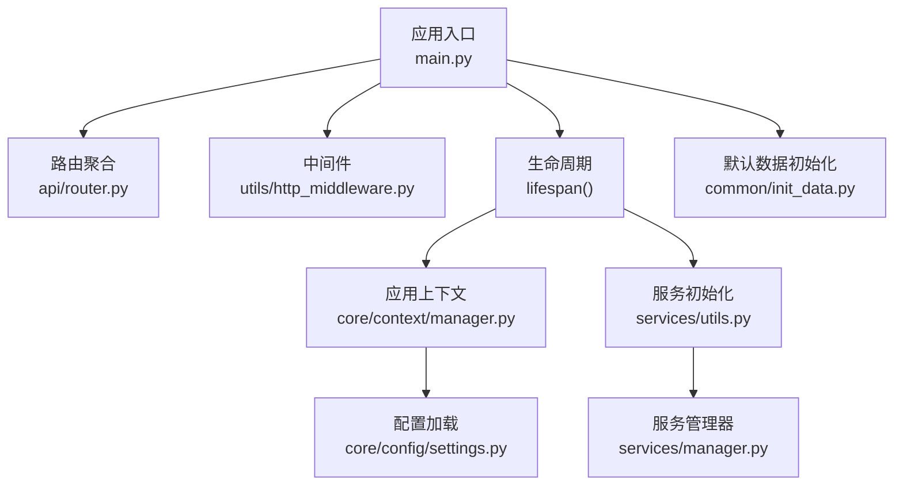
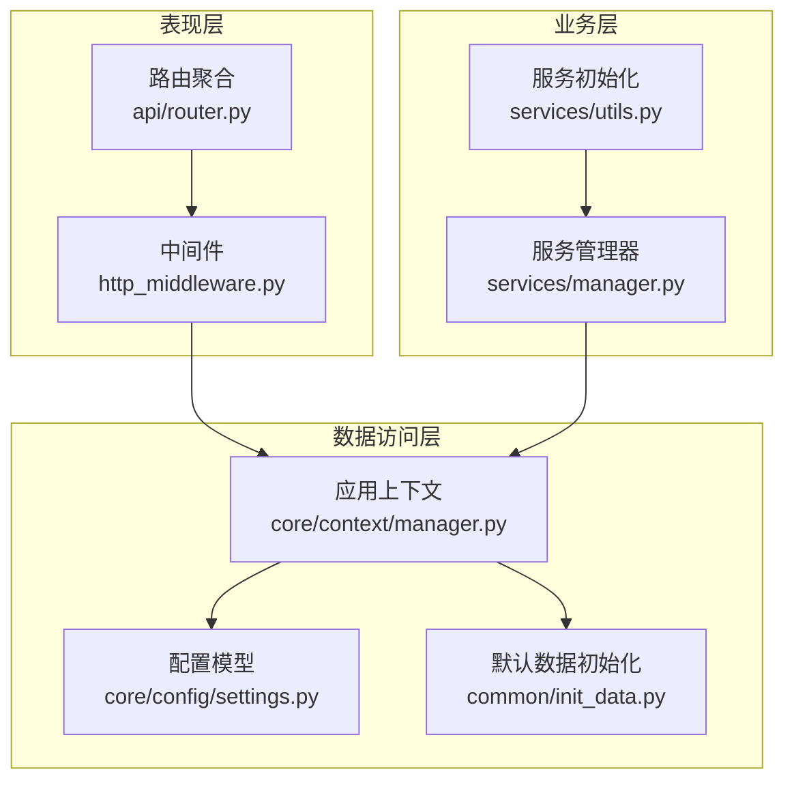
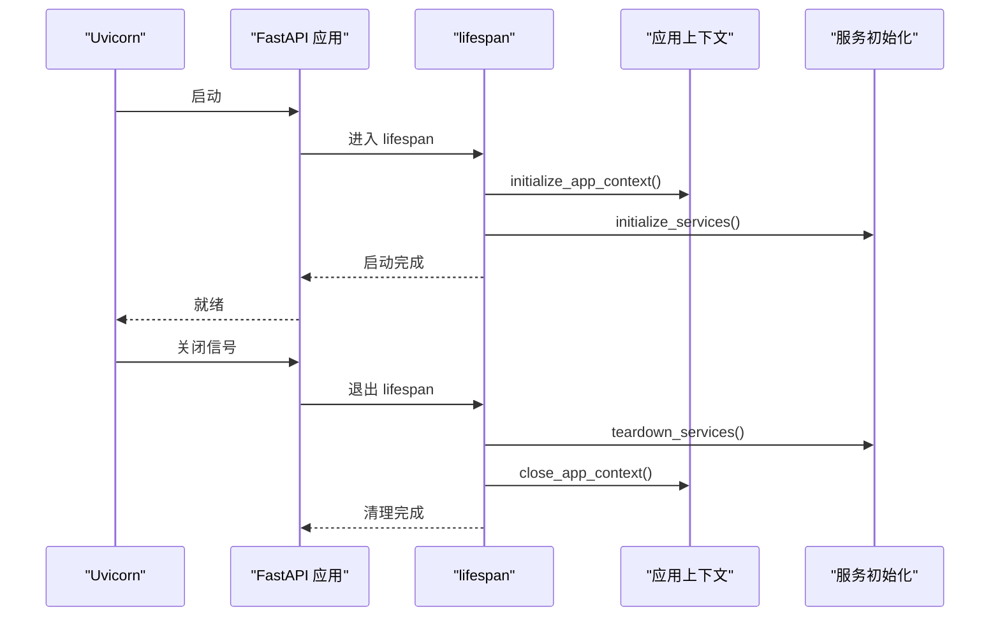
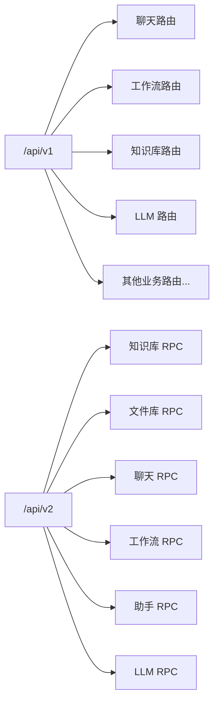
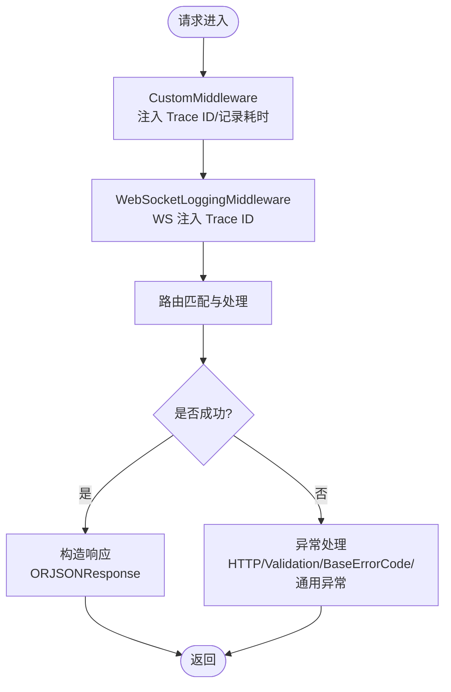
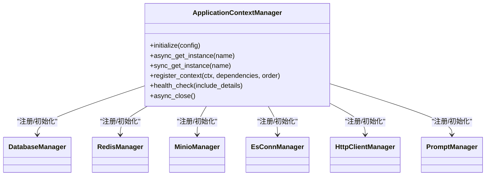
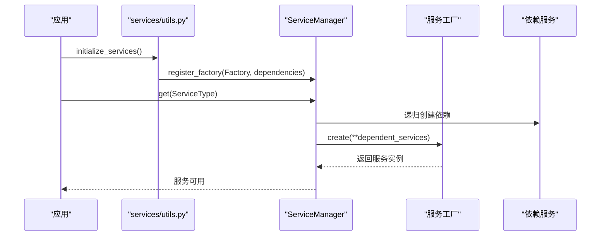
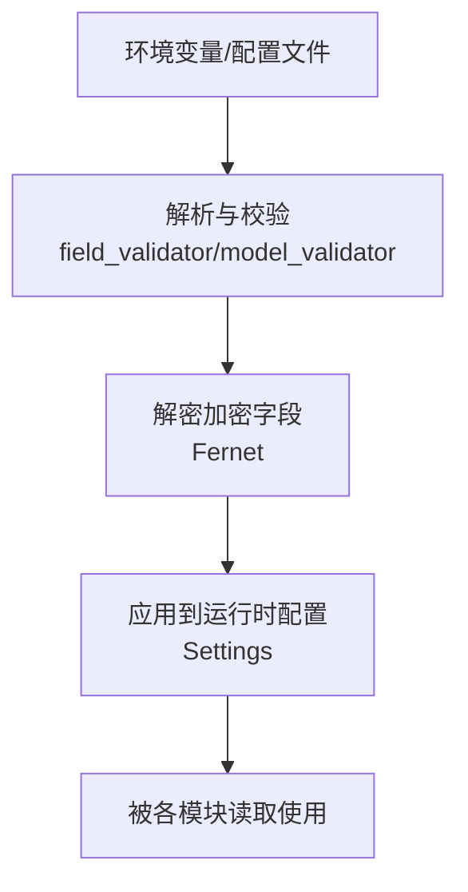
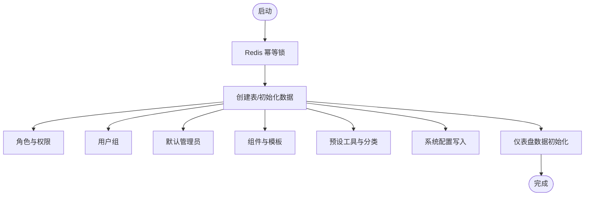
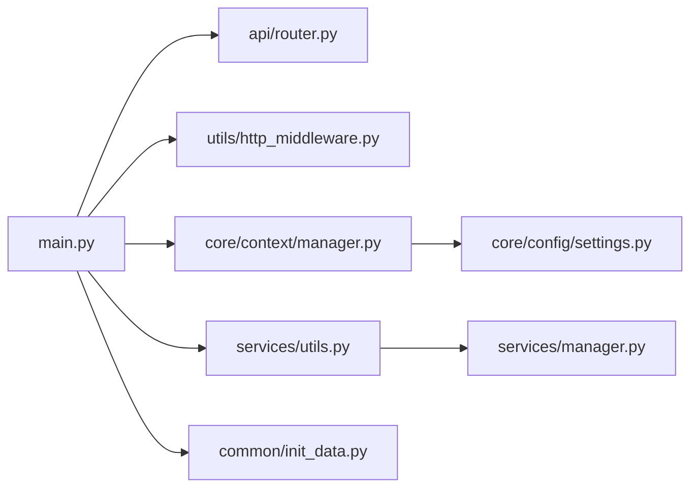

# 后端系统

<cite>
**本文引用的文件**
- [src/backend/bisheng/main.py](file://src/backend/bisheng/main.py)
- [src/backend/bisheng/server.py](file://src/backend/bisheng/server.py)
- [src/backend/bisheng/api/router.py](file://src/backend/bisheng/api/router.py)
- [src/backend/bisheng/core/config/settings.py](file://src/backend/bisheng/core/config/settings.py)
- [src/backend/bisheng/core/context/manager.py](file://src/backend/bisheng/core/context/manager.py)
- [src/backend/bisheng/services/utils.py](file://src/backend/bisheng/services/utils.py)
- [src/backend/bisheng/services/manager.py](file://src/backend/bisheng/services/manager.py)
- [src/backend/bisheng/utils/http_middleware.py](file://src/backend/bisheng/utils/http_middleware.py)
- [src/backend/bisheng/common/init_data.py](file://src/backend/bisheng/common/init_data.py)
- [src/backend/bisheng/api/v1/endpoints.py](file://src/backend/bisheng/api/v1/endpoints.py)
</cite>

## 目录
1. [引言](#引言)
2. [项目结构](#项目结构)
3. [核心组件](#核心组件)
4. [架构总览](#架构总览)
5. [详细组件分析](#详细组件分析)
6. [依赖分析](#依赖分析)
7. [性能考虑](#性能考虑)
8. [故障排查指南](#故障排查指南)
9. [结论](#结论)
10. [附录](#附录)

## 引言
本文件面向后端开发者与运维工程师，系统性梳理 Bisheng 后端（FastAPI 应用）的入口点、初始化流程、中间件与路由管理、生命周期管理，以及分层架构（表现层、业务层、数据访问层）与核心服务（工作流引擎、知识库管理、LLM 服务、聊天服务等）。文档同时覆盖配置管理、异常处理机制与性能优化策略，并通过图示与路径引用帮助读者快速定位实现细节。

## 项目结构
后端位于 src/backend/bisheng，采用“应用入口 + 路由聚合 + 核心上下文 + 服务管理 + 中间件 + 配置”的组织方式：
- 入口与生命周期：main.py 创建 FastAPI 应用，注册中间件、异常处理器与路由；通过 lifespan 管理应用上下文与服务的初始化与清理。
- 路由聚合：api/router.py 将各子模块路由统一挂载到 /api/v1 与 /api/v2 前缀下。
- 核心上下文：core/context/manager.py 提供全局应用上下文管理，负责数据库、缓存、对象存储、搜索引擎、HTTP 客户端、提示词管理等基础设施的注册与健康检查。
- 服务管理：services/manager.py 与 services/utils.py 提供服务工厂注册、依赖解析与生命周期管理。
- 中间件：utils/http_middleware.py 提供通用 HTTP 与 WebSocket 日志中间件。
- 配置：core/config/settings.py 定义系统配置模型与环境变量解析逻辑。
- 初始化：common/init_data.py 在启动时进行默认数据与表结构初始化。

图表来源
- [src/backend/bisheng/main.py](file://src/backend/bisheng/main.py#L64-L102)
- [src/backend/bisheng/api/router.py](file://src/backend/bisheng/api/router.py#L1-L61)
- [src/backend/bisheng/utils/http_middleware.py](file://src/backend/bisheng/utils/http_middleware.py#L12-L47)
- [src/backend/bisheng/core/context/manager.py](file://src/backend/bisheng/core/context/manager.py#L391-L451)
- [src/backend/bisheng/services/utils.py](file://src/backend/bisheng/services/utils.py#L182-L208)
- [src/backend/bisheng/services/manager.py](file://src/backend/bisheng/services/manager.py#L11-L97)
- [src/backend/bisheng/core/config/settings.py](file://src/backend/bisheng/core/config/settings.py#L210-L346)
- [src/backend/bisheng/common/init_data.py](file://src/backend/bisheng/common/init_data.py#L26-L151)

章节来源
- [src/backend/bisheng/main.py](file://src/backend/bisheng/main.py#L1-L113)
- [src/backend/bisheng/api/router.py](file://src/backend/bisheng/api/router.py#L1-L61)

## 核心组件
- 应用入口与生命周期
  - create_app：创建 FastAPI 实例，设置默认响应、异常处理器、CORS、自定义中间件与健康检查端点。
  - lifespan：在应用启动前初始化应用上下文、服务与默认数据，在关闭时释放资源。
- 路由管理
  - router：聚合 v1 子路由，覆盖聊天、工作流、知识库、LLM、工具、审计、报表等模块。
  - router_rpc：聚合 v2 开放接口路由，便于外部系统对接。
- 中间件
  - CustomMiddleware：注入 Trace ID、记录请求与耗时、透传 X-Process-Time 与 X-Trace-ID。
  - WebSocketLoggingMiddleware：为 WebSocket 连接注入 Trace ID。
- 配置管理
  - Settings：集中定义日志、密码策略、向量存储、对象存储、Celery 调度、Cookie/JWT、Elasticsearch、工作流限制等配置项，并支持从环境变量与加密字段解密。
- 应用上下文
  - ApplicationContextManager：注册数据库、Redis、MinIO、ES、HTTP 客户端、提示词管理等上下文，按依赖顺序初始化与关闭，支持批量获取与健康检查。
- 服务管理
  - ServiceManager：基于工厂模式注册服务及其依赖，按需创建与更新；提供统一 teardown。
  - initialize_services/teardown_services：注册任务与会话服务工厂，执行初始化与清理。
- 默认数据初始化
  - init_default_data：幂等初始化数据库表、角色权限、用户组、模板与预设工具，写入系统配置与仪表盘数据。

章节来源
- [src/backend/bisheng/main.py](file://src/backend/bisheng/main.py#L64-L102)
- [src/backend/bisheng/api/router.py](file://src/backend/bisheng/api/router.py#L1-L61)
- [src/backend/bisheng/utils/http_middleware.py](file://src/backend/bisheng/utils/http_middleware.py#L12-L47)
- [src/backend/bisheng/core/config/settings.py](file://src/backend/bisheng/core/config/settings.py#L210-L346)
- [src/backend/bisheng/core/context/manager.py](file://src/backend/bisheng/core/context/manager.py#L391-L451)
- [src/backend/bisheng/services/manager.py](file://src/backend/bisheng/services/manager.py#L11-L97)
- [src/backend/bisheng/services/utils.py](file://src/backend/bisheng/services/utils.py#L182-L208)
- [src/backend/bisheng/common/init_data.py](file://src/backend/bisheng/common/init_data.py#L26-L151)

## 架构总览
后端采用分层架构：
- 表现层（API 层）：FastAPI 路由与视图函数，负责请求接入、参数校验与响应封装。
- 业务层（服务层）：通过 ServiceManager 注册的服务工厂提供能力，如任务调度、会话管理、插件等。
- 数据访问层（基础设施层）：由 ApplicationContextManager 注册的上下文提供数据库、缓存、对象存储、搜索引擎、HTTP 客户端等。

图表来源
- [src/backend/bisheng/api/router.py](file://src/backend/bisheng/api/router.py#L1-L61)
- [src/backend/bisheng/utils/http_middleware.py](file://src/backend/bisheng/utils/http_middleware.py#L12-L47)
- [src/backend/bisheng/services/manager.py](file://src/backend/bisheng/services/manager.py#L11-L97)
- [src/backend/bisheng/services/utils.py](file://src/backend/bisheng/services/utils.py#L182-L208)
- [src/backend/bisheng/core/context/manager.py](file://src/backend/bisheng/core/context/manager.py#L391-L451)
- [src/backend/bisheng/core/config/settings.py](file://src/backend/bisheng/core/config/settings.py#L210-L346)
- [src/backend/bisheng/common/init_data.py](file://src/backend/bisheng/common/init_data.py#L26-L151)

## 详细组件分析

### 应用入口与生命周期（FastAPI）
- 入口函数 create_app
  - 设置默认响应为 ORJSONResponse，提升序列化性能。
  - 注册异常处理器：HTTPException、RequestValidationError、BaseErrorCode、通用异常。
  - 添加 CORS、自定义中间件与 WebSocket 日志中间件。
  - 挂载 router 与 router_rpc。
  - 可选开启 tracemalloc（调试模式）。
- 生命周期 lifespan
  - 启动：初始化应用上下文、服务、默认数据。
  - 关闭：释放服务、线程池与应用上下文。

图表来源
- [src/backend/bisheng/main.py](file://src/backend/bisheng/main.py#L52-L62)
- [src/backend/bisheng/main.py](file://src/backend/bisheng/main.py#L64-L102)
- [src/backend/bisheng/core/context/manager.py](file://src/backend/bisheng/core/context/manager.py#L391-L451)
- [src/backend/bisheng/services/utils.py](file://src/backend/bisheng/services/utils.py#L182-L208)

章节来源
- [src/backend/bisheng/main.py](file://src/backend/bisheng/main.py#L64-L102)

### 路由管理与版本化接口
- v1 路由聚合：包含聊天、工作流、知识库、LLM、技能中心、标签、审计、评估、报表、邀请码、工作站、工具、会话、分享链接、遥测搜索等。
- v2 路由聚合：开放接口（RPC），覆盖知识库、文件库、聊天、工作流、助手、LLM 等。

图表来源
- [src/backend/bisheng/api/router.py](file://src/backend/bisheng/api/router.py#L23-L61)

章节来源
- [src/backend/bisheng/api/router.py](file://src/backend/bisheng/api/router.py#L1-L61)

### 中间件与异常处理
- 自定义中间件
  - 注入/复用 Trace ID，记录请求与耗时，透传 X-Process-Time 与 X-Trace-ID。
- WebSocket 日志中间件
  - 为 WebSocket 会话注入 Trace ID，便于链路追踪。
- 异常处理
  - 统一返回结构：包含状态码、状态消息与可选数据；对 BaseErrorCode 输出结构化错误信息；未捕获异常记录日志并返回 500。

图表来源
- [src/backend/bisheng/utils/http_middleware.py](file://src/backend/bisheng/utils/http_middleware.py#L12-L47)
- [src/backend/bisheng/main.py](file://src/backend/bisheng/main.py#L21-L49)

章节来源
- [src/backend/bisheng/utils/http_middleware.py](file://src/backend/bisheng/utils/http_middleware.py#L12-L47)
- [src/backend/bisheng/main.py](file://src/backend/bisheng/main.py#L21-L49)

### 应用上下文与基础设施
- 上下文注册
  - 数据库管理器、Redis 管理器、MinIO 管理器、Elasticsearch 连接管理器、HTTP 客户端管理器、提示词管理器。
- 初始化顺序与依赖
  - 支持显式初始化顺序与依赖解析，保证关闭时逆序释放。
- 批量获取与健康检查
  - 提供同步/异步上下文管理器，支持批量获取与健康检查（含详细状态）。

图表来源
- [src/backend/bisheng/core/context/manager.py](file://src/backend/bisheng/core/context/manager.py#L391-L451)

章节来源
- [src/backend/bisheng/core/context/manager.py](file://src/backend/bisheng/core/context/manager.py#L391-L451)

### 服务管理与工厂模式
- 工厂注册
  - 通过 initialize_services 注册任务与会话服务工厂，声明依赖关系。
- 服务创建与更新
  - ServiceManager 按依赖顺序创建服务实例；支持更新与统一 teardown。
- 生命周期
  - 在 lifespan 中初始化，在关闭时统一释放。

图表来源
- [src/backend/bisheng/services/utils.py](file://src/backend/bisheng/services/utils.py#L182-L208)
- [src/backend/bisheng/services/manager.py](file://src/backend/bisheng/services/manager.py#L11-L97)

章节来源
- [src/backend/bisheng/services/utils.py](file://src/backend/bisheng/services/utils.py#L182-L208)
- [src/backend/bisheng/services/manager.py](file://src/backend/bisheng/services/manager.py#L11-L97)

### 配置管理系统
- 配置模型
  - 包括日志、密码策略、向量存储（Milvus/Elasticsearch）、对象存储（MinIO）、工作流限制、Celery 调度、Cookie/JWT、遥测 ES 等。
- 环境变量与加密字段
  - 支持从环境变量读取数据库/Redis URL，并对加密字段进行解密。
- 动态配置
  - 提供获取特定配置的方法（如 MinIO、ES、遥测 ES）。

图表来源
- [src/backend/bisheng/core/config/settings.py](file://src/backend/bisheng/core/config/settings.py#L262-L346)

章节来源
- [src/backend/bisheng/core/config/settings.py](file://src/backend/bisheng/core/config/settings.py#L210-L346)

### 默认数据初始化
- 幂等初始化
  - 使用 Redis 键避免重复初始化；创建数据库表、角色与权限、用户组、默认用户、组件与模板、预设工具与分类。
- 系统配置与仪表盘
  - 写入系统配置键值，初始化遥测仪表盘数据集。

图表来源
- [src/backend/bisheng/common/init_data.py](file://src/backend/bisheng/common/init_data.py#L26-L151)

章节来源
- [src/backend/bisheng/common/init_data.py](file://src/backend/bisheng/common/init_data.py#L26-L151)

### 核心服务组件（概念性说明）
- 工作流引擎
  - 通过 /api/v1/process 与 /api/v1/process/{flow_id} 接口接入，支持同步/异步与 SSE 流式输出；内部调用任务服务与图执行缓存。
- 知识库管理
  - 通过 /api/v1/knowledge 与 /api/v2/knowledge_rpc 提供知识入库、检索与评估能力。
- LLM 服务
  - 通过 /api/v1/llm 与 /api/v2/llm_rpc 提供模型调用与推理能力。
- 聊天服务
  - 通过 /api/v1/chat 与 /api/v2/chat_rpc 提供对话与会话管理。
- 会话与审计
  - 通过 /api/v1/session 与 /api/v1/audit 提供会话与操作审计能力。

章节来源
- [src/backend/bisheng/api/router.py](file://src/backend/bisheng/api/router.py#L1-L61)
- [src/backend/bisheng/api/v1/endpoints.py](file://src/backend/bisheng/api/v1/endpoints.py#L157-L200)

## 依赖分析
- 组件耦合
  - main.py 依赖路由聚合、中间件、上下文与服务工具；路由聚合依赖各业务模块；上下文依赖配置模型与外部服务；服务管理器依赖工厂与依赖声明。
- 外部依赖
  - FastAPI、loguru、celery、redis、minio、elasticsearch、gunicorn（WSGI）、uvicorn（ASGI）等。
- 循环依赖
  - 当前结构通过模块导入与延迟初始化避免循环依赖；服务工厂与上下文注册采用惰性加载。

图表来源
- [src/backend/bisheng/main.py](file://src/backend/bisheng/main.py#L9-L18)
- [src/backend/bisheng/api/router.py](file://src/backend/bisheng/api/router.py#L1-L22)
- [src/backend/bisheng/utils/http_middleware.py](file://src/backend/bisheng/utils/http_middleware.py#L12-L47)
- [src/backend/bisheng/core/context/manager.py](file://src/backend/bisheng/core/context/manager.py#L391-L451)
- [src/backend/bisheng/services/utils.py](file://src/backend/bisheng/services/utils.py#L182-L208)
- [src/backend/bisheng/services/manager.py](file://src/backend/bisheng/services/manager.py#L11-L97)
- [src/backend/bisheng/core/config/settings.py](file://src/backend/bisheng/core/config/settings.py#L210-L346)
- [src/backend/bisheng/common/init_data.py](file://src/backend/bisheng/common/init_data.py#L26-L151)

章节来源
- [src/backend/bisheng/main.py](file://src/backend/bisheng/main.py#L9-L18)
- [src/backend/bisheng/services/manager.py](file://src/backend/bisheng/services/manager.py#L11-L97)

## 性能考虑
- 响应序列化
  - 使用 ORJSONResponse 提升 JSON 序列化/反序列化性能。
- 中间件开销
  - CustomMiddleware 记录请求与耗时，建议在生产中结合采样与日志级别控制。
- 异步与并发
  - 应用上下文与服务均支持异步获取实例，适合高并发场景。
- 资源释放
  - 生命周期中统一释放服务、线程池与上下文，避免资源泄漏。
- 调试与分析
  - 调试模式下可启用 tracemalloc，用于内存快照分析。

章节来源
- [src/backend/bisheng/main.py](file://src/backend/bisheng/main.py#L67-L71)
- [src/backend/bisheng/utils/http_middleware.py](file://src/backend/bisheng/utils/http_middleware.py#L26-L33)
- [src/backend/bisheng/core/context/manager.py](file://src/backend/bisheng/core/context/manager.py#L227-L264)

## 故障排查指南
- 常见异常与处理
  - HTTPException：统一包装为标准响应结构，包含状态码与状态消息。
  - RequestValidationError：返回 422 并包含错误详情。
  - BaseErrorCode：输出结构化错误数据，便于前端展示。
  - 未捕获异常：记录异常堆栈并返回 500。
- 中间件与追踪
  - 检查 X-Trace-ID 是否正确透传，确认 CustomMiddleware 与 WebSocketLoggingMiddleware 生效。
- 配置问题
  - 数据库/Redis URL 解析失败或加密字段解密异常，检查环境变量与密钥。
- 初始化失败
  - 默认数据初始化幂等锁冲突或数据库迁移异常，查看 Redis 键与日志。

章节来源
- [src/backend/bisheng/main.py](file://src/backend/bisheng/main.py#L21-L49)
- [src/backend/bisheng/utils/http_middleware.py](file://src/backend/bisheng/utils/http_middleware.py#L12-L47)
- [src/backend/bisheng/core/config/settings.py](file://src/backend/bisheng/core/config/settings.py#L262-L346)
- [src/backend/bisheng/common/init_data.py](file://src/backend/bisheng/common/init_data.py#L143-L149)

## 结论
Bisheng 后端以 FastAPI 为核心，通过清晰的生命周期管理、模块化的路由聚合、可扩展的服务工厂与强大的应用上下文，实现了表现层、业务层与数据访问层的职责分离。配合完善的配置管理、中间件与异常处理机制，系统具备良好的可维护性与可扩展性。开发者可基于现有框架快速新增服务与路由，同时遵循既定的初始化与清理流程，确保系统稳定运行。

## 附录
- 启动与部署
  - 本地开发：直接运行 main.py（uvicorn）。
  - 生产部署：使用 Gunicorn 包装 FastAPI 应用（BishengApplication）。
- 关键实现路径参考
  - 应用入口与生命周期：[src/backend/bisheng/main.py](file://src/backend/bisheng/main.py#L64-L102)
  - 路由聚合：[src/backend/bisheng/api/router.py](file://src/backend/bisheng/api/router.py#L1-L61)
  - 中间件：[src/backend/bisheng/utils/http_middleware.py](file://src/backend/bisheng/utils/http_middleware.py#L12-L47)
  - 配置模型：[src/backend/bisheng/core/config/settings.py](file://src/backend/bisheng/core/config/settings.py#L210-L346)
  - 应用上下文：[src/backend/bisheng/core/context/manager.py](file://src/backend/bisheng/core/context/manager.py#L391-L451)
  - 服务管理：[src/backend/bisheng/services/manager.py](file://src/backend/bisheng/services/manager.py#L11-L97)
  - 服务初始化：[src/backend/bisheng/services/utils.py](file://src/backend/bisheng/services/utils.py#L182-L208)
  - 默认数据初始化：[src/backend/bisheng/common/init_data.py](file://src/backend/bisheng/common/init_data.py#L26-L151)
  - 基础接口示例（工作流处理）：[src/backend/bisheng/api/v1/endpoints.py](file://src/backend/bisheng/api/v1/endpoints.py#L157-L200)