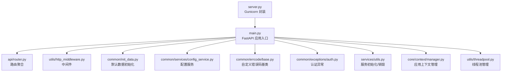
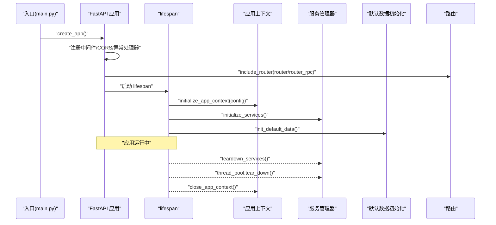
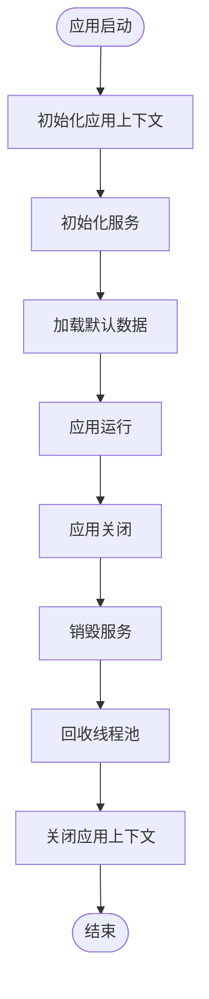
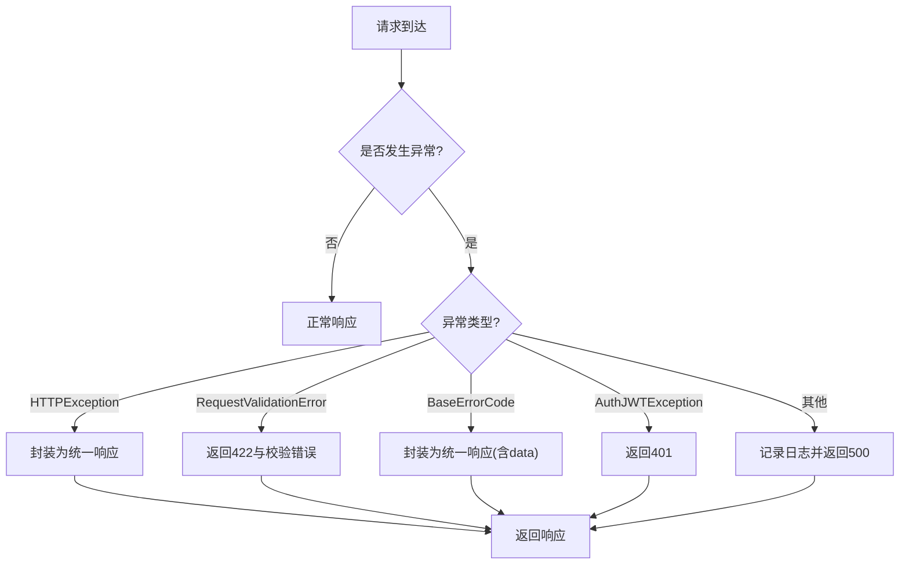
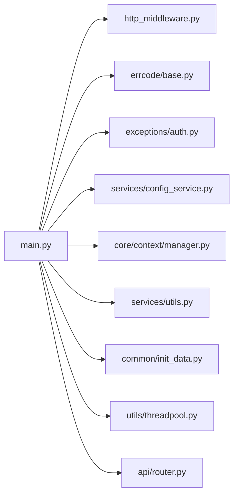

# 应用入口与初始化

<cite>
**本文引用的文件**
- [src/backend/bisheng/main.py](file://src/backend/bisheng/main.py)
- [src/backend/bisheng/server.py](file://src/backend/bisheng/server.py)
- [src/backend/bisheng/api/router.py](file://src/backend/bisheng/api/router.py)
- [src/backend/bisheng/utils/http_middleware.py](file://src/backend/bisheng/utils/http_middleware.py)
- [src/backend/bisheng/common/init_data.py](file://src/backend/bisheng/common/init_data.py)
- [src/backend/bisheng/common/services/config_service.py](file://src/backend/bisheng/common/services/config_service.py)
- [src/backend/bisheng/common/errcode/base.py](file://src/backend/bisheng/common/errcode/base.py)
- [src/backend/bisheng/common/exceptions/auth.py](file://src/backend/bisheng/common/exceptions/auth.py)
- [src/backend/bisheng/services/utils.py](file://src/backend/bisheng/services/utils.py)
- [src/backend/bisheng/core/context/manager.py](file://src/backend/bisheng/core/context/manager.py)
- [src/backend/bisheng/utils/threadpool.py](file://src/backend/bisheng/utils/threadpool.py)
</cite>

## 目录
1. [简介](#简介)
2. [项目结构](#项目结构)
3. [核心组件](#核心组件)
4. [架构总览](#架构总览)
5. [组件详解](#组件详解)
6. [依赖关系分析](#依赖关系分析)
7. [性能考量](#性能考量)
8. [故障排查指南](#故障排查指南)
9. [结论](#结论)
10. [附录：启动流程与配置示例](#附录启动流程与配置示例)

## 简介
本文件面向 Bisheng 后端应用的“入口与初始化”体系，系统性阐述 FastAPI 应用的创建、中间件与异常处理配置、生命周期（lifespan）管理、健康检查端点、CORS 设置，以及初始化阶段的关键步骤（应用上下文、服务、默认数据）。同时给出异常处理策略（HTTP 异常、校验异常、自定义错误码）与扩展指引，帮助开发者在不破坏现有生命周期的前提下安全地扩展初始化逻辑。

## 项目结构
后端入口位于 Python 包 bisheng 下，核心文件包括：
- 应用入口与初始化：main.py
- WSGI/Gunicorn 封装：server.py
- 路由聚合：api/router.py
- 中间件：utils/http_middleware.py
- 初始化默认数据：common/init_data.py
- 配置服务与设置：common/services/config_service.py
- 自定义错误码基类：common/errcode/base.py
- 认证相关异常：common/exceptions/auth.py
- 服务注册与销毁：services/utils.py
- 应用上下文管理：core/context/manager.py
- 线程池管理：utils/threadpool.py

图表来源
- [src/backend/bisheng/main.py](file://src/backend/bisheng/main.py#L64-L102)
- [src/backend/bisheng/api/router.py](file://src/backend/bisheng/api/router.py#L1-L61)
- [src/backend/bisheng/utils/http_middleware.py](file://src/backend/bisheng/utils/http_middleware.py#L1-L47)
- [src/backend/bisheng/common/init_data.py](file://src/backend/bisheng/common/init_data.py#L26-L151)
- [src/backend/bisheng/common/services/config_service.py](file://src/backend/bisheng/common/services/config_service.py#L58-L236)
- [src/backend/bisheng/common/errcode/base.py](file://src/backend/bisheng/common/errcode/base.py#L9-L97)
- [src/backend/bisheng/common/exceptions/auth.py](file://src/backend/bisheng/common/exceptions/auth.py#L1-L16)
- [src/backend/bisheng/services/utils.py](file://src/backend/bisheng/services/utils.py#L182-L207)
- [src/backend/bisheng/core/context/manager.py](file://src/backend/bisheng/core/context/manager.py#L391-L450)
- [src/backend/bisheng/utils/threadpool.py](file://src/backend/bisheng/utils/threadpool.py#L12-L112)
- [src/backend/bisheng/server.py](file://src/backend/bisheng/server.py#L4-L21)

章节来源
- [src/backend/bisheng/main.py](file://src/backend/bisheng/main.py#L64-L102)
- [src/backend/bisheng/api/router.py](file://src/backend/bisheng/api/router.py#L1-L61)

## 核心组件
- FastAPI 应用工厂：负责实例化应用、注册中间件、异常处理器、健康检查端点、路由与调试开关。
- 生命周期（lifespan）：统一管理应用上下文初始化、服务初始化、默认数据加载、清理与关闭。
- 中间件体系：HTTP 请求日志与追踪、WebSocket 日志、CORS 放通。
- 异常处理：HTTP 异常、请求校验异常、自定义错误码、认证 JWT 异常。
- 配置服务：从 YAML 加载设置、合并旧配置、读取数据库配置缓存。
- 默认数据初始化：数据库表与基础数据、模板、工具、用户组、角色权限等。
- 服务管理：服务工厂注册、运行时获取、退出时销毁。
- 应用上下文：全局上下文注册、依赖注入、生命周期管理。
- 线程池：同步/异步任务提交、取消与回收。

章节来源
- [src/backend/bisheng/main.py](file://src/backend/bisheng/main.py#L52-L102)
- [src/backend/bisheng/utils/http_middleware.py](file://src/backend/bisheng/utils/http_middleware.py#L12-L47)
- [src/backend/bisheng/common/errcode/base.py](file://src/backend/bisheng/common/errcode/base.py#L9-L97)
- [src/backend/bisheng/common/services/config_service.py](file://src/backend/bisheng/common/services/config_service.py#L58-L236)
- [src/backend/bisheng/common/init_data.py](file://src/backend/bisheng/common/init_data.py#L26-L151)
- [src/backend/bisheng/services/utils.py](file://src/backend/bisheng/services/utils.py#L182-L207)
- [src/backend/bisheng/core/context/manager.py](file://src/backend/bisheng/core/context/manager.py#L391-L450)
- [src/backend/bisheng/utils/threadpool.py](file://src/backend/bisheng/utils/threadpool.py#L12-L112)

## 架构总览
下图展示了应用启动时序：入口函数创建应用、注册中间件与异常处理器、挂载路由；lifespan 在应用启动前完成上下文与服务初始化，在应用关闭时执行清理。

图表来源
- [src/backend/bisheng/main.py](file://src/backend/bisheng/main.py#L52-L102)
- [src/backend/bisheng/core/context/manager.py](file://src/backend/bisheng/core/context/manager.py#L391-L450)
- [src/backend/bisheng/services/utils.py](file://src/backend/bisheng/services/utils.py#L182-L207)
- [src/backend/bisheng/common/init_data.py](file://src/backend/bisheng/common/init_data.py#L26-L151)

## 组件详解

### FastAPI 应用创建与配置
- 应用实例化：使用 FastAPI 构造函数，设置默认响应为 ORJSON、绑定全局异常处理器映射、注册 lifespan。
- 健康检查端点：根路径提供简单健康状态返回。
- CORS 配置：允许任意源、方法与头，便于前端跨域访问。
- 中间件链路：自定义 HTTP 日志与追踪中间件、WebSocket 日志中间件。
- 认证异常处理：针对特定认证异常返回标准 401 响应。
- 调试模式：当配置开启时启用内存跟踪。

章节来源
- [src/backend/bisheng/main.py](file://src/backend/bisheng/main.py#L64-L102)

### 生命周期（lifespan）管理
- 启动阶段：初始化应用上下文、注册并启动各类服务、加载默认数据；随后进入应用运行态。
- 关闭阶段：销毁服务、回收线程池、关闭应用上下文。

图表来源
- [src/backend/bisheng/main.py](file://src/backend/bisheng/main.py#L52-L61)
- [src/backend/bisheng/core/context/manager.py](file://src/backend/bisheng/core/context/manager.py#L391-L450)
- [src/backend/bisheng/services/utils.py](file://src/backend/bisheng/services/utils.py#L182-L207)
- [src/backend/bisheng/common/init_data.py](file://src/backend/bisheng/common/init_data.py#L26-L151)
- [src/backend/bisheng/utils/threadpool.py](file://src/backend/bisheng/utils/threadpool.py#L105-L112)

章节来源
- [src/backend/bisheng/main.py](file://src/backend/bisheng/main.py#L52-L61)

### 中间件与 CORS
- 自定义 HTTP 中间件：注入追踪 ID、记录请求与耗时、附加响应头。
- WebSocket 日志中间件：为 WebSocket 连接生成追踪 ID 并透传。
- CORS：允许所有源、方法与头，便于开发与跨域场景。

章节来源
- [src/backend/bisheng/utils/http_middleware.py](file://src/backend/bisheng/utils/http_middleware.py#L12-L47)
- [src/backend/bisheng/main.py](file://src/backend/bisheng/main.py#L81-L87)

### 异常处理机制
- 全局异常映射：HTTPException、RequestValidationError、BaseErrorCode、通用 Exception。
- HTTP 异常与自定义错误码：统一包装为包含状态码与消息的响应体。
- 校验异常：返回 422 与错误详情数组。
- 认证 JWT 异常：捕获特定异常类型，返回 401 与错误信息。
- 未处理异常：记录异常日志并返回 500。

图表来源
- [src/backend/bisheng/main.py](file://src/backend/bisheng/main.py#L21-L49)
- [src/backend/bisheng/common/errcode/base.py](file://src/backend/bisheng/common/errcode/base.py#L9-L97)
- [src/backend/bisheng/common/exceptions/auth.py](file://src/backend/bisheng/common/exceptions/auth.py#L1-L16)

章节来源
- [src/backend/bisheng/main.py](file://src/backend/bisheng/main.py#L21-L49)

### 健康检查端点
- 路径：GET /health
- 返回：包含状态字段的简单对象，用于容器编排或负载均衡探活。

章节来源
- [src/backend/bisheng/main.py](file://src/backend/bisheng/main.py#L77-L79)

### 配置服务与设置
- 配置来源：YAML 文件（支持环境变量占位符）、默认节点配置、数据库持久化配置。
- 功能：加载设置、合并旧配置、读取知识库/工作流/登录方式等分项配置。
- 缓存：Redis 缓存配置以降低数据库压力。

章节来源
- [src/backend/bisheng/common/services/config_service.py](file://src/backend/bisheng/common/services/config_service.py#L58-L236)

### 默认数据初始化
- 数据库与表：首次启动时创建数据库与表结构。
- 角色与权限：系统管理员与普通用户角色、菜单资源授权。
- 用户组：默认用户组创建与关联。
- 管理员账户：根据配置创建初始管理员用户并赋予最高权限。
- 组件与模板：从本地 JSON 文件导入预设组件与技能模板。
- 工具与分类：预设工具列表与分类初始化。
- 系统配置：从数据库读取并初始化系统配置。
- 仪表盘数据：初始化仪表盘相关数据集。

章节来源
- [src/backend/bisheng/common/init_data.py](file://src/backend/bisheng/common/init_data.py#L26-L151)

### 服务初始化与销毁
- 服务工厂注册：按需注册任务、会话等服务工厂。
- 运行时获取：通过服务管理器获取实例。
- 销毁流程：统一调用管理器进行清理，避免资源泄漏。

章节来源
- [src/backend/bisheng/services/utils.py](file://src/backend/bisheng/services/utils.py#L182-L207)

### 应用上下文管理
- 上下文注册与依赖：支持按顺序初始化与反向关闭，确保依赖关系正确。
- 生命周期：初始化、获取实例、重启、关闭与清理。
- 全局单例：提供便捷的全局上下文访问接口。

章节来源
- [src/backend/bisheng/core/context/manager.py](file://src/backend/bisheng/core/context/manager.py#L391-L450)

### 线程池管理
- 提交任务：支持同步与异步任务提交，自动包裹上下文追踪 ID。
- 完成等待：按键聚合完成的任务集合。
- 取消与回收：可按键取消待执行任务，并在关闭时回收线程池。

章节来源
- [src/backend/bisheng/utils/threadpool.py](file://src/backend/bisheng/utils/threadpool.py#L12-L112)

### 路由与端点
- v1 路由：聚合聊天、工作流、知识库、LLM、工具、邀请码、审计、报告等端点。
- v2 RPC 路由：开放端点如知识库、文件库、聊天、工作流、助手、LLM 等。
- 会话与分享：会话与分享链接相关路由。

章节来源
- [src/backend/bisheng/api/router.py](file://src/backend/bisheng/api/router.py#L1-L61)

### WSGI/Gunicorn 封装
- BishengApplication：基于 Gunicorn BaseApplication 的封装，将 FastAPI 应用作为 WSGI 可用。
- 配置传递：将传入的选项映射到 Gunicorn 配置。

章节来源
- [src/backend/bisheng/server.py](file://src/backend/bisheng/server.py#L4-L21)

## 依赖关系分析
- 入口对中间件、异常处理、路由、配置、上下文、服务、默认数据与线程池存在直接依赖。
- 路由聚合对各业务模块路由有包含关系。
- 配置服务与数据库交互，提供系统级配置读取。
- 服务管理器依赖工厂注册，形成松耦合的服务体系。
- 上下文管理器提供全局依赖注入与生命周期控制。

图表来源
- [src/backend/bisheng/main.py](file://src/backend/bisheng/main.py#L64-L102)
- [src/backend/bisheng/utils/http_middleware.py](file://src/backend/bisheng/utils/http_middleware.py#L1-L47)
- [src/backend/bisheng/common/errcode/base.py](file://src/backend/bisheng/common/errcode/base.py#L9-L97)
- [src/backend/bisheng/common/exceptions/auth.py](file://src/backend/bisheng/common/exceptions/auth.py#L1-L16)
- [src/backend/bisheng/common/services/config_service.py](file://src/backend/bisheng/common/services/config_service.py#L58-L236)
- [src/backend/bisheng/core/context/manager.py](file://src/backend/bisheng/core/context/manager.py#L391-L450)
- [src/backend/bisheng/services/utils.py](file://src/backend/bisheng/services/utils.py#L182-L207)
- [src/backend/bisheng/common/init_data.py](file://src/backend/bisheng/common/init_data.py#L26-L151)
- [src/backend/bisheng/utils/threadpool.py](file://src/backend/bisheng/utils/threadpool.py#L12-L112)
- [src/backend/bisheng/api/router.py](file://src/backend/bisheng/api/router.py#L1-L61)

## 性能考量
- 响应序列化：使用 ORJSON 提升 JSON 响应性能。
- 中间件开销：HTTP 与 WebSocket 中间件会增加少量日志与追踪开销，建议在生产关闭调试模式。
- 线程池：合理设置最大并发，避免阻塞与过度上下文切换。
- 配置缓存：Redis 缓存系统配置，减少数据库访问频率。
- 默认数据初始化：仅在首次启动时执行，避免重复初始化成本。

## 故障排查指南
- 健康检查失败：确认 /health 端点可达且返回状态正常。
- CORS 问题：检查 CORS 配置是否允许目标源、方法与头。
- 异常未被捕获：确认全局异常映射已注册，必要时补充自定义异常处理器。
- 服务初始化失败：查看服务工厂注册日志，定位依赖缺失或配置错误。
- 上下文关闭异常：关注上下文关闭顺序与依赖释放，避免资源泄漏。
- 线程池任务堆积：检查任务提交与完成等待逻辑，及时取消或回收。

章节来源
- [src/backend/bisheng/main.py](file://src/backend/bisheng/main.py#L77-L87)
- [src/backend/bisheng/main.py](file://src/backend/bisheng/main.py#L21-L49)
- [src/backend/bisheng/services/utils.py](file://src/backend/bisheng/services/utils.py#L182-L207)
- [src/backend/bisheng/core/context/manager.py](file://src/backend/bisheng/core/context/manager.py#L227-L263)
- [src/backend/bisheng/utils/threadpool.py](file://src/backend/bisheng/utils/threadpool.py#L105-L112)

## 结论
Bisheng 的应用入口与初始化体系以 FastAPI 为中心，围绕 lifespan 实现了“启动即初始化”的稳健模式。通过中间件、异常处理、配置服务、默认数据初始化、服务与上下文管理、线程池等模块协同，构建出可扩展、可观测、易维护的后端基础设施。开发者可在不破坏现有生命周期的前提下，通过服务工厂与上下文注册扩展新能力。

## 附录：启动流程与配置示例

### 启动流程要点
- 应用创建：注册中间件、CORS、异常处理器、健康检查端点、路由。
- 生命周期：启动前初始化上下文、服务与默认数据；关闭时销毁服务、回收线程池、关闭上下文。
- 调试模式：开启时启用内存跟踪，便于开发期诊断。

章节来源
- [src/backend/bisheng/main.py](file://src/backend/bisheng/main.py#L64-L102)
- [src/backend/bisheng/main.py](file://src/backend/bisheng/main.py#L52-L61)

### 扩展初始化逻辑的建议
- 服务扩展：在服务初始化阶段注册新的工厂，确保依赖关系明确。
- 上下文扩展：通过上下文管理器注册新的上下文，遵循初始化顺序与依赖声明。
- 默认数据扩展：在默认数据初始化中新增数据导入逻辑，注意幂等与并发控制。
- 中间件扩展：新增中间件时保持无状态与最小侵入，避免影响下游处理。
- 异常扩展：为新模块定义自定义错误码，纳入全局异常映射，保证一致的错误响应格式。

章节来源
- [src/backend/bisheng/services/utils.py](file://src/backend/bisheng/services/utils.py#L182-L207)
- [src/backend/bisheng/core/context/manager.py](file://src/backend/bisheng/core/context/manager.py#L391-L450)
- [src/backend/bisheng/common/init_data.py](file://src/backend/bisheng/common/init_data.py#L26-L151)
- [src/backend/bisheng/utils/http_middleware.py](file://src/backend/bisheng/utils/http_middleware.py#L12-L47)
- [src/backend/bisheng/common/errcode/base.py](file://src/backend/bisheng/common/errcode/base.py#L9-L97)