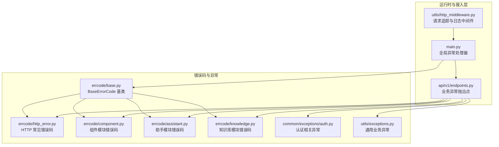
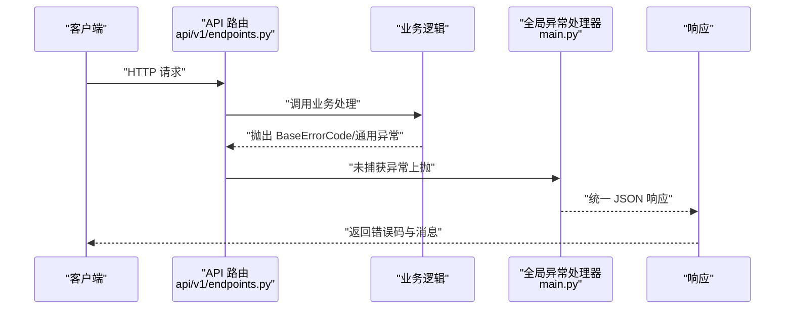
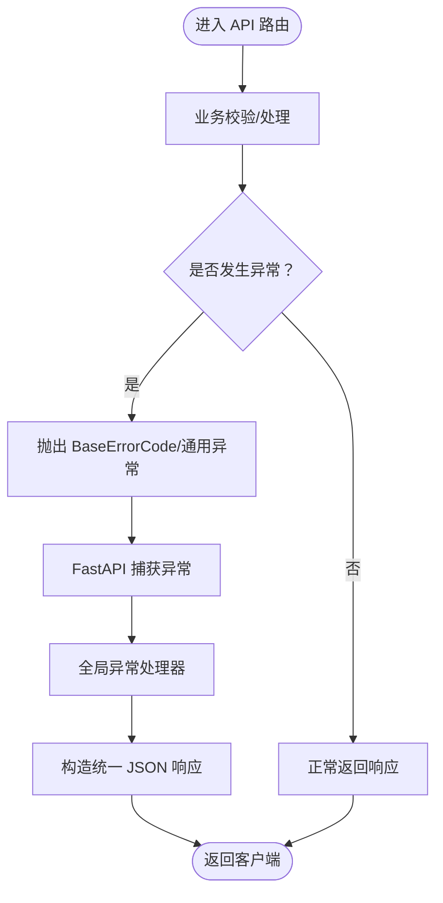
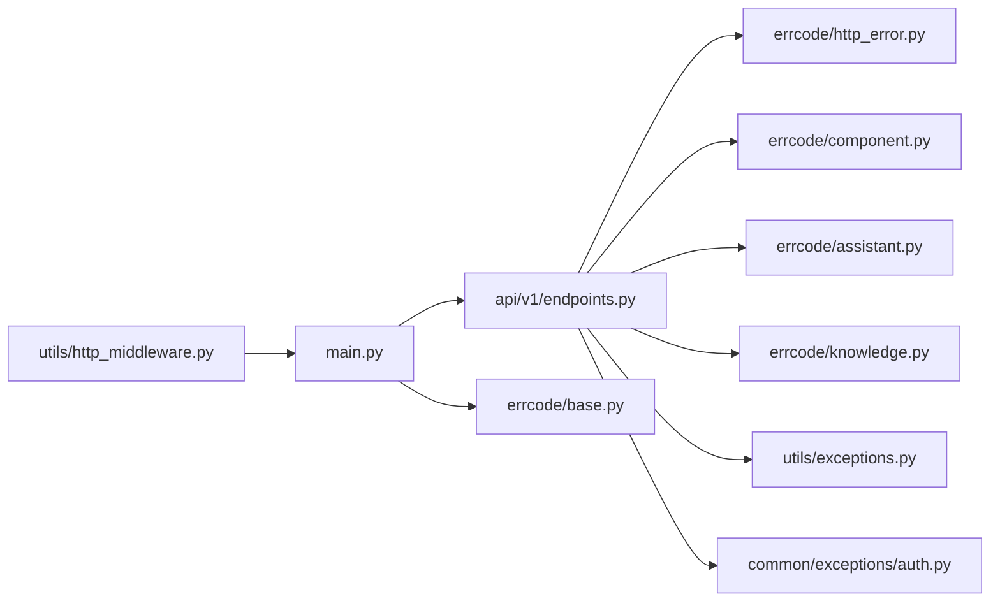

# 异常处理机制

<cite>
**本文引用的文件**
- [src/backend/bisheng/common/errcode/base.py](file://src/backend/bisheng/common/errcode/base.py)
- [src/backend/bisheng/common/errcode/http_error.py](file://src/backend/bisheng/common/errcode/http_error.py)
- [src/backend/bisheng/common/errcode/README.md](file://src/backend/bisheng/common/errcode/README.md)
- [src/backend/bisheng/common/errcode/component.py](file://src/backend/bisheng/common/errcode/component.py)
- [src/backend/bisheng/common/errcode/assistant.py](file://src/backend/bisheng/common/errcode/assistant.py)
- [src/backend/bisheng/common/errcode/knowledge.py](file://src/backend/bisheng/common/errcode/knowledge.py)
- [src/backend/bisheng/common/exceptions/auth.py](file://src/backend/bisheng/common/exceptions/auth.py)
- [src/backend/bisheng/utils/exceptions.py](file://src/backend/bisheng/utils/exceptions.py)
- [src/backend/bisheng/api/v1/endpoints.py](file://src/backend/bisheng/api/v1/endpoints.py)
- [src/backend/bisheng/main.py](file://src/backend/bisheng/main.py)
- [src/backend/bisheng/utils/http_middleware.py](file://src/backend/bisheng/utils/http_middleware.py)
</cite>

## 目录
1. [简介](#简介)
2. [项目结构](#项目结构)
3. [核心组件](#核心组件)
4. [架构总览](#架构总览)
5. [详细组件分析](#详细组件分析)
6. [依赖分析](#依赖分析)
7. [性能考量](#性能考量)
8. [故障排查指南](#故障排查指南)
9. [结论](#结论)
10. [附录](#附录)

## 简介
本文件系统性梳理 Bisheng 的异常处理机制，重点覆盖：
- 自定义错误码系统的设计与实现：分类、命名规范、使用场景与扩展方法
- 异常处理层次结构：从全局异常处理器到具体业务异常的处理流程
- 常见异常类型策略：HTTP 异常、验证异常、业务异常等
- 异常信息标准化格式与错误响应结构
- 异常扩展与自定义异常类型的开发指南
- 在调试、监控与用户体验方面的设计考量

## 项目结构
围绕异常处理的关键目录与文件如下：
- 错误码基类与模块化错误码：common/errcode
- 通用异常类型：common/exceptions
- 业务异常类型：utils/exceptions
- API 层异常触发点：api/v1/endpoints.py
- 全局异常处理器：main.py
- 中间件（日志与追踪）：utils/http_middleware.py

图表来源
- [src/backend/bisheng/common/errcode/base.py](file://src/backend/bisheng/common/errcode/base.py#L1-L97)
- [src/backend/bisheng/common/errcode/http_error.py](file://src/backend/bisheng/common/errcode/http_error.py#L1-L16)
- [src/backend/bisheng/common/errcode/component.py](file://src/backend/bisheng/common/errcode/component.py#L1-L13)
- [src/backend/bisheng/common/errcode/assistant.py](file://src/backend/bisheng/common/errcode/assistant.py#L1-L58)
- [src/backend/bisheng/common/errcode/knowledge.py](file://src/backend/bisheng/common/errcode/knowledge.py#L1-L147)
- [src/backend/bisheng/common/exceptions/auth.py](file://src/backend/bisheng/common/exceptions/auth.py#L1-L16)
- [src/backend/bisheng/utils/exceptions.py](file://src/backend/bisheng/utils/exceptions.py#L1-L36)
- [src/backend/bisheng/api/v1/endpoints.py](file://src/backend/bisheng/api/v1/endpoints.py#L1-L428)
- [src/backend/bisheng/main.py](file://src/backend/bisheng/main.py#L21-L49)
- [src/backend/bisheng/utils/http_middleware.py](file://src/backend/bisheng/utils/http_middleware.py#L1-L46)

章节来源
- [src/backend/bisheng/common/errcode/README.md](file://src/backend/bisheng/common/errcode/README.md#L1-L281)
- [src/backend/bisheng/common/errcode/base.py](file://src/backend/bisheng/common/errcode/base.py#L1-L97)
- [src/backend/bisheng/api/v1/endpoints.py](file://src/backend/bisheng/api/v1/endpoints.py#L1-L428)
- [src/backend/bisheng/main.py](file://src/backend/bisheng/main.py#L21-L49)
- [src/backend/bisheng/utils/http_middleware.py](file://src/backend/bisheng/utils/http_middleware.py#L1-L46)

## 核心组件
- BaseErrorCode：错误码基类，提供统一的错误对象语义、响应构造、HTTP 包装、SSE/WebSocket 输出能力，并支持自定义消息与上下文数据
- 模块化错误码：按功能模块划分（如组件、助手、知识库等），每个模块以固定前缀的三位数字标识模块，末两位递增分配
- 通用异常：用于业务逻辑中抛出可预期的错误信息，便于上抛至全局处理器
- 认证异常：针对 JWT 解析与鉴权场景的专用异常
- 全局异常处理器：集中处理 HTTPException、BaseErrorCode、RequestValidationError 以及未捕获异常，输出统一 JSON 响应
- 中间件：注入 Trace-ID、记录请求耗时与路径，辅助调试与监控

章节来源
- [src/backend/bisheng/common/errcode/base.py](file://src/backend/bisheng/common/errcode/base.py#L9-L97)
- [src/backend/bisheng/common/errcode/README.md](file://src/backend/bisheng/common/errcode/README.md#L3-L281)
- [src/backend/bisheng/utils/exceptions.py](file://src/backend/bisheng/utils/exceptions.py#L1-L36)
- [src/backend/bisheng/common/exceptions/auth.py](file://src/backend/bisheng/common/exceptions/auth.py#L1-L16)
- [src/backend/bisheng/main.py](file://src/backend/bisheng/main.py#L21-L49)
- [src/backend/bisheng/utils/http_middleware.py](file://src/backend/bisheng/utils/http_middleware.py#L12-L33)

## 架构总览
异常处理的控制流从 API 层触发业务异常，经由 FastAPI 的异常体系与全局处理器，最终统一输出标准响应。

图表来源
- [src/backend/bisheng/api/v1/endpoints.py](file://src/backend/bisheng/api/v1/endpoints.py#L196-L200)
- [src/backend/bisheng/main.py](file://src/backend/bisheng/main.py#L21-L49)

## 详细组件分析

### 错误码系统与命名规范
- 结构规则：前三位为模块代码，后两位为模块内递增错误码；示例参见文档说明与各模块错误码文件
- 基类能力：提供统一的错误对象语义、返回统一响应模型、构造 HTTPException、SSE 事件、WebSocket 关闭消息等
- 使用方式：支持直接抛出、返回统一响应、HTTP 包装、SSE/WebSocket 输出、字典/JSON 序列化
- 自定义消息：可在构造时传入 msg 覆盖默认 Msg，kwargs 作为 data 字段扩展
- 示例模块：
  - HTTP 常见错误码：未授权、资源不存在、服务器错误
  - 组件模块：组件已存在/不存在
  - 助手模块：助手不存在、上线失败、名称重复、未上线不可对话、模型配置错误等
  - 知识库模块：名称重复、未选择 embedding 模型、文件解析失败、元数据字段冲突/不存在/不可修改等

章节来源
- [src/backend/bisheng/common/errcode/README.md](file://src/backend/bisheng/common/errcode/README.md#L3-L281)
- [src/backend/bisheng/common/errcode/base.py](file://src/backend/bisheng/common/errcode/base.py#L9-L97)
- [src/backend/bisheng/common/errcode/http_error.py](file://src/backend/bisheng/common/errcode/http_error.py#L1-L16)
- [src/backend/bisheng/common/errcode/component.py](file://src/backend/bisheng/common/errcode/component.py#L1-L13)
- [src/backend/bisheng/common/errcode/assistant.py](file://src/backend/bisheng/common/errcode/assistant.py#L1-L58)
- [src/backend/bisheng/common/errcode/knowledge.py](file://src/backend/bisheng/common/errcode/knowledge.py#L1-L147)

### 异常层次结构与处理流程
- API 层：在路由中根据业务条件抛出具体错误码或通用异常
- 全局处理器：对不同类型的异常进行统一处理，输出统一 JSON 结构
- 中间件：在请求进入与返回时注入 Trace-ID、记录耗时与路径，便于定位问题

图表来源
- [src/backend/bisheng/api/v1/endpoints.py](file://src/backend/bisheng/api/v1/endpoints.py#L196-L200)
- [src/backend/bisheng/main.py](file://src/backend/bisheng/main.py#L21-L49)

章节来源
- [src/backend/bisheng/api/v1/endpoints.py](file://src/backend/bisheng/api/v1/endpoints.py#L196-L200)
- [src/backend/bisheng/main.py](file://src/backend/bisheng/main.py#L21-L49)

### 常见异常类型与处理策略
- HTTP 异常：由业务逻辑显式抛出或由框架自动产生，全局处理器将其转换为统一 JSON
- 验证异常：RequestValidationError 统一返回 422 并携带错误详情
- 业务异常：BaseErrorCode 子类提供明确的业务含义与错误码；通用异常用于快速抛出消息
- 认证异常：JWT 解析错误等，由认证相关异常类承载状态码与消息

章节来源
- [src/backend/bisheng/common/errcode/http_error.py](file://src/backend/bisheng/common/errcode/http_error.py#L1-L16)
- [src/backend/bisheng/utils/exceptions.py](file://src/backend/bisheng/utils/exceptions.py#L1-L36)
- [src/backend/bisheng/common/exceptions/auth.py](file://src/backend/bisheng/common/exceptions/auth.py#L1-L16)
- [src/backend/bisheng/main.py](file://src/backend/bisheng/main.py#L38-L41)

### 错误响应结构与标准化
- 统一 JSON 结构包含：状态码、状态消息、数据体
- 数据体默认包含异常字符串，也可附加自定义键值
- 支持 SSE 事件与 WebSocket 关闭消息格式，便于实时场景

章节来源
- [src/backend/bisheng/common/errcode/base.py](file://src/backend/bisheng/common/errcode/base.py#L24-L97)
- [src/backend/bisheng/common/errcode/README.md](file://src/backend/bisheng/common/errcode/README.md#L245-L281)

### 异常扩展与自定义异常开发指南
- 新增模块错误码：选择模块前缀，按模块内顺序递增分配错误码
- 继承 BaseErrorCode，定义 Code 与 Msg
- 在 API 层按需抛出或返回统一响应
- 扩展通用异常：根据业务场景新增异常类型，保持与现有异常风格一致

章节来源
- [src/backend/bisheng/common/errcode/README.md](file://src/backend/bisheng/common/errcode/README.md#L236-L244)
- [src/backend/bisheng/common/errcode/base.py](file://src/backend/bisheng/common/errcode/base.py#L9-L20)

### 调试、监控与用户体验
- 中间件注入 Trace-ID 与处理耗时，便于链路追踪与性能分析
- 全局异常处理器记录异常并输出统一错误响应，避免泄露内部细节
- SSE/WebSocket 错误输出便于前端实时反馈

章节来源
- [src/backend/bisheng/utils/http_middleware.py](file://src/backend/bisheng/utils/http_middleware.py#L12-L33)
- [src/backend/bisheng/main.py](file://src/backend/bisheng/main.py#L21-L49)
- [src/backend/bisheng/common/errcode/base.py](file://src/backend/bisheng/common/errcode/base.py#L39-L97)

## 依赖分析
- API 层依赖各模块错误码与通用异常类
- 全局异常处理器依赖 BaseErrorCode 与 FastAPI 内置异常类型
- 中间件独立于异常处理，但与全局处理器共同提升可观测性

图表来源
- [src/backend/bisheng/api/v1/endpoints.py](file://src/backend/bisheng/api/v1/endpoints.py#L16-L36)
- [src/backend/bisheng/common/errcode/http_error.py](file://src/backend/bisheng/common/errcode/http_error.py#L1-L16)
- [src/backend/bisheng/common/errcode/component.py](file://src/backend/bisheng/common/errcode/component.py#L1-L13)
- [src/backend/bisheng/common/errcode/assistant.py](file://src/backend/bisheng/common/errcode/assistant.py#L1-L58)
- [src/backend/bisheng/common/errcode/knowledge.py](file://src/backend/bisheng/common/errcode/knowledge.py#L1-L147)
- [src/backend/bisheng/utils/exceptions.py](file://src/backend/bisheng/utils/exceptions.py#L1-L36)
- [src/backend/bisheng/common/exceptions/auth.py](file://src/backend/bisheng/common/exceptions/auth.py#L1-L16)
- [src/backend/bisheng/main.py](file://src/backend/bisheng/main.py#L21-L49)
- [src/backend/bisheng/utils/http_middleware.py](file://src/backend/bisheng/utils/http_middleware.py#L1-L46)

章节来源
- [src/backend/bisheng/api/v1/endpoints.py](file://src/backend/bisheng/api/v1/endpoints.py#L16-L36)
- [src/backend/bisheng/main.py](file://src/backend/bisheng/main.py#L21-L49)

## 性能考量
- 统一异常处理减少分支判断开销，提高错误路径的一致性
- SSE/WebSocket 错误输出在实时场景下降低前端适配成本
- 中间件仅做轻量日志与追踪，避免引入额外延迟

## 故障排查指南
- 定位请求：通过中间件注入的 Trace-ID 快速关联日志
- 查看错误码：优先依据错误码定位模块与具体问题
- 复现与回归：结合 API 层抛出点与错误码定义，逐步缩小范围
- 实时场景：关注 SSE/WebSocket 错误输出，确认前端接收与展示

章节来源
- [src/backend/bisheng/utils/http_middleware.py](file://src/backend/bisheng/utils/http_middleware.py#L12-L33)
- [src/backend/bisheng/common/errcode/README.md](file://src/backend/bisheng/common/errcode/README.md#L245-L281)

## 结论
Bisheng 的异常处理机制以 BaseErrorCode 为核心，配合模块化错误码、统一响应与全局异常处理器，实现了高内聚、低耦合且易于扩展的错误处理体系。通过中间件增强可观测性，结合 SSE/WebSocket 输出提升用户体验。建议在新增模块时严格遵循错误码命名与使用规范，确保错误信息可读、可追踪、可监控。

## 附录
- 错误码使用方式与扩展规范详见错误码文档
- API 层常见异常抛出点集中在路由处理逻辑中

章节来源
- [src/backend/bisheng/common/errcode/README.md](file://src/backend/bisheng/common/errcode/README.md#L213-L244)
- [src/backend/bisheng/api/v1/endpoints.py](file://src/backend/bisheng/api/v1/endpoints.py#L196-L200)