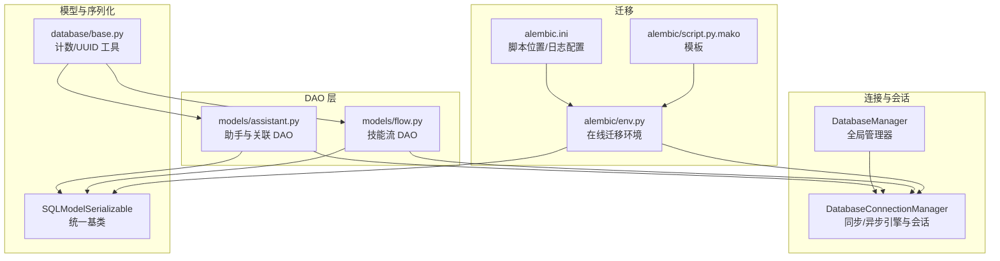
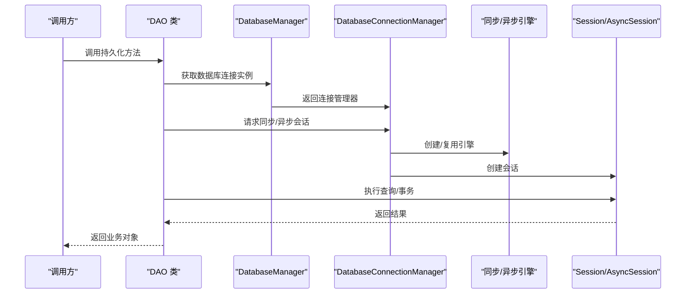
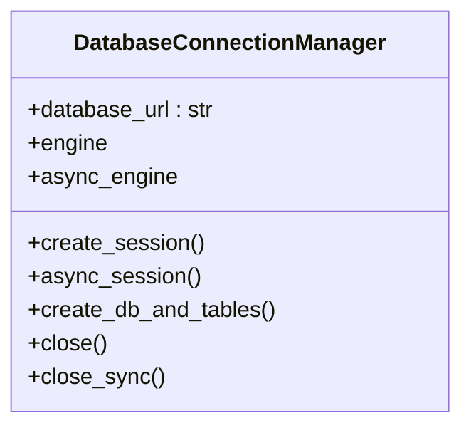
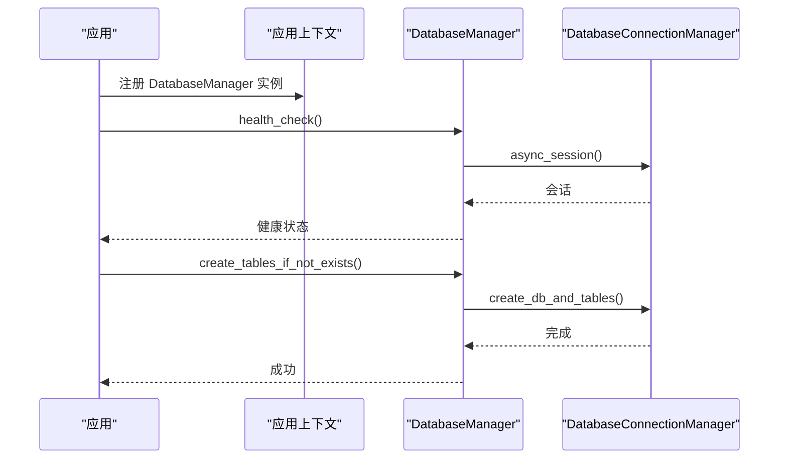
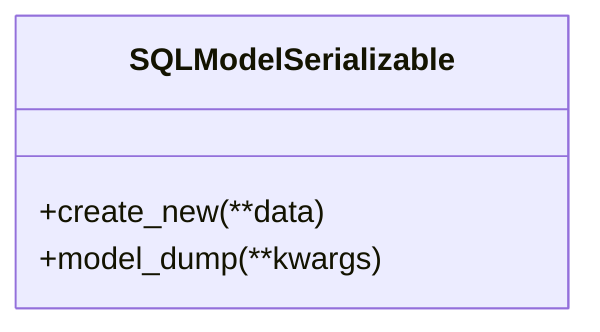
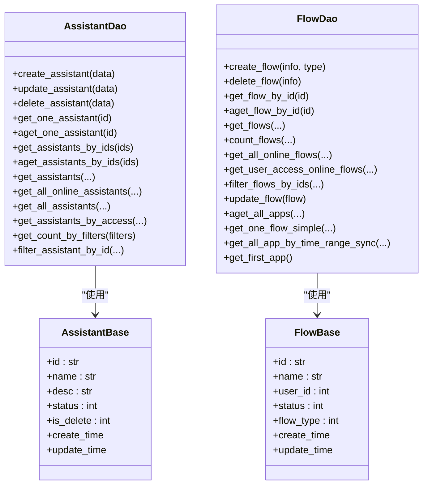
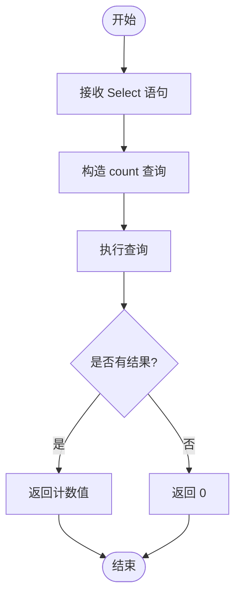
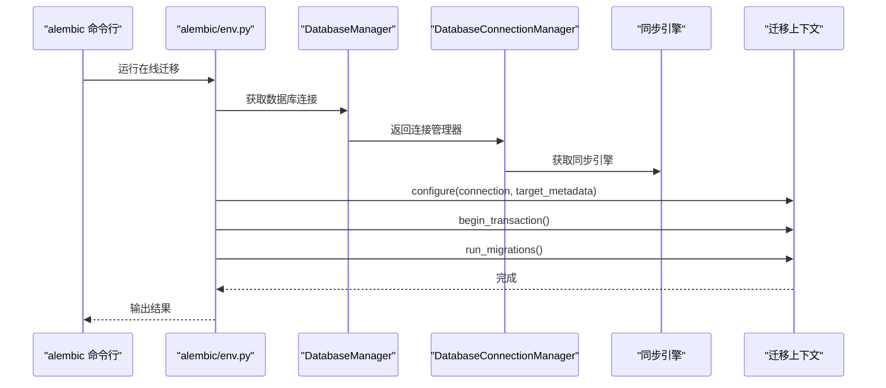
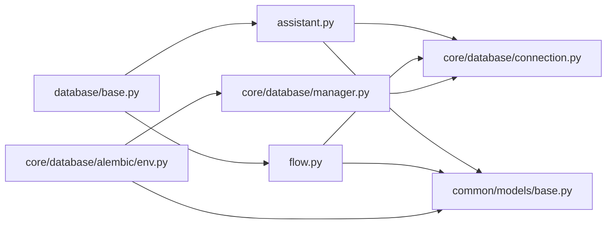

# 数据访问层

<cite>
**本文引用的文件**
- [src/backend/bisheng/core/database/connection.py](file://src/backend/bisheng/core/database/connection.py)
- [src/backend/bisheng/core/database/manager.py](file://src/backend/bisheng/core/database/manager.py)
- [src/backend/bisheng/common/models/base.py](file://src/backend/bisheng/common/models/base.py)
- [src/backend/bisheng/database/base.py](file://src/backend/bisheng/database/base.py)
- [src/backend/bisheng/database/models/assistant.py](file://src/backend/bisheng/database/models/assistant.py)
- [src/backend/bisheng/database/models/flow.py](file://src/backend/bisheng/database/models/flow.py)
- [src/backend/bisheng/core/database/alembic/env.py](file://src/backend/bisheng/core/database/alembic/env.py)
- [src/backend/alembic.ini](file://src/backend/alembic.ini)
- [src/backend/bisheng/core/database/alembic/script.py.mako](file://src/backend/bisheng/core/database/alembic/script.py.mako)
</cite>

## 目录
1. 引言
2. 项目结构
3. 核心组件
4. 架构总览
5. 组件详解
6. 依赖关系分析
7. 性能与一致性
8. 故障排查指南
9. 结论
10. 附录

## 引言
本文件面向 Bisheng 的数据访问层（DAO 层 + ORM），系统性阐述 SQLModel ORM 的使用与配置、模型定义与关系映射、查询与事务处理、数据库连接与连接池、以及 Alembic 迁移体系。文档同时总结了数据模型设计原则（表结构、索引、约束）、常见数据访问模式（CRUD 与复杂查询）及在一致性与性能方面的策略建议。

## 项目结构
数据访问层主要由以下模块构成：
- 连接与会话管理：统一的同步/异步引擎与会话工厂封装
- 全局数据库管理器：生命周期管理、健康检查、表初始化
- 基础模型与序列化：统一的 SQLModel 基类与序列化行为
- DAO 层：围绕业务实体（如助手、技能流）的持久化逻辑
- 查询工具：通用计数、分页等辅助方法
- 迁移系统：Alembic 配置与环境脚本，基于 SQLModel 元数据

图表来源
- [src/backend/bisheng/core/database/connection.py](file://src/backend/bisheng/core/database/connection.py#L17-L175)
- [src/backend/bisheng/core/database/manager.py](file://src/backend/bisheng/core/database/manager.py#L19-L174)
- [src/backend/bisheng/common/models/base.py](file://src/backend/bisheng/common/models/base.py#L7-L19)
- [src/backend/bisheng/database/base.py](file://src/backend/bisheng/database/base.py#L7-L40)
- [src/backend/bisheng/database/models/assistant.py](file://src/backend/bisheng/database/models/assistant.py#L22-L331)
- [src/backend/bisheng/database/models/flow.py](file://src/backend/bisheng/database/models/flow.py#L49-L650)
- [src/backend/bisheng/core/database/alembic/env.py](file://src/backend/bisheng/core/database/alembic/env.py#L1-L50)
- [src/backend/alembic.ini](file://src/backend/alembic.ini#L1-L148)
- [src/backend/bisheng/core/database/alembic/script.py.mako](file://src/backend/bisheng/core/database/alembic/script.py.mako#L1-L29)

章节来源
- [src/backend/bisheng/core/database/connection.py](file://src/backend/bisheng/core/database/connection.py#L17-L175)
- [src/backend/bisheng/core/database/manager.py](file://src/backend/bisheng/core/database/manager.py#L19-L174)
- [src/backend/bisheng/common/models/base.py](file://src/backend/bisheng/common/models/base.py#L7-L19)
- [src/backend/bisheng/database/base.py](file://src/backend/bisheng/database/base.py#L7-L40)
- [src/backend/bisheng/database/models/assistant.py](file://src/backend/bisheng/database/models/assistant.py#L22-L331)
- [src/backend/bisheng/database/models/flow.py](file://src/backend/bisheng/database/models/flow.py#L49-L650)
- [src/backend/bisheng/core/database/alembic/env.py](file://src/backend/bisheng/core/database/alembic/env.py#L1-L50)
- [src/backend/alembic.ini](file://src/backend/alembic.ini#L1-L148)
- [src/backend/bisheng/core/database/alembic/script.py.mako](file://src/backend/bisheng/core/database/alembic/script.py.mako#L1-L29)

## 核心组件
- 数据库连接管理器：负责同步/异步引擎创建、连接池参数、会话工厂、表创建与关闭
- 全局数据库管理器：提供健康检查、表初始化、上下文注册与获取、便捷会话上下文
- 统一模型基类：继承 SQLModel 并启用 from_attributes，便于 ORM 对象与 Pydantic 模型互转
- DAO 层：围绕业务实体的增删改查、复杂查询、分页与计数
- 查询工具：提供同步/异步计数函数与 UUID 工具
- Alembic 迁移：基于 SQLModel 元数据的在线迁移环境与配置

章节来源
- [src/backend/bisheng/core/database/connection.py](file://src/backend/bisheng/core/database/connection.py#L17-L175)
- [src/backend/bisheng/core/database/manager.py](file://src/backend/bisheng/core/database/manager.py#L19-L174)
- [src/backend/bisheng/common/models/base.py](file://src/backend/bisheng/common/models/base.py#L7-L19)
- [src/backend/bisheng/database/base.py](file://src/backend/bisheng/database/base.py#L7-L40)

## 架构总览
数据访问层采用“连接管理器 + 全局管理器 + DAO 层”的分层架构。DAO 层通过统一的同步/异步会话接口进行数据库交互；迁移系统基于 Alembic 在线模式，直接使用应用内已注册的同步引擎执行迁移。

图表来源
- [src/backend/bisheng/core/database/manager.py](file://src/backend/bisheng/core/database/manager.py#L98-L174)
- [src/backend/bisheng/core/database/connection.py](file://src/backend/bisheng/core/database/connection.py#L66-L141)

## 组件详解

### 连接与会话管理（DatabaseConnectionManager）
- 同步/异步引擎分离：根据 URL 协议自动转换异步驱动（如 pymysql→aiomysql，psycopg2→asyncpg），并提供默认连接池参数
- 默认连接池配置：包含 pool_size、max_overflow、pool_timeout、pool_pre_ping、pool_recycle 等；SQLite 使用 StaticPool，MySQL 设置字符集
- 会话工厂：提供同步与异步会话上下文管理器，异常时自动回滚并记录日志
- 表创建：通过异步连接在在线模式下创建所有表
- 生命周期：支持异步 dispose 与同步 dispose

图表来源
- [src/backend/bisheng/core/database/connection.py](file://src/backend/bisheng/core/database/connection.py#L17-L175)

章节来源
- [src/backend/bisheng/core/database/connection.py](file://src/backend/bisheng/core/database/connection.py#L17-L175)

### 全局数据库管理器（DatabaseManager）
- 提供全局单例注册与获取，支持异步/同步两种获取方式
- 健康检查：通过简单 SQL 验证连接可用性
- 表初始化：委托连接管理器创建所有表
- 便捷会话：提供 get_async_db_session 与 get_sync_db_session 上下文管理器

图表来源
- [src/backend/bisheng/core/database/manager.py](file://src/backend/bisheng/core/database/manager.py#L64-L95)
- [src/backend/bisheng/core/database/connection.py](file://src/backend/bisheng/core/database/connection.py#L142-L154)

章节来源
- [src/backend/bisheng/core/database/manager.py](file://src/backend/bisheng/core/database/manager.py#L19-L174)

### 统一模型基类（SQLModelSerializable）
- 继承 SQLModel，并设置 from_attributes=True，便于 ORM 对象与 Pydantic 模型互转
- 提供 create_new 与 model_dump 的便捷方法，统一序列化输出格式

图表来源
- [src/backend/bisheng/common/models/base.py](file://src/backend/bisheng/common/models/base.py#L7-L19)

章节来源
- [src/backend/bisheng/common/models/base.py](file://src/backend/bisheng/common/models/base.py#L7-L19)

### DAO 层（以助手与技能流为例）
- 助手模型与 DAO：提供创建、更新、删除、按条件查询、分页与计数、批量查询等
- 技能流模型与 DAO：提供创建、删除、按用户/名称/类型过滤、分页、计数、聚合查询（多表 union）等
- 会话使用：同步 DAO 使用 get_sync_db_session，异步 DAO 使用 get_async_db_session
- 计数与分页：利用 SQLModel 的 select 与 func.count，结合偏移/限制实现分页

图表来源
- [src/backend/bisheng/database/models/assistant.py](file://src/backend/bisheng/database/models/assistant.py#L22-L331)
- [src/backend/bisheng/database/models/flow.py](file://src/backend/bisheng/database/models/flow.py#L49-L650)

章节来源
- [src/backend/bisheng/database/models/assistant.py](file://src/backend/bisheng/database/models/assistant.py#L22-L331)
- [src/backend/bisheng/database/models/flow.py](file://src/backend/bisheng/database/models/flow.py#L49-L650)

### 查询工具（计数与 UUID）
- 同步/异步计数：对给定的 select 语句生成 count 查询并返回整数
- UUID 工具：生成十六进制字符串作为主键值

图表来源
- [src/backend/bisheng/database/base.py](file://src/backend/bisheng/database/base.py#L7-L40)

章节来源
- [src/backend/bisheng/database/base.py](file://src/backend/bisheng/database/base.py#L7-L40)

### Alembic 迁移系统
- 在线迁移环境：env.py 直接从应用上下文中获取同步引擎，配置迁移上下文并在事务中执行
- 配置文件：alembic.ini 指定脚本位置、日志级别、文件模板等
- 模板：script.py.mako 为迁移脚本生成模板

图表来源
- [src/backend/bisheng/core/database/alembic/env.py](file://src/backend/bisheng/core/database/alembic/env.py#L29-L49)
- [src/backend/bisheng/core/database/manager.py](file://src/backend/bisheng/core/database/manager.py#L121-L141)
- [src/backend/alembic.ini](file://src/backend/alembic.ini#L1-L148)
- [src/backend/bisheng/core/database/alembic/script.py.mako](file://src/backend/bisheng/core/database/alembic/script.py.mako#L21-L28)

章节来源
- [src/backend/bisheng/core/database/alembic/env.py](file://src/backend/bisheng/core/database/alembic/env.py#L1-L50)
- [src/backend/alembic.ini](file://src/backend/alembic.ini#L1-L148)
- [src/backend/bisheng/core/database/alembic/script.py.mako](file://src/backend/bisheng/core/database/alembic/script.py.mako#L1-L29)

## 依赖关系分析
- DAO 层依赖统一模型基类与会话获取工具
- 全局管理器依赖连接管理器与应用上下文
- Alembic 环境依赖全局管理器提供的同步引擎
- 查询工具被 DAO 层广泛使用

图表来源
- [src/backend/bisheng/database/models/assistant.py](file://src/backend/bisheng/database/models/assistant.py#L9-L14)
- [src/backend/bisheng/database/models/flow.py](file://src/backend/bisheng/database/models/flow.py#L12-L20)
- [src/backend/bisheng/core/database/connection.py](file://src/backend/bisheng/core/database/connection.py#L1-L12)
- [src/backend/bisheng/core/database/manager.py](file://src/backend/bisheng/core/database/manager.py#L13-L14)
- [src/backend/bisheng/core/database/alembic/env.py](file://src/backend/bisheng/core/database/alembic/env.py#L5-L20)
- [src/backend/bisheng/database/base.py](file://src/backend/bisheng/database/base.py#L1-L5)

章节来源
- [src/backend/bisheng/database/models/assistant.py](file://src/backend/bisheng/database/models/assistant.py#L9-L14)
- [src/backend/bisheng/database/models/flow.py](file://src/backend/bisheng/database/models/flow.py#L12-L20)
- [src/backend/bisheng/core/database/connection.py](file://src/backend/bisheng/core/database/connection.py#L1-L12)
- [src/backend/bisheng/core/database/manager.py](file://src/backend/bisheng/core/database/manager.py#L13-L14)
- [src/backend/bisheng/core/database/alembic/env.py](file://src/backend/bisheng/core/database/alembic/env.py#L5-L20)
- [src/backend/bisheng/database/base.py](file://src/backend/bisheng/database/base.py#L1-L5)

## 性能与一致性
- 连接池与预热
  - 默认池大小与超量配置适合高并发场景；SQLite 使用 StaticPool 限制并发
  - pool_pre_ping 与 recycle 有助于保持连接活性与回收长时间占用的连接
- 事务与回滚
  - 会话上下文在异常时自动回滚，避免脏写
- 查询优化
  - DAO 层广泛使用索引字段（如 user_id、name、create_time）进行过滤
  - 分页查询通过 offset/limit 控制结果集大小
  - 复杂查询使用子查询与 union，减少多次往返
- 序列化与传输
  - 统一使用 from_attributes，降低 ORM 与 API 序列化的成本

章节来源
- [src/backend/bisheng/core/database/connection.py](file://src/backend/bisheng/core/database/connection.py#L40-L64)
- [src/backend/bisheng/core/database/connection.py](file://src/backend/bisheng/core/database/connection.py#L110-L141)
- [src/backend/bisheng/database/models/assistant.py](file://src/backend/bisheng/database/models/assistant.py#L130-L169)
- [src/backend/bisheng/database/models/flow.py](file://src/backend/bisheng/database/models/flow.py#L242-L274)

## 故障排查指南
- 健康检查失败
  - 现象：health_check 返回 False
  - 排查：确认数据库 URL 正确、网络可达、权限正确；查看日志中的错误信息
- 迁移失败
  - 现象：运行迁移时报 OperationalError 或其他异常
  - 排查：检查 Alembic 配置与目标元数据是否指向正确的 SQLModel 元数据；确认同步引擎可用
- 会话异常
  - 现象：执行查询抛出异常后未提交或回滚
  - 排查：确保使用 get_sync_db_session 或 get_async_db_session 上下文；检查异常捕获与日志
- 表创建失败
  - 现象：create_db_and_tables 抛错
  - 排查：确认数据库存在且具备 DDL 权限；查看具体异常并修正权限或配置

章节来源
- [src/backend/bisheng/core/database/manager.py](file://src/backend/bisheng/core/database/manager.py#L64-L95)
- [src/backend/bisheng/core/database/alembic/env.py](file://src/backend/bisheng/core/database/alembic/env.py#L29-L49)
- [src/backend/bisheng/core/database/connection.py](file://src/backend/bisheng/core/database/connection.py#L142-L154)

## 结论
Bisheng 的数据访问层以 SQLModel 为核心，结合统一的连接管理与全局管理器，提供了清晰的同步/异步会话抽象、完善的迁移机制与可扩展的 DAO 层。通过合理的连接池配置、事务回滚策略与查询优化手段，在保证数据一致性的同时兼顾性能表现。建议在生产环境中持续关注连接池参数与慢查询，配合 Alembic 严格管理数据库版本演进。

## 附录
- 常用路径参考
  - 连接与会话：[src/backend/bisheng/core/database/connection.py](file://src/backend/bisheng/core/database/connection.py#L17-L175)
  - 全局管理器：[src/backend/bisheng/core/database/manager.py](file://src/backend/bisheng/core/database/manager.py#L19-L174)
  - 统一模型基类：[src/backend/bisheng/common/models/base.py](file://src/backend/bisheng/common/models/base.py#L7-L19)
  - DAO 示例（助手）：[src/backend/bisheng/database/models/assistant.py](file://src/backend/bisheng/database/models/assistant.py#L65-L331)
  - DAO 示例（技能流）：[src/backend/bisheng/database/models/flow.py](file://src/backend/bisheng/database/models/flow.py#L109-L650)
  - 查询工具：[src/backend/bisheng/database/base.py](file://src/backend/bisheng/database/base.py#L7-L40)
  - 迁移配置：[src/backend/alembic.ini](file://src/backend/alembic.ini#L1-L148)
  - 迁移环境：[src/backend/bisheng/core/database/alembic/env.py](file://src/backend/bisheng/core/database/alembic/env.py#L1-L50)
  - 迁移模板：[src/backend/bisheng/core/database/alembic/script.py.mako](file://src/backend/bisheng/core/database/alembic/script.py.mako#L1-L29)