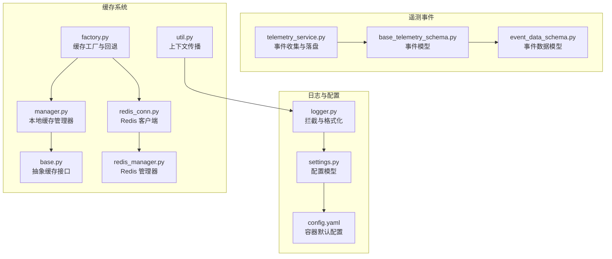
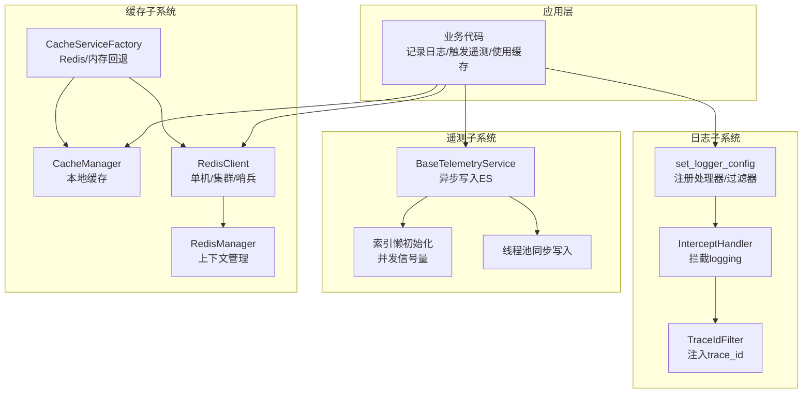
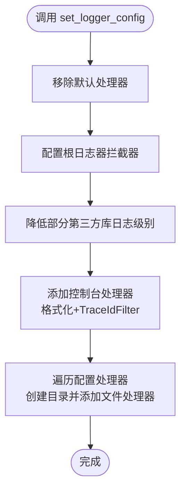
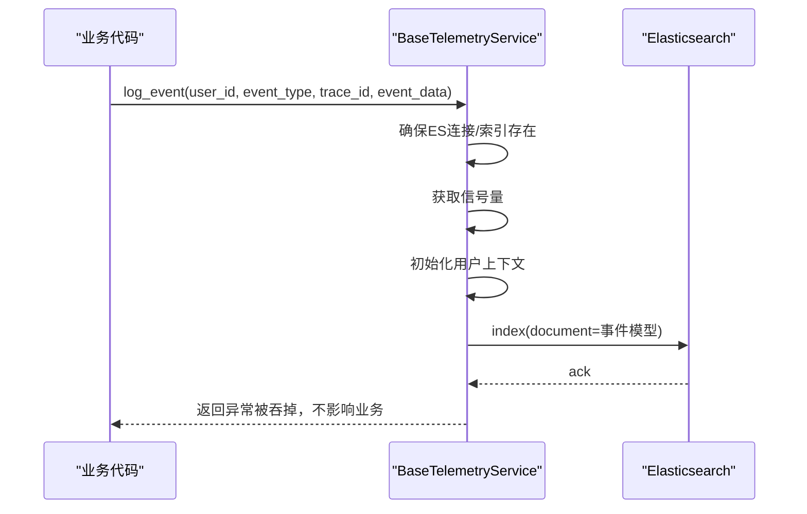
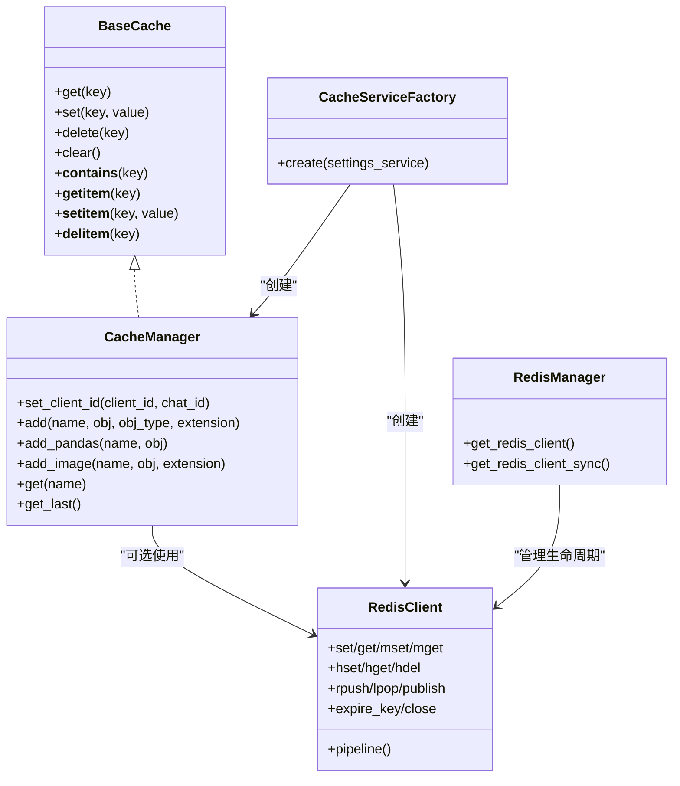
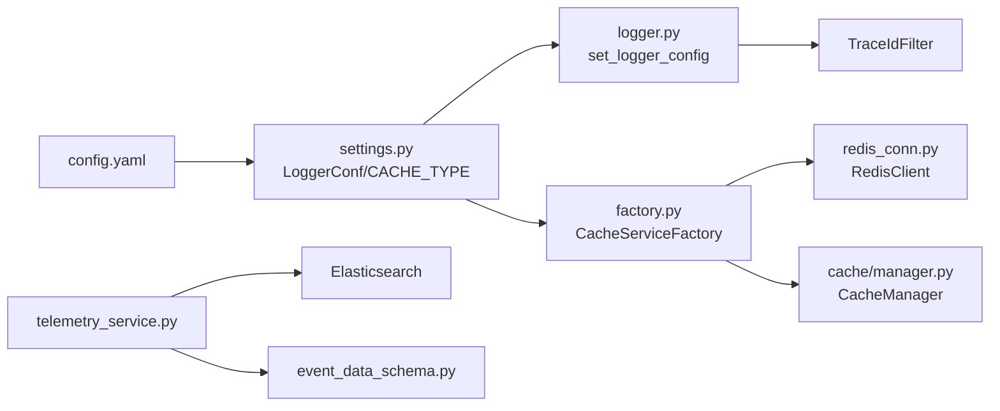

# 日志与监控

<cite>
**本文引用的文件**
- [src/backend/bisheng/core/logger.py](file://src/backend/bisheng/core/logger.py)
- [src/backend/bisheng/core/config/settings.py](file://src/backend/bisheng/core/config/settings.py)
- [docker/bisheng/config/config.yaml](file://docker/bisheng/config/config.yaml)
- [src/backend/bisheng/common/services/telemetry/telemetry_service.py](file://src/backend/bisheng/common/services/telemetry/telemetry_service.py)
- [src/backend/bisheng/common/schemas/telemetry/base_telemetry_schema.py](file://src/backend/bisheng/common/schemas/telemetry/base_telemetry_schema.py)
- [src/backend/bisheng/common/schemas/telemetry/event_data_schema.py](file://src/backend/bisheng/common/schemas/telemetry/event_data_schema.py)
- [src/backend/bisheng/core/cache/base.py](file://src/backend/bisheng/core/cache/base.py)
- [src/backend/bisheng/core/cache/manager.py](file://src/backend/bisheng/core/cache/manager.py)
- [src/backend/bisheng/core/cache/redis_conn.py](file://src/backend/bisheng/core/cache/redis_conn.py)
- [src/backend/bisheng/core/cache/redis_manager.py](file://src/backend/bisheng/core/cache/redis_manager.py)
- [src/backend/bisheng/services/cache/factory.py](file://src/backend/bisheng/services/cache/factory.py)
- [src/backend/bisheng/common/utils/util.py](file://src/backend/bisheng/common/utils/util.py)
- [docker/redis/redis.conf](file://docker/redis/redis.conf)
</cite>

## 目录
1. [简介](#简介)
2. [项目结构](#项目结构)
3. [核心组件](#核心组件)
4. [架构总览](#架构总览)
5. [详细组件分析](#详细组件分析)
6. [依赖分析](#依赖分析)
7. [性能考虑](#性能考虑)
8. [故障排查指南](#故障排查指南)
9. [结论](#结论)
10. [附录](#附录)

## 简介
本技术文档聚焦于 Bisheng 的日志与监控体系，涵盖以下方面：
- 日志系统：配置项、日志级别、格式化、输出目标与拦截机制
- 遥测（Telemetry）事件：事件模型、收集与落盘、并发控制与容错
- 缓存系统：本地缓存、Redis 缓存与连接管理、缓存工厂与回退策略
- 监控指标：如何定义与采集性能、业务与错误率指标
- 实用排障：日志分析方法、常见问题定位与修复建议
- 运维与优化：监控在系统运维与性能优化中的应用

## 项目结构
围绕日志与监控的关键目录与文件如下：
- 日志与配置
  - 核心日志配置与拦截器：core/logger.py
  - 应用配置模型：core/config/settings.py
  - 容器默认配置示例：docker/bisheng/config/config.yaml
- 遥测事件
  - 服务实现：common/services/telemetry/telemetry_service.py
  - 事件模型：common/schemas/telemetry/*.py
- 缓存系统
  - 抽象基类：core/cache/base.py
  - 本地缓存管理器：core/cache/manager.py
  - Redis 客户端与连接池：core/cache/redis_conn.py
  - Redis 管理器与上下文：core/cache/redis_manager.py
  - 缓存工厂与回退策略：services/cache/factory.py
  - 上下文传播工具：common/utils/util.py
- Redis 服务器配置（容器环境）
  - docker/redis/redis.conf

**图表来源**
- [src/backend/bisheng/core/logger.py](file://src/backend/bisheng/core/logger.py#L1-L98)
- [src/backend/bisheng/core/config/settings.py](file://src/backend/bisheng/core/config/settings.py#L23-L49)
- [docker/bisheng/config/config.yaml](file://docker/bisheng/config/config.yaml#L62-L88)
- [src/backend/bisheng/common/services/telemetry/telemetry_service.py](file://src/backend/bisheng/common/services/telemetry/telemetry_service.py#L1-L284)
- [src/backend/bisheng/common/schemas/telemetry/base_telemetry_schema.py](file://src/backend/bisheng/common/schemas/telemetry/base_telemetry_schema.py#L1-L57)
- [src/backend/bisheng/common/schemas/telemetry/event_data_schema.py](file://src/backend/bisheng/common/schemas/telemetry/event_data_schema.py#L1-L159)
- [src/backend/bisheng/core/cache/base.py](file://src/backend/bisheng/core/cache/base.py#L1-L85)
- [src/backend/bisheng/core/cache/manager.py](file://src/backend/bisheng/core/cache/manager.py#L1-L156)
- [src/backend/bisheng/core/cache/redis_conn.py](file://src/backend/bisheng/core/cache/redis_conn.py#L1-L515)
- [src/backend/bisheng/core/cache/redis_manager.py](file://src/backend/bisheng/core/cache/redis_manager.py#L1-L82)
- [src/backend/bisheng/services/cache/factory.py](file://src/backend/bisheng/services/cache/factory.py#L1-L34)
- [src/backend/bisheng/common/utils/util.py](file://src/backend/bisheng/common/utils/util.py#L58-L72)

**章节来源**
- [src/backend/bisheng/core/logger.py](file://src/backend/bisheng/core/logger.py#L51-L98)
- [src/backend/bisheng/core/config/settings.py](file://src/backend/bisheng/core/config/settings.py#L23-L49)
- [docker/bisheng/config/config.yaml](file://docker/bisheng/config/config.yaml#L62-L88)

## 核心组件
- 日志系统
  - 使用 Loguru 并通过 InterceptHandler 将 Python logging 的日志桥接至 Loguru
  - 支持统一格式化、按级别过滤、多处理器（控制台与文件）、Trace ID 注入
- 遥测事件
  - 异步写入 Elasticsearch，带索引懒初始化、并发信号量限制、线程池同步写入
  - 事件模型包含通用字段与事件数据载荷，支持动态扩展
- 缓存系统
  - 抽象缓存接口，本地缓存基于内存字典与观察者模式
  - Redis 客户端支持单机、集群、哨兵模式；提供同步/异步操作与管道
  - 缓存工厂按配置选择 Redis 或内存缓存，并在 Redis 不可用时回退内存缓存

**章节来源**
- [src/backend/bisheng/core/logger.py](file://src/backend/bisheng/core/logger.py#L31-L98)
- [src/backend/bisheng/common/services/telemetry/telemetry_service.py](file://src/backend/bisheng/common/services/telemetry/telemetry_service.py#L57-L284)
- [src/backend/bisheng/core/cache/base.py](file://src/backend/bisheng/core/cache/base.py#L4-L85)
- [src/backend/bisheng/core/cache/manager.py](file://src/backend/bisheng/core/cache/manager.py#L53-L156)
- [src/backend/bisheng/core/cache/redis_conn.py](file://src/backend/bisheng/core/cache/redis_conn.py#L18-L515)
- [src/backend/bisheng/services/cache/factory.py](file://src/backend/bisheng/services/cache/factory.py#L11-L34)

## 架构总览
日志与监控的整体交互如下：

**图表来源**
- [src/backend/bisheng/core/logger.py](file://src/backend/bisheng/core/logger.py#L31-L98)
- [src/backend/bisheng/common/services/telemetry/telemetry_service.py](file://src/backend/bisheng/common/services/telemetry/telemetry_service.py#L57-L284)
- [src/backend/bisheng/core/cache/manager.py](file://src/backend/bisheng/core/cache/manager.py#L53-L156)
- [src/backend/bisheng/core/cache/redis_conn.py](file://src/backend/bisheng/core/cache/redis_conn.py#L18-L515)
- [src/backend/bisheng/core/cache/redis_manager.py](file://src/backend/bisheng/core/cache/redis_manager.py#L10-L82)
- [src/backend/bisheng/services/cache/factory.py](file://src/backend/bisheng/services/cache/factory.py#L11-L34)

## 详细组件分析

### 日志系统
- 配置入口
  - LoggerConf：定义日志级别、格式与处理器列表
  - 支持从环境变量解析 sink 路径与过滤器表达式
- 拦截与桥接
  - InterceptHandler 将 logging 的记录映射到 Loguru，并保留异常栈信息
- 处理器与过滤
  - 控制台默认处理器 + 多个文件处理器
  - TraceIdFilter 自动注入 trace_id，支持自定义过滤函数
- 输出目标
  - stdout 与文件（支持按时间切割与保留期）

**图表来源**
- [src/backend/bisheng/core/logger.py](file://src/backend/bisheng/core/logger.py#L51-L98)
- [src/backend/bisheng/core/config/settings.py](file://src/backend/bisheng/core/config/settings.py#L23-L49)
- [docker/bisheng/config/config.yaml](file://docker/bisheng/config/config.yaml#L62-L88)

**章节来源**
- [src/backend/bisheng/core/logger.py](file://src/backend/bisheng/core/logger.py#L51-L98)
- [src/backend/bisheng/core/config/settings.py](file://src/backend/bisheng/core/config/settings.py#L23-L49)
- [docker/bisheng/config/config.yaml](file://docker/bisheng/config/config.yaml#L62-L88)

### 遥测事件收集与分析
- 事件模型
  - BaseTelemetryEvent：包含事件ID、类型、时间戳、用户上下文、Trace ID、事件数据载荷
  - 事件数据模型：登录、消息会话、工具调用、应用生命周期、模型调用等
- 写入流程
  - 异步写入：获取 ES 连接、懒初始化索引、并发信号量限流、fire-and-forget 写入
  - 同步写入：线程池提交任务，避免阻塞主业务
- 用户上下文
  - 通过数据库查询用户所属组与角色，构建 UserContext
- 错误处理
  - 捕获异常并记录日志，不抛出影响主流程

**图表来源**
- [src/backend/bisheng/common/services/telemetry/telemetry_service.py](file://src/backend/bisheng/common/services/telemetry/telemetry_service.py#L189-L243)
- [src/backend/bisheng/common/schemas/telemetry/base_telemetry_schema.py](file://src/backend/bisheng/common/schemas/telemetry/base_telemetry_schema.py#L32-L57)
- [src/backend/bisheng/common/schemas/telemetry/event_data_schema.py](file://src/backend/bisheng/common/schemas/telemetry/event_data_schema.py#L16-L159)

**章节来源**
- [src/backend/bisheng/common/services/telemetry/telemetry_service.py](file://src/backend/bisheng/common/services/telemetry/telemetry_service.py#L57-L284)
- [src/backend/bisheng/common/schemas/telemetry/base_telemetry_schema.py](file://src/backend/bisheng/common/schemas/telemetry/base_telemetry_schema.py#L1-L57)
- [src/backend/bisheng/common/schemas/telemetry/event_data_schema.py](file://src/backend/bisheng/common/schemas/telemetry/event_data_schema.py#L1-L159)

### 缓存系统
- 抽象接口
  - BaseCache 定义 get/set/delete/clear 等标准操作
- 本地缓存
  - CacheManager 提供客户端维度的缓存空间，支持对象序列化为字符串以适配缓存存储
  - 观察者模式通知缓存变更
- Redis 缓存
  - RedisClient 支持单机、集群、哨兵三种模式，提供同步/异步 set/get/mset/mget、哈希、列表、发布订阅等
  - RedisManager 负责生命周期管理与上下文注册
- 缓存工厂与回退
  - 根据配置选择 Redis 或内存缓存；当 Redis 不可用时自动回退到内存缓存

**图表来源**
- [src/backend/bisheng/core/cache/base.py](file://src/backend/bisheng/core/cache/base.py#L4-L85)
- [src/backend/bisheng/core/cache/manager.py](file://src/backend/bisheng/core/cache/manager.py#L53-L156)
- [src/backend/bisheng/core/cache/redis_conn.py](file://src/backend/bisheng/core/cache/redis_conn.py#L18-L515)
- [src/backend/bisheng/core/cache/redis_manager.py](file://src/backend/bisheng/core/cache/redis_manager.py#L10-L82)
- [src/backend/bisheng/services/cache/factory.py](file://src/backend/bisheng/services/cache/factory.py#L11-L34)

**章节来源**
- [src/backend/bisheng/core/cache/base.py](file://src/backend/bisheng/core/cache/base.py#L1-L85)
- [src/backend/bisheng/core/cache/manager.py](file://src/backend/bisheng/core/cache/manager.py#L1-L156)
- [src/backend/bisheng/core/cache/redis_conn.py](file://src/backend/bisheng/core/cache/redis_conn.py#L1-L515)
- [src/backend/bisheng/core/cache/redis_manager.py](file://src/backend/bisheng/core/cache/redis_manager.py#L1-L82)
- [src/backend/bisheng/services/cache/factory.py](file://src/backend/bisheng/services/cache/factory.py#L1-L34)

### 监控指标定义与采集
- 性能指标
  - 模型调用耗时、首 Token 时间、输入/输出/缓存/总 Token 数
  - 应用生命周期起止时间、处理时长
- 业务指标
  - 新建应用数、新建知识库数、文件解析成功/失败计数、消息反馈点赞/点踩/复制
- 错误率统计
  - 工具调用/模型调用状态枚举，结合聚合查询统计失败比例
- 采集方式
  - 通过遥测事件模型记录关键指标，写入 Elasticsearch，后续由可视化平台或 BI 工具消费

**章节来源**
- [src/backend/bisheng/common/schemas/telemetry/event_data_schema.py](file://src/backend/bisheng/common/schemas/telemetry/event_data_schema.py#L103-L159)
- [src/backend/bisheng/common/services/telemetry/telemetry_service.py](file://src/backend/bisheng/common/services/telemetry/telemetry_service.py#L189-L243)

## 依赖分析
- 日志子系统
  - settings.LoggerConf 解析 config.yaml 中的 logger_conf
  - set_logger_config 注册拦截器与处理器，TraceIdFilter 保证跨模块 trace_id 一致
- 遥测子系统
  - telemetry_service 依赖 Elasticsearch 连接与用户仓库查询
  - 事件模型与枚举类型解耦，便于扩展新事件
- 缓存子系统
  - factory 依赖 settings 读取 CACHE_TYPE 与 Redis 参数
  - redis_manager 依赖 app_context 获取/注册 RedisManager 实例

**图表来源**
- [docker/bisheng/config/config.yaml](file://docker/bisheng/config/config.yaml#L62-L88)
- [src/backend/bisheng/core/config/settings.py](file://src/backend/bisheng/core/config/settings.py#L23-L49)
- [src/backend/bisheng/core/logger.py](file://src/backend/bisheng/core/logger.py#L51-L98)
- [src/backend/bisheng/services/cache/factory.py](file://src/backend/bisheng/services/cache/factory.py#L11-L34)
- [src/backend/bisheng/core/cache/redis_conn.py](file://src/backend/bisheng/core/cache/redis_conn.py#L18-L515)
- [src/backend/bisheng/core/cache/manager.py](file://src/backend/bisheng/core/cache/manager.py#L53-L156)
- [src/backend/bisheng/common/services/telemetry/telemetry_service.py](file://src/backend/bisheng/common/services/telemetry/telemetry_service.py#L1-L284)
- [src/backend/bisheng/common/schemas/telemetry/event_data_schema.py](file://src/backend/bisheng/common/schemas/telemetry/event_data_schema.py#L1-L159)

**章节来源**
- [docker/bisheng/config/config.yaml](file://docker/bisheng/config/config.yaml#L62-L88)
- [src/backend/bisheng/core/config/settings.py](file://src/backend/bisheng/core/config/settings.py#L23-L49)
- [src/backend/bisheng/core/logger.py](file://src/backend/bisheng/core/logger.py#L51-L98)
- [src/backend/bisheng/services/cache/factory.py](file://src/backend/bisheng/services/cache/factory.py#L11-L34)
- [src/backend/bisheng/core/cache/redis_conn.py](file://src/backend/bisheng/core/cache/redis_conn.py#L18-L515)
- [src/backend/bisheng/core/cache/manager.py](file://src/backend/bisheng/core/cache/manager.py#L53-L156)
- [src/backend/bisheng/common/services/telemetry/telemetry_service.py](file://src/backend/bisheng/common/services/telemetry/telemetry_service.py#L1-L284)
- [src/backend/bisheng/common/schemas/telemetry/event_data_schema.py](file://src/backend/bisheng/common/schemas/telemetry/event_data_schema.py#L1-L159)

## 性能考虑
- 日志
  - 使用 enqueue 与 backtrace/diagnose 控制性能开销
  - 通过 TraceIdFilter 统一关联请求链路，减少重复 IO
- 遥测
  - 异步写入 + 信号量限流，避免高并发打爆 ES
  - 线程池同步写入，确保阻塞不影响主流程
- 缓存
  - RedisClient 支持批量操作与管道，降低网络往返
  - 缓存工厂在 Redis 不可用时回退内存缓存，保障可用性

[本节为通用指导，无需具体文件分析]

## 故障排查指南
- 日志无法输出或格式异常
  - 检查 config.yaml 中 logger_conf 的 level/format/handlers 是否正确
  - 确认 set_logger_config 已在应用启动阶段调用
- Trace ID 缺失
  - 确保使用 util.transfer_trace_id 在线程/协程间传递上下文
- 遥测事件未落盘
  - 检查 ES 连接与索引懒初始化是否成功
  - 关注异步写入异常被吞掉的情况，查看服务日志
- Redis 缓存不可用
  - 检查 RedisManager 是否已注册到 app_context
  - 查看 factory 回退逻辑是否生效（Redis 不可用时回退内存缓存）

**章节来源**
- [docker/bisheng/config/config.yaml](file://docker/bisheng/config/config.yaml#L62-L88)
- [src/backend/bisheng/common/utils/util.py](file://src/backend/bisheng/common/utils/util.py#L58-L72)
- [src/backend/bisheng/common/services/telemetry/telemetry_service.py](file://src/backend/bisheng/common/services/telemetry/telemetry_service.py#L218-L243)
- [src/backend/bisheng/services/cache/factory.py](file://src/backend/bisheng/services/cache/factory.py#L19-L31)
- [src/backend/bisheng/core/cache/redis_manager.py](file://src/backend/bisheng/core/cache/redis_manager.py#L48-L82)

## 结论
Bisheng 的日志与监控体系以 Loguru 为核心，结合拦截器与 Trace ID 过滤，实现了统一、可观测的日志输出；遥测事件通过异步写入与限流策略，兼顾性能与可靠性；缓存系统提供灵活的本地与 Redis 方案，并在 Redis 不可用时自动回退，提升整体可用性。配合合理的指标设计与可视化，可有效支撑系统运维与性能优化。

[本节为总结，无需具体文件分析]

## 附录
- Redis 服务器配置要点（容器环境）
  - 慢查询日志阈值与队列长度
  - 客户端侧缓存失效表大小限制
  - 建议结合实际负载调整慢查询阈值与内存占用

**章节来源**
- [docker/redis/redis.conf](file://docker/redis/redis.conf#L1797-L1821)