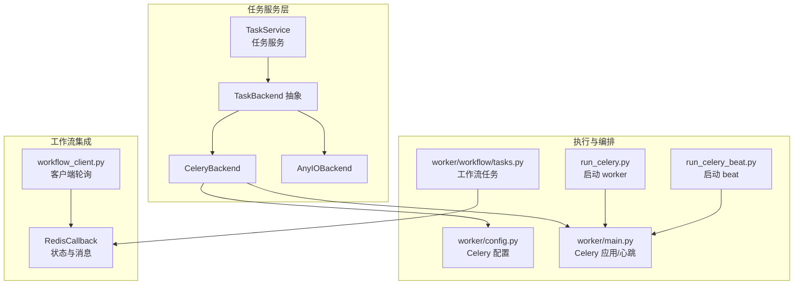
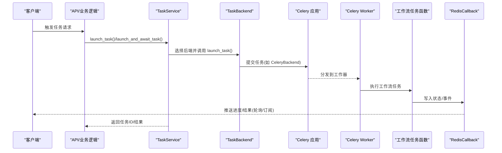
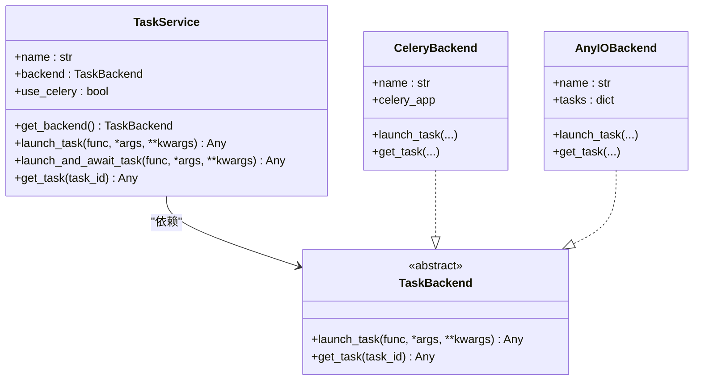
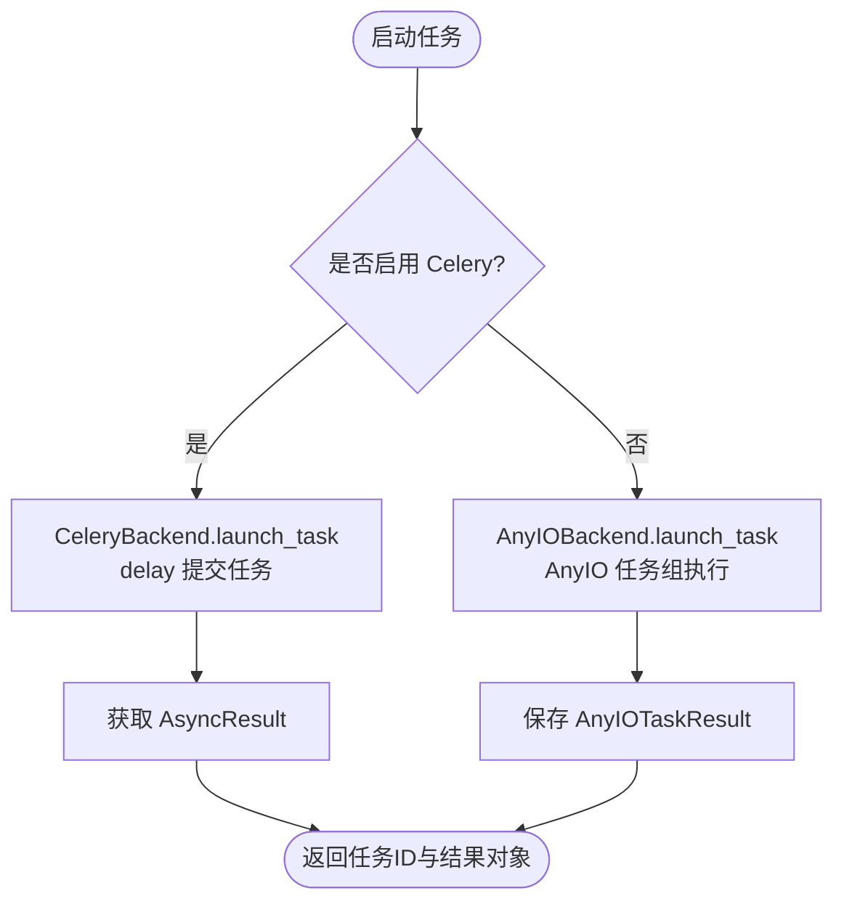
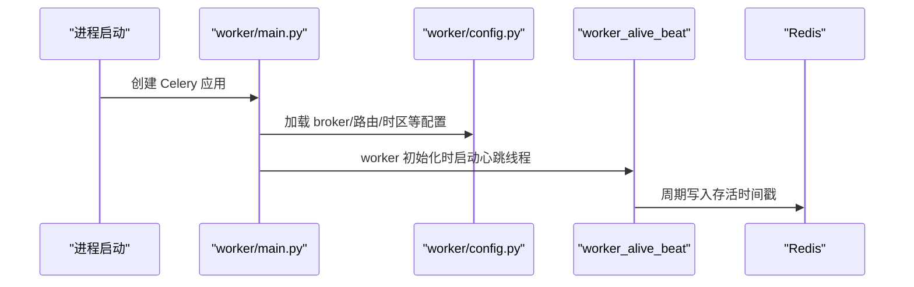
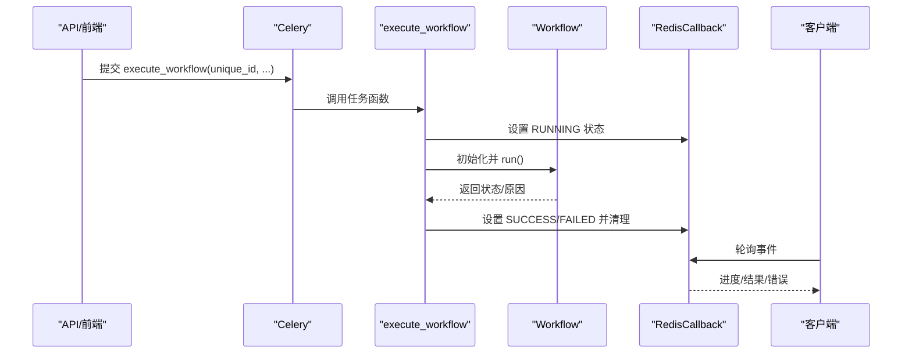
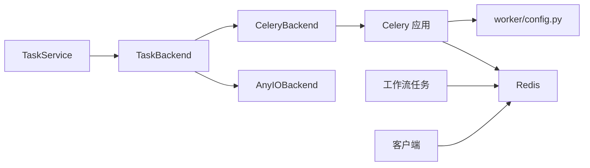

# 任务服务

<cite>
**本文引用的文件**
- [src/backend/bisheng/services/task/service.py](file://src/backend/bisheng/services/task/service.py)
- [src/backend/bisheng/services/task/backends/base.py](file://src/backend/bisheng/services/task/backends/base.py)
- [src/backend/bisheng/services/task/backends/celery.py](file://src/backend/bisheng/services/task/backends/celery.py)
- [src/backend/bisheng/services/task/backends/anyio.py](file://src/backend/bisheng/services/task/backends/anyio.py)
- [src/backend/bisheng/worker/main.py](file://src/backend/bisheng/worker/main.py)
- [src/backend/bisheng/worker/config.py](file://src/backend/bisheng/worker/config.py)
- [src/backend/bisheng/run_celery.py](file://src/backend/bisheng/run_celery.py)
- [src/backend/bisheng/run_celery_beat.py](file://src/backend/bisheng/run_celery_beat.py)
- [src/backend/bisheng/worker/workflow/tasks.py](file://src/backend/bisheng/worker/workflow/tasks.py)
- [src/backend/bisheng/chat/clients/workflow_client.py](file://src/backend/bisheng/chat/clients/workflow_client.py)
- [src/backend/bisheng/worker/workflow/redis_callback.py](file://src/backend/bisheng/worker/workflow/redis_callback.py)
</cite>

## 目录
1. [简介](#简介)
2. [项目结构](#项目结构)
3. [核心组件](#核心组件)
4. [架构总览](#架构总览)
5. [详细组件分析](#详细组件分析)
6. [依赖分析](#依赖分析)
7. [性能考虑](#性能考虑)
8. [故障排查指南](#故障排查指南)
9. [结论](#结论)
10. [附录：使用示例与最佳实践](#附录使用示例与最佳实践)

## 简介
本文件面向 Bisheng 的“任务服务”，系统性阐述其设计架构与实现原理，覆盖任务调度、执行与监控机制；详述后端支持（Celery、AnyIO）的配置与使用；文档化任务生命周期（创建、排队、执行、完成与状态跟踪）；解释错误处理与重试策略以确保任务可靠执行；并提供异步任务、定时任务与批量任务的使用示例及性能优化建议。

## 项目结构
任务服务位于后端 Python 包中，采用“服务层 + 后端抽象 + 执行后端”的分层设计：
- 服务层：统一对外暴露任务启动、等待与查询接口，并根据可用性自动选择后端。
- 后端抽象：定义统一的 TaskBackend 接口，屏蔽具体执行引擎差异。
- 执行后端：CeleryBackend（生产级分布式任务队列）、AnyIOBackend（本地异步并发）。
- 工作器与路由：Celery 应用、配置、心跳、定时任务（Beat）与工作流任务函数。
- 工作流集成：通过 Redis 回调与状态机驱动工作流任务的执行、续跑与停止。

图表来源
- [src/backend/bisheng/services/task/service.py](file://src/backend/bisheng/services/task/service.py#L27-L74)
- [src/backend/bisheng/services/task/backends/base.py](file://src/backend/bisheng/services/task/backends/base.py#L5-L12)
- [src/backend/bisheng/services/task/backends/celery.py](file://src/backend/bisheng/services/task/backends/celery.py#L8-L24)
- [src/backend/bisheng/services/task/backends/anyio.py](file://src/backend/bisheng/services/task/backends/anyio.py#L37-L70)
- [src/backend/bisheng/worker/config.py](file://src/backend/bisheng/worker/config.py#L1-L15)
- [src/backend/bisheng/worker/main.py](file://src/backend/bisheng/worker/main.py#L14-L69)
- [src/backend/bisheng/run_celery.py](file://src/backend/bisheng/run_celery.py#L1-L13)
- [src/backend/bisheng/run_celery_beat.py](file://src/backend/bisheng/run_celery_beat.py#L1-L12)
- [src/backend/bisheng/worker/workflow/tasks.py](file://src/backend/bisheng/worker/workflow/tasks.py#L85-L181)
- [src/backend/bisheng/chat/clients/workflow_client.py](file://src/backend/bisheng/chat/clients/workflow_client.py#L161-L186)
- [src/backend/bisheng/worker/workflow/redis_callback.py](file://src/backend/bisheng/worker/workflow/redis_callback.py#L249-L268)

章节来源
- [src/backend/bisheng/services/task/service.py](file://src/backend/bisheng/services/task/service.py#L1-L74)
- [src/backend/bisheng/services/task/backends/base.py](file://src/backend/bisheng/services/task/backends/base.py#L1-L13)
- [src/backend/bisheng/services/task/backends/celery.py](file://src/backend/bisheng/services/task/backends/celery.py#L1-L25)
- [src/backend/bisheng/services/task/backends/anyio.py](file://src/backend/bisheng/services/task/backends/anyio.py#L1-L71)
- [src/backend/bisheng/worker/main.py](file://src/backend/bisheng/worker/main.py#L1-L69)
- [src/backend/bisheng/worker/config.py](file://src/backend/bisheng/worker/config.py#L1-L15)
- [src/backend/bisheng/run_celery.py](file://src/backend/bisheng/run_celery.py#L1-L13)
- [src/backend/bisheng/run_celery_beat.py](file://src/backend/bisheng/run_celery_beat.py#L1-L12)
- [src/backend/bisheng/worker/workflow/tasks.py](file://src/backend/bisheng/worker/workflow/tasks.py#L1-L182)
- [src/backend/bisheng/chat/clients/workflow_client.py](file://src/backend/bisheng/chat/clients/workflow_client.py#L161-L186)
- [src/backend/bisheng/worker/workflow/redis_callback.py](file://src/backend/bisheng/worker/workflow/redis_callback.py#L249-L268)

## 核心组件
- 任务服务 TaskService：统一入口，负责选择后端、启动任务、等待结果、查询任务。
- 后端抽象 TaskBackend：定义 launch_task 与 get_task 两个核心方法。
- CeleryBackend：基于 Celery 的分布式任务执行，适合高吞吐与跨节点扩展。
- AnyIOBackend：基于 AnyIO 的本地异步并发，适合开发测试或轻量场景。
- Celery 应用与配置：包含 broker、序列化、时区、路由、Beat 调度等。
- 工作流任务：工作流的执行、续跑、停止由 Celery 任务函数实现，并通过 Redis 回调进行状态与消息推送。
- 客户端轮询：前端通过 WebSocket/长连接轮询 Redis 回调事件，实时获取执行进度与结果。

章节来源
- [src/backend/bisheng/services/task/service.py](file://src/backend/bisheng/services/task/service.py#L27-L74)
- [src/backend/bisheng/services/task/backends/base.py](file://src/backend/bisheng/services/task/backends/base.py#L5-L12)
- [src/backend/bisheng/services/task/backends/celery.py](file://src/backend/bisheng/services/task/backends/celery.py#L8-L24)
- [src/backend/bisheng/services/task/backends/anyio.py](file://src/backend/bisheng/services/task/backends/anyio.py#L37-L70)
- [src/backend/bisheng/worker/config.py](file://src/backend/bisheng/worker/config.py#L1-L15)
- [src/backend/bisheng/worker/workflow/tasks.py](file://src/backend/bisheng/worker/workflow/tasks.py#L85-L181)
- [src/backend/bisheng/chat/clients/workflow_client.py](file://src/backend/bisheng/chat/clients/workflow_client.py#L161-L186)

## 架构总览
下图展示从任务服务到执行后端、再到工作流与监控的整体流程：

图表来源
- [src/backend/bisheng/services/task/service.py](file://src/backend/bisheng/services/task/service.py#L47-L73)
- [src/backend/bisheng/services/task/backends/celery.py](file://src/backend/bisheng/services/task/backends/celery.py#L14-L21)
- [src/backend/bisheng/worker/main.py](file://src/backend/bisheng/worker/main.py#L14-L30)
- [src/backend/bisheng/worker/workflow/tasks.py](file://src/backend/bisheng/worker/workflow/tasks.py#L85-L107)
- [src/backend/bisheng/worker/workflow/redis_callback.py](file://src/backend/bisheng/worker/workflow/redis_callback.py#L249-L268)

## 详细组件分析

### 组件一：TaskService（任务服务）
- 功能职责
  - 自动检测 Celery 可用性并选择后端。
  - 对外提供 launch_task、launch_and_await_task、get_task 三个核心接口。
  - 在未启用 Celery 时回退至 AnyIO 后端。
- 关键行为
  - launch_task：将任务提交给后端，返回任务ID与结果句柄。
  - launch_and_await_task：在 Celery 可用时同步等待结果，否则直接在当前上下文执行。
  - get_task：按任务ID查询任务状态或结果对象。
- 设计要点
  - 通过后端抽象解耦执行引擎，便于替换与扩展。
  - 日志记录任务启动参数与后端选择信息，便于诊断。

图表来源
- [src/backend/bisheng/services/task/service.py](file://src/backend/bisheng/services/task/service.py#L27-L74)
- [src/backend/bisheng/services/task/backends/base.py](file://src/backend/bisheng/services/task/backends/base.py#L5-L12)
- [src/backend/bisheng/services/task/backends/celery.py](file://src/backend/bisheng/services/task/backends/celery.py#L8-L24)
- [src/backend/bisheng/services/task/backends/anyio.py](file://src/backend/bisheng/services/task/backends/anyio.py#L37-L70)

章节来源
- [src/backend/bisheng/services/task/service.py](file://src/backend/bisheng/services/task/service.py#L10-L74)

### 组件二：TaskBackend 抽象与后端实现
- TaskBackend：定义统一接口，确保不同后端的一致性。
- CeleryBackend：
  - 使用 celery_app.delay 提交任务，返回任务ID与 AsyncResult。
  - 通过 AsyncResult 查询任务状态与结果。
- AnyIOBackend：
  - 使用 AnyIO 任务组并发执行协程任务。
  - 自行维护任务字典，返回自定义 AnyIOTaskResult 对象，具备状态、结果与异常属性。

图表来源
- [src/backend/bisheng/services/task/service.py](file://src/backend/bisheng/services/task/service.py#L38-L45)
- [src/backend/bisheng/services/task/backends/celery.py](file://src/backend/bisheng/services/task/backends/celery.py#L14-L21)
- [src/backend/bisheng/services/task/backends/anyio.py](file://src/backend/bisheng/services/task/backends/anyio.py#L43-L67)

章节来源
- [src/backend/bisheng/services/task/backends/base.py](file://src/backend/bisheng/services/task/backends/base.py#L1-L13)
- [src/backend/bisheng/services/task/backends/celery.py](file://src/backend/bisheng/services/task/backends/celery.py#L1-L25)
- [src/backend/bisheng/services/task/backends/anyio.py](file://src/backend/bisheng/services/task/backends/anyio.py#L1-L71)

### 组件三：Celery 应用、配置与心跳
- 应用创建：集中于 worker/main.py，初始化 Celery 实例并加载 worker/config.py。
- 配置项：broker_url、序列化、时区、路由、Beat 调度等均来自配置模块。
- 心跳机制：worker 初始化时启动后台线程，周期性向 Redis 写入存活时间戳，用于健康检查与队列监控。
- 启动方式：run_celery.py 与 run_celery_beat.py 分别启动 worker 与 beat。

图表来源
- [src/backend/bisheng/worker/main.py](file://src/backend/bisheng/worker/main.py#L14-L69)
- [src/backend/bisheng/worker/config.py](file://src/backend/bisheng/worker/config.py#L1-L15)
- [src/backend/bisheng/run_celery.py](file://src/backend/bisheng/run_celery.py#L1-L13)
- [src/backend/bisheng/run_celery_beat.py](file://src/backend/bisheng/run_celery_beat.py#L1-L12)

章节来源
- [src/backend/bisheng/worker/main.py](file://src/backend/bisheng/worker/main.py#L1-L69)
- [src/backend/bisheng/worker/config.py](file://src/backend/bisheng/worker/config.py#L1-L15)
- [src/backend/bisheng/run_celery.py](file://src/backend/bisheng/run_celery.py#L1-L13)
- [src/backend/bisheng/run_celery_beat.py](file://src/backend/bisheng/run_celery_beat.py#L1-L12)

### 组件四：工作流任务与状态管理
- 任务函数：
  - execute_workflow：创建工作流实例并运行，记录遥测事件。
  - continue_workflow：在输入阶段恢复执行，从 Redis 读取用户输入。
  - stop_workflow：停止运行中的工作流，更新状态并清理全局对象。
- 全局状态：
  - 使用 _global_workflow 字典缓存处于 INPUT 状态的工作流对象，以便后续续跑。
- Redis 回调：
  - RedisCallback 负责状态写入、事件推送、数据读取与对象清理。
  - 客户端通过 workflow_client.py 持续拉取事件，直到结束或超时。

图表来源
- [src/backend/bisheng/worker/workflow/tasks.py](file://src/backend/bisheng/worker/workflow/tasks.py#L53-L82)
- [src/backend/bisheng/worker/workflow/tasks.py](file://src/backend/bisheng/worker/workflow/tasks.py#L85-L107)
- [src/backend/bisheng/worker/workflow/tasks.py](file://src/backend/bisheng/worker/workflow/tasks.py#L110-L132)
- [src/backend/bisheng/worker/workflow/tasks.py](file://src/backend/bisheng/worker/workflow/tasks.py#L160-L181)
- [src/backend/bisheng/worker/workflow/redis_callback.py](file://src/backend/bisheng/worker/workflow/redis_callback.py#L249-L268)
- [src/backend/bisheng/chat/clients/workflow_client.py](file://src/backend/bisheng/chat/clients/workflow_client.py#L161-L186)

章节来源
- [src/backend/bisheng/worker/workflow/tasks.py](file://src/backend/bisheng/worker/workflow/tasks.py#L1-L182)
- [src/backend/bisheng/worker/workflow/redis_callback.py](file://src/backend/bisheng/worker/workflow/redis_callback.py#L249-L268)
- [src/backend/bisheng/chat/clients/workflow_client.py](file://src/backend/bisheng/chat/clients/workflow_client.py#L161-L186)

## 依赖分析
- 低耦合高内聚：TaskService 仅依赖 TaskBackend 抽象，不直接关心 Celery 或 AnyIO 的细节。
- 外部依赖：
  - Celery：作为分布式任务执行引擎，依赖 Redis 作为 broker 与结果后端。
  - Redis：用于工作流状态存储、事件推送与心跳检测。
  - FastAPI/WebSocket：客户端轮询与事件推送。
- 潜在风险：
  - Celery 不可用时自动降级 AnyIO，但 AnyIO 不具备分布式能力。
  - 工作流长时间无状态更新会触发失败与清理，需关注超时阈值与队列负载。

图表来源
- [src/backend/bisheng/services/task/service.py](file://src/backend/bisheng/services/task/service.py#L27-L45)
- [src/backend/bisheng/services/task/backends/celery.py](file://src/backend/bisheng/services/task/backends/celery.py#L8-L24)
- [src/backend/bisheng/services/task/backends/anyio.py](file://src/backend/bisheng/services/task/backends/anyio.py#L37-L70)
- [src/backend/bisheng/worker/config.py](file://src/backend/bisheng/worker/config.py#L1-L15)
- [src/backend/bisheng/worker/workflow/tasks.py](file://src/backend/bisheng/worker/workflow/tasks.py#L85-L107)
- [src/backend/bisheng/chat/clients/workflow_client.py](file://src/backend/bisheng/chat/clients/workflow_client.py#L161-L186)

章节来源
- [src/backend/bisheng/services/task/service.py](file://src/backend/bisheng/services/task/service.py#L1-L74)
- [src/backend/bisheng/services/task/backends/celery.py](file://src/backend/bisheng/services/task/backends/celery.py#L1-L25)
- [src/backend/bisheng/services/task/backends/anyio.py](file://src/backend/bisheng/services/task/backends/anyio.py#L1-L71)
- [src/backend/bisheng/worker/config.py](file://src/backend/bisheng/worker/config.py#L1-L15)
- [src/backend/bisheng/worker/workflow/tasks.py](file://src/backend/bisheng/worker/workflow/tasks.py#L1-L182)
- [src/backend/bisheng/chat/clients/workflow_client.py](file://src/backend/bisheng/chat/clients/workflow_client.py#L161-L186)

## 性能考虑
- 并发与池化
  - Celery worker 支持多线程池与队列隔离，可通过启动参数设置并发数与队列名称，满足高吞吐与资源隔离需求。
- 队列与路由
  - 通过任务路由将不同类型任务分配到不同队列，避免相互干扰，提升整体吞吐。
- 心跳与健康检查
  - worker 心跳写入 Redis，可用于监控队列健康与节点存活，辅助扩缩容决策。
- AnyIO 后端
  - 适用于单机并发与开发测试，避免跨进程/跨节点开销；生产环境建议优先使用 Celery。
- 工作流超时与清理
  - 工作流长时间无状态更新会触发失败与清理，合理设置超时阈值与队列负载，避免资源泄漏。

章节来源
- [src/backend/bisheng/run_celery.py](file://src/backend/bisheng/run_celery.py#L4-L5)
- [src/backend/bisheng/worker/main.py](file://src/backend/bisheng/worker/main.py#L33-L47)
- [src/backend/bisheng/worker/config.py](file://src/backend/bisheng/worker/config.py#L10-L14)
- [src/backend/bisheng/worker/workflow/tasks.py](file://src/backend/bisheng/worker/workflow/tasks.py#L25-L51)

## 故障排查指南
- 任务长时间无响应
  - 现象：工作流状态长时间未更新，最终被标记为失败并清理。
  - 排查：检查 Celery worker 是否正常、队列是否积压、Redis 是否可达。
- Worker 忙碌/阻塞
  - 现象：等待输入状态超过阈值后被标记为忙碌并返回错误。
  - 排查：增加 worker 并发、优化任务耗时、检查队列负载。
- 任务未找到或过期
  - 现象：继续执行或停止时提示工作流对象不存在。
  - 排查：确认 Redis 中工作流数据未过期、唯一ID一致、回调通道正常。
- Celery 不可用降级
  - 现象：自动切换到 AnyIO 后端，任务在当前进程中执行。
  - 排查：确认 Celery 依赖与配置正确，必要时启用 Celery 以获得分布式能力。

章节来源
- [src/backend/bisheng/worker/workflow/redis_callback.py](file://src/backend/bisheng/worker/workflow/redis_callback.py#L255-L268)
- [src/backend/bisheng/worker/workflow/tasks.py](file://src/backend/bisheng/worker/workflow/tasks.py#L160-L181)
- [src/backend/bisheng/services/task/service.py](file://src/backend/bisheng/services/task/service.py#L10-L24)

## 结论
任务服务通过“服务层 + 后端抽象 + 执行后端”的分层设计，实现了对 Celery 与 AnyIO 的统一接入，既满足生产级分布式任务的高吞吐与可扩展性，又兼顾开发测试的便捷性。结合 Redis 回调与心跳机制，系统实现了工作流任务的可靠执行与可观测性。建议在生产环境中优先使用 Celery，并配合合理的队列路由、并发与超时策略，以获得最佳性能与稳定性。

## 附录：使用示例与最佳实践
- 异步任务处理
  - 使用 TaskService.launch_task 提交任务，后端自动选择 Celery 或 AnyIO。
  - 若需要同步等待结果，使用 TaskService.launch_and_await_task。
- 定时任务
  - 通过 run_celery_beat.py 启动 Beat，结合 worker/config.py 中的 beat_schedule 配置周期任务。
- 批量任务
  - 将多个子任务封装为单个任务函数，或使用 Celery 的链式/组合模式，减少网络往返与队列压力。
- 最佳实践
  - 生产环境启用 Celery 并配置队列路由与并发。
  - 为工作流设置合理的超时与重试策略，避免长时间占用资源。
  - 使用 Redis 回调进行状态与事件推送，前端轮询或订阅以降低延迟。

章节来源
- [src/backend/bisheng/services/task/service.py](file://src/backend/bisheng/services/task/service.py#L47-L73)
- [src/backend/bisheng/run_celery_beat.py](file://src/backend/bisheng/run_celery_beat.py#L1-L12)
- [src/backend/bisheng/worker/config.py](file://src/backend/bisheng/worker/config.py#L14-L15)
- [src/backend/bisheng/worker/workflow/tasks.py](file://src/backend/bisheng/worker/workflow/tasks.py#L53-L82)