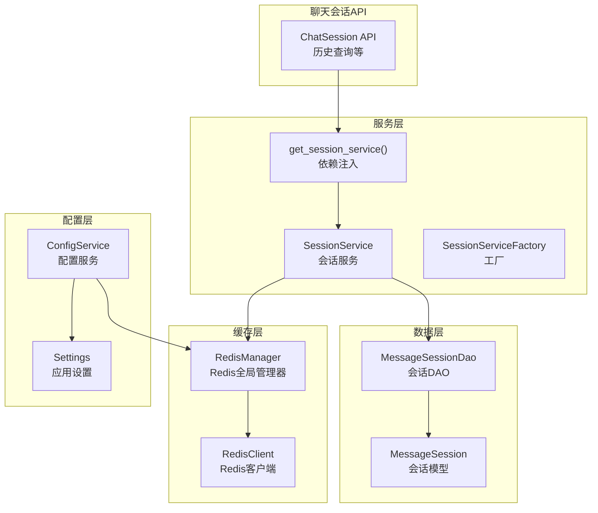
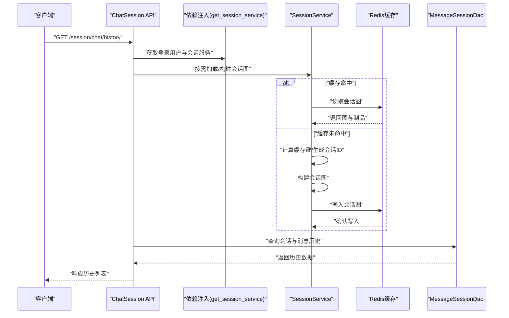
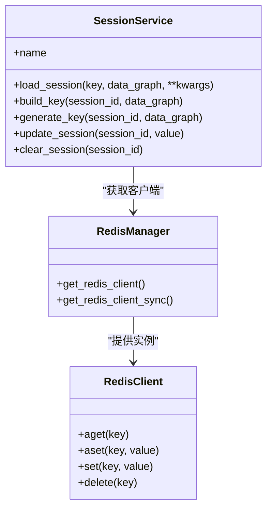
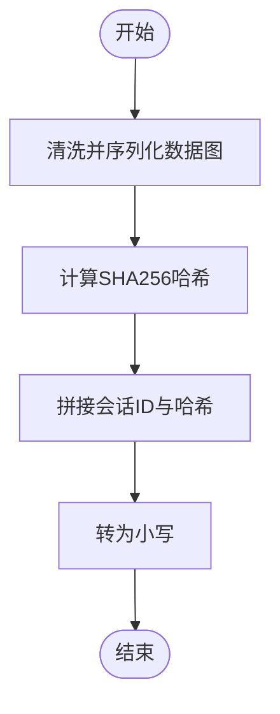
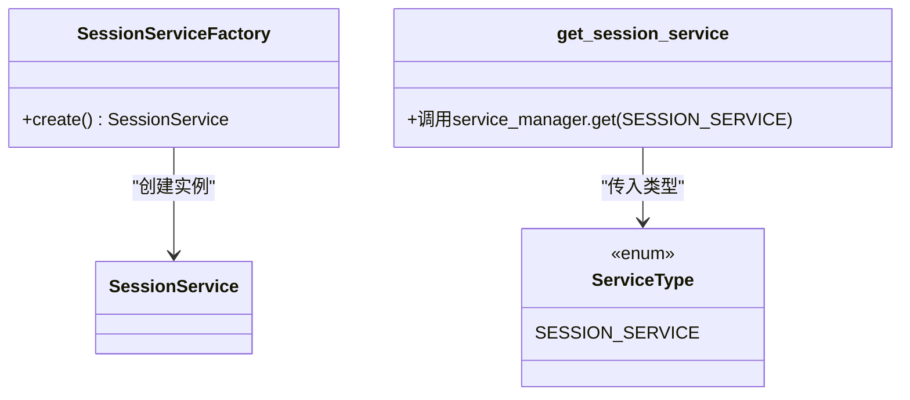
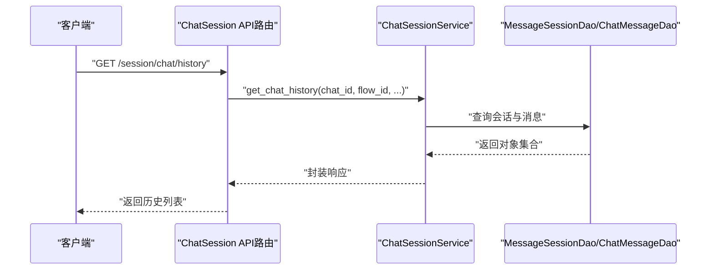
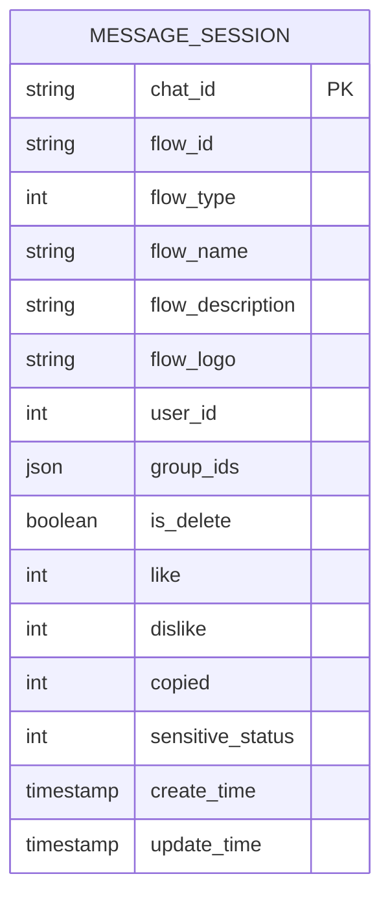
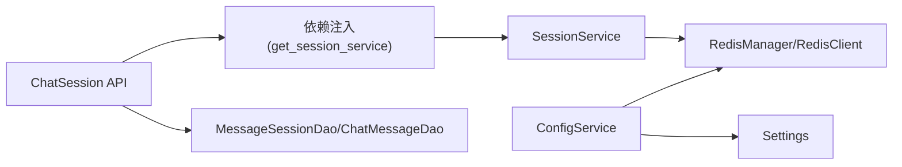

# 会话服务

<cite>
**本文引用的文件**
- [src/backend/bisheng/services/session/service.py](file://src/backend/bisheng/services/session/service.py)
- [src/backend/bisheng/services/session/utils.py](file://src/backend/bisheng/services/session/utils.py)
- [src/backend/bisheng/services/session/factory.py](file://src/backend/bisheng/services/session/factory.py)
- [src/backend/bisheng/services/deps.py](file://src/backend/bisheng/services/deps.py)
- [src/backend/bisheng/services/schema.py](file://src/backend/bisheng/services/schema.py)
- [src/backend/bisheng/chat_session/api/router.py](file://src/backend/bisheng/chat_session/api/router.py)
- [src/backend/bisheng/chat_session/domain/chat.py](file://src/backend/bisheng/chat_session/domain/chat.py)
- [src/backend/bisheng/database/models/session.py](file://src/backend/bisheng/database/models/session.py)
- [src/backend/bisheng/core/cache/redis_manager.py](file://src/backend/bisheng/core/cache/redis_manager.py)
- [src/backend/bisheng/common/services/config_service.py](file://src/backend/bisheng/common/services/config_service.py)
- [src/backend/bisheng/core/config/settings.py](file://src/backend/bisheng/core/config/settings.py)
</cite>

## 目录
1. [简介](#简介)
2. [项目结构](#项目结构)
3. [核心组件](#核心组件)
4. [架构总览](#架构总览)
5. [详细组件分析](#详细组件分析)
6. [依赖分析](#依赖分析)
7. [性能考虑](#性能考虑)
8. [故障排查指南](#故障排查指南)
9. [结论](#结论)
10. [附录](#附录)

## 简介
本文件面向 Bisheng 会话服务，系统性阐述其核心功能与实现机制，覆盖会话创建、维护与销毁流程；会话状态管理（数据存储、状态同步、并发控制）；配置项（会话超时、存储策略、清理机制）；与认证服务的协作；多设备/多标签页支持；扩展实践（自定义会话存储、分布式会话支持）；以及在用户体验与安全方面的价值。

## 项目结构
围绕“会话服务”的关键目录与文件如下：
- 服务层：会话服务、工厂、依赖注入
- 数据访问层：消息会话 DAO 与模型
- 缓存层：Redis 客户端与全局管理器
- 配置层：应用设置与配置服务
- 聊天会话 API：对外暴露历史查询等接口

图表来源
- [src/backend/bisheng/services/session/service.py](file://src/backend/bisheng/services/session/service.py#L10-L50)
- [src/backend/bisheng/services/session/factory.py](file://src/backend/bisheng/services/session/factory.py#L8-L15)
- [src/backend/bisheng/services/deps.py](file://src/backend/bisheng/services/deps.py#L38-L49)
- [src/backend/bisheng/database/models/session.py](file://src/backend/bisheng/database/models/session.py#L41-L90)
- [src/backend/bisheng/core/cache/redis_manager.py](file://src/backend/bisheng/core/cache/redis_manager.py#L48-L82)
- [src/backend/bisheng/common/services/config_service.py](file://src/backend/bisheng/common/services/config_service.py#L140-L174)
- [src/backend/bisheng/core/config/settings.py](file://src/backend/bisheng/core/config/settings.py#L237-L258)
- [src/backend/bisheng/chat_session/api/router.py](file://src/backend/bisheng/chat_session/api/router.py#L17-L66)

章节来源
- [src/backend/bisheng/services/session/service.py](file://src/backend/bisheng/services/session/service.py#L10-L50)
- [src/backend/bisheng/services/session/factory.py](file://src/backend/bisheng/services/session/factory.py#L8-L15)
- [src/backend/bisheng/services/deps.py](file://src/backend/bisheng/services/deps.py#L38-L49)
- [src/backend/bisheng/database/models/session.py](file://src/backend/bisheng/database/models/session.py#L41-L90)
- [src/backend/bisheng/core/cache/redis_manager.py](file://src/backend/bisheng/core/cache/redis_manager.py#L48-L82)
- [src/backend/bisheng/common/services/config_service.py](file://src/backend/bisheng/common/services/config_service.py#L140-L174)
- [src/backend/bisheng/core/config/settings.py](file://src/backend/bisheng/core/config/settings.py#L237-L258)
- [src/backend/bisheng/chat_session/api/router.py](file://src/backend/bisheng/chat_session/api/router.py#L17-L66)

## 核心组件
- 会话服务（SessionService）
  - 负责会话图构建、缓存键生成与读写、会话更新与清理
  - 使用 Redis 作为缓存后端
- 会话服务工厂（SessionServiceFactory）
  - 提供会话服务实例化入口
- 依赖注入（get_session_service）
  - 通过服务管理器获取会话服务实例
- 消息会话 DAO 与模型（MessageSessionDao/MessageSession）
  - 提供会话记录的持久化、查询与统计
- Redis 管理器（RedisManager/RedisClient）
  - 提供 Redis 连接生命周期管理与统一访问接口
- 配置服务（ConfigService/Settings）
  - 提供应用配置读取与环境变量解析，包含 Redis 地址等

章节来源
- [src/backend/bisheng/services/session/service.py](file://src/backend/bisheng/services/session/service.py#L10-L50)
- [src/backend/bisheng/services/session/factory.py](file://src/backend/bisheng/services/session/factory.py#L8-L15)
- [src/backend/bisheng/services/deps.py](file://src/backend/bisheng/services/deps.py#L38-L49)
- [src/backend/bisheng/database/models/session.py](file://src/backend/bisheng/database/models/session.py#L41-L90)
- [src/backend/bisheng/core/cache/redis_manager.py](file://src/backend/bisheng/core/cache/redis_manager.py#L48-L82)
- [src/backend/bisheng/common/services/config_service.py](file://src/backend/bisheng/common/services/config_service.py#L140-L174)
- [src/backend/bisheng/core/config/settings.py](file://src/backend/bisheng/core/config/settings.py#L237-L258)

## 架构总览
会话服务以“缓存优先、持久化兜底”的方式工作：首次加载时根据数据图与会话 ID 计算缓存键，若命中则直接返回；未命中则构建会话图并写入缓存；同时通过 DAO 将会话元信息持久化到数据库。对外通过聊天会话 API 暴露历史查询能力，并与认证依赖结合进行用户校验。

图表来源
- [src/backend/bisheng/chat_session/api/router.py](file://src/backend/bisheng/chat_session/api/router.py#L20-L29)
- [src/backend/bisheng/services/deps.py](file://src/backend/bisheng/services/deps.py#L38-L49)
- [src/backend/bisheng/services/session/service.py](file://src/backend/bisheng/services/session/service.py#L16-L32)
- [src/backend/bisheng/database/models/session.py](file://src/backend/bisheng/database/models/session.py#L86-L90)

## 详细组件分析

### 会话服务（SessionService）
- 功能职责
  - 加载会话：优先从缓存读取，未命中则构建并写入缓存
  - 键生成：基于会话 ID 与数据图哈希生成唯一键
  - 更新与清理：提供同步更新与删除会话缓存的方法
- 关键点
  - 缓存键由会话 ID 与数据图 JSON 的哈希组合而成，确保相同图内容复用缓存
  - 未传入会话 ID 时自动生成短随机 ID，保证无 ID 场景下的可区分性
  - 使用异步/同步 Redis 客户端接口，兼顾并发场景

图表来源
- [src/backend/bisheng/services/session/service.py](file://src/backend/bisheng/services/session/service.py#L10-L50)
- [src/backend/bisheng/core/cache/redis_manager.py](file://src/backend/bisheng/core/cache/redis_manager.py#L48-L82)

章节来源
- [src/backend/bisheng/services/session/service.py](file://src/backend/bisheng/services/session/service.py#L10-L50)

### 会话键生成与会话 ID 生成
- 键生成规则
  - 对数据图进行清洗与标准化序列化，计算 SHA256 哈希
  - 将哈希与会话 ID 组合形成最终键，小写化处理
- 会话 ID 生成
  - 默认长度为 6，使用随机字符集生成，避免冲突
- 作用
  - 保证相同图内容在不同会话中共享缓存，提升性能
  - 无会话 ID 时自动生成，确保可追踪性

图表来源
- [src/backend/bisheng/services/session/utils.py](file://src/backend/bisheng/services/session/utils.py#L13-L19)

章节来源
- [src/backend/bisheng/services/session/utils.py](file://src/backend/bisheng/services/session/utils.py#L9-L19)

### 会话服务工厂与依赖注入
- 工厂模式
  - SessionServiceFactory 负责创建 SessionService 实例
- 依赖注入
  - 通过 get_session_service 从服务管理器获取实例
  - 在业务模块中以依赖参数形式注入，便于测试与替换

图表来源
- [src/backend/bisheng/services/session/factory.py](file://src/backend/bisheng/services/session/factory.py#L8-L15)
- [src/backend/bisheng/services/schema.py](file://src/backend/bisheng/services/schema.py#L14-L16)
- [src/backend/bisheng/services/deps.py](file://src/backend/bisheng/services/deps.py#L38-L49)

章节来源
- [src/backend/bisheng/services/session/factory.py](file://src/backend/bisheng/services/session/factory.py#L8-L15)
- [src/backend/bisheng/services/schema.py](file://src/backend/bisheng/services/schema.py#L14-L16)
- [src/backend/bisheng/services/deps.py](file://src/backend/bisheng/services/deps.py#L38-L49)

### 聊天会话 API 与历史查询
- 接口职责
  - 获取会话历史：校验 chat_id 与 flow_id，查询消息并封装响应
  - 按会话 ID 查询消息：限制数量并转换为工作站消息格式
  - 用户反馈打点：记录消息反馈事件
- 与会话服务协作
  - 会话历史查询依赖 MessageSessionDao 与 ChatMessageDao
  - 会话服务负责会话图的缓存与加载，API 层仅做数据聚合与权限校验

图表来源
- [src/backend/bisheng/chat_session/api/router.py](file://src/backend/bisheng/chat_session/api/router.py#L20-L29)
- [src/backend/bisheng/chat_session/domain/chat.py](file://src/backend/bisheng/chat_session/domain/chat.py#L14-L29)

章节来源
- [src/backend/bisheng/chat_session/api/router.py](file://src/backend/bisheng/chat_session/api/router.py#L17-L66)
- [src/backend/bisheng/chat_session/domain/chat.py](file://src/backend/bisheng/chat_session/domain/chat.py#L10-L30)

### 数据模型与持久化
- MessageSession 模型
  - 主键 chat_id 表示会话唯一标识
  - 包含 flow_id、flow_type、flow_name、user_id 等字段
  - 提供插入、查询、过滤、计数、软删除等方法
- DAO 方法族
  - 同步与异步接口并存，满足不同运行时需求
  - 支持多条件过滤、分页、排序与批量操作

图表来源
- [src/backend/bisheng/database/models/session.py](file://src/backend/bisheng/database/models/session.py#L18-L43)

章节来源
- [src/backend/bisheng/database/models/session.py](file://src/backend/bisheng/database/models/session.py#L41-L90)

### 缓存与配置
- Redis 管理器
  - 提供异步/同步初始化与清理，确保连接生命周期可控
  - 通过应用上下文注册与获取 Redis 客户端
- 配置服务
  - 从 YAML 读取配置，支持环境变量占位符解析
  - 提供 Redis 地址等关键配置项，用于初始化缓存与任务队列

章节来源
- [src/backend/bisheng/core/cache/redis_manager.py](file://src/backend/bisheng/core/cache/redis_manager.py#L48-L82)
- [src/backend/bisheng/common/services/config_service.py](file://src/backend/bisheng/common/services/config_service.py#L74-L96)
- [src/backend/bisheng/core/config/settings.py](file://src/backend/bisheng/core/config/settings.py#L237-L258)

## 依赖分析
- 组件耦合
  - SessionService 依赖 RedisManager/RedisClient 提供缓存能力
  - ChatSession API 通过依赖注入获取会话服务，再调用 DAO 完成数据查询
  - 服务类型枚举与依赖函数集中于 services 层，便于统一管理
- 外部依赖
  - Redis 作为缓存后端，承担高并发下的会话图缓存
  - 数据库承载会话元信息与消息历史的持久化

图表来源
- [src/backend/bisheng/services/deps.py](file://src/backend/bisheng/services/deps.py#L38-L49)
- [src/backend/bisheng/services/session/service.py](file://src/backend/bisheng/services/session/service.py#L13-L14)
- [src/backend/bisheng/core/cache/redis_manager.py](file://src/backend/bisheng/core/cache/redis_manager.py#L48-L82)
- [src/backend/bisheng/common/services/config_service.py](file://src/backend/bisheng/common/services/config_service.py#L140-L174)
- [src/backend/bisheng/core/config/settings.py](file://src/backend/bisheng/core/config/settings.py#L237-L258)

章节来源
- [src/backend/bisheng/services/deps.py](file://src/backend/bisheng/services/deps.py#L38-L49)
- [src/backend/bisheng/services/session/service.py](file://src/backend/bisheng/services/session/service.py#L13-L14)
- [src/backend/bisheng/core/cache/redis_manager.py](file://src/backend/bisheng/core/cache/redis_manager.py#L48-L82)
- [src/backend/bisheng/common/services/config_service.py](file://src/backend/bisheng/common/services/config_service.py#L140-L174)
- [src/backend/bisheng/core/config/settings.py](file://src/backend/bisheng/core/config/settings.py#L237-L258)

## 性能考虑
- 缓存命中率
  - 通过数据图哈希与会话 ID 组合键，相同图内容可跨会话复用缓存
  - 首次构建成本由缓存摊销，后续请求延迟显著降低
- 并发与一致性
  - Redis 客户端提供异步/同步接口，适合高并发场景
  - 会话更新与清理采用直接键操作，避免复杂事务开销
- 存储策略
  - 会话图缓存在 Redis，元信息持久化在数据库，兼顾性能与可靠性
- 清理机制
  - 明确的清理方法可用于释放内存占用，建议结合业务生命周期策略使用

[本节为通用性能讨论，不直接分析具体文件]

## 故障排查指南
- 缓存不可用
  - 检查 RedisManager 初始化是否成功，确认 Redis 地址配置正确
  - 观察异步/同步客户端获取路径是否抛出异常
- 会话历史为空
  - 校验 chat_id 与 flow_id 是否匹配，确认会话存在且未被软删除
  - 检查消息 DAO 查询条件与分页参数
- 依赖注入失败
  - 确认服务类型枚举与工厂注册一致
  - 检查服务管理器上下文是否已注册对应服务

章节来源
- [src/backend/bisheng/core/cache/redis_manager.py](file://src/backend/bisheng/core/cache/redis_manager.py#L48-L82)
- [src/backend/bisheng/chat_session/domain/chat.py](file://src/backend/bisheng/chat_session/domain/chat.py#L17-L21)
- [src/backend/bisheng/services/deps.py](file://src/backend/bisheng/services/deps.py#L38-L49)

## 结论
Bisheng 会话服务以“缓存优先、持久化兜底”为核心设计，结合 Redis 实现高性能的会话图缓存，配合 DAO 完成会话元信息与历史数据的持久化。通过依赖注入与工厂模式实现松耦合，便于扩展与替换。在用户体验方面，显著降低会话加载延迟；在安全性方面，配合认证依赖与权限校验，保障接口访问安全。

[本节为总结性内容，不直接分析具体文件]

## 附录

### 会话生命周期与状态管理
- 创建
  - 首次加载时根据数据图与会话 ID 生成缓存键，构建会话图并写入缓存
- 维护
  - 通过 update_session 更新缓存值；键命名规则确保幂等与可追踪
- 销毁
  - 通过 clear_session 删除缓存键，释放内存占用

章节来源
- [src/backend/bisheng/services/session/service.py](file://src/backend/bisheng/services/session/service.py#L16-L32)
- [src/backend/bisheng/services/session/service.py](file://src/backend/bisheng/services/session/service.py#L45-L49)

### 与认证服务的协作
- ChatSession API 使用用户依赖获取登录用户信息，确保历史查询与反馈打点具备身份上下文
- 会话服务本身不直接处理认证，但通过依赖注入与 API 层协作完成鉴权

章节来源
- [src/backend/bisheng/chat_session/api/router.py](file://src/backend/bisheng/chat_session/api/router.py#L26-L28)
- [src/backend/bisheng/chat_session/api/router.py](file://src/backend/bisheng/chat_session/api/router.py#L44-L64)

### 多设备与多标签页支持
- 会话 ID 与数据图哈希共同决定缓存键，相同图内容在不同设备/标签页可共享缓存
- 若需要严格隔离，可在数据图中加入设备/标签页标识，从而生成不同键

[本节为概念性说明，不直接分析具体文件]

### 扩展实践
- 自定义会话存储
  - 替换 Redis 客户端为其他缓存实现（如本地内存、分布式缓存），保持键生成与读写接口一致
- 分布式会话支持
  - 通过统一的 Redis 集群或云托管 Redis，实现多节点共享缓存
  - 配合配置服务动态切换 Redis 地址，满足生产部署需求

章节来源
- [src/backend/bisheng/core/cache/redis_manager.py](file://src/backend/bisheng/core/cache/redis_manager.py#L48-L82)
- [src/backend/bisheng/common/services/config_service.py](file://src/backend/bisheng/common/services/config_service.py#L74-L96)