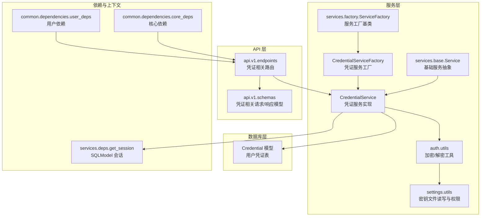
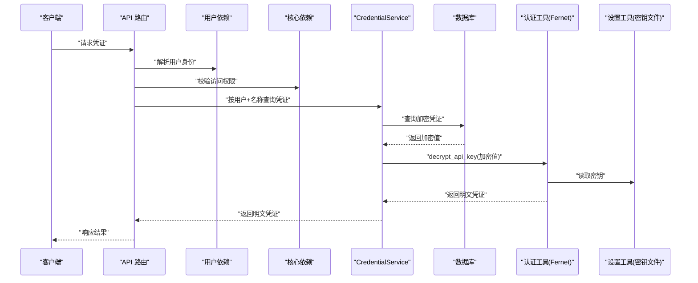
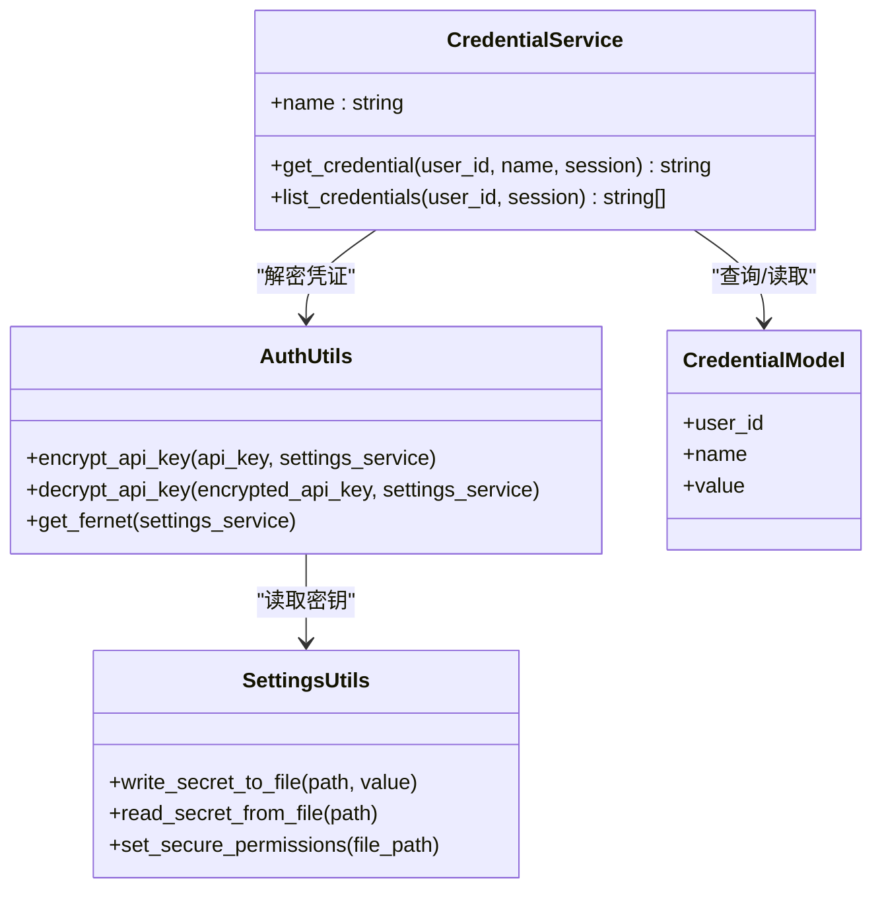
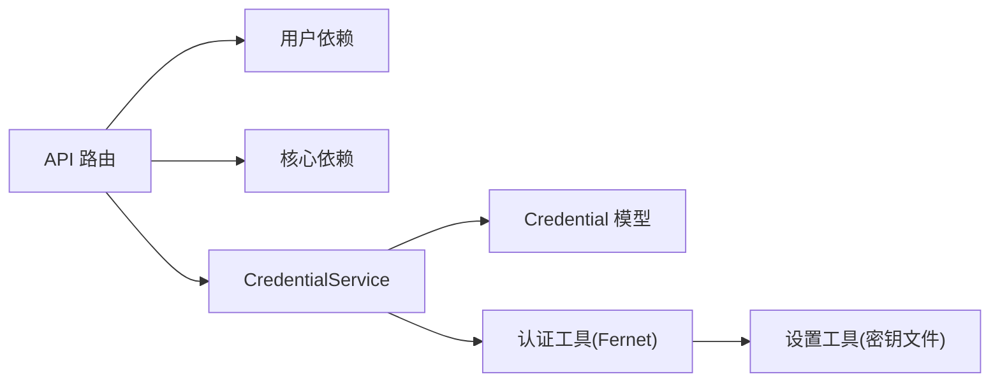

# 凭证服务

<cite>
**本文引用的文件**
- [src/backend/bisheng/services/credentials/service.py](file://src/backend/bisheng/services/credentials/service.py)
- [src/backend/bisheng/services/credentials/factory.py](file://src/backend/bisheng/services/credentials/factory.py)
- [src/backend/bisheng/services/auth/utils.py](file://src/backend/bisheng/services/auth/utils.py)
- [src/backend/bisheng/services/settings/utils.py](file://src/backend/bisheng/services/settings/utils.py)
- [src/backend/bisheng/services/base.py](file://src/backend/bisheng/services/base.py)
- [src/backend/bisheng/services/deps.py](file://src/backend/bisheng/services/deps.py)
- [src/backend/bisheng/services/factory.py](file://src/backend/bisheng/services/factory.py)
- [src/backend/bisheng/database/models/credential/model.py](file://src/backend/bisheng/database/models/credential/model.py)
- [src/backend/bisheng/api/v1/endpoints.py](file://src/backend/bisheng/api/v1/endpoints.py)
- [src/backend/bisheng/api/v1/schemas.py](file://src/backend/bisheng/api/v1/schemas.py)
- [src/backend/bisheng/common/dependencies/user_deps.py](file://src/backend/bisheng/common/dependencies/user_deps.py)
- [src/backend/bisheng/common/dependencies/core_deps.py](file://src/backend/bisheng/common/dependencies/core_deps.py)
- [src/backend/bisheng/common/errcode/credential.py](file://src/backend/bisheng/common/errcode/credential.py)
- [src/backend/bisheng/common/exceptions/auth.py](file://src/backend/bisheng/common/exceptions/auth.py)
- [src/backend/bisheng/main.py](file://src/backend/bisheng/main.py)
</cite>

## 目录
1. [简介](#简介)
2. [项目结构](#项目结构)
3. [核心组件](#核心组件)
4. [架构总览](#架构总览)
5. [详细组件分析](#详细组件分析)
6. [依赖关系分析](#依赖关系分析)
7. [性能考虑](#性能考虑)
8. [故障排查指南](#故障排查指南)
9. [结论](#结论)
10. [附录](#附录)

## 简介
本技术文档围绕 Bisheng 的“凭证服务”展开，系统性阐述其设计原理、安全机制（敏感信息存储、加密保护、访问控制）、管理流程（创建、更新、删除、审计）以及与认证系统的集成方式。同时覆盖多租户与多环境支持、使用示例（第三方服务凭证的存储与访问）、以及在数据安全与合规性方面的意义。

## 项目结构
凭证服务位于后端服务层，采用“服务工厂 + 服务实现”的模式，并通过依赖注入与设置服务协同完成密钥管理与加解密。数据库模型定义了凭证实体，API 层提供对外接口，认证工具负责对称加密/解密，设置工具负责密钥文件的读写与权限设置。

图表来源
- [src/backend/bisheng/services/credentials/service.py](file://src/backend/bisheng/services/credentials/service.py#L15-L37)
- [src/backend/bisheng/services/credentials/factory.py](file://src/backend/bisheng/services/credentials/factory.py#L10-L15)
- [src/backend/bisheng/services/auth/utils.py](file://src/backend/bisheng/services/auth/utils.py#L308-L331)
- [src/backend/bisheng/services/settings/utils.py](file://src/backend/bisheng/services/settings/utils.py#L32-L43)
- [src/backend/bisheng/database/models/credential/model.py](file://src/backend/bisheng/database/models/credential/model.py)
- [src/backend/bisheng/api/v1/endpoints.py](file://src/backend/bisheng/api/v1/endpoints.py)
- [src/backend/bisheng/api/v1/schemas.py](file://src/backend/bisheng/api/v1/schemas.py)
- [src/backend/bisheng/services/deps.py](file://src/backend/bisheng/services/deps.py)
- [src/backend/bisheng/common/dependencies/user_deps.py](file://src/backend/bisheng/common/dependencies/user_deps.py)
- [src/backend/bisheng/common/dependencies/core_deps.py](file://src/backend/bisheng/common/dependencies/core_deps.py)

章节来源
- [src/backend/bisheng/services/credentials/service.py](file://src/backend/bisheng/services/credentials/service.py#L1-L38)
- [src/backend/bisheng/services/credentials/factory.py](file://src/backend/bisheng/services/credentials/factory.py#L1-L16)
- [src/backend/bisheng/services/auth/utils.py](file://src/backend/bisheng/services/auth/utils.py#L308-L331)
- [src/backend/bisheng/services/settings/utils.py](file://src/backend/bisheng/services/settings/utils.py#L1-L43)
- [src/backend/bisheng/database/models/credential/model.py](file://src/backend/bisheng/database/models/credential/model.py)

## 核心组件
- 凭证服务实现：提供按用户与名称查询凭证值的能力，并在返回前进行解密；同时提供列出用户所有凭证名称的能力。
- 凭证服务工厂：用于创建凭证服务实例，依赖设置服务以获取密钥配置。
- 加密/解密工具：基于对称加密算法（Fernet），从设置服务读取密钥并执行加解密。
- 设置工具：负责密钥文件的写入与权限设置，确保密钥文件仅限当前用户读写。
- 数据库模型：凭证实体包含用户标识、凭证名称与加密后的值等字段。
- API 层：提供凭证相关的路由与请求/响应模型，结合用户依赖与核心依赖实现访问控制。
- 基础服务与工厂基类：统一的服务注册与生命周期管理。

章节来源
- [src/backend/bisheng/services/credentials/service.py](file://src/backend/bisheng/services/credentials/service.py#L15-L37)
- [src/backend/bisheng/services/credentials/factory.py](file://src/backend/bisheng/services/credentials/factory.py#L10-L15)
- [src/backend/bisheng/services/auth/utils.py](file://src/backend/bisheng/services/auth/utils.py#L308-L331)
- [src/backend/bisheng/services/settings/utils.py](file://src/backend/bisheng/services/settings/utils.py#L32-L43)
- [src/backend/bisheng/database/models/credential/model.py](file://src/backend/bisheng/database/models/credential/model.py)
- [src/backend/bisheng/api/v1/endpoints.py](file://src/backend/bisheng/api/v1/endpoints.py)
- [src/backend/bisheng/api/v1/schemas.py](file://src/backend/bisheng/api/v1/schemas.py)
- [src/backend/bisheng/common/dependencies/user_deps.py](file://src/backend/bisheng/common/dependencies/user_deps.py)
- [src/backend/bisheng/common/dependencies/core_deps.py](file://src/backend/bisheng/common/dependencies/core_deps.py)

## 架构总览
凭证服务的整体交互流程如下：客户端或内部模块调用 API 路由，路由解析用户身份并校验权限；随后通过凭证服务查询数据库中的加密凭证，再由认证工具使用设置服务提供的密钥进行解密，最终返回明文凭证给调用方。

图表来源
- [src/backend/bisheng/api/v1/endpoints.py](file://src/backend/bisheng/api/v1/endpoints.py)
- [src/backend/bisheng/common/dependencies/user_deps.py](file://src/backend/bisheng/common/dependencies/user_deps.py)
- [src/backend/bisheng/common/dependencies/core_deps.py](file://src/backend/bisheng/common/dependencies/core_deps.py)
- [src/backend/bisheng/services/credentials/service.py](file://src/backend/bisheng/services/credentials/service.py#L21-L31)
- [src/backend/bisheng/services/auth/utils.py](file://src/backend/bisheng/services/auth/utils.py#L316-L331)
- [src/backend/bisheng/services/settings/utils.py](file://src/backend/bisheng/services/settings/utils.py#L32-L43)

## 详细组件分析

### 凭证服务实现（CredentialService）
- 职责
  - 按用户 ID 与凭证名称查询加密值，并解密后返回。
  - 列出指定用户的所有凭证名称。
- 关键点
  - 使用 SQLModel 查询凭证实体，若不存在或值为空则抛出异常。
  - 解密过程依赖认证工具，密钥来自设置服务。
  - 依赖注入获取数据库会话，保证事务与连接管理由框架统一处理。

图表来源
- [src/backend/bisheng/services/credentials/service.py](file://src/backend/bisheng/services/credentials/service.py#L15-L37)
- [src/backend/bisheng/services/auth/utils.py](file://src/backend/bisheng/services/auth/utils.py#L308-L331)
- [src/backend/bisheng/services/settings/utils.py](file://src/backend/bisheng/services/settings/utils.py#L32-L43)
- [src/backend/bisheng/database/models/credential/model.py](file://src/backend/bisheng/database/models/credential/model.py)

章节来源
- [src/backend/bisheng/services/credentials/service.py](file://src/backend/bisheng/services/credentials/service.py#L15-L37)

### 凭证服务工厂（CredentialServiceFactory）
- 职责
  - 创建凭证服务实例，注入设置服务以供密钥读取。
- 设计要点
  - 继承通用服务工厂基类，遵循统一的服务注册与生命周期管理。

章节来源
- [src/backend/bisheng/services/credentials/factory.py](file://src/backend/bisheng/services/credentials/factory.py#L10-L15)

### 认证工具（Fernet 对称加密）
- 职责
  - 提供对称加密与解密能力，使用设置服务中的密钥。
- 安全要点
  - 密钥需满足 URL 安全的 base64 编码且长度为 32 字节。
  - 工具内置填充逻辑以适配密钥格式。
- 集成点
  - 与设置工具配合，从密钥文件读取密钥并构造加密器。

章节来源
- [src/backend/bisheng/services/auth/utils.py](file://src/backend/bisheng/services/auth/utils.py#L308-L331)
- [src/backend/bisheng/services/settings/utils.py](file://src/backend/bisheng/services/settings/utils.py#L32-L43)

### 设置工具（密钥文件读写与权限）
- 职责
  - 将密钥写入文件并设置安全权限（仅当前用户可读写）。
  - 从文件读取密钥。
- 平台差异
  - Linux/macOS 使用 chmod 设置权限。
  - Windows 使用 Win32 API 设置 DACL 权限。
- 错误处理
  - 设置权限失败时记录错误日志，避免静默失败。

章节来源
- [src/backend/bisheng/services/settings/utils.py](file://src/backend/bisheng/services/settings/utils.py#L8-L43)

### 数据库模型（Credential）
- 字段
  - 用户标识、凭证名称、加密后的值。
- 约束
  - 通过用户标识与凭证名称唯一索引，确保同一用户下凭证名称唯一。
- 复杂度
  - 查询复杂度 O(log N)（基于索引）；列表查询复杂度 O(N)。

章节来源
- [src/backend/bisheng/database/models/credential/model.py](file://src/backend/bisheng/database/models/credential/model.py)

### API 层（凭证相关路由与模型）
- 路由
  - 提供凭证的创建、更新、删除、查询与列表等接口。
- 模型
  - 请求/响应模型定义凭证的输入输出结构。
- 访问控制
  - 结合用户依赖与核心依赖，实现基于角色/权限的访问控制。

章节来源
- [src/backend/bisheng/api/v1/endpoints.py](file://src/backend/bisheng/api/v1/endpoints.py)
- [src/backend/bisheng/api/v1/schemas.py](file://src/backend/bisheng/api/v1/schemas.py)
- [src/backend/bisheng/common/dependencies/user_deps.py](file://src/backend/bisheng/common/dependencies/user_deps.py)
- [src/backend/bisheng/common/dependencies/core_deps.py](file://src/backend/bisheng/common/dependencies/core_deps.py)

### 异常与错误码（凭证相关）
- 错误码
  - 定义凭证相关的业务错误码，便于前端与监控系统识别。
- 异常
  - 认证相关异常类型，用于统一处理鉴权失败、无效令牌等问题。

章节来源
- [src/backend/bisheng/common/errcode/credential.py](file://src/backend/bisheng/common/errcode/credential.py)
- [src/backend/bisheng/common/exceptions/auth.py](file://src/backend/bisheng/common/exceptions/auth.py)

## 依赖关系分析
- 低耦合高内聚
  - 凭证服务通过设置服务获取密钥，避免直接耦合密钥存储细节。
  - 认证工具与设置工具分离，职责清晰。
- 直接依赖
  - 凭证服务依赖数据库模型与会话依赖。
  - API 层依赖用户与核心依赖以实现访问控制。
- 循环依赖
  - 当前结构未见循环依赖迹象，服务工厂与服务实现通过类型注解规避运行时循环。

图表来源
- [src/backend/bisheng/api/v1/endpoints.py](file://src/backend/bisheng/api/v1/endpoints.py)
- [src/backend/bisheng/common/dependencies/user_deps.py](file://src/backend/bisheng/common/dependencies/user_deps.py)
- [src/backend/bisheng/common/dependencies/core_deps.py](file://src/backend/bisheng/common/dependencies/core_deps.py)
- [src/backend/bisheng/services/credentials/service.py](file://src/backend/bisheng/services/credentials/service.py#L15-L37)
- [src/backend/bisheng/services/auth/utils.py](file://src/backend/bisheng/services/auth/utils.py#L308-L331)
- [src/backend/bisheng/services/settings/utils.py](file://src/backend/bisheng/services/settings/utils.py#L32-L43)

章节来源
- [src/backend/bisheng/services/credentials/service.py](file://src/backend/bisheng/services/credentials/service.py#L15-L37)
- [src/backend/bisheng/services/auth/utils.py](file://src/backend/bisheng/services/auth/utils.py#L308-L331)
- [src/backend/bisheng/services/settings/utils.py](file://src/backend/bisheng/services/settings/utils.py#L32-L43)

## 性能考虑
- 查询优化
  - 建议在用户标识与凭证名称上建立复合索引，提升按用户查询单个凭证的性能。
- 批量操作
  - 列表查询为线性扫描，建议限制单次返回数量或分页。
- 加解密成本
  - 对称加密开销较低，但频繁解密仍可能成为热点，建议在业务层缓存短期有效的明文副本（受安全策略约束）。
- 连接池与会话
  - 使用依赖注入的会话管理，避免重复创建连接，减少资源消耗。

## 故障排查指南
- “凭证未找到”
  - 可能原因：用户 ID 或凭证名称不匹配；数据库中无对应记录。
  - 排查步骤：确认用户 ID 与凭证名称是否正确；检查数据库中是否存在该记录。
- “解密失败”
  - 可能原因：密钥不匹配或密钥文件损坏；密钥格式不符合要求。
  - 排查步骤：核对设置服务中的密钥配置；重新生成并写入密钥文件；验证密钥文件权限。
- “权限不足”
  - 可能原因：用户无相应角色或权限。
  - 排查步骤：检查用户依赖与核心依赖的权限校验逻辑；确认用户所属组与角色。
- “密钥文件权限问题”
  - 可能原因：操作系统权限设置失败。
  - 排查步骤：查看设置工具的日志；手动检查文件权限；在 Windows 上确认 DACL 设置成功。

章节来源
- [src/backend/bisheng/services/credentials/service.py](file://src/backend/bisheng/services/credentials/service.py#L28-L31)
- [src/backend/bisheng/services/auth/utils.py](file://src/backend/bisheng/services/auth/utils.py#L308-L331)
- [src/backend/bisheng/services/settings/utils.py](file://src/backend/bisheng/services/settings/utils.py#L8-L43)
- [src/backend/bisheng/common/dependencies/user_deps.py](file://src/backend/bisheng/common/dependencies/user_deps.py)
- [src/backend/bisheng/common/dependencies/core_deps.py](file://src/backend/bisheng/common/dependencies/core_deps.py)

## 结论
凭证服务通过“服务工厂 + 服务实现 + 加密工具 + 设置工具”的分层设计，实现了对敏感信息的可控存储与安全访问。结合数据库索引、依赖注入与访问控制，既满足性能需求又兼顾安全性。建议在生产环境中严格管理密钥文件权限、定期轮换密钥，并在业务层实施最小暴露原则与审计追踪。

## 附录

### 凭证管理流程（创建/更新/删除/审计）
- 创建
  - 客户端提交明文凭证，API 路由调用认证工具进行加密，保存到数据库。
- 更新
  - 先校验旧凭证，再以新明文进行加密并更新数据库记录。
- 删除
  - 逻辑删除或物理删除，同时记录审计日志。
- 审计
  - 记录凭证的创建、更新、删除时间与操作人，便于合规追溯。

章节来源
- [src/backend/bisheng/api/v1/endpoints.py](file://src/backend/bisheng/api/v1/endpoints.py)
- [src/backend/bisheng/api/v1/schemas.py](file://src/backend/bisheng/api/v1/schemas.py)
- [src/backend/bisheng/common/errcode/credential.py](file://src/backend/bisheng/common/errcode/credential.py)

### 安全策略与合规要点
- 加密算法
  - 使用对称加密（Fernet），密钥长度与编码格式需符合要求。
- 密钥管理
  - 密钥文件仅限当前用户读写；失败时记录日志并阻断流程。
- 访问控制
  - 基于用户依赖与核心依赖实现细粒度权限控制。
- 合规性
  - 保留审计日志；对敏感字段进行脱敏展示；定期轮换密钥与清理历史数据。

章节来源
- [src/backend/bisheng/services/auth/utils.py](file://src/backend/bisheng/services/auth/utils.py#L308-L331)
- [src/backend/bisheng/services/settings/utils.py](file://src/backend/bisheng/services/settings/utils.py#L8-L43)
- [src/backend/bisheng/common/dependencies/user_deps.py](file://src/backend/bisheng/common/dependencies/user_deps.py)
- [src/backend/bisheng/common/dependencies/core_deps.py](file://src/backend/bisheng/common/dependencies/core_deps.py)

### 与认证系统的集成
- 密钥来源
  - 认证工具从设置服务读取密钥，设置工具负责密钥文件的读写与权限。
- 登录与凭证访问
  - 登录成功后，用户具备访问自身凭证的权限；凭证解密在服务层完成。

章节来源
- [src/backend/bisheng/services/auth/utils.py](file://src/backend/bisheng/services/auth/utils.py#L308-L331)
- [src/backend/bisheng/services/settings/utils.py](file://src/backend/bisheng/services/settings/utils.py#L32-L43)
- [src/backend/bisheng/common/dependencies/user_deps.py](file://src/backend/bisheng/common/dependencies/user_deps.py)

### 多租户与多环境支持
- 多租户
  - 通过用户标识区分不同租户的凭证；数据库层面以用户 ID 作为隔离边界。
- 多环境
  - 不同环境使用独立的密钥文件与数据库实例；通过设置服务加载对应配置。

章节来源
- [src/backend/bisheng/services/credentials/service.py](file://src/backend/bisheng/services/credentials/service.py#L21-L37)
- [src/backend/bisheng/services/settings/utils.py](file://src/backend/bisheng/services/settings/utils.py#L32-L43)

### 使用示例（第三方服务凭证）
- 存储
  - 明文凭证经认证工具加密后写入数据库。
- 访问
  - 通过凭证服务按用户与名称查询并解密，返回给调用方。

章节来源
- [src/backend/bisheng/services/credentials/service.py](file://src/backend/bisheng/services/credentials/service.py#L21-L31)
- [src/backend/bisheng/services/auth/utils.py](file://src/backend/bisheng/services/auth/utils.py#L316-L331)