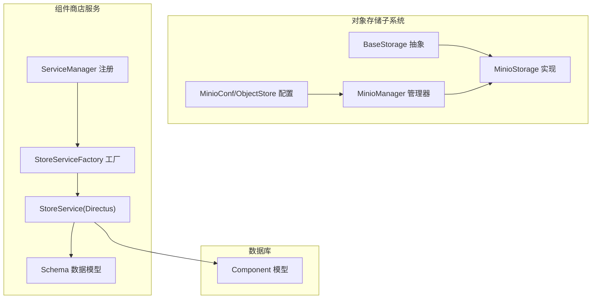
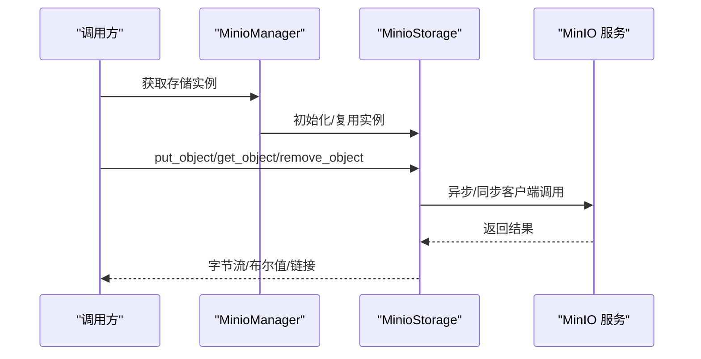
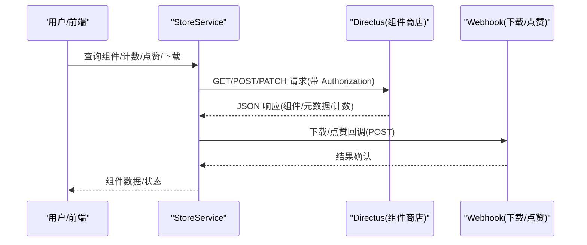
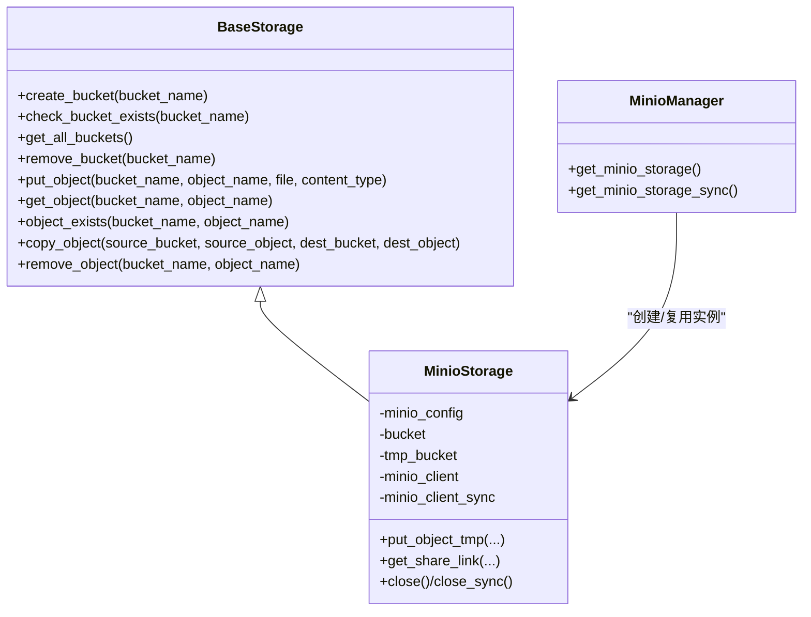
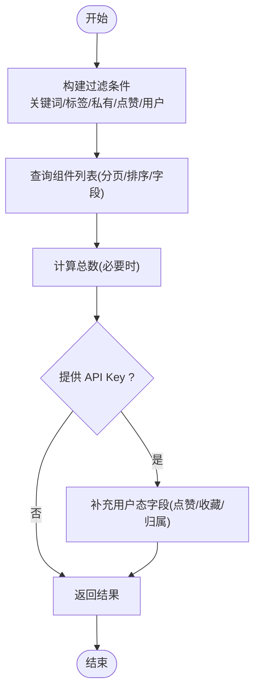
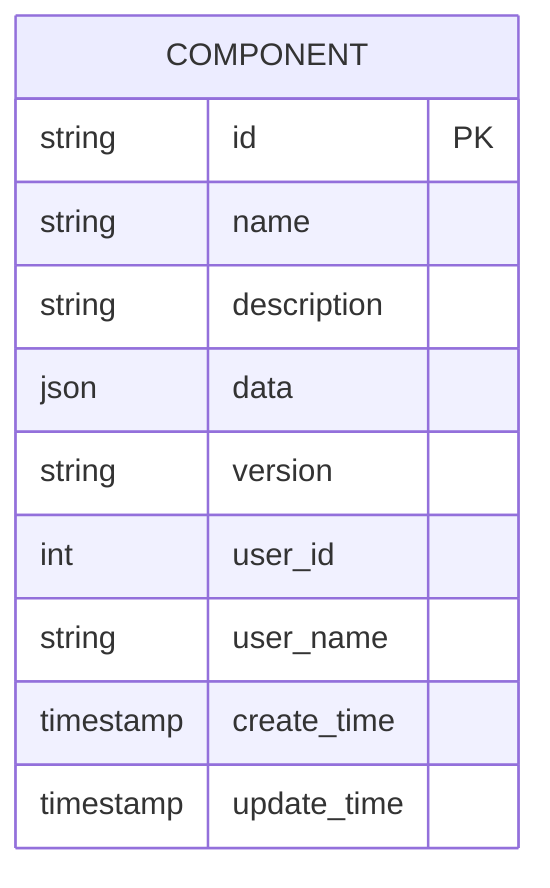
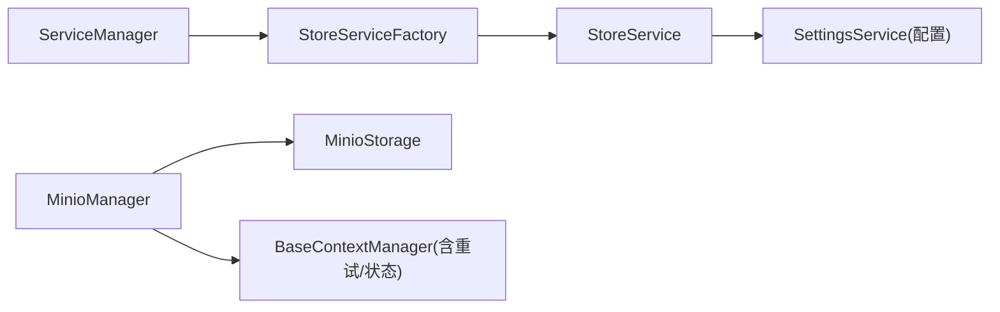

# 存储服务

<cite>
**本文引用的文件**
- [src/backend/bisheng/core/storage/base.py](file://src/backend/bisheng/core/storage/base.py)
- [src/backend/bisheng/core/storage/minio/minio_storage.py](file://src/backend/bisheng/core/storage/minio/minio_storage.py)
- [src/backend/bisheng/core/storage/minio/minio_manager.py](file://src/backend/bisheng/core/storage/minio/minio_manager.py)
- [src/backend/bisheng/services/store/service.py](file://src/backend/bisheng/services/store/service.py)
- [src/backend/bisheng/services/store/schema.py](file://src/backend/bisheng/services/store/schema.py)
- [src/backend/bisheng/services/store/factory.py](file://src/backend/bisheng/services/store/factory.py)
- [src/backend/bisheng/core/config/settings.py](file://src/backend/bisheng/core/config/settings.py)
- [src/backend/bisheng/database/models/component.py](file://src/backend/bisheng/database/models/component.py)
- [src/backend/bisheng/services/manager.py](file://src/backend/bisheng/services/manager.py)
- [src/backend/bisheng/core/context/base.py](file://src/backend/bisheng/core/context/base.py)
</cite>

## 目录
1. [简介](#简介)
2. [项目结构](#项目结构)
3. [核心组件](#核心组件)
4. [架构总览](#架构总览)
5. [详细组件分析](#详细组件分析)
6. [依赖关系分析](#依赖关系分析)
7. [性能考量](#性能考量)
8. [故障排查指南](#故障排查指南)
9. [结论](#结论)
10. [附录：配置与使用示例](#附录配置与使用示例)

## 简介
本文件系统性梳理 Bisheng 的“存储服务”，涵盖对象存储（MinIO）与外部组件商店（Directus）两大后端。文档从架构设计、接口规范、数据持久化与访问模式、配置项、与数据库层交互、一致性与可靠性保障等方面进行深入解析，并提供可操作的使用示例与最佳实践。

## 项目结构
围绕存储能力的关键目录与文件如下：
- 对象存储抽象与实现
  - 抽象基类：core/storage/base.py
  - MinIO 实现：core/storage/minio/minio_storage.py
  - 全局管理器：core/storage/minio/minio_manager.py
  - 配置模型：core/config/settings.py 中的 MinioConf/ObjectStore
- 组件商店服务
  - 服务实现：services/store/service.py
  - 数据模型：services/store/schema.py
  - 工厂：services/store/factory.py
  - 服务注册：services/manager.py
- 数据库模型（与组件持久化相关）
  - database/models/component.py

**图表来源**
- [src/backend/bisheng/core/storage/base.py](file://src/backend/bisheng/core/storage/base.py#L6-L101)
- [src/backend/bisheng/core/storage/minio/minio_storage.py](file://src/backend/bisheng/core/storage/minio/minio_storage.py#L20-L433)
- [src/backend/bisheng/core/storage/minio/minio_manager.py](file://src/backend/bisheng/core/storage/minio/minio_manager.py#L12-L88)
- [src/backend/bisheng/core/config/settings.py](file://src/backend/bisheng/core/config/settings.py#L102-L121)
- [src/backend/bisheng/services/store/service.py](file://src/backend/bisheng/services/store/service.py#L44-L537)
- [src/backend/bisheng/services/store/schema.py](file://src/backend/bisheng/services/store/schema.py#L1-L77)
- [src/backend/bisheng/services/store/factory.py](file://src/backend/bisheng/services/store/factory.py#L10-L15)
- [src/backend/bisheng/services/manager.py](file://src/backend/bisheng/services/manager.py#L11-L80)
- [src/backend/bisheng/database/models/component.py](file://src/backend/bisheng/database/models/component.py#L11-L67)

**章节来源**
- [src/backend/bisheng/core/storage/base.py](file://src/backend/bisheng/core/storage/base.py#L1-L101)
- [src/backend/bisheng/core/storage/minio/minio_storage.py](file://src/backend/bisheng/core/storage/minio/minio_storage.py#L1-L433)
- [src/backend/bisheng/core/storage/minio/minio_manager.py](file://src/backend/bisheng/core/storage/minio/minio_manager.py#L1-L88)
- [src/backend/bisheng/services/store/service.py](file://src/backend/bisheng/services/store/service.py#L1-L537)
- [src/backend/bisheng/services/store/schema.py](file://src/backend/bisheng/services/store/schema.py#L1-L77)
- [src/backend/bisheng/services/store/factory.py](file://src/backend/bisheng/services/store/factory.py#L1-L15)
- [src/backend/bisheng/services/manager.py](file://src/backend/bisheng/services/manager.py#L1-L149)
- [src/backend/bisheng/core/config/settings.py](file://src/backend/bisheng/core/config/settings.py#L102-L121)
- [src/backend/bisheng/database/models/component.py](file://src/backend/bisheng/database/models/component.py#L1-L67)

## 核心组件
- 对象存储抽象 BaseStorage：定义统一的桶与对象生命周期、上传下载、复制删除、存在性检查等接口，支持异步与同步版本。
- MinIOStorage：基于 MinIO 客户端实现，内置公共桶与临时桶，支持匿名读策略、生命周期规则、分享链接生成等。
- MinioManager：全局上下文管理器，负责实例初始化、健康检查、连接池与资源清理。
- StoreService：对接外部组件商店（Directus），提供组件查询、计数、点赞、下载、上传/更新、标签获取等能力；支持 API Key 上下文与用户态过滤。
- Schema：对请求/响应进行 Pydantic 校验与字段映射。
- 工厂与服务注册：StoreServiceFactory 与 ServiceManager 提供按需创建与依赖注入。

**章节来源**
- [src/backend/bisheng/core/storage/base.py](file://src/backend/bisheng/core/storage/base.py#L6-L101)
- [src/backend/bisheng/core/storage/minio/minio_storage.py](file://src/backend/bisheng/core/storage/minio/minio_storage.py#L20-L433)
- [src/backend/bisheng/core/storage/minio/minio_manager.py](file://src/backend/bisheng/core/storage/minio/minio_manager.py#L12-L88)
- [src/backend/bisheng/services/store/service.py](file://src/backend/bisheng/services/store/service.py#L44-L537)
- [src/backend/bisheng/services/store/schema.py](file://src/backend/bisheng/services/store/schema.py#L1-L77)
- [src/backend/bisheng/services/store/factory.py](file://src/backend/bisheng/services/store/factory.py#L10-L15)
- [src/backend/bisheng/services/manager.py](file://src/backend/bisheng/services/manager.py#L11-L80)

## 架构总览
对象存储与组件商店两条路径并行：
- 对象存储：通过 MinioManager 获取 MinioStorage 实例，执行桶与对象操作；支持分享链接与生命周期策略。
- 组件商店：StoreService 基于 SettingsService 获取 STORE_URL 等配置，封装 HTTP 请求与 Directus API 交互，结合 Schema 进行数据校验与转换。

**图表来源**
- [src/backend/bisheng/core/storage/minio/minio_manager.py](file://src/backend/bisheng/core/storage/minio/minio_manager.py#L54-L88)
- [src/backend/bisheng/core/storage/minio/minio_storage.py](file://src/backend/bisheng/core/storage/minio/minio_storage.py#L110-L214)

**图表来源**
- [src/backend/bisheng/services/store/service.py](file://src/backend/bisheng/services/store/service.py#L93-L132)
- [src/backend/bisheng/services/store/service.py](file://src/backend/bisheng/services/store/service.py#L217-L254)
- [src/backend/bisheng/services/store/service.py](file://src/backend/bisheng/services/store/service.py#L296-L315)
- [src/backend/bisheng/services/store/service.py](file://src/backend/bisheng/services/store/service.py#L416-L447)

## 详细组件分析

### 对象存储抽象与实现
- 抽象接口覆盖：桶管理（创建/列举/删除）、对象管理（上传/下载/存在性/复制/删除）、分享链接生成。
- MinIO 实现要点：
  - 同步/异步客户端并存，自动处理文件长度与流指针重置。
  - 默认公共桶与临时桶，临时桶设置生命周期（如 3 天过期）。
  - 匿名只读策略针对知识图片路径，便于前端直链访问。
  - 分享链接支持去除后端地址前缀，走前端 Nginx 代理。

**图表来源**
- [src/backend/bisheng/core/storage/base.py](file://src/backend/bisheng/core/storage/base.py#L6-L101)
- [src/backend/bisheng/core/storage/minio/minio_storage.py](file://src/backend/bisheng/core/storage/minio/minio_storage.py#L20-L433)
- [src/backend/bisheng/core/storage/minio/minio_manager.py](file://src/backend/bisheng/core/storage/minio/minio_manager.py#L12-L88)

**章节来源**
- [src/backend/bisheng/core/storage/base.py](file://src/backend/bisheng/core/storage/base.py#L6-L101)
- [src/backend/bisheng/core/storage/minio/minio_storage.py](file://src/backend/bisheng/core/storage/minio/minio_storage.py#L20-L433)
- [src/backend/bisheng/core/storage/minio/minio_manager.py](file://src/backend/bisheng/core/storage/minio/minio_manager.py#L12-L88)

### 组件商店服务（Directus）
- 能力范围
  - 查询与计数：支持关键词搜索、标签过滤、私有/公开过滤、按用户或点赞过滤。
  - 上传/更新：组件数据写入，标签预处理，错误消息映射。
  - 下载/点赞：触发 webhook，返回组件数据与元信息。
  - 用户态：通过 API Key 获取当前用户，支持“仅看我的”与“仅看点赞”的过滤。
- 关键流程
  - 构建过滤条件 → 查询组件 → 计算总数 → 若提供 API Key，则补充“是否点赞”等用户态字段。
  - 下载时若元信息缺失，根据节点数据动态构建元信息。

**图表来源**
- [src/backend/bisheng/services/store/service.py](file://src/backend/bisheng/services/store/service.py#L165-L208)
- [src/backend/bisheng/services/store/service.py](file://src/backend/bisheng/services/store/service.py#L217-L254)
- [src/backend/bisheng/services/store/service.py](file://src/backend/bisheng/services/store/service.py#L448-L537)

**章节来源**
- [src/backend/bisheng/services/store/service.py](file://src/backend/bisheng/services/store/service.py#L44-L537)
- [src/backend/bisheng/services/store/schema.py](file://src/backend/bisheng/services/store/schema.py#L1-L77)
- [src/backend/bisheng/services/store/factory.py](file://src/backend/bisheng/services/store/factory.py#L10-L15)
- [src/backend/bisheng/services/manager.py](file://src/backend/bisheng/services/manager.py#L11-L80)

### 数据库层交互与一致性
- 组件持久化：Component 模型用于本地组件的保存与检索，支持按用户 ID、名称、时间等查询。
- 与存储服务的关系：StoreService 负责外部组件商店的读写；本地组件持久化由数据库 DAO 方法完成，二者职责分离，避免直接耦合。

**图表来源**
- [src/backend/bisheng/database/models/component.py](file://src/backend/bisheng/database/models/component.py#L24-L67)

**章节来源**
- [src/backend/bisheng/database/models/component.py](file://src/backend/bisheng/database/models/component.py#L11-L67)

## 依赖关系分析
- 服务注册与依赖
  - ServiceManager 统一注册各服务工厂，按依赖顺序创建服务实例，确保 SettingsService 等前置依赖先就绪。
  - StoreServiceFactory 创建 StoreService，依赖 SettingsService 提供的 STORE_URL 等配置。
- 上下文管理
  - MinioManager 基于 BaseContextManager，支持异步/同步初始化与清理，具备指数回退重试与状态机控制，保证资源安全释放。

**图表来源**
- [src/backend/bisheng/services/manager.py](file://src/backend/bisheng/services/manager.py#L11-L80)
- [src/backend/bisheng/services/store/factory.py](file://src/backend/bisheng/services/store/factory.py#L10-L15)
- [src/backend/bisheng/core/storage/minio/minio_manager.py](file://src/backend/bisheng/core/storage/minio/minio_manager.py#L12-L88)
- [src/backend/bisheng/core/context/base.py](file://src/backend/bisheng/core/context/base.py#L216-L497)

**章节来源**
- [src/backend/bisheng/services/manager.py](file://src/backend/bisheng/services/manager.py#L11-L80)
- [src/backend/bisheng/core/storage/minio/minio_manager.py](file://src/backend/bisheng/core/storage/minio/minio_manager.py#L12-L88)
- [src/backend/bisheng/core/context/base.py](file://src/backend/bisheng/core/context/base.py#L216-L497)

## 性能考量
- 对象存储
  - 使用异步客户端进行上传/下载，减少阻塞；自动推断数据长度，避免不必要的 seek。
  - 临时桶生命周期短，降低长期占用与成本。
- 组件商店
  - 查询时优先使用聚合计数与分页，避免一次性拉取大量数据。
  - 在未提供 API Key 时尽量避免触发需要鉴权的请求，减少失败重试。
- 上下文管理
  - MinioManager 的重试与状态机避免频繁重建实例带来的开销。

[本节为通用指导，无需具体文件引用]

## 故障排查指南
- MinIO 相关
  - 无法创建/列举桶：检查 endpoint、证书校验、权限；确认已启用证书校验开关。
  - 上传失败：确认文件长度推断逻辑与流指针位置；检查 content_type。
  - 分享链接异常：确认分享主机与前端代理配置，必要时移除后端主机前缀。
- 组件商店
  - 401/403：核对 API Key 是否有效；检查用户态过滤条件与上下文。
  - 上传失败：关注 Directus 返回的错误消息映射，避免同名冲突。
  - Webhook 失败：检查 DOWNLOAD_WEBHOOK_URL/LIKE_WEBHOOK_URL 配置与可达性。
- 服务生命周期
  - MinioManager 初始化失败：查看重试日志与最终异常；确认配置正确。

**章节来源**
- [src/backend/bisheng/core/storage/minio/minio_storage.py](file://src/backend/bisheng/core/storage/minio/minio_storage.py#L110-L214)
- [src/backend/bisheng/core/storage/minio/minio_storage.py](file://src/backend/bisheng/core/storage/minio/minio_storage.py#L364-L406)
- [src/backend/bisheng/services/store/service.py](file://src/backend/bisheng/services/store/service.py#L77-L92)
- [src/backend/bisheng/services/store/service.py](file://src/backend/bisheng/services/store/service.py#L317-L347)
- [src/backend/bisheng/services/store/service.py](file://src/backend/bisheng/services/store/service.py#L119-L132)
- [src/backend/bisheng/core/storage/minio/minio_manager.py](file://src/backend/bisheng/core/storage/minio/minio_manager.py#L54-L88)
- [src/backend/bisheng/core/context/base.py](file://src/backend/bisheng/core/context/base.py#L216-L241)

## 结论
Bisheng 的存储体系以“抽象统一 + 多后端适配”为核心：对象存储通过 MinIO 实现高可用与低成本；组件商店通过 StoreService 与 Directus 解耦业务与数据；服务注册与上下文管理确保运行时的稳定性与可维护性。建议在生产中结合生命周期策略、鉴权与监控完善可靠性保障。

[本节为总结，无需具体文件引用]

## 附录：配置与使用示例

### 配置项
- MinIO 配置（MinioConf/ObjectStore）
  - 类型：object_storage.type
  - MinIO 参数：endpoint、access_key、secret_key、secure、cert_check、public_bucket、tmp_bucket、sharepoint、share_schema、share_cert_check
- 组件商店配置（StoreService）
  - STORE_URL、DOWNLOAD_WEBHOOK_URL、LIKE_WEBHOOK_URL
- 数据库组件
  - Component 模型字段：name、description、data、version、user_id、user_name、create_time、update_time

**章节来源**
- [src/backend/bisheng/core/config/settings.py](file://src/backend/bisheng/core/config/settings.py#L102-L121)
- [src/backend/bisheng/services/store/service.py](file://src/backend/bisheng/services/store/service.py#L51-L56)
- [src/backend/bisheng/database/models/component.py](file://src/backend/bisheng/database/models/component.py#L11-L27)

### 接口设计与访问模式
- 对象存储
  - CRUD：create_bucket/check_bucket_exists/get_all_buckets/remove_bucket
  - 对象：put_object/get_object/object_exists/copy_object/remove_object
  - 批量/事务：未提供原生批量/事务接口，可通过多次调用组合实现；注意幂等性与错误恢复
- 组件商店
  - 查询：query_components/count_components/build_filter_conditions
  - 写入：upload/update
  - 行为：download/like_component/call_webhook
  - 用户态：check_api_key/user_data_context

**章节来源**
- [src/backend/bisheng/core/storage/base.py](file://src/backend/bisheng/core/storage/base.py#L9-L101)
- [src/backend/bisheng/core/storage/minio/minio_storage.py](file://src/backend/bisheng/core/storage/minio/minio_storage.py#L82-L109)
- [src/backend/bisheng/services/store/service.py](file://src/backend/bisheng/services/store/service.py#L217-L254)
- [src/backend/bisheng/services/store/service.py](file://src/backend/bisheng/services/store/service.py#L317-L383)

### 使用示例（步骤级）
- 获取 MinIO 实例并上传对象
  - 步骤：通过 MinioManager 获取实例 → 调用 put_object → 可选：生成分享链接
  - 参考：[MinioManager](file://src/backend/bisheng/core/storage/minio/minio_manager.py#L54-L88)，[MinioStorage.put_object](file://src/backend/bisheng/core/storage/minio/minio_storage.py#L110-L158)
- 查询组件并按标签筛选
  - 步骤：构造过滤条件 → 调用 query_components → 处理结果与总数
  - 参考：[build_filter_conditions](file://src/backend/bisheng/services/store/service.py#L165-L208)，[query_components](file://src/backend/bisheng/services/store/service.py#L217-L254)
- 上传组件到商店
  - 步骤：准备 StoreComponentCreate → 调用 upload → 处理返回的组件 ID
  - 参考：[StoreComponentCreate](file://src/backend/bisheng/services/store/schema.py#L68-L77)，[upload](file://src/backend/bisheng/services/store/service.py#L317-L347)
- 下载组件并触发下载回调
  - 步骤：调用 download → 触发 webhook → 校验元信息
  - 参考：[download](file://src/backend/bisheng/services/store/service.py#L296-L315)，[call_webhook](file://src/backend/bisheng/services/store/service.py#L119-L132)

### 数据模型与索引策略
- 组件模型
  - 名称与版本建立索引，便于快速检索与去重
  - 用户 ID 与创建时间建立索引，支持按用户与时间排序
- 查询优化建议
  - 组件商店：优先使用精确字段过滤与分页；对标签/用户名/描述使用模糊匹配时限制范围
  - 对象存储：上传时明确 content_type；大文件采用流式上传并设置长度

**章节来源**
- [src/backend/bisheng/database/models/component.py](file://src/backend/bisheng/database/models/component.py#L11-L27)
- [src/backend/bisheng/services/store/service.py](file://src/backend/bisheng/services/store/service.py#L155-L163)