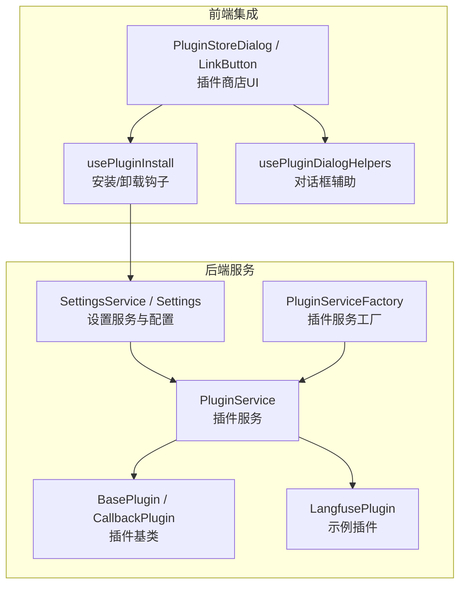
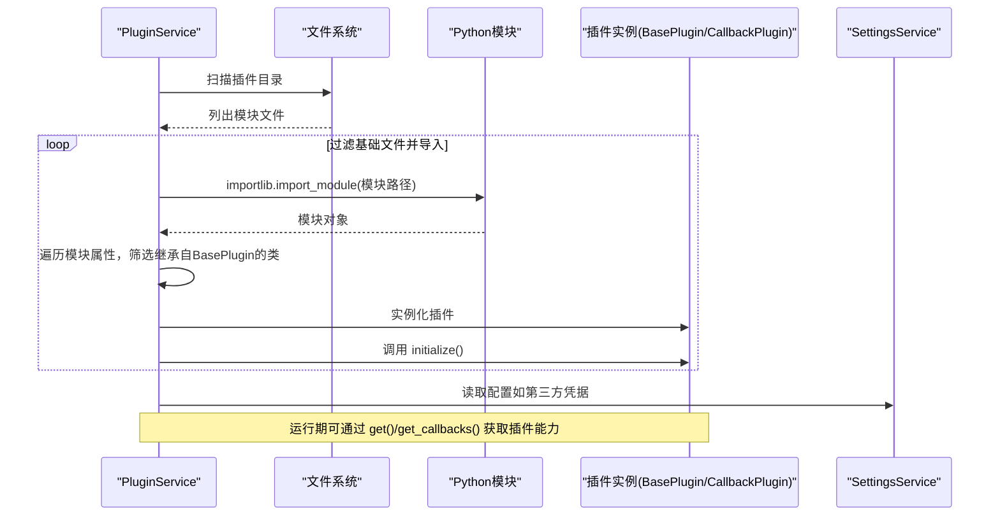
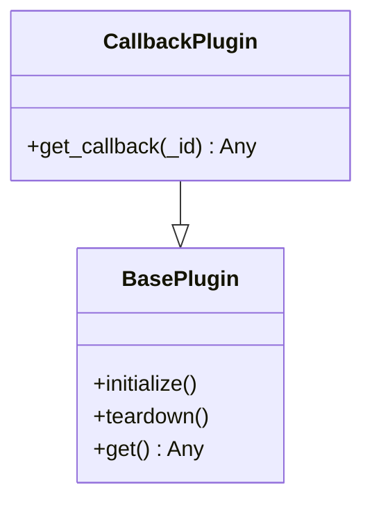
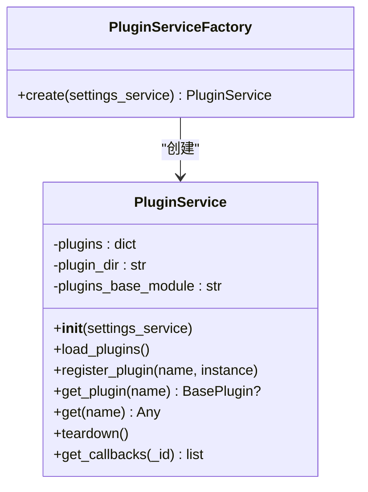
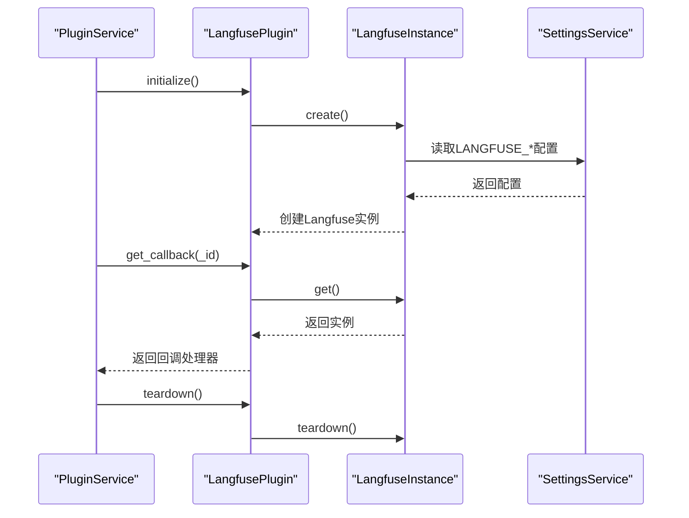
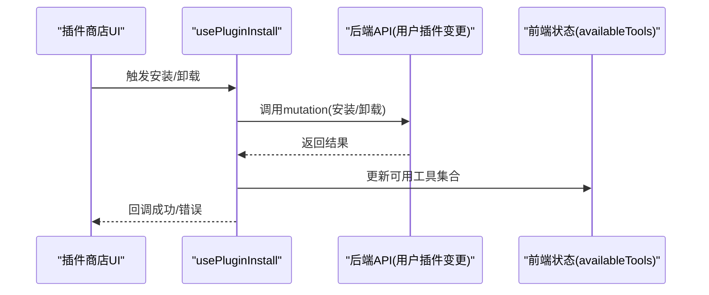
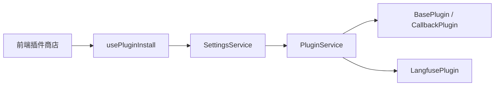

# 插件服务

<cite>
**本文引用的文件**
- [src/backend/bisheng/services/plugins/base.py](file://src/backend/bisheng/services/plugins/base.py)
- [src/backend/bisheng/services/plugins/service.py](file://src/backend/bisheng/services/plugins/service.py)
- [src/backend/bisheng/services/plugins/factory.py](file://src/backend/bisheng/services/plugins/factory.py)
- [src/backend/bisheng/services/plugins/langfuse_plugin.py](file://src/backend/bisheng/services/plugins/langfuse_plugin.py)
- [src/backend/bisheng/services/settings/base.py](file://src/backend/bisheng/services/settings/base.py)
- [src/backend/bisheng/services/settings/service.py](file://src/backend/bisheng/services/settings/service.py)
- [src/backend/bisheng/services/plugins/__init__.py](file://src/backend/bisheng/services/plugins/__init__.py)
- [src/backend/bisheng/services/plugins/__main__.py](file://src/backend/bisheng/services/plugins/__main__.py)
- [src/frontend/client/src/hooks/Plugins/usePluginInstall.ts](file://src/frontend/client/src/hooks/Plugins/usePluginInstall.ts)
- [src/frontend/client/src/hooks/Plugins/usePluginDialogHelpers.ts](file://src/frontend/client/src/hooks/Plugins/usePluginDialogHelpers.ts)
- [src/frontend/client/src/components/Plugins/Store/PluginStoreDialog.tsx](file://src/frontend/client/src/components/Plugins/Store/PluginStoreDialog.tsx)
- [src/frontend/client/src/components/Plugins/Store/PluginStoreLinkButton.tsx](file://src/frontend/client/src/components/Plugins/Store/PluginStoreLinkButton.tsx)
</cite>

## 目录
1. [简介](#简介)
2. [项目结构](#项目结构)
3. [核心组件](#核心组件)
4. [架构总览](#架构总览)
5. [组件详解](#组件详解)
6. [依赖关系分析](#依赖关系分析)
7. [性能考量](#性能考量)
8. [故障排查指南](#故障排查指南)
9. [结论](#结论)
10. [附录：开发与发布指南](#附录开发与发布指南)

## 简介
本文件系统性梳理 Bisheng 插件服务的设计与实现，覆盖插件发现、加载与生命周期管理；插件接口抽象（插件契约、事件系统与钩子机制）；配置项与加载顺序；与主系统的集成方式；以及动态安装/卸载能力。同时提供可操作的开发示例与最佳实践，帮助开发者快速创建、注册与发布自定义插件，支撑系统的扩展性与生态建设。

## 项目结构
插件服务位于后端 Python 包中，采用“服务层 + 插件模块”的分层组织方式：
- 服务层：统一的插件服务与工厂类，负责插件发现、注册、生命周期管理与回调聚合。
- 插件模块：具体插件实现，如链路观测插件等，遵循统一的插件基类与回调接口。
- 设置层：提供全局设置与环境变量解析，支持插件运行所需的外部配置（如第三方 SDK 凭据）。
- 前端集成：提供插件商店交互、安装/卸载与工具可用性状态更新的前端逻辑。

图表来源
- [src/backend/bisheng/services/plugins/service.py](file://src/backend/bisheng/services/plugins/service.py#L14-L67)
- [src/backend/bisheng/services/plugins/factory.py](file://src/backend/bisheng/services/plugins/factory.py#L10-L17)
- [src/backend/bisheng/services/plugins/base.py](file://src/backend/bisheng/services/plugins/base.py#L4-L17)
- [src/backend/bisheng/services/plugins/langfuse_plugin.py](file://src/backend/bisheng/services/plugins/langfuse_plugin.py#L54-L82)
- [src/backend/bisheng/services/settings/service.py](file://src/backend/bisheng/services/settings/service.py#L10-L44)
- [src/backend/bisheng/services/settings/base.py](file://src/backend/bisheng/services/settings/base.py#L18-L200)
- [src/frontend/client/src/components/Plugins/Store/PluginStoreDialog.tsx](file://src/frontend/client/src/components/Plugins/Store/PluginStoreDialog.tsx#L99-L121)
- [src/frontend/client/src/hooks/Plugins/usePluginInstall.ts](file://src/frontend/client/src/hooks/Plugins/usePluginInstall.ts#L21-L77)
- [src/frontend/client/src/hooks/Plugins/usePluginDialogHelpers.ts](file://src/frontend/client/src/hooks/Plugins/usePluginDialogHelpers.ts#L45-L79)

章节来源
- [src/backend/bisheng/services/plugins/service.py](file://src/backend/bisheng/services/plugins/service.py#L14-L67)
- [src/backend/bisheng/services/plugins/base.py](file://src/backend/bisheng/services/plugins/base.py#L4-L17)
- [src/backend/bisheng/services/plugins/factory.py](file://src/backend/bisheng/services/plugins/factory.py#L10-L17)
- [src/backend/bisheng/services/plugins/langfuse_plugin.py](file://src/backend/bisheng/services/plugins/langfuse_plugin.py#L54-L82)
- [src/backend/bisheng/services/settings/base.py](file://src/backend/bisheng/services/settings/base.py#L18-L200)
- [src/backend/bisheng/services/settings/service.py](file://src/backend/bisheng/services/settings/service.py#L10-L44)
- [src/frontend/client/src/hooks/Plugins/usePluginInstall.ts](file://src/frontend/client/src/hooks/Plugins/usePluginInstall.ts#L21-L77)
- [src/frontend/client/src/hooks/Plugins/usePluginDialogHelpers.ts](file://src/frontend/client/src/hooks/Plugins/usePluginDialogHelpers.ts#L45-L79)
- [src/frontend/client/src/components/Plugins/Store/PluginStoreDialog.tsx](file://src/frontend/client/src/components/Plugins/Store/PluginStoreDialog.tsx#L99-L121)

## 核心组件
- 插件基类与回调接口
  - BasePlugin：定义 initialize、teardown、get 等生命周期与访问接口。
  - CallbackPlugin：在 BasePlugin 基础上扩展 get_callback，用于返回事件/回调处理器。
- 插件服务
  - PluginService：负责扫描插件目录、动态导入模块、识别继承自 BasePlugin 的类、实例化并注册插件；提供按名称获取插件与回调聚合方法。
- 插件工厂
  - PluginServiceFactory：通过工厂模式创建插件服务实例，便于依赖注入与统一管理。
- 示例插件
  - LangfusePlugin：演示如何基于 CallbackPlugin 提供回调处理器，并在 initialize/teardown 中管理第三方 SDK 实例。
- 设置与配置
  - SettingsService/Settings：从 YAML 加载配置，校验键值，支持默认路径与环境变量覆盖；为插件提供外部凭据与参数（如 Langfuse 凭据）。

章节来源
- [src/backend/bisheng/services/plugins/base.py](file://src/backend/bisheng/services/plugins/base.py#L4-L17)
- [src/backend/bisheng/services/plugins/service.py](file://src/backend/bisheng/services/plugins/service.py#L14-L67)
- [src/backend/bisheng/services/plugins/factory.py](file://src/backend/bisheng/services/plugins/factory.py#L10-L17)
- [src/backend/bisheng/services/plugins/langfuse_plugin.py](file://src/backend/bisheng/services/plugins/langfuse_plugin.py#L54-L82)
- [src/backend/bisheng/services/settings/base.py](file://src/backend/bisheng/services/settings/base.py#L18-L200)
- [src/backend/bisheng/services/settings/service.py](file://src/backend/bisheng/services/settings/service.py#L10-L44)

## 架构总览
插件服务采用“约定式发现 + 动态导入 + 回调聚合”的架构：
- 发现与加载：服务启动时扫描插件目录，过滤基础文件，动态导入模块并查找继承自 BasePlugin 的类进行实例化与注册。
- 生命周期：每个插件在注册后执行 initialize；服务关闭时统一调用 teardown。
- 回调系统：对实现 CallbackPlugin 的插件，统一收集其 get_callback 返回的回调处理器，供上层业务使用。
- 集成点：前端通过用户插件变更的 mutation 更新可用工具集合；设置服务为插件提供外部配置。

图表来源
- [src/backend/bisheng/services/plugins/service.py](file://src/backend/bisheng/services/plugins/service.py#L24-L45)
- [src/backend/bisheng/services/settings/service.py](file://src/backend/bisheng/services/settings/service.py#L18-L44)

## 组件详解

### 插件基类与回调接口
- BasePlugin
  - initialize/teardown：生命周期钩子，用于资源初始化与释放。
  - get：返回插件对外暴露的能力或数据。
- CallbackPlugin
  - 在 BasePlugin 基础上增加 get_callback，用于返回事件/追踪回调处理器，典型用于日志、观测或链路追踪。

图表来源
- [src/backend/bisheng/services/plugins/base.py](file://src/backend/bisheng/services/plugins/base.py#L4-L17)

章节来源
- [src/backend/bisheng/services/plugins/base.py](file://src/backend/bisheng/services/plugins/base.py#L4-L17)

### 插件服务与工厂
- PluginService
  - 负责插件目录扫描、动态导入、类识别与注册；提供 get_plugin/get/teardown；聚合 CallbackPlugin 的回调。
- PluginServiceFactory
  - 工厂类，按约定创建 PluginService 实例，便于依赖注入。

图表来源
- [src/backend/bisheng/services/plugins/service.py](file://src/backend/bisheng/services/plugins/service.py#L14-L67)
- [src/backend/bisheng/services/plugins/factory.py](file://src/backend/bisheng/services/plugins/factory.py#L10-L17)

章节来源
- [src/backend/bisheng/services/plugins/service.py](file://src/backend/bisheng/services/plugins/service.py#L14-L67)
- [src/backend/bisheng/services/plugins/factory.py](file://src/backend/bisheng/services/plugins/factory.py#L10-L17)

### 示例插件：LangfusePlugin
- LangfusePlugin 继承 CallbackPlugin，提供 get_callback 返回观测回调处理器；initialize/teardown 管理 Langfuse 实例；get 返回实例。
- 依赖 SettingsService 提供 Langfuse 凭据与主机地址；若未配置或第三方库不可用则降级为空。

图表来源
- [src/backend/bisheng/services/plugins/langfuse_plugin.py](file://src/backend/bisheng/services/plugins/langfuse_plugin.py#L54-L82)
- [src/backend/bisheng/services/settings/service.py](file://src/backend/bisheng/services/settings/service.py#L18-L44)

章节来源
- [src/backend/bisheng/services/plugins/langfuse_plugin.py](file://src/backend/bisheng/services/plugins/langfuse_plugin.py#L54-L82)
- [src/backend/bisheng/services/settings/base.py](file://src/backend/bisheng/services/settings/base.py#L52-L57)
- [src/backend/bisheng/services/settings/service.py](file://src/backend/bisheng/services/settings/service.py#L18-L44)

### 前端集成与动态安装/卸载
- usePluginInstall：封装插件安装/卸载的 mutation 调用，成功后更新前端可用工具集合。
- usePluginDialogHelpers：处理插件商店对话框的分页、搜索、选中等交互状态。
- PluginStoreDialog/PluginStoreLinkButton：提供插件商店入口与页面行为。

图表来源
- [src/frontend/client/src/hooks/Plugins/usePluginInstall.ts](file://src/frontend/client/src/hooks/Plugins/usePluginInstall.ts#L21-L77)
- [src/frontend/client/src/hooks/Plugins/usePluginDialogHelpers.ts](file://src/frontend/client/src/hooks/Plugins/usePluginDialogHelpers.ts#L45-L79)
- [src/frontend/client/src/components/Plugins/Store/PluginStoreDialog.tsx](file://src/frontend/client/src/components/Plugins/Store/PluginStoreDialog.tsx#L99-L121)

章节来源
- [src/frontend/client/src/hooks/Plugins/usePluginInstall.ts](file://src/frontend/client/src/hooks/Plugins/usePluginInstall.ts#L21-L77)
- [src/frontend/client/src/hooks/Plugins/usePluginDialogHelpers.ts](file://src/frontend/client/src/hooks/Plugins/usePluginDialogHelpers.ts#L45-L79)
- [src/frontend/client/src/components/Plugins/Store/PluginStoreDialog.tsx](file://src/frontend/client/src/components/Plugins/Store/PluginStoreDialog.tsx#L99-L121)

## 依赖关系分析
- 插件服务依赖设置服务以获取外部配置；LangfusePlugin 依赖 SettingsService 读取第三方凭据。
- 插件服务通过 importlib 动态导入插件模块，避免硬编码依赖，提升可扩展性。
- 前端通过数据层与状态管理更新工具可用性，与后端插件安装/卸载流程解耦。

图表来源
- [src/backend/bisheng/services/settings/service.py](file://src/backend/bisheng/services/settings/service.py#L10-L44)
- [src/backend/bisheng/services/plugins/service.py](file://src/backend/bisheng/services/plugins/service.py#L14-L67)
- [src/backend/bisheng/services/plugins/base.py](file://src/backend/bisheng/services/plugins/base.py#L4-L17)
- [src/backend/bisheng/services/plugins/langfuse_plugin.py](file://src/backend/bisheng/services/plugins/langfuse_plugin.py#L54-L82)
- [src/frontend/client/src/hooks/Plugins/usePluginInstall.ts](file://src/frontend/client/src/hooks/Plugins/usePluginInstall.ts#L21-L77)

章节来源
- [src/backend/bisheng/services/plugins/service.py](file://src/backend/bisheng/services/plugins/service.py#L14-L67)
- [src/backend/bisheng/services/settings/service.py](file://src/backend/bisheng/services/settings/service.py#L10-L44)
- [src/frontend/client/src/hooks/Plugins/usePluginInstall.ts](file://src/frontend/client/src/hooks/Plugins/usePluginInstall.ts#L21-L77)

## 性能考量
- 动态导入成本：插件扫描与导入发生在服务初始化阶段，建议控制插件数量与体积，避免阻塞启动。
- 回调聚合：get_callbacks 会遍历所有插件，若插件数量较多，应避免在热路径频繁调用；可缓存回调列表。
- 日志与异常：插件加载失败会被记录但不会中断整体初始化，确保系统稳定性；建议在生产环境开启更细粒度的日志级别。
- 第三方 SDK 初始化：Langfuse 等 SDK 的初始化应在 initialize 中完成，teardown 中 flush 或清理，避免资源泄漏。

## 故障排查指南
- 插件未生效
  - 检查插件文件是否位于插件目录且未被排除（基础文件会被过滤）。
  - 确认插件类是否继承自 BasePlugin 且非抽象类。
  - 查看服务日志中关于插件导入的错误信息。
- 回调为空
  - 确认插件实现了 CallbackPlugin 并正确返回回调处理器。
  - 对于 LangfusePlugin，检查 SettingsService 是否已配置 LANGFUSE_PUBLIC_KEY/LANGFUSE_SECRET_KEY/LANGFUSE_HOST。
- 安装/卸载失败（前端）
  - 检查 usePluginInstall 的错误回调与网络请求状态。
  - 确认后端用户插件变更接口正常，前端状态更新逻辑是否触发。

章节来源
- [src/backend/bisheng/services/plugins/service.py](file://src/backend/bisheng/services/plugins/service.py#L24-L45)
- [src/backend/bisheng/services/plugins/langfuse_plugin.py](file://src/backend/bisheng/services/plugins/langfuse_plugin.py#L64-L82)
- [src/backend/bisheng/services/settings/service.py](file://src/backend/bisheng/services/settings/service.py#L18-L44)
- [src/frontend/client/src/hooks/Plugins/usePluginInstall.ts](file://src/frontend/client/src/hooks/Plugins/usePluginInstall.ts#L21-L77)

## 结论
Bisheng 插件服务通过清晰的插件基类与工厂模式、约定式发现与动态导入、以及回调聚合机制，构建了可扩展、可维护的插件体系。结合设置服务与前端安装/卸载流程，实现了从开发到部署的闭环。未来可在以下方向持续演进：插件依赖声明与版本管理、插件热加载与灰度发布、插件市场与生态治理。

## 附录：开发与发布指南

### 插件开发步骤
- 新建插件文件（例如 my_plugin.py），在插件目录下实现一个继承自 BasePlugin 或 CallbackPlugin 的类。
- 若为回调型插件，实现 get_callback 返回回调处理器；若为普通插件，实现 get 返回所需能力。
- 在 initialize 中完成资源初始化（如第三方 SDK 实例化），在 teardown 中释放资源。
- 将插件类命名为与文件名对应的类名，确保可被服务自动发现。

章节来源
- [src/backend/bisheng/services/plugins/base.py](file://src/backend/bisheng/services/plugins/base.py#L4-L17)
- [src/backend/bisheng/services/plugins/service.py](file://src/backend/bisheng/services/plugins/service.py#L24-L45)

### 注册与发布
- 注册：将插件文件放入插件目录，服务启动时自动扫描并注册。
- 发布：通过前端插件商店界面进行安装/卸载，前端 usePluginInstall 会调用后端用户插件变更接口，成功后更新前端可用工具集合。

章节来源
- [src/frontend/client/src/hooks/Plugins/usePluginInstall.ts](file://src/frontend/client/src/hooks/Plugins/usePluginInstall.ts#L21-L77)
- [src/frontend/client/src/components/Plugins/Store/PluginStoreDialog.tsx](file://src/frontend/client/src/components/Plugins/Store/PluginStoreDialog.tsx#L99-L121)

### 配置与加载顺序
- 插件目录：当前实现中插件目录为服务内部目录，后续可扩展为 Settings 中的 PLUGIN_DIR。
- 加载顺序：服务启动时一次性扫描并注册，不保证模块内类的顺序；建议插件内部自行处理依赖顺序。
- 外部配置：通过 SettingsService 从 YAML 加载配置，支持环境变量覆盖；LangfusePlugin 会读取 LANGFUSE_* 相关配置。

章节来源
- [src/backend/bisheng/services/plugins/service.py](file://src/backend/bisheng/services/plugins/service.py#L17-L22)
- [src/backend/bisheng/services/settings/base.py](file://src/backend/bisheng/services/settings/base.py#L52-L57)
- [src/backend/bisheng/services/settings/service.py](file://src/backend/bisheng/services/settings/service.py#L18-L44)